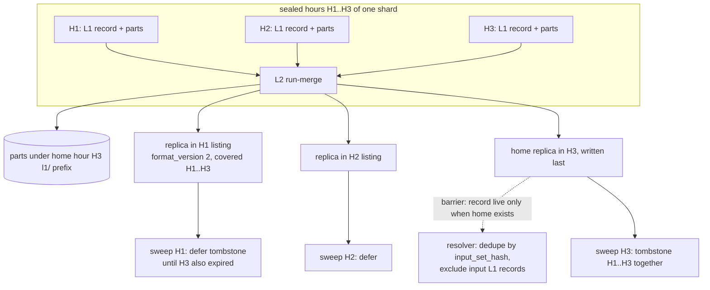

# ADR-0593: L2 cross-hour exact compaction tier

Status: Accepted as design direction (2026-09-16), implementation not
scheduled. Issue #593. Amends ADR-0018 (its "Compaction across multiple hours
(L2) is out of scope" sentence) and adopts ADR-0815 decision 7's cross-hour
record mechanism. Touches a frozen format (the `CompactionRecord` reader
floor); migration class C under ADR-0066 decision 4, readers before writers.

## Context

ADR-0018 compacts one sealed bucket at a time, `(tenant, signal, shard,
ingest_hour)`, and scopes L2 out: "Compaction across multiple hours (L2) is
out of scope and gets its own ADR"
(`docs/adrs/0018-l0-l1-compaction.md:125-126`). Every key in the
compaction family carries the hour: parts at
`t/<th>/<sig>/l1/<shard>/<hour>/<input_set_hash16>.<part>.<hash16>.rseg`,
records at `t/<th>/<sig>/c/<shard>/<hour>/l1.<input_set_hash16>.cmt`
(`0018-l0-l1-compaction.md:162-168`; builders at
`crates/ravel-commit/src/keys.rs:519-562`). No L2 key exists; the key
parser rejects an `l2.` tag by test (`keys.rs:1713-1714`).

Every consumer is bucket-local. The resolver lists one hour prefix per
bucket and builds its exclusion set fresh inside `process_bucket`
(`crates/ravel-catalog/src/catalog.rs:2769`), so a record in hour H can
exclude only L0 inputs listed in H, and a part is found only through a
record in its own hour's prefix (`catalog.rs:3883, 3910`). The retention
sweep deletes a bucket's commit records, compaction records, rewrite
records, L0 objects and the L1 parts under that hour's prefix as one unit
(`crates/ravel-maintain/src/retention.rs:611-615`), and a tombstoned bucket
contributes nothing to a snapshot (`docs/catalog-and-mvcc.md:1122`). The
compactor refuses a bucket that holds a rewrite record
(`crates/ravel-maintain/src/compact.rs:110-112`), and the rewrite
supersession walk stops at the bucket boundary
(`catalog.rs:4247-4249`). A part spanning several hours therefore has no
place to live today: its inputs in other hours would never be excluded,
and a tombstone on any covered hour would delete its rows for every hour
it covers or keep expired rows past the retention horizon.

What L2 buys is bounded by what L1 already does. Since ADR-0092 the L1
output is run-merged, about 240 runs per series per hour
(`docs/adrs/0092-run-merged-l1-and-rseg-v7.md:45-58`), and the remaining
cost ADR-0018 named is catalog metadata at about 20 bytes per run, "a
run-merging L2 is the named follow-up if run counts dominate"
(`0018-l0-l1-compaction.md:267-270`). Parts are capped at
`DEFAULT_MAX_L1_PART_BYTES` = 256 MiB
(`crates/ravel-maintain/src/config.rs:539`), and the query budget of 1024
segments (`0018-l0-l1-compaction.md:31-35`) is what an hour-per-object
layout pressures on wide windows. The compaction bench files an L2
follow-up when L1 bytes exceed 80% of L0 bytes
(`crates/ravel-bench/src/bin/compaction_bench.rs:370-378`).

ADR-0815 (Proposed) already designs the record shape a cross-hour object
needs, because its clustered output is the case where L2 pays most
(`docs/adrs/0815-clustered-compaction-and-object-pruning.md:544-556`). Its
decision 7 adds `covered_hour_min`/`covered_hour_max` to
`CompactionRecord`, publishes a cross-hour record at `format_version = 2`
with one replica per covered hour and the home replica written last as the
visibility barrier, defers a bucket's tombstone until every record covering
it is expired over its full range, and bounds scheduling with
`l2_retention_margin` (default 24 h) and `max_l2_covered_hours` (default
168) (`0815-clustered-compaction-and-object-pruning.md:1065-1320`).

The owner's decision for this ticket is to record the design and its
limits and schedule no code.

## Decision

1. **L2 is a run-merging rewrite of consecutive sealed hours' L1 outputs
   into one part set, exact by construction.** Inputs are the winning
   compaction records of N consecutive sealed hours of one `(tenant,
   signal, shard)`; L0 records are never L2 inputs (an hour without an L1
   record is compacted to L1 first). The rewrite primitive is the L1
   run-merge over a wider input set, so ADR-0018's conservation gate and
   ADR-0092's exactness property apply unchanged.

2. **The record stays inside the hourly namespace and uses ADR-0815
   decision 7's mechanism, not a new key family.** An L2 record is a
   `CompactionRecord` with `level = 2`, `format_version = 2`, the covered
   hour pair, and `input_set_hash` over the input L1 records. It is
   published under every covered hour at the existing
   `l1.<input_set_hash16>.cmt` key shape, home replica last; parts live
   under the home hour's `l1/` prefix. The resolver dedupes replicas by
   `input_set_hash`, excludes the input L1 records snapshot-wide once the
   home replica exists, and includes the record's inputs as if no record
   existed while it does not. A new `l2.` key tag is rejected because an
   unknown key shape fails every old reader loudly but forks every
   discovery, inclusion and audit path for what is still a compaction
   record; the version floor reuses the typed check the record carries.

3. **Retention is deferral, gated on the retention horizon.** A covered
   hour tombstones only when every record covering it is expired over its
   full covered range, and then every hour that record covers tombstones
   in the same sweep pass. The over-retention bound is the record's
   covered width, at most `max_l2_covered_hours`. The compactor selects
   only input hours at least `l2_retention_margin` short of expiry and
   re-checks every covered hour for a tombstone before the home write.

4. **Erasure interaction is a precondition, not a consequence.** An L2 run
   refuses any input hour holding a rewrite record, as L1 does. An erasure
   request that names a subject inside a live L2 record's covered range
   cannot be served by today's hour-scoped rewrite record: its supersession
   walk stops at the bucket boundary, so the L2 record could never be
   superseded. Before any L2 record is published, the erasure rewrite
   record must gain the same replica-per-covered-hour publication and home
   barrier, and the compactor must refuse to publish L2 over a tenant with
   erasure enabled until that lands. Absent that, an L2 record would make
   a subject's erasure impossible within its deadline.

5. **The achievable factor is stated, not promised.** For N covered hours
   whose L1 outputs total B bytes in P parts, the object count drops from
   P to `ceil(B / max_l1_part_bytes)`, a factor of at most N and of one
   when every input hour's L1 already fills its parts; runs per series
   drop by at most N. Where run counts do not dominate, L2 buys nothing.
   The bench's 80% gate is the trigger for scheduling, and a scheduled
   implementation states its expected factor on the tenant that triggered
   it before it runs.

6. **Implementation is not scheduled.** Nothing in this ADR changes any
   writer, reader or sweep today. When scheduled, the work follows the
   format-change procedure: ADR-0815's v2 reader floor lands first in
   every sweep, resolver and fold, decision 4's erasure replication lands
   second, and the L2 writer last.

## Rejected alternatives

- **A record key outside the hourly tombstone namespace (a per-shard `l2/`
  directory).** No existing listing reaches it, so the resolver needs a
  second LIST per shard per query, the sweep gains a second deletion path,
  and an old reader that never lists it silently misses the supersession
  and serves both L1 and L2 rows. Replicas inside each covered hour keep
  one LIST per bucket and fail old readers closed.
- **Split L2 parts at the retention boundary at merge time.** Couples the
  compactor to the retention frontier for every input hour and still
  cannot handle a horizon that moves after the merge.
- **Selective rewrite of an L2 record when its oldest hour expires.**
  Stands up an ADR-0064-shaped rewrite path for retention alone; deferral
  costs bounded over-retention and no new deletion mechanism.
- **L2 over L0 inputs directly.** Reintroduces the 3,600-objects-per-hour
  input listing across N hours and skips the L1 conservation gate; L1 is
  cheap and already sealed when L2 can run.
- **Implement now.** ADR-0815 is Proposed, decision 4's erasure replication
  is undesigned, and no measured tenant has crossed the bench's 80% gate.

## Consequences

- ADR-0018's scope sentence now reads as "L2 is designed in ADR-0593 and
  not scheduled"; nothing else in ADR-0018 changes.
- What changes for an operator: nothing until scheduling. When it lands,
  the visible effects are fewer objects and runs per wide window, a
  bounded delay of up to one L2 record's covered width before a covered
  hour is reclaimed, and two new maintain settings, `l2_retention_margin`
  and `max_l2_covered_hours`.
- Format-change classification for the scheduled work: class C, reader
  floor raise of `CompactionRecord` to version 2, readers before writers,
  no new key prefix, no segment-format bump. Checksum coverage is the
  same as an L1 record's and its RSEG parts'; whatever record-level
  integrity framing the commit family adopts applies to L2 records too.
- Follow-up tasks, in order, none scheduled:
  1. Land ADR-0815 decision 7's v2 reader, coverage gate and replica
     dedupe in every sweep, resolver and fold, with the six-case gate
     enumerated as tests.
  2. Design and land replica publication for erasure rewrite records over
     a covered range (its own ADR, amending ADR-0064).
  3. The L2 writer in `ravel-maintain`, the catalog resolution amendment in
     docs/catalog-and-mvcc.md, and the test named by the ticket triage:
     tombstone hour H while H+1..H+N stay live and assert the L2 part is
     still served for H+1.
  4. A pre-registered factor measurement on the triggering tenant.
