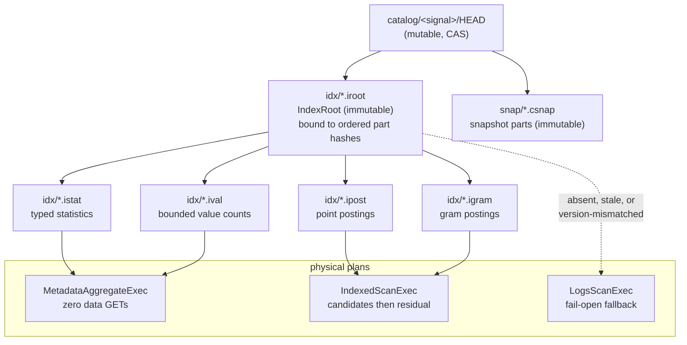

# ADR-0849: A snapshot-bound index plane on object storage

## Context

Ravel's read cost has a floor that no amount of CPU work removes. Measured on
the ClickBench `hits` corpus (tenant `clickbench-v4`: 3,469 objects, 12.03 GB,
99,997,497 rows) on an `r6a.4xlarge`:

- **34 of 41 statements read every one of the 3,469 objects and the entire
  12.03 GB.** There is no index and no clustering, so a statement that wants
  eleven rows pays for the whole corpus.
- The floor for anything touching the corpus is about **1.2 s**. Competitors
  answer the same statements from an index in **10-35 ms**: `q02` at 11 ms
  against our 1,195 ms, `q20` at 24 ms against our 3,216 ms.
- Hot totals over the 41 statements every system answered: ClickHouse 13.28 s,
  VictoriaLogs 79.97 s, **Ravel 91.79 s**, Elasticsearch 454.10 s.

CPU optimisation does not touch this. A correct hash change (#843/#847)
measured `core::hash::sip` at **8.30% before and 8.44% after** — no movement —
and the on-CPU profile is flat, with no self-time frame above 3.45%. An
independent review of the profiling approach reached the same conclusion from
the other side: *moving fewer bytes is worth more than moving bytes faster on
this box*.

Two capabilities already in the tree show the shape of the answer:

1. **Metadata-only execution already works.**
   `crates/ravel-sql/tests/logs_count_from_stats.rs` has passing tests
   (`predicate_free_count_answered_from_catalog_with_zero_gets`,
   `contained_ts_bound_reports_exact_count_and_span_with_zero_gets`) asserting
   both that no `LogsScanExec` appears in the plan and that the executor issues
   **zero** object-store GETs. It is narrow — predicate-free `COUNT(*)` and
   contained timestamp bounds — but the mechanism is proven in production.
2. **A snapshot-bound index object already exists.** Name postings live at
   `t/<tenant>/catalog/<signal>/idx/<watermark>.<hash16>.npost`, immutable,
   content-addressed, bound to the exact ordered snapshot-part hashes
   (`expected_part_blake3`), rejected outright when decoded against a different
   part set, and already swept by the existing supersession GC.

So this is an extension of existing architecture, not a new database.

### Why ADR-0049's rejection no longer binds

ADR-0049 rejected a global inverted index, and its stated reason was specific:

> it needs a coordinator, an unbounded rebuild, and a durability story, and
> object storage is the only durable backend.

Each of those has since been answered by machinery that shipped for other
reasons: catalog fold plus the `HEAD` CAS protocol is the coordinator;
immutable content-addressed packs rebuilt during compaction bound the rebuild;
S3 is the durability story, unchanged. **The rejection was correct when it was
written and its premises have expired.** That — not preference — is the ground
for revisiting it. ADR-0049's other rejections (row-granularity postings,
widening the bloom) are untouched and still stand.

## Decision

Build an **immutable, snapshot-bound index plane on object storage**, cached in
RAM and local NVMe, used two distinct ways: to skip objects and blocks that
cannot match, and to answer decomposable queries entirely from metadata.
Durable truth stays on S3; local state is a disposable cache. This preserves
the S3-only durability model rather than working around it.



### 1. Packs are immutable, content-addressed, and snapshot-bound

Every pack is an immutable object under the **existing**
`t/<tenant>/catalog/<signal>/idx/` prefix, distinguished by suffix. This is an
additive key-layout change: a new suffix under a prefix that already exists,
already carries `.npost`, and is already covered by supersession GC. No new
prefix, no new lifecycle.

Binding is **two-level, and this is load-bearing**. The `IndexRoot` alone binds
the exact ordered snapshot-part hashes, exactly as `.npost` does today. **Leaf
packs bind per part**, with ordinals **part-local**.

**A leaf binds the covered part's exact `SnapshotPartRef.blake3`, never its
`watermark_hour`.** `watermark_hour` is a stable *range label*, not a content
identity: a replacement part produced by compaction can carry the same
`watermark_hour` while changing entries and the ordinal mapping. Binding a leaf
to the label would accept a stale leaf against rewritten data and silently omit
matches — the same wrong-results class as the config-inferred coverage below,
reached by a different route. The stability of the label buys nothing here and
must not be mistaken for stability of the content. A regression test covers
exactly this: same `watermark_hour`, different part bytes, leaf must be
rejected.

Whole-set binding on every leaf was the draft's design and it is wrong. Every
content-changing fold appends or replaces a part, so exact-whole-set binding
would unbind **every** pack on **every** fold, even where no ordinal moved. For
one small `.npost` object that is free; for point postings over ~10^7 distinct
values plus gram packs over a 12 GB corpus it means rebuilding the entire index
plane per fold, and on a live-ingest tenant folding hourly the index rebuild
bytes can exceed the ingested bytes. It also contradicts the incremental build
pipeline in §3 — building fragments during compaction only to discard them on
every publish.

With two-level binding an appended tail invalidates only the root (small), and
a compacted hour invalidates only that hour's packs. A pack decoded against a
part set it does not bind is rejected rather than trusted, unchanged.

### 1a. The lifecycle is NOT inherited. It must be extended first.

The draft claimed new pack suffixes inherit the existing GC lifecycle. **That is
false, and the failure is destructive rather than leaky.**
`sweep_unreferenced_catalog_objects` lists the whole `idx/` prefix — so new
suffixes *are* swept — but its reference set is exactly `HEAD.parts[].key` plus
the optional `postings.key`. A pack the `HEAD` does not name is an unreferenced
object and is **deleted** once past the 25 h 05 m protection horizon.

Therefore, in this order, before any fold writes a pack:

1. Extend `SnapshotHead` to name the `IndexRoot`, and decide how the sweeper
   protects **leaves**: either the `HEAD` names every pack key, or the sweeper
   decodes roots to build its reference set. This interacts with the binding
   granularity above and must be settled with it.
2. Ship and fully roll out the sweeper's reference-set change **before** the
   first pack-writing fold reaches production.
3. **Gate every `HEAD` writer before the first root is published.** Upgrading
   the sweeper closes only half of the hazard: a lagging folder that CASes a
   `HEAD` without the index field strips the live root reference, and the *new*
   sweeper then correctly computes a reference set that omits it and reaps the
   packs. Either every `HEAD` writer must preserve the field it does not
   understand, or old writers must be blocked before the first root publication.
   Mixed-version folder-and-sweeper combinations are a required test matrix, not
   an afterthought.

Two rolling-upgrade hazards, both the ADR-0066 decision 2 shape, and both must
be closed by that ordering rather than by hope:

- an **old sweeper** decodes a new `HEAD`, drops the unknown proto field,
  computes the old reference set, and reaps live packs at the horizon;
- a **lagging folder** decodes the new `HEAD`, ignores the unknown index field,
  and CASes a `HEAD` *without* it — after which the sweeper reaps.

Correctness survives both via fail-open, but the index plane silently
self-destructs on every mixed-version window and must be rebuilt. This makes
`HEAD` and sweeper plumbing **wave 0** of the epic, not a later concern.

**Intermediate fragments have the same problem and the same answer.** The L1
fragments of §3 are objects no `HEAD` ever names, written by a compaction that
may die before the fold consumes them. They are therefore unreferenced from the
moment they exist. "Fold-side only" does not resolve this, because §3's own pipeline has L1
compaction *produce* fragments and a later catalog fold *consume* them: two
stages, not one atomic operation, so a fragment outlives its producer by
construction. The choice is therefore forced, and one of these is picked before
any code writes a fragment:

- **(a) No durable fragments.** The fold recomputes from the rewritten data it
  is already decoding. Simplest, and it costs fold CPU rather than storage.
- **(b) Durable fragments with a stated lifecycle**: an explicit key prefix
  distinct from published packs, a named owner, an abandonment deadline shorter
  than the protection horizon, and a reclamation rule keyed on that deadline
  rather than on `HEAD` reachability (a fragment is never `HEAD`-reachable, so
  the sweeper's reference-set rule cannot govern it).

Leaving this undefined gives an object class with no owner, reaped too early or
never — which is how storage leaks and mysterious mid-fold failures both start.

### 2. Routing must never be per-object

A point lookup resolves through a small cached root to one or a few leaves.
Packs are sharded by field, index type, and value or hash range.

**A design that probes one index sidecar per data object is rejected by
construction**: it replaces 3,469 data GETs with 3,469 index GETs and moves
nothing. This is the constraint that rules out the obvious "put an index next
to each object" approach, and any future proposal must be checked against it.

**Normative routing budget.** "Small" and "a few" are not enforceable, so the
caps are stated and asserted per phase:

- **root probe: at most 1 GET** per (tenant, signal) per query, cache-missable;
- **leaf probes: a cap per index type**, each declared in the root and each a
  function of pack layout, never of object count: `L_point` for a single-field
  point predicate, `L_gram` for a gram lookup, and for a compound predicate a
  **global per-query ceiling** that the sum across fields may not exceed — an
  AND over `k` fields must not cost `k` times a single-field lookup by default,
  since the planner may probe the most selective field first and evaluate the
  rest as residual;
- **probe parallelism** is declared too, and it is **bound to `L`**, since `L`
  sequential probes and `L` concurrent probes are the same request count and
  very different latency. With `parallelism < L` the leaves resolve in
  `ceil(L / parallelism)` waves and cold routing costs
  `1 + ceil(L / parallelism)` sequential round trips, which breaks the
  two-round-trip bound stated below. Either `parallelism >= L` for every
  declared root, or the bound is restated as the calculated value and enforced
  as such. A root declaring `L > parallelism` is a test case, not a
  possibility to be assumed away;
- a predicate whose shape has **no declared cap** does not get a
  best-effort probe: it falls back to scanning. An uncapped path is how bounded
  routing degrades into the per-object design this section rejects;
- cold routing therefore costs **at most 2 sequential round trips** before the
  first data GET — call it 40-100 ms in-region, which is why cold index numbers
  are published separately from hot ones (see Consequences).

A query whose routing exceeds its budget fails the shape lint rather than
silently costing more than the scan it replaced. This makes the per-object
rejection above mechanical instead of a matter of review taste.

**There is no tenant-level membership filter today, and this ADR does not
pretend otherwise.** An earlier draft of this section claimed ADR-0050 §2 gave a
tenant-hash pre-check that could resolve an absent value at zero index GETs.
That was a misreading twice over: ADR-0050 §2 is `tenant_hash` mismatch failing
closed, a tenant *isolation* invariant, not value membership; and the filters
that do exist are ADR-0029's **per-block token blooms living inside the RLOG
object**, which cannot pre-empt a lookup because reaching them means opening the
object this design exists to avoid opening.

A tenant-scoped membership filter would be a **new pack type in this plane** —
cheap, worth building, and listed here as a candidate rather than borrowed from
an ADR that does not provide it. If one is built it must cover **token-resolved
segments** as well as snapshot data, or bypass the pre-check whenever a pinned
commit token contributes segments: those segments come from direct commit-record
GETs outside the snapshot, so a filter built only over snapshot data can report
a confident zero for a value that a token segment holds. That is a wrong result,
not a slow one.

### 3. The safety lemma

```text
query candidates = index matches among covered objects
                 ∪ every uncovered object
```

A missing, stale, corrupt, or version-mismatched index therefore makes a query
**slower, never wrong**.

**Coverage is not a bit.** It is three-dimensional — **(entry-ordinal range) x
(field) x (index type)** — declared in the root, with each pack
complete-by-construction for its declared scope (the encode-side validation
precedent in `encode_postings`). Two consequences that are correctness
requirements, not refinements:

- **A pack's field set is data declared in the root, never inferred from live
  config at read time.** `TenantConfig.indexed_fields` (ADR-0079) is mutable
  per-tenant config. Build a pack while field `F` is curated, de-curate `F`,
  let a Class-B rebuild run, and the new pack lacks `F`. A query on `F` against
  per-object coverage would then see "covered, zero index matches" and
  **wrongly exclude matching objects — a wrong result, not a slow one.** A field
  absent from the root's declaration means *uncovered for that field*,
  regardless of object coverage. With this rule Class B stands, because a
  rebuild need not reproduce identical packs, only packs valid for their own
  declaration.
- **A leaf that fails validation subtracts its own coverage.** A leaf is usable
  only after hash, version, part-binding and decode validation all pass. On any
  failure the planner removes *that leaf's* (ordinal range x field x index type)
  contribution from the root-declared coverage and scans the affected scope.
  Falling back to scanning while still counting the scope as covered is the
  worst of both: the prune omits matching entries and nothing reports it. Each
  failure mode gets its own test.
- **Partial coverage within an object** (some blocks indexed, an entry
  half-processed by L1) requires the ordinal-range dimension, or fold must never
  mark an entry covered until it is fully indexed.

**The lemma covers candidate pruning only.** `MetadataAggregateExec` is *not*
protected by the union-with-uncovered shape; its safety is the stricter
condition list in §5. Reading "slower, never wrong" as covering metadata
execution would ship a wrong count, so the two mechanisms are named separately
and must be tested separately.

**Enumerating uncovered objects costs no extra I/O.** Snapshot resolve already
decodes all part entries per query, so uncovered = live ordinals minus the
root's covered ranges, plus above-watermark listed segments, plus
token-resolved segments. Read-your-write token segments come from direct
commit-record GETs outside the snapshot and are therefore structurally in the
uncovered branch; the planner must place them there.

This is what lets coverage lag ingest, and it is why the index can be built off
the acknowledgement path:

- an L0 write is acknowledged **uncovered**; queries scan that recent tail
- **L1 compaction** builds index fragments while it is already decoding and
  rewriting rows
- **catalog fold** combines fragments into covering packs and publishes a new
  root through the existing `HEAD` CAS protocol

Synchronous L0 sidecar indexing is available as an **opt-in per-tenant
profile** for workloads needing point search on fresh data. It is not the
default, because it adds an object-store dependency to the acknowledgement
path.

### 4. Migration class

Index packs are **Class B** under ADR-0066 decision 4 — derived catalog
objects, alongside `.csnap`, `.npost` and `HEAD`. They are rebuildable from
commit records by construction and the fold rewrites them continuously, so a
version bump needs no migration tool: the upgraded fold emits the new version,
supersession GCs the old packs, and dual-read is needed only across the
rolling-upgrade window. A reader meeting an unsupported pack version treats it
as **absent** and falls back to scanning, which the safety lemma already makes
correct.

### 5. Three physical plans

- **`MetadataAggregateExec`** — emits from exact statistics and value counts,
  constructing no `LogsScanExec` at all.
- **`IndexedScanExec`** — resolves object and block candidates from covering
  packs, then evaluates residual predicates normally.
- **`LogsScanExec`** — the existing fail-open fallback, unchanged.

Metadata execution is selected **only** when every live object is covered, the
complete predicate and aggregate are representable, type and null/NaN semantics
match the scan exactly, no pending selective erasure invalidates the counts, no
row-level policy requires row inspection, and the pinned commit token adds no
uncovered segment. Otherwise the planner uses an indexed scan or a full scan.

**The erasure condition needs a mechanism, not a clause.** ADR-0064 erasure is
acknowledged before the rewrite lands, and the fold that would refresh a pack
runs later still, so a stale pack can outlive an acknowledged erasure by up to
the rewrite plus fold interval (order 72 h). For **pruning** this is safe by the
lemma: over-selection is corrected by the scan's own row-level filter. For
**metadata execution** it is not — a `COUNT` served from a pack built before the
erasure returns the pre-erasure number, which is a wrong answer to a compliance
operation. The condition is therefore enforced by an erasure epoch, and the carrier does
not exist yet: `ErasureRequest`, `ErasureCompletion` and `RewriteRecord` carry
`created_unix_ns`, `requested_unix_ns` and `completed_unix_ns`, but no
scope-wide freshness value a pack could be compared against. Concretely:

- the tenant's **erasure epoch** is a **persistent monotonic high-water mark**,
  not a maximum over the live request set. ADR-0064 deletes `.dreq` after
  completion plus the horizon (and that deletion is a privacy requirement, not
  a cleanup convenience — the `.dreq` carries the subject identifier), while
  `.done` is permanent and carries no epoch. A maximum over live requests
  therefore *decreases* when a request is reaped, and a stale pack that was
  correctly rejected yesterday starts satisfying `pack_epoch >= tenant_epoch`
  tomorrow, readmitting pre-erasure counts. The high-water mark is advanced
  atomically at acknowledgement and retained after `.dreq` deletion. It is a
  bare scalar timestamp and deliberately carries no request id or subject
  identifier, so retaining it permanently does not recreate the reason `.dreq`
  is deleted;
- every statistics pack records the epoch it was built at, as declared data in
  the root;
- `MetadataAggregateExec` is selected only when `pack_epoch >= tenant_epoch`,
  and falls back to scanning otherwise.

Ordering matters and is stated so it cannot be assumed away: a request is
acknowledged before the rewrite lands and long before the fold republishes, so
the epoch must advance at **acknowledgement**, not at completion. The required
test walks acknowledgement to rewrite to fold and asserts both that the epoch
never decreases across the sequence, including across `.dreq` reclamation, and
that a pack built before acknowledgement is rejected. An epoch that
advanced only on completion would leave exactly the window this condition
exists to close. "No pending selective erasure" as prose with no carrier is the
shape that ships unimplemented.

**Exactness or fallback, never estimation.** These figures answer queries
directly, so a bound is not sufficient: `q02` needs the exact count of one
value, and a truncated dictionary must force a scan rather than produce a
number.

### 6. Clustering is a companion, not a substitute

The narrow, time-leading slice of ADR-0815 lands as item 2: cluster during
compaction, lead with EventTime, publish narrow per-part bounds, exclude before
any data GET. Arbitrary per-tenant string/bytes clustering keys are **deferred**
— a single sort key cannot serve both time ranges and high-cardinality point
lookups, and the latter is what point postings are for. Sort order and index
work together; an index over scattered values cannot rescue it.

## Rejected alternatives

1. **Per-object index sidecars.** Rejected: a lookup then probes one sidecar
   per object, turning 3,469 data GETs into 3,469 index GETs. It relocates the
   floor instead of removing it. This is the single most important rejection
   here because it is the design most people reach for first.

2. **A mutable B-tree or LSM on S3.** Rejected: object storage has no atomic
   multi-object update and poor economics for many small mutable writes. Every
   update becomes a read-modify-write of a shared node under contention.
   Immutable packs with an atomic root swap match what S3 is actually good at:
   immutable objects and a single CAS pointer.

3. **Row-granularity postings.** Rejected, unchanged from ADR-0049: the scan
   re-evaluates predicates exactly anyway, so row precision changes no result
   and costs bytes at rest. Block and object ordinals are the useful grain.

4. **Synchronous L0 indexing as the universal default.** Rejected as a default:
   it puts a second object-store dependency on the acknowledgement path, which
   trades write availability for read latency on every tenant to benefit the
   few that need fresh-data point search. Retained as an opt-in profile.

5. **Widening the existing per-object bloom filters instead.** Rejected,
   unchanged from ADR-0049: cheaper, but it cannot be exact, and lowering the
   false-positive rate costs bits geometrically without reaching zero. A
   selective query over thousands of blocks still scans a tail of them, and
   still opens every object to read the filter.

6. **Rely on clustering alone.** Rejected: one sort order cannot simultaneously
   serve time-range scans and high-cardinality `UserID` lookups. Clustering
   handles ranges; postings handle points; neither substitutes for the other.

7. **A general external-sort subsystem for arbitrary clustering keys, first.**
   Rejected as sequencing: it is the most complex piece of ADR-0815 and its
   value is unmeasured until basic time clustering has been landed and
   measured. Deferred, not rejected on merit.

## Consequences

**Queries that stop scanning.** `q02`, `q07` and `q08` become answerable at
zero data GETs from statistics alone. `q20` becomes proportional to matching
blocks rather than to corpus objects. `q23` is bounded by positive gram
candidates. `q37`-`q43` open a proportional fraction of objects once time
clustering lands.

**Queries that do not.** Full `SUM`/`AVG` over the corpus still scans without
materialised aggregate states. **An index alone does not remove all 34 scans**,
and pretending otherwise would set a target this ADR cannot meet. Rollups are
item 5 and are a different mechanism.

**New cost.** Index packs consume storage and fold time. Packs are subject to
the same MVCC protection horizon as the data snapshot they describe, so they
inherit the same delayed-reclamation behaviour already measured (a tenant holds
roughly 1.9x its live set during the 25 h 05 m horizon).

**Cost accounting is not optional here.** Root and leaf probes are their own
phases under the repo's per-phase cost rule, never folded into the scan's
counters. An index that removes 3,469 data GETs and silently adds 400 index
GETs must show as exactly that, or the plane cannot be judged. The routing
budget above is the assertable band.

**New failure mode, bounded by construction.** A corrupt or stale pack degrades
to scanning. That is a latency regression, never a correctness one, and it is
the property that makes the whole plane safe to land incrementally.

**Honesty about the comparison.** The competitors' 10-35 ms figures are hot,
local-index numbers. Cached roots and metadata-only execution can approach
them; a genuinely cold lookup needing several S3 round trips will not, and must
be reported separately. **Stateless is not cacheless**, and hot and cold index
results are to be published as distinct numbers rather than blended.

Refs: #849, #680, #815, #835, #843
Supersedes in part: ADR-0049 (the global-inverted-index rejection only)
