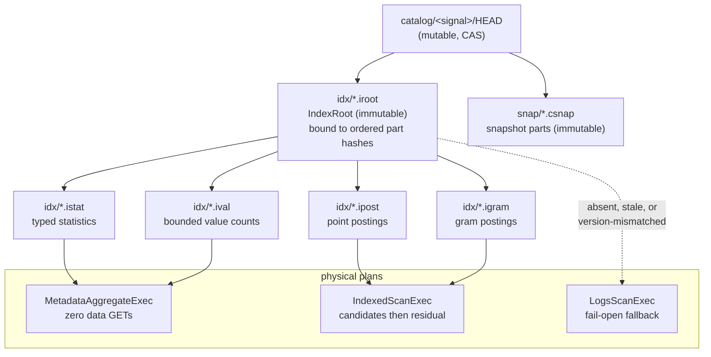

# ADR-0849: A snapshot-bound index plane on object storage

## Context

Ravel's read cost has a floor that no amount of CPU work removes. Measured on
the ClickBench `hits` corpus (tenant `clickbench-v4`: 3,469 objects, 12.03 GB,
99,997,497 rows) on an `r6a.4xlarge`:

- **34 of 41 statements read every one of the 3,469 objects and the entire
  12.03 GB.** There is no index and no clustering, so a statement that wants
  eleven rows pays for the whole corpus.
- The floor for anything touching the corpus is about **1.2 s**. Competitors
  answer the same statements from an index in **10-35 ms**: `q02` at 11 ms
  against our 1,195 ms, `q20` at 24 ms against our 3,216 ms.
- Hot totals over the 41 statements every system answered: ClickHouse 13.28 s,
  VictoriaLogs 79.97 s, **Ravel 91.79 s**, Elasticsearch 454.10 s.

CPU optimisation does not touch this. A correct hash change (#843/#847)
measured `core::hash::sip` at **8.30% before and 8.44% after** — no movement —
and the on-CPU profile is flat, with no self-time frame above 3.45%. An
independent review of the profiling approach reached the same conclusion from
the other side: *moving fewer bytes is worth more than moving bytes faster on
this box*.

Two capabilities already in the tree show the shape of the answer:

1. **Metadata-only execution already works.**
   `crates/ravel-sql/tests/logs_count_from_stats.rs` has passing tests
   (`predicate_free_count_answered_from_catalog_with_zero_gets`,
   `contained_ts_bound_reports_exact_count_and_span_with_zero_gets`) asserting
   both that no `LogsScanExec` appears in the plan and that the executor issues
   **zero** object-store GETs. It is narrow — predicate-free `COUNT(*)` and
   contained timestamp bounds — but the mechanism is proven in production.
2. **A snapshot-bound index object already exists.** Name postings live at
   `t/<tenant>/catalog/<signal>/idx/<watermark>.<hash16>.npost`, immutable,
   content-addressed, bound to the exact ordered snapshot-part hashes
   (`expected_part_blake3`), rejected outright when decoded against a different
   part set, and already swept by the existing supersession GC.

So this is an extension of existing architecture, not a new database.

### Why ADR-0049's rejection no longer binds

ADR-0049 rejected a global inverted index, and its stated reason was specific:

> it needs a coordinator, an unbounded rebuild, and a durability story, and
> object storage is the only durable backend.

Each of those has since been answered by machinery that shipped for other
reasons: catalog fold plus the `HEAD` CAS protocol is the coordinator;
immutable content-addressed packs rebuilt during compaction bound the rebuild;
S3 is the durability story, unchanged. **The rejection was correct when it was
written and its premises have expired.** That — not preference — is the ground
for revisiting it. ADR-0049's other rejections (row-granularity postings,
widening the bloom) are untouched and still stand.

## Decision

Build an **immutable, snapshot-bound index plane on object storage**, cached in
RAM and local NVMe, used two distinct ways: to skip objects and blocks that
cannot match, and to answer decomposable queries entirely from metadata.
Durable truth stays on S3; local state is a disposable cache. This preserves
the S3-only durability model rather than working around it.



### 1. Packs are immutable, content-addressed, and snapshot-bound

Every pack is an immutable object under the **existing**
`t/<tenant>/catalog/<signal>/idx/` prefix, distinguished by suffix. This is an
additive key-layout change: a new suffix under a prefix that already exists,
already carries `.npost`, and is already covered by supersession GC. No new
prefix, no new lifecycle.

The `IndexRoot` is bound to the **exact ordered snapshot-part hashes**, exactly
as `.npost` is today, and a pack decoded against a different part set is
rejected rather than trusted. Postings address **snapshot-entry ordinals**, not
repeated object keys, so a posting list costs a varint per match rather than a
key.

### 2. Routing must never be per-object

A point lookup resolves through a small cached root to one or a few leaves.
Packs are sharded by field, index type, and value or hash range.

**A design that probes one index sidecar per data object is rejected by
construction**: it replaces 3,469 data GETs with 3,469 index GETs and moves
nothing. This is the constraint that rules out the obvious "put an index next
to each object" approach, and any future proposal must be checked against it.

### 3. The safety lemma

```
query candidates = index matches among covered objects
                 ∪ every uncovered object
```

A missing, stale, corrupt, or version-mismatched index therefore makes a query
**slower, never wrong**. This is what lets coverage lag ingest, and it is why
the index can be built off the acknowledgement path:

- an L0 write is acknowledged **uncovered**; queries scan that recent tail
- **L1 compaction** builds index fragments while it is already decoding and
  rewriting rows
- **catalog fold** combines fragments into covering packs and publishes a new
  root through the existing `HEAD` CAS protocol

Synchronous L0 sidecar indexing is available as an **opt-in per-tenant
profile** for workloads needing point search on fresh data. It is not the
default, because it adds an object-store dependency to the acknowledgement
path.

### 4. Migration class

Index packs are **Class B** under ADR-0066 decision 4 — derived catalog
objects, alongside `.csnap`, `.npost` and `HEAD`. They are rebuildable from
commit records by construction and the fold rewrites them continuously, so a
version bump needs no migration tool: the upgraded fold emits the new version,
supersession GCs the old packs, and dual-read is needed only across the
rolling-upgrade window. A reader meeting an unsupported pack version treats it
as **absent** and falls back to scanning, which the safety lemma already makes
correct.

### 5. Three physical plans

- **`MetadataAggregateExec`** — emits from exact statistics and value counts,
  constructing no `LogsScanExec` at all.
- **`IndexedScanExec`** — resolves object and block candidates from covering
  packs, then evaluates residual predicates normally.
- **`LogsScanExec`** — the existing fail-open fallback, unchanged.

Metadata execution is selected **only** when every live object is covered, the
complete predicate and aggregate are representable, type and null/NaN semantics
match the scan exactly, no pending selective erasure invalidates the counts, no
row-level policy requires row inspection, and the pinned commit token adds no
uncovered segment. Otherwise the planner uses an indexed scan or a full scan.

**Exactness or fallback, never estimation.** These figures answer queries
directly, so a bound is not sufficient: `q02` needs the exact count of one
value, and a truncated dictionary must force a scan rather than produce a
number.

### 6. Clustering is a companion, not a substitute

The narrow, time-leading slice of ADR-0815 lands as item 2: cluster during
compaction, lead with EventTime, publish narrow per-part bounds, exclude before
any data GET. Arbitrary per-tenant string/bytes clustering keys are **deferred**
— a single sort key cannot serve both time ranges and high-cardinality point
lookups, and the latter is what point postings are for. Sort order and index
work together; an index over scattered values cannot rescue it.

## Rejected alternatives

1. **Per-object index sidecars.** Rejected: a lookup then probes one sidecar
   per object, turning 3,469 data GETs into 3,469 index GETs. It relocates the
   floor instead of removing it. This is the single most important rejection
   here because it is the design most people reach for first.

2. **A mutable B-tree or LSM on S3.** Rejected: object storage has no atomic
   multi-object update and poor economics for many small mutable writes. Every
   update becomes a read-modify-write of a shared node under contention.
   Immutable packs with an atomic root swap match what S3 is actually good at:
   immutable objects and a single CAS pointer.

3. **Row-granularity postings.** Rejected, unchanged from ADR-0049: the scan
   re-evaluates predicates exactly anyway, so row precision changes no result
   and costs bytes at rest. Block and object ordinals are the useful grain.

4. **Synchronous L0 indexing as the universal default.** Rejected as a default:
   it puts a second object-store dependency on the acknowledgement path, which
   trades write availability for read latency on every tenant to benefit the
   few that need fresh-data point search. Retained as an opt-in profile.

5. **Widening the existing per-object bloom filters instead.** Rejected,
   unchanged from ADR-0049: cheaper, but it cannot be exact, and lowering the
   false-positive rate costs bits geometrically without reaching zero. A
   selective query over thousands of blocks still scans a tail of them, and
   still opens every object to read the filter.

6. **Rely on clustering alone.** Rejected: one sort order cannot simultaneously
   serve time-range scans and high-cardinality `UserID` lookups. Clustering
   handles ranges; postings handle points; neither substitutes for the other.

7. **A general external-sort subsystem for arbitrary clustering keys, first.**
   Rejected as sequencing: it is the most complex piece of ADR-0815 and its
   value is unmeasured until basic time clustering has been landed and
   measured. Deferred, not rejected on merit.

## Consequences

**Queries that stop scanning.** `q02`, `q07` and `q08` become answerable at
zero data GETs from statistics alone. `q20` becomes proportional to matching
blocks rather than to corpus objects. `q23` is bounded by positive gram
candidates. `q37`-`q43` open a proportional fraction of objects once time
clustering lands.

**Queries that do not.** Full `SUM`/`AVG` over the corpus still scans without
materialised aggregate states. **An index alone does not remove all 34 scans**,
and pretending otherwise would set a target this ADR cannot meet. Rollups are
item 5 and are a different mechanism.

**New cost.** Index packs consume storage and fold time. Packs are subject to
the same MVCC protection horizon as the data snapshot they describe, so they
inherit the same delayed-reclamation behaviour already measured (a tenant holds
roughly 1.9x its live set during the 25 h 05 m horizon).

**New failure mode, bounded by construction.** A corrupt or stale pack degrades
to scanning. That is a latency regression, never a correctness one, and it is
the property that makes the whole plane safe to land incrementally.

**Honesty about the comparison.** The competitors' 10-35 ms figures are hot,
local-index numbers. Cached roots and metadata-only execution can approach
them; a genuinely cold lookup needing several S3 round trips will not, and must
be reported separately. **Stateless is not cacheless**, and hot and cold index
results are to be published as distinct numbers rather than blended.

Refs: #849, #680, #815, #835, #843
Supersedes in part: ADR-0049 (the global-inverted-index rejection only)
