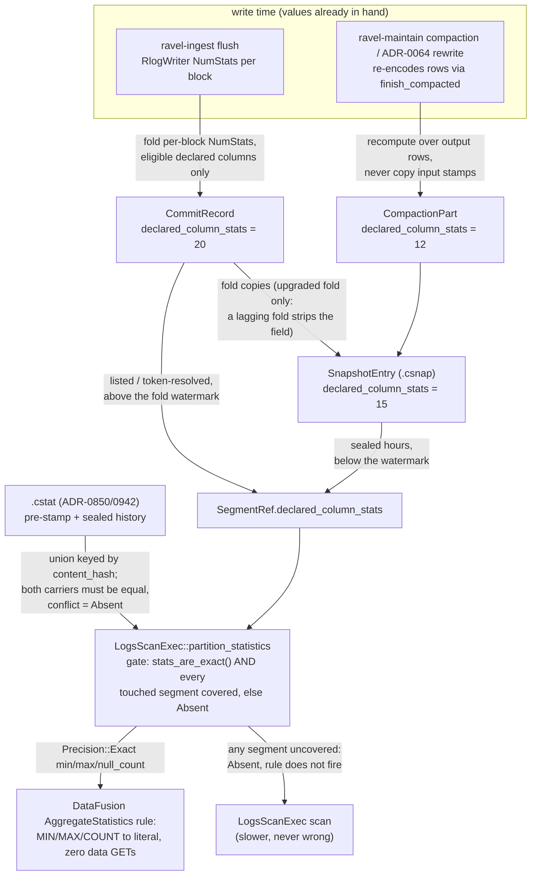

# ADR-0873: per-declared-column min/max on commit records and SegmentRef

Status: Proposed. Issue #873. Builds on ADR-0850 (logs typed column
statistics, the `.cstat` plane), ADR-0942 (re-key `.cstat` to snapshot-part
binding, and its backfill obligation), ADR-0066 (format migration machinery:
the N/N-1 window, recorded format floors, migration classes A-D), ADR-0101
(declarable f64 typed attribute columns), and ADR-0849 (the snapshot-bound
index plane, whose §1a names the commit record as a candidate statistics
carrier). Touches two frozen contracts (the commit-family protobufs under
`proto/ravel/commit.proto` and the catalog snapshot protobufs under
`proto/ravel/catalog.proto`), so the format-change skill's procedure governs
and this ADR is its first step.

## Context

`SegmentRef` carries an exact min/max for exactly one column: `ts`
(`min_event_ts_ns`/`max_event_ts_ns`, stamped on every `CommitRecord` and
`CompactionPart` since ADR-0002/0018). `LogsScanExec::partition_statistics`
already exploits it: under the `stats_are_exact` gate it reports an exact
`num_rows` and an exact `ts` span, and DataFusion's stock
`AggregateStatistics` physical-optimizer rule rewrites a predicate-free
`COUNT(*)`, `MIN(ts)`, or `MAX(ts)` to a literal with zero data GETs
(`crates/ravel-sql/src/logs_scan.rs:1861-1925`).

No other column has that property at the resolution layer. Issue #873's
motivating measurement: `SELECT MIN(EventDate), MAX(EventDate) FROM hits`
(ClickBench q07-shape, `EventDate` a declared I64 column) costs 1,181 ms
where stock DataFusion over parquet answers in 22.6 ms, because the min/max
must come from somewhere and the only somewhere is a scan.

### What ADR-0850/0942 already cover, and the structural gap they cannot

ADR-0850 built exact per-segment column statistics (min/max included) as a
fold-built sibling object (`.cstat`), and its reader is implemented:
`declared_min_max_all` joins the loaded `.cstat` against the touched
segments and `partition_statistics` reports `Precision::Exact` min/max for
declared columns (`logs_scan.rs:1904-1923`), so the stock
`AggregateStatistics` rule fires. ADR-0942 re-keys that object to the
snapshot part so compacted (L1) history is coverable, and names the forced
rebuild fold that backfills a quiescent tenant.

What no fold-built object can ever cover is the data the fold has not seen
or does not carry:

- **The live tail.** A snapshot's sealed hours come from `.csnap` parts, but
  everything above the fold watermark is resolved by LISTing and decoding
  commit records directly (docs/catalog-and-mvcc.md "Snapshot resolution",
  step 1-4), and the newest `max_flush_lifetime + clock_skew_allowance +
  fold_safety_margin` of every tenant is always unsealed by construction. A
  `.cstat` is built at fold time over folded entries; the recent tail is
  therefore *permanently* uncovered on a live tenant, not merely
  lagging-until-next-fold. ADR-0849's own Consequences state the resulting
  shape: "metadata-only execution is a benchmark capability" because "a
  live-ingest tenant always has an uncovered L0 tail by construction".
- **Token-resolved segments.** Read-your-write `min_token` segments are
  fetched by direct commit-record GET outside the snapshot (resolution step
  5); no snapshot-sibling object describes them.
- **Coverage bookkeeping is a second structure.** The `.cstat` plane needs
  its own object, its own ref on `SnapshotHead`, a hash-validated join, an
  extra async GET before planning, and (per ADR-0942) its own backfill pass
  to mean anything on an already-loaded tenant.

The hoist this ADR designs closes the structural gap rather than widening
the sibling plane: stamp the per-declared-column min/max **on the records
resolution already reads** — the `CommitRecord` at flush, the
`CompactionPart` at compaction — and carry it through the fold's
`SnapshotEntry` onto `SegmentRef`. Coverage then travels with snapshot
resolution itself: the live tail is covered the moment its commit record is
durable, token-resolved segments are covered by the same GET that satisfies
the token, and there is no join, no extra GET, and no separate coverage
declaration. This is exactly carrier candidate 2 from ADR-0849 §1a ("an
additive field on the commit record compaction already writes, which the
fold already reads — no new object class, but a frozen-contract change
under the format-change procedure"). This ADR is that procedure's ADR, for
min/max specifically.

### Where the values already exist at write time

Both writers of data objects already decode every row and build per-block
statistics:

- `RlogWriter` computes per-block NumStats (min/max) per `(name, type)`
  dynamic column for the SKIP_IDX section (`crates/ravel-logseg/src/writer.rs`,
  ADR-0093/0095), on the L0 flush path and — via the shared `build_object`
  pipeline behind `finish_compacted` — on the L1 compaction path.
- The selective-erasure rewrite (ADR-0064) re-encodes surviving rows through
  the same writer.

A whole-object min/max per declared column is a fold over per-block extrema
the writer already holds. The capture is a running comparison, not a new
decode pass — unlike ADR-0850's fold-time build, which pays one full decode
pass per segment precisely because the values were not kept at write time.

### Scope honesty, carried from issue #873

This fixes the q07 shape (`MIN`/`MAX`, and `COUNT` via the null count below)
and nothing else. Issue #873 states, correctly, that it does **not** fix q02
or q08: parquet-style per-object statistics cannot count rows matching a
predicate (`COUNT(*) WHERE col <> 0`) nor produce per-value `GROUP BY`
counts. Those need the exact value dictionaries that live in `.cstat`
(ADR-0850's `MetadataOnlyAggregate` rule), which this ADR leaves untouched.
The `.cstat` plane is not superseded: dictionaries and integer sums (#861)
stay there; only min/max (and null counts) gain the second, resolution-borne
carrier.

One correction to the issue's framing, reported rather than silently
absorbed: the issue reasons that the float total-order hazard "does not
arise" because declared columns have no F64 variant. That is true of the
tree today (`proto/ravel/sys.proto` `TypedAttrColumnType` ends at
`BYTES = 4`) but ADR-0101 is Accepted and adds `TYPED_ATTR_COLUMN_TYPE_F64 =
5`, so the hazard is scheduled, not hypothetical. Decision 2 therefore makes
the eligibility gate an explicit allowlist rather than an incidental
consequence of the current vocabulary.

## Decision

### 1. Wire changes: three additive fields, two mirrored messages, no bump

All changes are additive. No existing field is renumbered, reused, or given
new meaning. Field numbers, chosen as the lowest unclaimed number in each
message:

**`proto/ravel/commit.proto`** (package `ravel.commit.v1`) gains two
messages and two fields:

```proto
// The min or max of one declared column's non-null values in one object.
// Restricted to the stamp-eligible declared types (decision 2); a new
// eligible type adds a oneof arm, additively.
message DeclaredColumnStatValue {
  oneof kind {
    sint64 i64 = 1;
    bool b = 2;
  }
}

// Exact whole-object min/max (and null count) for one declared typed
// attribute column (ADR-0090), computed by the writer that encoded the
// object. min/max are message-typed for presence: both absent means the
// column had zero non-null values in this object, which is still an exact
// statement. An entry is only ever written for a column that resolved to a
// real FIELD_DIR column covering the whole object (the ADR-0850 attrs_raw
// rule); a column that overflowed gets no entry, never an entry with a
// guess.
message DeclaredColumnMinMax {
  string name = 1;
  uint32 declared_type = 2;  // ravel.sys.v1.TypedAttrColumnType as i32
  DeclaredColumnStatValue min = 3;
  DeclaredColumnStatValue max = 4;
  // Rows in this object where the declared column reads NULL (name absent,
  // or the stored variant mismatches declared_type). non_null = the
  // record's row count minus this.
  uint64 null_count = 5;
}
```

- `CommitRecord.declared_column_stats = 20;` (repeated `DeclaredColumnMinMax`).
  Fields 1-19 are in use; 20 is the lowest free number.
- `CompactionPart.declared_column_stats = 12;` (repeated
  `DeclaredColumnMinMax`). Fields 1-11 are in use. `RewriteRecord.parts` and
  `CompactionRecord.parts` both carry `CompactionPart`, so erasure-rewrite
  outputs get the field with no further wire change.

**`proto/ravel/catalog.proto`** (package `ravel.catalog.v1`):

- `SnapshotEntry.declared_column_stats = 15;` (repeated). Fields 1-14 are in
  use. The message is a same-file mirror of the commit-side pair
  (`DeclaredColumnStatValue`/`DeclaredColumnMinMax` redeclared in
  `ravel.catalog.v1`), because this repository has zero cross-file proto
  imports and ADR-0850 already established mirroring as the convention
  (`ColumnStat.declared_type` carries the sys enum as `uint32` for the same
  reason). The existing `ColumnValue` message is deliberately not reused: its
  oneof admits `str_utf8`/`bytes_val`, which are not stamp-eligible, and a
  narrower type makes an ineligible stamp unrepresentable rather than
  merely rejected.

**Version bump: none, and that is the deliberate answer, stated rather than
implied.** These are Class C records (decision 5): the evolution mechanism
for the commit-family and snapshot protobufs is the frozen field-number
space itself — "protos add fields, never renumber or reuse" (format-change
skill rule 2). `CommitRecord.format_version` stays 1,
`CompactionRecord.format_version` stays 1, and the `.csnap` envelope version
is untouched, on the ADR-0052 `generations` precedent that ADR-0066 made
normative: an addition that an old reader can safely ignore (absence of the
shortcut, never a wrong answer — decision 4) does not raise the reader
floor. ADR-0063's `SnapshotPartHeader.min_hour` (field 8, no envelope bump)
is the standing in-file precedent for an additive `SnapshotEntry`-side
change. A reader floor bump would force a flag-day for a field whose absence
is a permanently legal state.

**Rust-side carriage.** `SegmentRef`
(`crates/ravel-catalog/src/snapshot.rs:32`) gains one field,
`declared_column_stats` (a shared, cheaply clonable list; `SegmentRef` is
cloned per query). This is the field ADR-0850 declined to add, citing 120+
construction sites. That rejection was right for ADR-0850's payload and does
not bind here, for two reasons. First, scale: ADR-0850's payload is
dictionaries, counts, and sums — unbounded per-segment state that has no
business on a per-ref struct; this ADR's payload is a bounded min/max/null
triple per eligible declared column. Second, and decisive: the entire point
of #873 is coverage that rides resolution (live tail, token segments), and
only a `SegmentRef`-carried value can do that — a sibling object is
structurally fold-bound, as the Context section shows. The construction-site
cost is a mechanical one-line default at each literal and is paid once.

### 2. Eligibility: an explicit allowlist, {I64, BOOL}, gated fail-closed

Stamp eligibility is a named allowlist in one place
(`ravel-types` or `ravel-logseg`, single-sourced the way version constants
are per ADR-0066 decision 1):

- **`I64` and `BOOL` are eligible.** Both have a total order, fixed-width
  values, and existing write-time NumStats to fold over.
- **`STR` and `BYTES` are not.** Their extrema are unbounded byte strings; a
  stamped value would put arbitrary user data of arbitrary length on the
  commit record, the hot resolve path, and the per-record cache (sized at
  ~750 bytes/entry, docs/catalog-and-mvcc.md step 2). A truncated extremum
  is a bound, not an exact extremum, so capping the length would make the
  stat unusable for an `Exact`-precision answer. The `.cstat` plane remains
  the carrier for anything exact about string columns.
- **`F64` is not eligible, and its exclusion is a gate, not an accident.**
  ADR-0101 (Accepted) adds a declarable `f64` type; when its writer release
  lands, declared float columns will exist. Nothing about this ADR changes
  for them: `F64` is absent from the allowlist, so no writer stamps it, no
  reader accepts it, and `MIN`/`MAX` over a declared float column keeps
  scanning. Admitting `F64` later is an ADR amendment that must decide, at
  minimum: the comparator (bit-pattern total order per the repo invariant
  and ADR-0023, vs IEEE semantics), the NaN rule (the ADR-0101 §3 precedent:
  a page containing NaN has no usable ordered bound — at whole-object grain
  the sound default is that an object containing any NaN in the column gets
  no stamp), the `-0.0`/`+0.0` rule, and proof that the stamp's comparator
  agrees exactly with the scan-path aggregate's, because a statistics
  shortcut that orders floats differently from the executor it replaces is a
  wrong answer, not a slow one.

Enforcement is two-sided. Writers stamp only allowlisted types. Every
decoder (commit record, compaction record, snapshot entry) validates each
entry against the full predicate below. An entry failing **any** clause is
dropped whole — no field of it is used, including the fields that pass on
their own: a plausible min next to an impossible null count is evidence the
writer that produced the entry was broken, not a value to salvage. The
dropped column is simply uncovered for that segment (the safety rule of
decision 4), the drop is counted on a defect metric, and the record itself
still decodes; an invalid entry is never a decode failure and never
trusted partially.

A decoded `DeclaredColumnMinMax` entry is valid iff all of:

1. `declared_type` is allowlisted ({I64, BOOL} today).
2. `min` and `max` are **both present or both absent**, where present means
   the message is set and its oneof kind matches `declared_type`. A
   one-sided entry is not a usable range: it admits no exact answer for
   either aggregate, so it is invalid outright, never "half usable".
3. When both are present, `min <= max` under the authoritative comparator
   defined below.
4. `null_count <= sample_count`, the carrying record's row count for the
   segment (`CommitRecord`/`SnapshotEntry` field 11, `CompactionPart`
   field 6).
5. Presence agrees with the null count: both-absent (zero non-null values)
   requires `null_count == sample_count`; both-present requires
   `null_count < sample_count`.
6. `name` is non-empty, and at most one entry exists per
   `(name, declared_type)` on the record; duplicates are all dropped, since
   no rule could pick the right one.

The authoritative comparator is the scan-path aggregate's, by definition:
for I64, signed integer order (`i64::cmp`, which is what DataFusion's Int64
`MIN`/`MAX` accumulators apply); for BOOL, `false < true`. The single-
sourced allowlist constant (opening of this decision) names the comparator
beside each type, and the writer's fold, the decoder's clause 3, and the
read-side union all use that one definition. This is load-bearing, not
pedantry: the stamp *replaces* the aggregate's answer, so a stamp computed
under any other ordering is the same class of silent wrongness as a wrong
value — the F64 gate above exists precisely because floats are the case
where two plausible comparators genuinely disagree.

Tests that pin the predicate, one decode case per clause: a one-sided
entry, `min > max`, `null_count > sample_count`, both-absent with
`null_count != sample_count`, a oneof kind mismatching `declared_type`, an
unallowlisted type, and a duplicate name. Each asserts the entry is absent
from the decoded set, the defect metric incremented by exactly one, the
record otherwise decoded intact, and `partition_statistics` reporting
`Precision::Absent` for that column. The assertion that fails when the
invariant breaks must be the entry's absence (and the resulting `Absent`
precision), not a log line.

### 3. Capture at write time

- **L0 flush (ravel-ingest, `log_shard.rs`).** The flush path learns the
  tenant's declared typed columns through the same durable-config
  bounded-staleness read that already supplies indexed fields to the writer
  (ADR-0079's override-cache pattern). For each declared, eligible column
  that resolved to a whole-object FIELD_DIR column, `RlogWriter` folds its
  per-block NumStats into a whole-object min/max and null count, returns
  them alongside `WriteStats` (the existing writer-to-committer channel,
  `finish_with_stats`), and `record::build` stamps them onto the
  `CommitRecord`. Staleness is fail-closed by construction: a column
  declared after flush open is missing from that object's stamps, so that
  segment is uncovered and scans; it converges at the next flush.
- **L1 compaction (ravel-maintain, `rlog.rs`).** The compactor already
  re-encodes every row through `finish_compacted_with_stats`; the same fold
  produces per-part values stamped onto each `CompactionPart` (field 12). It
  recomputes from the rows it writes, never by merging input stamps: inputs
  may predate a declaration, and recomputation is free at a point that is
  already decoding everything.
- **Erasure rewrite (ADR-0064).** Rewrite outputs are `CompactionPart`s and
  get the same treatment, with one rule promoted to a correctness invariant:
  a rewrite **must** recompute stamps over surviving rows and must never
  copy an input's stamp. A copied stamp could carry an erased row's value as
  the recorded extremum — a statistics answer that resurrects erased data.
  A test pins this: erase the row holding the column's maximum, assert the
  rewritten part's stamp shrinks.
- **Metrics and spans signals** never stamp the field: declared typed
  columns are a logs concept (ADR-0090). The field is simply absent, which
  is the legal default forever.

**Null-count capture, end to end.** The null count is observed in exactly
one place — the writer, at encode time — and carried unchanged to the
record; nothing downstream recomputes it and nothing defaults it:

1. `RlogWriter` already tracks per-block, per-`(name, type)` NumStats for
   SKIP_IDX; the implementation extends that per-block state with the
   block's non-null row count for the column where it is not already
   recorded (`NumStat.null_count`, equivalently `non_null`).
2. The whole-object fold computes, per eligible declared column,
   `null_count = Σ over blocks of (block_rows − non_null(block, column))`.
   A block in which the column never appears contributes its **entire**
   row count: absent-in-block reads NULL for every row of that block, so
   the fold runs over the object's block list, not over the NumStat map —
   summing only blocks that carry a NumStat entry undercounts.
3. The fold cross-checks itself: total non-null plus `null_count` must
   equal the object's row count. If the identity does not hold, or any
   block's non-null count for the column is unavailable (a block encoded
   before the per-column state existed, any accounting path the writer
   cannot reconcile), the writer emits **no entry for that column on that
   object**. Never an entry with `null_count: 0`.
4. The exact `(min, max, null_count)` triple travels as one unit through
   `finish_with_stats` (L0 flush) and `finish_compacted_with_stats`
   (compaction and the ADR-0064 rewrite) to `record::build` and the part
   builder, which stamp it verbatim.

Exactness is entry-granular, and that is what keeps the proto3 wire shape
safe without a field change: `null_count` is a plain `uint64`, whose
absence is indistinguishable from zero on the wire — tolerable **only**
because a writer is forbidden to emit an entry unless every field in it is
exact. A decoded, valid entry with `null_count: 0` therefore means exactly
zero NULLs, never "unknown". The distinction is the wrong-answer generator
this rule exists for: `COUNT(col)` rewrites to `sample_count −
null_count`, and `MIN`/`MAX` over an all-NULL column (`null_count ==
sample_count`, min/max absent) is NULL — neither is the answer for "no
NULLs", and a defaulted zero silently converts one case into the other
with `Precision::Exact` attached. The decision-2 predicate polices the
checkable slice of this at decode (clauses 4 and 5); the remainder is a
writer invariant pinned by test, not by decode.

Tests that pin the capture: an all-NULL object stamps min/max absent with
`null_count == sample_count` and the read side answers `COUNT(col) = 0`
exactly; an object where one block lacks the column entirely stamps the
exact null count including that block's full row count (the assertion is
the exact figure, not "nonzero"); a writer path with an unreconcilable
block (fault-injected) emits no entry for the column and the read side
reports `Precision::Absent` — the assertion that fails when the invariant
breaks must be "no entry", never "entry with zero".

Added write cost, stated for the band it must stay in: per object, one
`O(blocks × eligible declared columns)` comparison fold over NumStats the
writer already computed (no extra decode, no extra pass), plus roughly
`name_len + 25` bytes per eligible column on the record — order tens to a
few hundred bytes per object for realistic declared sets, against records
that already run ~750 bytes and an object PUT that dwarfs both. The
per-record cache and `.csnap` `entries_uncompressed_len` grow by the same
order; the wide-schema case (ADR-0100, dozens of declared I64 columns) is
the sizing worst case and belongs in the implementation's pre-registered
figures.

### 4. Read side: union of carriers, behind the existing gate

The fold copies `CommitRecord.declared_column_stats` onto the
`SnapshotEntry` (field 15) exactly as it copies `sample_count` and the ts
bounds today, and `CompactionPart.declared_column_stats` onto L1/rewrite
entries. Resolution then populates `SegmentRef.declared_column_stats` from
whichever record it is already reading: a listed or token-resolved commit
record above the watermark, a `SnapshotEntry` below it, a
compaction/rewrite part either way.

`partition_statistics` fills a declared column's
`ColumnStatistics::min_value`/`max_value` (and `null_count`, which is what
lets the same stock rule also answer `COUNT(col)`) with
`Precision::Exact` only when **both** hold:

1. `stats_are_exact()` — the existing gate, unchanged and load-bearing: no
   content predicate, no prune predicate, `erasure.is_empty()` (a pending
   erasure invalidates committed statistics; ADR-0064 decision 2), and the
   ts bound fully contains every touched segment (so no extremum can be
   clipped away by a bound the stats don't see).
2. **Every** touched segment is covered for that column, where covered means:
   a `SegmentRef` stamp with matching `(name, declared_type)` that passed
   the decision-2 validity predicate (a dropped entry is no coverage),
   **or** an ADR-0850/0942 `.cstat` entry for that segment and column. The
   two carriers are a union, per segment, per column. Any segment covered by
   neither leaves the column `Precision::Absent`, the `AggregateStatistics`
   rule silently does not fire, and the query scans — the ADR-0850 safety
   lemma, extended verbatim to the new carrier. Absence is never an error
   anywhere on this path.

**The union, defined precisely.** Both carriers are keyed by one segment
identity: the data object's content hash — `SegmentRef.content_hash`,
equal to `SnapshotEntry.content_hash` — which ADR-0942 already fixed as
the `.cstat` join key after correcting an earlier revision that keyed on
`SnapshotPartRef.blake3` (wrong because one part covers many segments, so
keying on it merges statistics across segments). This ADR introduces no
second identity and must not: the stamp lookup and the `.cstat` lookup for
one segment resolve through the same content hash, or "both carriers for
one segment" has no meaning.

Per `(content_hash, name, declared_type)` the reader resolves exactly one
value, by cases:

- **Stamp only, or `.cstat` only:** use it. This is the normal state — the
  live tail has only stamps, pre-stamp sealed history has only `.cstat`.
- **Both:** the triples must be equal — min, max, and null_count each
  compared for exact equality (for the allowlisted types value equality
  and bit-identity coincide; a future F64 amendment must say which, and
  per the repo invariant it will be bit patterns). Equal: use the value —
  either carrier, they are identical. **Unequal in any field: that column
  is `Precision::Absent` for the whole query.** One conflicted segment
  poisons the column exactly as one uncovered segment does. The conflict
  is counted on its own metric, distinct from the decision-2 decode-defect
  metric, and logged with the segment's content hash and both triples.
- **Nothing is ever combined across carriers.** No sum of null_counts
  (both carriers describe the *same* rows once; a sum double-counts every
  NULL), no widening or narrowing of min/max, no preferring the "fresher"
  carrier. There is no arithmetic in the union, only equality.

A conflict is not a degraded mode to tolerate; it is evidence of a real
defect. The segment is immutable and both carriers claim to be exact
derivations of its contents, so disagreement means the writer's stamp
fold, the fold's copy, the `.cstat` build, or the object itself is wrong —
every one of those a bug or corruption. The query degrades safely to a
scan (never a wrong answer), but the conflict metric and log line exist so
an operator sees a ticket-shaped signal rather than a mysteriously slow
query, and the per-query coverage figure below counts a conflicted segment
as covered by neither carrier.

Tests that pin the union: both carriers present and equal — the rule fires
and the literal equals a full scan of the same data; both present with one
field unequal (once on min, once on null_count) — `Precision::Absent`, the
rule does not fire, and the conflict metric increments by exactly one
naming that segment; both present and equal with a nonzero null_count —
the `COUNT(col)` rewrite equals `sample_count − null_count` counted once,
which is the assertion that fails if any path sums the carriers.

The union is not an optimisation, it is what makes the feature exist on any
tenant with history: after this ADR ships, every tenant's data is split
between pre-stamp records (covered, if at all, by `.cstat`) and post-stamp
records. A reader consulting only stamps would stay `Absent` until retention
clears every pre-stamp record; a reader consulting only `.cstat` gains
nothing from the hoist. **The union reader is therefore a build obligation
of this ADR, not a follow-up.**

A per-query coverage figure (segments stamped / segments touched, per
carrier) is emitted under the existing per-phase cost accounting, because
this feature's characteristic failure is silent: a coverage regression
"reads as a slow query" (ADR-0942's phrase), and only a counter makes it a
ticket.

### 5. Migration class and convergence — the #944 question, answered plainly

This change spans two classes under ADR-0066 decision 4, and naming both is
the point (issue #944 is open on exactly this distinction):

- **The record fields are Class C** (immutable metadata records,
  additive-only). Class C has no convergence mechanism *by design*: commit
  records, compaction records, and rewrite records are never rewritten
  (repo invariant), so **no existing record ever gains the field**. There
  is no backfill that edits a Class C record; anything that looks like one
  is an in-place edit of an immutable object and does not happen.
- **The `SnapshotEntry` copy is Class B in mechanics only.** The fold
  rewrites `.csnap` parts, but the copy's *value* is bounded by its Class C
  source: a fold rebuild of any depth reproduces exactly the stamps the
  underlying records carry, and sealed parts are carried forward by
  reference and never re-listed (docs/catalog-and-mvcc.md "Fold reconcile
  pass"). ADR-0942's "Reported conflicts" section already establishes that
  ADR-0066's "the fold rewrites them continuously" premise is too strong
  for derived state bound to sealed history; this ADR is a second instance
  of the same shape, one level deeper: here even a forced rebuild fold
  cannot conjure the value, because the source records themselves lack it.

What that means for real tenants, stated without hedging:

- **A live tenant converges for new data only, immediately.** Every flush
  and every compaction after the writer upgrade stamps. Its pre-upgrade
  records never gain the field.
- **A quiescent, fully compacted, already-loaded tenant gains nothing from
  this ADR, ever, on its own.** No flush, no compaction, no fold-with-new-
  hours; its records are immutable and unstamped. This is precisely the
  reference corpus (`clickbench-v4`), so **the hoist alone moves the
  1,181 ms figure by zero on the corpus it was measured on.**
- Convergence of *coverage* (not of the records) is governed by the Class A
  forces on the data objects underneath: retention ages unstamped records
  out; rewrite-on-touch (any compaction or erasure rewrite) replaces
  unstamped inputs with stamped parts; and the ADR-0066 decision 5
  `maintain migrate` job could force-stamp sealed history — at the cost of
  rewriting every data object to change a statistic, which is
  disproportionate and is not this ADR's plan.
- **The backfill for sealed history is ADR-0942's, and it is a
  precondition, not an option.** The union reader (decision 4) covers
  sealed history through the part-bound `.cstat`, whose forced-rebuild
  backfill pass ADR-0942 already names as a build obligation. For the
  reference tenant the dependency chain is explicit: q07 answers from
  statistics there only after (a) this ADR's union reader lands and (b)
  ADR-0942's backfill pass has run. Any acceptance figure is taken after
  both and stamped with that precondition (the measurement-preconditions
  rule). On live tenants, (a) alone covers the tail immediately — which is
  the population `.cstat` structurally never reaches and the reason this
  ADR exists.

### 6. Dual-reader question (ADR-0066 decision 1) and reader retirement

There is no N-1 *wire* reader here: additive proto3 fields mean one reader
reads both old and new records under the same `format_version`, and the
absent-field branch **is** the old-format path. Two consequences:

- **The absence branch is permanent.** It is simultaneously the reader for
  every pre-stamp record and the fail-closed branch for staleness, type
  mismatch, and ineligible stamps (decision 2). It is never deleted: a
  Class C record lacking the field is legal for as long as retention keeps
  it live, which for an unbounded-retention tenant is forever. No recorded
  format floor is planned because no read path is ever retired; if a future
  change did want to require the stamp, it would need an
  audit-versions-style enumeration proving every live record carries it,
  floors recorded per ADR-0066 decision 3, and its own reviewed change —
  stated here so the option is on the record as floors-not-hope, and
  explicitly not exercised.
- **Readers-before-writers still binds, on the copiers.** The hazard is not
  the query path (an old query reader ignores the new fields and simply
  never shortcuts). It is the two processes that *re-encode* what they
  decode: the fold (decodes commit records, writes `SnapshotEntry`s) and
  the compactor (consumes L0 records, writes `CompactionPart`s). prost
  drops unknown fields on decode, so a lagging fold reading a stamped
  commit record writes a `SnapshotEntry` **without** field 15, and once it
  seals that hour the stripped copy is what every future resolve sees —
  sealed parts are never re-listed, and after the superseded-record sweep
  the snapshot copy can be the only surviving carrier. Silent, permanent
  coverage loss for those hours, recoverable only by a forced rebuild fold
  (records still present) or the `.cstat` plane (records gone). Same for a
  lagging compactor: stamped L0 inputs, unstamped L1 part, and the L0
  records are then superseded and swept. The rollout is therefore ordered
  exactly as ADR-0066 decision 1 orders version bumps: **every fold and
  compaction process is upgraded to copy (or produce) the field before any
  ingest process starts stamping.** This is a deployment gate of the
  implementing epic, with a mixed-version test (new-format record through
  an old-shaped fold must be detected by the coverage metric, not
  discovered by a slow query), not a hoped-for sequencing.

## Data flow



## Rejected alternatives

- **The deferred index plane (ADR-0849's `.istat` statistics packs).**
  Rejected for this problem because the hoist is strictly smaller and fires
  where the plane cannot. The plane builds off the acknowledgement path
  (fragments at compaction, packs at fold), so a live tenant always has an
  uncovered L0 tail and ADR-0849's metadata-only execution "cannot fire on a
  live tenant" by its own Consequences; the hoist stamps at flush, so the
  tail is covered the moment the commit record is durable. The plane needs
  an `IndexRoot`, three-dimensional coverage declarations, sweeper
  reference-set extension, and `HEAD`-writer gates before the first byte
  (ADR-0849 §1a, wave 0); the hoist's coverage bookkeeping is the snapshot
  itself — a segment's ref either carries the stamp or it does not, and the
  sweeper never sees a new object class. ADR-0849 §1a in fact lists the
  commit-record field as one of its three candidate statistics carriers;
  this ADR is that candidate, executed for min/max. The plane remains the
  right shape for what refs cannot carry (postings, grams, value packs) and
  is not superseded.
- **Doing nothing (rely on ADR-0850/0942 alone).** Rejected: the `.cstat`
  plane is structurally fold-bound. The always-unsealed recent tail and
  token-resolved segments are never covered, on any tenant, forever — so
  `MIN`/`MAX` on a live telemetry tenant (the actual product workload, not
  the quiescent benchmark corpus) keeps scanning no matter how many
  backfills run. It also leaves the extra GET + hash-validated join on
  every query that could shortcut, and q07-shape stays at 1,181 ms against
  22.6 ms wherever coverage is absent.
- **Stamp every dynamic `(name, type)` column, not just declared ones.**
  The writer has NumStats for all of them, so it is tempting. Rejected:
  record growth becomes a function of ingested shape rather than of an
  operator's declared contract (hundreds of dynamic columns are legal), the
  resolve path and record cache pay it on every tenant including ones that
  never query typed columns, and the declared set is the existing opt-in
  boundary for exactness features (ADR-0090; "approximation is opt-in and
  visible" cuts both ways — so is paying for exactness).
- **Include `STR`/`BYTES` extrema.** Rejected in this cut: unbounded
  user-data bytes on the hot metadata path, and an exact answer cannot be
  built from truncated extrema. `.cstat` already carries them for the
  fold-covered population; a future amendment could admit length-capped
  stamps as *bounds* for pruning, but bounds are a different feature with
  different precision semantics and must not be conflated with this ADR's
  `Precision::Exact` contract.
- **A per-object statistics sidecar next to each data object.** Rejected by
  construction, unchanged from ADR-0849 §2: one probe per object replaces
  3,469 data GETs with 3,469 sidecar GETs and moves nothing.
- **Bump `CommitRecord.format_version` to 2 for the addition.** Rejected:
  it converts a safely-ignorable addition into a flag-day (old readers
  fail closed on version 2 records they could have read perfectly well),
  contradicting the ADR-0052 precedent ADR-0066 made normative for Class C.
  The frozen field-number space is the version mechanism here.

## Consequences

- **What moves.** `MIN(col)`/`MAX(col)` (and `COUNT(col)`, via the exact
  null count) over declared I64/Bool columns answer from statistics with
  zero data GETs wherever the gate and coverage hold — including the live
  tail and token-resolved segments, which no fold-built structure can ever
  cover. On the reference corpus this lands only together with the union
  reader and ADR-0942's backfill (decision 5); the pre-registered
  acceptance figure for q07-shape is the stock-DataFusion order
  (tens of ms) with the catalog-resolve cost dominating, stamped with the
  backfill precondition.
- **What does not move.** q02 and q08 (predicate counts, `GROUP BY`
  counts): statistics cannot carry them; they remain `.cstat`-dictionary
  territory (ADR-0850). String-column extrema remain `.cstat`-only. Declared
  `f64` columns (once ADR-0101's writer release lands) keep scanning until
  a future amendment clears the float gate. Pre-stamp records never gain
  the field; their coverage is `.cstat`'s or nothing.
- **New wire surface.** Two mirrored messages and three additive fields
  (`CommitRecord` 20, `CompactionPart` 12, `SnapshotEntry` 15), all inert
  for old readers by proto3 additive semantics. No version bump, no reader
  floor change, no new object kind, no new key shape.
- **Costs.** Per object: an `O(blocks × eligible declared columns)`
  comparison fold at write time and ~tens-to-hundreds of bytes on the
  record; the per-record resolve cache and `.csnap` parts grow by the same
  order (the ~750 bytes/entry cache sizing note in docs/catalog-and-mvcc.md
  is updated by the implementation, and the wide-declared-schema worst case
  gets a pre-registered figure). Query-side: the stamp read is free (the
  bytes arrive with the records resolution already fetches).
- **Rollout gate.** Fold and compactor upgrade before ingest stamps
  (decision 6), enforced with a mixed-version test and the coverage
  metric; the failure it prevents is silent permanent coverage loss, not
  corruption.
- **Docs updated with the implementation, same commits:**
  docs/catalog-and-mvcc.md (commit-record and snapshot-entry field
  descriptions, cache sizing note), proto comments, and
  docs/query-engine.md's statistics-shortcut section. This ADR row is added
  to docs/adrs/README.md now.
- **Two new defect signals an operator must know.** Invalid entries
  dropped at decode (decision 2's predicate) and carrier conflicts
  (decision 4's equality rule) each land on their own metric. Both mean a
  writer-side or copy-side bug against immutable data, not load: a nonzero
  rate is a ticket, and the only query-visible symptom is statistics
  shortcuts quietly not firing.
- **Tests the implementation owes** (prove-the-test discipline): the
  erasure-rewrite recompute rule (erase the max, stamp must shrink); the
  decision-2 validity predicate, one decode case per clause (one-sided
  min/max, `min > max`, `null_count > sample_count`, presence disagreeing
  with null count, kind mismatch, ineligible type, duplicate name), each
  asserting the drop, the defect metric, and the resulting `Absent`
  precision; the null-count capture cases of decision 3 (all-NULL object,
  block missing the column counted in full, unreconcilable block emitting
  no entry rather than zero); the union cases of decision 4 (equal
  carriers fire and match a scan, one unequal field yields `Absent` plus
  exactly one conflict-metric increment, `COUNT(col)` proves null_count
  is never summed across carriers); mixed coverage (stamped tail +
  `.cstat` history + one uncovered segment) leaving precision `Absent`;
  the `stats_are_exact` erasure refusal extended to the new columns;
  proptest round-trip of the new messages with corrupt-input rejection
  typed, seed files checked in.
- **Amendment scope note.** The fail-closed amendments above (validity
  predicate, entry-granular null-count exactness, equality-or-`Absent`
  union keyed by `content_hash`) change no wire field, no field number, no
  eligibility, and no migration class; they constrain decoders, the writer
  fold, and the union reader that decisions 2-4 already established.
- **Interaction with ADR-0815 (clustered compaction).** ADR-0815 already
  plans additive per-part min/max bound fields for its clustering key;
  field 12 here is per *declared column* with exactness semantics, not a
  clustering-bound field. The implementing change coordinates field-number
  claims in `CompactionPart` with ADR-0815's, first-to-land takes the
  lower numbers; this ADR claims only field 12.

## Out-of-scope findings, reported not fixed

1. **docs/adrs/README.md index drift**: the index (111 rows) is missing
   entries for shipped ADRs including 0849, 0850, 0892, 0904, 0927, 0942,
   and 0954. This ADR adds its own row only, per the report-don't-silently-
   fix rule.
2. **Issue #873's float premise is time-limited**: "declared columns have no
   F64 variant" is true in-tree but ADR-0101 (Accepted) adds one; the gate
   in decision 2 exists because of that, and any reader of the issue should
   not treat the hazard as structural.

Refs: #873
