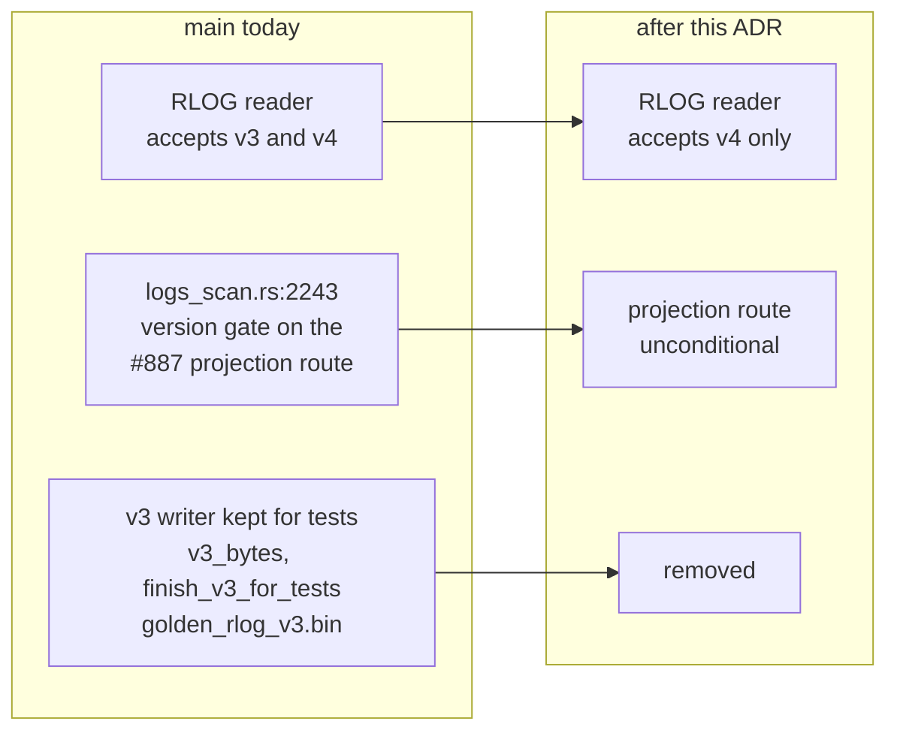

# ADR-0892: Drop the RLOG version-3 reader

Status: Proposed

Refs: issue #892. Applies ADR-0027 decision 7 and ADR-0066 decision 1 (the
single-version regime that holds until first public release); removes the
version gate added by #887; removes the defect class behind #891.

## Context

RLOG's reader accepts two format versions. `crates/ravel-logseg/src/footer.rs`
declares:

```rust
pub const VERSION: u16 = 4;
pub const SUPPORTED_VERSIONS: SupportedVersions = SupportedVersions::n_and_prev(VERSION);
```

so a reader on current `main` accepts both version 3 and version 4. The other
two bulk data formats do not:

| Format | Crate | Window |
|---|---|---|
| RSPAN | `ravel-rspan` | `SupportedVersions::single(VERSION)` |
| RSEG | `ravel-segment` | `SupportedVersions::single(VERSION_V7)` |
| **RLOG** | **`ravel-logseg`** | **`SupportedVersions::n_and_prev(VERSION)`** |

RSEG's exclusivity is pinned by its own test
(`crates/ravel-segment/src/format.rs:302`, `assert!(!SUPPORTED_VERSIONS.contains(VERSION_V6))`),
so this is not an accident of drift in one direction. RLOG is the only bulk
format carrying a two-wide window.

### The policy already says which regime applies

Two accepted decisions govern when a reader window opens, and both key on the
same event:

- **ADR-0027**, whose status line reads "Accepted (superseded at first public
  release by ADR-0066)" and which states plainly: "Until first release the
  single-version policy below stands unchanged."
- **ADR-0066 decision 1**: "ADR-0027's single-version policy is superseded **at
  (and only at) first public release**, exactly as its decision 7 anticipated."

The workspace version is `0.10.0`. Nothing has been publicly released, so the
N/N-1 window ADR-0066 describes is not yet in force, and there is no
backwards-compatibility obligation to honour. RLOG adopted a post-release regime
ahead of the release that authorises it.

This makes the change a **consistency fix, not a policy choice**. The policy was
already decided twice; RLOG is out of step with it.



### What the second version costs

The v3 read path spans seven source files in `ravel-logseg` (`block.rs`,
`writer.rs`, `reader.rs`, `footer.rs`, `skip_index.rs`, `ranged.rs`,
`record.rs`), plus test-only machinery that exists solely to feed it:
`BlockBuilder::v3_bytes`, `RlogWriter::finish_v3_for_tests`, the checked-in
`tests/fixtures/golden_rlog_v3.bin`, and the `golden_bytes_v3.rs` and
`numstat_v3.rs` suites.

Two costs are load-bearing beyond the line count:

1. **The #887 routing gate.** `crates/ravel-sql/src/logs_scan.rs:2243` reads
   `seg.segment_format_version >= u32::from(ravel_logseg::footer::VERSION)`.
   That condition exists only to keep version-3 segments on the whole-object
   route, because v3 blocks are monolithic and have no addressable per-column
   extents. With no version 3, narrow-projection routing is unconditional and
   the branch disappears.
2. **The root cause of #891.** A fixture's declared version only matters because
   a read path routes on it. Removing the routing removes the class of defect,
   rather than fixing one instance of it.

## Decision

Drop RLOG to a single supported version.

1. `SUPPORTED_VERSIONS` becomes `SupportedVersions::single(VERSION)`, matching
   RSPAN and RSEG. A v3 object is then rejected by the existing version check at
   `footer.rs:357` with the typed error it already produces for an unsupported
   version; no new error path is introduced.
2. Delete the version-3 read path across the seven files above, and the
   test-only v3 producers and fixtures that exist only to exercise it.
3. Make the #887 projection route unconditional by removing the version gate at
   `logs_scan.rs:2243`.
4. Add a test pinning exclusivity in the shape RSEG already uses:
   `assert!(!SUPPORTED_VERSIONS.contains(VERSION - 1))`. Deleting a reader
   without pinning its absence lets the window silently reopen.

**Migration class and convergence (ADR-0066 decision 4): Class A**, a bulk data
object. Pre-1.0.0 development stores holding version-3 objects are wiped or
re-ingested, which is what ADR-0027 already prescribes for this regime. No
migration job, no dual reader, no format floor bookkeeping: those are the
post-release mechanisms, and this ADR is an assertion that we are not there yet.

**No version bump.** The written format is unchanged; `VERSION` stays 4 and
writers keep emitting exactly the bytes they emit today. This ADR narrows what
the *reader* accepts. That direction needs no bump because no existing v4 object
is read differently afterwards.

## Rejected alternatives

**Keep the two-wide window until 1.0.0.** Rejected because it inverts the two
decisions above: it applies the post-release regime during the period both ADRs
explicitly reserve for the single-version one, and it pays for that with a read
path, a routing branch, and the #891 defect class. If we want the N/N-1 window
to begin before first release, that is a change to ADR-0027 and ADR-0066 and
should be argued as one, not left standing as an inconsistency in one crate.

**Re-examine RSEG's window in the same change.** Rejected because there is
nothing to re-examine. RSEG is already `single(VERSION_V7)` and pins the
exclusion of `VERSION_V6` in its own tests. Issue #892 raised this as an open
scope question; checking the tree answers it. The scope here is RLOG only.

**Delete the reader but keep the v3 writer for tests.** Rejected. The writer's
own comment says it exists so the v3 reader's tests have inputs. With the reader
gone the producer has no consumer, and a format producer with no reader is a
trap: it is the thing a future change reaches for when it wants "an old object",
reintroducing a version the codebase no longer supports.

**Wait until after epic #904.** Not rejected on merit, and this is a sequencing
preference rather than a decision: both touch the logs read path, and #904's
wave sequence is mid-flight. The removal should land when #904's waves are not
in flight over `logs_scan.rs`.

## Consequences

- One read path, one routing branch, and four test artifacts removed. The
  `ravel-logseg` reader surface stops being version-conditional.
- **No performance gain, and this ADR should not be scheduled as if there were
  one.** The ClickBench tenants are already v4, so the gate at `logs_scan.rs:2243`
  passes today and the narrow-projection route already applies to them. The
  return is maintenance: fewer paths, and a defect class removed.
- Any development store still holding v3 objects becomes unreadable and must be
  re-ingested. Pre-1.0.0 this is the prescribed handling, not a regression.
- Reopening a two-version window later, at first public release, is then a
  deliberate act under ADR-0066's readers-before-writers rule, rather than a
  state we drifted into ahead of schedule.
- The exclusivity test added by point 4 means a future `n_and_prev` cannot be
  reintroduced silently.

## References

- ADR-0027 decision 7 (single-version policy, expiry at first public release)
- ADR-0066 decisions 1, 3, 4 (N/N-1 window, format floors, migration classes)
- Issue #892 (this change), #887 (the routing gate), #891 (the defect class)
