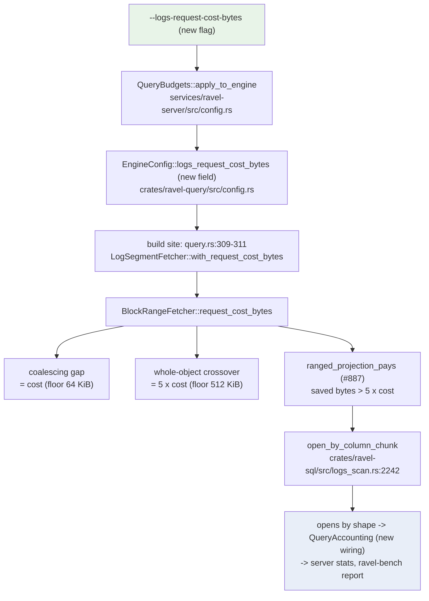

# ADR-0904: an operator knob for the request-cost vs latency trade

Status: Proposed

Refs: epic #904. Builds on ADR-0107 (block-range logs fetch) and ADR-0088
(operator-configurable query budgets); interacts with issue #862/#887 (the
whole-segment fast path's projection-aware routing).

## Context

The engine decides when to trade extra object-store round trips for fewer
transferred bytes, and today that trade is compiled in, tuned for one
objective: latency break-even on the reference instance.

### The one constant, and exactly what it drives

`DEFAULT_LOG_REQUEST_COST_BYTES = 1_887_437` (~1.8 MiB,
`crates/ravel-query/src/log_fetcher.rs:2105`) is the cost of one store
round trip denominated in transfer bytes: a latency-bandwidth product,
derived from a q20 measurement on in-region S3 from an r6a.4xlarge at 8
fetch permits (20.95 ms occupied permit time per GET, ~95% of it
round-trip latency, ~90 MB/s single-stream). Its own doc comment states
the design intent this ADR completes: it is "a property of the STORE AND
INSTANCE ... NOT of the RLOG format, which is why it is a configurable
tunable rather than a frozen constant", and "every one of the fetch-layer
thresholds below is derived from it so that recalibrating the store
recalibrates all of them at once".

Read from the code, the constant (`BlockRangeFetcher::request_cost_bytes`,
`log_fetcher.rs:2725`) drives exactly three decisions:

1. **The coalescing gap** (`effective_coalesce_gap`,
   `log_fetcher.rs:2832`): two wanted extents separated by less than one
   request cost fuse into one GET, because it is never worth a second
   request to skip a hole whose bytes transfer for less than the request
   costs. Floored at 64 KiB (`DEFAULT_LOG_COALESCE_GAP`).
2. **The pre-probe whole-object crossover**
   (`effective_whole_object_threshold`, `log_fetcher.rs:2843`): an object
   at or below `WHOLE_OBJECT_REQUEST_MULTIPLE (= 5) * request_cost_bytes`
   is read whole in one GET, because the ranged protocol adds ~5 round
   trips (a probe, a front-section GET, block-run GETs; 5.46/object
   measured on q20) and cannot save enough bytes below that size. Floored
   at 512 KiB (`DEFAULT_LOG_WHOLE_OBJECT_THRESHOLD`).
3. **The whole-segment fast path's routing** (#862/#887:
   `LogSegmentFetcher::ranged_projection_pays`, `log_fetcher.rs:741`,
   consumed by `PartitionCtx::open_by_column_chunk`,
   `crates/ravel-sql/src/logs_scan.rs:2242`): a predicate-free scan of a
   v4 segment opens by column chunk instead of one whole-object GET
   exactly when the bytes the projection skips,
   `object_size * (1 - projected_fraction)`, exceed the same
   `effective_whole_object_threshold`. This is decision 2's question
   generalized: a narrower projection changes what the ranged path saves,
   never what it costs.

All three are instances of one question -- "is one round trip worth `b`
saved bytes?" -- and the code already derives them from the one field so
they cannot disagree. Two neighbouring thresholds are deliberately NOT
driven by it: the coverage crossover (`DEFAULT_LOG_COVERAGE_THRESHOLD =
0.75`, `log_fetcher.rs:2143`, a post-pruning fallback consulted only for
objects already above the whole-object crossover) and the outer routing
threshold `EngineConfig::logs_block_range_threshold` (already a server
flag, `--logs-block-range-threshold`,
`services/ravel-server/src/config.rs:525`), which selects which fetcher
entry point an object takes, not how the ranged protocol behaves once
taken.

`BlockRangeFetcher::with_request_cost_bytes` and
`LogSegmentFetcher::with_request_cost_bytes` (`log_fetcher.rs:2822,652`)
already exist as builder seams. Nothing production reaches them: the one
production construction site
(`services/ravel-server/src/query.rs:309-311`) sets the block-range
threshold and the GET permit count and leaves the request cost at its
compiled default. The capability exists with no caller.

### Why the compiled-in value is wrong for some deployments

The constant models latency only. Money obeys the same shape of trade but
with a different, deployment-specific exchange rate:

- **Same-region S3** bills requests and does not bill transfer to EC2.
  There, every extra round trip costs real money and every saved byte
  saves none. Epic #680's recorded ClickBench figures (42 statements,
  reference box, cold) measured #887's routing change at:

      cold requests   203,243 -> 751,409    (+270%)
      cold bytes       403.97 -> 194.19 GB  (-52%)
      cold time        324.79 -> 222.19 s   (-31.6%)

  A 3.7x request count for a 31.6% latency win. On a request-billed,
  transfer-free backend that is strictly more expensive (epic #904 puts
  the pass at roughly 2.2x the dollars; that figure, like every dollar
  figure in this ADR, is list-price modelling, not a measured bill).
- **Egress-billed deployments** (cross-region, internet egress at list
  ~$0.09/GB with GETs at ~$0.0004/1000) have a dollar break-even of about
  4.4 KB per request -- three orders of magnitude BELOW the 1.8 MiB
  latency break-even. There the latency-tuned default is already
  cost-conservative, and #887-style routing saves far more transfer money
  than its requests cost.

The correct setting is a property of the deployment's billing shape.
Today there is no setting.

### What already exists on the observability side

Nothing here requires new measurement machinery. Per-phase request and
byte accounting exists (`PhaseAccounting`,
`crates/ravel-query/src/phase_accounting.rs`: resolve/plan/probe/scan,
per-op requests and bytes). `QueryAccounting`
(`crates/ravel-types/src/accounting.rs`) carries per-op S3 request and
byte counters plus `page_bytes_fetched`/`page_bytes_decoded` (ADR-0107
decision 4). The logs scan already counts opens by shape as DataFusion
plan metrics (`fast_path_whole_object_segments` /
`fast_path_ranged_segments`, `logs_scan.rs:808-827`), but those metrics
never reach `QueryAccounting`, the server's per-query stats, or the bench
report. `ravel-bench`'s report (`crates/ravel-bench/src/report.rs`)
counts requests per operation kind and carries
`backend_bills_requests` as an operator-declared fact, deliberately
encoding no prices.

## Decision

Expose the existing request-cost quantity as one process-wide operator
flag, in the unit the engine actually uses, and surface the counters an
operator needs to decide where to set it. Defaults are unchanged.

### 1. Unit: bytes per request, because that is what the engine does with it

The flag is `--logs-request-cost-bytes <BYTES>`: "one object-store round
trip is worth this many transferred bytes to you". It feeds
`EngineConfig::logs_request_cost_bytes` (new field, default
`DEFAULT_LOG_REQUEST_COST_BYTES`) and from there
`LogSegmentFetcher::with_request_cost_bytes` at the one production
construction site.

This unit is chosen because it cannot lie. Every decision the value
drives is literally a comparison of saved bytes against `k *
request_cost_bytes`; the operator-visible unit and the engine's
arithmetic are the same thing. Money enters only ever as a ratio --
`price_per_request / price_per_byte` has units of bytes -- so a byte
value expresses every dollar preference exactly, and the two operator
intents the epic names map to values directly:

- **Prefer speed** (default): leave it at 1,887,437, the measured latency
  break-even. No behavior change.
- **Prefer cost on a request-billed, transfer-free backend**: set it at
  or above the largest segment object the deployment actually writes.
  There is no format-level object-size cap to read this from:
  `DEFAULT_MAX_SECTION_UNCOMP` (`crates/ravel-logseg/src/footer.rs:113`)
  bounds one SECTION at 1 GiB, and an object carries several sections, so
  "1 GiB" is not an object bound and does not by itself guarantee
  whole-object routing. Size it from the deployment instead, and mind the
  scope: this flag is PROCESS-WIDE, so a per-tenant figure is the wrong
  unit. Object size is set by `--batch-rows` and `--target-bytes` at write
  time and is observable per tenant, so take the largest object across
  EVERY tenant the process serves and round up. Sizing to one tenant's
  largest object leaves any tenant holding bigger objects still routing
  ranged, which is the outcome this setting exists to prevent. Setting it far above that costs nothing, because every
  decision below saturates once the value exceeds the largest object.
  All three derived decisions then collapse to whole-object reads: the crossover saturates (`saturating_mul` at
  `log_fetcher.rs:2846`), `ranged_projection_pays` can never find enough
  saved bytes, and the coalescing gap fuses everything. One GET per
  candidate segment, the pre-#887 read shape, restored by configuration
  instead of a revert.
- **Prefer cost on an egress-billed backend**: the dollar break-even
  (~4.4 KB at list prices; list-price modelling, not a bill) is far
  below the latency break-even, so the latency default is already the
  cost-preferring setting within the floors. Operators there keep the
  default; the docs say so explicitly rather than inventing a lower
  value for them to set.

The engine never learns a price. `ravel-bench` made that choice
deliberately (`report.rs` encodes `backend_bills_requests` and no
prices), and this ADR keeps it: prices go stale, differ per contract,
and only their ratio ever affects a decision. All worked dollar examples
live in `docs/guides/operations.md`, labelled as list-price modelling.

The existing floors stay and bound the knob's low end: the 64 KiB
coalescing-gap floor and 512 KiB whole-object floor are latency sanity
bounds (below them the ranged protocol loses at any billing shape worth
running a database on), and a knob value below them clamps rather than
disabling verification or producing degenerate one-block GET storms.

### 2. Scope: process-wide server flag; per-tenant and per-query deferred

Same reasoning as ADR-0088, verified still current: the limits-file's
per-tenant query overrides remain parsed-but-inert
(`services/ravel-server/src/main.rs:327` still warns "parsed but not yet
enforced"), so a per-tenant entry would look tenant-scoped and not be.
A server flag is honest about being process-wide. Per-tenant follows
whenever the per-tenant `EngineConfig` lookup gap closes, as one more
field riding that mechanism.

Per-query is rejected for now on three concrete costs, stated precisely
because one commonly assumed cost does not exist here:

- There is NO plan cache to invalidate: every query builds its own
  `SessionContext`/`SessionConfig` (`crates/ravel-sql/src/session.rs`
  module doc: "exactly one query"). That objection does not apply.
- What does apply: the knob would become a tenant-reachable field on a
  query surface (HTTP body or Flight ticket). On a request-billed
  deployment, a tenant that can lower the request cost per query can
  multiply the deployment's request bill by ~3.7x per scan (the #680
  ratio) without exceeding any byte budget. A cost knob must stay on
  operator surfaces.
- Flight SQL pins planning facts into the ticket between
  `get_flight_info` and `DoGet`; a per-query knob has to ride the ticket
  or the two phases disagree. Mechanically feasible (the fetcher is
  `Clone` and shares its semaphore, cache, and assembly pool through
  `Arc`s, so a per-query reconfigured clone is cheap) but it is protocol
  surface this ADR does not need to ship to solve the stated problem.

### 3. Blast radius: the three derived decisions move together, on purpose

One knob moves the coalescing gap, the whole-object crossover, and the
projection routing together because the code already derives all three
from one field and they are the same question at three call sites.
Exposing them independently would permit incoherent states (a coalescing
gap wider than the whole-object crossover; a routing threshold that
sends segments into a ranged path whose own crossover immediately reads
them whole) and triple the documentation and test matrix for no
deployment that needs them decoupled. The per-threshold builder seams
(`with_coalesce_gap`, `with_whole_object_threshold`,
`with_coverage_threshold`) remain what they are today: test seams, not
operator surface.

Two things deliberately do NOT move with the knob:

- `--logs-block-range-threshold` stays an independent flag. It selects
  the fetcher entry point (whether `tenant_bytes` reads whole with no
  probe, `log_fetcher.rs:695-706`); the request cost governs what the
  block-range path does once entered. Setting the request cost high
  makes the distinction moot (everything above the routing threshold is
  read whole pre-probe anyway), so the two compose rather than conflict.
- The coverage crossover (0.75) stays compiled in. It is consulted only
  for objects above the whole-object crossover, so at the high knob
  values a cost-preferring operator sets it is unreachable, and at the
  default it is the measured latency fallback ADR-0107 shipped. It is
  not a store property, so it does not belong to this knob's unit.

This is also the honest answer to "can this be one knob?": for the logs
fetch layer, yes, precisely because the code was already written around
one quantity. What CANNOT ride this knob is RSEG: the metrics fetcher's
gap and crossover (`crates/ravel-query/src/fetcher.rs:76,86`) are fixed
constants, not request-cost-derived, and its ranged reads are
pruning-driven page selects with no #887-style routing choice. Naming
the flag `logs-*` keeps it truthful; extending the model to RSEG is a
separate ADR that must first derive RSEG's thresholds from a measured
request cost rather than pretending this flag covers it.

### 4. What must never be settable

The knob changes which read shape fetches the bytes; it must never
change the bytes' meaning. Invariant: **for any value of
`logs_request_cost_bytes`, a query returns exactly the rows it returns
at any other value; only request/byte counters and timing may differ.**

Where that is enforced, from the code:

- By construction, both fast-path entry points feed the same decode with
  the same `ColumnSelection`; the ranged open's candidate set on the
  fast path is every block, so "the rows it yields are the rows
  `open_segment_whole` would have yielded" (`logs_scan.rs:2317-2332`).
- By test, today: `both_paths_return_identical_rows`
  (`crates/ravel-sql/tests/logs_fast_path_projection_routing.rs:618`)
  pins whole vs ranged row equality with test-pinned fetchers. Task
  904-4 extends it to drive the routing through the real
  `EngineConfig` field at both extremes, so the knob itself is inside
  the pinned claim.
- Integrity is not knob-reachable: etag pinning across the multi-GET
  sequence, per-block `block_crc32c` verification, and per-block cache
  admission (ADR-0107 decisions 1 and 3) run identically at every knob
  value. No value disables a checksum. The sub-block unverified read
  ADR-0107 rejected (its alternative 4) stays rejected; this knob must
  never grow a "skip verification to save the probe" setting, because a
  content-addressed shared cache cannot contain unverified bytes to the
  caller who opted in.
- The knob is never derived from query text, headers, or any
  tenant-controllable input (see scope: cost DoS).

### 5. Default and discoverability

The default ships unchanged: 1,887,437 bytes, the measured q20 latency
break-even, the same value every deployment runs today. Per ADR-0088's
precedent, this ADR ships the lever, not a new number; #680's recorded
figures justify the lever's existence, not a different default.

How an operator learns the setting is costing them money, using surfaces
that already exist plus one wiring gap closed:

- The logs scan's opens-by-shape counts (`fast_path_whole_object_segments`
  / `fast_path_ranged_segments`) get promoted from plan-only metrics into
  `QueryAccounting` (task 904-2/904-4) and from there into the server's
  per-query stats and the bench report, next to the per-op request counts
  and `backend_bills_requests` that already exist. An operator on a
  request-billed backend who sees a large ranged-open share and a large
  GET count on scans that move few bytes has the exact signal, in their
  own counters, priced with their own contract.
- `docs/guides/operations.md` gains a sizing section: the three worked
  deployment shapes above, each labelled list-price modelling, plus the
  interaction with `--logs-block-range-threshold` and
  `--fetch-concurrency` (the request cost is a latency-bandwidth product,
  so a deployment that changes fetch concurrency has a different measured
  break-even; the derivation comment at `log_fetcher.rs:2092-2104` is the
  recipe).
- The figure this ADR wants and does not have -- the ClickBench triple at
  the cost-preferring setting on the reference box -- does not exist and
  is not claimed. Task 904-7 is the measurement that produces it, with
  pre-registered bands. It is not assumed to equal #680's "before"
  column: the knob at 1 GiB also collapses predicate-path ranged reads
  that were active on both sides of #680's comparison, so requests should
  land at or below 203,243 and bytes at or above 403.97 GB, and the
  measurement, not this paragraph, gets to say where.

### Data flow

## Rejected alternatives

1. **Two price flags (`--store-price-per-request`,
   `--store-price-per-gb`) and let the engine compute the break-even.**
   Lost because only the ratio ever affects a decision, and the ratio is
   a byte count the flag can carry directly; a price pair adds false
   precision (it implies the engine bills something), goes stale with
   list prices, and reverses `ravel-bench`'s deliberate no-prices stance
   (`report.rs` carries `backend_bills_requests` precisely so prices stay
   outside).
2. **A preset enum, `--store-read-bias latency|cost`.** Lost because
   "cost" is directionally ambiguous: on a request-billed transfer-free
   backend it means raise the exchange rate (read whole objects); on an
   egress-billed backend it means the opposite direction (the default
   already over-weights requests relative to dollars). A word that flips
   meaning per deployment is exactly "a unit that lies about what the
   engine does with it". The two honest presets are documented values of
   the byte flag, not engine states.
3. **Three independent operator knobs (gap, crossover, projection
   threshold).** Lost because the code derives all three from one
   quantity on purpose (`log_fetcher.rs:2098-2104`); independent knobs
   permit incoherent combinations, and no deployment shape identified in
   #904 or #680 needs them decoupled. The per-threshold builders stay as
   test seams.
4. **Per-tenant via the limits-file now.** Lost for ADR-0088's reason,
   re-verified: the per-tenant override path is still parsed-but-inert
   (`main.rs:327`), so the entry would silently not do what its location
   implies.
5. **Per-query via a request field or Flight ticket now.** Lost because
   it hands a deployment-cost multiplier to tenants (a ~3.7x request
   amplifier per #680's measured ratio, invisible to byte budgets), and
   needs new protocol surface plus `get_flight_info`/`DoGet` consistency
   work. Notably NOT lost to plan-cache invalidation: this codebase has
   no plan cache (per-query sessions, `session.rs`); recording that here
   so the future per-query ADR does not re-derive it.
6. **Auto-detect the billing shape from the backend at startup.** Lost
   because the engine cannot observe billing (an S3-compatible endpoint
   does not say whether requests or egress are billed), and ADR-0088
   already rejected auto-tuning for hiding the bound in play from
   whoever reads the startup flags.
7. **One generic flag covering RSEG and RLOG.** Lost because RSEG's
   thresholds are not request-cost-derived today
   (`fetcher.rs:76,86`); a generic name would claim coverage the code
   does not have. RSEG gets its own derivation ADR if measurement
   justifies it.

## Consequences

- One documented flag value (>= largest object size) restores the
  pre-#887 whole-object read shape per deployment, removing the pressure
  to revert #887 globally: latency-preferring deployments keep the
  31.6% win, request-billed deployments opt out of the 3.7x requests.
- The knob widens no failure surface: every value produces already-tested
  read shapes (whole-object and ranged both predate this ADR); the knob
  only moves the boundary between them. The differential test pins that.
- Opens-by-shape counters become part of `QueryAccounting`'s public
  snapshot, so bench reports and per-query stats can attribute request
  counts to the routing decision. Counter definitions follow the
  measurement discipline rules: opens counted per segment per query,
  cache-hit-served opens counted the same as live ones (the shape is a
  routing fact, not a wire fact), wire requests stay on the existing
  per-op counters.
- `EngineConfig` grows one field; downstream constructors that build it
  with struct literals need the new field (compile-time visible,
  workspace-contained).
- Documentation debt is explicit: operations guide sizing section with
  list-price labelling, in the same commits as the wiring (repo rule).
- The RSEG asymmetry becomes documented instead of implicit: metrics
  reads do not respond to this flag, and the guide says so.

## Task decomposition

Waves are sequential; tasks within a wave have zero file overlap and no
two tasks in a wave touch the same crate.

| id | title | crates | predicted files | deps | acceptance test | risk |
|---|---|---|---|---|---|---|
| 904-1 | `EngineConfig::logs_request_cost_bytes` field, default = `DEFAULT_LOG_REQUEST_COST_BYTES` | ravel-query | `crates/ravel-query/src/config.rs`, `crates/ravel-query/src/lib.rs` (re-export if missing) | -- | unit test: `EngineConfig::default().logs_request_cost_bytes == DEFAULT_LOG_REQUEST_COST_BYTES`; no behavior change (existing suites green untouched) | low |
| 904-2 | opens-by-shape counters on `QueryAccounting` (`logs_whole_object_opens`, `logs_ranged_opens`), snapshot + merge | ravel-types | `crates/ravel-types/src/accounting.rs` | -- | snapshot/merge round-trip asserts exact figures for both counters; counter absent-vs-zero distinction matches existing fields | low |
| 904-3 | server flag `--logs-request-cost-bytes` wired to the fetcher (THE reachability task) | ravel-server | `services/ravel-server/src/config.rs`, `services/ravel-server/src/query.rs` | 904-1 | `logs_request_cost_bytes_is_reachable_from_cli` in the exact shape of `fetch_concurrency_is_reachable_from_cli` (`services/ravel-server/src/config.rs:3712`): flag value proven to arrive at the running engine's config through real startup. Behavior-changing call site: `query.rs:309-311` gains `.with_request_cost_bytes(config.engine.logs_request_cost_bytes)` | medium |
| 904-4 | record opens-by-shape into accounting; knob-extremes differential test | ravel-query, ravel-sql (tests only) | `crates/ravel-query/src/log_fetcher.rs`, `crates/ravel-sql/tests/logs_fast_path_projection_routing.rs` | 904-1, 904-2, 904-3 | extend `both_paths_return_identical_rows`: drive routing via the config field at both extremes and assert byte-identical rows AND the exact opens-by-shape counters per run. The COUNTERS prove which route ran; do not infer it from the configured value. The low extreme needs care: the fixture sets the threshold to `smallest_object / d` (line 438) and `DEFAULT_LOG_WHOLE_OBJECT_THRESHOLD` floors it at 512 KiB, so on today's small fixture objects a low value is clamped away and proves nothing. Either publish objects above 512 KiB with a projection whose skipped bytes clear the effective crossover, or let the opens-by-shape assertion carry the claim outright | medium |
| 904-5 | operations-guide sizing section (list-price modelling labelled), flag interactions | (docs only) | `docs/guides/operations.md`, `docs/guides/query.md` | 904-3 | doc names all three deployment shapes, labels every dollar figure as list-price modelling, states the RSEG non-coverage; reviewed against this ADR's Decision 1/5 | low |
| 904-6 | bench report surfaces opens-by-shape beside `backend_bills_requests` | ravel-bench | `crates/ravel-bench/src/report.rs` | 904-2, 904-4 | exact-figure fixture in the shape of the existing `RequestCounts` tests: MemoryStore workload asserts the exact opens split, present exactly once | low |
| 904-7 | measurement: ClickBench 42-statement pass at knob = 1 GiB, reference box | (none; operational) | bench results doc under the #680 conventions | 904-3, 904-4, 904-5 | pre-registered bands posted on the epic BEFORE the run (expected direction: requests <= 203,243, bytes >= 403.97 GB, both with stated bands); report stamps verified state per the measurement rules; a figure outside band fails the task, not the write-up | low |

Reachability, named per the epic's requirement: **904-3** makes the knob
reachable from a real operator surface (the `--logs-request-cost-bytes`
server flag), and the existing call site whose behavior changes is the
fetcher construction at `services/ravel-server/src/query.rs:309-311`,
today the only production builder of `LogSegmentFetcher`. Until 904-3
lands, 904-1's field is a capability with no caller and must not be
documented as shipped.
