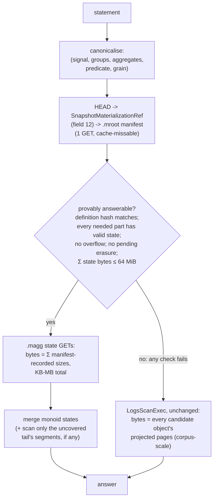

# ADR-0913: declared exact materialisations for aggregate answering

Status: Proposed. Issue #913, task T5 of the epic. Builds on ADR-0849
(snapshot-bound index plane), ADR-0850 (logs typed column statistics),
ADR-0090/ADR-0101 (declared typed columns), and ADR-0044 (per-query cost
accounting). The exactness rules lean on ADR-0022/ADR-0023/ADR-0024/ADR-0825.

## Context

ADR-0849 built the index plane and was honest about what it does not move:
of the 41 ClickBench statements, **25 are untouched by pruning, postings,
or metadata statistics** — `COUNT DISTINCT`, high-cardinality `GROUP BY`,
SELECT-list arithmetic, and regexp (ADR-0849, Consequences, "the honest
count"). Epic #913 labels that residue **Class F**: statements whose answer
requires visiting every row's *value*, so no amount of candidate pruning
changes what must be read. An index decides which bytes to fetch; these
statements need every byte unless the aggregate itself has been computed
ahead of time. This ADR is the design for computing it ahead of time,
exactly, without giving up any invariant the rest of the system holds.

The mechanism for answering a query from precomputed state already exists
and is proven twice over:

- `LogsScanExec::partition_statistics` and its `stats_are_exact` gate
  (`crates/ravel-sql/src/logs_scan.rs`) answer predicate-free `COUNT(*)`
  and contained timestamp bounds at zero data GETs.
- ADR-0850's `.cstat` objects plus the `MetadataOnlyAggregate` physical
  optimizer rule (`crates/ravel-sql/src/metadata_agg.rs`) answer
  q02/q07/q08 shapes from per-object exact statistics, with a safety lemma
  under which every defect degrades to scanning.

What does not exist is a way to precompute *tenant-specific* aggregate
shapes: a grouped `SUM` at an hourly grain over a declared predicate, an
exact distinct count of a mid-cardinality column. This ADR adds that as a
third coverage layer.

### Why declared-only

Coverage comes from three layers, and only the first is automatic:

1. **System-owned summaries.** Row counts, event-time bounds, null counts,
   min/max, bounded value dictionaries — the `sample_count` field on every
   commit record (docs/catalog-and-mvcc.md, "Commit record") and ADR-0850's
   `.cstat` objects. Universally cheap, always present, not declared. This
   layer already exists and this ADR does not change it.
2. **Tenant-declared materialisations** — this ADR. A tenant (or an
   operator on its behalf) declares the exact aggregate shapes worth
   precomputing: grouping dimensions, aggregate list, predicate, time
   grain. The declaration path follows the `typed_attr_columns` precedent
   (ADR-0090 decision 1; `TenantConfigRecord.typed_attr_columns`, field 12
   of `proto/ravel/sys.proto`): durable per-tenant config, whole-record
   CAS-replace, explicit three-state absent/empty/present semantics.
3. **A workload advisor** that observes repeated expensive statements
   through the per-query cost accounting ADR-0044 already produces, and
   RECOMMENDS a declaration together with its estimated state bytes,
   build requests, and expected per-query savings. It never builds and
   never removes anything autonomously. A recommendation is tenant-visible
   output; acting on it is a config write a person or an explicit policy
   makes.

Fixed-per-signal materialisation — "every logs tenant gets these ten
rollups" — is rejected beyond layer 1. Logs, traces, and security
workloads vary too much for a fixed set to earn its storage, and
auto-building high-cardinality state turns any workload change into
unbounded background work with no one accountable for the bytes. The
declaration is the accountability boundary: state exists because someone
asked for that shape, its cost is attributable to that declaration, and
retiring the declaration retires the cost.

## 1. The declaration model

### 1a. Where declarations live

A new optional sub-message on `TenantConfigRecord`
(`proto/ravel/sys.proto`), **field 13, additive** — the next free number
after `typed_attr_columns = 12`:

```protobuf
message MaterializationDecl {
  string name = 1;              // tenant-unique handle, for observability and retirement
  uint32 decl_version = 2;      // bumped on any definition change; see 1d
  uint32 signal = 3;            // one-letter signal domain, logs only in v1
  repeated string group_by = 4; // declared-column keys (ADR-0090/0101 vocabulary)
  repeated MaterializedAggregate aggregates = 5;
  string predicate = 6;         // canonical predicate text, may be empty; see 1c
  uint64 time_grain_ns = 7;     // 0 = no time dimension
}

message MaterializedAggregate {
  uint32 kind = 1;         // COUNT | COUNT_DISTINCT | SUM | MIN | MAX | AVG
  string input_column = 2; // declared-column key; empty for COUNT(*)
}

message MaterializationConfig {
  repeated MaterializationDecl decls = 1;
}
```

The three-state semantics mirror `TypedAttrColumnConfig` exactly: absent
sub-message = deployment default (which is empty in v1 — there is no
deployment-default materialisation set, by the fixed-per-signal rejection
above); present-empty = explicitly none; present non-empty = the ordered
declaration list. Mutation is the existing whole-record CAS-replace
(`ravel_catalog::set_tenant_config`,
`crates/ravel-catalog/src/tenant_config.rs`), and this field inherits the
same known hazard ADR-0090 named: an older writer rebuilding the record
from its own struct can drop the field. That hazard's mitigation (writers
preserve fields they do not understand, or old writers are blocked) is the
same gate ADR-0849 §1a already imposes for `HEAD` writers, and the rollout
rides it.

Validation on any write rejects: an empty or duplicate `name`; a
`group_by` or `input_column` key that is not a currently declared typed
column for the tenant (the materialisation vocabulary is exactly the
ADR-0090/0101 declared-column vocabulary — a materialisation over an
undeclared attribute has no typed identity to hash); an aggregate kind
outside the v1 set; `AVG`/`SUM` over a non-numeric declared type;
`SUM`/`AVG` over a declared `f64` column (deferred, §4d);
`COUNT_DISTINCT` over a declared `f64` column (deferred, §4c); a
`time_grain_ns` that is neither zero nor an even divisor of
3,600,000,000,000 — explicitly, `time_grain_ns = 0` is valid and means no
time dimension, and any nonzero grain must divide the ingest hour evenly
(grains must nest inside the ingest hour so a grain bucket never spans a
fold boundary's hour partitioning).

### 1b. The canonical definition hash

Every declaration has a **definition hash**: 32 bytes,
`blake3(domain || canonical encoding)` with domain separation string
`ravel-matdef-v1`, over exactly these fields, in this order. Every
integer in the hash input is fixed-width little-endian (the widths named
per field below); no varint or ZigZag encoding appears anywhere in it.
Every variable-length byte string in the hash input (column keys, the
canonical predicate text, encoded literals) is prefixed with its byte
length as u32 LE, so field boundaries are unambiguous:

1. `signal` (u32 LE);
2. **schema and type semantics**: for every column the declaration touches
   (each `group_by` key and each `input_column`), the tuple
   `(key bytes, declared TypedAttrColumnType as u32 LE)` in the
   declaration's stated order, plus the type-vocabulary version (the
   ADR-0101 vocabulary is version 2: v1's four types plus `f64`) — a
   future change to what a declared type *means* changes the hash;
3. **grouping expressions**: the ordered `group_by` key list (v1 grouping
   expressions are bare declared columns; any future computed grouping
   expression enters here in canonical text);
4. **aggregate state types**: the ordered `(kind, input_column,
   state_encoding_id)` list, where `state_encoding_id` names the exact
   state layout of §4 (so changing an encoding changes the hash even if
   the SQL-visible aggregate is unchanged);
5. **predicate**: the canonical predicate text of 1c (empty string for
   none);
6. **time granularity**: `time_grain_ns` (u64 LE);
7. **null/NaN/overflow semantics version** (u32 LE): a single version
   number naming the rule set of §4e. Changing how NULLs are counted, how
   NaN merges, or when overflow trips is a semantics change and must
   produce a different hash;
8. **state format version** (u32 LE): the `.magg` envelope version of §4a.

The hash is the coverage identity. A state object is usable for a query
only when the state's recorded definition hash equals the hash of the
declaration the planner resolved for the tenant *now* — recomputed from
the resolved config at plan time, never trusted from a stored copy. This
is the same never-infer-from-live-config rule ADR-0849 §3 states for pack
field sets, applied in the opposite direction: there, config drift must
not shrink claimed coverage silently; here, config drift must not let
stale state answer a redefined declaration.

The hash deliberately does **not** cover: the declaration `name` (a rename
is not a semantic change), `decl_version` (informational; the hash is the
identity), tenant identity (states already live under the tenant prefix
and bind tenant-scoped parts), or anything about which parts are covered
(that is snapshot binding, §2, a separate axis).

### 1c. Canonical predicate form

v1 predicates are a conjunction of atoms over declared columns:
`col = literal`, `col <> literal`, `col IN (literals)`, and
half-open/closed range atoms over `i64` columns. Canonicalisation: atoms
sorted by (column key, operator id, literal bytes), `IN` lists sorted and
deduplicated, literals encoded by declared type (`i64` as 8 bytes
two's-complement little-endian; `str`/`bytes` as u32 LE byte length
followed by the raw bytes; `bool` as one byte, `0x00` or `0x01`) — never
through display formatting, and never through a varint form (the §1b
fixed-width little-endian rule governs every integer hashed anywhere in
this ADR). A predicate the canonicaliser cannot express is a declaration
validation error, not a silent approximation. The planner's answerability
test (§5) compares canonical forms, so two spellings of the same
conjunction match; the one admitted relaxation is §5's — extra query
atoms over `group_by` dimensions, applied by group filtering — which only
ever makes the query narrower than the declaration, never wider.

### 1d. Change and retirement

A declaration changes by CAS-replacing the tenant config with a modified
`MaterializationDecl` carrying a bumped `decl_version`. Any change to a
hash-covered field yields a new definition hash, which makes every
existing state object for the old hash *unusable* immediately (the plan-
time hash comparison fails closed) and *unreferenced* at the next fold
(the new manifest names only current-hash states), after which the sweeper
reclaims them under the lifecycle of §2c. There is no in-place state
migration and no dual-hash read: the old states answer nothing from the
moment the config lands, queries scan until the builder catches up, and
that window is a latency cost, never a correctness one.

Retirement is removal of the decl from the list: the next fold publishes a
manifest without that declaration's states, and the sweeper reclaims them.
Nothing in the read path ever needs to know a declaration *used to* exist.

## 2. Snapshot binding and lifecycle

This section follows ADR-0849's discipline — two-level content binding,
`HEAD`-anchored protection, supersession sweeping — and uses the same
carrier (`SnapshotHead` sibling refs under `catalog/<signal>/`).
Deviations from ADR-0849 are called out inline with reasons.

### 2a. Objects and binding

Two object kinds, both immutable, content-addressed, under the existing
`t/<tenant>/catalog/<signal>/idx/` prefix (an additive suffix under an
already-listed prefix, exactly the ADR-0849 §1 shape):

- **State objects** (`.magg`): one per **(definition hash, snapshot
  part)**. Holds the partial aggregate state for every row the part's
  entries contribute, keyed by (time-grain bucket, group tuple), in the §4
  encodings. Each state object **binds the covered part's exact
  `SnapshotPartRef.blake3` — never its `watermark_hour`**. ADR-0849 §1
  established why the label is the wrong carrier (a compaction can rewrite
  a part's content under the same hour label); the same regression test
  shape applies here: same `watermark_hour`, different part bytes, state
  must be rejected.
- **A manifest** (`.mroot`): one per fold, bound to the exact ordered
  snapshot-part hash list (the `SnapshotPostingsRef.part_blake3`
  convention, `proto/ravel/catalog.proto`). For every (definition hash,
  part) it names: the state object's key, its blake3, its **exact encoded
  byte size**, its group count, and its **overflow flags** (§4e). The
  manifest is what the planner reads to decide eligibility (§6) before
  fetching any state.

`SnapshotHead` gains **field 12, additive**: `SnapshotMaterializationRef`
(key, blake3, size, decl count, covered `part_blake3` list — the
`SnapshotColumnStatsRef` shape at field 11, one more sibling). Absence
means no materialisations built, and readers must treat absence as
fall-back-to-scan, never as an error — the same reader rule fields 9 and
11 already carry.

**Why per-part states (a deviation in grain, not in discipline).**
ADR-0850 keys `.cstat` records by the L0 five-field identity tuple and
defers L1 coverage because compaction overloads the `writer_*` slots.
Materialised state cannot accept that deferral: the corpus this epic
targets is fully compacted (ADR-0849 Context: 3,469 objects *after* L1),
so an L0-only mechanism would cover nothing there. Binding state to the
snapshot *part* covers L0 and L1 entries uniformly, because a part is the
unit the fold already carries forward by reference for sealed hours
(docs/catalog-and-mvcc.md, "Fold reconcile pass": sealed parts are carried
forward by reference and never rewritten). The economics follow ADR-0849
§1's two-level argument directly: an appended tail invalidates only the
manifest and the tail part's states; a compacted or reconciled hour
invalidates only that hour's part and therefore only that part's states;
sealed history's states survive every fold untouched. Whole-set binding on
every state object would rebuild all materialised state on every fold and
is rejected for the reason ADR-0849 §1 rejected it for leaf packs.

### 2b. Staleness detection

A state object is usable only when **all** of the following pass, checked
in this order, each failure subtracting exactly that state's coverage
(the ADR-0849 §3 "a leaf that fails validation subtracts its own
coverage" rule):

1. the `HEAD`-named manifest decodes, its blake3 matches, its
   `part_blake3` list equals the resolved snapshot's ordered part hashes
   (a manifest bound to a superseded part set is stale in its entirety);
2. the manifest entry's definition hash equals the hash recomputed from
   the tenant's currently resolved declaration (§1b);
3. the state object's blake3 matches the manifest entry, its envelope
   version is understood, and its recorded part binding equals the part it
   claims to cover;
4. no overflow flag relevant to the query is set (§4e);
5. the snapshot has no pending selective erasure and no token-admitted
   uncovered segment (§2d, §5).

### 2c. Supersession and sweeping

The sweeper situation is exactly the one ADR-0849 §1a documented, and this
ADR takes the same position: **the lifecycle is not inherited; it must be
extended before the first state object is written.**
`sweep_unreferenced_catalog_objects` (docs/catalog-and-mvcc.md, the
fifth GC rule) lists the whole `idx/` prefix, so `.magg`/`.mroot` objects
are *discovered* the moment they exist, and its reference set is currently
`HEAD.parts[].key` plus the named sibling refs — so an unprotected state
object is **deleted** at the protection horizon.

Protection therefore extends the same way ADR-0849 §1a wave 0 extends it
for index leaves: `HEAD` names the `.mroot` manifest (field 12), and the
sweeper decodes the manifest to add every named state key to its reference
set. This ADR picks the decode-the-root option (rather than `HEAD` naming
every state key) and states why: state count is `declarations x parts`,
which can reach thousands of keys, and `HEAD` is the object every reader
GETs on every resolve — inflating it with a key list that only the sweeper
needs would tax every query to save the sweeper one GET per sweep. Both
mixed-version hazards ADR-0849 §1a names (old sweeper reaping under a new
`HEAD`; lagging folder CASing the field away) apply verbatim, and both
gates — sweeper rollout complete before the first pack-writing fold, every
`HEAD` writer preserving unknown fields before the first root publishes —
are shared gates, not new ones: if ADR-0849's wave 0 has shipped, this ADR
adds one decode branch to an already-extended sweeper; if it has not, this
ADR is blocked behind the identical wave 0 and must not ship states first.

Supersession is the existing pattern unchanged: every fold that changes
any state writes new content-addressed objects and swaps `HEAD` in its one
CAS; old manifests and states become unreferenced and age out past the
protection horizon. No new sweep rule, no new deletion trigger.

**No intermediate fragments.** ADR-0849 §1a's carrier dilemma (fragments
that no `HEAD` names, produced by one stage and consumed by another) does
not arise here, because the build (§7) is single-stage: the fold computes
states from row decode in the same pass that publishes them, the
`build_column_stats` shape. This is a real deviation from ADR-0849's
compaction-produces/fold-consumes pipeline and it is deliberate — see §7
for what it costs and why that cost is right for aggregate state.

### 2d. The erasure-epoch constraint list, addressed explicitly

Materialised states answer queries directly, so they sit on the
**metadata-execution** side of ADR-0849 §3's line, not the pruning side:
the safety lemma's union-with-uncovered shape does not protect them, and
the full §5 condition list of ADR-0849 applies. Its erasure constraints,
one by one:

- **v1 mechanism: refuse on any pending erasure.** A materialised plan is
  rejected outright while the resolved snapshot's `pending_erasure` is
  non-empty. This is exactly the `stats_are_exact` posture
  (`crates/ravel-sql/src/logs_scan.rs`, "refuses whenever `self.erasure`
  is non-empty") and ADR-0850's lemma bullet, and it is sound with no
  epoch machinery because resolve attaches every durable `.dreq` before
  the snapshot is constructed (docs/catalog-and-mvcc.md, "Snapshot
  resolution", step 6): a query that resolves after an erasure ack always
  sees the request and always scans. The cost is that every pending
  erasure disables all materialised answering tenant-wide until the
  rewrite, fold, and rebuild complete — the same cost ADR-0850 accepted.
- **When the ADR-0849 epoch mechanism is built, states adopt the same
  carrier**, and every constraint on ADR-0849 §5's list binds here
  unchanged: the allocator is tenant-scoped with its own CAS (never
  `HEAD`, which is per-(tenant, signal)); the value is a strictly
  increasing generation counter, never a timestamp; the epoch stamped on a
  state object is **derived from the erasure state actually applied in
  the source rows it summarises** — the minimum over its covered part's
  applied epochs — never from build wall-clock (a state built after
  acknowledgement but before the rewrite is visible summarises pre-erasure
  rows and must fail the comparison); the epoch a query compares against
  is pinned with the query snapshot; and an acknowledgement never becomes
  visible before its epoch CAS succeeds. Selection then requires
  `state_epoch >= tenant_epoch` for **every** state the plan reads, one
  failure sending the whole statement to a scan. The three-step
  ack-rewrite-fold test ADR-0849 §5 requires (epoch never decreases
  across `.dreq` reclamation; pre-ack state rejected; post-ack-pre-rewrite
  state rejected) is required here for `.magg` objects too, because the
  third case is precisely a materialised `COUNT` returning a pre-erasure
  number to a compliance query.

This ADR builds no epoch. It commits to the constraint list so the future
mechanism has one carrier serving both `.istat`/`.ival` packs and `.magg`
states, never two freshness clocks that can disagree.

## 3. Coverage layers restated as one rule

For a given statement the planner sees three sources, strictly ordered by
specificity: declared materialisations (this ADR), system summaries
(ADR-0850 / commit-record statistics), and the scan. Selection tries them
in that order and each source's *own* gate decides — there is no blended
answer from two sources except the covered-plus-uncovered merge of §5,
which is a merge of the *same* declaration's states with a scan remainder,
never a merge across definitions.

## 4. Aggregate state encodings

### 4a. Envelope

New object kind `.magg`, magic `RMAG`, version `1u8`, modeled on
`crates/ravel-catalog/src/snapshot_format/column_stats.rs` / `part.rs`
framing: magic + version + reserved + protobuf header (tenant hash,
signal, definition hash, covered part blake3, group count, uncompressed
body length, **the object's own encoded byte size and its overflow
summary flags** — every state object records these itself, so a state is
self-describing even when read outside a manifest, and the manifest's
copies (§2a) are a pre-fetch convenience that must agree, a mismatch being
a validation failure that subtracts coverage) + zstd body + trailing
crc32c. Decode enforces a size ceiling
before inflating (the `ColumnStatsLimits` precedent), so a corrupt header
cannot force an unbounded allocation. The body is length-delimited
per-(grain-bucket, group-tuple) state records, sorted by (grain bucket,
canonical group-key bytes) for deterministic output — the same
deterministic-bytes rule every sibling envelope holds, which is what makes
content addressing idempotent across independent folders.

This is an additive object kind plus one additive `SnapshotHead` field.
**No frozen contract changes in place and no format version bump**: the
key layout gains a suffix under an existing prefix (the ADR-0849 §1
additive pattern), `catalog.proto` gains additive messages and field 12,
`sys.proto` gains additive field 13. ADR-0029's additive-section policy is
the precedent for extension-without-bump, and nothing here edits an
existing layout, so the format-change procedure's bump branch is not
triggered.

### 4b. Per-aggregate state layouts and merge semantics

Every state is a commutative-or-order-pinned monoid with an explicit
identity, so partials per part merge into the query answer. Layout intent
(exact widths; wire encoding is the protobuf body, these are the value
domains the hash's `state_encoding_id` pins):

| aggregate | state | merge | identity |
|---|---|---|---|
| `COUNT(*)` / `COUNT(col)` | `count: u64` | checked u64 add | 0 |
| `SUM(i64 col)` | `sum: i128` (16 bytes LE) + `null_count: u64` | checked i128 add | 0 |
| `MIN`/`MAX` (all declared types) | the extreme value as a `ColumnValue`-shaped typed scalar + `non_null_count: u64` | total-order compare | absent (no non-null row) |
| `AVG(i64 col)` | reuses the `SUM` state plus `count` | componentwise | (0, 0) |
| `COUNT DISTINCT(col)` | canonical value set: sorted, deduplicated, length-prefixed **canonical values** (§4c) | set union | empty set |

Low-cardinality `GROUP BY` is not a separate state: the (grain bucket,
group tuple) keying of the body *is* the group dimension, and "low
cardinality" is enforced by the byte budget, not by a distinct-count
ceiling — a state object whose encoded size exceeds the per-object build
ceiling records overflow (§4e) rather than truncating. Algebraic rewrites
(`SUM(x + k) = SUM(x) + k * COUNT(x)`, `COUNT(*) - COUNT(col) =
null count`, `AVG` from `(SUM, COUNT)`) are planner-side derivations over
these states (§5) and store nothing extra.

`MIN`/`MAX` over a declared `f64` column uses `f64::total_cmp` — negative
NaN below `-Inf`, `-0.0 < 0.0`, positive NaN above `+Inf` — matching the
engine's own total-order min/max UDAF exactly (ADR-0023), so the
materialised extreme is bit-identical to the scan's, NaN payloads
included. Extremes are compared and stored by bit pattern, never through
`==` (the repo-wide float discipline; ADR-0101 restates it for declared
`f64`).

### 4c. Exact `COUNT DISTINCT`: what "exact" requires of the bytes

**A set of 64-bit hashes alone is not exact** and is not admissible as a
distinct state. Two distinct values colliding under a 64-bit hash would
merge into one, undercounting silently — improbable is not exact, and
exactness here is an invariant, not a tolerance. A distinct state
therefore stores one of:

- the **canonical values themselves** (declared-type canonical encoding,
  §1c's literal encoding), sorted and deduplicated — the default; or
- a **collision-resolving dictionary**: hash-ordered entries where every
  entry carries the full canonical value, hashes used only as sort/probe
  keys, equality always decided on value bytes.

Either way the merge is exact set union on value bytes. Union preserves
the size bound the budget check (§6) relies on: a merged state's encoded
size never exceeds the sum of its inputs' encoded sizes.

v1 distinct state is admissible over `i64`, `str`/`bytes`, and `bool`
input columns only — exactly the types with a §1c canonical encoding.
`COUNT DISTINCT` over a declared `f64` column is **not admissible in v1**
(validation, §1a), and the reason parallels §4d's: the only exact
canonical form for an f64 value is its bit pattern (`f64::to_bits` —
ADR-0101 makes NaN payloads and `-0.0` significant and bans `==` in this
path), under which `-0.0` and `0.0` are two distinct values and every NaN
payload is its own value. Nothing pins the scan-side `COUNT DISTINCT`'s
f64 equality to that same partition, and a materialised distinct count
must equal the scan's to the last row. Deferred until the scan-side f64
distinct equality is pinned by its own decision, the same gated-deferral
shape as §4d. Together the two sections tell one story: a declared `f64`
column enters v1 aggregate state only through `MIN`/`MAX`, whose total
order §4b pins to the engine's own UDAF (ADR-0023).

Exact distinct state grows without bound in NDV — there is no encoding
that does not — so at ~10^7 NDV the arithmetic alone (10^7 values at even
8-16 bytes each is 80-160 MB before overhead) puts any such state far past
the 64 MiB plan budget, and **fallback to scan is the expected outcome,
not a defect**. High-cardinality exact distinct is opportunistic coverage
this design permits when the bytes happen to fit; it is not a success
criterion of this ADR, and no acceptance figure may be predicated on it.

### 4d. Float summation order: pinned, and deferred until pinning means something

`SUM`/`AVG` over a declared `f64` column is **not admissible in v1**, and
the reason is stated so it cannot be re-litigated as an oversight. f64
addition is non-associative, so a materialised float sum is exact only
relative to a *pinned* summation order. The order this design pins, for
when the aggregate is admitted:

- **within one part's state**: a sequential left fold over rows in the
  part's deterministic physical order — entries in the part's entry order,
  blocks in block order within each segment, rows in row order within each
  block. Every one of those orders is a property of immutable objects, so
  two independent builders of the same part produce bit-identical partials;
- **across parts**: a sequential left fold in the snapshot's deterministic
  total order over the covered parts (docs/catalog-and-mvcc.md, "Snapshot
  resolution": snapshot ordering is a deterministic total order across
  mixed levels), which the manifest's part list fixes at fold time.

That pins the materialised side completely. What it cannot pin is
agreement with the scan: the engine's shipping `SUM` over f64 is
DataFusion's lane-parallel accumulator, whose bit pattern is
architecture-dependent (ADR-0024, Context), and ADR-0024 — which would
move `sum` to the deterministic sequential fold — is Proposed, not
decided. A materialised float `SUM` admitted today would return
deterministic bits while the scan it must match returns
architecture-dependent bits: "falls back to scanning and returns the same
answer" would be false in the last ulps by construction. So the
non-associativity is acknowledged and bounded the only honest way:
**deferred, gated on ADR-0024's resolution**, exactly the shape ADR-0090
used to defer declared `f64` columns until ADR-0101 could do them
properly. Integer `SUM`/`AVG` needs none of this — i64 sums into i128
exactly under any order (ADR-0825's integer-avg reasoning; exceeding i128
needs more addends than a tenant can hold) — which is why the v1 aggregate
set is the compact-monoid set and loses almost nothing the Class-F residue
actually contains.

### 4e. Null, NaN, and overflow rules (hash-covered, semantics version 1)

- **Null**: `COUNT(col)`, `SUM`, `AVG`, `MIN`/`MAX` are over non-null
  values; `null_count`/`non_null_count` are carried so `COUNT(*)`-vs-
  `COUNT(col)` derivations stay exact. `COUNT DISTINCT(col)`'s canonical
  value set likewise holds only non-null values: NULL never enters the
  set and the encoding has no NULL marker, so an all-NULL input produces
  the empty set (the §4b identity) and the materialised answer is 0,
  exactly as SQL's `COUNT(DISTINCT col)` requires. A row where the
  declared column's
  stored type mismatches its declaration reads NULL, exactly ADR-0090
  decision 7 — the state builder and the scan see the same NULL, by
  construction, because both decode through the same declared-column path.
- **NaN**: enters only `MIN`/`MAX` in v1 (no float sums), under the
  total order of §4b, payload preserved by bit pattern.
- **Overflow is a per-state sticky flag: `overflow ∪ anything =
  overflow`.** An i128 sum overflow, a distinct or grouped state whose
  encoded size exceeds the build ceiling, or any condition that would
  force truncation, sets the flag and **stores no partial content for the
  affected scope** — a truncated exact state is never published as usable
  coverage, because "the first N distinct values" answers nothing exactly.
  The flag is recorded per (grain bucket, group tuple) scope where the
  scope is separable (one hot group overflowing must not poison every
  group in the part) and mirrored as a per-state-object summary flag in
  the manifest so the planner can refuse without fetching. Merging any
  overflowed scope with anything yields overflowed, under every merge in
  §4b — a merge that "recovers" from overflow by dropping the flag would
  publish a truncated state under a clean label.

Build memory is bounded separately: the builder spills its in-progress
group table to local scratch when it exceeds its memory law (§7). Spilling
is invisible in the state bytes and **must not change SQL semantics** —
what overflows is the *encoded state size* against its ceiling, never "we
ran out of RAM", so the same input produces the same states and the same
flags on an 8 GB host and a 256 GB host.

## 5. Planner selection: provable answerability, fail-open fallback

The rule: **a materialisation is used only when the statement is provably
answerable from it; everything else scans.** Provably answerable means all
of the following, decided from the manifest and the resolved declaration
before any state bytes are fetched:

1. **Definition match.** The statement's canonicalised (signal, grouping
   set, aggregate list, predicate, grain) is *derivable* from one
   declaration: its predicate's canonical form is answerable from the
   declaration's — either the two canonical conjunctions are equal (v1's
   base case), or the query's conjunction is **at least as restrictive**:
   it contains every atom of the declaration's canonical conjunction, and
   every additional atom is over a `group_by` dimension, so the extra
   restriction is applied exactly by filtering group tuples. The
   direction is one-way. A query whose predicate omits any declaration
   atom is never answerable from the state: the state holds only rows
   the declaration's predicate admitted, and answering the wider query
   from it would silently undercount; its grouping set is a subset of the
   declared `group_by` (merging groups is re-aggregation over the same
   monoids); its time grain is a positive integer multiple of the declared
   grain and its time bounds align to declared-grain boundaries (a
   declaration with `time_grain_ns = 0` has no time dimension and matches
   only statements with no time grouping and no event-time restriction);
   every aggregate is one of the declared states or an allowed algebraic
   rewrite over them (§4b). Anything not on that list — a novel
   expression, a non-aligned bound, a differently-typed literal — is not
   provable and scans. The rule is allowlist-shaped for the same reason
   the metadata rule's branch contracts are (ADR-0850 decision 5): every
   admitted shape is one someone proved, and the default is the scan.
2. **Coverage.** Every live part in the resolved snapshot either has a
   valid state (all §2b checks pass) for the matched declaration, or
   falls into the scan remainder below. Above-watermark listed segments
   and token-resolved segments are structurally uncovered (they are
   outside every part), exactly as ADR-0849 §3 places them.
3. **Freshness.** No pending erasure (§2d); definition hash current (§1b).
4. **Budget.** The §6 byte check passes.

When parts are covered and a remainder is not, the plan is **hybrid**:
merge the covered parts' states with the same aggregation computed by
scanning the remainder's segments. This is sound for every v1 state
because every v1 monoid is order-insensitive-exact (integer, count,
total-order extremes, set union); the future order-pinned float states are
excluded from hybrid merging by their own encoding id until an ADR defines
their scan-merge order. Hybrid is what makes materialised answering usable
on a live-ingest tenant at all — the L0 tail is uncovered by construction
(ADR-0849 Consequences, "metadata-only execution is a benchmark capability
until it is made hybrid"), and this ADR ships the hybrid form from the
start rather than repeating that limitation.

**Every failure mode falls back to scanning and returns the same
answer.** Absent manifest, stale part binding, hash mismatch, unreadable
state, version from the future, overflow flag, pending erasure, budget
exceeded, unprovable shape: each subtracts coverage or rejects the
materialised plan, and the statement runs as the scan it would have been —
`LogsScanExec` unchanged, the ADR-0850 lemma's shape. A materialised plan
is a short-circuit into precomputed exact state, never a new way to answer
differently. Approximation is opt-in and visible everywhere in this
system; this ADR introduces none: there is no code path in this design
that returns a number a full scan would not return.



The two paths differ only in where bytes come from and how many: the
covered path reads the manifest plus a bounded set of small state objects;
the uncovered path reads the corpus. The answer is identical.

## 6. The 64 MiB budget

A materialised exact plan is eligible only if the total serialised state
and auxiliary bytes it would fetch — retries included — fit a **64 MiB
materialised-plan budget**. How that is computed *before* fetching:

- **The estimate is not an estimate.** The manifest records every state
  object's exact encoded byte size, written at build time when the builder
  PUT the object (the `SnapshotColumnStatsRef.size` convention — a
  recorded fact, not a model). Eligibility sums the recorded sizes of
  exactly the state objects the plan would fetch, plus the recorded sizes
  of any auxiliary objects the encoding references (v1 encodings are
  self-contained; the term exists so a future shared-dictionary encoding
  cannot slip bytes past the check).
- **Retries included**: the sum is multiplied by
  `1 + max_state_get_retries` (the store client's configured per-request
  retry ceiling), so the budget bounds worst-case bytes moved, not
  best-case. A retry re-fetches identical immutable bytes, so this is a
  strict upper bound, not a heuristic.
- **Combined bound for distinct states**: when several bucket states'
  merged distinct set is what the query needs, the upper bound is the sum
  of their encoded sizes (union never exceeds the sum, §4c), so summing
  manifest sizes is already the correct conservative bound and no merge
  is simulated.
- Exceeding the budget rejects the materialised plan and **the planner
  scans** — it never partially fetches, never truncates, never
  approximates under pressure. 64 MiB is a per-query constant of this
  mechanism, deliberately not tenant-tunable in v1: it is the line between
  "reading state is obviously cheaper than scanning" and "state so large
  the scan should be reconsidered anyway", and per-tenant tuning of it
  would make plan selection depend on mutable config in a way the
  definition hash does not capture.

These fetches are their own cost phase. The repo's per-phase cost rule and
ADR-0849 §2's routing budget extend here: manifest resolve counts with the
root probe phase, state GETs are a distinct `materialise` phase reporting
requests and wire bytes as transferred, never pooled into scan counters. A
materialised plan that silently spent more than the scan it replaced must
be visible as exactly that. This per-query auxiliary-I/O budget — routing
caps from ADR-0849 plus the 64 MiB state cap here — is the whole of the
read-side storage governance: there is deliberately **no global
auxiliary-bytes percentage** (no "indexes plus materialisations may be at
most N% of data bytes"), because a global ratio pools unlike mechanisms
into one bucket where a runaway one starves a healthy one. Instead, each
mechanism carries its own law (per-object ceilings, per-fold build laws
§7, the plan budget), each reports its bytes per tenant per declaration,
and a tenant can see exactly which declaration owns which bytes.

## 7. Build path

States are built **fold-side**, the `build_column_stats` shape
(`crates/ravel-catalog/src/column_stats_build.rs`: the fold already runs
`RlogReader::scan_blocks` row-decode passes over entries for declared
columns — ADR-0850 decision 4 established that the fold can decode rows
when a declared feature needs it, which is the constraint ADR-0849 §1a
warns must not be assumed and here is not assumed but cited):

- Each fold, for each declaration, for each part that lacks a valid
  current-hash state: decode the part's entries' rows restricted to the
  declaration's columns (one `ColumnSelection` covering group and input
  columns together, one decode pass per entry — the ADR-0850 rule that one
  pass computes everything so components cannot quietly disagree),
  fold rows into the (grain bucket, group tuple) state table, spill to
  local scratch past the memory law, encode, PUT with
  `create_if_absent`, and name the object in the manifest.
- Sealed parts carried forward by reference keep their existing states by
  reference: the manifest's new edition names the same state keys. Only
  changed parts (the tail, a reconciled hour, a compaction output) build.
- Build failure for one (declaration, part) drops that state from the
  manifest — coverage subtracts, queries scan that part — and never fails
  the fold. The attach sequence mirrors ADR-0850's: any failure is a
  `tracing::warn!` and a fold without that ref, never a fold error.
- A **runaway-build circuit breaker** bounds each declaration separately:
  a declaration whose per-fold build exceeds its law (decoded-bytes and
  wall-time ceilings per fold, fixed constants of the builder) is paused —
  its states stop being rebuilt, its coverage decays to scan, and the
  pause is a tenant-visible condition on that declaration. Pausing one
  declaration's builder never touches another's and never touches the
  fold's core work: **required integrity metadata (parts, commit-record
  processing, `HEAD` itself) never competes with optional materialisations
  in any shared budget** — the breaker exists precisely so the optional
  layer sheds first and alone.

Why fold-side and not compaction-side or a separate service: the fold is
the only stage that already owns the publish step (the one `HEAD` CAS),
already computes which parts changed, and already has the incremental
baseline-carry-forward structure this build needs; putting the build
anywhere else recreates ADR-0849 §1a's orphaned-fragment carrier problem
(§2c) for no gain. The cost is real and named: fold latency grows by the
row-decode of changed parts for declared materialisations, on the fold's
own schedule, off the acknowledgement path — ingest acks never wait on it,
and a tenant with no declarations pays nothing (no ref is built, the
ADR-0850 free-when-unused shape). Backfill of a quiescent, fully folded
tenant needs one maintenance pass that forces a rebuild fold over
unchanged parts — the same precondition ADR-0849's Consequences states for
measuring anything on the reference tenant, and the pass that would
produce this ADR's first real figures (state bytes per declaration, build
seconds per GB decoded, covered-vs-scan latency per statement). **No such
figure exists yet and none is claimed here**; the measurement runs under
the repo's pre-registration discipline when the build lands.

## 8. Rejected alternatives

1. **Approximate sketches (HLL, theta, KMV) for distinct; sampled or
   error-bounded aggregates.** Rejected by the exactness invariant, which
   is not this ADR's to weaken: approximation in Ravel is opt-in and
   visible, and a materialisation is invisible by design — the planner
   substitutes it silently, so it must be indistinguishable from the scan
   to the last bit. A sketch answer differing in row one of a compliance
   count is a wrong answer, not a fast one. (An explicit, opt-in
   `APPROX_*` SQL surface would be a different feature with different
   visibility rules, and nothing here precludes proposing it separately.)
2. **Workload-derived automatic materialisation** (the advisor builds what
   it observes). Rejected: it converts a workload change into unbounded,
   unattributed background work, and its failure mode — high-cardinality
   state auto-built from one exploratory query storm — is exactly the
   runaway the circuit breaker exists to stop. The advisor's whole value
   survives in recommendation form: same observation, same estimate, human
   or policy holds the pen.
3. **Fixed-per-signal materialisation** beyond the universal summaries.
   Rejected: logs, traces, and security workloads do not share an
   aggregate vocabulary worth its storage, so a fixed set is simultaneously
   too big (paying for shapes nobody queries) and too small (missing every
   tenant-specific shape that motivated this ADR). Layer 1 already
   captures everything that is genuinely universal and cheap.
4. **A mutable aggregate store** (read-modify-write states updated per
   ingest batch, on S3 or locally). Rejected twice over: ADR-0849 rejected
   the mutable-structure-on-S3 shape for economics and atomicity (no
   multi-object atomic update; every update a contended read-modify-
   write), and a locally-mutable store violates the durability invariant
   outright (object storage is the only durable backend; no recovery path
   may read another process's local state). Immutable per-part states with
   an atomic `HEAD` swap match what the platform is good at and inherit
   the MVCC, sweeping, and crash-safety machinery unchanged.
5. **Whole-set binding on every state object** (every state binds the full
   ordered part list). Rejected for the reason ADR-0849 §1 rejected it for
   leaf packs: every fold appends or replaces a part, so whole-set binding
   rebuilds all materialised state on every fold; per-part binding
   confines invalidation to what changed.
6. **Storing 64-bit value hashes as the distinct state.** Rejected in §4c:
   collision merges two distinct values silently. Not exact, therefore not
   admissible, however improbable the collision.

## 9. Consequences

- **What moves.** The Class-F residue's compact-monoid members become
  answerable at state-fetch cost instead of corpus cost, when declared:
  grouped `COUNT`/`SUM`/`MIN`/`MAX`/`AVG` at or above the declared grain,
  `SELECT`-list arithmetic reachable by the §4b rewrites, and exact
  distinct where the value set fits 64 MiB. On the reference corpus that
  is a per-statement change from "read 3,469 objects, 12.03 GB, ~1.2 s
  floor" (ADR-0849, Context) to a manifest probe plus KB-to-MB of state
  GETs; the actual figures await the backfill pass (§7) and are not
  claimed in advance.
- **What does not move, stated plainly.** Regexp and free-text predicates
  (no canonical predicate form); undeclared shapes (by design — this is
  the declared-only decision working as intended); high-NDV exact distinct
  (expected fallback, §4c); float `SUM`/`AVG` and `COUNT DISTINCT` over
  `f64` (deferred, §4d and §4c); ad-hoc predicates that differ from every
  declaration's canonical form other than by extra atoms over `group_by`
  dimensions (§5); queries with non-grain-aligned time bounds (v1
  conservatism, §5). **An uncovered
  query costs exactly what it costs today**: the full scan floor, ADR-0849
  pruning included where applicable, plus one manifest probe (bounded by
  the routing budget, cache-missable) that told the planner to scan. The
  materialisation layer never makes an uncovered query slower than the
  status quo by more than that probe.
- **New storage, attributed.** State bytes are per-declaration,
  per-tenant observable, bounded by per-object ceilings and the build
  laws, swept by supersession like every sibling object, and subject to
  the same protection-horizon delayed reclamation already measured for
  catalog objects (ADR-0849, Consequences).
- **New fold cost, off the ack path.** Row decode of changed parts per
  declaration per fold, breaker-bounded, zero for undeclaring tenants.
- **Sequencing.** Blocked behind ADR-0849 wave 0 (sweeper reference-set
  extension and `HEAD`-writer field preservation, §2c) — shared gates, not
  new ones. The erasure epoch remains deferred with the constraint list of
  §2d binding any future design.
- **Two config surfaces already interact.** Retiring a declared typed
  column (ADR-0090) that a materialisation's `group_by` or `input_column`
  names orphans the declaration: validation rejects *new* declarations
  over undeclared columns, and a column retirement while a materialisation
  references it flips the definition-hash comparison closed at the next
  plan (the hash covers the column's declared type, which no longer
  resolves), so the failure is a scan, not a wrong answer. The config
  writer should refuse the column retirement or cascade it; which, is an
  implementation-ticket decision, and the fail-closed hash makes either
  choice safe.

Refs: #913, #849, #850
