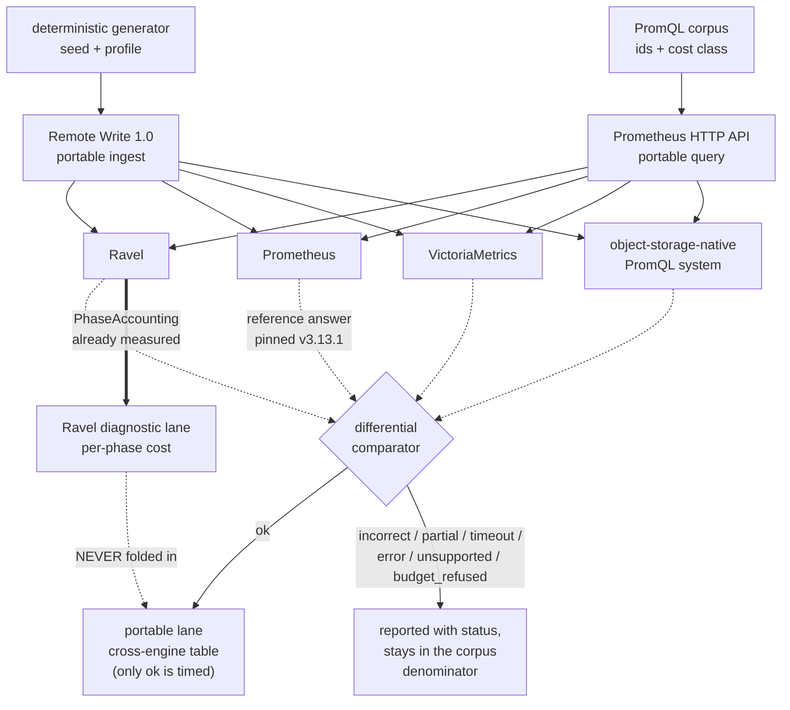

# ADR-0927: MetricsBench, a reproducible metrics and PromQL benchmark contract

Status: Proposed. Issue #927, task T1 of the epic. Builds on ADR-0044
(per-query cost accounting), ADR-0070 (store request scheduling and the
performance gate), ADR-0075 (published numbers are measured against real S3),
ADR-0015 (Remote Write ingest), ADR-0025/ADR-0030 (accepted PromQL
divergences), and ADR-0108 (native histograms through range evaluation).

## Context

Ravel has a reproducible ClickBench implementation for logs and analytical
SQL. It has no equivalent for metrics, which is the signal Ravel is primarily
built for. What exists today, verified against `origin/main`:

- **No PromQL benchmark corpus.** Every metrics benchmark hardcodes a single
  query string: `query_latency_bench` defaults to `bench_gauge`,
  `pushdown_crossover` has one `const QUERY`. There is nothing to extend.
- **A correctness corpus does exist**, and it is good:
  `crates/ravel-promql-difftest` runs 242 entries across 10 files against a
  pinned real Prometheus **v3.13.1**, scoring 133/133 constructs on the
  non-experimental surface.
- **The PromQL read path is already fully instrumented.** `PhaseAccounting`
  (`crates/ravel-query/src/phase_accounting.rs:214`) splits every
  `QueryAccounting` counter across four phases (resolve, plan, probe, scan)
  and is constructed on every query at `engine.rs:1261`.
- **That phase data is discarded at the response boundary.** It reaches no
  JSON field, no `/metrics` family, and no reader outside two engine unit
  tests.
- **No performance-regression comparator exists.** ADR-0070 decision 3's
  Tier B is specified and unbuilt: there is no `bench/baselines/` and no
  baseline-diff CI job.
- **No checked-in report renderer exists.** Post-hoc analysis is a Python
  script embedded in a Markdown runbook.

Stage 0 of the epic process is deliberately skipped, and this records why: a
benchmark epic delivers the measuring apparatus. There is no metrics baseline
to profile because producing the first one is the deliverable. Aiming this
work with a profile would be circular.

## Decision

### 1. Two lanes, and the boundary between them is load-bearing

**The portable lane** is the only basis for cross-engine comparison: Prometheus
Remote Write for ingest, the Prometheus HTTP query API for reads. Every
participating system receives the same logical samples and the same queries.

**The Ravel diagnostic lane** explains a Ravel result and is never folded into
a cross-engine score. It reports what portable APIs cannot: per-phase
object-store cost, segments considered and pruned, cache behaviour, and
commit-acknowledgement latency.

A figure from the diagnostic lane may never appear in a comparison table.

### 2. Remote Write 1.0 is the cross-engine ingest baseline

Ravel accepts both 1.0 and 2.0 (`services/ravel-server/src/remote_write.rs`,
content-type negotiated, 415 otherwise). 1.0 is chosen because it is the
version every candidate comparator accepts without configuration. Remote
Write 2.0 and OTLP are **separate lanes**, reported separately, never compared
against a 1.0 figure as though protocol overhead were identical.

**Remote Read is not used.** `/api/v1/read` does not exist in Ravel, there is
no handler and no ADR proposing one. Any comparison design that assumed a
portable read-back path must not.

### 3. Acknowledgement semantics are reported, never normalised

Ravel's Remote Write surface is **strict-mode only, unconditionally**: a 2xx
means the data object and its commit record are both durably stored, and the
response carries `x-ravel-commit-token`. Buffered mode exists but Remote Write
cannot reach it; it is an OTLP-only header.

Every ingestion result states what that system's acknowledgement means. A
durable-on-ack latency is never placed in the same column as a buffered ack
without the distinction on the same row.

This also fixes a measurement trap: an OTLP-based comparison **could**
accidentally measure a non-durable ack. The portable lane's use of Remote
Write forecloses it.

Ack is not visibility. Default `--max-flush-delay` is 2 s. The harness passes
the returned commit tokens as `min_commit_token` for deterministic
read-your-write rather than sleeping, because sleeping measures the flush
delay and calls it query latency.

### 4. The correctness oracle already exists and is reused, not rebuilt

`crates/ravel-promql-difftest` is the oracle: pinned Prometheus v3.13.1, a
histogram-aware comparator, and per-entry float tolerance for the ADR-0025
residue. MetricsBench consumes it rather than growing a second comparator.

A query is timed for competitive reporting **only after** its result passes
correctness, and this applies to **every participating engine, not only
Ravel**. VictoriaMetrics and the object-storage-native system are compared
against the same reference answer on the same terms; an engine whose result
diverges is reported `incorrect` and is not timed, exactly as Ravel would be.
Timing an unverified competitor result while gating our own would flatter them,
and timing ours while gating theirs would flatter us. Neither is a measurement.

Prometheus is the source of the reference answer and is therefore not compared
against itself. Its own results are timed on the same rule, with correctness
trivially satisfied; the report says so rather than leaving Prometheus'
correctness column blank.

Incorrect, partial, timed-out and unsupported responses stay visible in the
report and stay in the corpus denominator.

### 5. The corpus follows the ClickBench corpus contract exactly

`benchmarks/metrics/` gains a `CorpusFile`-shaped artifact: a `version`, an
entry list, `#[serde(deny_unknown_fields)]`, stable ids, and a gate that
refuses the corpus rather than silently accepting a degraded one. The five
ordered checks of `gate_corpus` are reused: all-or-none classification,
unique ids, non-empty construct list, non-blank modification reason, and every
construct known to the registry.

The registry for PromQL is `ravel-promql-difftest`'s `REGISTRY`, the analog of
`ravel_sql::conformance::registry()`.

Queries are classified by expected physical work: metadata-only,
single-series, selective multi-series, high-fan-out, full-range, join,
histogram, and long-range. That class is a typed enum on the entry, not a
comment.

### 6. `unsupported` covers refusals, not just gaps

This is the decision most likely to be got wrong later, so it is stated
explicitly. A query can fail to produce a comparable number for three
different reasons, and they are three different report categories:

Every outcome has exactly one status, and each status states its membership in
three separate denominators. "The denominator" alone is ambiguous and must not
appear in a report:

- **corpus**: the query is in the corpus for this profile. Every status below
  is in it. This is the denominator a coverage claim divides by.
- **correctness**: the result was comparable to the oracle's, whether or not it
  matched.
- **timing**: the latency figure is admissible in a performance table.

| status | meaning | corpus | correctness | timing |
|---|---|---|---|---|
| `ok` | answered, oracle agrees | yes | yes | **yes** |
| `incorrect` | answered, oracle disagrees | yes | yes | no |
| `partial` | answered from an incomplete result set (a system returned data plus a partial/warning signal, or Ravel refused partial coverage without `allow_partial`) | yes | yes | no |
| `timeout` | no answer within the per-query deadline | yes | no | no |
| `error` | transport or server error that is not one of the above | yes | no | no |
| `unsupported_construct` | the engine does not implement it | yes | no | no |
| `budget_refused` | the engine implements it and declines to spend | yes | no | no |

Only `ok` is timed. Everything else is reported with its status and stays in
the corpus denominator, so a coverage or success rate is always over the whole
corpus and a system cannot improve its score by failing.

`partial` and `timeout` are separate statuses rather than folded into `error`
because they mean different things about the engine: a partial result is a
completeness decision, a timeout is a cost outcome, and an error is neither.

**The statuses are per engine, not per query.** The same query may be `ok` on
Prometheus and `budget_refused` on Ravel. A cross-engine table shows the status
alongside each engine's figure, never a single row status.

Prometheus and VictoriaMetrics return data for several shapes Ravel refuses on
budget. Reporting those as `unsupported_construct` would misattribute a
deliberate ceiling as a capability gap. Reporting them as successes would be
worse.

**Recording rules are out of scope for v1.** Ravel has no recording-rule
concept. `ravel-alerting` models alerting rules with a threshold condition,
not Prometheus `record:` semantics, and there is no `/api/v1/rules`. The epic
lists them; this ADR removes them from v1 and names the gap rather than
carrying an acceptance criterion nothing can satisfy.

**Alert expressions are in scope only as PromQL, not as rule semantics**, and
the boundary is worth stating because "representative alert expressions" in the
epic could otherwise be read as the whole rule surface. What is in v1: the
PromQL *expression* an alert would evaluate, run as an ordinary instant query
and classified by the table above like any other. What is out, with no
counterpart in Ravel to measure:

- `for:` duration and the pending-to-firing state machine;
- alert `labels:`/`annotations:` templating;
- `keep_firing_for:`;
- rule-group evaluation order, interval and staleness between groups;
- `ALERTS` / `ALERTS_FOR_STATE` synthetic series;
- `/api/v1/rules` and `/api/v1/alerts`, which do not exist.

A corpus entry that needs any of those is not written, rather than written and
reported `unsupported_construct`: the category means the engine cannot evaluate
a query it was given, and these are not queries. The gap is recorded here so it
is visible without a corpus entry standing in for it.

### 7. The diagnostic lane exposes what is already measured

The main implementation cost is smaller than the epic implies, and in a
different place. `PhaseAccountingSnapshot` is computed per PromQL query and
thrown away. T6 is: surface it at the response boundary and consume it in the
report, following `sql_latency.rs`'s existing `wire_bytes_by_phase` pattern
built off `QueryPhase::ALL` so a new phase cannot be silently dropped.

Counters that are structurally dead are **not** designed against, and are
listed so a later reader does not mistake a zero for a measurement:
`AccountedOp::Head`, `s3_bytes[List]` and `segments_pruned` are never recorded
anywhere in production. `peak_intermediate_bytes` is SQL-only and is always
zero on a PromQL query.

### 8. Request counts are logical-call counts, and the report says so

`object_store` retries **below** `InstrumentedStore` with `max_retries = 10`.
One `get()` that retried nine times records one request while S3 bills ten.

Every request figure in this repository is therefore a logical-call count, not
a billed-request count. Under throttling the real bill exceeds every counted
number and **nothing currently measures the gap**. Every cost estimate in a
MetricsBench report carries this caveat next to the figure, not in a footnote.

The existing honest representation is reused rather than reinvented:
`RequestCounts::backend_bills_requests` already distinguishes "these counts
are real but free" (MemoryStore) from "these counts are billable" (S3),
instead of a misleading zero.

### 9. Per-query cost never comes from process-global counters

`bench-s3.yml` derives its request counts from a process-global
`StoreMetrics` snapshot pooled across ingest and query. That is precisely the
alternative ADR-0044 rejected, and it cannot attribute a regression to a
query. MetricsBench's per-query cost comes from the per-query
`QueryAccounting` handle, always.

Ingestion and query phases are recorded separately for the same reason.

### 10. Publishability follows ADR-0075 decision 3

MinIO is valid for correctness, conformance and CI. It is **not** an
acceptable substrate for a performance or cost claim, because removing
per-request fees is exactly what makes a request-count defect invisible. Only
the real-S3 lane produces publishable Ravel performance and cost numbers.

### 11. Three orthogonal profiles, pre-registered before the first run

Cardinality, history and churn move independently. Collapsing them into one
scale factor makes a regression unattributable, so each profile varies one
axis and pins the others.

| profile | active series | samples/series | scrape | duration | churn | total samples |
|---|---|---|---|---|---|---|
| `cardinality` | 1,000,000 | 360 | 15 s | 90 m | none | 360,000,000 |
| `history` | 10,000 | 172,800 | 15 s | 30 d | none | 1,728,000,000 |
| `churn` | 50,000 concurrent | 8,640 | 15 s | 36 h | 20%/h | ~432,000,000 |
| `ci` | 1,000 | 120 | 15 s | 30 m | 5%/h | 120,000 |

The `ci` profile exercises the same code paths and is **marked
non-comparable** in the artifact itself. It cannot be presented as a
performance result.

Every profile records exact active-series count, total series created,
samples per series, scrape interval, duration, total samples, label
cardinalities, and logical input bytes.

### Bands pre-registered for the first reference run

These are **acceptance gates on the harness, not performance targets**. They
fail the run when the measurement is not trustworthy, and say nothing about
whether Ravel is fast.

1. Statement count and failure identity are exact. A run over a different
   query count is not comparable and voids the pass before any timing.
2. Correctness must be 100% of the *comparable* set. Any query whose result
   diverges from the oracle moves to `incorrect` and out of the timing
   denominator, and the run reports how many did.
3. **Variance is measured by a pre-registered calculation, not by judgement.**
   "Within the observed band" is not a rule until the band is defined, and two
   runners applying different definitions to the same results is the failure
   this clause exists to prevent. The calculation, fixed here:

   - **Minimum five behaviour-identical passes** per regime before any
     performance conclusion. Two passes give a range, not a variance; five is
     the smallest count at which a single outlier does not dominate the
     statistic below.
   - **Statistic: the per-query relative median absolute deviation**, taken
     over each query's per-pass medians, reported as a percentage of the
     median. Chosen over standard deviation because a single slow pass from an
     unrelated host event should not widen the band it is being measured
     against.
   - **Outliers are not discarded.** A pass is excluded only for a recorded
     external cause (a host event, a failed comparator container, an aborted
     run), the exclusion and its reason appear in the report, and the run is
     repeated to restore the minimum count. A pass excluded for being slow,
     with no named cause, is data.
   - **The band is per regime and per query class**, never one number for the
     whole run: a metadata-only query and a high-fan-out aggregation do not
     share a noise floor.
   - **Cold and warm carry different floors and are never compared to each
     other**, nor is one derived from the other.

   A regression claim requires the delta to exceed the band for that query's
   class and regime. A delta inside the band is reported as no change, not as
   a small improvement.
4. Ingested sample count must equal generated sample count minus explicitly
   reported rejections. A silent drop fails the run.
5. Every figure the report claims is present exactly once and inside its
   band; absent-but-expected fails identically to out-of-band.

## Lane boundary

## Rejected alternatives

**Remote Write 2.0 as the cross-engine baseline.** It carries less wire
overhead and Ravel supports it, but it is not universally accepted by
candidate comparators without configuration, and a protocol difference would
sit inside a comparison that claims to isolate the engine. Kept as a separate
lane.

**A new benchmark-only counter set.** Rejected by the epic and by ADR-0044:
counters that exist only for the benchmark drift from the ones production
reports, and the benchmark stops measuring the shipping system. Any missing
metric extends `QueryAccounting` and its funnels.

**Deriving per-query cost from `StoreMetrics` deltas**, as `bench-s3.yml`
does. ADR-0044 rejected it when the accounting was designed; the reason has
not changed. Ingest, fold, compaction and concurrent queries share those
counters.

**A second correctness comparator.** `ravel-promql-difftest` already pins a
real Prometheus and handles label ordering, tolerance, NaN, stale markers and
histograms. A benchmark-local comparator would be a second source of truth
that can disagree with the first.

**Deleting or rewriting queries Ravel cannot answer.** A corpus that drops its
failures reports a denominator that flatters the system under test. They stay,
classified.

**Waiting for the index plane (#849) or cache-independence (#913) to land.**
The baseline's value is capturing the before and after. Waiting produces one
number and no delta.

**A single scale factor.** Rejected in the epic and restated here because it
is the most tempting simplification: one knob makes profiles comparable to
each other and makes every regression unattributable.

## Consequences

**What this buys.** Ravel becomes measurable on its primary signal, against
named systems, on a disclosed configuration, with correctness gating timing.
The diagnostic lane makes a Ravel regression attributable to a phase rather
than to "queries got slower".

**What it does not buy.** It does not make Ravel fast, and it is likely to
document places where Ravel is slower than a purpose-built TSDB. Finishing
this epic means Ravel can be measured honestly.

**New obligations.** A corpus and its digests must be versioned; a report
schema gains a version and cannot be changed silently; comparator deployments
are pinned by image digest. Two report types exist today, `SqlLatencyReport`'s
`Provenance` and `report.rs`'s `Environment`, and they carry different
things: provenance has no git commit, toolchain, digest or hardware
identification, while `Environment` has commit and toolchain but no
object-store accounting. **T7 must reconcile them; extending one in ignorance
of the other produces a third shape.**

**A renderer is new work with no structure to extend.** There is no
checked-in renderer in the repository. The precedent is a Python script inside
a Markdown runbook, and T7 explicitly requires better; that is a departure
from precedent, not an extension of it.

**Real-S3 dependency.** Publishable latency and cost claims need the real-S3
lane, credentials and a bucket. Correctness, CI and MinIO diagnostic runs do
not.

**Retry blindness is now a recorded, unclosed gap.** Naming it here does not
fix it. A follow-up may add a retry counter below `InstrumentedStore`; until
then every published request count and every derived cost figure, including
those already published for ClickBench, under-reports by the retry factor.

**One known defect will corrupt a lane if ignored.** Flight SQL records a
statement's cost into the `/metrics` aggregator twice, pinned at
`services/ravel-server/tests/query_cost_surfaces.rs:649`. Any lane driving
Flight SQL and reading `ravel_query_*` sees 2x until it is fixed.

Refs: #927, #51, #365, #573, #849, #913
