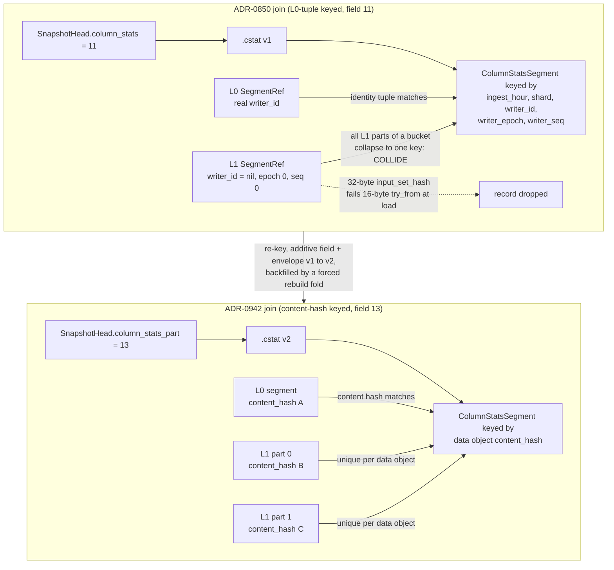

# ADR-0942: re-key `.cstat` column statistics to snapshot-part binding

Status: Accepted (2026-08-30). Builds on ADR-0850 (logs typed column
statistics, the `.cstat` object and its L0 five-field identity-tuple join),
ADR-0913 (declared exact materialisations, whose `.magg` state binds to the
snapshot part at `SnapshotHead` field 12), and ADR-0066 (format migration
machinery, decision 4's Class A-D convergence model). Issue #942.

## Context

ADR-0850 shipped exact per-object column statistics as `.cstat` objects
pointed at by `SnapshotHead.column_stats` (field 11), joined to the resolved
snapshot's segments by the five-field identity tuple
`fold::entry_identity` uses for a `SnapshotEntry`:
`(ingest_hour_bucket, shard, writer_id, writer_epoch, writer_seq)`. That
join is exact for L0 segments and the ADR deliberately covered L0 only,
recording L1 coverage as a known limitation (ADR-0850, "L1 segments are not
covered"). The reference corpus this feature is measured against
(`clickbench-v4`, ADR-0849 Context) is 3,469 objects **after L1
compaction**, so the L0-only cut answers almost nothing on the corpus it
targets: every compacted segment falls back to a scan.

ADR-0850 frames the gap as a fold-time deferral -- L1 entries "reuse the
`writer_id`/`writer_epoch` slots for compaction bookkeeping, so the
identity-tuple join needs a different key for L1." Verified against the
tree, the identities the fold produces are sound:

- `build_l1_snapshot_entry` (`crates/ravel-catalog/src/fold.rs:368`) and
  `build_rewrite_l1_snapshot_entry` (`fold.rs:415`) each build a
  `SnapshotEntry` with `writer_id = record.input_set_hash.clone()` (32
  bytes) and `writer_epoch = u64::from(part.part_index)` (`fold.rs:393`,
  `fold.rs:440`). Every L1 part of one `(shard, hour)` bucket has a distinct
  `part_index`, so these entry tuples are already unique per part.

Removing the `level == 0` filter at `fold.rs:1513` nonetheless yields no
coverage. Four things stand in the way, one in the builder and three in the
reader, and together they are why L1 coverage is a key-model problem rather
than a fold-filter problem. Each is verified against the tree:

First, in the builder, before any record exists:

- **`build_column_stats_segment` refuses an L1 entry.**
  (`crates/ravel-catalog/src/column_stats_build.rs:372`) carries
  `debug_assert_eq!(entry.level, 0)`, and at `:379` converts
  `entry.writer_id` into `[u8; 16]`, returning
  `ColumnStatsBuildError::BadWriterIdLen` for any other length (`:383`). An
  L1 entry's slot holds the 32-byte `input_set_hash`, so a fold that dropped
  the level filter fails this conversion and never constructs a
  `ColumnStatsSegment` at all. The `debug_assert` is not the guard, since it
  compiles out of release builds; the `BadWriterIdLen` error is, and it fires
  on every build profile. This blocker is the cheapest of the four to clear
  and it disappears under this ADR's decision, because part binding replaces
  the writer-id key the conversion exists to enforce.

The remaining three sit on the reader side, and are referred to below as
blockers 1, 2 and 3:

1. **The query-side join key is computed from the `SegmentRef`, not the
   `SnapshotEntry`.** `segment_identity`
   (`crates/ravel-sql/src/logs_scan.rs:571`) builds the `EntryIdentity` from
   `seg.ingest_hour_bucket`, `seg.shard`, `*seg.writer_id.as_bytes()`,
   `seg.writer_epoch`, `seg.writer_seq`. An L1 `SegmentRef` reconstructed at
   resolve time carries `writer_id: Uuid::nil()`, `writer_epoch: 0`,
   `writer_seq: 0` (`crates/ravel-catalog/src/catalog.rs:2987`); its real L1
   identity lives in `level: SegmentLevel::L1 { input_set_hash, part_index }`,
   which `segment_identity` never reads. So every L1 segment in one
   `(shard, hour)` bucket computes the identical join key
   `(hour, shard, nil, 0, 0)`.
2. **The resolve/decode side hard-requires a 16-byte writer id.**
   `crates/ravel-catalog/src/column_stats_resolve.rs:221` builds each
   loaded segment's key with
   `<[u8; 16]>::try_from(segment.writer_id.as_slice())` and `continue`s
   (drops the record) on failure. An L1 `ColumnStatsSegment` built as above
   holds the 32-byte `input_set_hash` in that slot, so it fails the
   conversion and never loads at all -- L1 stats would be silently discarded
   at decode even if the fold emitted them.
3. **Keying on the nil tuple collides across the parts of one bucket.**
   Following from (1): because every L1 part in a `(shard, hour)` bucket maps
   to `(hour, shard, nil, 0, 0)`, a per-part lookup cannot tell them apart.
   Loading more than one L1 part's stats under that key merges their
   statistics -- a wrong answer (an overcounted `COUNT`, a widened `min`/`max`
   drawn from a different part), not a coverage gap. This is the decisive
   reason the join key, not the fold filter, is the thing that must change:
   the existing key model has no room for L1 identity, and forcing L1 records
   through it silently corrupts results rather than falling back to scan.

The whole point of ADR-0850's safety lemma is that every defect degrades to
scanning and never to a wrong answer. Blocker 3 shows the five-field tuple
cannot honour that lemma for L1: the tuple's nil-collapsed L1 form does not
uniquely name a part, so it cannot be the coverage identity for L1 state.

## Decision

Re-key `.cstat` per-segment coverage to the covered data object's **content
hash**, and bind the whole `.cstat` object to the snapshot part set the way
ADR-0913 binds `.magg` state at `SnapshotHead` field 12. The fold already
records that content hash on every entry it produces:
`SnapshotEntry.content_hash` is the commit record's segment hash for an L0
entry (`fold::build_snapshot_entry`) and the compaction/rewrite part's own
object hash for an L1 entry
(`fold::build_l1_snapshot_entry`/`build_rewrite_l1_snapshot_entry`), and a
reader recovers the identical value from a resolved `SegmentRef.content_hash`.
The content hash names L0 and L1 entries uniformly, so it covers compacted
history the five-field tuple cannot name uniquely, and it is per data object,
so two L1 parts of one bucket never collide. Concretely:

- **Each `ColumnStatsSegment` record is keyed by the covered data object's
  content hash** -- `SnapshotEntry.content_hash`, equal to a resolved
  `SegmentRef.content_hash` -- and a reader joins a resolved segment to its
  statistics by that content hash. The whole `.cstat` object stays bound to
  the covered part set the way ADR-0913 §2a binds `.magg` (the
  `SnapshotColumnStatsPartRef.part_blake3` list validates the object against
  the current folded HEAD's parts), but the per-segment coverage identity is
  the data object's content hash, not the part hash. The five-field identity
  tuple stops being the join key; it may remain as informational content, but
  coverage identity is the content hash. This makes blocker 1's nil collapse
  and blocker 3's collision impossible: each data object is immutable and
  content-addressed, so the two L1 parts of one bucket have two distinct
  content hashes by construction, and blocker 2's 16-byte requirement no
  longer applies because the key is a 32-byte content hash, not a writer id.
- **The key rides in the existing `ColumnStatsSegment.writer_id` slot, not a
  new proto field.** The encoder and decoder validate and sort each record by
  `writer_id`, whose accepted length becomes version-dependent: a 16-byte
  identity-tuple component for a v1 record, the 32-byte data-object content
  hash for a v2 record. This deliberately overloads a slot whose proto doc
  comment (`ColumnStatsSegment` in `proto/ravel/catalog.proto`) still
  describes only the v1 five-field-tuple meaning. A3 depends on this carrier;
  documenting the overload in `proto/` is a follow-up, not part of this ADR.

### Correction: the join key is the data object content hash, not the part hash

An earlier accepted revision of this ADR named the join key as the covered
part's `SnapshotPartRef.blake3` and argued that "two L1 parts of one bucket
have two distinct `blake3` values by construction." That identifier was wrong,
and adopting it would have re-created the exact collision this ADR exists to
remove. A `SnapshotPartRef` is a `.csnap` snapshot part covering an hour range
and containing many segments, so the two L1 parts of one `(shard, hour)`
bucket live inside one snapshot part and share its single
`SnapshotPartRef.blake3`; keying on it merges their statistics, which is
blocker 3. The distinctness the argument relied on is a property of the data
object, not of the snapshot part that contains many of them. The correct key
is the data object's content hash (`SnapshotEntry.content_hash`, equal to a
resolved `SegmentRef.content_hash`), which is per-segment and content-
addressed, and which the implementation (issue #949) already uses. This
correction is recorded rather than silently rewritten because the ADR is
Accepted: a later reader must not "restore" the part reference believing it
was the intent.

### The wire change is additive only

- **New `SnapshotHead` field 13, `SnapshotColumnStatsPartRef`.** The existing
  `SnapshotColumnStatsRef column_stats = 11` is **neither renumbered nor
  redefined**; it keeps its ADR-0850 meaning (an L0-keyed `.cstat`). The new
  field points at a part-bound `.cstat`. Field 13 is the number to use, not
  12: `SnapshotHead` in `proto/ravel/catalog.proto` today ends at field 11
  (`column_stats`), and ADR-0913 (Accepted) has already claimed field 12 for
  `SnapshotMaterializationRef` even though that field is not yet written into
  the proto. Field 13 is the lowest number claimed by neither, so it is the
  free one. Absence of field 13 means no part-bound statistics have been
  built; a reader must treat that absence as fall-back-to-scan, never as an
  error -- the same reader rule fields 9 and 11 already carry.
- **The `.cstat` envelope gains a v2, and the write version is split from the
  accepted read set.** Today `COLUMN_STATS_VERSION`
  (`crates/ravel-catalog/src/snapshot_format/mod.rs:93`) is used for both
  jobs: the writer stamps it (`column_stats.rs:66`, `:80`) and the decoder
  equality-checks it twice (`:115`, `:144`). Bumping that single constant to 2
  would therefore make `decode_column_stats` **reject every v1 object**,
  including the field-11 objects this ADR's own reader rule still depends on
  for L0 coverage. That is not acceptable, so the constant splits in two:
  - a write version, stamped by the fold, which becomes 2;
  - an accepted read set, `{1, 2}`, which the decoder checks membership
    against instead of equality.

  The v1 baseline rejection that forces a full re-fold (see the backfill
  section) stays local to the v2-writing fold and must not be expressed by
  narrowing the decoder, or it takes L0 coverage down with it.

  The version byte still makes a `.cstat` object self-describe its keying, so
  an object read outside its head ref declares whether it is L0-tuple-keyed
  (v1) or content-hash-keyed (v2); the head field number and the envelope version
  agree by construction, and a disagreement is a validation failure that
  subtracts that object's coverage, matching ADR-0913 §4a's
  self-describing-state rule.

Changing the meaning of the persisted `ColumnStatsSegment` key is a change to
a frozen contract, so it takes an ADR and a version bump, never an in-place
edit (the repo invariant; ADR-0066 decision 4). This ADR is that ADR and the
bump is the one above.

## Migration class and convergence plan

`.cstat` is a **Class B derived catalog object** under ADR-0066 decision 4
(the class of `.csnap`/`.npost`/HEAD: rebuildable from commit records,
supersession-swept, no migration tool). ADR-0850 declared no migration class
at all; this ADR declares one, as ADR-0066's amended format-change skill now
requires of every format ADR.

The Class B convergence plan:

- **The fold dual-publishes during the rollout.** The upgraded fold emits the
  new content-hash keying (envelope v2) under field 13 **and keeps publishing
  the field-11 v1 object**, until every process reading the bucket
  understands field 13. Retiring field 11 at the first v2 publish would be a
  writers-before-readers change of exactly the kind ADR-0066 decision 1
  forbids: an older reader ignores field 13 by proto3 additive semantics,
  finds no field 11, and silently falls back to scanning every segment. That
  is not a crash or a wrong answer, which is precisely why it would go
  unnoticed -- it is an L0 coverage regression that reads as a slow query.
- **Field 11 is retired on the format floor, as its own change.** Once the
  recorded floor for every bucket says field 13 is understood (ADR-0066
  decision 3's mechanism), a separate reviewed change stops publishing field
  11; the old objects then become unreferenced and supersession GCs them
  under the existing `sweep_unreferenced_catalog_objects` lifecycle -- no new
  sweep rule. Deleting the old field is a decision that cites the floors,
  never a side effect of shipping the new one.
- Dual-read spans the same window. A reader that understands v2 prefers field
  13 and falls back to field 11's ADR-0850 L0-tuple join when field 13 is
  absent (L0 coverage, L1 falls back to scan, unchanged). An older reader
  that predates field 13 ignores it and reads field 11 exactly as today,
  which is only true because of the dual-publish rule above.
- **Reader rule for an old-keyed (v1, field-11) `.cstat`:** read it under the
  ADR-0850 L0 five-field join and gain L0 coverage only; treat the absence of
  a matching content-hash-keyed record for any segment as fall-back-to-scan, never as
  an error. A v1 object encountered under field 13, a v2 object under field
  11, a `blake3` mismatch, a version this reader does not understand, or a
  decode failure all subtract that object's coverage and scan -- the exact
  ADR-0850 safety-lemma shape, extended to the version/field axis. Absence is
  never an error anywhere on this path.

## The Class B convergence argument has a hole, and this ADR closes it

ADR-0066 Class B rests its "no migration tool needed" claim on one premise:
"the fold rewrites them continuously." That premise holds for `.csnap`/HEAD,
which every fold regenerates. It is **false for a re-keyed `.cstat` on a
quiescent tenant**, and the reason is structural, not incidental:

- Column statistics are rebuilt only inside `Catalog::fold` (`fold.rs:780`),
  incrementally: the build reuses the prior `.cstat` baseline for any entry
  whose identity already appears in it (`fold.rs:1515`,
  `baseline.get(&identity)` then `push(existing.clone()); continue`) and
  only decodes entries absent
  from the baseline.
- The incremental fold lists only hours strictly after the previous
  watermark plus a bounded reconcile window (`fold_reconcile_window_hours`,
  default 26 h; docs/catalog-and-mvcc.md, "Fold reconcile pass"). A
  fully-compacted idle tenant ingests nothing, so its incremental range is
  empty and its sealed hours sit outside the reconcile window. Sealed parts
  are carried forward by reference and never re-listed.
- **No in-tree command forces a stats rebuild, and none can be borrowed.**
  `ravel-cli maintain` (`services/ravel-cli/src/maintain.rs`) exposes
  compaction and audit operations but no stats rebuild. `ravel-cli commit
  reconstruct` (ADR-0058, `services/ravel-cli/src/reconstruct.rs`) is not a
  substitute either: it writes missing commit records and never calls
  `Catalog::fold` or touches `.cstat` at all (the only occurrence of "fold"
  in that file is the word in a doc comment about error handling). An earlier
  draft of this ADR cited it as an existing backfill lever. That was wrong.

So an idle, already-compacted tenant folds nothing, rebuilds nothing, and
gains no part-bound coverage from the re-key alone. The reference corpus is
exactly such a tenant, which is why the re-key by itself moves no measured
number: its `.cstat` (if any) stays L0-keyed under field 11 and every
compacted segment keeps falling back to scan until something forces a
rebuild.

**The backfill trigger this ADR names:** an operator-triggered
stats-rebuild pass that runs the fold's full-rebuild code path over the
tenant, with the `.cstat` baseline forced to `None` so every sealed part is
re-listed and re-folded once, emitting content-hash-keyed (v2, field 13) records for
all L0 and L1 entries. This is ADR-0066 decision 5's operator-triggered
migration job for the tail neither retention nor rewrite-on-touch reaches,
and it is the same "one maintenance pass that forces a rebuild fold over
unchanged parts" ADR-0913 §7 already names for `.magg` backfill. It is
one-shot, off the acknowledgement path, breaker-boundable, and its output is
supersession-GC'd like any fold output. The baseline is forced to `None` by
the envelope-version guard: a v1 baseline loaded by a v2-writing fold is
rejected as a graceful `None` (the ADR-0850 "any load failure is a graceful
None" rule), which is necessary but not sufficient on its own -- the pass
must additionally re-list the sealed hours, which the full-rebuild path does
and an incremental fold does not.

**That command does not exist yet, and nothing in the tree substitutes for
it.** This is a build obligation of the decision, not a follow-up that can
slip: the re-key is correct and completely inert without it on precisely the
corpus it is measured against.

Being exact about which tenants, because the two halves of Class B behave
differently and the distinction is the whole point of this section:

- A **live** tenant converges on its own. It keeps ingesting, so it keeps
  folding, and the upgraded fold emits content-hash-keyed v2 records for the parts it
  touches. Its recent history gains coverage with no operator action. Its
  sealed history does not, because sealed parts are carried forward by
  reference and never re-listed.
- A **quiescent, fully compacted** tenant gains nothing at all. It folds
  nothing, so it rebuilds nothing, and every segment keeps falling back to
  scan.

The reference corpus is the second kind, which is why a plan that lands the
re-key alone and reports progress would be reporting a change that moves no
byte *there*. On a live tenant it would move some, and only for the tail.
Neither case reaches sealed history without the backfill pass.

## Rejected alternatives

- **A level-aware key (widen `EntryIdentity`).** Keep the five-field tuple
  for L0 and add an enum key carrying `input_set_hash + part_index` for L1,
  widening `EntryIdentity` so `ravel-catalog` (`column_stats_resolve.rs`) and
  `ravel-sql` (`logs_scan.rs:571`) agree on a wider key. Its real advantage
  is genuine and must be stated: it preserves ADR-0850's join model
  unchanged for L0 and adds L1 as a parallel case, so no existing L0 `.cstat`
  object changes meaning and no envelope bump is strictly required for the L0
  path. It lost because the wider key is a second identity vocabulary that
  both crates must construct and match bit-for-bit, reintroducing an L0/L1
  identity split for `.cstat` when the resolved `SegmentRef` already carries
  one uniform per-segment identity for both levels: `content_hash`. Keying on
  that single value -- as this ADR does -- lets a reader join `.cstat` with a
  map keyed the way it already identifies every segment, where the level-aware
  key would force it to construct and match a two-case key. The content hash
  also subsumes the L0 case (an L0 data object has a content hash too), so the
  level-aware key carries the tuple purely to avoid re-keying L0, which the
  Class B convergence plan makes cheap to do anyway.
- **Defer L1 coverage again (ADR-0850's cut, unchanged).** Rejected: the
  measured corpus is post-L1, so deferral leaves the feature answering almost
  nothing where it is graded, and blocker 3 shows the current key cannot be
  extended to L1 safely in place.
- **Redefine or renumber field 11.** Rejected: it would break every
  in-flight reader that reads field 11 as an L0-keyed ref and violates the
  additive-only rule for a frozen proto contract (ADR-0066 Class C /
  decision 4). A new field number costs nothing and keeps both readable
  during the rolling-upgrade window.

## Consequences

- **What changes:** L1 (and rewrite-output) segments become coverable by
  exact column statistics, so a metadata-decomposable query
  (ADR-0850's q02/q07/q08 shapes) over a compacted tenant can answer from
  metadata instead of scanning every part. The join is by the data object's
  content hash, unique per object because it is content-addressed, so the
  collision failure mode of blocker 3 cannot occur.
- **What does not change:** the ADR-0850 fold-time statistics builder's
  arithmetic (counts, min/max, dictionary, integer sum), its cardinality
  ceiling, its `.cstat` envelope framing and magic (`RCST`), the
  `MetadataOnlyAggregate` rule, and the entire safety lemma. Every failure
  mode still degrades to scanning; this ADR adds no way to answer
  incorrectly. Field 11's meaning is untouched, and the dual-publish rule
  above keeps it populated, so an unupgraded reader is unaffected. Those two
  facts are one claim, not two: field 11 keeping its meaning is worth nothing
  to an old reader if the fold stops writing it.
- **The re-key alone moves no measured figure.** On a quiescent,
  already-compacted tenant -- which the reference corpus is -- no fold runs,
  so no part-bound `.cstat` is produced and coverage stays at the L0-keyed
  status quo (scan for every compacted segment). The measured improvement
  requires the backfill pass above to run first; any acceptance figure must
  be taken after backfill and stamped with that precondition (the repo's
  measurement-preconditions rule). Pre-registration of the expected
  post-backfill figures belongs on the tracking issue before the pass runs.
- **Storage:** one additional `SnapshotHead` field and, across the upgrade
  window, transiently both a v1 and a v2 `.cstat` per fold until the v1
  object ages out under supersession -- the same delayed-reclamation cost
  every catalog object already carries.

## Data flow: old key path and new key path

## Reported conflicts

ADR-0913 and ADR-0066 disagree about what part binding implies for
convergence, and this ADR sides with ADR-0913's reality:

- **ADR-0066 Class B** (decision 4) asserts derived catalog objects converge
  automatically because "the fold rewrites them continuously," needing "no
  migration tool."
- **ADR-0913 §2a** binds `.magg` state to the part precisely so that "sealed
  history's states survive every fold untouched" -- i.e., part-bound derived
  state is deliberately **not** rewritten once its part is sealed. ADR-0913
  §7 then concedes that a "quiescent, fully folded tenant needs one
  maintenance pass that forces a rebuild fold over unchanged parts" to gain
  coverage.

The two cannot both be the general rule for a part-bound derived object:
ADR-0066 Class B's continuous-rewrite convergence premise does not hold for
the sealed-history tail once binding moves from whole-set to per-part, which
is exactly the property that makes per-part binding economical. This ADR
inherits the same tension for the re-keyed `.cstat` and resolves it the
ADR-0913 way -- Class B for the live tail, an explicit named backfill pass
for the sealed tail -- rather than relying on ADR-0066 Class B's automatic
convergence, which is too strong for part-bound objects. Reported here, not
silently reconciled: ADR-0066 decision 4's Class B definition would be more
accurate if it carved out part-bound derived objects as converging via
retention/rewrite-on-touch plus a backfill pass, not via continuous fold
rewrite alone.

Refs: #942
