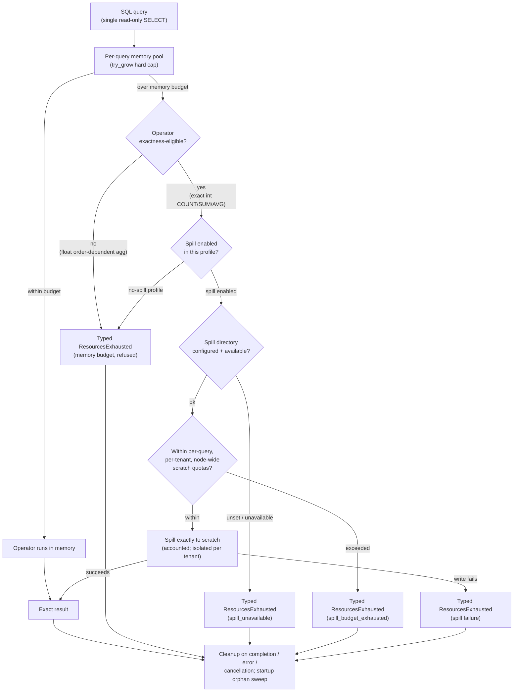

# ADR-0954: Bounded ephemeral spill for eligible SQL operators

Status: Accepted (2026-08-30)

Amends ADR-0013 (the "spilling stays disabled" clause) and ADR-0102
decision 3,
`docs/adrs/0102-intra-segment-scan-partitioning-and-spill-policy.md:270-302`
(the disabled disk manager). It does not touch either document in place;
both stand as written and are read together with this one.

Every reference below to "ADR-0102 decision 3" means that line range, the
normative Decision. ADR-0102's Context item 3 (same file, lines 51-63)
describes the *pre-decision* runtime in the present tense ("A
high-cardinality final aggregation ... most likely spills silently to local
disk today"); it records the problem ADR-0102 then fixed, not the state
after it. It is therefore not the text this ADR amends, and a bare
"ADR-0102" reference that lands a reader there reads as contradicting both
ADRs. Line ranges are given at each reference for that reason.

## Context

ADR-0013 established the SQL memory model: "budget exhaustion is an error,
never a partial result; spilling stays disabled." ADR-0102 decision 3
(lines 270-302) then made that literal in code, configuring
`RuntimeEnvBuilder::new().with_disk_manager_builder(DiskManagerBuilder::default().with_mode(DiskManagerMode::Disabled))`
so that an aggregation or `ORDER BY` over budget fails with a typed
`ResourcesExhausted` instead of silently spilling to DataFusion 54's
accidental default (`DiskManagerMode::OsTmpDirectory` with a 100 GB
ceiling), on a node whose disk is supposed to be disposable.

That posture is correct for what it defended against. It also refuses a
class of statement that a datastore advertising general analytical SQL is
expected to answer. Issue #837 measured the driver: ClickBench q33's
grouping is 1:1 with its rows -- 99,997,493 distinct groups from
99,997,497 rows -- so its hash aggregation needs O(D) aggregate state with
D approximately equal to N. Under a fixed per-query memory budget that
statement is refused. Refusing it is acceptable for an experimental
release; it is not a viable long-term property for a general analytical
SQL surface.

This ADR changes the rule for exceeding the memory budget: for explicitly
eligible operators it becomes a transition to a second, independently
bounded resource (ephemeral scratch), not a refusal and not a silent
degradation. Every other failure mode still produces a typed error.

The decision recorded here was made by the repository owner (issue #954).
This document records it, its reasoning, and the corrections to the
earlier #837 analysis that produced it.

## Decision

Every SQL query has independently enforced memory and scratch budgets.
Exceeding the memory budget may trigger exact spill for explicitly
eligible operators. Exceeding the scratch budget, unavailable scratch
capacity, or spill failure produces a typed `ResourcesExhausted` error.
Spill is per-query ephemeral execution state, is never committed, and is
never used for recovery. No partial result is returned.

This is the new invariant. It replaces "spilling stays disabled"
(ADR-0013) and "spill is a typed error, not silent degradation, achieved
by disabling the disk manager" (ADR-0102 decision 3, lines 270-302). It
preserves
ADR-0013's actual concern -- a partial result masking a budget problem --
because spill still produces the exact result or a typed error, never a
partial one.

### Why the old rule changed

1. **ADR-0102's rationale conflated transient execution state with durable
   state.** This is the load-bearing correction. ADR-0102 decision 3 (lines
   270-302) and its "Amend ADR-0013 to sanction bounded local-disk spill"
   rejected alternative (lines 345-355) both rest on the premise that a
   compute node retaining query
   state on local disk violates "compute is disposable, only object storage
   is durable." That premise does not hold: spill files are no more durable
   than the identical query state held in RAM. If the worker dies
   mid-query, the query fails either way; committed Ravel state remains
   exclusively in object storage either way. Disposable compute requires
   that no *durability* depend on local disk; it does not require zero local
   I/O. The invariant that survives is "no durability may depend on local
   disk," and ephemeral per-query scratch does not touch it.

2. **Spill does not produce a partial result.** ADR-0013's stated concern
   was "a partial result masking a budget problem." Spill does not create
   one: an eligible operator that spills produces the exact result or a
   typed error, nothing in between. What changes is only that exceeding the
   RAM budget becomes a transition to another explicitly bounded resource
   (the scratch budget), which itself fails typed when exhausted, rather
   than an immediate refusal. ADR-0013's concern is preserved, not weakened.

3. **The measured driver.** Issue #837 established that q33's grouping is
   1:1 with rows (99,997,493 groups from 99,997,497 rows), so the hash
   aggregation needs O(D) memory with D approximately N. Refusing such a
   statement is acceptable for an experimental release and is not a viable
   long-term property for a datastore advertising general analytical SQL.

### Two corrections to the earlier #837 analysis

Both are load-bearing and are recorded here as corrections to that
analysis, not as new claims.

- **"No exact bounded algorithm exists" is too absolute.** The defensible
  statement is: over unsorted input, an exact one-pass implementation
  without external state, repeated scans, or a proven uniqueness or order
  constraint requires O(D) aggregate state. That is a statement about
  one-pass in-memory execution, not about the problem. External sorting,
  hash partitioning with spill, repeated partitioned scans, and distributed
  aggregation are all exact alternatives that bound memory by using another
  resource. Bounded exact execution exists; it just cannot be one-pass and
  purely in-memory at once.

- **"Local spill is the only path at any scale" is wrong.** It is the most
  practical path for Ravel's current single-node executor. Distributed
  repartitioning across workers and object-store-backed scratch are exact
  alternatives too. Local spill was chosen over them for now on executor
  complexity, not correctness: distributed repartitioning needs a shuffle
  transport, worker membership, and failure handling the executor does not
  have today, and object-store scratch adds per-spill-batch round-trip
  latency and its own lifecycle management to the hot path. Local ephemeral
  spill reuses DataFusion's existing disk-manager machinery and adds the
  least new surface. See Rejected alternatives.

### Normative implementation requirements

All nine are normative. Each states the reason it exists; a change that
drops the reason drops the requirement.

1. **A hard per-query memory cap, held across spill by in-pool sort
   headroom.** Spill is triggered by the memory budget being reached, so that
   budget must be a real ceiling first. This is the existing
   `TenantDelegatingPool::try_grow` per-query limit; without it there is no
   defined point at which an eligible operator begins to spill. The cap
   stays hard *through* the spill, not only up to it: DataFusion's
   grouped-hash spill reserves the transient headroom it needs to sort each
   emitted batch out of the same pool, not out of an allowance above it. In
   the locked dependency
   (`datafusion-physical-plan-54.1.0/src/aggregates/row_hash.rs:1241-1269`)
   `spill()` emits all groups with `EmitTo::All`, calls `clear_shrink(0)` to
   free the group hash state before it reserves so the pool has room, then
   `self.reservation.try_grow`s the estimated sort memory and returns a typed
   `ResourcesExhausted` if even that will not fit. So spilling never routes
   around the cap: what the cap bounds is pool-accounted bytes, and the sort
   headroom is charged to the same bound. The peak the cap must accommodate
   is one emitted batch plus its sort reservation held together (the group
   state having been freed first), so the effective ceiling for steady-state
   group state is below the configured pool by that worst-case headroom; an
   operator sizing the pool must leave that room. The gap the cap does *not*
   close is between pool-accounted bytes and process RSS (allocator overhead,
   Arrow buffer rounding, the emitted-batch-plus-sort peak): that gap is not
   bounded by reasoning and is validated only by the peak-RSS measurement
   required in the implementation-constraint section below, consistent with
   that section's rule that the memory-bound claim is a measurement result,
   not a consequence of enabling spill. Open question for the implementation:
   whether to leave the sort headroom implicit (configure the pool below the
   volume/RSS ceiling) or to model it as a named reserve. This ADR fixes the
   validation, not that choice.

2. **Per-query, per-tenant, and node-wide spill quotas.** The scratch
   budget of the invariant is three independent ceilings, mirroring the
   memory model's per-query and per-tenant structure and adding a node-wide
   one. The per-query quota bounds one statement; the per-tenant quota
   bounds one tenant's concurrent statements so a single tenant cannot fill
   the volume; the node-wide quota bounds the shared multi-tenant process so
   the sum of tenants cannot exhaust the disk and stall every query. Any one
   exceeded produces the typed `ResourcesExhausted` of the invariant.

   The three quotas are enforced by *reservation*, not by observing free
   space: a check-then-write against observed headroom lets concurrent
   spilling queries each see room and collectively overrun a quota. The
   discipline this ADR requires:

   - **What and when.** Before a batch is written to scratch, the query
     reserves the bytes it is about to write against all three counters
     (per-query, per-tenant, node-wide) in one atomic step. The reservation,
     not the subsequent write, is the point a quota is enforced; a reservation
     that would push any counter over its ceiling fails, and the query
     produces `spill_budget_exhausted` (requirement 5) without writing.
   - **Atomicity.** The per-tenant and node-wide counters are shared across
     queries, so their check-and-increment must be a single atomic operation
     (an atomic compare-and-add, or a lock held across check and increment),
     never a read followed by a later add. Reserving against all three in one
     step, and rolling back the ones already taken if a later one fails,
     keeps the counters consistent under concurrency. This is the requirement;
     the exact primitive (per-node in-process counters versus a shared
     accountant) is an implementation open question, because the node-wide
     counter's authority depends on whether one process owns the scratch
     volume (see requirement 7's shared-directory case).
   - **Failure mid-spill.** A query whose spill fails partway (a reservation
     denied for a later batch, a write error, cancellation) releases its
     entire outstanding reservation as part of the same termination path that
     deletes its files (requirement 7). Reservation lifetime is tied to the
     spilled bytes on disk: bytes accounted but not yet deleted stay reserved;
     a counter is decremented only as the corresponding files are removed, so
     a crash between write and cleanup cannot make a counter under-count live
     usage.
   - **Reclaim after a crash.** A process that dies mid-spill leaves both
     orphaned files and, for any cross-process (node-wide) counter, a
     reservation it can no longer release. The node-wide counter is therefore
     reconstructed from the scratch volume's actual contents at startup, in
     the same sweep that removes orphans (requirement 7), rather than
     persisted and trusted across a restart; per-query and per-tenant counters
     live only for the process and are gone with it. Making the node-wide
     counter authoritative across processes that do not share memory is the
     open question flagged above; until it is settled the safe posture is one
     spilling process per scratch volume (requirement 7).

3. **An explicitly configured spill directory, never DataFusion's
   accidental default.** ADR-0102's Context item 3 (lines 51-63) documented
   that leaving the disk manager unconfigured silently selected
   `DiskManagerMode::OsTmpDirectory` with a 100 GB ceiling -- the exact
   behavior decision 3 (lines 270-302) then disabled. Enabling spill must not
   reintroduce that by omission: the spill directory is set explicitly to a
   path an operator chose for ephemeral storage, with its own capacity
   understood, never the OS temp directory and never the 100 GB default
   ceiling. An unset directory is a configuration error, not a fall-through
   to the OS default.

4. **Exactness-aware eligibility, not an operator-name allowlist.**
   Eligibility is decided by whether spilling an operator yields the
   bit-exact same result as running it in memory, not by the operator's
   name. q33's integer `COUNT`, integer `SUM`, and exact integer `AVG` are
   eligible: their fold is associative and commutative over exact types, so
   partitioning, spilling, and re-merging cannot change the result.
   Order-dependent float aggregation stays refused until spill preserves its
   deterministic folding contract (ADR-0022, ADR-0024's sequential fold),
   because DataFusion's grouped-hash spill re-orders the fold (see the
   implementation constraint below). The distinction must be exactness and
   not operator identity because this repo's bit-exact invariant (ADR-0013's
   `f64::to_bits` differential gate) makes a name-based allowlist unsafe:
   `AVG` is exact over integers and order-sensitive over floats, so the
   operator name alone does not determine whether spill is safe. An
   allowlist keyed on the name would admit the unsafe case with the safe
   one. This matches ADR-0094's exact-typed classification (count/sum/min/
   max over non-float always exact, avg/mean over float never, any float
   GROUP BY key disqualifies, fail-closed on classification error), reused
   as the eligibility gate rather than duplicated.

5. **Typed `spill_budget_exhausted`, `spill_unavailable`, and cleanup
   errors.** The invariant's three failure modes (scratch budget exceeded,
   scratch capacity unavailable, spill failure) must be distinguishable at
   the API, not collapsed into one opaque string, so an operator can tell a
   tenant that overran a quota from a node with no working scratch volume
   from a spill that failed mid-write. Each maps through
   `SqlError::ResourcesExhausted` with a distinct message, matching the
   established "budget exhaustion is a typed error" convention
   (`bytes_scanned_exceeded` in ravel-query).

   `spill_budget_exhausted`, `spill_unavailable`, and the cleanup-error
   identifier are stable, machine-readable codes, not display strings. An
   operator alerting on spill failure keys on the code, so:

   - The code is a distinct field on the error, carried alongside the
     human-readable message, not extracted by matching the message text. It
     surfaces wherever the typed error does: the query API response and the
     spill accounting of requirement 6, using the same shape as the existing
     `bytes_scanned_exceeded` identifier in ravel-query rather than a new one.
   - The identifier is a compatibility contract: the message wording may be
     reworded freely, but the code string is fixed once shipped and is not
     changed by a message rewrite. Adding a new spill failure mode adds a new
     code; it never renames or repurposes an existing one. An alert written
     against `spill_budget_exhausted` keeps firing on the same condition
     across releases.

   The exact string spellings and where the field is declared are an
   implementation detail; that they are stable, message-independent, and
   append-only is the requirement.

6. **Spill accounting in query diagnostics.** Bytes written and read,
   file count, the operator that spilled, spill duration, and peak disk
   usage are reported per query, under the phase that issued them, matching
   the repo's cost-is-a-first-class-output rule. Without this a spilling
   query's true footprint is invisible and the memory-bound claim below
   cannot be checked against measurement.

7. **Cleanup on completion, error, and cancellation, plus startup orphan
   cleanup.** Spill files are ephemeral; leaking them fills the scratch
   volume and turns requirement 2's quota into a slow crash. Every query
   termination path (success, typed error, client cancellation) removes its
   own files, and process startup sweeps files orphaned by a previous
   worker that died before it could clean up -- the crash case the
   disposable-compute model explicitly allows.

   Three points the cleanup rule must settle, because getting them wrong
   ranges from a slow leak to destroying a live process's data:

   - **Orphan lifetime.** An orphan lives at most until the next startup
     sweep; it is never left indefinitely. The steady-state expectation is
     zero orphans, because every in-process termination path deletes its own
     files; an orphan exists only for files a crash left behind, and the
     bound on their lifetime is the time to the next process start plus one
     sweep. This ADR does not add a background reaper on the assumption that
     crashes are rare and startup is frequent on disposable compute; whether a
     periodic in-process sweep is also needed (long-lived processes, rare
     restarts) is an open question for the implementation, not a mechanism
     fixed here.
   - **Cleanup failure.** A delete that itself fails (an I/O error unlinking a
     spill file) must not be swallowed and must not fail the query's result:
     the query has already produced the exact result or its typed error, and
     cleanup runs after. A failed cleanup is reported through the cleanup-error
     code of requirement 5 and surfaced in diagnostics (requirement 6), and
     the file it could not remove is left for the startup sweep to reclaim.
     Cleanup failure degrades to the orphan path; it never silently loses
     track of a file.
   - **A scratch directory shared by two processes.** Startup cleanup that
     deletes files it does not own would destroy a concurrently running
     process's live spill -- a data-destroying bug. This ADR requires that a
     spill file be attributable to the process that owns it and that the
     startup sweep delete only files no live process owns. The safe default
     is exclusive ownership of a scratch directory: each process spills under
     a subdirectory keyed to its own instance identity, and the sweep removes
     only subdirectories whose owning process is provably gone, never the
     shared root wholesale.

     **A pid-liveness check is not ownership proof and must not be used as
     one.** A PID is reusable, so a live PID can belong to an unrelated
     process while the original owner is gone, and a PID that looks dead can
     be recycled between the check and the delete. Both directions produce the
     data-destroying outcome this requirement exists to prevent. Ownership
     must rest on an OS-level advisory lock held for the owner's lifetime, or
     on a non-reusable process-instance token, checked atomically with the
     removal. A process that cannot establish
     exclusive ownership of its scratch path, or prove a candidate orphan's
     owner is dead, must not sweep -- it treats the volume as read-shared and
     leaves foreign files alone. The exact ownership mechanism (per-process
     subdirectory plus an advisory lock or instance token, or one spilling
     process per volume as requirement 2's reclaim note assumes) is an
     implementation open question;
     the invariant fixed here is that no sweep ever deletes a file a live
     process owns.

8. **Isolation and protection of spilled tenant data.** Spill holds a
   tenant's query state on a shared multi-tenant node's disk. One tenant's
   spill files must not be readable by another tenant's query and must not
   outlive the query that wrote them, preserving ADR-0013's single-tenant
   `SessionContext` isolation and ADR-0009 tenant isolation on the local
   disk that spill newly introduces to the SQL path.

9. **A no-spill deployment profile.** Environments without safe ephemeral
   storage (no writable scratch volume, or one whose contents could leak or
   persist) must be able to disable spill entirely, reverting to the
   memory-budget-refuses posture. This preserves ADR-0102 decision 3's
   (lines 270-302) disabled-disk-manager behavior as an explicit deployment
   choice rather than deleting
   it: an operator who cannot meet requirements 3, 7, and 8 selects this
   profile and keeps the pre-this-ADR guarantee that no query state ever
   reaches local disk.

### Implementation constraint: the memory-bound claim needs measurement

DataFusion 54.1.0's grouped hash spill path materializes all current groups
with `EmitTo::All` and sorts that batch before writing it
(`datafusion-physical-plan-54.1.0/src/aggregates/row_hash.rs:1241-1269`,
`spill()`). Enabling the disk manager therefore does not by itself prove a
strict memory bound: as requirement 1 records, that sort headroom is
reserved from the same pool via `self.reservation.try_grow` after the group
state is freed, so the *pool-accounted* peak stays under the cap -- but
pool-accounted bytes are not process RSS. Allocator overhead, Arrow buffer
rounding, and the emitted batch held together with its sort reservation at
the moment of emission can put peak RSS above the configured pool. Related
bounded-emission limitations are tracked upstream as DataFusion #24072.

The consequence for this ADR is a rule, not just a caveat: the claim that
an eligible operator now runs within a bounded memory footprint is
established only by measuring peak RSS against a declared overhead on the
real workload, never by reasoning from "spill is enabled." A statement that
enabling spill makes q33 fit in budget is not a result until the peak-RSS
measurement backs it, pre-registered with its expected band per the repo's
measurement discipline.

This is a normative requirement on the implementation, not only a caution:
the memory-bound claim must be validated by a q33-scale peak-RSS test run
against the locked dependency version (DataFusion 54.1.0), and requirement 1
holds only for the pool sizing that test shows keeps peak RSS within its
declared band. The test pins peak RSS, not merely that the query completes:
a q33 (or q33-scale) grouped aggregation is run under a configured pool with
spill enabled, its peak RSS measured, and the assertion is that the measured
peak stays within the pre-registered band above the pool. Because the sort
headroom that pushes the peak up is DataFusion-version-specific
(`EmitTo::All`-plus-sort behavior can change across releases; #24072 tracks
the upstream direction), the test is bound to the locked 54.1.0 and is
re-validated on any DataFusion bump before requirement 1's claim is
re-asserted. Until that measurement exists, the memory-bound property is a
requirement to be demonstrated, not an established result. The `EmitTo::All`-plus-sort behavior is also the
concrete reason order-dependent float aggregation is ineligible
(requirement 4): the sort re-orders the fold, breaking the deterministic
folding contract that float exactness depends on.

## Relationship to ADR-0013 and ADR-0102

**ADR-0013.** The Decision's clause "budget exhaustion is an error, never a
partial result; spilling stays disabled" is amended: the final three words,
"spilling stays disabled," are superseded. "Budget exhaustion is an error,
never a partial result" still stands and is strengthened -- it now also
covers the scratch budget. ADR-0013's hard-cap paragraph (scan, sort, and
aggregate reserve through the enforced `try_grow` path) stands unchanged;
the memory cap is the trigger point for spill, not something spill removes.
ADR-0013's "memory ceilings are best-effort for joins" amendment stands
untouched: joins reach the pool through the infallible `grow` path and are
not among the eligible operators here, so nothing about their best-effort
accounting changes.

**ADR-0102.** Decision 3 (lines 270-302, "Disable the disk manager
explicitly; spill is a typed error, not silent degradation") is superseded
in its mechanism: the
disk manager is no longer configured to `DiskManagerMode::Disabled` for
deployments that enable spill. Decision 3's *goal* -- that a budget
overrun is a typed error and never a silent local-disk write -- is kept.
What changes is that the typed error now fires at the scratch-budget
boundary rather than at the first byte of spill, and eligible operators
reach that boundary by spilling exactly rather than by refusing at the
memory boundary. ADR-0102's "Leave the disk manager unconfigured (status
quo)" rejected alternative (lines 356-361) still stands: this ADR does not
leave it unconfigured, it configures an explicit spill directory
(requirement 3). ADR-0102's "Amend ADR-0013 to sanction bounded local-disk
spill" rejected alternative (lines 345-355) is the decision this ADR
reverses, on the corrected premise in "Why the old rule changed" item 1.

ADR-0102's typed-error machinery is kept and extended, not deleted. The
issue-#740 amendment (lines 596-660) and its `MSG_SPILL_DISABLED_MARKER`
re-attribution in
`crates/ravel-sql/src/error.rs` (`resources_exhausted_reattributed`, which
rewrites a refused pool error from the query's own pool figures at the
`PinnedStream::poll_next` seam) remains the shape for producing an
attributed typed error; the new `spill_budget_exhausted`,
`spill_unavailable`, and cleanup errors of requirement 5 extend that
surface rather than replacing it. Decisions 1, 2, and 4 of ADR-0102
(intra-segment partitioning, lines 81-147; ADR-0094 in place, lines 148-269;
the group-by scaling benchmark, lines 304-326) are untouched; only decision
3's disable-the-disk-manager mechanism is superseded.

**ADR-0036.** ADR-0036 rejected io_uring "on structural grounds," resting
in part on the finding that Ravel's data plane has "no local file I/O to
accelerate: no WAL, no mmap, no temp-file spill, no local cache." Bounded
ephemeral spill makes the "no temp-file spill" half of that premise no
longer literally true for the SQL execution path. This ADR does not reopen
or re-decide io_uring: spill is bounded per-query ephemeral scratch on the
execution path, not a durable hot data-plane path, and the rest of
ADR-0036's rejection (that accelerating the socket path would mean
replacing the async runtime under hyper) is unaffected. The premise change
is recorded here so a future io_uring reconsideration starts from the
corrected fact rather than the stale one; whether it warrants reopening
that question is out of this ADR's scope. (Flagged in the report as a
premise ADR-0036 states that this decision changes.)

## Rejected alternatives

- **Raise the per-query memory budget instead of spilling.** Rejected: it
  is unbounded -- q33 needs O(D) with D approximately N, so there is no
  fixed budget that admits arbitrary high-cardinality statements, only a
  larger one that fails a larger query. It also makes the benchmark
  unreproducible below roughly 24 GB, tying the result to hosts with that
  much RAM. ADR-0088's operator-configurable budget remains the escape
  hatch for a specific query that genuinely needs more memory; it is not a
  general answer to unbounded cardinality.

- **Leave q33 refused (the pre-this-ADR status quo).** Rejected: acceptable
  for an experimental release, not viable long-term for a surface
  advertising general analytical SQL. This is the #837 driver stated as its
  own alternative and rejected on the same ground.

- **Distributed repartitioning across workers.** Rejected for now: exact,
  but far more complex for the current executor -- it needs a shuffle
  transport, worker membership, and cross-worker failure handling the
  single-node executor does not have. A correct alternative, deferred on
  complexity, not correctness.

- **Object-store-backed scratch.** Rejected for now: exact, and it keeps
  all I/O on object storage, but it adds per-spill-batch round-trip latency
  to the execution hot path and its own object lifecycle and cleanup
  surface. More complex than reusing the local disk manager for a bounded
  ephemeral working set, and deferred on complexity, not correctness.

## Consequences

- An eligible high-cardinality statement (q33's integer `COUNT`/`SUM`/exact
  integer `AVG`) that was refused with `ResourcesExhausted` now completes by
  spilling exactly, subject to the scratch budgets. An ineligible statement
  (order-dependent float aggregation) is still refused until spill preserves
  its folding contract.
- Exceeding the scratch budget, unavailable scratch, or a spill failure is a
  typed `ResourcesExhausted`, distinguishable by requirement 5's three
  variants. The failure surface grows; it does not become silent.
- Query diagnostics gain spill accounting (requirement 6), so a spilling
  query's disk footprint is visible and the memory-bound claim is checkable.

What does not change:

- Object storage remains the sole source of truth. Spill is per-query
  ephemeral execution state.
- No durability or recovery path reads spill. Spill is never committed and
  is never read back by any process other than the query that wrote it,
  within that query's lifetime.
- No partial result is ever returned. Every path yields the exact result or
  a typed error.
- Data objects, commit records, manifests, and index objects remain
  immutable; no persistent format changes. This ADR is runtime execution
  configuration and behavior only.

## Diagram

Budget and spill decision flow, with the typed error boundary at each
resource. Every "over budget" edge from a resource that has no exact
bounded continuation produces a typed `ResourcesExhausted`.

