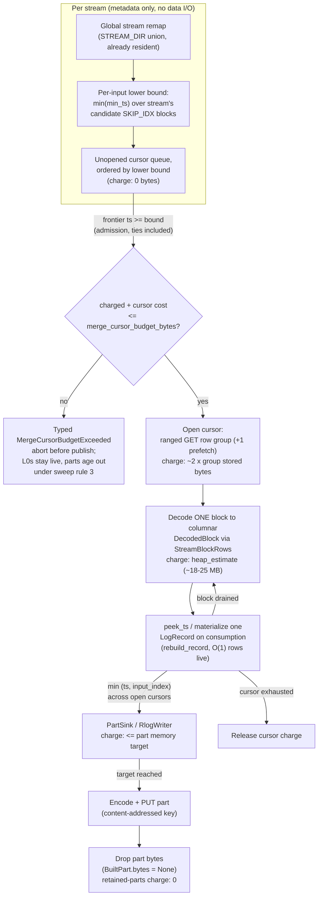

# ADR-0979: Bounded-memory RLOG compaction merge

Status: Proposed

Extends ADR-0032 (RLOG L0→L1 compaction) and the ADR-0065 decision-4 memory
model as amended by issues #711 (memory split target), #748 (row-group fetch,
block decode), and #872 (stored-size target). Confirms and relies on the
ADR-0954 clarification that the durability invariant forbids durability on
local state, not bounded transient state — although this ADR ends up needing
no local disk at all. No persistent format changes: RLOG trailer version,
proto schemas, and the object key layout are untouched.

## Context

Compacting the 7,233-object logs tenant `cb-20260831140539` (99,997,497
rows, 4 shards, one ingest hour) peaked past 29.2 GB twice — identical under
tcmalloc and glibc, so live demand, not allocator waste — and both runs were
killed by the memory watchdog on the 30 GB reference box (c6a.4xlarge).
29.2 GB is the watchdog ceiling, not the demand; the true peak is unbounded
above it. The project owner's standing instruction: compaction must complete
on the reference box for corpora of this class.

The mechanism is measured, not inferred:

1. **Per-stream cursor fan-out is unbounded.** `merge_catalogs` walks streams
   serially (`crates/ravel-maintain/src/rlog.rs:508-519`) and, per stream,
   `merge_stream_into_parts` opens one `StreamCursor` on *every* input object
   carrying that stream (`rlog.rs:1038-1065`). `input_read_concurrency`
   (default 8) bounds concurrent *open requests* only (`rlog.rs:1047`);
   nothing bounds how many cursors are simultaneously resident.
2. **Each cursor is ~80 MB on a wide schema.** A cursor holds one fully
   decoded block of up to 8,192 records as `Vec<LogRecord>` plus up to two
   locs' raw bytes (`StreamCursor::refill`, `rlog.rs:860-899`). A wide
   ClickBench record decodes to ~9.3 KB of heap (`estimate_record`,
   `rlog.rs:1262-1273`; cross-check: the 256 MiB part memory target ÷ 9.3 KB
   = 28.2k rows per part, and the published corpus measures 28.8k
   rows/part). One cursor at open is therefore ~76 MB decoded plus ~3-7 MB
   raw.
3. **Stream identity concentrates the corpus.** Stream identity for this
   corpus is `CounterID` (the sole `resource_attribute` in
   `benchmarks/clickbench/hits.mapping.toml`). Measured with DuckDB over
   `hits.parquet`: the top stream holds 8,527,070 of 99,997,497 rows across
   6,506 distinct streams, and the file is essentially sorted by `CounterID`
   (8 descents in 100M rows), so a stream occupies a contiguous run of L0
   objects. At 13,826 rows/object the top stream spans ~617 objects:
   ~617 cursors × ~80 MB ≈ 49 GB for that one stream. That is the OOM.
4. **`PartSink` retention scales with total bucket output, not with the
   merge.** `PartSink::parts` (`rlog.rs:586`, pushed at `rlog.rs:645`)
   retains every closed part's encoded bytes for the whole bucket so the
   publish repair path (`publish.rs:250-266`) can re-PUT a missing winner
   part. Measured 0.92 GB at kill time (305 parts, 2.87 MB mean) — but the
   kill happened during the *first* stream. At completion this term is the
   bucket's entire L1 output (~3,500 parts ≈ 10 GB for this corpus), and it
   grows linearly with tenant-hour size. It is not a 3% footnote; it is the
   next OOM after the cursor fan-out is fixed.
5. **No CLI flag reaches any memory knob.** `compact-tenant` threads only
   `dry_run` and `max_flush_lifetime_ns`
   (`services/ravel-cli/src/maintain.rs`).

Two facts about the existing code make a cheap fix possible, and both were
verified in source rather than assumed:

- **The decode path already has a compact columnar intermediate.**
  `RlogRangeReader::decode_block_in_group` decodes a block's pages into a
  `DecodedBlock` (`ravel-logseg/src/block.rs:853`): `Vec<Option<i64>>` per
  numeric column, `StrColumn::Dict {dict, ids}` or `StrColumn::Plain` per
  string column. The 76 MB row-form `Vec<LogRecord>` is produced *after*
  that, by an eager per-row loop (`push_stream_rows` →
  `rebuild_record(stream_dir, field_dir, decoded, row)`,
  `ranged.rs:460-479`). The row form is ~9.3 KB/record because every record
  re-owns ~105 attribute key `String`s and `(String, AttrValue)` slots that
  the columnar form stores once per column. Keeping the `DecodedBlock` and
  materializing rows on demand removes the dominant term without touching
  any codec, page, or format logic.
- **Cursor admission needs no I/O.** The per-input catalog metadata the
  merge already holds (`RlogInputCatalog.reader`) contains SKIP_IDX with
  per-block `min_ts`/`max_ts` (`skip_index.rs`, public fields). A sound
  lower bound for the first timestamp a cursor can ever yield is the minimum
  `min_ts` over the stream's candidate blocks in that input — computable
  from resident metadata before any BLOCKS byte is fetched. The commit
  records' per-object `min/max_event_ts_ns` give the same bound one level
  coarser.

Finally, the publish contract (docs/catalog-and-mvcc.md, `publish.rs`) is
the compatibility boundary any change here must respect: the compaction
record's `CreateIfAbsent` PUT is the single serialization point;
"correctness never depends on two compactors producing identical bytes"; a
loser with the same `input_set_hash` HEAD-verifies the winner's parts and
repairs missing ones from its own retained bytes; a different
`input_set_hash` in one sealed bucket is `InputSetHashDivergence`, alarm and
stop.

## Decision

Five decisions. D1-D3 change how the existing k-way merge holds memory; D4
makes overrun a typed error; D5 exposes the knobs. None changes merge order,
part split points, part bytes, or any persistent format.

### D1. Cursors hold the columnar block; records materialize per row

`StreamCursor` stops holding `Vec<LogRecord>`. It holds the block in a new
`ravel-logseg` type (working name `StreamBlockRows`) that owns the
`DecodedBlock` plus the stream's matching row positions, and exposes:

- `next() -> Option<LogRecord>` — materializes exactly one row via the
  existing `rebuild_record` path (same code, same bytes, same order as
  today's eager loop);
- `peek_ts() -> Option<i64>` — the next row's `ts_ns` read directly from the
  decoded ts column, so the merge's head comparison does not force
  materialization;
- `heap_estimate() -> u64` — the decoded columnar block's heap, the term the
  memory tracker charges in place of today's `Σ estimate_record`.

Per-cursor residency becomes: two locs' raw bytes (unchanged, ~3-7 MB) plus
one decoded columnar block (~18-25 MB measured target on ClickBench width;
ceiling `16 B × rows × total_cols + uncompressed string-page bytes +
40 B × rows × plain-string cols`) plus O(1) materialized records —
replacing ~76 MB of row-form records. Total per-cursor: ~80 MB → ~25 MB.

CPU is unchanged in total: every row is still rebuilt exactly once; only
*when* it is rebuilt moves (on merge consumption instead of on block decode).
No page is decoded twice.

### D2. Overlap-gated cursor admission

`merge_stream_into_parts` stops opening every input's cursor up front. For
each input carrying the stream it first computes, from resident SKIP_IDX
metadata, `lower_bound(input, stream) = min(min_ts over the stream's
candidate blocks)`. Unopened cursors sit in a queue ordered by that bound.
The merge loop maintains the invariant:

> Before emitting a candidate record with key `(ts, input_index)`, every
> unopened cursor whose `lower_bound ≤ ts` is opened (fetched and decoded,
> `input_read_concurrency` at a time, in canonical input order).

Because the bound never exceeds the cursor's true first timestamp, no record
that could precede the candidate in `(ts_ns, input_index)` order can be
sitting in an unopened cursor, including exact-`ts` ties (equality forces
admission, and the tie then resolves by `input_index` exactly as today). The
emitted record sequence — and therefore every part boundary and every part
byte — is identical to today's. An exhausted cursor releases its residency
as it already does.

The number of simultaneously open cursors becomes `D`, the maximum
concurrent ts-overlap among the stream's input slices, instead of `n`, the
number of inputs carrying the stream. For append-mostly data `D` is small
(bounded by flush-interval jitter). For ClickBench, if `EventTime` is
date-ordered within a `CounterID` run, `D ≈ 90` (one day's objects); if it
is unordered within the run, `D = n = 617` — the fix still fits (see the
formula), it just doesn't get the extra order of magnitude. Worst case
equals today's behavior, minus D1's per-cursor savings.

### D3. `PartSink` releases part bytes at PUT

`BuiltPart.bytes` becomes `Option<Bytes>`. `PartSink` takes an explicit
`retain_bytes: bool`:

- **Compaction** (`RlogCodec::build_parts`, dry-run included): `false`. A
  part's bytes are dropped the moment its PUT succeeds (or immediately under
  `dry_run`, where nothing will ever PUT them). Retained-parts memory goes
  from Σ(bucket output bytes) to zero.
- **Erasure rewrite** (`erasure_rewrite::build_rewrite_logs`): `true`,
  unchanged — it defers every PUT to its own post-conservation-gate publish
  path, so the bytes are the product itself, and its input sets are
  pending-request-scoped rather than whole-hour-scoped.

The publish repair path (`resolve_already_exists`) re-PUTs a missing winner
part only when `bytes` is `Some`; otherwise it takes the existing
"cannot repair" warn arm. This is a deliberate, analyzed narrowing: on the
compaction path every built part was already successfully PUT before the
record PUT is attempted (a failed part PUT aborts the run), and part keys
are content-addressed, so the only way a same-hash winner's part can HEAD as
`NotFound` is out-of-band deletion in the seconds between our PUT and the
HEAD — a window in which the in-RAM copy was belt-and-braces, not a
correctness dependency. The convergence outcome (`Converged`) and the
divergence alarm (`InputSetHashDivergence`) are untouched.

One PUT outcome is excluded from the drop, and it closes a real race: a
part PUT that returns **`AlreadyExists`** (the same content-addressed key
was PUT by an abandoned run) does not refresh the stored object's
`last_modified`, so the object's age is the abandoned run's, not ours. An
old-enough such part is inside the unreferenced-part sweep's age gate, and
a tenant tombstone landing between our existence check and our record PUT
lets the sweep delete it while we still intend to reference it — at which
point a compactor that dropped its bytes cannot repair before publishing.
So D3 drops bytes at PUT **only for a fresh PUT** (age zero, unreachable
by the sweep inside the grace floor for the run's whole duration). A part
whose PUT reported `AlreadyExists` is instead re-verified with a HEAD
**after the compaction record PUT succeeds**, and this arm must itself
stay bounded: a retry after an abandoned run that uploaded every part
gets `AlreadyExists` for all of them, and retaining all their bytes would
recreate the full-output term this decision exists to kill, in exactly
the recovery scenario. So no bytes are retained for the exception either.
If the post-publish HEAD finds an `AlreadyExists` part missing, the run
fails loud with a typed error whose remedy is a re-run — and the re-run
converges without needing any retained bytes at all: it rebuilds
byte-identical parts, and its PUT of the deleted key is a FRESH put (the
key is absent, so `AlreadyExists` cannot recur for it) that restores the
part and resets its age BEFORE the record resolution runs. Every part the
winner record references is then either still present or just re-PUT, so
`resolve_already_exists` finds nothing to repair; the repair-from-bytes
arm is never the rerun's convergence mechanism, and its no-bytes warn arm
is unreachable on this path. The steady-state
memory bound is therefore unchanged in every path, the tombstone race is
closed by verification rather than retention, and the two owed tests are
the `FaultStore` tombstone interleaving and the all-parts-`AlreadyExists`
retry, both asserting no retained-bytes growth.

### D4. A fail-closed cursor budget: `merge_cursor_budget_bytes`

New `CompactorConfig` knob, default **20 GiB**. Admission is charged as a
**pre-decode reservation**, not an after-the-fact measurement: before a
cursor fetches or decodes anything, the merge reserves its ceiling cost,
and the ceiling covers everything the cursor retains for its lifetime:
`2·G` from the section descriptors' raw lengths; the cursor's location
metadata (the owned `Vec<StreamBlockLoc>` and each loc's block list,
sized from the same resident directory that produced it); and `B_dec`
taken as the MAXIMUM over the cursor's candidate blocks of the D1
ceiling evaluated per block from pre-decode metadata:
`16 B × rows × total_cols + string-page uncomp_len + 40 B × rows ×
string_cols + 2 × Σ(slot sizes) × (max column id + 1)` (the last term
is the decoder's five slot-vector spines at doubled-capacity bound,
Σ(slot sizes) read from the per-kind `Option<T>` sizes -- 144 B per
width unit today; see the D1 ceiling's spine note) — rows from the resident loc metadata,
`total_cols` from FIELD_DIR, the string-page term as the block's PAGE_DIR `uncomp_len`
restricted to string pages, and every string column priced as plain
(the conservative arm; dictionary encoding only shrinks it). The max,
not the first block's cost, because `refill` decodes later blocks after
releasing earlier ones and a later, larger block must not exceed the
reconciled reservation (the owed test is first-small/next-large).
A per-block sum of raw `uncomp_len` alone is NOT a valid basis and this
amendment removes it: `encode_i64` picks the smallest codec, so a
constant or run-length column (every one-stream block's `stream_ref`,
usually `severity` and `flags` too) stores a few bytes and decodes to
`16 B × rows` — a ratio that can exceed 10,000×, which is exactly the
under-charge D4 exists to refuse. The numeric decoded term scales with
a shape formula (rows × columns), and only the string term scales with
page contents; the basis above prices each term from the source that
actually bounds it, and PAGE_DIR plus loc metadata are resident before
any BLOCKS byte is fetched. An input WITHOUT a PAGE_DIR cannot be
admission-priced (its string-page term is unknowable before the fetch),
so the bounded merge refuses it with a typed error naming the object and
its format version rather than guessing — in practice the fleet is
RLOG v4 everywhere (PAGE_DIR is mandatory in v4), so the refusal arm is
a version gate, not a live path. The reservation is reconciled down to the
cursor's actual residency (raw bytes as fetched, `heap_estimate()` once
decoded — the same numbers the #977 tracker sees) after the decode
completes. The reconcile is MANDATORY, not an optimization: the default
budget's sizing (the config doc's per-cursor residency figure) is
derived from actual residency, so an implementation that holds the
pre-decode ceiling for the cursor's lifetime over-charges against that
sizing and aborts runs the default was chosen to admit. The reconcile
target is the cursor's COMPLETE resident footprint, all three D4 terms
at their actuals: loc metadata + raw group bytes still retained (the
cursor keeps raw bytes while decoding non-final blocks) +
`heap_estimate()` for the decoded block. `reservation ==
heap_estimate()` alone is wrong while raw bytes remain resident. On
`refill`, before decoding block k+1 the charge GROWS atomically (under
the same admission lock as the initial reserve) to at least
`metadata + retained raw + ceiling(block k+1)` — a later, larger block
must clear the budget before its decode starts, never after — then
reconciles down to actuals once the decode completes. The paired
invariant is pinned by a test in both directions and across the
first-small/next-large sequence: at every point in a cursor's life the
charge is ≥ its actual resident footprint (the ceiling really is a
ceiling), and after each reconcile the charge equals that footprint
exactly. Reservations are taken under the same admission lock that
orders cursor opens, so concurrent admissions cannot each pass the check
and then jointly allocate past the budget: the budget is enforced at
reserve time, which is what makes D4 fail-closed rather than
fail-after-allocating. If reserving a cursor that merge order *requires*
would exceed the budget, the run aborts with a typed error, before
publish:

```rust
MaintainError::MergeCursorBudgetExceeded {
    stream_id, open_cursors, charged_bytes, budget_bytes,
    required_bytes,         // prospective total had this cursor been admitted:
                            // charged + this cursor's reservation, so a first
                            // admission over budget still names the number a
                            // retry must budget for
    inputs_carrying_stream, // so the operator can size the fix
}
```

Nothing is published; the L0 inputs stay live and queryable; any parts
already PUT age out under the existing unreferenced-part sweep exactly like
an abandoned run's (docs/consistency-model.md sweep rule 3). This converts
"watchdog kills the process at an arbitrary point" into "typed refusal
naming the stream and the number to raise", which is the repo's posture
everywhere else (exact semantics, fail closed). The default is sized so the
reference box completes the ClickBench worst case: 617 × ~25 MB ≈ 15.4 GiB
< 20 GiB, leaving ~10 GB of the 30 GB box for the writer buffer, catalogs,
and process overhead.

### D5. CLI exposure

`maintain compact-tenant` and `compact-bucket` gain
`--l1-part-memory-target-bytes`, `--max-l1-part-bytes`,
`--input-read-concurrency`, and `--merge-cursor-budget-bytes`, threaded into
`CompactorConfig` exactly as `--max-flush-lifetime` already is. Necessary
regardless of D1-D4 (today an operator cannot even trade part size against
memory), not sufficient alone (no setting of the existing knobs bounds the
cursor fan-out term).

### The memory bound, as an operator evaluates it

```text
peak ≈ C_cat + min(D × (2·G + B_dec), merge_cursor_budget_bytes) + W + P

C_cat  = per-input catalog metadata ≈ 30 KB × input_objects        (~220 MB here)
D      = max concurrent ts-overlap of one stream's input slices     (≤ objects carrying
                                                                     the stream; 617 here
                                                                     worst case, ~90 if
                                                                     intra-stream time-sorted)
G      = one row group's stored bytes ≈ per-object stored size      (~3.5 MB here)
B_dec  = one decoded columnar block                                  (~18-25 MB at 105 cols;
         ≤ 16 B × rows_per_block × cols                              ceiling ~14 MB numeric
           + uncompressed string-page bytes                          + string pages
           + 40 B × rows_per_block × plain_string_cols
           + 2 × Σ(slot sizes) × (max column id + 1))               + decoder slot spines
         The last term is the decoder's five per-kind slot-vector
         spines, indexed by column id; on very small blocks it can
         exceed the per-row terms, so a ceiling that omits it is not
         a ceiling there. Each spine is charged at ALLOCATED capacity
         times its own per-kind slot size (`size_of::<Option<T>>`,
         currently 24/24/24/48/24 B on the reference target,
         Σ = 144 B per width unit -- read the sizes from the types,
         never hardcode a flattened per-map constant). Vec growth can
         round capacity past the logical width, so the pre-decode
         bound applies the doubling rule: 2 × Σ(slot sizes) × width
         = 288 B × width today. A decoder that enforces exact-width
         allocation in `ColMap::insert` may tighten the factor to
         Σ(slot sizes), with a growth-boundary test over all five
         maps pinning that no spine exceeds its requested capacity.
         `max column id + 1` comes from FIELD_DIR, pre-decode, like
         the other shape inputs.
W      = in-progress part writer buffer ≤ ~1.3 × l1_part_memory_target_bytes  (~340 MB default)
P      = exact-encode probe transient (issue #872)                   (0 at the shipped
         Zero unless the stored-size target `max_l1_part_bytes`        defaults; ≈ W + object
         binds: the RLOG merge measures a part by encoding a CLONE     bytes when the stored
         of its buffered records, so while a probe runs the run        target binds)
         holds a second copy of the part's record heap (≈ W) plus
         the encoded object those records produce (≤ the stored
         target plus the overshoot band). A stored-target-bound run
         therefore peaks near 2·W + one part's object bytes, not W.
         Charged to the tracker (`MergeMemoryTracker::set_probe_bytes`),
         so `peak_total_bytes` reports it rather than omitting it.
```

For `cb-20260831140539`: `0.22 + min(617 × 25 MB, 20 GiB) + 0.34 ≈ 16 GB`
worst case, `≈ 2.8 GB` if intra-stream time order holds (`P` = 0 at the
shipped defaults, where the memory target binds and no probe runs; an operator
who lowers `max_l1_part_bytes` below it must size for `2 × 0.34` plus one
part's object bytes instead). Today's code:
`0.22 + 617 × 80 MB + 0.34 + retained parts ≈ 50+ GB`.

## Compatibility and convergence

**Output parts are byte-for-byte identical.** D1 materializes the same
records through the same `rebuild_record` path in the same order; D2 changes
only *when* cursors open, never which record is the `(ts_ns, input_index)`
minimum; D3 and D4 touch retention and abort behavior, not content. Part
split points depend only on the record sequence and the unchanged
`estimate_record`/`estimate_stored_record` sums, so `part_index`,
`content_hash`, every part key, and the compaction record are identical to
today's for any input set. A differential fixture (old path vs new path on
the same `MemoryStore` bucket, asserting equal `content_hash` vectors) gates
this claim in CI; the existing lazy-vs-eager decode proptests in
ravel-logseg extend to the new row-materializing type.

**Old and new compactors racing on one bucket.** A sealed bucket's input
set is frozen, so both compute the same `input_set_hash` and the same record
key. `CreateIfAbsent` picks one winner:

- *New wins, old loses:* old HEADs the winner's parts. Byte-identity means
  the keys match what old built and already PUT — every HEAD succeeds,
  `Converged { parts_repaired: 0 }`.
- *Old wins, new loses:* symmetric, same outcome.
- *Repair arm:* if a referenced part is genuinely missing from the store, a
  new-compactor loser that still holds bytes for that key re-PUTs it; a
  compaction-path loser that already released bytes (D3) logs the existing
  "cannot repair" warning. Correctness is unaffected either way — the record
  is the truth and the resolver reconstructs part keys from it; a missing
  part surfaces as `SnapshotInvalidated` → re-resolve, and re-running the
  compactor rebuilds and re-PUTs the identical object.
- *Fail-closed arm unchanged:* two records with different `input_set_hash`
  in one bucket remain `InputSetHashDivergence` (alarm and stop), and the
  resolver's include-both-and-alarm behavior is untouched.
- *Abandoned runs:* determinism across versions is preserved, so an old
  run's abandoned parts are still re-referenced verbatim by a new run's
  record (the property `PublishOutcome::Abandoned` documents), and vice
  versa. No new orphan class is created.

Divergent part sets for the same inputs cannot be published by construction
— there is exactly one record per `(bucket, input_set_hash)` and parts are
only reachable through it.

## Rejected alternatives

- **A. Bounded hierarchical sub-merge (k inputs at a time into intermediate
  runs).** Rejected for now, kept as the documented escalation. It is the
  only design with a memory bound independent of overlap degree, but: (i) it
  buys nothing this corpus needs — D1+D2 already fit the reference box at
  the measured scale, and D4 converts the residual tail into a typed error;
  (ii) intermediate runs must live somewhere: ephemeral local disk imports
  ADR-0954's quota/ownership/cleanup machinery into ravel-maintain for a
  path that no measured corpus requires, and S3 temp objects add a write+
  read of the whole bucket per extra pass (~21 GB each way here, plus ~7k
  PUTs/GETs per pass at `log_k(617) ≥ 2` passes) *and* a new key namespace —
  and the object key layout is a frozen contract requiring its own ADR;
  (iii) preserving byte-identical `(ts_ns, input_index)` order across
  sub-merges requires threading original input provenance through
  intermediate runs, the most invasive possible change to the 4k-line
  `rlog.rs` everything else serializes on. Revisit trigger: any real corpus
  hitting `MergeCursorBudgetExceeded` at a budget the reference box can
  hold.
- **E. Columnar gather-merge (never materialize `LogRecord` at all).**
  Rejected. Blocks are columnar; a record has no contiguous byte form to
  copy, so "merge raw rows" means a per-column gather across ~105 pages ×
  N inputs and a bespoke encode path. That forks the single writer
  implementation ADR-0032 deliberately shares between L0 and L1 (FIELD_DIR
  rebuild under the 1000-column cap, `attrs_raw` overflow, bloom sizing,
  POSTINGS rebuild — ADR-0049 decision 6), for a term D1 already reduces to
  O(1) records per cursor. The remaining row-form cost sits in the writer
  buffer, which is already bounded by `l1_part_memory_target_bytes`.
- **C-only (admission without D1).** Rejected as primary: its win is
  data-dependent. If `EventTime` is unordered within a `CounterID` run,
  `D = 617` and 617 × 80 MB ≈ 49 GB still OOMs. Admission is worth its ~100
  lines only stacked on D1's smaller per-cursor term.
- **Spill retained parts to ephemeral disk instead of D3.** Rejected:
  ADR-0954's invariant reasoning would permit it, but the only consumer of
  the retained bytes is a repair arm that cannot fire on the compaction path
  in practice (parts are PUT-at-close and content-addressed), so the
  machinery (scratch lifecycle, ownership, cleanup) buys a warn-message
  upgrade. Dropping is simpler and exact.
- **Rent a bigger box (the honest alternative).** See Cost accounting — it
  wins for a one-off demo and loses as a product property.

## Cost accounting

By phase, versus today, for a full compaction of this bucket:

| Phase | S3 requests | Bytes moved | Delta |
|---|---|---|---|
| resolve/plan (footer probe + 3-4 section GETs + optional POSTINGS GET per input) | ~29-36k GETs | ~1-2 GB | **0** (admission bounds come from already-fetched SKIP_IDX) |
| scan (one ranged GET per row-group loc per stream slice, +1 prefetch) | ~7.5k GETs | ~21 GB wire | **0** (same locs, same ranges; D2 defers, never adds) |
| build/PUT (one PUT per part) | ~3.5k PUTs | ~10 GB | **0** |
| publish (1 record PUT; repair HEADs only on convergence) | O(1) | O(KB) | **0** |

The whole design adds **zero** S3 requests and zero wire bytes; it is a pure
resident-memory change. (Bytes above are wire bytes as transferred, retries
excluded, per the phase-split convention; the #977 seam is what will report
them per phase.)

**Break-even against renting.** An r6a.2xlarge (64 GB) costs ~$0.45/h
on-demand — for a one-off run against this corpus, renting is trivially
cheaper than this work. It loses as a policy: the unfixed peak scales as
`objects_per_stream × record_width`, so each next-bigger tenant-hour needs a
next-bigger box chosen *per worst tenant, fleet-wide, in advance*; the true
peak on this corpus is already ~49 GB estimated (past 64 GB boxes for a 2×
hour), and an undersized box doesn't degrade — the watchdog kills the run,
the bucket stays permanently uncompacted, and every query on that
tenant-hour pays 7,233-object L0 read amplification forever. The standing
instruction makes 30 GB the reference envelope; this design meets it with
zero added I/O and gives the operator a formula instead of a guess.

## Consequences

- Compaction of `cb-20260831140539` completes on the 30 GB reference box;
  worst-case demand ~16 GB, typical ~3 GB if intra-stream time order holds.
- A corpus whose overlap × width genuinely exceeds the budget fails closed
  with `MergeCursorBudgetExceeded` naming the stream and the required
  number, instead of an OOM kill mid-run. L0s stay queryable; already-PUT
  parts age out under the existing sweep.
- The merge's tracker charges change meaning: the decoded term becomes
  columnar-block bytes (`heap_estimate()`), not `Σ estimate_record`. The
  #977 per-phase attribution must land first and this work rebases its
  cursor-phase accounting on the new charge (see Execution plan).
- `BuiltPart.bytes` is `Option<Bytes>`; the RSEG and RSPAN codecs wrap their
  constructors in `Some` mechanically and keep their current retention
  behavior — their equivalent fixes are follow-ups, not this ADR.
- The repair arm of publish convergence narrows on the compaction path as
  described in D3 (warn instead of re-PUT, in a window that requires
  out-of-band deletion to reach).
- CPU: total decode/rebuild work is unchanged; the O(open-cursors) min-scan
  per record shrinks with admission (`D` instead of `n` comparisons per
  record). No regression expected; the e2e run bounds it.
- What does not change: object storage as sole truth; immutability of data
  objects, records, manifests; RLOG format and trailer version; merge order;
  part bytes; `input_set_hash` and key layout; exact conservation gates;
  no `unsafe`, no unwrap/expect on production paths.

## Verification plan (pre-registered)

Figures come from the #977 `merge_memory_tracker` phase split plus two new
counters this work adds (`max_open_cursors_per_stream`, per-cursor
`decoded_block_bytes` high-water). Bands to be posted on the epic issue
before the measurement run; a figure absent, duplicated, or outside its band
fails the run.

1. **Pre-measurement (before freezing the budget default):** DuckDB over
   `hits.parquet` — max concurrent `[min(EventTime), max(EventTime)]`
   overlap across 13,826-row slices of the top `CounterID` run. This pins
   the predicted `D` for band 3 and decides whether the ~90 or the 617
   regime applies.
2. **Unit/differential (CI):** old-vs-new part `content_hash` equality on a
   multi-input `MemoryStore` fixture with straddling streams and equal-ts
   ties across inputs; lazy-vs-eager record equality proptests in
   ravel-logseg (extending the existing `decode_block_in_group ==
   decode_stream` property); admission-on vs admission-off hash equality.
3. **Acceptance (CI, tracker-asserted):** on a synthetic wide-schema bucket,
   `peak_transient ≤ D_fixture × (2·G + B_dec) × 1.25`, and with one input's
   slice made time-disjoint, `max_open_cursors_per_stream` drops accordingly
   — the assertion that admission, not luck, bounds the count.
4. **The cheap end-to-end proof:** `maintain compact-tenant` against the
   existing failing tenant `cb-20260831140539` on a 30 GB box.
   Pass = process completes with `PublishOutcome::Published`; the existing
   conservation gate holds (`input_record_count == output_record_count ==
   part sample_count sum == 99,997,497`, exactly once in the report); peak
   RSS `< 24 GiB` (hard), expected band `[2, 18] GiB` (wide because it
   spans the two `D` regimes; tightened after figure 1);
   `max_open_cursors_per_stream ≤ 620` (hard) with expected value from
   figure 1 ± 30%; retained-parts term reported as 0. State preconditions
   stamped per the measurement discipline: fresh tenant, no existing
   compaction record, binary SHA, box type.
5. **Post-fix decoration check:** `B_dec` mean/max from the run feed back
   into this ADR's formula constants; a `B_dec` max above 35 MB reopens the
   budget default before the epic closes.

## Execution plan (fleet-sized tasks and the collision map)

Everything that touches `crates/ravel-maintain/src/rlog.rs` serializes —
against each other and against the in-flight #977 instrumentation task.
Order below is the dependency order; T1 is the only task that can run
concurrently with the #977/rlog.rs chain.

| Task | Crate / files | Contents | Serializes with |
|---|---|---|---|
| T1 | `ravel-logseg` (`ranged.rs`, `block.rs`, `reader.rs`) | `StreamBlockRows` (columnar-held, per-row `rebuild_record` materialization, `peek_ts`, `heap_estimate`), `stream_ts_bounds(stream_id)` from SKIP_IDX; lazy-vs-eager proptests | nothing (own crate) |
| T2 | `ravel-maintain` (`build.rs`, `rlog.rs` PartSink::flush, `publish.rs`, `rspan_codec.rs`, `erasure_rewrite.rs` mechanical) | D3: `BuiltPart.bytes: Option<Bytes>`, `retain_bytes` on `PartSink`, repair-arm handling | **#977** (rlog.rs, publish-adjacent) |
| T3 | `ravel-maintain` (`rlog.rs` StreamCursor, `config.rs` tracker charge) | D1: cursor holds `StreamBlockRows`; tracker charges `heap_estimate()`; differential part-hash fixture | **#977, T2** (rlog.rs), **T1** (API) |
| T4 | `ravel-maintain` (`rlog.rs` merge_stream_into_parts, `error.rs`, `config.rs`) | D2 + D4: admission queue by `stream_ts_bounds`, budget accounting, `MergeCursorBudgetExceeded`, `max_open_cursors_per_stream` counter; admission-on/off hash test | **#977, T2, T3** (rlog.rs) |
| T5 | `services/ravel-cli` (`maintain.rs`) | D5: four flags into `CompactorConfig` | T4 (knob name only) |
| T6 | no code — measurement run + epic report | Steps 1, 4, 5 of the verification plan, bands pre-posted on the epic | T1-T5 merged |

rlog.rs chain: **#977 → T2 → T3 → T4**, one dispatch in flight at a time.
T3 explicitly rebases the cursor-phase accounting #977 introduces (its
decoded term changes from `Σ estimate_record` to `heap_estimate()`); the T3
spec must say so, or the two will silently double-count. T1 ∥ (#977, T2).
T5 and T6 trail. Each task is one crate and fits one context window;
`rlog.rs` (~3,900 lines, ~1,500 non-test) plus one more file is within
budget for T3/T4.

## Diagram

Cursor lifecycle under D1+D2+D4, with the memory charge at each state:



---
