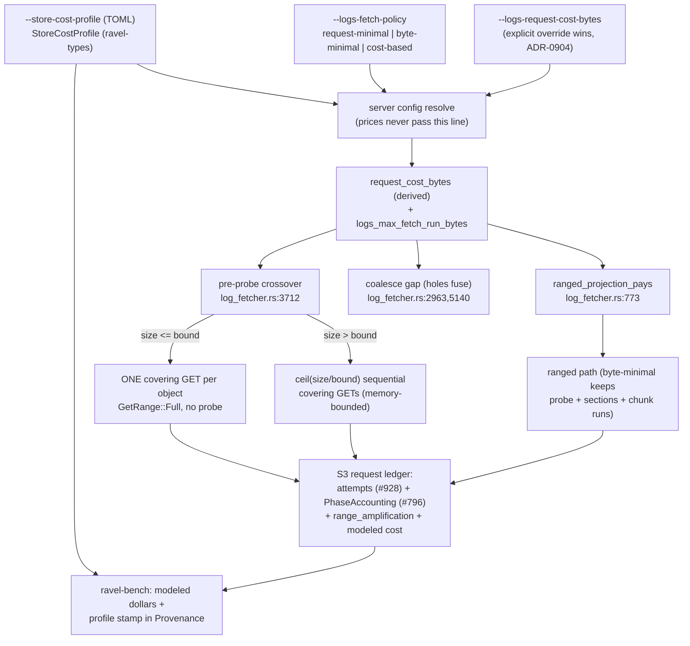

# ADR-0996: request-cost-aware fetching and the S3 request ledger

Status: Proposed

Refs: epic #996. Builds on ADR-0904 (request-cost/latency knob, landed:
`EngineConfig::logs_request_cost_bytes`, `--logs-request-cost-bytes`),
ADR-0107 (block-range logs fetch), ADR-0699 decision 5 (fetch projection),
issue #928 / ADR-0927 decision 8 (billed attempts), issue #913 (per-phase
wire bytes), issue #796 (PhaseAccounting), issue #888 (catalog freshness
GETs), issue #959 (distributed PhaseAccounting, in flight). Write-side
complement: PR #993's multipart-integrity routing (referenced, not
redesigned). Serializes with epic #979 where noted.

## Context

Ravel's reference deployment is intra-region: EC2↔S3 transfer is free, and
the S3 bill is requests only (PUT-class $5/M, GET-class $0.40/M — one PUT
costs 12.5 GETs). Those prices are a deployment property, not constants.
Under that billing shape the read path's economics invert: every
column-range GET spends a billed request to save bytes that are free.

### The measured baseline (clickbench-v4; confirmed this week, not re-derived)

3,469 post-compaction objects, 12.03 GB, 99,997,497 rows; mean object
3.47 MB (matches the reference-tenant figure in the probe derivation
comment, `crates/ravel-query/src/log_fetcher.rs:2113-2115`).

| phase | requests |
|---|---|
| cold 43-statement pass | 751,396 GETs (cache ratio 0) |
| hot pass (cache ≥ corpus) | 29 residual GETs (per-statement HEAD/catalog freshness, issue #888; `crates/ravel-catalog/src/catalog.rs:142,250`) |
| load (7,233-object geometry) | ~14.5k PUTs (2 per object: data + commit record) |
| compaction | ~29–36k resolve GETs + ~7.5k ranged GETs + ~3.5k PUTs |

The request-minimal floor for a full-scan statement is one data GET per
touched object: 43 × 3,469 = 149,167. Measured is 751,396, i.e. ~5.04
requests per touched object per statement.

### Where the ~5 GETs/object/statement come from (the code says)

The logs read path for an object above the routing threshold
(`LogSegmentFetcher::block_range_threshold`, default
`DEFAULT_LOG_WHOLE_OBJECT_THRESHOLD` = 512 KiB, `log_fetcher.rs:560,2186`;
server flag `--logs-block-range-threshold`,
`services/ravel-server/src/config.rs:525`) issues, per object per
statement, in `BlockRangeFetcher::fetch_object_with_footer` /
`fetch_object_v4`:

1. **Suffix probe** (etag-establishing `GetRange::Suffix`,
   `log_fetcher.rs:3756-3773`), window `derive_suffix_len` =
   size/32 clamped to [128 KiB, 256 KiB] (`log_fetcher.rs:2102-2134`).
2. **SKIP_IDX + PAGE_DIR**, one coalesced GET only when the probe window
   missed them (`place_sections_coalesced`, `log_fetcher.rs:4187-4197`).
3. **FIELD_DIR/STREAM_DIR front sections** — one coalesced GET whenever the
   projection is not all-columns (`log_fetcher.rs:4215-4240,4321-4331`);
   ClickBench statements always project, so this fires per object.
4. **Residual tail sections** (BLOOM/POSTINGS) a short probe missed, one
   GET each (`log_fetcher.rs:4337-4355`).
5. **Chunk-run GETs**: PAGE_DIR turns each surviving `(row group,
   projected column)` into page extents (`projected_page_extents`,
   `log_fetcher.rs:5172`), coalesced by `coalesce_byte_extents`
   (`log_fetcher.rs:5140-5158`) and fetched concurrently
   (`fetch_chunk_ranges`, `log_fetcher.rs:4384-4430`).

**The coalescer today** (`coalesce_byte_extents`, `log_fetcher.rs:5140`):
sorts extents by start and fuses a run whenever the next extent starts at
or before `last_end + max_gap` — adjacent and overlapping ranges always
fuse, and holes up to the gap are fetched and carried in the run (wire
bytes include them, `log_fetcher.rs:4380-4382`). The gap is
`effective_coalesce_gap` = `request_cost_bytes` floored at 64 KiB
(`log_fetcher.rs:2963-2966,2166`), i.e. ~1.8 MiB at the default
(`DEFAULT_LOG_REQUEST_COST_BYTES = 1_887_437`, `log_fetcher.rs:2156`).
There is **no covering-GET mode**: runs separated by more than the gap
stay separate requests, and nothing today can force "at most one GET per
object" short of the whole-object crossovers.

**Why ranged runs at all on 3.47 MB objects**: the pre-probe crossover
(`effective_whole_object_threshold` = 5 × request_cost ≈ 9 MiB,
`log_fetcher.rs:2974-2980`) would read them whole — but
`with_block_range_threshold(n)` pins the inner crossover to the same `n`
as the outer routing threshold (`log_fetcher.rs:644-648`), and the
projection router `ranged_projection_pays` (`log_fetcher.rs:773-780`,
consumed by `PartitionCtx::open_by_column_chunk`,
`crates/ravel-sql/src/logs_scan.rs:2319-2323`) sends any object whose
projection-skipped bytes exceed that threshold down the ranged path. At
the production 512 KiB setting a narrow projection of a 3.47 MB object
always qualifies. I infer (consistent with epic #680's recorded 751,409
figure) that this is exactly the measured 5.04×.

`ColumnSelection` itself lives in `crates/ravel-logseg/src/columns.rs:33`
and resolves per object against FIELD_DIR; note the spec's pointer at
`crates/ravel-logseg/src/ranged.rs` is the **compaction-side** ranged
reader (per-stream spans `StreamBlockSpan`/`StreamBlockLoc`,
`ranged.rs:42-48,94-104`, extents via `extent_of`/`group_extent`,
`ranged.rs:198-222,731-748`) — it forms row-group ranges for the
bounded-memory merge and has no gap coalescer. The query-side coalescing
this ADR governs is entirely in `ravel-query`. This ADR touches no file in
`ravel-logseg`.

### What already exists on the accounting side (wired, not new)

- **Billed attempts** (issue #928, ADR-0927 decision 8):
  `InstrumentedStore`/`StoreMetrics` separate `calls` (completions) from
  `attempts` (billed HTTP requests, retries and range fan-out included),
  recorded by the S3 adapter's counting connector into the same per-op
  block (`crates/ravel-object-store/src/instrument.rs:37-59,305,424-427`);
  `attempts::scope` wraps each op in the adapter
  (`crates/ravel-object-store/src/s3.rs:1405`).
- **Per-phase attribution** (issue #796): `PhaseAccounting` with phases
  resolve/plan/probe/scan
  (`crates/ravel-query/src/phase_accounting.rs:47-56`), plus per-phase
  WIRE bytes (`PhaseWireByteCounter`, `phase_accounting.rs:92-165`,
  issue #913) with byte-kind discipline already documented (wire vs
  stored vs decompressed vs cache). Issue #959's distributed extension
  (per-phase accounting across the Flight boundary) is in flight; this
  ADR consumes it and does not redesign it.
- **Opens by shape** (ADR-0904 decision 5, landed):
  `QueryAccounting::add_logs_ranged_opens`/`add_logs_whole_object_opens`
  (`crates/ravel-types/src/accounting.rs:136-139`), recorded per segment
  at `record_open_shape` (`logs_scan.rs:2338-2345`).
- **Bench ledger**: `RequestCounts` reads `calls`, not `attempts`
  (`crates/ravel-bench/src/report.rs:210-217`), and deliberately encodes
  no prices (`backend_bills_requests`, `report.rs:92,190-196`); the
  SQL-latency report already carries per-statement cold/hot GET and LIST
  counts (`crates/ravel-bench/src/sql_latency.rs:422-425,444-447`) and a
  requested/effective knob stamp precedent
  (`logs_request_cost_bytes_requested`/`_effective`,
  `sql_latency.rs:225-241`).
- **A request-denominated pre-execution estimate** already exists
  (`crates/ravel-sql/src/cost.rs:1-38`, ADR-0044), an upper envelope in
  requests — evidence the request is already the native unit here.

The provenance lesson this ADR encodes as a rule: the allocator episode
(docs/guides/clickbench.md:242-250) showed a variable that moves results
by >3× and is absent from provenance makes figures irreconcilable. The
active cost profile is exactly such a variable.

### Constraint check

Read-path policy and instrumentation only. No RSEG/RLOG layout byte
changes, no proto change, no key-layout change, no commit-token change —
the fetch policy chooses which byte ranges to GET over the frozen v4
layout, and every decode path is unchanged (`ColumnSelection` remains a
fetch+decode projection; ADR-0699 decision 5). Confirmed: no format
change is needed. Read-after-write/CAS/WORM untouched: the write side,
including PR #993's integrity routing (conditional puts stay single-PUT
to the 5 GiB S3 ceiling, multipart only under `Overwrite` above
`MULTIPART_THRESHOLD`, `s3.rs:126,1406-1417`), is out of scope and
referenced as the PUT-class complement of this GET-class ADR.

## Decision

### 1. The store cost profile is configuration, in one place, stamped into provenance

New type `StoreCostProfile` in `ravel-types` (new module
`crates/ravel-types/src/cost_profile.rs` — the shared leaf crate both
`ravel-bench` and the server config already depend on):

```rust
pub struct StoreCostProfile {
    pub name: String,                      // e.g. "s3-intra-region-2026"
    pub put_class_nanodollars: u64,        // per request; PUT/COPY/POST/LIST class
    pub get_class_nanodollars: u64,        // per request; GET/SELECT class
    pub transfer_nanodollars_per_gib: u64, // 0 on intra-region
    pub retrieval_nanodollars_per_gib: u64,// 0 on standard class
}
```

Integer nanodollars, never floats: prices are exact decimal contract
figures, and the repo's float-comparison rule should never apply to
money. The reference profile ships as a named constant
(`PUT 5_000`, `GET 400`, transfer 0, retrieval 0 — $5/M and $0.40/M) and
a TOML file can override it (`--store-cost-profile <path>` on the server
and the same file on `ravel-bench`), so the bench and any cost-based
planner read the one artifact. LIST and HEAD price at the class rates
they bill under (LIST is PUT-class on S3; HEAD is GET-class) — the
profile maps `StoreOp` to a class, it does not grow one field per op.

**Provenance rule**: every report that carries a request or modeled-cost
figure stamps the ACTIVE profile — name, all four prices, and the
resolved fetch policy — using the requested/effective split
`Provenance` already uses for `logs_request_cost_bytes`
(`sql_latency.rs:225-241`): a lane that cannot know what governed
(Flight against a foreign server, until #959 lands) stamps `effective:
None` rather than echoing the requested value. A figure without the
profile stamp is not a result (the allocator lesson, mechanical).

**Layering, preserved from ADR-0904**: the fetch layer still never learns
a price. Prices live in `ravel-types` (data), are read by the server
config and by `ravel-bench`; the server DERIVES the byte-denominated
exchange rate from the profile ratio (Decision 2) and hands
`ravel-query` only byte quantities, exactly the unit ADR-0904 argued
cannot lie. This keeps ADR-0904's "no prices in the engine" while ending
"no prices anywhere" — the ledger cannot price a pass without them.

### 2. The fetch policy: `request-minimal | byte-minimal | cost-based`

One operator knob, `--logs-fetch-policy`, new field
`EngineConfig::logs_fetch_policy`, default **`cost-based`**. It is an
intent layer that resolves, at startup, to the single quantity the fetch
layer already runs on (`BlockRangeFetcher::request_cost_bytes`,
`log_fetcher.rs:2831`), plus one new bound:

- **`request-minimal`**: resolve the exchange rate to `u64::MAX`
  (saturating arithmetic already in place, `log_fetcher.rs:2976-2978`).
  Consequences, all through existing code paths: the pre-probe crossover
  reads every object ≤ the fetch bound whole in ONE `GetRange::Full` GET
  with no probe (`log_fetcher.rs:3712-3731`); `ranged_projection_pays`
  can never find enough saved bytes, so the fast path opens whole
  (`log_fetcher.rs:773-780`); and the coalescing gap saturates, so any
  residual ranged read (bound-exceeding objects) fuses its selected
  ranges INCLUDING HOLES into at most one covering GET per object
  (`coalesce_byte_extents`'s fuse condition already does this at a
  saturated gap, `log_fetcher.rs:5145-5150`). Additionally the plan
  phase suppresses its per-segment footer probe when the scan read will
  be whole-object anyway — a probe that cannot reduce requests is pure
  spend; skip-index pruning still applies at decode over the fetched
  buffer, which is sound because it only ever skips fetched bytes
  (same argument as `log_fetcher.rs:3558-3560`).
- **`byte-minimal`**: today's behaviour, byte for byte — the ADR-0904
  latency break-even default (1,887,437) and all three derived
  decisions unchanged. Kept for egress-billed and network-constrained
  deployments, where ADR-0904 showed the default is already the
  cost-preferring setting.
- **`cost-based`**: derive the exchange rate from the active profile:
  `request_cost_bytes = get_class_nanodollars /
  transfer_nanodollars_per_byte`, clamped to the existing floors
  (64 KiB gap, 512 KiB crossover, `log_fetcher.rs:2166,2186`) and
  saturated when transfer is 0. At the reference profile this resolves
  to request-minimal; at list egress prices it resolves to ~4.4 KB,
  which the floors clamp — reproducing ADR-0904's worked examples from
  the profile instead of prose. A bounded resource penalty rides the
  derivation: the resolved rate is capped so a single GET's buffered
  length never exceeds the fetch bound below.

**The fetch bound (the memory consequence, stated)**: new
`EngineConfig::logs_max_fetch_run_bytes`, default 64 MiB, bounding the
buffered length of any single data GET on the query path — whole-object
reads apply only to objects ≤ the bound; a larger object falls back to
covering sequential sub-range GETs of at most the bound each
(`ceil(size/bound)` GETs — a 5 GiB object costs 80 GETs, never one
5 GiB buffer). The code says today's assembler already allocates the
full object size even on the ranged path (`ObjectAssembler::new(&pool,
total)`, `log_fetcher.rs:3742`), and `GetOutcome.data` is fully-buffered
`Bytes` (`crates/ravel-object-store/src/lib.rs:113-118`), so streaming
is not available at this seam without a contract change (rejected
alternative 5); the bound is therefore a NEW protective cap on both
policies, and the stated memory bound is `fetch permits ×
min(object_size, bound)` = 16 × 64 MiB = 1 GiB worst-case at defaults
(`DEFAULT_LOG_MAX_CONCURRENT_GETS`, `log_fetcher.rs:2200`) — versus
today's formally unbounded `permits × object_size`. A 3.5 MB
whole-object GET is fine; a 5 GiB one is refused by construction.

**Knob relations (ADR-0904 alignment)**: `--logs-request-cost-bytes`
stays and WINS when explicitly set — policy is the intent layer, the
byte flag the expert escape hatch; `--logs-block-range-threshold` keeps
its ADR-0904 role. The policy must never be derivable from query text,
headers, or tickets (ADR-0904 decision 4's cost-DoS argument, inverted:
under request billing a tenant forcing `byte-minimal` per query would
5× the deployment's request bill). The row-identity invariant carries
over verbatim: for any policy value a query returns exactly the same
rows; only counters and timing may differ — pinned by extending
`both_paths_return_identical_rows`
(`crates/ravel-sql/tests/logs_fast_path_projection_routing.rs`) and the
knob-routing test (`crates/ravel-sql/tests/logs_request_cost_knob_routing.rs`)
across all three policies.

**Default argued**: `cost-based` + reference profile ⇒ request-minimal
behaviour on the deployment this project actually runs. The latency cost
is real and named: epic #680 measured the whole-object shape at
324.79 s vs 222.19 s cold (+46% wall) because ranged reads halved bytes
moved AND parallelized within objects (`fetch_chunk_ranges` issues runs
concurrently, `log_fetcher.rs:4402`); request-minimal loses within-object
range parallelism (one stream per object) but keeps cross-object
parallelism (the permit pool) and removes the probe→sections→runs
sequential chain (~3 dependent RTTs → 1). With transfer free, the
recovery lever is `--fetch-concurrency` (more parallel streams cost
requests nothing). Whether that recovers the 46% is a measurement, not a
claim — it is pre-registered below with a hard guardrail, and the
default demotes to `byte-minimal` if the guardrail fails.



### 3. The ledger contract

Extend, never duplicate (#928's seam is the single source of billed
truth):

- **Requests are billed ATTEMPTS.** The ledger's headline request figures
  read `StoreMetrics.attempts` per op (`instrument.rs:305,424-427`);
  `calls` stays beside them as the diagnostic (retry overhead =
  `attempts − calls`). NEW: `RequestCounts` gains `put_attempts` /
  `get_attempts` / `list_attempts` next to today's `calls`-based fields
  (`report.rs:210-217` currently reads calls only) and the per-statement
  SQL-latency rows gain the attempt figures beside the existing
  `object_store_get_requests` (`sql_latency.rs:422-447`). No second
  counter is built anywhere (rejected alternative 4).
- **`range_amplification = data_GET_requests /
  unique_query_object_touches`**, DATA GETs only: the numerator is
  scan-phase GET requests (`ReadPhases::blocks` charges to
  `QueryPhase::Scan`, `phase_accounting.rs:120-127`; probe/plan/resolve
  stay in their own phases and never enter it). The denominator is NEW:
  `QueryAccounting::data_objects_touched`, recorded once per distinct
  data object per query at the two open funnels (the fast-path
  `record_open_shape` site, `logs_scan.rs:2338`, and the
  plan-then-stripe fetch entry) — the existing opens-by-shape counters
  cover only the fast path, so they cannot be the denominator alone.
- **Every byte figure names its kind** — already the wired discipline
  (wire: `PhaseWireByteCounter`; stored: `page_bytes_fetched/decoded`;
  cache: `cache_bytes`; `accounting.rs:111-142`,
  `phase_accounting.rs:167-171`); the ledger output labels each column
  with its kind and whether retries/ranges are included, and never sums
  across kinds. NEW: labels in the report renderer only.
- **Per-phase attribution** stays on `PhaseAccounting` (local, wired) and
  adopts #959's distributed extension when it lands; until then Flight
  rows stamp `effective: None` per Decision 1's rule. NEW here: nothing
  structural — one reconciliation row in the report asserting
  `sum(phase GET requests) ≤ store GET calls ≤ GET attempts`, which
  holds by the wiring documented at `instrument.rs:44-52`.
- **Modeled cost** = profile × attempts per class, an output column of
  bench and per-query stats, integer nanodollars, always beside the
  profile stamp. The engine never reads it back (observability-only, the
  `InstrumentedStore` rule, `instrument.rs:5-13`).

### 4. The regression gate

Figures gate CI only where a statement's shape defines the budget (the
plan-shape lint rule): each gated figure is asserted present exactly
once and inside its band, and the gate exits non-zero on absent,
duplicated, or out-of-band alike.

- **Object-count bands** (wired precedent:
  `crates/ravel-bench/tests/sql_latency_object_count_invariant.rs`):
  the corpus object count the pass ran against, asserted exactly.
- **`data_GETs_per_touched_object`**: per full-scan statement ≤ 1.05
  under request-minimal (band, not point: bound-splitting on oversized
  objects is legal); selective statements gate against the budget their
  plan shape defines (survivor row groups × projected columns, coalesced
  — the existing amplification fixture pattern,
  `crates/ravel-sql/tests/logs_selective_scan_amplification.rs`).
- **Modeled cost** per pass at the stamped profile, band derived from
  the request bands (a redundant figure on purpose: it fails when a
  price or a count moves without the other).
- **Where it runs**: the exact-figure fixtures run on `MemoryStore`
  through one `InstrumentedStore` in `ravel-bench` tests (deterministic,
  every CI push, part of `scripts/gates.sh`'s ravel-bench lane); the
  full-corpus bands run in the bench lane on the real corpus per the
  measurement cadence, with the pre-registration rule below.

## Rejected alternatives

1. **Whole-object reads as an unconditional default (delete the ranged
   path or hard-default request-minimal for everyone).** Lost because
   egress-billed and network-constrained deployments measurably win on
   ranged reads (ADR-0904's ~4.4 KB dollar break-even; #680's −52%
   bytes), and because #680 measured the whole-object shape +46% on cold
   wall — an unconditional default ships that regression to deployments
   whose bytes are not free. The policy keeps both shapes reachable and
   tested.
2. **Per-query hints instead of an operator policy.** Lost for ADR-0904
   decision 2's reasons, still current: the knob becomes a
   tenant-reachable field on a query surface, and under request billing
   a tenant forcing byte-minimal per statement multiplies the request
   bill ~5× (the measured 5.04 amplification) invisibly to byte budgets;
   Flight would additionally need the ticket to carry it
   (`get_flight_info`/`DoGet` consistency). Operator surfaces only.
3. **A byte-based cost model (extend `logs_request_cost_bytes` alone; no
   prices anywhere).** Lost because a single byte ratio cannot express
   the PUT:GET 12.5:1 class asymmetry (write-side and compaction PUTs
   priced against read GETs in one pass report), cannot produce a
   modeled dollar figure for a report, and leaves the provenance stamp
   naming a derived number whose inputs are invisible — the exact
   irreconcilable-figures failure the allocator lesson names. The byte
   ratio survives as the ENGINE's unit (Decision 2 derives it from the
   profile); the profile is what the ledger and provenance need.
4. **A second request counter beside #928's attempts.** Lost because two
   counters of "billed requests" drift the moment a retry policy or
   range fan-out changes, and the repo already has the layered seam
   (connector records attempts, decorator records calls,
   `instrument.rs:37-59`); every new figure here is a read of that seam
   or a new orthogonal counter (`data_objects_touched`), never a
   parallel count of the same event.
5. **Streaming GETs (trait change) instead of a fetch bound.** Lost
   because `ObjectStoreBackend::get` returns buffered `Bytes`
   (`lib.rs:113-118`) under a normative contract
   (docs/object-store-contract.md), and changing it touches every
   backend and decorator for a bound that segmented covering GETs
   deliver at `ceil(size/bound)` requests — on this corpus, zero extra
   requests. Revisit only if object sizes grow to make the segment count
   material.
6. **Auto-detecting the billing shape from the endpoint.** Lost again as
   in ADR-0904 alternative 6: S3-compatible endpoints do not disclose
   billing, and a guessed profile in provenance is worse than a declared
   one.

## Consequences

- The reference deployment's cold pass drops from ~5.04 to ~1.0 data
  GETs per touched object per statement by configuration of
  already-tested read shapes; no new fetch protocol exists to break, and
  the row-identity differential pins all three policies.
- Latency and memory move and are guarded, not hidden: every request
  figure in the gate rides beside its latency and peak-memory guardrails
  (below), so a request win cannot mask a compute regression.
- `EngineConfig` grows two fields (policy, fetch bound); struct-literal
  constructors across the workspace need them (compile-visible).
- The bench report gains attempts, modeled cost, amplification, and the
  profile stamp; `backend_bills_requests` stays (it is the flag that
  says whether modeled cost is a bill or a model).
- Prices enter the repo as data with a named home and a stamp rule;
  ADR-0904's engine layering is intact.
- Compaction and load PUT economics are untouched (write side; PR #993
  referenced); the compaction read side gets a ledger only, and any
  compaction fetch-policy change is explicitly deferred behind epic #979
  (collision map below).
- Docs ride the wiring commits (repo rule): operations guide gains the
  policy/profile sizing section; docs/README.md indexes this ADR.

## Verification plan (pre-registered)

Bands are posted on epic #996 BEFORE the measurement run; the run stamps
verified state (fold sealed, declared columns present, format audited,
cache state) plus the active profile next to each figure, per the
measurement rules. Order of investigation on a miss: state vs
pre-registration first, per-phase split second, code hypotheses last.

| figure | band | counter that reports it |
|---|---|---|
| cold 43-statement pass, data GETs | ≤ 160,000 (= 149,167 floor + freshness residue ~29 + bounded fallback term; expected ≈ 149.2k) | existing: `StoreMetrics.get.attempts`/`calls`, per-statement `object_store_get_requests`; scan-phase split via `PhaseAccounting` |
| modeled cold-pass read cost | ≤ $0.064 (160,000 × $0.40/M) at the stamped reference profile | NEW: modeled-cost column (Decision 3) |
| range_amplification, full-scan statements | ≤ 1.05 | NEW: `data_objects_touched` denominator; existing scan-phase GET numerator |
| hot pass residual GETs | ≤ 35 (policy must not disturb #888 freshness; today 29) | existing per-statement hot counters |
| cold-pass wall time | ≤ 1.60× the byte-minimal baseline at reference concurrency (pre-registered from #680's 1.46× measured ratio + margin); a follow-up sweep raises `--fetch-concurrency` to find the buy-back point | existing bench latency table |
| peak fetch-buffer residency | ≤ permits × 64 MiB; on this corpus ≤ permits × 3.5 MB, band unchanged ±10% vs baseline | existing `peak_intermediate_bytes` (`accounting.rs:142`) + assembly-pool stats (`log_fetcher.rs:2883-2890`) |
| load / compaction PUTs | unchanged bands (~14.5k / ~3.5k): read-policy change must not move PUT class | existing `StoreMetrics.put` |

Each figure present exactly once and inside band; absent or duplicated
fails identically to out-of-band. Latency/memory guardrails ride beside
every request figure in the same report row.

## Task decomposition and collision map

One crate, one context window each. Waves are sequential; within a wave,
zero file overlap and no two tasks in one crate. **ravel-logseg is
deliberately untouched** — the query-side work all lives in ravel-query
— so no ADR-0996 task serializes with epic #979's T3/T4 (which are
rewriting the compaction cursor path against `ranged.rs`'s API this
quarter) EXCEPT 996-8, which is scheduled behind them by construction.

| id | title | crates | predicted files | deps / serializes with | acceptance |
|---|---|---|---|---|---|
| 996-1 | `StoreCostProfile` (nanodollar arithmetic, TOML load, reference constant) + `QueryAccounting::data_objects_touched` | ravel-types | `src/cost_profile.rs` (new), `src/accounting.rs`, `src/lib.rs` | — | exact-figure unit tests; reference profile constants pinned ($5/M, $0.40/M, 12.5:1 asserted); snapshot/merge round-trip for the new counter |
| 996-2 | ledger reads attempts: `RequestCounts` gains per-op attempts beside calls; byte-kind labels in report output | ravel-bench | `src/report.rs` | — (reads #928's existing seam) | MemoryStore fixture: attempts==0 with calls>0 labelled correctly; S3-shaped fixture via `StoreMetrics::record_attempt` asserts attempts≥calls exactly |
| 996-3 | policy enum + `EngineConfig::logs_fetch_policy`, `logs_max_fetch_run_bytes`; exchange-rate derivation; fetch bound + segmented covering fallback; plan-probe suppression under request-minimal; record `data_objects_touched` | ravel-query | `src/config.rs`, `src/log_fetcher.rs` | 996-1 | policy→rate mapping table pinned (saturate / default / profile-derived w/ floors); bound test: object > bound fetched in `ceil(size/bound)` GETs, peak buffer ≤ bound, rows byte-identical |
| 996-4 | modeled cost + profile/policy provenance stamp (requested/effective split) in bench reports | ravel-bench | `src/sql_latency.rs`, `src/report.rs` (non-overlapping sections vs 996-2, sequenced anyway: W2) | 996-1, 996-2 | report fixture asserts stamp present exactly once, `effective: None` on the Flight lane, modeled cost = attempts × profile to the nanodollar |
| 996-5 | server flags `--logs-fetch-policy`, `--store-cost-profile`; reachability test in the `logs_request_cost_bytes_is_reachable_from_cli` shape; precedence: explicit byte flag wins | ravel-server | `services/ravel-server/src/config.rs`, `src/query.rs` | 996-3 | flag proven to arrive at the running engine through real startup; precedence pinned |
| 996-6 | per-statement `range_amplification` exposure; policy-extremes differential (rows identical at all three policies; opens/GET counters prove the route) | ravel-sql | `src/executor.rs`, `tests/logs_request_cost_knob_routing.rs`, `tests/logs_fast_path_projection_routing.rs` | 996-3 | counters, not configured values, prove which route ran (ADR-0904 904-4 rule); amplification == 1.0 exactly on the fixture under request-minimal |
| 996-7 | regression gate: per-statement bands, amplification gate, plan-shape rule (request-minimal full scan ⇒ ranged opens == 0), present-exactly-once discipline | ravel-bench | `tests/` (new gate test), `src/sql_latency.rs` band plumbing | 996-4, 996-6 | gate red on: absent figure, duplicated figure, out-of-band figure — each shown failing once (prove-the-test) |
| 996-8 | compaction read ledger: per-run request/byte report from the maintain path (counters only, no fetch-policy change) | ravel-maintain | `src/build.rs`, `src/rlog.rs` (counter seams) | 996-1; **SERIALIZES with epic #979 T2/T3/T4** (same `rlog.rs`; schedule after #979's wave lands; do not dispatch concurrently) | per-run figures match the spec baseline bands on the fixture corpus |
| 996-9 | measurement: clickbench-v4 cold+hot pass at `cost-based`+reference profile on the reference box; bands from the Verification plan posted on the epic before the run; concurrency sweep for the latency buy-back | none (operational) | bench results doc | 996-5, 996-6, 996-7 | every band above; a figure outside band fails the task, not the write-up; report stamps verified state + profile |
| 996-10 | operations-guide policy/profile sizing section; docs/README.md index; RSEG non-coverage stated (metrics fetcher's constants are not policy-driven, `crates/ravel-query/src/fetcher.rs`) | docs only | `docs/guides/operations.md`, `docs/README.md` | 996-5 | doc names all three policies, the bound, the stamp rule; every dollar figure labelled as profile-modeled |

Wave cut: **W1** = 996-1, 996-2 (distinct crates). **W2** = 996-3, 996-4.
**W3** = 996-5, 996-6. **W4** = 996-7, 996-8 (996-8 only if #979 T2–T4
have landed; else it slips to W5 — the serialization is with #979, not
with anything in this epic). **W5** = 996-9, 996-10. Crate collision
summary: ravel-query is touched only by 996-3; ravel-sql only by 996-6;
ravel-object-store by nothing (attempts seam already complete);
ravel-bench by 996-2/996-4/996-7 in three separate waves;
ravel-logseg by nothing.
