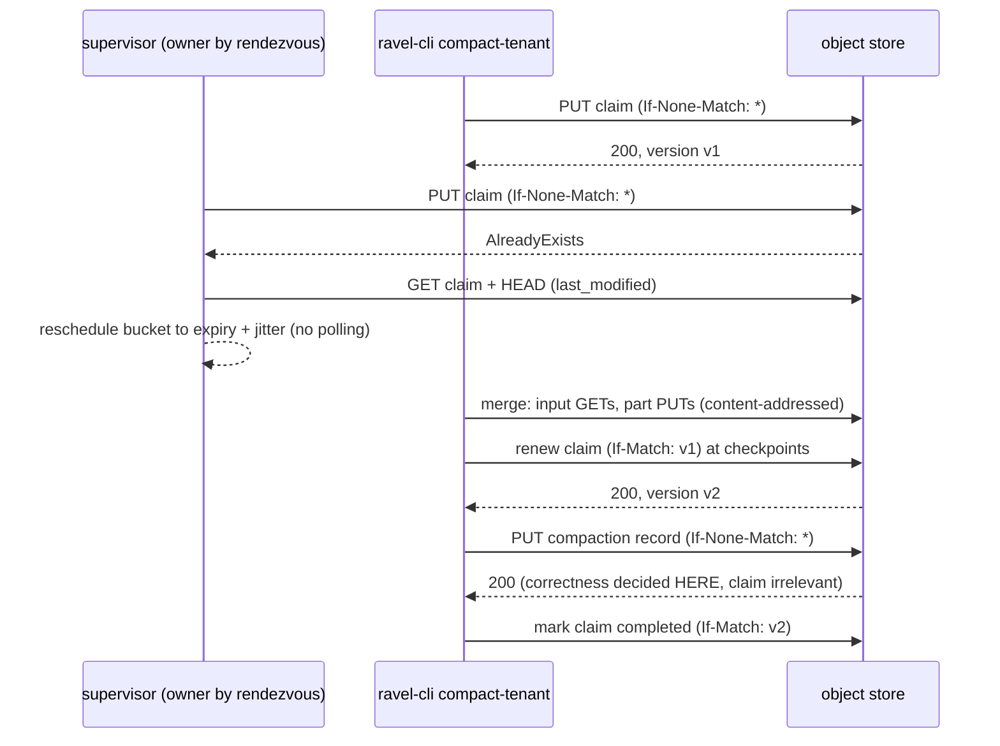

# ADR-1029: advisory compaction claims over object-store CAS

Status: Proposed

## Context

Compaction is coordinated for correctness but not for cost. The publish
path serializes racing runs at the compaction record's `CreateIfAbsent`
(`crates/ravel-maintain/src/publish.rs:209`), so two processes that
compact the same sealed bucket always converge on one record; the loser
pays the full merge and discards it. One full-tenant logs compaction on
the 100M-row ClickBench corpus measured 16,224 s of wall clock and 3,459
part PUTs (issue #968 ledger); a duplicated run pays all of it again for
zero durable effect.

What already prevents duplicates, and what does not:

- ADR-0065 decisions 1 and 2 are landed. The background supervisor gates
  every `(tenant, signal, shard)` unit on rendezvous ownership over the
  heartbeat live set (`services/ravel-server/src/maintain.rs:1116-1123`,
  `crates/ravel-fleet/src/worker_set.rs`). In steady state, background
  replicas do not duplicate discovery or merges. This ADR does not touch
  that mechanism.
- Three windows remain where duplicate merges happen anyway:
  1. `ravel-cli maintain compact-tenant` calls `compact_bucket` directly
     (`services/ravel-cli/src/maintain.rs:425`) and is invisible to the
     rendezvous hash. A CLI run racing the supervisor on the same bucket
     duplicates the whole merge until the record PUT.
  2. Membership transitions: ADR-0065 accepts a bounded double-ownership
     window (`3 x H` plus one heartbeat) during which two workers both
     believe they own a unit. A merge in flight across that window is
     duplicated.
  3. A live-but-wedged owner starves its units; ADR-0065's mitigation is
     an alarm plus bounded intra-process concurrency, not takeover. The
     operator's remedy is a manual CLI run, which is window 1.
- ADR-0979 made the duplicate strictly more expensive to interrupt badly:
  the bounded compactor releases part bytes at PUT
  (`crates/ravel-maintain/src/rlog.rs:1976`), so a converging loser can no
  longer repair a missing winner part from RAM and fails closed
  (`ConvergedWinnerPartMissing`), forcing a full re-run.

The object store already carries the required primitive. The contract
makes both conditional modes mandatory (`PutMode::CreateIfAbsent`,
`PutMode::CasVersion(Version)`; `crates/ravel-object-store/src/lib.rs:57`,
capabilities enforced at startup), the S3 adapter maps them to
`If-None-Match: *` and `If-Match`, and the deployment qualification suite
(`ravel-cli store qualify`, `crates/ravel-object-store/src/conformance.rs`)
already falsifies both probes per bucket before a server will start. No
new store capability is needed.

One genuine gap: no durable expiry exists anywhere in the codebase, and
`last_modified` is returned only by `head()`/`list()` (`ObjectMeta`), at
1-second granularity, with the contract scoping it to "GC age checks
only; never order commits by it". Lease expiry is an age check with
advisory consequences, but the contract wording must be widened
deliberately, not assumed.

Naming is constrained by ADR-0065 decision 1: `LeaseCheck` is the GC
reader-protection gate and `WorkerSet` is membership; both module docs
forbid blurring. The word "claim" has zero coordination uses repo-wide
and is this ADR's vocabulary.

A lease is logically a lock. After this ADR, Ravel's architectural
statement is: no coordinator, no leader election, and no
correctness-critical distributed locks. Claims suppress redundant
maintenance work; immutable content-addressed parts and CAS record
publication remain the sole correctness mechanism.

## Decision

### 1. A reusable claim primitive in ravel-fleet

New module `crates/ravel-fleet/src/claim.rs`. A claim is one small
mutable advisory object per unit of expensive work:

```
sys/maintain/claims/compaction/<work_id_hex>
```

`work_id` is a blake3 hash under a versioned domain tag:

```
work_id = blake3("ravel-compaction-claim-v1",
                 tenant_hash, signal, shard, ingest_hour_bucket)
```

The identity is the `Bucket` struct's four fields
(`crates/ravel-maintain/src/bucket.rs:11-15`), exactly the granularity at
which merges are paid for. Deliberately excluded from the identity:

- `input_set_hash`. Two nodes whose listings diverge on a sealed bucket
  must collide on one claim, run once, and surface the divergence through
  the existing `InputSetHashDivergence` machinery, not run twice under
  two claims.
- A compaction policy version. None exists in the repo; the record key
  itself embeds only `input_set_hash16`, and geometry knobs
  (`max_l1_part_bytes`, `l1_part_memory_target_bytes`) already change
  part sets without changing record identity. The claim mirrors record
  identity. If a policy version is ever introduced, the domain tag
  versions the claim key space.

Payload is a versioned-tag protobuf:

```
{ owner_process_id, attempt_id, input_set_hash, state,
  renewed_count, lease_duration_ns, owner_clock_ns }
```

`owner_process_id` is the ADR-0057/0065 startup UUID; `attempt_id` is
fresh per acquisition. `input_set_hash` and `owner_clock_ns` are
informational (operator forensics), never inputs to any decision.
`state` is `running` or `completed`.

Protocol, using only contract-mandatory operations:

1. Check the terminal marker first: if the bucket already has a
   compaction record, there is nothing to claim (`compact.rs:64` already
   short-circuits; the claim check sits behind it).
2. Acquire with `PutMode::CreateIfAbsent`. `AlreadyExists` means another
   attempt holds the claim: read it once (one GET), `head()` it for
   `last_modified`, compute expiry as
   `last_modified + lease_duration`, and reschedule this bucket to after
   expiry plus deterministic jitter. Never poll an active claim.
3. Renew with `PutMode::CasVersion(v)` where `v` is the `Version` from
   the owner's last successful PUT (returned in `PutOutcome`; no extra
   read). Renewal cadence is one-third of the lease duration, evaluated
   at cancellation checkpoints (Decision 3), not on a timer task.
4. Steal an expired claim with `PutMode::CasVersion(old_v)`: the old
   version token guarantees exactly one thief wins and that a
   concurrent renewal by a not-actually-dead owner defeats the steal.
   `PreconditionFailed` on a steal means someone else moved first; back
   off to step 2's reschedule.
5. On losing a renewal (`PreconditionFailed`), the owner stops at the
   next cancellation checkpoint. It publishes nothing from that run.
6. On success, mark the claim `state=completed` with `CasVersion`, or
   leave it to age out. Never delete unconditionally: a stale worker's
   DELETE could destroy a newer owner's claim. The published compaction
   record remains the only completion marker that means anything.

Expiry is judged from the store's server-generated `last_modified`, read
by `head()` on the contention path only. Node clocks never enter the
decision; 1-second granularity is noise against the 300 s default lease.
Early stealing caused by any residual skew is safe (advisory), merely
wasteful. `docs/object-store-contract.md`'s `last_modified` wording is
widened in the same commit from "GC age checks only" to "advisory age
decisions (GC age checks, claim expiry) only", keeping the ban on
ordering commits by it.

The primitive is generic over the key prefix and payload so retention,
sweep, folds, and erasure can adopt it later as an optimization; only
compaction adopts it in this ADR.

### 2. Claims are advisory: the correctness layer is untouched

A claim confers zero publication rights and its absence removes none.
The publish path (`publish.rs`) does not read claims. A paused owner
that loses its claim, wakes, and finishes anyway still collides at
content-addressed part keys and at the record's `CreateIfAbsent`, and
either converges or receives the existing typed
mismatch/missing-part errors. A claim bug can waste work; it cannot
corrupt data. This property is load-bearing: it is what keeps the
"no correctness-critical locks" statement true, and every test in the
Consequences section that kills owners at arbitrary points exists to
defend it.

### 3. Cancellation checkpoints in the merge pipeline

The merge gains a `ClaimGuard` consulted at the five natural quiescent
points the pipeline already has:

1. after the seal/tombstone/already-compacted/min-input gates, before
   any read (`compact.rs:60-71`);
2. after input listing and `input_set_hash`, before catalog fan-out
   (`rewrite.rs:112-134`);
3. at the per-stream merge loop head (`rlog.rs:777-788`);
4. at each part boundary, after `put_part` returns (`rlog.rs:1960`);
5. immediately before record publish (`rewrite.rs:138`).

At each checkpoint the guard renews if a third of the lease has elapsed,
and cancels the run if renewal fails or the claim was observed stolen.
Cancellation returns the existing `PublishOutcome::Abandoned` shape and
inherits its safety argument verbatim (`publish.rs:31-45`): parts are
content-addressed and deterministic over the frozen input set, a later
run republishes byte-identical keys, and orphaned parts age out under
sweep rule 3. No new durable mid-run state exists.

The lease duration must exceed the longest non-cancellable stage (one
stream's cursor drain or one part encode+PUT), not the whole job.
Default 300 s, config `claim_lease_duration`; a warning at startup if
configured below 2x the largest of `max_l1_part_bytes` at a conservative
encode rate.

### 4. Cost gating: claims only where duplication is expensive

Claim traffic is PUT-class, the expensive request class ($5/M reference
profile vs $0.40/M GET). The claim decision is explicit:

```
claim when  P(duplicate) x expected merge cost  >  claim PUT + renewals
```

Mechanically: a bucket is claimed only when its listed input bytes are
at or above `claim_min_input_bytes` (default 64 MiB stored). Below it,
duplicated work is cheaper than coordination and the bucket runs
unclaimed, exactly as today. Deterministic jitter (derived from
`blake3(work_id || process_id)`, so it is stable per contender and free
of a shared clock) precedes every acquisition attempt, spreading
simultaneous starts. In steady state the supervisor's rendezvous gate
already ensures a single contender, so the added cost is one PUT per
claimed bucket plus renewals for long merges; the claim earns its PUT
whenever it prevents even one duplicated merge per ~thousands of claims.

Every claim/renew/steal request is counted under a new `coordinate`
phase in the compaction request ledger (996-8), never pooled into the
merge's own counters.

### 5. Participation and the escape hatch

Both callers of `compact_bucket` participate:

- the background supervisor's per-unit tick, inside its existing
  ownership gate;
- `ravel-cli maintain compact-tenant`, which is exactly the actor the
  rendezvous hash cannot see. The bucket walk (sequential today, with
  bucket-level concurrency arriving under #1028's stage 1) claims each
  bucket before merging it and reports skipped-because-claimed buckets
  in the walk summary, per the no-silent-defaults rule.

`--no-claim` on the CLI bypasses claiming for repair work (documented
as: safe for correctness, may duplicate work). `coordination = off` in
the compactor config disables claims fleet-wide as the fallback for a
store whose qualification record predates the CAS probes or an
emergency; the code path is the same as the tiny-bucket skip, so it is
exercised by default tests, not a dead branch.

### 6. Discovery deduplication stays on rendezvous ownership

The intent's fixed virtual maintenance partitions (`H(unit) mod 256`
with renewable partition claims) are not adopted. The property they
target, at most one background maintainer discovering/scanning each
slice with automatic takeover on death and no registry, leader, stable
identity, or reassignment service, is already delivered by the landed
rendezvous ownership over heartbeat membership, as a pure function with
zero contended objects and zero renewal traffic. Superseding it with 256
CAS-renewed partition claims would add a contended mutable-key class and
a steady-state PUT budget to re-deliver an existing capability, and
ADR-0065's acceptance test for it (two supervisors, disjoint coverage,
no steady-state double-pay) is already the regression net. Claims layer
exactly where ownership cannot reach: cross-fleet actors, handoff
windows, wedged owners.



## Rejected alternatives

1. **Fixed maintenance partitions with renewable partition claims** (the
   intent's section 3). Lost to the landed ADR-0065 rendezvous
   mechanism: same four negative-space properties, zero contention, zero
   steady-state request cost, already gating production
   (`maintain.rs:1116`). The partitions would re-deliver discovery dedup
   at the cost of 256 contended claim objects and their renewal PUTs.
   Rendezvous does not cover the CLI; the bucket claim does.
2. **Per-unit CAS TTL leases for all maintenance work every tick**
   (ADR-0065 rejected alternative 1). Still rejected on its cost shape:
   a GET-and-PUT per unit per tick, linear in the unit count. This ADR's
   claims differ in every term of that objection: per bucket rather than
   per unit, taken only at merge start, only above a cost threshold, and
   renewed only while a merge runs, so steady-state claim traffic is
   proportional to compactions actually executed, which is the work
   being protected.
3. **`input_set_hash` in the work id.** Divergent input views must
   collide on one claim so one run executes and the divergence surfaces
   as the existing typed invariant breach; hashing the view into the key
   would let both run and publish two records under two claims.
4. **Unconditional claim deletion on completion.** A stale worker's
   DELETE after a steal would destroy the newer owner's claim; `If-Match`
   completion or lifecycle aging cannot.
5. **Expiry from a payload-embedded node clock.** Reintroduces the clock
   skew ADR-0065 confined to one heartbeat object; the store's
   `last_modified` is one server-assigned time base shared by all
   contenders.
6. **Making the claim a publication precondition.** A lease bug would
   become a data-corruption bug. The claim stays invisible to
   `publish.rs` by construction, and the crash-kill test battery pins
   that.

## Consequences

- **New advisory mutable key prefix** `sys/maintain/claims/` beside
  `workers/` and `memo/`. `docs/catalog-and-mvcc.md`'s key-layout
  section and ADR-0055's role templates (maintain role writes
  `sys/maintain/`, already granted) are updated in the landing commit.
  Like its siblings it must sit outside any WORM-protected prefix.
- **Contract doc widening** for `last_modified` as stated in Decision 1;
  no store capability or version changes. Claims use only mandatory,
  already-qualified operations, and the existing qualification suite's
  CAS probes are the conformance gate the `coordination = off` fallback
  is documented against.
- **`ravel-fleet` grows `claim.rs`**; `LeaseCheck` and `WorkerSet`
  vocabularies untouched. The claim module doc carries the same
  "this is not the GC lease" paragraph both siblings carry.
- **Request-cost accounting**: claim traffic reports under a
  `coordinate` phase; 996-8's compaction ledger counts it separately.
  Expected steady-state figures: +1 PUT and +0 GET per claimed bucket
  (owner path), +1 GET +1 HEAD per contender observation (contention
  path only).
- **New metrics** `ravel_maintain_claims_acquired_total`,
  `claims_lost_total`, `claims_stolen_total`,
  `claim_renew_failures_total`, `claimed_buckets_skipped` on the walk
  report. Alert rule: sustained steal rate above zero (a steal storm
  means lease duration is below a non-cancellable stage).
- **Interaction with #1028 bucket concurrency**: claims are per bucket;
  a concurrent walk holds N claims with independent renewal state.
  Jitter is per work id, so N parallel acquisitions do not stampede.
- **Test battery** (FaultStore-scripted, MemoryStore-verified): crashes
  before and after each renewal, part upload, and record publication;
  lost renewal responses (renew returns `PreconditionFailed`, run
  cancels at next checkpoint, publishes nothing); a paused stale owner
  finishing after a steal (converges or takes the typed error, never
  corrupts); steal races (two thieves, one `CasVersion` winner); 404 on
  claim HEAD after DELETE-by-sweep; divergent input hashes colliding on
  one claim; and a two-supervisor MemoryStore test asserting via
  request counters that exactly one merge runs where today's test
  observes two. Every count is an exact figure, not `> 0`.
- **Wave preview** (Stage 2 decomposes properly): W1 claim primitive +
  contract/key-layout docs (ravel-fleet, docs); W2 checkpoints + claim
  participation (ravel-maintain, serialized behind the in-flight #872
  chain on rlog.rs); W3 CLI participation + flags (ravel-cli, behind
  #1028 stage 1); W4 metrics + operations guide. Reuse for
  retention/sweep/fold/erasure is explicitly follow-up work.
