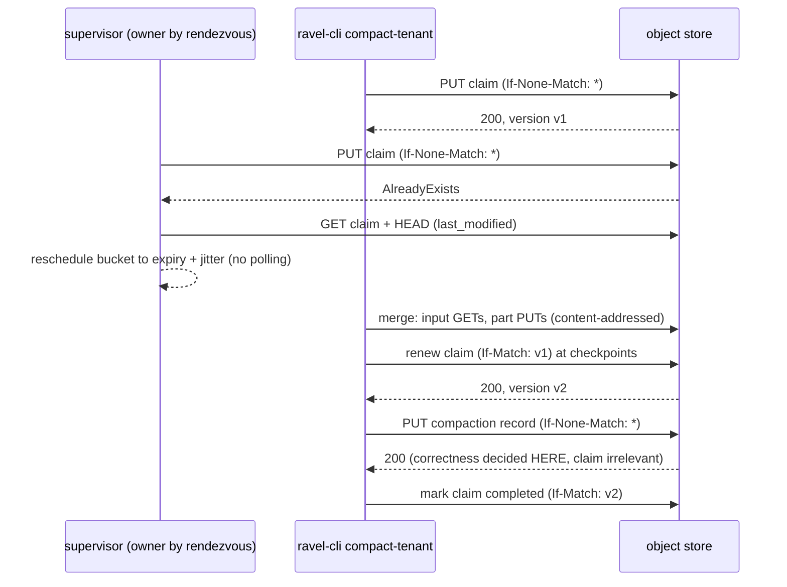

# ADR-1029: advisory compaction claims over object-store CAS

Status: Accepted (2026-09-01, PR #1031; see the 2026-09-28 amendment)

## Context

Compaction is coordinated for correctness but not for cost. The publish
path serializes racing runs at the compaction record's `CreateIfAbsent`
(`crates/ravel-maintain/src/publish.rs:209`), so two processes that
compact the same sealed bucket always converge on one record; the loser
pays the full merge and discards it. One full-tenant logs compaction on
the 100M-row ClickBench corpus measured 16,224 s of wall clock and 3,459
part PUTs (issue #968 ledger); a duplicated run pays all of it again for
zero durable effect.

What already prevents duplicates, and what does not:

- ADR-0065 decisions 1 and 2 are landed. The background supervisor gates
  every `(tenant, signal, shard)` unit on rendezvous ownership over the
  heartbeat live set (`services/ravel-server/src/maintain.rs:1116-1123`,
  `crates/ravel-fleet/src/worker_set.rs`). In steady state, background
  replicas do not duplicate discovery or merges. This ADR does not touch
  that mechanism.
- Three windows remain where duplicate merges happen anyway:
  1. `ravel-cli maintain compact-tenant` calls `compact_bucket` directly
     (`services/ravel-cli/src/maintain.rs:425`) and is invisible to the
     rendezvous hash. A CLI run racing the supervisor on the same bucket
     duplicates the whole merge until the record PUT.
  2. Membership transitions: ADR-0065 accepts a bounded double-ownership
     window (`3 x H` plus one heartbeat) during which two workers both
     believe they own a unit. A merge in flight across that window is
     duplicated.
  3. A live-but-wedged owner starves its units; ADR-0065's mitigation is
     an alarm plus bounded intra-process concurrency, not takeover. The
     operator's remedy is a manual CLI run, which is window 1.
- ADR-0979 made the duplicate strictly more expensive to interrupt badly:
  the bounded compactor releases part bytes at PUT
  (`crates/ravel-maintain/src/rlog.rs:1976`), so a converging loser can no
  longer repair a missing winner part from RAM and fails closed
  (`ConvergedWinnerPartMissing`), forcing a full re-run.

The object store already carries the required primitive. The contract
makes both conditional modes mandatory (`PutMode::CreateIfAbsent`,
`PutMode::CasVersion(Version)`; `crates/ravel-object-store/src/lib.rs:57`,
capabilities enforced at startup), the S3 adapter maps them to
`If-None-Match: *` and `If-Match`, and the deployment qualification suite
(`ravel-cli store qualify`, `crates/ravel-object-store/src/conformance.rs`)
already falsifies both probes per bucket before a server will start. No
new store capability is needed.

One genuine gap: no durable expiry exists anywhere in the codebase, and
`last_modified` is returned only by `head()`/`list()` (`ObjectMeta`), at
1-second granularity, with the contract scoping it to "GC age checks
only; never order commits by it". Lease expiry is an age check with
advisory consequences, but the contract wording must be widened
deliberately, not assumed.

Naming is constrained by ADR-0065 decision 1: `LeaseCheck` is the GC
reader-protection gate and `WorkerSet` is membership; both module docs
forbid blurring. The word "claim" has zero coordination uses repo-wide
and is this ADR's vocabulary.

A lease is logically a lock. After this ADR, Ravel's architectural
statement is: no coordinator, no leader election, and no
correctness-critical distributed locks. Claims suppress redundant
maintenance work; immutable content-addressed parts and CAS record
publication remain the sole correctness mechanism. (Between a compaction and
an erasure rewrite of one bucket the claim is now also a fence; see the
2026-10-03 amendment.)

## Decision

### 1. A reusable claim primitive in ravel-fleet

New module `crates/ravel-fleet/src/claim.rs`. A claim is one small
mutable advisory object per unit of expensive work:

```
sys/maintain/claims/compaction/<work_id_hex>
```

`work_id` is a blake3 hash under a versioned domain tag:

```
work_id = blake3("ravel-compaction-claim-v1",
                 tenant_hash, signal, shard, ingest_hour_bucket)
```

The identity is the `Bucket` struct's four fields
(`crates/ravel-maintain/src/bucket.rs:11-15`), exactly the granularity at
which merges are paid for. Deliberately excluded from the identity:

- `input_set_hash`. Two nodes whose listings diverge on a sealed bucket
  must collide on one claim, run once, and surface the divergence through
  the existing `InputSetHashDivergence` machinery, not run twice under
  two claims. (The surfacing mechanism moved; see the 2026-09-28
  amendment.)
- A compaction policy version. None exists in the repo; the record key
  itself embeds only `input_set_hash16`, and geometry knobs
  (`max_l1_part_bytes`, `l1_part_memory_target_bytes`) already change
  part sets without changing record identity. The claim mirrors record
  identity. If a policy version is ever introduced, the domain tag
  versions the claim key space.

Payload is a versioned-tag protobuf:

```
{ owner_process_id, attempt_id, input_set_hash, state,
  renewed_count, lease_duration_ns, owner_clock_ns }
```

`owner_process_id` is the ADR-0057/0065 startup UUID; `attempt_id` is
fresh per acquisition. `input_set_hash` and `owner_clock_ns` are
informational (operator forensics), never inputs to any decision.
`state` is `running` or `completed`.

Protocol, using only contract-mandatory operations:

1. Check the terminal marker first: if the bucket already has a
   compaction record, there is nothing to claim (`compact.rs:64` already
   short-circuits; the claim check sits behind it).
2. Acquire with `PutMode::CreateIfAbsent`. `AlreadyExists` means another
   attempt holds the claim: read it once (one GET), `head()` it for
   `last_modified`, compute expiry as
   `last_modified + lease_duration`, and reschedule this bucket to after
   expiry plus deterministic jitter. Never poll an active claim.
3. Renew with `PutMode::CasVersion(v)` where `v` is the `Version` from
   the owner's last successful PUT (returned in `PutOutcome`; no extra
   read). Renewal cadence is one-third of the lease duration, evaluated
   at cancellation checkpoints (Decision 3), not on a timer task.
4. Steal an expired claim with `PutMode::CasVersion(old_v)`: the old
   version token guarantees exactly one thief wins and that a
   concurrent renewal by a not-actually-dead owner defeats the steal.
   `PreconditionFailed` on a steal means someone else moved first; back
   off to step 2's reschedule.
5. On losing a renewal (`PreconditionFailed`), the owner stops at the
   next cancellation checkpoint. It publishes nothing from that run.
6. On success, mark the claim `state=completed` with `CasVersion`, or
   leave it to age out. Never delete unconditionally: a stale worker's
   DELETE could destroy a newer owner's claim. The published compaction
   record remains the only completion marker that means anything.

Expiry is judged from the store's server-generated `last_modified`, read
by `head()` on the contention path only. Node clocks never enter the
decision; 1-second granularity is noise against the 300 s default lease.
Early stealing caused by any residual skew is safe (advisory), merely
wasteful. `docs/object-store-contract.md`'s `last_modified` wording is
widened in the same commit from "GC age checks only" to "advisory age
decisions (GC age checks, claim expiry) only", keeping the ban on
ordering commits by it.

The primitive is generic over the key prefix and payload so retention,
sweep, folds, and erasure can adopt it later as an optimization; only
compaction adopts it in this ADR (the erasure rewrite adopts it too, as a
fence, since the 2026-10-03 amendment).

### 2. Claims are advisory: the correctness layer is untouched

A claim confers zero publication rights and its absence removes none
(between two compactions; the 2026-10-03 amendment makes holding it a
condition of a participating compaction or erasure rewrite publish).
The publish path (`publish.rs`) does not read claims. A paused owner
that loses its claim, wakes, and finishes anyway still collides at
content-addressed part keys and at the record's `CreateIfAbsent`, and
either converges or receives the existing typed
mismatch/missing-part errors. A claim bug can waste work; it cannot
corrupt data. This property is load-bearing: it is what keeps the
"no correctness-critical locks" statement true, and every test in the
Consequences section that kills owners at arbitrary points exists to
defend it.

### 3. Cancellation checkpoints in the merge pipeline

The merge gains a `ClaimGuard` consulted at the five natural quiescent
points the pipeline already has (the claim is acquired at the first and
consulted at the other four; see the amendment on jitter on the contended
path):

1. after the seal/tombstone/already-compacted/min-input gates, before
   any read (`compact.rs:60-71`); the claim is in fact taken after the input
   commit-record reads, see the amendment on where the claim is taken;
2. after input listing and `input_set_hash`, before catalog fan-out
   (`rewrite.rs:112-134`);
3. at the per-stream merge loop head (`rlog.rs:777-788`);
4. at each part boundary, after `put_part` returns (`rlog.rs:1960`);
5. immediately before record publish (`rewrite.rs:138`).

At each checkpoint the guard renews if a third of the lease has elapsed,
and cancels the run if renewal fails or the claim was observed stolen. A
renewal that fails with a store error other than a lost race, leaving the
claim in place under this process, is reclaimed by the same process at its
next attempt without waiting for the lease to expire; see the 2026-09-30
amendment. Cancellation returns the existing `PublishOutcome::Abandoned`
shape and inherits its safety argument verbatim (`publish.rs:31-45`): parts are
content-addressed and deterministic over the frozen input set, a later
run republishes byte-identical keys, and orphaned parts age out under
sweep rule 3. No new durable mid-run state exists.

The lease duration must exceed the longest non-cancellable stage (one
stream's cursor drain or one part encode+PUT), not the whole job.
Default 300 s, config `claim_lease_duration`; a warning at startup if
configured below 2x the largest of `max_l1_part_bytes` at a conservative
encode rate (the largest part is the larger of the two stored-size caps, see
the 2026-10-02 amendment).

### 4. Cost gating: claims only where duplication is expensive

Claim traffic is PUT-class, the expensive request class ($5/M reference
profile vs $0.40/M GET). The claim decision is explicit:

```
claim when  P(duplicate) x expected merge cost  >  claim PUT + renewals
```

Mechanically: a bucket is claimed only when its listed input bytes are
at or above `claim_min_input_bytes` (default 64 MiB stored). Below it,
duplicated work is cheaper than coordination and the bucket runs
unclaimed, exactly as today (retired by the 2026-10-03 amendment: a
participating run now claims every bucket). Deterministic jitter (derived from
`blake3(work_id || process_id)`, so it is stable per contender and free
of a shared clock) precedes every acquisition attempt, spreading
simultaneous starts (see the amendment on jitter on the contended path:
it now precedes only the contended ones). In steady state the supervisor's rendezvous gate
already ensures a single contender, so the added cost is one PUT per
claimed bucket plus renewals for long merges; the claim earns its PUT
whenever it prevents even one duplicated merge per ~thousands of claims.

Every claim/renew/steal request is counted under a new `coordinate`
phase in the compaction request ledger (996-8), never pooled into the
merge's own counters.

### 5. Participation and the escape hatch

Both callers of `compact_bucket` participate:

- the background supervisor's per-unit tick, inside its existing
  ownership gate;
- `ravel-cli maintain compact-tenant`, which is exactly the actor the
  rendezvous hash cannot see. The bucket walk (sequential when written;
  optionally concurrent since #1028's stage 1, see the 2026-09-28 amendment)
  claims each
  bucket before merging it and reports skipped-because-claimed buckets
  in the walk summary, per the no-silent-defaults rule.

`--no-claim` on the CLI bypasses claiming for repair work (documented
as: safe for correctness, may duplicate work). `coordination = off` in
the compactor config disables claims fleet-wide as the fallback for a
store whose qualification record predates the CAS probes or an
emergency; the code path is the same as the tiny-bucket skip (which the
2026-10-03 amendment removed; the unclaimed path stays), so it is
exercised by default tests, not a dead branch.

### 6. Discovery deduplication stays on rendezvous ownership

The intent's fixed virtual maintenance partitions (`H(unit) mod 256`
with renewable partition claims) are not adopted. The property they
target, at most one background maintainer discovering/scanning each
slice with automatic takeover on death and no registry, leader, stable
identity, or reassignment service, is already delivered by the landed
rendezvous ownership over heartbeat membership, as a pure function with
zero contended objects and zero renewal traffic. Superseding it with 256
CAS-renewed partition claims would add a contended mutable-key class and
a steady-state PUT budget to re-deliver an existing capability, and
ADR-0065's acceptance test for it (two supervisors, disjoint coverage,
no steady-state double-pay) is already the regression net. Claims layer
exactly where ownership cannot reach: cross-fleet actors, handoff
windows, wedged owners.


```mermaid
sequenceDiagram
    participant S as supervisor (owner by rendezvous)
    participant C as ravel-cli compact-tenant
    participant O as object store

    C->>O: PUT claim (If-None-Match: *)
    O-->>C: 200, version v1
    S->>O: PUT claim (If-None-Match: *)
    O-->>S: AlreadyExists
    S->>O: GET claim + HEAD (last_modified)
    S-->>S: reschedule bucket to expiry + jitter (no polling)
    C->>O: merge: input GETs, part PUTs (content-addressed)
    C->>O: renew claim (If-Match: v1) at checkpoints
    O-->>C: 200, version v2
    C->>O: PUT compaction record (If-None-Match: *)
    O-->>C: 200  (correctness decided HERE, claim irrelevant)
    C->>O: mark claim completed (If-Match: v2)
```

## Rejected alternatives

1. **Fixed maintenance partitions with renewable partition claims** (the
   intent's section 3). Lost to the landed ADR-0065 rendezvous
   mechanism: same four negative-space properties, zero contention, zero
   steady-state request cost, already gating production
   (`maintain.rs:1116`). The partitions would re-deliver discovery dedup
   at the cost of 256 contended claim objects and their renewal PUTs.
   Rendezvous does not cover the CLI; the bucket claim does.
2. **Per-unit CAS TTL leases for all maintenance work every tick**
   (ADR-0065 rejected alternative 1). Still rejected on its cost shape:
   a GET-and-PUT per unit per tick, linear in the unit count. This ADR's
   claims differ in every term of that objection: per bucket rather than
   per unit, taken only at merge start, only above a cost threshold, and
   renewed only while a merge runs, so steady-state claim traffic is
   proportional to compactions actually executed, which is the work
   being protected.
3. **`input_set_hash` in the work id.** Divergent input views must
   collide on one claim so one run executes and the divergence surfaces
   as the existing typed invariant breach (that mechanism moved; see the
   2026-09-28 amendment); hashing the view into the key
   would let both run and publish two records under two claims.
4. **Unconditional claim deletion on completion.** A stale worker's
   DELETE after a steal would destroy the newer owner's claim; `If-Match`
   completion or lifecycle aging cannot.
5. **Expiry from a payload-embedded node clock.** Reintroduces the clock
   skew ADR-0065 confined to one heartbeat object; the store's
   `last_modified` is one server-assigned time base shared by all
   contenders.
6. **Making the claim a publication precondition.** A lease bug would
   become a data-corruption bug. The claim stays invisible to
   `publish.rs` by construction, and the crash-kill test battery pins
   that. The 2026-10-03 amendment adopts it for the compaction and erasure
   rewrite publishes of one bucket, and says why the objection no longer
   holds there.

## Consequences

- **New advisory mutable key prefix** `sys/maintain/claims/` beside
  `workers/` and `memo/`. `docs/catalog-and-mvcc.md`'s key-layout
  section and ADR-0055's role templates (maintain role writes
  `sys/maintain/`, already granted) are updated in the landing commit.
  Like its siblings it must sit outside any WORM-protected prefix.
- **Contract doc widening** for `last_modified` as stated in Decision 1;
  no store capability or version changes. Claims use only mandatory,
  already-qualified operations, and the existing qualification suite's
  CAS probes are the conformance gate the `coordination = off` fallback
  is documented against.
- **`ravel-fleet` grows `claim.rs`**; `LeaseCheck` and `WorkerSet`
  vocabularies untouched. The claim module doc carries the same
  "this is not the GC lease" paragraph both siblings carry.
- **Request-cost accounting**: claim traffic reports under a
  `coordinate` phase; 996-8's compaction ledger counts it separately.
  Expected steady-state figures: +1 PUT and +0 GET per claimed bucket
  (owner path), +1 GET +1 HEAD per contender observation (contention
  path only).
- **New metrics** `ravel_maintain_claims_acquired_total`,
  `claims_lost_total`, `claims_stolen_total`,
  `claim_renew_failures_total`, `claimed_buckets_skipped` on the walk
  report. Alert rule: sustained steal rate above zero (a steal storm
  means lease duration is below a non-cancellable stage). These shipped
  with #1035; see item 2 of the implementation facts at the end for the
  shipped names and why the operations guide alerts on lost claims rather
  than steals, and the amendment on jitter on the contended path for the
  tracing fields claim outcomes also surface as.
- **Interaction with #1028 bucket concurrency**: claims are per bucket;
  a concurrent walk holds N claims with independent renewal state.
  Jitter is per work id, so N parallel acquisitions do not stampede.
- **Test battery** (FaultStore-scripted, MemoryStore-verified): crashes
  before and after each renewal, part upload, and record publication;
  lost renewal responses (renew returns `PreconditionFailed`, run
  cancels at next checkpoint, publishes nothing); a paused stale owner
  finishing after a steal (converges or takes the typed error, never
  corrupts); steal races (two thieves, one `CasVersion` winner); 404 on
  claim HEAD after DELETE-by-sweep; divergent input hashes colliding on
  one claim; and a two-supervisor MemoryStore test asserting via
  request counters that exactly one merge runs where today's test
  observes two (corrected in the 2026-09-28 amendment). Every count is an
  exact figure, not `> 0`.
- **Wave preview** (Stage 2 decomposes properly): W1 claim primitive +
  contract/key-layout docs (ravel-fleet, docs); W2 checkpoints + claim
  participation (ravel-maintain, serialized behind the in-flight #872
  chain on rlog.rs); W3 CLI participation + flags (ravel-cli, behind
  #1028 stage 1); W4 metrics + operations guide. Reuse for
  retention/sweep/fold/erasure is explicitly follow-up work (erasure
  adopted it with the 2026-10-03 amendment).

## Amendment (2026-09-28): status, and four facts that moved

<!-- amendment-applies: sections="Decision|Rejected alternatives|Consequences" pointer="2026-09-28 amendment" -->

This ADR passed its approval gate on 2026-09-01 (epic #1029 ledger; PR #1031
merged that day) and the claim primitive landed with #1032 (PR #1062), but the
status line still read Proposed. It now reads Accepted. The decisions stand;
four statements they rest on no longer describe main, and are corrected here.

1. **How a divergent listing surfaces.** Since #1070, two runs over the same
   bucket with different input sets publish two separate compaction records,
   and readers pick one with `select_authoritative_compaction_records`
   (`crates/ravel-catalog/src/catalog.rs`). `InputSetHashDivergence` now fires
   only when two different input-set hashes share the record key's 16-hex
   prefix. Leaving `input_set_hash` out of the work id still makes divergent
   views collide on one claim, so one merge is paid, which is the purpose of
   this ADR. The claim path must not turn a divergent listing into a silent
   success: the run that is refused the claim reports the bucket as skipped,
   never as compacted.
2. **The CLI bucket walk can run buckets concurrently.** Since #1028's stage 1
   `--bucket-concurrency` (default 1, `services/ravel-cli/src/maintain.rs`)
   lets an operator run several buckets at once, so decision 5 applies per
   bucket per concurrency slot. A test that never raises the flag covers only
   the one-bucket-at-a-time walk.
3. **Today's two-replica test runs no merge at all.** With a shared live set,
   `two_replicas_partition_units_without_double_pay`
   (`services/ravel-server/src/maintain.rs`) seeds one below-threshold bucket
   per shard and asserts that each unit is evaluated exactly once and
   classified `already_done`. It never reads `MaintainReport::compacted`, so it
   cannot show a duplicate merge either way. In the steady state rendezvous
   ownership already gives each unit one evaluator. The duplicate this ADR
   removes happens where ownership overlaps: an operator's
   `ravel-cli maintain compact-*` run, which the rendezvous hash cannot see,
   and a membership change during a merge, since the ownership check is taken
   at discovery and a running merge continues after its shard moves. The
   acceptance test therefore needs a bucket at or above the merge threshold,
   has to force the overlap (two replicas with solo live sets, or the owner
   changing while a merge runs), and asserts on `compacted` or the request
   counters: two merges without claims, exactly one with them.
4. **Code references drifted.** The seams this ADR names are on main at
   different lines than it cites: the supervisor ownership gate at
   `services/ravel-server/src/maintain.rs` around line 1737, the CLI merge
   calls at `services/ravel-cli/src/maintain.rs` around lines 161 and 781,
   the discovery check at `crates/ravel-maintain/src/compact.rs` around line
   102, and the part PUT at `crates/ravel-maintain/src/rlog.rs` around line
   2742. Every other line number in this document also predates this
   amendment and may no longer point at the code it describes. The
   implementing task locates each seam by name, not by line.

A duplicate compaction is a cost, not a correctness, problem: converging and
authoritative-record selection keep reads correct either way. The leak of a
losing record's parts (#1155) is separate work that claims make rarer but do
not fix.


## Amendment (2026-09-28): where the claim is taken

<!-- amendment-applies: sections="Decision" pointer="amendment on where the claim is taken" -->
<!-- amendment-supersedes: phrase="before any read" pointer="amendment on where the claim is taken" -->

Decision 3 item 1 places the claim acquisition "before any read". The
implementation (`compact_bucket_scoped` in
`crates/ravel-maintain/src/compact.rs`) takes it later: after the bucket
LIST and the gates it feeds, and after the input commit records are read, one
GET per L0 input. Decision 4 forces that order. The cost gate compares the
inputs' stored bytes with `claim_min_input_bytes`, and those bytes are the
`object_size` each commit record carries; the bucket listing names the
records, not their sizes. The claim still precedes every catalog and block
read and every PUT.

This is safe because the reads before the claim are read-only: a run refused
the claim has written nothing, so it has nothing to abandon, and the claim
stays advisory (decision 2) whenever it is taken.

The cost falls on a contender that is refused the claim. Before its claim
request it pays the bucket LIST plus one commit-record GET per input, on top
of the rejected PUT, the GET and the HEAD that Consequences lists for the
contention path. Those commit-record GETs are counted under the record-read
phase of the request ledger, not under `coordinate`. The background
supervisor then holds the bucket until the holder's expiry
(`MaintainMemo::claim_deferred`, checked before the bucket is listed; see
the amendment on jitter on the contended path), so it pays them once per
observed claim rather than once per tick.
`a_held_claim_skips_the_bucket_without_merging_it`
(`crates/ravel-maintain/tests/compaction_claims.rs`) pins the figures for a
two-input bucket: two record reads, zero catalog and block reads, three
coordinate requests.

## Amendment (2026-09-28): jitter on the contended path only

<!-- amendment-applies: sections="3. Cancellation checkpoints in the merge pipeline|4. Cost gating: claims only where duplication is expensive|Consequences" pointer="amendment on jitter on the contended path" -->
<!-- amendment-supersedes: phrase="precedes every acquisition attempt" pointer="amendment on jitter on the contended path" -->
<!-- amendment-supersedes: phrase="checked before the bucket is listed" pointer="amendment on jitter on the contended path" -->

Decision 4 says the deterministic jitter "precedes every acquisition
attempt". It now precedes only the contended ones. `ClaimGuard::acquire`
(`crates/ravel-maintain/src/claim_guard.rs`) issues its first
`CreateIfAbsent` with no wait, and waits out the jitter, through the
participant's `ClaimSleeper`, once before each of the two writes that can
follow a refused create: the steal of an expired claim, and the second
`CreateIfAbsent` after a claim vanished between the refusal and its read
(the same-process reclaim of the 2026-09-30 amendment pays none).

The reason is cost with nothing bought. The first `CreateIfAbsent` resolves
the race on its own, so a wait before it decorrelates nobody; jitter only
spreads contenders that retry or steal. Paid before every first attempt, it
charged every claimed bucket up to 10% of the lease at the default
`jitter_span_fraction` (30 s at the 300 s default lease, about 15 s on
average), and `scan_and_maintain_with_memo` awaits a shard's buckets one
after another, so a shard with ten claimed buckets spent about half of a
300 s maintain tick asleep. A single-replica deployment with no CLI run
beside it has no contender, and paid it on every claimed bucket.

The moment a steal lands shifts only by the latency of the refused create
and its two reads. Decision 1 step 2 reschedules a contender to after expiry
plus its jitter; the skip now reports one millisecond past expiry, and the
retry waits out the jitter before its steal instead of before its create. A
contender that loses a steal reschedules one full lease from the moment it
lost, because the winner has just written a claim with a fresh lease. An
unreadable claim's skip reschedules to one millisecond past one lease plus
the contender's jitter, the instant the claim stops holding the bucket back,
because that retry steals nothing and so waits nothing.
The claim guard's tests `an_uncontended_claim_requests_no_jitter_wait`,
`a_refused_then_retried_create_requests_the_jitter_once` and
`a_steal_requests_the_jitter_once_and_the_reschedule_carries_none` pin the
waits.

Three further facts about the landed implementation:

1. **Four consulted checkpoints.** Of decision 3's five points, the first is
   where the claim is acquired (moved after the input record reads by the
   amendment on where the claim is taken), and the guard is consulted at the
   other four. The `Checkpoint` enum names only those four.
2. **The Consequences metrics shipped with #1035 (dated note, 2026-09-29).**
   `ravel_maintain_claims_acquired_total`, `ravel_maintain_claims_stolen_total`,
   `ravel_maintain_claims_lost_total`, `ravel_maintain_claim_renew_failures_total`
   and `ravel_maintain_claims_skipped_total` render on `/metrics`, one family
   per signal, accumulated by the supervisor from each pass's `MaintainReport`
   (`services/ravel-server/src/maintain.rs`, `crates/ravel-maintain/src/scan.rs`).
   `ravel_maintain_claims_skipped_total` is this Consequences list's
   `claimed_buckets_skipped`, under its shipped name. Before #1035 claim
   outcomes surfaced only as tracing fields (the skip and completion-failure
   events in `crates/ravel-maintain/src/compact.rs`, the lost-claim warning in
   `claim_guard.rs`, and the supervisor's per-shard pass summary) and as the
   `MaintainReport` counters `claim_skipped` and `claim_cancelled`; those
   fields and counters still exist and now feed the metrics above rather
   than being the only surface. Renewal store errors are the exception: the
   supervisor counts them where the error surfaces, because a pass that ends
   in an error returns no report, and so drops the other counts it had
   gathered. The operations guide alerts on
   `ravel_maintain_claims_lost_total` rather than on the steal rate the
   Consequences name: an expired claim is left by any crash, restart or
   failed run, so steals follow those too, while a lost claim is a run that
   was still working when another process took the bucket, which is the
   too-short lease that rule was after. `contend` does not tell this
   process's own expired claim from another's, so after a renewal store
   error the process skips its own bucket until the lease expires and then
   steals it back; that is reported on #1029 rather than changed here. The
   2026-09-30 amendment closes this: a renewal failure that leaves the
   claim in place is now reclaimed by the same process immediately,
   without waiting out the lease, while another process's claim still
   waits the full lease as before.
3. **A held bucket is still retention-evaluated.** The supervisor's claim
   hold (`MaintainMemo::claim_deferred`) skips only the held bucket's
   compaction call. Retention and zone classification run for it as for any
   other bucket, so a held head or tail hour still reaches
   `MaintainReport::head_tail_hours`, which scopes the supervisor's zoned
   sweep. The amendment on where the claim is taken describes the hold as
   checked before the bucket is listed; it is still read at the top of the
   bucket loop, but it now gates only the compaction call, and retention
   lists the bucket whenever the tenant has a retention policy and the
   bucket is sealed. The compaction path's own
   listing, its commit-record reads and its claim requests are still not
   issued while the hold lasts. `a_held_bucket_still_reaches_the_zone_split`
   (`crates/ravel-maintain/tests/compaction_claims.rs`) pins the zone split,
   zero coordinate requests and zero compactions for a held bucket.

## Amendment (2026-09-30): reclaim a same-process leftover claim without waiting out the lease (issue #2156)

<!-- amendment-applies: sections="3. Cancellation checkpoints in the merge pipeline|Amendment (2026-09-28): jitter on the contended path only" pointer="2026-09-30 amendment" -->

The 2026-09-28 amendment (fact 2 of "jitter on the contended path only")
named a gap: `contend` does not tell this process's own expired claim from
another's, so after a renewal store error (`MaintainError::ClaimRenewFailed`)
the process skipped its own bucket every pass until the lease expired, then
stole it back, and the metrics counted that as a steal rather than as the
bucket having stayed held throughout.

`ClaimGuard::contend` (`crates/ravel-maintain/src/claim_guard.rs`) now checks
the observed claim's holder process id before the expiry check. When it
equals the guard's own `owner.process_id`, the guard calls a new `reclaim`
primitive (`crates/ravel-fleet/src/claim.rs`) instead of waiting: `reclaim`
refuses locally, with no store request, unless the observed holder's
process id matches the caller's, and otherwise CAS-writes a fresh claim (new
attempt id, fresh lease) under the observed version, exactly as `steal`
does, but without requiring the claim to be expired and never by DELETE. A
same-process reclaim is reported as an acquisition (`claims_acquired`), not
a steal, since there was never another contender; a lost CAS race, or a
claim deleted before the CAS (`NotFound`), still counts as
`ClaimSkipReason::StealLost`; a different process's claim is unaffected and
still waits out the full lease as before. No jitter is paid, since there is
no contention with another process to decorrelate from.

The renewal store error is the case that motivated this, but a matching
process id covers every claim this process left behind: one from a run that
failed with any other error after taking it, and this process's own
completed claim from an earlier run. Process ids are fresh per process
start and per CLI invocation, so none of these is another process's claim.
A concurrent sibling run of the same bucket in one process, which the
supervisor and the CLI walk do not produce, would cancel at its next
renewal if that fell before it published, and otherwise duplicate the
merge; claims are advisory, so that is a cost, not a correctness problem.

`crates/ravel-sim/src/driver.rs`'s `is_recoverable_maintain_error` now
classifies `MaintainError::ClaimRenewFailed` carrying a retryable store
error the same way as a retryable `MaintainError::Store`. The simulator
installs no claim participant today, so this arm cannot fire there yet; a
unit case pins the classification.

Tests: in `crates/ravel-fleet/src/claim.rs`,
`reclaim_succeeds_on_own_unexpired_claim`,
`reclaim_refuses_locally_for_different_process` and
`reclaim_cas_race_returns_lost` pin the primitive. In
`crates/ravel-maintain/src/claim_guard.rs`,
`renewal_store_error_is_claim_renew_failed_not_lost` pins that a renewal
failing with a transient store error returns `ClaimRenewFailed` while
leaving the claim held;
`same_process_reclaims_leftover_claim_before_lease_expiry`,
`different_process_still_skips_held_by_another_after_renew_failure` and
`same_process_race_reclaim_cancels_the_original_guard` pin the guard
branch. `services/ravel-server/src/maintain.rs`'s extended
`claim_renewal_store_error_counts_as_a_renew_failure_not_a_loss` pins the
supervisor's next tick compacting the bucket, with `claims_acquired` rising
by one and `claims_skipped`/`claims_stolen` staying at zero.

## Amendment (2026-10-02): the startup check sizes the largest part as the larger of two caps (issue #2351)

<!-- amendment-applies: sections="3. Cancellation checkpoints in the merge pipeline" pointer="2026-10-02 amendment" -->

Decision 3 warns at startup when the lease is under twice the time to encode
and upload "the largest of `max_l1_part_bytes`". RLOG compaction now has a
stored-size cap of its own, `rlog_max_l1_part_bytes`, which the binaries set
equal to the derived memory split target (ADR-2135, #2351 amendment), and
that can be larger than the shared cap RSEG reads. The check therefore sizes
the largest part as the larger of the two (`CompactorConfig::
largest_stored_target_bytes`, called through `claim_lease_below_warn_threshold`
on the config), and `ravel-server` logs the larger figure.

The derived target is also capped at the part the lease supports,
`lease * 10 MiB/s / 2`, so the check is quiet at the defaults (1500 MiB at the
300 s default). The 256 MiB floor wins over that cap: a lease under about 51 s
cannot carry a floor-sized part, and the check warns, as decision 3 intends.

Tests: `lease_term_bounds_the_target_and_the_display_says_so`,
`a_lease_too_short_for_the_floor_yields_the_floor_and_the_check_warns` and
`the_startup_lease_check_sizes_against_the_larger_cap` in
`crates/ravel-maintain/src/config.rs`, and
`the_lease_check_is_quiet_at_the_derived_defaults_and_warns_at_the_floor` in
`services/ravel-server/src/config.rs`.

## Amendment (2026-10-03): the claim fences the compaction and erasure rewrite publishes (issue #2199)

<!-- amendment-applies: sections="Context|1. A reusable claim primitive in ravel-fleet|2. Claims are advisory: the correctness layer is untouched|4. Cost gating: claims only where duplication is expensive|5. Participation and the escape hatch|Rejected alternatives|Consequences" pointer="2026-10-03 amendment" -->
<!-- amendment-supersedes: phrase="its absence removes none" pointer="2026-10-03 amendment" -->
<!-- amendment-supersedes: phrase="unclaimed, exactly as today" pointer="2026-10-03 amendment" -->
<!-- amendment-supersedes: phrase="the same as the tiny-bucket skip" pointer="2026-10-03 amendment" -->
<!-- amendment-supersedes: phrase="compaction adopts it in this ADR" pointer="2026-10-03 amendment" -->

**The race.** A compaction record (`l1.<hash>.cmt`) and an erasure rewrite
record (`rw.<hash>.cmt`, ADR-0064 decision 3) have different keys, so neither's
`CreateIfAbsent` refuses the other. The compactor's refusal of a bucket that
holds a rewrite record (`RewritePresent`) was a listing-time check only; its
publish checkpoint consulted the claim and did not re-list; the claim was
skipped below the cost gate; and the erasure rewrite took no claim at all. A
compaction that listed a bucket before an erasure rewrite of it published could
therefore publish afterwards, from inputs that still held the erased rows, and
once the request's `.dreq` was retired those rows were served again. The
mirror order (an erasure rewrite planned from raw L0 inputs, publishing after a
compaction of them) leaves the same two record sets. Issue #1420 is the same
race class, found by the TLA+ lifecycle model.

**Decision (owner decision on #2199).** One per-bucket claim fences both
publishes, and neither pass may skip it. Concretely:

1. **The claim is mandatory for both publishes.** `compact_bucket_claimed` and
   `erasure_rewrite_bucket` (`crates/ravel-maintain/src/compact.rs`,
   `crates/ravel-maintain/src/erasure_rewrite.rs`) take the bucket's claim
   through one function, `claim_guard::claim_bucket`, under the same work id,
   so they contend for one claim object. Compaction takes it where it did,
   after the input commit-record reads and before any catalog read; the
   erasure rewrite takes it after its live-record resolution and before it
   builds. Both hold it through their record PUT: the claim rides on the
   run's config, so the logs and spans erasure builds renew it at the same
   merge checkpoints compaction does, and both consult it at the publish
   checkpoint.
2. **The paths that skipped it, and why they are no longer allowed.** The
   cost gate (decision 4) let a bucket below `claim_min_input_bytes` run
   unclaimed. It priced duplicate work against claim traffic, which is the
   right trade for a cost measure and the wrong one for a fence: a small
   bucket's erased rows are served exactly like a large one's. It is removed
   from `claims_bucket`, so a participating run claims every bucket. It was
   never separable into a decision about whether to compact at all (that is
   `min_compaction_inputs`), so nothing of it remains; the field and the
   `--maintain-claim-min-input-bytes` flag still parse and decide nothing. The
   erasure rewrite, which took no claim, now takes it. A stale unreadable
   claim, which `Acquire::Unclaimed` let the compaction run past, now holds
   the bucket for both passes (`ClaimSkipReason::UnreadableClaim`, retried one
   lease later) until an operator removes the object: running past it would
   publish unfenced.
3. **A pass that cannot take the claim backs off.** It builds nothing,
   publishes nothing, and a later pass retries; it never publishes unfenced. A
   compaction reports `ClaimedCompaction::SkippedClaimed` as before. An
   erasure rewrite reports `Rewritten { parts: 0, publish: Abandoned }`, which
   the supervisor already treats as deferred (the `.dreq` stays pending and no
   `.done` is written); its outcome enum gained no variant because
   `ravel-server` matches it exhaustively. A claim lost mid-run cancels at the
   next checkpoint as decision 3 describes (`Cancelled` for a compaction,
   `Abandoned` for an erasure rewrite).
4. **The pre-publish re-list is a second check.** After its last claim
   checkpoint and immediately before its record PUT, each pass lists the
   bucket again (`rewrite::relist_changed`) and compares its record set (L0
   commit records, compaction records, rewrite records, tombstone) with the
   listing it planned from. Any difference publishes nothing: a compaction
   reports the gate the new listing fails (`RewritePresent`,
   `AlreadyCompacted`, `Tombstoned`) or an abandoned publish, an erasure
   rewrite reports `Abandoned`. This covers what the claim cannot: an owner
   paused past its lease whose renewal cadence had not come due on its own
   clock when it resumed, and a caller that takes no claim. It costs one LIST
   per run that reaches its publish, counted under the request ledger's list
   phase.
5. **Callers that take no claim keep only the re-list.** The unclaimed
   `compact_bucket` entry point, any caller without a `ClaimParticipant`
   (`ravel-cli`'s `--no-claim` and `--dry-run`), and `coordination = off` take
   no claim, so the window between their re-list and their PUT stays open
   against an erasure rewrite. `coordination = off` is decision 5's escape
   hatch for a store without the CAS probes and stays one, with this cost now
   stated.
6. **Why no key-layout or proto change was needed.** The claim object already
   lives at `sys/maintain/claims/compaction/<work_id_hex>`, keyed by the
   bucket's four fields, which identify the erasure rewrite's bucket exactly as
   they identify the compaction's; "compaction" in the prefix names the key
   space and constrains nothing. The payload, the CAS protocol and the maintain
   role's grant on `sys/maintain/` are unchanged, and the re-list reads the
   existing commit prefix. The alternative, making the two record kinds collide
   at one `CreateIfAbsent`, would have changed the frozen record key layout.
7. **Decision 2 and rejected alternative 6.** Between two compactions decision
   2 stands: they still converge at the record's `CreateIfAbsent`, and
   `publish.rs` still does not read claims (the checks run before it is
   called). Between a compaction and an erasure rewrite, holding the claim is
   now a condition of a participating pass's publish, which is the
   publication precondition alternative 6 rejected. Its objection, that a
   lease bug would become a data-corruption bug, does not hold for this pair:
   without the fence the race already served erased rows. A claim held too
   long delays the other pass, which the erasure deadline surfaces; a claim
   stolen from a live owner is caught by its renewal at the next checkpoint or
   by its re-list. The Context's statement that claims are not
   correctness-critical is narrowed accordingly: for this one pair of passes
   the claim is part of the correctness argument, with the re-list behind it.

Tests, each shown failing against the pre-fix code, in
`crates/ravel-maintain/tests/erasure_compaction_fence.rs`:
`an_erasure_rewrite_that_publishes_mid_compaction_cancels_the_compaction` and
`a_compaction_that_publishes_mid_erasure_cancels_the_erasure_rewrite` (the two
interleavings, driven by `FaultStore` hold gates and test clocks),
`a_claim_held_by_one_pass_makes_the_other_back_off`,
`the_pre_publish_relist_aborts_when_the_record_set_changed` and
`a_stale_unreadable_claim_holds_the_bucket_against_both_passes`. In
`crates/ravel-maintain/tests/compaction_claims.rs`,
`a_bucket_below_the_retired_cost_gate_is_claimed` replaces the cost-gate test
and `a_stale_unreadable_claim_holds_the_bucket` replaces the test that ran such
a bucket unclaimed.
