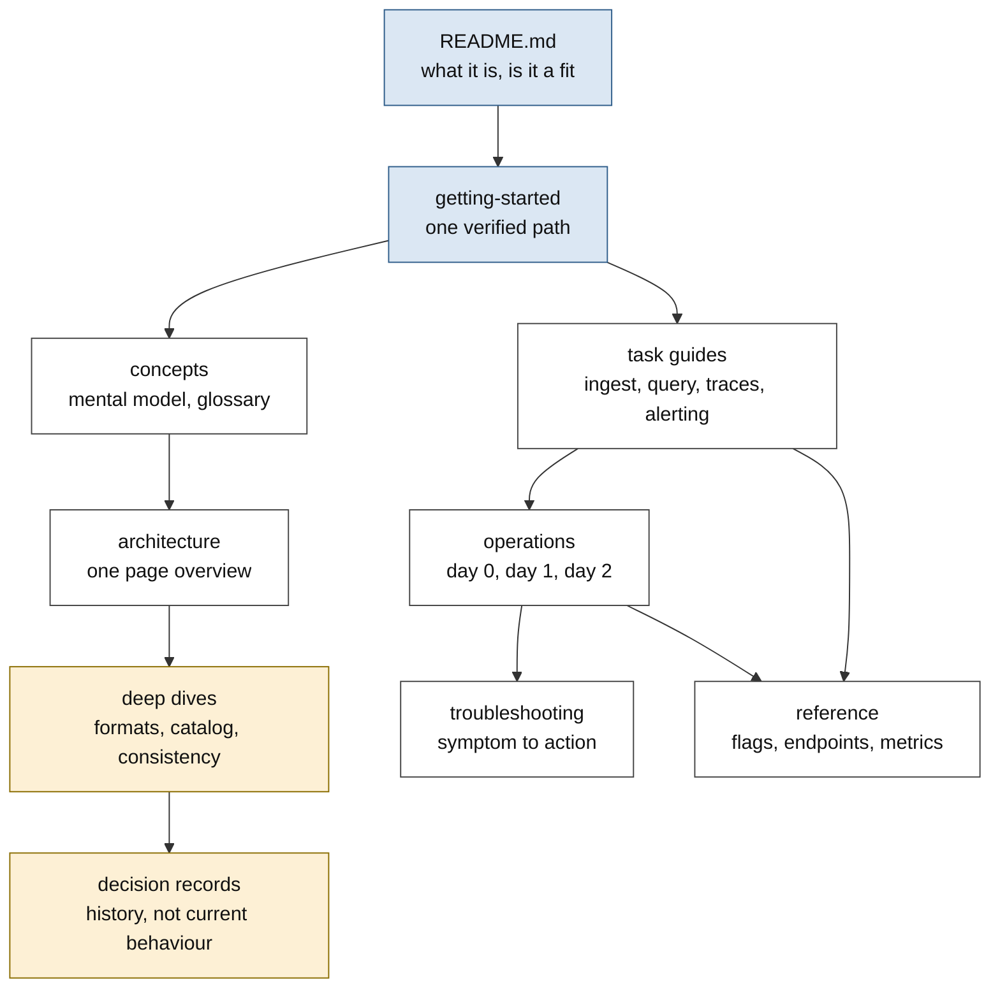

# ADR-1040: Documentation architecture, canonical vocabulary, and a docs gate

Status: Proposed

## Context

Ravel's documentation grew one feature at a time. Each shipped capability
added a section to whichever file was closest, and each decision record
added a cross-reference. The result is thorough and, in places, accurate,
but it is not a manual. An audit of the 36 user-facing files found the
following.

**No reader lane.** A new evaluator, an on-call operator, and a storage
expert all land on the same pages. The README carries the pitch, the
quickstart, a durability demo, storage configuration, cache configuration,
container image verification, and the documentation index. From "the
quickstart worked" the only onward pointer is `docs/guides/operations.md`,
which is 2392 lines with no introduction, no audience statement, and no
table of contents. Its first line is a flag table.

**Two files hold a third of the prose.** `docs/guides/operations.md`
(2392 lines) and `docs/query-engine.md` (2526 lines) are each larger than
the next four files combined. In the operations guide, two sections
account for 41% of the file: storage credential roles (526 lines) and
garbage collection with retention (458 lines). About 16% of the file is
material that belongs elsewhere: metric catalogs, cost accounting, key
layout, and one conceptual section on process disposability. The only
incident runbook in the file starts at 92% depth.

**The guarantees are buried.** `docs/consistency-model.md` is normative
for acknowledgement, visibility, and crash behaviour everywhere in the
repository. The four sections a reader comes for, acknowledgement,
visibility, read-your-write, and the crash matrix, total 54 of its 841
lines. Deletion and garbage collection mechanics take 489 lines, 58% of a
file whose title promises consistency.

**Claims outrun the code.** The README's support table offers Flight SQL
for metrics and logs. Flight SQL is behind a cargo feature that no
published image builds, so every reader who pulls an image and follows
that row fails. The same table's companion list says alerting stores
every rule transition as "immutable, queryable data". Alert transitions
are written, and no shipped query surface registers a table that can read
them. Two open issues collect more of the same: a quickstart SQL statement
against a table that does not exist, a status table describing a PromQL
subset the evaluator no longer has, sample output quoting a segment format
version the reader is told elsewhere is unsupported, and "later phases"
wording on capabilities that shipped. The entry path itself drifts: the
getting-started guide pins a container image version three releases behind
the one the compose file and the README use.

The pattern is not carelessness. It is that a capability's documentation
is written when the capability is designed, and nothing rereads it when
the feature gate, the image build, or the registration list changes
underneath.

**Nothing mechanical holds the line.** Two checks exist. One recomputes
the derived counts in a single generated block. The other executes the
README's commands, and it cannot run on macOS at all because it calls
`mapfile` under bash 3.2. Links, anchors, terminology, forbidden
provenance, orphaned pages, diagram validity, and index completeness are
checked by nobody. The measured cost of that: five dead anchors, three
version or count statements that contradict a sibling file, 15 of 127
decision records missing from their own index, and two documents reachable
from no page in the tree.

**Three visual languages.** The 25 SVGs in the tree fall into three
unrelated styles: a sans-serif house style with a light background panel,
a monospace style with accessibility roles and no background, and a
hand-drawn style whose font stack ends in Comic Sans. Only one of the
three sets `role="img"` and an `aria-label`. Six diagrams are documented
nowhere, and two are reachable only from decision records.

**One word, several meanings.** "Tier" names a cache layer, a
disaster-recovery level, a deployment role, and a competitor's ingest
layer. "Role" names a storage credential role, a process role, and an EC2
instance role, twice within one file. "Mode" names a process role, an
acknowledgement mode, and a store backend. "Part" names an L1 data object,
a catalog snapshot piece, and a multipart upload segment. There is no
glossary.

## Decision

### D1. Six reader lanes and one entry point

Documentation is organised by what the reader is trying to do, not by
which crate implements it. Six lanes, each with a stated audience:

| Lane | Question it answers | Where |
|---|---|---|
| Start | What is this, and should I use it? | `README.md` |
| Learn | How do I get it running and query it? | `docs/guides/getting-started.md` |
| Understand | What is the mental model? | `docs/concepts.md`, `docs/architecture.md` |
| Use | How do I ingest and query? | `docs/guides/` task guides |
| Operate | How do I deploy, run, and fix it? | `docs/guides/operations/` |
| Look up | What is the exact flag, endpoint, or metric? | `docs/reference/` |

Two further areas sit outside the manual and are labelled as such:
`docs/adrs/` holds decision history, and `docs/internal/` holds material
written for people who change Ravel rather than people who run it.

The README stops being a compressed manual. It keeps the pitch, the
support matrix, one quickstart, the durability demo, and a short
"is Ravel a fit" section. Storage configuration, cache configuration,
container image verification, and the guide list move into the lanes that
own them.

Files move only where the move buys comprehension:

- `docs/guides/operations.md` splits into `docs/guides/operations/`
  with four pages: configuration (day 0), deployment (day 1), maintenance
  (day 2), and troubleshooting. Material that belongs to another page
  moves there: metric catalogues to the observability guide, per-query
  cost accounting to the cost model guide, object key layout to the
  catalog contract, process disposability to the architecture overview.
  `docs/guides/operations.md` stays as a short index so inbound links keep
  working.
- `docs/consistency-model.md` keeps the guarantees and the crash matrix
  and leads with them. Deletion and garbage-collection mechanics move to
  `docs/deletion-and-gc.md`, which the consistency model links from the
  one sentence that is the actual guarantee.
- `docs/query-engine.md` keeps the engine contract. The endpoint
  descriptions inside it move to the HTTP API reference.
- `docs/guides/development.md`, `docs/guides/clickbench.md`,
  `docs/guides/clickbench-aws-runbook.md`,
  `docs/guides/coderabbit-runbook.md`, `docs/diagrams/README.md`, and
  `docs/reviews/` move to `docs/internal/`.

New pages, each of which answers a question the tree cannot answer today:
`docs/concepts.md`, `docs/guides/alerting.md`,
`docs/reference/http-api.md`, `docs/reference/cli.md`,
`docs/reference/metrics.md`, and the troubleshooting page above.

Frozen-format specs (`docs/segment-format.md`,
`docs/log-segment-format.md`, `docs/span-segment-format.md`,
`docs/object-store-contract.md`, `docs/catalog-and-mvcc.md`) stay where
they are. They are named by the doc map in `CLAUDE.md` and cited by 127
decision records, and moving them buys nothing a reader can feel.

### D2. A canonical vocabulary, with the aliases named

`docs/concepts.md` carries a glossary that is the single definition of
every Ravel term. Where the tree uses several words for one thing, one
wins:

| Concept | Canonical term | Not |
|---|---|---|
| A process's job in a deployment | mode (`all`, `gateway`, `query`, `maintain`) | tier, role |
| A storage credential's grant set | storage credential role | role |
| A cache layer | tier (RAM tier, disk tier) | level |
| A data object holding telemetry | segment (L0 segment, L1 segment) | part, file |
| A piece of a catalog snapshot | snapshot part | part |
| Publishing a catalog snapshot | fold | snapshot, compact |
| Making L1 segments from L0 segments | compaction | fold, merge |
| Deleting unreferenced objects | sweep, under garbage collection | reap, clean |
| An attribute key promoted to a native column | typed attribute column | declared column, typed column |
| How a write is acknowledged | acknowledgement mode (strict, buffered) | mode |

A word an operator will type stays as it is typed. `--mode`,
`--store`, and the IAM role names in the credential guide keep their
spelling, and the glossary names the alias so a reader who meets it in a
command is not lost.

Three genre words are used strictly: a **guide** teaches a task, a
**reference** is looked up, a **runbook** is followed during an incident.

### D3. A docs gate that fails the build

`scripts/check_docs.py` runs in CI's existing `doc-scripts` job and
locally through `make check-docs`. It has no dependency beyond the Python
standard library, matching the checkers already in `scripts/`. It checks:

1. Every relative link resolves to a file that exists, with correct case.
2. Every `#anchor` matches a heading in the target file, using GitHub's
   slug rules.
3. User-facing pages carry no repository archaeology: no source-file line
   references, no commit hashes, no issue or pull-request numbers, no
   "last verified against the code" stamps, no agent or AI language.
4. User-facing pages carry no unsupported superlatives, and no em-dash.
5. Terminology follows D2, for the terms D2 names and only those. The
   check is a qualifier rule, not a word ban: "role" is an error when it
   stands alone and correct in "storage credential role" or "EC2 instance
   role", and "tier" is an error outside the cache. Each rule carries the
   phrase that satisfies it, so the failure message says what to write.
6. Every SVG parses, has a `viewBox`, embeds no raster image, references
   nothing external, declares `role="img"` with an `aria-label`, and is
   referenced by at least one page.
7. Every page under `docs/` is reachable by link from `README.md` or
   `docs/README.md`.
8. Every decision record appears exactly once in the decision-record
   index, and every index row points at a file that exists.
9. Every SQL table name in a documented example is one the session
   registers. The registered names are read from the source constants,
   not copied.
10. Every cargo feature named in the support matrix exists in the
    workspace, and the matrix states whether the published image builds
    it. This is the check that would have caught the Flight SQL row.

The tree does not pass this on the day the checker lands, and a gate that
is switched on later is a gate that is never switched on. So the checker
ships with `scripts/docs_lint_baseline.txt`, a file listing every finding
that exists at that moment. The gate fails on any finding not in the
baseline. Each documentation task deletes the baseline entries it fixes,
and the final task deletes the file. The baseline's line count is the
epic's progress measure, and it reaches zero before the epic closes.

`scripts/check-readme-commands.sh` is fixed to run under bash 3.2, so the
README's commands can be verified on a developer's machine and not only in
CI.

### D4. Reference material is generated where the source exists

`docs/reference/ravel-server-flags.md` and
`docs/reference/ravel-cli-flags.md` are generated from the clap
definitions of the two binaries. One file per binary, because the
generator is a test inside each crate and a single shared file would give
two test targets one output to race on. A drift check fails when a
committed file no longer matches its command definition.

The check is a test, not a script in the `doc-scripts` job, because that
job installs no Rust toolchain by design. The test renders from the
command definition rather than executing a built binary: help output
wraps to terminal width, which would make the comparison
non-deterministic.

A hand-written flag table drifts on the first pull request that adds a
flag. The current one already has: it claims to be verified against the
server's configuration source and is missing 22 registered flags.

Endpoint and metric references are hand-written but pinned: every endpoint
row names the route it documents, and the docs gate checks that each
documented metric name appears in the source that emits it.

### D5. One visual language for diagrams

The house style is the sans-serif family already used by eleven diagrams:
`system-ui, sans-serif` text, a light background panel, blue for compute,
amber for immutable objects in the object store, green for
checksum-verified regions, dashed grey for anything not yet implemented.
Every diagram gains the `role="img"` and `aria-label` that only the
monospace family carries today, and an alt text and caption in the page
that embeds it.

The hand-drawn family is redrawn in the house style. Its font stack falls
back to Comic Sans, and it is used for a deletion lifecycle and an
ingest-admission window, which are not informal subjects.

New diagrams are drawn only where a picture beats two sentences or a small
table. The set to draw is fixed in the task plan, not left open.

### D6. No documentation site generator

The delivery surface is markdown rendered by GitHub, plus the existing
`docs/explorer/` page. Ravel ships no site configuration today, and adding
one turns a documentation task into a build-and-hosting project with its
own failure modes. Every check in D3 runs against the markdown source, so
"the documentation build passes" means the gate passes.

### D7. Decision records are history, not current behaviour

Decision records are not rewritten to read as user guides. They keep their
dates, their rejected alternatives, and their superseded status. The
documentation index says plainly that they record why a choice was made at
a point in time, and that the guides and specs are the current behaviour.

User-facing pages stop citing a decision record in place of an
explanation. A page that says what the system does needs no ADR number in
the sentence; the number belongs in a "background" link at the end of the
section, if it belongs at all.

## Rejected alternatives

**Adopt a documentation site generator (mkdocs, Docusaurus, mdBook).**
Rejected. It adds a build, a theme, a hosting target, and a second place
for links to break, and it moves the failure from "a reader sees a broken
link" to "the site fails to build". The repository has no site today and
GitHub renders the tree. The work here is the content and the gate; a site
can be added later against a tree that is already correct.

**Write a documentation style guide and rely on review.** Rejected. The
repository already has the rules in prose. They produced five dead
anchors, a three-release version drift on the entry path, and 15 decision
records missing from their own index. A rule no script enforces protects
nothing.

**Turn the docs gate on with no baseline and fix everything first.**
Rejected. It serialises the entire epic behind one task and gives the
prose tasks no protection while they are being written. The baseline lets
the gate land first, so every later task is checked as it lands.

**Move every specification into a new `docs/specs/` directory.**
Rejected. The frozen-format specs are named by the doc map in `CLAUDE.md`
and cited by 127 decision records. The move breaks all of that and changes
nothing a reader experiences, because they arrive by link, not by browsing
a directory.

**Split `docs/query-engine.md` and `docs/catalog-and-mvcc.md` into
chapters.** Rejected for this epic. They are implementer contracts, and
their readers arrive with a specific question and search within the file.
Their real defect is that user-facing endpoint material is mixed into
them, which D1 fixes by moving that material out.

**Delete the benchmark and integration runbooks.** Rejected. They are
accurate and useful to the people who run those workloads. They are
misfiled, not wrong, so they move to `docs/internal/`.

## Consequences

Inbound links change. Every page that moves leaves an index entry behind,
and the docs gate's link check proves nothing dangles, in this repository.
Links from outside the repository to a moved page will break, and the
epic accepts that: the tree is a pre-1.0 project and the moved pages are
`operations.md` sections that no stable URL should have pointed at.

`CLAUDE.md`'s doc map gains rows for the new pages. The frozen-format
rows do not change.

The docs gate makes documentation a blocking check on every pull request
that touches a page. That is the point, and it has a cost: a contributor
who adds a flag now updates the reference, and a contributor who renames a
heading now fixes the links to it. Both are cheaper than the reader
finding it.

The baseline file is a visible debt counter. If the epic stalls, the
remaining count is exact rather than a guess, and the gate still prevents
new findings.

`docs/internal/` is not a graveyard. It is indexed, and its pages keep the
same currency rule as the rest of the tree.
