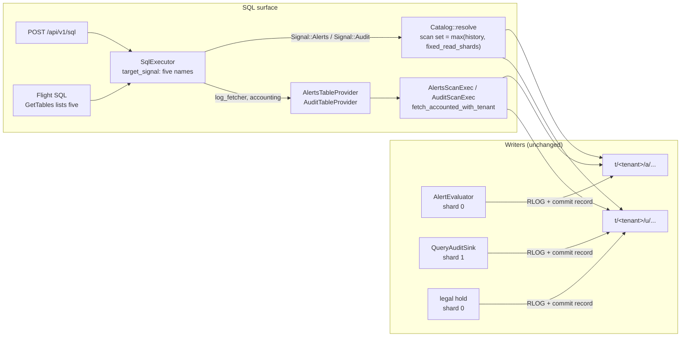

# ADR-1101: Register the `alerts` and `audit` SQL tables

Status: Accepted (2026-09-03)

## Context

Every alert state transition and every audited query is written to object
storage as an immutable RLOG record under its own signal prefix (`a` for
`Signal::Alerts`, `u` for `Signal::Audit`, ADR-0040). ADR-0043 decision 7
said those records would be readable through two SQL tables built on the
`logs` table's provider, pushdown, and scan pattern. The tables were built:
`AlertsTableProvider` and `AuditTableProvider` in `crates/ravel-sql`, each
with a schema module, a widen-only pushdown extractor, a scan leaf that
fetches through the accounted, tenant-checked `LogSegmentFetcher` funnel,
erasure filtering, a Flight distributed-plan sibling, and passing provider
tests.

No production path constructs either provider. `SessionTable` has three
variants, `build_session` registers exactly the one table a query targets,
chosen from those three, and the executor's `target_signal` maps a `FROM`
clause onto `samples`, `logs`, or `spans` only.
A query that names `alerts` or `audit` falls into the "no real table"
default, resolves a metrics snapshot, and fails at planning with a
table-not-found error. README.md, docs/README.md, docs/guides/alerting.md,
docs/guides/caching.md, and docs/reference/http-api.md all state the gap out
loud. Issue #128 describes it.

This is the same shape the `spans` table had before commit 7f25d0fb: a
provider, a scan, and a fetcher, all tested in isolation, none reachable.
That commit is the precedent this ADR follows.

A second gap sits under the first. The writers pin their shards by constant:
alerts on shard 0 (`ALERT_SHARD`, `services/ravel-server/src/alerting.rs`),
legal-hold audit records on shard 0 (`AUDIT_HOLD_SHARD`) and query-audit
records on shard 1 (`QUERY_AUDIT_SHARD`, both in `crates/ravel-maintain`).
`Catalog::resolve` derives its scan set from the (tenant, signal)
shard-generation history (ADR-0052 section 4), and for a signal with no
provisioning record that is the implicit generation 0 at the process
`--shards` value. `ravel-cli provision adopt` provisions metrics, logs, and
spans only, so alerts and audit always take that implicit path. On a
`--shards 1` deployment, an `audit` query would list shard 0, find the
legal-hold records, and never list the query-audit shard: an exact-looking,
silently incomplete answer. Registering the table without closing this
would ship a correctness bug behind a feature.

Nothing here touches a frozen format. The RLOG layout, the object key
layout, the `Signal` enum's variants and prefixes, and the commit record are
unchanged. The format-change procedure does not apply.

## Decision

1. **Register `alerts` and `audit` as the fourth and fifth SQL tables**,
   by extending the spans wiring one arm at a time rather than adding a
   mechanism:
   - `crates/ravel-sql/src/session.rs`: `ALERTS_TABLE = "alerts"`,
     `AUDIT_TABLE = "audit"`, `SessionTable::Alerts(Arc<AlertsTableProvider>)`
     and `SessionTable::Audit(Arc<AuditTableProvider>)`. `build_session`
     registers exactly the one table the query targets, as it does today.
     Neither table registers a scalar UDF: every predicate their pushdown
     extractors accept is a plain column comparison or an `attrs['k']`
     subscript, which the map-field planner already serves.
   - `crates/ravel-sql/src/executor.rs`: `TargetSignal::Alerts` and
     `TargetSignal::Audit`, mapped to `Signal::Alerts` and `Signal::Audit`.
     `target_signal` counts five names; naming two or more of
     {`samples`, `logs`, `spans`, `alerts`, `audit`} is `CrossSignalQuery`,
     rejected before any catalog listing. The "no real table" default stays
     `Metrics`. Both plan arms construct their provider over the resolved
     snapshot with the query's `tenant_hash`, the executor's existing
     `log_fetcher` (the same `LogSegmentFetcher`, cache attached, that the
     `logs` table reads through), and the query's `QueryAccounting`.
     `empty_snapshot_table` gains the same two arms. The postings
     `__name__` filter stays metrics-only. Cost estimation reuses
     `estimate_logs_cost`: the fetch funnel is identical, so the estimate
     is identical, and a renamed copy would only invite drift.
   - Both transports close through the shared `plan_pinned`, so
     `POST /api/v1/sql` and Flight SQL gain the tables from one change.
   - Row contract: `alerts` exposes raw history, one row per state
     transition, never a folded "current state" row. Beside the promoted
     fields, the table carries each record's write identity as three
     non-null columns stamped from the commit record of the object it was
     read from: `writer_id` (Utf8, the evaluator's uuid), `writer_epoch`
     (UInt64), and `writer_seq` (UInt64). The evaluator's own fold orders
     records by `(ts_ns, epoch, seq)` because two evaluators can overlap
     briefly at a lease handover and write the same `alert_id` at the same
     `ts_ns`; the table exposes the same keys plus `writer_id`, so a SQL
     fold has a total order and can never return two "current" rows for
     one alert. Current state is a query over that history: the row that
     sorts first per `alert_id` under `ts_ns DESC, writer_epoch DESC,
     writer_seq DESC, writer_id DESC`, which carries that transition's
     `state`, `generation`, labels, and annotations together:
     `SELECT * FROM (SELECT *, ROW_NUMBER() OVER (PARTITION BY alert_id
     ORDER BY ts_ns DESC, writer_epoch DESC, writer_seq DESC, writer_id
     DESC) AS rn FROM alerts) WHERE rn = 1` (`row_number` is an admitted
     window function). A rule that reads `SELECT * FROM alerts`
     (alerts-on-alerts, ADR-0043) sees every transition, which is what the
     generation guard in ADR-0040 decision 4 counts over. `audit` likewise
     exposes one row per record.
   - `crates/ravel-sql/src/flight/metadata.rs`: `CommandGetTables` lists
     all five registered tables with their public schemas. This is static
     catalog metadata built from the five schema functions
     (`public_schema`, `logs_schema`, `spans_schema`, `alerts_schema`,
     `audit_schema`), independent of the per-query session, which still
     registers exactly one table. It lists only `samples` today, which
     under-reports `logs` and `spans` as well; the Flight surface should
     discover what it can query.

2. **A read-side shard floor for fixed-shard signals.** `Signal` gains
   `pub const fn fixed_read_shards(self) -> u32`: `Alerts => 1`,
   `Audit => 2`, every other signal `0`. `ravel-catalog`'s three scan-set
   derivations (`resolve_fanout`'s crossover decision,
   `list_window_by_prefix`, and `list_window_bounded`) take the maximum of
   `max_scan_count_over_range(..)` and that floor, through one helper in
   `provisioning.rs` so the three cannot disagree. The writer constants
   pin themselves to the floor with compile-time assertions
   (`const _: () = assert!(QUERY_AUDIT_SHARD < Signal::Audit.fixed_read_shards())`
   and the same for `AUDIT_HOLD_SHARD` and `ALERT_SHARD`), so moving a
   writer to a shard the reader would not scan fails the build rather
   than the query. The floor is a floor, never a cap: a provisioning
   record or `--shards` above it widens the scan exactly as today, so
   spreading a writer across more shards later changes nothing on the
   read side.

3. **Documentation moves in the same change as the code.** README.md
   ("What it does not do", "Who should wait", the support matrix rows, and
   the registered-tables sentences), docs/README.md, docs/guides/alerting.md
   (the bold paragraph becomes a section on querying alert history, with a
   fold-to-current-state example), docs/guides/query.md (five tables, the
   `alerts` and `audit` column lists, and the note that a query over `audit`
   is itself audited), a new docs/guides/audit.md (what is recorded, the
   attribute conventions of the `query` and `legal_hold` kinds, the two
   shards and their retention, worked queries), docs/reference/http-api.md,
   docs/guides/caching.md (alert and audit reads are cached like logs, since
   they share the fetcher), docs/guides/traces.md, docs/query-engine.md,
   docs/explorer/map.js, CHANGELOG.md, and PROGRESS.md. Decision 2 also
   notes the floor in docs/catalog-and-mvcc.md beside the scan-set rule.

### Data flow after this ADR

## Rejected alternatives

- **A dedicated HTTP endpoint for alert history** (`/api/v1/alerts`).
  Rejected: ADR-0033 chose one SQL endpoint with per-table routing from the
  `FROM` clause so that no new signal needs a new protocol, and ADR-0043
  decision 7 already committed alert history to that surface. A second
  endpoint would duplicate auth, window handling, admission, accounting,
  and audit for one table, and would leave Flight SQL without it.
- **Exposing alert history through PromQL** (an `ALERTS` series in the
  Prometheus style). Rejected: alert records carry a free-text body, an
  arbitrary label map, and annotations, and are fold-to-latest by
  `alert_id`; that is a row shape, not a sample shape. The `alerts` table
  answers "current state per alert" with the fold query in decision 1,
  which PromQL cannot express over a non-numeric record.
- **Capping the audit scan set at the two fixed shards** instead of
  flooring it. Rejected: a cap hides data the moment a writer spreads
  across more shards, and the provider docs already say the provider must
  never bake a shard number in. On a `--shards 1` deployment the floor adds
  one LIST per `audit` query, the LIST that reaches the query-audit shard
  and returns its records; on any wider deployment it adds nothing. It can
  never omit a record.
- **Provisioning the alerts and audit signals** (extend `provision adopt`
  to write records for them at their fixed counts) instead of a floor.
  Rejected: it makes the read side correct only on tenants an operator
  remembered to re-provision, and every existing tenant would be wrong
  until then. The floor is a property of the signal, so it holds for every
  tenant, provisioned or not, with no operator action.
- **Folding alerts and audit into the catalog** in this epic. Rejected for
  now: it is a maintenance-side change with its own interactions (the
  query-audit retention driver already compacts and sweeps shard 1 outside
  the folded path), and the live listing costs one bounded LIST per shard
  per query, which is the recent-hours cost a logs query already pays. A
  follow-up can add it if audit volume makes the LIST the dominant term.

## Consequences

Target behavior once the epic's tasks land; none of it is in a shipped
build while this ADR is Proposed.

- `POST /api/v1/sql` and Flight SQL serve five tables. The one-signal-per-
  query rule extends to five names; naming two is still a 400 before any
  listing.
- A tenant can read its own audit trail, including the `query.text` of
  every retained SQL statement it ran and the `hold.scope` key prefixes of
  its own legal holds. Retention differs by shard: query-audit records are
  compacted and age-swept on a 90-day window by the maintain process, while
  legal-hold records are never deleted (docs/guides/operations/
  configuration.md, "The audit prefix has two shards"). Resolution is per
  tenant hash, so this is a tenant reading its own records, never another
  tenant's. A query over `audit` writes one more query-audit record, like
  any other query; the docs say so.
- Alert and audit reads share the logs fetcher, so they are cached by the
  same RAM and disk tiers and accounted through the same funnel. The
  bounds that hold for a `logs` query hold here unchanged: segment
  admission caps the resolved snapshot (`max_segments`, ADR-0073), every
  emitted batch grows the query's memory reservation so an over-budget
  scan fails with `ResourcesExhausted` at the tenant's pool ceiling, and
  the request deadline bounds wall time. The bytes-scanned budget (#41)
  and the LIMIT fetch-stop hint (#362) are missing on all four RLOG and
  RSPAN scan loops alike; those issues now have two more live callers and
  are unchanged in scope. Exposure is not gated on them: alert volume is
  one record per transition and audit volume is one record per statement,
  both far below the log volume the same scan loop already serves.
- Neither signal is folded or compacted by the maintain loop
  (`FOLD_SIGNALS`, `MAINTAINED_SIGNALS` are unchanged). An `alerts` query
  lists commit records live for its window; alert volume is one object per
  transition, so the listing stays small. The query-audit shard keeps its
  own 90-day compaction and sweep.
- `Signal::fixed_read_shards` is a method on an existing enum, not a new
  variant, prefix, or key: no format version moves, and no dual-reader
  window exists.
- ADR-0043 decision 7 and the "not this ADR's work" line in ADR-0040's
  consequences are now delivered.
