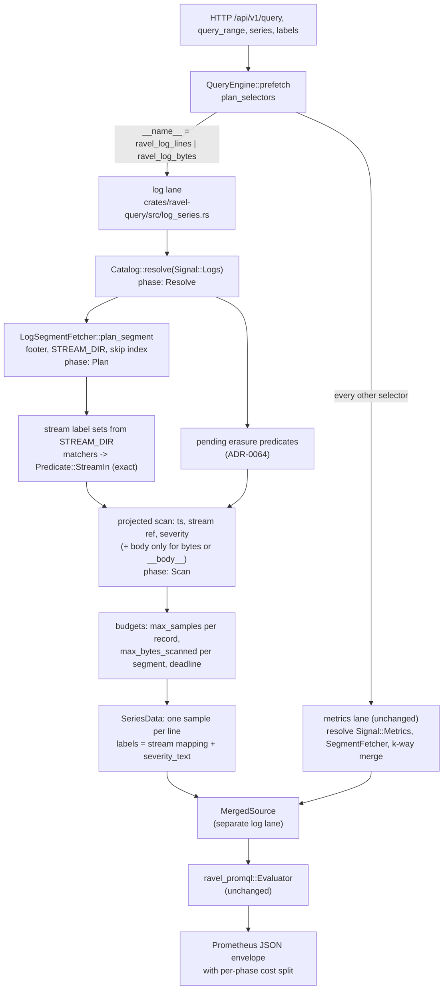

# 1103. PromQL over logs: `ravel_log_lines` and `ravel_log_bytes`

Status: accepted

## Context

Issue #1103. README.md:63-65 states that logs are queryable over SQL only
and that there is no PromQL surface for logs. Both halves are true today:

- The PromQL lane resolves `Signal::Metrics` at every call site.
  `QueryEngine::prefetch` (`crates/ravel-query/src/engine.rs:878-1228`)
  calls `resolve_bounded` (`engine.rs:1332-1364`), which passes
  `Signal::Metrics` to `Catalog::resolve_pruned_with_generations`, and the
  distributed branch (`engine.rs:1513-1524`) does the same. The series
  discovery path behind `/api/v1/series`, `/api/v1/labels`, and
  `/api/v1/label/{name}/values` (`resolve_series_inner`,
  `engine.rs:694-786`) shares that resolve. docs/query-engine.md:962-967
  documents it: "the PromQL engine's own fetch/federation flow drives
  `Signal::Metrics` only today."
- The evaluator is signal-agnostic. `ravel_promql::SeriesSource`
  (`crates/ravel-promql/src/source.rs:209-279`) takes bare label matchers
  and a window and returns `SeriesData { labels, samples }`; a metric name
  is only a `__name__` matcher that `build_matchers`
  (`crates/ravel-promql/src/eval.rs:1810-1827`) adds when the selector
  carries one. Aggregations, binary operators, and every `_over_time`
  function operate on materialized `LabelSet` and `Sample` values with no
  reference to storage or signal.
- The logs read path already exists below the engine. `LogSegmentFetcher`
  (`crates/ravel-query/src/log_fetcher.rs`) plans a segment from its
  footer, STREAM_DIR, and skip index, prunes blocks by time range, stream
  membership, and bloom, and decodes an RLOG v4 block by column
  (`ColumnSelection`; `narrow_projection_decodes_only_wanted_columns`,
  `log_fetcher.rs:6079-6121`). It reports requests and bytes through
  `PhaseAccounting` (`crates/ravel-query/src/phase_accounting.rs`) under
  the Plan and Scan phases, exactly as ADR-0044 requires.
- A log line's stream identity is its resource attributes plus scope
  name, version, and attributes (`log_stream_id`,
  `crates/ravel-types/src/logstream.rs:152-174`). Per-record attributes
  never enter identity. Every record carries the canonical preimage of its
  stream attributes (`stream_attrs_bytes`,
  `crates/ravel-logseg/src/record.rs:56-69`), so a scan can recover a
  record's stream labels without a second lookup.
- The SQL `logs` table (ADR-0033) exposes resource, scope, and record
  attributes merged into one `attrs` map with record-wins precedence. That
  merge is why ADR-0033 had to withdraw its stream-level prune: a
  predicate over the merged column cannot be answered from STREAM_DIR
  alone. The lesson carries into this design.
- Grafana already talks to Ravel as a Prometheus datasource (ADR-0039).
  Every dashboard built on that datasource can only see what the PromQL
  lane returns.

The gap is not a parser or an evaluator. It is that no series ever reaches
the evaluator from the logs signal.

## Decision

Expose the logs signal to the existing PromQL engine as two reserved
metric names whose series are derived at query time from RLOG objects.
No new endpoint, no new query language, no new persistent format.

### 1. Two reserved metric names, one sample per log line

`ravel_log_lines` and `ravel_log_bytes` are reserved metric names. A
vector selector whose `__name__` matcher is an equality (`=`) on one of
them is a log selector. The engine answers it from the logs signal with
one sample per matching log record:

| Metric | Sample timestamp | Sample value |
|---|---|---|
| `ravel_log_lines` | the record's `ts_ns` | `1.0` |
| `ravel_log_bytes` | the record's `ts_ns` | the record body's length in bytes, as `f64` |

Samples are sorted ascending by timestamp. Two records with the same
timestamp in the same series produce two samples with equal timestamps;
neither is dropped and neither is nudged. Among samples sharing a
timestamp the order is by `value.to_bits()` ascending, so every
order-sensitive consumer sees the same sample: `last_over_time` returns
the greatest value bits, which is exactly what instant selection under
`pick_sample` picks, and a query's answer does not depend on the order
records were decoded in. For `ravel_log_lines` every value is `1`, so
the secondary key never changes a result. This is the definition that
makes every `_over_time` function mean "per line": `count_over_time` is
the line count, `sum_over_time(ravel_log_bytes[5m])` is the byte total,
`avg_over_time`, `max_over_time`, and `quantile_over_time` over
`ravel_log_bytes` are per-line statistics. Instant selection of a log
series picks one sample under the evaluator's existing tie rule
(`pick_sample`, `eval.rs:1758-1783`, greatest `value.to_bits()`), so a
bare `ravel_log_lines{...}` instant query yields `1` for every series
with a line inside the lookback window.

`SeriesData`'s documented contract (`source.rs:17-38`) says implementors
SHOULD deliver at most one sample per `(series, ts)` because the metrics
merge resolves duplicates under the commit total order. Log series carry
no such duplicates: two equal-timestamp samples are two different log
records, not two versions of one sample. The contract is amended to say
so, and the evaluator's range functions are pinned by a test to count
equal-timestamp samples individually.

Counter semantics are not redefined. `rate(ravel_log_lines[5m])` is the
PromQL `rate` of a series whose values are all `1`: `0` when the range
holds samples at two or more distinct timestamps, and no value at all
(the series is omitted) when it holds one sample or only samples sharing
one timestamp, since a zero-duration window has no defined rate. The
PromQL spelling of lines per second is
`count_over_time(ravel_log_lines[5m]) / 300`.
The query guide documents this next to the metric definitions.

### 2. Labels: the stream identity under the metrics mapping, plus `severity_text`

The label set of a log-derived series is built from the record's stream
attributes and its severity, in this order, first writer wins on a
collision:

1. `__name__`: the reserved metric name.
2. `job` and `instance`, exactly as the metrics ingest path derives them
   (docs/guides/ingest.md "Job and instance labels"): `job` is
   `service.namespace/service.name` when the resource has a namespace,
   else `service.name`; `instance` is `service.instance.id`. The three
   source attributes do not also appear under their own names.
3. `otel_scope_name` and `otel_scope_version` when the scope name or
   version is non-empty, and `otel_scope_<key>` for every scope
   attribute, where `<key>` is the attribute key sanitized by the same
   rule step 4 applies to resource keys (so `http.method` becomes
   `otel_scope_http_method`). These are the OpenTelemetry-to-Prometheus
   compatibility names, so a dashboard that already uses them for metrics
   uses them for logs unchanged.
4. Every remaining resource attribute, under its key sanitized by the
   metrics rule: the first character must match `[A-Za-z_]` and every
   later character `[A-Za-z0-9_]`; each disallowed character is rewritten
   to `_` in place (`sanitize_label_name`,
   `crates/ravel-otlp/src/normalize.rs:1849-1890`). There is no
   allowlist. In PromQL a series is its returned label set, so every label
   the mapping drops merges the streams that differed only in it; an
   allowlist would merge more streams and hide exactly the dimension a
   user filters on. The stream attributes are already stored once per
   stream, so exposing all of them adds no ingest or storage cardinality,
   and the number of series one query returns is bounded by the
   distinct-series budget (decision 4).
5. `severity_text`: the record's severity text when non-empty. It is the
   only per-record field that becomes a label. It has a small value set in
   practice, it is the dimension every logs dashboard groups by, and it
   is exactly matched on the scan through `Predicate::Equals` on
   `FieldSel::SeverityText`, which the block bloom accelerates. The format
   does not constrain its values; a tenant that writes a distinct severity
   per record gets one series per record, and the distinct-series budget
   of decision 4 rejects that query the same way it rejects a metrics
   selector over too many series.

Values: strings verbatim; integers, doubles, and booleans in the string
form the SQL `attrs` map already gives them (`attr_value_to_string`,
`crates/ravel-sql/src/rlog_attrs.rs`, moved to `ravel-logseg` so both
surfaces share one function); bytes, lists, and maps are not exposed as
labels. Keys that sanitize to the same name, to a name an earlier step
already wrote (`job`, `instance`, an `otel_scope_*` name), to
`severity_text`, or to any name beginning with `__` (`__name__`, the
matcher-only `__body__`, and the rest of Prometheus's reserved internal
namespace) are dropped in canonical byte order after the first. The rule
is deterministic and documented; it is not an error.

Two streams whose attributes map to the same label set (for example,
streams differing only in an attribute with a list value, or only in two
keys that sanitize to one name) merge into one series. This merge is
intentional and exact: their samples interleave by timestamp, none are
dropped, and `count_over_time` over the merged series counts the lines of
every merged stream. A caller that needs to tell such streams apart adds
the distinguishing attribute in a form the mapping exposes.

Per-record attributes are not labels. This is what keeps the stream-level
prune sound where ADR-0033's could not be: a label matcher on a log
selector is decided entirely by the stream's own attributes, so the
engine decodes each candidate object's STREAM_DIR, builds the label set
per stream once, evaluates the selector's stream-level matchers against
it, and hands the scan a `Predicate::StreamIn` naming exactly the
matching streams. Stream-level means every matcher except those on
`severity_text` and `__body__`; decision 3 applies those two per record,
after decoding.
That is exact, not an over-approximation, and it costs the footer probe
plus one STREAM_DIR section read per candidate object, the same reads
`LogSegmentFetcher::plan_segment` already makes (an object below the
block-range threshold is read whole once, as the fetcher already does for
small objects); discovery never reads block data.

### 3. Matchers: stream labels, severity, and `__body__`

- A matcher on any label from decision 2 other than `severity_text`
  resolves at the stream level as above, with all four operators (`=`,
  `!=`, `=~`, `!~`) and PromQL's fully anchored regex semantics.
- `severity_text="..."` and `severity_text!="..."` become exact content
  predicates on the scan. `=~` and `!~` on `severity_text` are evaluated
  per decoded record.
- `__body__` is a matcher-only pseudo-label. `__body__="s"` and
  `__body__!="s"` compare the whole body; `__body__=~"re"` and
  `__body__!~"re"` apply PromQL's anchored regex to the whole body. Several
  `__body__` matchers AND together. `__body__` never appears in a returned
  label set, and it is never part of series identity. In v1 a `__body__`
  matcher is evaluated per decoded record with no block-level pushdown; a
  follow-up may extract a literal word from a regex into
  `Predicate::HasWord` for bloom pruning, which is sound because the bloom
  is a prune and the record check stays.
- `__name__` with any operator other than `=`, and a selector with no
  `__name__` matcher at all, never see log series. `{job="api"}` keeps its
  Prometheus meaning over metrics; `{__name__=~"ravel_log.*"}` matches
  metrics only. Log series are addressed by exact name and nothing else,
  so a query that names no log metric never pays for a logs resolve.

### 4. Engine integration

`QueryEngine::prefetch` partitions the selector plans from
`plan_selectors` into metrics selectors and log selectors. Metrics
selectors take the existing path unchanged. Each log selector is
answered by a new `crates/ravel-query/src/log_series.rs` module that:

1. resolves the tenant's `Signal::Logs` snapshot for the selector's
   padded window through the same `resolve_bounded` shape the metrics
   path uses, with the same `min_commit_token` handling, under the
   Resolve phase;
2. applies the snapshot's pending erasure predicates (ADR-0064,
   `snapshot_pending_erasure_predicates`,
   `crates/ravel-query/src/erasure.rs:366`) to every decoded record
   before it becomes a sample, the way `crates/ravel-sql/src/logs_scan.rs`
   applies them to the SQL `logs` table, and never takes a path that
   skips a record's erasure check;
3. plans and scans each resolved segment through `LogSegmentFetcher`
   under the Plan and Scan phases, projecting only the columns the
   selector needs: timestamp, stream reference, and severity always; body
   only when the metric is `ravel_log_bytes` or a `__body__` matcher is
   present; record attributes only when a pending erasure predicate names
   them, since the erasure check in step 2 reads record attributes
   (`retain_log_records`, `crates/ravel-query/src/erasure.rs:335`), the
   same widening `crates/ravel-sql/src/logs_scan.rs` applies; never
   otherwise;
4. charges every decoded record against the existing samples budget
   (`EngineConfig::max_samples`, default 10,000,000, the "Samples
   materialized" row in docs/guides/query.md), every distinct label set
   against the existing series budget (`EngineConfig::max_series`,
   default 10,000, the "Distinct series" row), and every fetched segment
   against both `max_bytes_scanned` and the object-store request budget
   `max_s3_requests` (ADR-0075, `EngineConfig::max_s3_requests`), checked
   after each segment exactly as `fetch_all_samples_and_histograms`
   (`engine.rs:1425-1433`) checks them, and honors the query deadline
   between segments. Every one of these budgets is the query's single
   budget, shared by all of the query's selectors, metrics and log alike:
   the log lane receives the allowance remaining after the selectors
   evaluated before it and its consumption counts against the selectors
   after it, its resolved segments count against `max_segments`, and its
   requests and bytes accumulate in the same per-query accounting the
   metrics lane charges. Two log selectors in one query cannot each spend
   a full `max_samples`. Exceeding a budget is the same typed error and
   the same HTTP 422 the metrics path returns;
5. returns `SeriesData` values that `MergedSource` holds in a separate
   log lane, consulted only for a log selector's matchers, so a nameless
   selector elsewhere in the same query cannot match a log series.

`resolve_series_inner` takes the same split for `/api/v1/series`,
`/api/v1/labels`, and `/api/v1/label/{name}/values`: a `match[]` that is
a log selector contributes the label sets of the log series present in
the window (a projected scan that fetches the body only when a `__body__`
matcher is present, so body filters apply to discovery exactly as to
queries, under the same budgets). `/api/v1/label/__name__/values` adds
both reserved names explicitly, not by resolving series: when the
request carries no `match[]`, or when at least one `match[]` is a log
selector. A request whose `match[]` selectors name only metrics gets
metrics names only.
`/api/v1/metadata` returns an entry for each reserved name (`type`
`gauge`, `help` stating the sample definition, `unit` empty and `bytes`
respectively) so Grafana's metric browser offers them.

### 5. Distributed fan-out and federation in v1

The log lane reads object storage on the coordinator through
`LogSegmentFetcher` regardless of `--distributed-query`. The queryfrag
lane for logs (`Distributed::fetch_logs`,
`crates/ravel-query/src/distrib/mod.rs:442-573`) exists and is the
follow-up target; wiring it is a separate issue, not a v1 deliverable,
because the local path is correct in both modes and the follow-up
changes cost, not results.

When a federation context is configured, log selectors are answered from
the local cluster only and the response carries a warning annotation
naming the reserved metric as local to this cluster. A partial answer is
visible, never silent.

### 6. Documentation

README.md's "What it does not do" entry keeps its true clauses (no
LogQL, no TraceQL, no trace-by-ID endpoint, no Jaeger or Tempo API) and
drops "no PromQL surface for logs"; the support matrix's PromQL row lists
logs. docs/guides/query.md gains a "PromQL over logs" section with the
two metric definitions, the label mapping, `__body__`, the `rate`
note, and the budgets that apply. docs/guides/ingest.md:313-319 drops
"PromQL does not query logs". docs/query-engine.md's Flow section and
docs/architecture.md name the log lane.

## Rejected alternatives

- **A LogQL parser and evaluator.** A second grammar and a second
  evaluator for a surface that, once logs are series, PromQL already
  covers: stream selectors are vector selectors, LogQL's
  `count_over_time` is PromQL's `count_over_time`, its `bytes_over_time`
  is `sum_over_time(ravel_log_bytes[...])`, `sum by` is `sum by`.
  LogQL's line pipeline (`|=`, `| json`, `| line_format`) is a log
  browsing surface, not a metrics surface, and out of scope for a
  Prometheus datasource. Rejected: it would not make a single existing
  dashboard work.
- **Separate `/api/v1/logs/query` and `/api/v1/logs/query_range`
  endpoints, or a `signal=logs` query parameter.** A second base URL or a
  datasource-level custom parameter can reach them from Grafana, but a
  single expression can then never combine log-derived and metric series
  (`errors / requests`), and a bare `{job="api"}` selector would mean
  metrics on one endpoint and logs on the other. Rejected: PromQL's own
  namespace mechanism is the metric name, and using it costs nothing.
- **Pre-bucketed samples (one sample per second or per step, value =
  count).** Bounds the sample count but is an approximation: a window
  boundary inside a bucket miscounts the boundary bucket, and
  `count_over_time` counts buckets, not lines. Rejected under the
  exactness invariant; the samples budget bounds cost instead, loudly.
- **One sample per distinct timestamp, value = number of lines at that
  timestamp.** Exact for `sum_over_time`, but `count_over_time` stops
  meaning lines the moment two lines share a timestamp, which
  millisecond-precision log sources do constantly, and every per-line
  statistic over `ravel_log_bytes` becomes a per-timestamp aggregate.
  Rejected: it moves the footgun onto the function everyone reaches for.
- **Loki-style `rate()` for log metrics (lines per second).** Redefines a
  PromQL function by signal. Rejected: exact PromQL semantics by default,
  and the PromQL spelling is one division away.
- **Record attributes as labels.** Unbounded series cardinality per
  query, and it reintroduces the merged-attribute semantics that made
  ADR-0033's stream prune unsound. Rejected for v1; a follow-up can add
  matcher-only pseudo-labels for record attributes the way `__body__`
  works, without touching series identity.
- **Materialize log-derived metrics at ingest.** A rollup, which the
  README promises Ravel does not do; a new persistent format; and every
  label set and body filter would have to be decided at write time.
  Rejected.
- **Scan through the SQL `logs` table (DataFusion) instead of
  `LogSegmentFetcher`.** The `sql` feature is optional and the PromQL
  lane must work in the default build; and the table's merged `attrs`
  column is exactly the semantics decision 2 avoids. Rejected.

## Consequences

- Every Grafana dashboard on a Ravel Prometheus datasource can chart log
  volume, error rate, and byte volume per stream, and compose them with
  metrics, today. A `ravel_log_lines`-derived alert rule works through the
  existing PromQL alerting path with no new plumbing.
- The names `ravel_log_lines` and `ravel_log_bytes` are reserved. A
  metric ingested under either name is unreachable by exact name through
  PromQL, since the log lane answers an exact `__name__` match; a regex
  or negative `__name__` matcher still reaches it on the metrics lane,
  because decision 3 routes on exact equality only. Ingest does not
  reject the names in v1; the query guide lists them as reserved.
- A log selector costs one logs-signal resolve plus, per resolved
  segment, one plan (footer, STREAM_DIR, skip index) and one projected
  scan. The reported per-phase split makes that attributable in one
  query, per the measurement rules in CLAUDE.md. A wide window over a
  chatty tenant hits the samples budget and gets a 422 that names it,
  not a slow silent answer.
- The `SeriesData` contract gains a documented exception for log series
  (equal timestamps allowed, each a distinct record), and the evaluator's
  range functions are pinned to that behavior by test.
- Follow-ups, each its own issue linked from this epic: the queryfrag
  lane for log selectors under `--distributed-query`; `__body__` literal
  extraction into `Predicate::HasWord` for bloom pruning; matcher-only
  pseudo-labels for record attributes; federation of log selectors. The
  SQL `logs` scan's missing bytes budget (#41) is unchanged by this ADR,
  which enforces the budget on the PromQL log lane only.

## Diagram

## Amendment 2026-09-06 (issue #1202): `__body__` literal bloom pruning

The follow-up decision 3 anticipated ("extraction into `Predicate::HasWord`
for bloom pruning") has landed, for the subset of `__body__` matchers a
literal can be proven a superset of: an equality matcher, and an anchored
regex matcher whose pattern has a token-bounded mandatory literal run. A
bare `.*word.*` regex, and any pattern with a `+`-quantified character, are
deliberately not extracted -- token matching is not a superset of substring
matching, so pushing an unproven literal as a bloom-pruning `HasWord` could
drop a matching row. The per-record `__body__` check is unchanged and still
runs on every decoded record; the extracted literal only prunes blocks
before decode, it never replaces that check.
