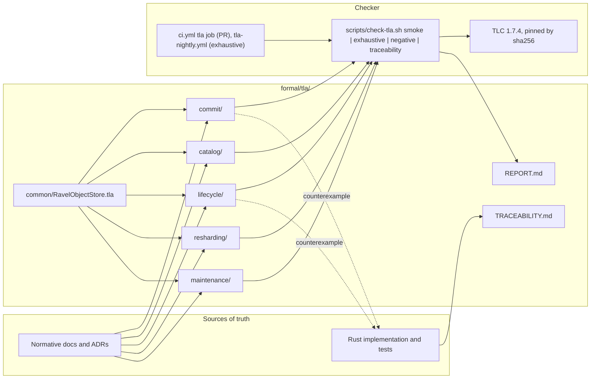

# ADR-1113: TLA+ verification suite for the commit, catalog, lifecycle, resharding, and maintenance protocols

Status: Proposed

## Context

Ravel's correctness rests on a handful of coordinator-free protocols over
an S3-compatible object store: a two-object commit serialized by
`CreateIfAbsent`, a catalog whose only mutable object is a HEAD published
by version CAS, a deletion lifecycle gated by horizons and HEAD
reachability, a generation-versioned shard history under CAS, and a
maintenance fleet that partitions work by rendezvous over heartbeats.
Each one is argued correct in prose (docs/consistency-model.md,
docs/catalog-and-mvcc.md, docs/deletion-and-gc.md, and the decision
records that shaped them) and pinned by deterministic Rust tests over
`MemoryStore` and `FaultStore`. Nothing checks the interleavings the
prose does not mention.

A reconnaissance of the tree at bfae457a (five read-only passes, one per
protocol, recorded in formal/tla/RECONNAISSANCE.md) found the prose and
the code in agreement on the core transitions, and found the following
places where they are not, or where a safety argument rests on a premise
no code enforces. These are the interleavings a model checker is for.

| Area | What the reconnaissance found |
|---|---|
| Commit | `docs/ingest.md` says the data PUT is `Overwrite`; the code uses `CreateIfAbsent`. Multi-shard partial commit is reported only for logs (`LogWriteError::PartialWrite`); metrics and spans drop sibling tokens. An acknowledgement timeout drops the join while the flush keeps running, so a commit can land after the client received an error; no crash-matrix row covers it. A commit-token query over a tombstoned bucket returns success with zero segments, which docs/consistency-model.md does not list among the outcomes. |
| Catalog | Two seal predicates exist: the fold adds `fold_safety_margin`, compaction and retention do not, so maintenance acts 15 minutes before the fold's watermark reaches an hour. Both reconcile passes run only on a watermark-advancing fold, about one tick in twelve. The ADR-0020 delete blocker is enforced on the retention path (`SnapshotReachability`) and on no other sweep; the compaction-input sweep relies on a reconcile-window argument that compares 26 hour buckets with 25 hours 5 minutes of nanoseconds measured from the compactor's publish time, which holds only when compaction publishes promptly after its hour seals. Record multiset preservation is not a runtime invariant: the publish gate compares sample counts only. |
| Lifecycle | The retention sweep's HEAD gate and its horizon are evaluated at unrelated times: nothing requires that HEAD stopped naming a bucket at least `max_query_duration` before the delete, so a reader pinned on the previous HEAD can lose an object the moment a late fold drops the bucket. Legal-hold scopes cover `l0/`, `c/`, and `l1/` but not `del/`, so a hold placed after an erasure completion keeps the pre-rewrite inputs alive while the plaintext request that filters them is deleted on schedule; a stale folded snapshot then serves the erased subject with no alarm. The fold reads the durable per-tenant retention window; the sweep reads only the CLI flags. `erasure_rewrite_deadline` and `deferral_cause` are specified and unimplemented. `LeaseCheck` documentation says nothing depends on it; `LegalHoldCheck` is the production implementation. |
| Resharding | ADR-0052 is fully implemented, including the in-file amendment. The "background refresher on interval C" the docs describe does not exist; refresh is lazy at write time, which keeps the fence sound but changes what the model must say. The lead inequality is enforced at both callers and not at `append_generation`. The clock-skew bound between the reshard appender and the routers has no runtime check. ADR-0082 is Accepted and not implemented. |
| Maintenance | ADR-0065 is implemented. The live set is a per-cycle frozen snapshot, so the double-ownership window is `3H + H + cycle_duration`, wider than the ADR states. Zero-ownership under asymmetric views is possible and undetected. ADR-1029's claim primitive is landed in `ravel_fleet::claim` and called by nothing, while docs/catalog-and-mvcc.md and docs/object-store-contract.md already describe claims as live. ADR-0979 is Proposed and its fail-closed convergence path ships, so a compaction loser can fail closed rather than converge. |

Two facts shape the design more than any other. First, in this repository
a decision record's status line is not evidence about the code in either
direction. Second, the object store is not a database: Ravel relies on a
specific contract (docs/object-store-contract.md) with conditional writes,
list-after-write, pagination that may repeat keys, lost responses after a
successful operation, and a server-assigned `last_modified` that is
advisory only. A model that assumes a linearizable key-value store would
prove the wrong system correct.

The repository already has the pieces a verification suite needs on the
implementation side: `MemoryStore` as the semantics oracle,
`FaultStore` with hold-and-release gates (`FaultStore::hold`,
`GateHandle`), injected clocks, and the seeded simulation harness in
`crates/ravel-sim` (ADR-0068). It has nothing on the specification side:
no `.tla` file, no checker, no CI lane.

## Decision

Add a TLA+ verification suite under `formal/tla/`, checked by a pinned
TLC through `scripts/check-tla.sh`, with a smoke lane on every pull
request that touches the suite and an exhaustive lane on a schedule.
The suite covers five protocol areas with six specification modules
(maintenance carries two) over one shared object-store module, each with
named safety invariants, named liveness properties with their fairness
assumptions stated, deliberately broken variants that TLC must reject, and
a traceability table from every action and property to the Rust symbol
that performs or asserts it. Every count of "models" below means the six
modules; smoke, exhaustive, negative, traceability, and the report cover
all six.



### D1. Five protocol areas, six specifications, one store module, no monolith

The suite models five protocol areas as separate specifications with
explicit abstraction boundaries; the maintenance area holds two
specifications because ownership and claims are different mechanisms.
Each is labeled with what it checks: a shipped protocol, or a proposed
design.

| Model | Files | Checks | Label |
|---|---|---|---|
| Commit publication, acknowledgement, retry, read-your-write | `commit/CommitProtocol.tla` | pinned flush identity; data then commit `CreateIfAbsent`; strict and buffered acknowledgement; lost responses; retry of the same flush; identity reuse with different content; multi-shard fan-out with the shipped per-signal partial-commit behaviour; idempotency markers with fail-open lookup; commit-token resolution with all four outcomes (present, tombstoned, retired into a compaction or rewrite, missing) | shipped |
| Catalog fold, snapshots, compaction, MVCC | `catalog/CatalogMVCC.tla` | immutable L0 commits; content-addressed L1 parts; compaction records naming inputs and outputs; snapshot parts; HEAD CAS with racing folders; both seal predicates; fixed-window and retention-frontier reconcile guarded on watermark advance; query pinning with one re-resolve; corrupt HEAD handled four ways; late compaction and rewrite records; abandoned parts | shipped |
| Retention, erasure, legal holds, physical GC | `lifecycle/LifecycleGC.tla` | tombstone, exclusion, rewrite-and-supersede, completion verification, horizon-gated deletion, plaintext request cleanup; `sys/gc` validation; HEAD reachability on the retention path only; legal-hold refresh and its failure; hold scopes; rewrite-of-rewrite and rewrite-of-compaction predecessors; request-set-bound rewrite identity; pinned readers with `max_query_duration`; an abstract cache; the mass-orphan breaker as a recomputed predicate | shipped, with ADR-0064's out-of-window case recorded as open |
| Online resharding | `resharding/OnlineResharding.tla` | append-only generation history under CAS; concurrent reshards; lazy router refresh with interval `C`; activation lead `L`; degraded-grace routing; wall-clock routing versus pinned flush hour; scan slack `S`; safely-old HEAD rule; reader fail-closed; commit-token resolution independent of shard count; both increases and decreases | shipped |
| Maintenance ownership and advisory claims | `maintenance/MaintenanceOwnership.tla`, `maintenance/CompactionClaims.tla` | heartbeats, bidirectional staleness, rendezvous ownership over asymmetric live sets, per-cycle frozen live set, restart with a fresh identity, wedged workers, memos with expiry and corruption; claims with `CreateIfAbsent` acquisition, version-CAS renewal, server-time expiry, racing thieves, stale owners, no unconditional delete, and the terminal compaction record as the actual decision | ownership: shipped; claims: proposed design over a landed primitive |

`common/RavelObjectStore.tla` is the only shared module. It defines the
store state and the operators every model uses, and nothing else. Some
duplication across the five models is accepted; a generic framework that
hides the protocol under test is not.

### D2. The store module models Ravel's contract, not a database

`RavelObjectStore.tla` encodes exactly the semantics
docs/object-store-contract.md promises and Ravel relies on:

- whole-object atomic visibility; a key is present with one content and
  one version, or absent;
- `CreateIfAbsent` returning `AlreadyExists` on a present key;
- `CasVersion(v)` returning `PreconditionFailed` on a version mismatch or
  an absent key, matching `MemoryStore::put`;
- `Overwrite` only where a model's instantiation permits it (heartbeats,
  memo snapshots, and nothing on the commit or catalog planes);
- read-after-write and list-after-write for successful writes;
- paginated listing as a nondeterministic traversal: every key present
  before the first page eventually appears, a key created during the
  traversal may or may not appear, and a key may appear twice. A model
  consumer whose result depends on multiplicity (a count, a candidate
  set fed to a breaker, a fold that inserts entries) must deduplicate or
  the checker finds the error; a consumer whose result is unchanged by a
  repeated key (the marker lookup in `read_marker`, which keeps the
  newest hour) is modeled as it ships;
- a lost response: the store applies the operation and the caller
  observes a failure, then retries;
- transient conditional-write conflicts that resolve to the protocol
  result on retry;
- idempotent deletion;
- `last_modified` as a server-assigned value that no correctness
  property may read; the module exposes it only to the claim-expiry
  operators, where the contract permits an advisory use. Commit-record
  reconstruction (ADR-0058), which derives a reconstructed
  `created_unix_ns` from `last_modified`, is out of scope for every
  model; the commit area's README records that edge as an assumption the
  suite does not check;
- multipart uploads invisible until completed.

The module separates three things in its header comment and its
operator names: assumptions the contract supplies, properties Ravel must
establish over them, and behaviours out of scope (permanent loss of a
durable object, a backend that violates its own contract). Payloads are
abstract: content is an element of a small finite set standing in for a
hash, records are small multisets of abstract identities, and versions
are naturals.

### D3. What each model must check

The reconnaissance fixes the shape of each model beyond the list in the
task. The items below are the ones the prose argument leaves open; each
is a named invariant or a named negative control in the corresponding
specification.

Commit. Data-PUT idempotency is an assumption from pinning; commit-PUT
idempotency is checked by `resolve_already_exists` and the model must
distinguish the two. A split-brain outcome is a permanent per-shard stop,
not a per-request error. `AckTimeout` is an explicit action: the flush
task continues after the client's join is dropped. Multi-shard partial
commit follows the shipped code (logs report durable tokens, metrics and
spans do not), and the model must not invent cross-shard atomicity for
any signal. The marker's ingest hour is the request-receive hour, not the
flush-open hour, and the lookup window absorbs the difference. The model
carries two separate obligations for logs and spans: `AtLeastOnce` (a
durable commit exists for every acknowledged write) and a reachability
obligation `DuplicateReachable` (a retry after a lost acknowledgement
with no usable idempotency marker reaches a state with two commit records
of the same content). `AtLeastOnce` alone is satisfied by exactly-once
delivery, so it cannot detect a variant that deduplicates; the second
obligation is what fails on such a variant, and the negative control that
deduplicates targets it.

Catalog. Both seal predicates are constants. Reconcile is an action
enabled by watermark advance, never by a tick. A segment is a multiset of
record identities, and `CompactionPreservesMultiset` is a checked
invariant over those abstract multisets: the correct-form compaction
action emits exactly the union of its inputs, a negative-control switch
makes it replace one record with another of the same count, and the
conservation gate is modelled as the count comparison it is, so the
switched variant passes the gate and the invariant is what catches it.
What the model does not check is that the Rust merge realizes the
abstract action; that correspondence is an assumption stated in the
header, and the differential test in
`crates/ravel-query/tests/differential_compaction.rs` is the only
evidence for it. The
invariant "no object named by the current HEAD is deleted" is checked
with compaction publish lag as a free variable, which is expected to
produce the lagging-compactor counterexample the reconciliation window
argument does not cover. Corrupt HEAD is fail-open on the read path,
fail-closed on both delete paths, and clobber-and-rebuild on the fold
path, and the model checks each.

Lifecycle. The retention HEAD gate and the horizon are separate
predicates evaluated at separate times, and the model checks whether a
reader pinned on the previous HEAD can lose an object it still names.
Hold scopes exclude `del/`, and the model checks whether a hold placed
after completion can leave a superseded input alive while its plaintext
request is deleted. The fold's retention window and the sweep's are two
constants that may differ. The breaker is a predicate recomputed per
pass, with dilution and partial restoration reachable. Cache reads are an
abstract query source to which the erasure predicate applies. GC
liveness is checked only under explicit assumptions: no hold, a fair
maintainer, a fair store, valid `sys/gc`, and eventually stable clocks.

Resharding. Routing uses the wall-clock hour at admission; the key uses
the flush-open hour; the divergence is bounded by a constant and the
model checks the slack argument against it. Refresh is lazy: the model
has no periodic refresh action. `L` is a caller-supplied constant, and
the negative control sets it to one. Skew between appender and routers
is an unconstrained parameter in one negative configuration, to find the
first break of "every admitted write is in the scan set for its hour".

Maintenance. Ownership never implies exclusive publication: the model
carries the ungated CLI path and a paused stale worker reaching
`publish_record_with_conservation`, and checks that the terminal record's
`CreateIfAbsent` plus content-addressed parts keep query-visible data
correct. Loser convergence is not unconditional; the outcome alphabet
includes the fail-closed variants. The claims model is labeled a
proposed design. It checks that a claim grants no publication authority,
that a stale owner cannot overwrite a newer claim without the matching
version, and that no path deletes a claim unconditionally. A single thief
winning a version-CAS race is not modeled as its own invariant: it
follows from the store's own compare-and-set semantics, and is already
carried by `StaleOwnerCannotOverwriteNewerClaim`. Zero ownership under
asymmetric views is a checked liveness limitation, not an assumed
impossibility.

### D4. Liveness is stated per action under a named environment

No model writes weak fairness over `Next`. Each specification defines
`Spec` (safety, no fairness) and `FairSpec` (Spec conjoined with weak
fairness on the specific actions the implementation justifies: a store
that eventually completes a retried operation, a maintainer that
eventually ticks, a folder that eventually advances the watermark, a
router that eventually refreshes). Every liveness property is checked
against `FairSpec` only, and its `results.md` entry names the fairness
conjuncts it needed. Where the implementation bounds its own retries
(`publish_with_rng` stops after `RetryPolicy::max_attempts`; the ingest
flush stops at `max_flush_lifetime`), the model carries the same bound as
a constant and the property is stated as "eventually durable, or the
actor has stopped with an explicit failure", never as unconditional
eventual publication. A liveness result is a protocol-design claim under
the stated fairness, not an implementation claim. A property that is intentionally false under a
permanently wedged live worker, an indefinite store outage, a legal hold,
or operator-disabled maintenance says so next to its definition. Crashes
and transient failures are allowed and the specification states when
they cease. Deadlock is checked separately: a model with legitimate
terminal states disables TLC's deadlock check in its configuration and
carries a `Terminal` predicate instead. Safety never depends on fairness.

### D5. Layout: one directory per protocol, one shared store module

```text
formal/tla/
  README.md            how to run, how state maps to Ravel, what is and is not claimed
  RECONNAISSANCE.md    the matrix and findings this ADR's Context summarizes
  TRACEABILITY.md      index over the per-area traceability tables
  REPORT.md            the report D12 requires
  common/
    RavelObjectStore.tla     the store semantics every model instantiates
    MCRavelObjectStore.tla   self-test model for the module
    smoke.cfg, exhaustive.cfg, negative/
  commit/        CommitProtocol.tla, MCCommitProtocol.tla, smoke.cfg, exhaustive.cfg,
                 negative/, README.md, traceability.md, results.md, counterexamples/
  catalog/       CatalogMVCC.tla, ...same shape...
  lifecycle/     LifecycleGC.tla, ...
  resharding/    OnlineResharding.tla, ...
  maintenance/   MaintenanceOwnership.tla, CompactionClaims.tla, ...
scripts/check-tla.sh
.github/workflows/ci.yml        (the tla job and the formal_area classification)
.github/workflows/tla-nightly.yml
```

Each area owns its files. No area edits another area's directory, and
only the final integration task edits the three top-level documents.
This is what lets the five specifications be written in parallel without
a merge conflict.

Each specification file carries, in this order: a header comment that
states the abstraction boundary (what is modeled, what is assumed, what
is out of scope), CONSTANTS with ASSUME clauses, VARIABLES, `TypeOK`,
the actions grouped by actor with one comment each naming the Rust
symbol that performs the transition, `Next`, `Spec` (safety only), the
named safety invariants, `FairSpec`, and the named temporal properties.
The `MC*.tla` file fixes small constant sets, defines the symmetry set
where sound, and defines the negative-control switches.

### D6. Negative controls are configuration switches, never edited copies

Every broken variant is a CONSTANT switch declared in the `MC*.tla`
module with a default of FALSE (or the correct value for a numeric knob
such as `ScanSlack`), and a `negative/<name>.cfg` that flips it. A
`negative/<name>.expect` file next to it names the property TLC must
report violated and the TLC exit code it must return (12 for a safety
violation, 13 for a liveness violation). The harness passes a negative
case only when the exit code and the property name both match; a clean
run, a different property, or a parse error fails the negative suite.
The correct model and the broken model are therefore the same text under
different constants, so a later edit to the specification cannot leave
the negative control checking an older copy.

The negative cases each area must carry: commit record published before
data; mismatched commit identity accepted as idempotent; acknowledgement
before durable commit (commit); HEAD published naming an unwritten part;
compaction that replaces a record; reconcile that applies on tick without
watermark advance (catalog); deletion before the protection horizon;
legal-hold refresh failure treated as no hold; erasure request removed
before old snapshots are safe; rewrite identity omitting the request set
(lifecycle); `S = 0`; `L = 1`; no writer staleness fence; token shard
validated against the current count (resharding); claim completion or
deletion without version CAS; an advisory claim treated as publication
authority; ownership treated as publication authority (maintenance).

Each negative case gets a short Markdown note under `counterexamples/`
that walks the minimal trace in prose (actor, action, state that broke),
not a pasted TLC state dump.

### D7. Counterexamples are classified before anything changes

When TLC reports a violation of a correct-form model, the area's owner
minimizes the configuration, preserves the smallest readable trace under
`counterexamples/`, and classifies it as one of: a model bug, an invalid
environmental assumption, a documentation ambiguity, a design flaw, an
implementation defect, or a liveness limitation to document. An
invariant is never weakened or removed to make a run pass without a
written justification in the area's README that names the classification
and the evidence. A design flaw or implementation defect is reported in
the area's `results.md` with the trace and is not silently redesigned in
the model.

Where a counterexample reaches the implementation, a deterministic Rust
test reproduces the schedule over `MemoryStore`, `FaultStore` gates,
injected clocks, or `crates/ravel-sim`. That test lands in a separate
task in the crate the trace reaches, after the model has been reviewed,
so a wrong model cannot ship a wrong test. If the defect's fix is a local
guard that restores the documented guarantee, the fix, the test, the
model's corrected transition, and the normative doc change land together
in that task. If the fix needs a protocol change, the task lands the test
ignored with the issue number in its reason string, the issue carries the
trace, and this epic reports it rather than fixing it.

The two candidate counterexamples the reconnaissance already produced by
hand (the retention HEAD gate against a pinned reader, and the hold-scope
inversion of the plaintext erasure request) are the first targets: the
lifecycle model either reproduces them or shows why the interleaving is
unreachable.

### D8. Traceability names symbols, not lines

`formal/tla/TRACEABILITY.md` is an index over one `traceability.md` per
area. Each table has the columns: TLA+ action or property, meaning, Rust
path and symbol, existing test, new test needed. Rows name the real
transition boundaries: the successful return of a conditional PUT, the
publication of a commit or compaction record, the acknowledgement to the
client, snapshot resolution, HEAD CAS, fold reconciliation, tombstone
observation, query pinning, horizon validation, physical deletion, claim
renewal and cancellation checkpoints, and the provisioning-generation
CAS. Each row states whether the Rust code performs the transition
atomically or whether the model assumes a helper or the backend does.
Refinement is not claimed from shared vocabulary; where a model action
has no atomic counterpart in Rust, the row says so. Source line numbers
do not appear anywhere in the suite.

### D9. Harness: `scripts/check-tla.sh`, pinned TLC, fail closed

`scripts/check-tla.sh <smoke|exhaustive|negative|traceability|all> [-a <area>]`
is the one entry point locally and in CI.

- TLC is pinned to the TLA+ tools release 1.7.4 (`tla2tools.jar`, TLC2
  version 2.19, sha256
  `936a262061c914694dfd669a543be24573c45d5aa0ff20a8b96b23d01e050e88`).
  The script downloads the jar into `.cache/tla/` (already gitignored)
  on first use and refuses to run a jar whose checksum differs.
  `RAVEL_TLA_TOOLS_JAR` points the script at a pre-fetched jar for
  offline hosts; the checksum check still applies.
- Java 17 or newer is required on PATH; `RAVEL_TLA_JAVA` overrides the
  binary. The script prints the versions it found and exits non-zero
  with the requirement when either is missing. It installs nothing else
  and needs no IDE.
- Every TLC invocation runs unpiped with its exit code captured as
  `code=$?` on the same line, per the shell rules in CLAUDE.md. Output
  goes to `.cache/tla/logs/<area>/<cfg>.log`, which CI uploads as an
  artifact on failure so a counterexample trace is never lost to a
  truncated job log.
- `smoke` runs every `smoke.cfg` with a per-model wall-clock ceiling of
  five minutes; `exhaustive` runs every `exhaustive.cfg` with a ceiling
  of sixty minutes; `negative` runs every `negative/*.cfg` and applies
  D6; `traceability` runs the name-freshness check below. `all` runs
  smoke, negative, traceability, then exhaustive. A ceiling overrun is a
  failure, not a skip.
- Each invocation mints a run identifier (UTC timestamp plus the git
  tree hash), truncates `.cache/tla/last-run.tsv` at suite start, and
  after each configuration appends one row: run id, area, configuration,
  states generated, distinct states, depth, seconds, result. The table
  therefore holds exactly one invocation. The per-area `results.md` files
  and REPORT.md are written from that table and name the run id they were
  taken from, never from memory. A results entry without a matching run
  is a documentation defect.
- `scripts/check-tla.sh traceability` scans every `traceability.md` for
  the Rust paths and symbols it names and fails when a named path does
  not exist or a named symbol no longer appears in it. This is a freshness
  check on names only; it cannot see a semantic change behind an unchanged
  name (see D10).

### D10. CI: a required `tla` job on pull requests, exhaustive nightly

The smoke and negative suites run as a job named `tla` inside
`.github/workflows/ci.yml`, in the same shape as the other lanes:

- The `changes` job gains a `formal_area` output. It is true when any
  changed path is under `formal/`, is `scripts/check-tla.sh`, is under
  one of the implementation paths the traceability tables and D3 cite
  (`crates/ravel-object-store/`, `crates/ravel-commit/`,
  `crates/ravel-catalog/`, `crates/ravel-ingest/`, `crates/ravel-maintain/`,
  `crates/ravel-fleet/`, `crates/ravel-query/`, `services/ravel-server/`),
  or is one of the normative documents the models are derived from
  (`docs/object-store-contract.md`, `docs/consistency-model.md`,
  `docs/catalog-and-mvcc.md`, `docs/deletion-and-gc.md`,
  `docs/ingest.md`), and it is forced true by the existing
  workspace-level rule. A change that touches only `formal/**`,
  `scripts/check-tla.sh`, or markdown is classified docs-only for the
  cargo lanes: they skip, and `tla` runs whenever `formal_area` is true.
  Running the suite on a normative-doc change does not check that the
  model still matches the prose; it puts the suite in front of the
  reviewer of that change, which is the most CI can do for a prose edit.
- `tla` runs when `formal_area` is true: `actions/setup-java` (Temurin
  21, pinned by commit SHA like every other action here), then
  `check-tla.sh smoke`, `check-tla.sh negative`, and `check-tla.sh
  traceability` as separate unpiped steps, on `ubuntu-latest`, with a
  45-minute job budget (six smoke configurations at a 300-second ceiling
  each plus the negative cases; the target for the whole smoke suite is
  under 15 minutes and the ceiling is what a runaway configuration hits).
  Logs are uploaded with `actions/upload-artifact` on failure.
- `tla` is added to the required status checks of the `protect-main`
  ruleset once the job exists on `main`. A skipped `tla` (no relevant
  path changed) reports success the way the other gated lanes do, so an
  unrelated change is not blocked; a failed `tla` blocks the merge.
- A separate `.github/workflows/tla-nightly.yml` runs `check-tla.sh
  exhaustive` on a schedule and on `workflow_dispatch`, with a 120-minute
  budget and the same artifact upload. A red nightly is a regression or a
  state-space growth to investigate, never a retry.

What this enforces and what it does not: a change under `formal/` that
breaks a model blocks its own pull request; a change under a protocol
crate or a normative document runs the smoke suite and the name-freshness
check, so a renamed or removed symbol that a traceability table cites
blocks the change. A semantic protocol change behind unchanged names,
and a prose change that the model no longer matches, are not detected
by CI.
Keeping the model in step with such a change is a reviewer duty, and the
traceability table is the reviewer's map from the changed symbol to the
model action that must be re-examined.

### D11. Rust regression tests and documentation corrections land in the same epic

After the models are reviewed, one task per reached crate adds the
deterministic Rust tests D7 calls for, and one documentation task
corrects the normative statements the reconnaissance found false
(docs/ingest.md's `Overwrite`; the `LeaseCheck` paragraphs in
docs/deletion-and-gc.md; the four commit-token outcomes in
docs/consistency-model.md; the per-`C` refresher sentence in
docs/catalog-and-mvcc.md; the claim key layout described as live). Each
correction is wording only, cites the symbol that shows the current
behaviour, and passes the documentation gate. Implementation gaps the
reconnaissance found (ADR-0082, `erasure_rewrite_deadline`,
`deferral_cause`, partial-commit reporting for metrics and spans) are
filed as issues and listed in REPORT.md; they are not fixed here.

### D12. What the suite claims, in the words it must use

The report and every README use these phrases and no stronger ones:

- "TLC checked this finite model under these bounds and assumptions."
- "This model verifies the protocol design; implementation conformance
  is argued in the traceability table and asserted by the named Rust
  tests, not proved."
- Safety and liveness are always named separately, with the fairness
  assumptions listed next to every liveness result.
- The segment encoder, the hash function, the merge's multiset
  preservation, and the object store's own conformance to its contract
  are assumptions, stated as such.

"Ravel is formally verified" does not appear anywhere.

REPORT.md carries, in order: an executive summary; the commit and
repository state inspected; the protocols modeled; the safety properties
checked; the liveness properties checked with their fairness
assumptions; state-space statistics for every configuration (states,
distinct states, depth, runtime, tool version, result); counterexamples
found; runtime or documentation defects fixed; remaining ambiguities and
unverified assumptions; the limits of the abstraction; recommended next
targets.

### D13. TLAPS is a stretch target, not a gate

If TLAPS installs on a developer machine without an IDE, one small
theorem (the generation history is append-only under a successful CAS
append) is proved under `formal/tla/proofs/` and recorded in REPORT.md.
The TLC suite does not depend on it and CI does not run it.

## Rejected alternatives

- One `Ravel.tla` covering every protocol. State explosion would force
  bounds so small that no interesting interleaving fits, and a single
  file hides which protocol an invariant belongs to. Five models with
  one shared store module keep each state space checkable and each
  boundary explicit.
- Apalache instead of TLC. Apalache's symbolic checking reaches larger
  bounds but needs type annotations on every operator and a second
  toolchain to pin. TLC's explicit-state checking is enough for the
  bounds these protocols need, and its counterexamples are plain traces.
  Apalache stays a candidate for the resharding model if its exhaustive
  configuration outgrows TLC.
- PlusCal. Its label granularity hides the interleaving points that
  matter here (a PUT returning versus its response being lost). TLA+
  actions map one-to-one onto the Rust transition boundaries the
  traceability table names.
- Vendoring `tla2tools.jar` in the repository. A 2.2 MB executable jar
  in git would need its own supply-chain review and would still need
  a checksum. Downloading a pinned release and verifying its sha256
  gives the same reproducibility, and `RAVEL_TLA_TOOLS_JAR` covers
  offline hosts.
- Running TLC from `cargo test`. That puts a JVM dependency into the
  workspace gate every crate build pays for, and couples a change under
  `formal/` to a full Rust CI run. A separate script and a separately
  gated job keep the two toolchains apart and let a TLA+-only change skip
  cargo.
- A standalone path-filtered workflow instead of a job in `ci.yml`. A
  workflow that is not a required check cannot block a merge, so a broken
  model would fail its check and merge anyway. The `changes`-gated job
  pattern already used by the other lanes gives a required check that
  skips cleanly when nothing relevant changed.
- A Rust-native model checker (Stateright) over the real types. Closer
  to the implementation, but the request is protocol-design
  verification with TLA+, and a Rust model would inherit the
  implementation's assumptions. It is a reasonable next target once the
  TLA+ models exist to compare against.
- Generating Rust tests automatically from TLC traces. `crates/ravel-sim`
  has no schedule file format and no ownership actor, so the generator
  would be most of a new harness. Hand-written deterministic tests per
  important counterexample deliver the same evidence now; a trace format
  for `ravel-sim` is listed as a recommended next target.
- Fixing every defect the models find inside this epic. A protocol
  change to close the retention or erasure gaps would need its own
  decision record. D7 fixes local guards and reports the rest with a
  minimal trace.

## Consequences

- A new directory `formal/tla/`, a new script, a `tla` job and a
  `formal_area` classification in `ci.yml`, a nightly workflow, and one
  new required status check on `main`. No new Rust dependency. Java and
  TLC are needed only to run the suite.
- The five specifications can be written and checked in parallel, each
  in its own directory, after the store module and the harness land.
  Delivery runs in three waves: the harness with the store module; the
  five models; then the report, the traceability index, the Rust
  regression tests, and the documentation corrections.
- Every pull request that touches `formal/` or a protocol crate runs the
  smoke and negative suites and the traceability freshness check. The
  exhaustive suite runs nightly.
- The suite records exactly which finite bounds TLC explored. A claim
  about an unbounded system is never made.
- Two hand-derived counterexamples and one conditional safety argument
  from the reconnaissance become checked models with recorded verdicts,
  and the false normative statements the reconnaissance found are
  corrected in the same epic.
- Implementation gaps outside the suite's scope are filed as issues with
  traces attached, not fixed silently.
- A change under a protocol crate runs the smoke suite and fails CI when
  it renames or removes a symbol a traceability table cites. A semantic
  change behind unchanged names is not caught by CI; keeping the model in
  step is a reviewer duty, and the traceability table is the reviewer's
  map from the changed symbol to the model action to re-examine.
