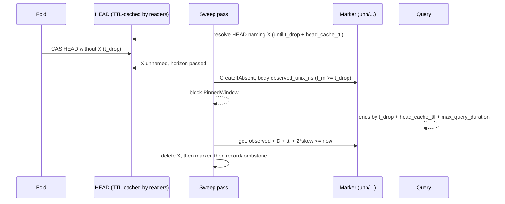

# ADR-1133: an unnamed-since marker gates sweep deletes on the pinned-query window

Status: Accepted (2026-10-01)

## Context

Two sweeps physically delete objects a catalog HEAD once named:

- the retention sweep deletes a tombstoned bucket (ADR-0019);
- the superseded-input sweep deletes a compaction or rewrite record's inputs (ADR-0018).

Both gate each delete on two conditions (docs/deletion-and-gc.md):

- the protection horizon, anchored on a durable timestamp of the record that made the object deletable;
- the ADR-0020 delete blocker: the live HEAD names nothing the delete would remove (`SnapshotReachability::bucket_gate` and `object_gate` in `crates/ravel-maintain/src/reachability.rs`).

Neither condition says when HEAD *stopped* naming the object. A query resolves one HEAD and reads what it names for up to `max_query_duration`. When the fold lags, the horizon passes while HEAD still names the object, so only the blocker holds the delete back. A query then pins that HEAD, the next fold drops the object, and the next sweep pass deletes it while the query is still reading. The query fails with `SnapshotInvalidated` (503), which docs/consistency-model.md promises cannot happen.

The lifecycle model confirms this: formal/tla/lifecycle/results.md, "Candidate #1133: CONFIRMED unsafe", has a six-state trace violating `NoDeleteInsideProtectionWindow`, and its pinned-query clause (`HorizonGuardsPinnedQueries`) is load-bearing. The Rust gates do not implement that clause.

What the clause needs is a durable time that is **never earlier than the moment HEAD stopped naming the object**, plus `max_query_duration`. Every timestamp that exists today fails that test or stalls the sweeps (see Rejected alternatives).

## Decision

### 1. The sweep records when it first saw a candidate unnamed

The first time a sweep pass finds a delete candidate past its horizon and not named by the live HEAD, it writes an **unnamed-since marker** with `PutMode::CreateIfAbsent`. `AlreadyExists` counts as success: the existing marker stands, and its body is read back.

The markers live under their own per-signal prefix, `t/<tenant_hash>/<signal>/unn/`, never under the commit prefix `c/<shard>/<ingest_hour>/`. Keys there must match a known shape, and `partition_bucket_entry` (crates/ravel-commit/src/keys.rs) fails loud on anything else, including in a build older than this one.

- **Retention:** one marker per tombstoned bucket, `t/<tenant_hash>/<signal>/unn/<shard>/<ingest_hour>/retire.unn`.
- **Superseded inputs:** one marker per chain group, keyed by the record the group is entered from (the record whose `created_unix_ns` anchors the horizon): `t/<tenant_hash>/<signal>/unn/<shard>/<ingest_hour>/<record file stem>.unn`.

The marker is immutable, small and versioned, and holds no tenant data. Its body carries:
- `format_version`;
- `observed_unix_ns`, the writing sweeper's own clock reading when it found the candidate unnamed;
- for forensics only, the HEAD version it observed.

The anchor is `observed_unix_ns`. The store's `last_modified` is not used: docs/object-store-contract.md reserves it for advisory age decisions and rules it out as a correctness input. That keeps this gate on the same footing as the existing horizon rules, which anchor on durable timestamps and compare them with the sweeper's own clock (docs/deletion-and-gc.md).

### 2. A delete waits until the marker is older than the pinned-query window

A candidate the HEAD does not name is deleted only when

```
marker.observed_unix_ns + max_query_duration + head_cache_ttl + 2 * clock_skew_allowance <= now_ns
```

Until then the gate answers a new block reason, `SnapshotBlock::PinnedWindow`. Each existing block counter, report field and `/metrics` `reason` label gains its own `pinned_window` value.

**Why this is safe.** Write `t_drop` for the true time a HEAD that names X is first replaced by one that does not.
- A query resolves HEAD through a TTL cache (`head_cache_ttl`, docs/catalog-and-mvcc.md), so a query can still be handed a HEAD that names X until `t_drop + head_cache_ttl`. It then reads for at most `max_query_duration`; the query engine's deadline is validated `<= max_query_duration` at startup (docs/deletion-and-gc.md). Every query that could need X has therefore ended by `t_drop + head_cache_ttl + max_query_duration`.
- A sweep can only observe X unnamed after `t_drop`, so the marker's true observation time `t_m` satisfies `t_m >= t_drop`.
- `observed_unix_ns` is the writing sweeper's clock at `t_m`, and the deleting sweeper's `now` is its own clock. These may be different processes. docs/deletion-and-gc.md already bounds every sweeper's clock within `clock_skew_allowance` of true time; the horizon arithmetic rests on that. Comparing two such clocks costs up to `2 * clock_skew_allowance`.
- So the condition implies the deleting sweeper's true time is at least `t_m + max_query_duration + head_cache_ttl >= t_drop + head_cache_ttl + max_query_duration`, and every query that could hold X has ended.

`head_cache_ttl` in the term is the largest TTL any query process in the deployment may run with. The implementation establishes that bound:
- if the TTL is not operator-configurable, it is the compiled `DEFAULT_HEAD_CACHE_TTL_NS`;
- if it is configurable, it is a validated deployment-wide ceiling, which a query process is refused above.

If neither holds, the implementation stops and this ADR is revisited.

**Why it cannot stall.** Nothing rewrites the marker. Folds, compactions and HEAD rewrites do not touch it, so a candidate that stays unnamed is deleted once its window passes, whatever the fold cadence.

### 3. `max_query_duration` comes from `sys/gc`

The term uses the validated, deployment-wide `max_query_duration_ns` from `sys/gc` (ADR-0050 §4), the same value the protection horizon is checked against. It does not use a compiled default. The server's maintenance supervisor and `ravel-cli maintain sweep` both read it. Today the CLI builds `CompactorConfig::default()` and never reads `sys/gc`; that is fixed in the same change.

### 4. A re-named candidate restarts its window

If a pass finds a candidate that has a marker named by HEAD again, it deletes the marker. A later unnamed observation writes a fresh one. This is defence in depth. A dropped object is not expected to be named again, since tombstones and supersession are one-way, and ADR-1693's HEAD compare-and-swap serializes concurrent folders so that a losing folder re-reads rather than republishing a HEAD that names X. The implementation must confirm this against the fold (crates/ravel-catalog/src/fold.rs). If a dropped object can be re-named between two passes, the implementation stops and this ADR is revisited before any gate ships. Deleting a marker only ever delays a delete.

### 5. Fail-closed, ordering and cleanup

- A `get`, `put` or `delete` error on a marker, or a body that does not decode, blocks the delete (`Unreadable`), never permits it. A HEAD that is absent or unreadable keeps its existing ADR-0020 answer, except that a Clear verdict still requires an aged marker: no Clear path skips decision 2.
- **Retention:** the bucket's objects are deleted, then the marker, then `retire.tmb` last, after the existing LIST-verified-empty check. The marker's prefix is outside the bucket's commit prefix, so that check is unaffected.
- **Superseded:** the group's objects are deleted, then the marker, then the record it is keyed by.
- **Orphan markers.** A marker whose tombstone or record no longer exists is left by a crash between the deletes. It is removed by a new sweep rule that is added to docs/deletion-and-gc.md's rule table:
  - each sweep pass lists `t/<tenant_hash>/<signal>/unn/<shard>/`;
  - it deletes any marker whose tombstone or record key is absent and whose `observed_unix_ns` is older than `protection_horizon`.

  No existing rule reaps these keys.

### 6. Cost

- One `put` per delete candidate, once in its lifetime.
- One `get` of the small body per candidate per pass while its window runs, cached per pass in `SnapshotReachability`.
- One `delete` when the candidate goes.
- One `list` page of `unn/<shard>/` per shard per pass for the orphan rule.

The superseded sweep's markers are per chain group, not per object. All of this is counted under the sweep's existing request accounting.



## Rejected alternatives

1. **The covering snapshot part's store `last_modified`.** An implementation was built on it (task 1adcccde) and an adversarial review blocked it. Parts are content-addressed and written with `CreateIfAbsent`, where `AlreadyExists` adopts the existing object without refreshing `last_modified`. That leaves three failures:
   - A fold PUTs its parts well before its HEAD compare-and-swap (fold.rs ~2047-2067 against ~2241), and its CAS retries re-adopt the first write. A fold longer than the skew allowance therefore opens the gate early.
   - A fold that dies between the part PUT and the CAS leaves bytes a later fold adopts in the first HEAD that drops X, with a timestamp up to about a day old.
   - A single-part HEAD embeds the watermark and is rewritten every hour, so a window of more than an hour never elapses and both sweeps stall for every small tenant.
2. **A new `SnapshotPartHeader` timestamp field.** It has the same write-ahead problem as alternative 1, since parts are written before the HEAD CAS that names them, and it is a frozen-format change on top.
3. **HEAD's own timestamp** (`SnapshotHead.created_unix_ns` or HEAD's `last_modified`). It is safe, since it is never earlier than the drop, but every fold rewrites HEAD. On a fold cadence shorter than the window the gate never opens, and both sweeps stall permanently.
4. **A per-query pin registry or reader leases.** Exact, but it needs every query process to write durable state on its read path, which ADR-0020 rejected for cost. The `LeaseCheck` hook exists and always answers "unprotected".
5. **Extending the protection horizon.** A longer horizon does not help: the race starts when HEAD drops the object, which can be any time after the horizon.

## Consequences

- **Key layout.** `unn/<shard>/<ingest_hour>/retire.unn` and `unn/<shard>/<ingest_hour>/<record file stem>.unn` are new keys under a new per-signal prefix.
  - docs/catalog-and-mvcc.md "Key layout" gains both, and the key-layout contract test pins them.
  - The implementation confirms that no existing listing of `t/<tenant_hash>/<signal>/` classifies an unknown sub-prefix fail-loud, as `partition_bucket_entry` does for `c/`. If one does, the implementation stops before writing any marker.
  - An older build never lists `unn/`, so it ignores the markers. But an older sweeper running beside a newer one still deletes by the old rule, so the guarantee holds only once every maintain process runs this version; docs/guides/operations/maintenance.md says so.
- **Normative docs this makes false, all updated in the same change:**
  - docs/deletion-and-gc.md: the retention and superseded-input rows of the rule table, the "HEAD-referenced snapshot delete blocker" section, and the new orphan-marker rule;
  - docs/consistency-model.md, where it describes the delete guarantee as resting on the horizon plus the blocker;
  - the `LeaseCheck` doc comment in crates/ravel-maintain/src/sweep.rs, which says the horizon and the age gates are what protect in-flight readers.
- **Latency.** A delete candidate's physical delete moves later by at most `max_query_duration + head_cache_ttl + 2 * clock_skew_allowance` after a sweep first sees it unnamed, plus one pass interval.
- **Lifecycle model.** In formal/tla/lifecycle, `candidate-1133.cfg` becomes the negative control `negative/pinned-query-ungated.cfg`, and traceability.md maps `HorizonGuardsPinnedQueries` to the marker gate. The model's `QueryPermits` reads a query's needs directly, so it shows a guard is required, not that this one is sufficient. The argument in decision 2 is what covers sufficiency.
- **Reuse.** From the preserved branch `task/1adcccde-8eaa-42d2-ab7d-a45949fdbbc6/result`, these carry over: the `PinnedWindow` block reason, its `/metrics` label and CLI line, the repaired negative control and its `.expect`, and the pinned-reader and stall-test scaffolding. Its anchor code does not carry over.
- **Tests the implementation owes:**
  - each term of the condition pinned one nanosecond each side: `max_query_duration`, `head_cache_ttl` and `2 * clock_skew_allowance`;
  - a stall test with folds that rewrite HEAD and its single part every hour;
  - the fold-dies-after-part-PUT interleaving from rejected alternative 1, shown to stay blocked;
  - a query served a cached pre-drop HEAD just before `t_drop + head_cache_ttl`, shown to stay protected;
  - a re-named candidate restarting its window;
  - a marker `get`, `put` or `delete` error, and an undecodable body, each blocking;
  - an orphan marker reaped only after its tombstone or record is gone and its horizon has passed;
  - an older-shape listing of `c/` unaffected by the markers;
  - the CLI reading `max_query_duration` from `sys/gc`.
