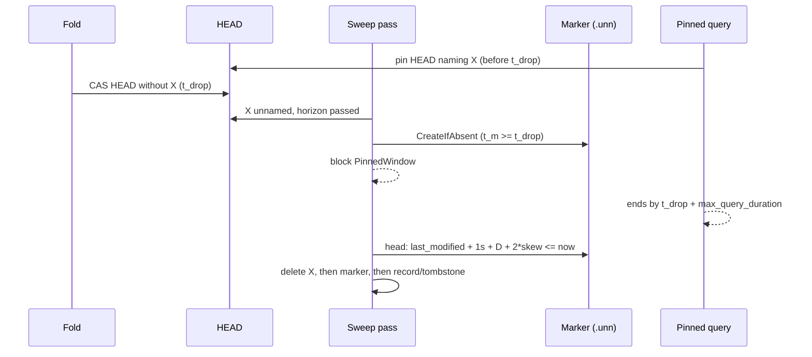

# ADR-1133: an unnamed-since marker gates sweep deletes on the pinned-query window

Status: Accepted (2026-10-01)

## Context

Two sweeps physically delete objects a catalog HEAD once named:

- the retention sweep deletes a tombstoned bucket (ADR-0019);
- the superseded-input sweep deletes a compaction or rewrite record's inputs (ADR-0018).

Both gate each delete on two conditions (docs/deletion-and-gc.md):

- the protection horizon, anchored on a durable timestamp of the record that made the object deletable;
- the ADR-0020 delete blocker: the live HEAD names nothing the delete would remove (`SnapshotReachability::bucket_gate` and `object_gate` in `crates/ravel-maintain/src/reachability.rs`).

Neither condition says when HEAD *stopped* naming the object. A query resolves one HEAD and reads what it names for up to `max_query_duration`. When the fold lags, the horizon passes while HEAD still names the object, so only the blocker holds the delete back. A query then pins that HEAD, the next fold drops the object, and the next sweep pass deletes it while the query is still reading. The query fails with `SnapshotInvalidated` (503), which docs/consistency-model.md promises cannot happen.

The lifecycle model confirms this: formal/tla/lifecycle/results.md, "Candidate #1133: CONFIRMED unsafe", has a six-state trace violating `NoDeleteInsideProtectionWindow`, and its pinned-query clause (`HorizonGuardsPinnedQueries`) is load-bearing. The Rust gates do not implement that clause.

What the clause needs is a durable time that is **never earlier than the moment HEAD stopped naming the object**, plus `max_query_duration`. Every timestamp that exists today fails that test or stalls the sweeps (see Rejected alternatives).

## Decision

### 1. The sweep records when it first saw a candidate unnamed

The first time a sweep pass finds a delete candidate past its horizon and not named by the live HEAD, it writes an **unnamed-since marker** with `PutMode::CreateIfAbsent`. `AlreadyExists` counts as success: the existing marker stands.

- **Retention:** one marker per tombstoned bucket, `t/<tenant_hash>/<signal>/c/<shard>/<ingest_hour>/retire.unn`, next to `retire.tmb`.
- **Superseded inputs:** one marker per chain group, keyed by the record the group is entered from (the same record whose `created_unix_ns` anchors the horizon), `<record key with the .cmt suffix replaced by .unn>`.

The marker is immutable, has a small versioned body and holds no tenant data. The body records `format_version` and, for forensics only, the HEAD version observed; no decision reads either. The anchor is the marker object's store-assigned `last_modified` (`ObjectMeta`, read with `head`). The object-store contract reserves that field for "advisory age decisions only (GC age checks, claim expiry)".

### 2. A delete waits until the marker is older than the query window

A candidate the HEAD does not name is deleted only when

```
marker.last_modified_ms * 1_000_000 + 1 s + max_query_duration + 2 * clock_skew_allowance <= now_ns
```

Until then the gate answers a new block reason, `SnapshotBlock::PinnedWindow`. Each existing block counter, report field and `/metrics` `reason` label gains its own `pinned_window` value.

**Why this is safe.** Write `t_drop` for the true time a HEAD that names X is first replaced by one that does not.
- Any query pinned to a HEAD naming X pinned it before `t_drop`, and it ends by `t_drop + max_query_duration`. The query engine's deadline is validated `<= max_query_duration` at startup (docs/deletion-and-gc.md).
- A sweep can only observe X unnamed after `t_drop`, so the marker's true write time `t_m` satisfies `t_m >= t_drop`.
- The marker's `last_modified` is the store's clock at `t_m`. It may be truncated by up to 1 s and is within `clock_skew_allowance` of true time. The sweeper's `now` is within `clock_skew_allowance` of true time too.
- So the condition implies the sweeper's true time is at least `t_m + max_query_duration >= t_drop + max_query_duration`, and every query that could hold X has ended.
- The skew term is doubled because `clock_skew_allowance` bounds each clock against true time (docs/catalog-and-mvcc.md, "Sealed hours"), and this compares two different clocks.

**Why it cannot stall.** Nothing rewrites the marker. Folds, compactions and HEAD rewrites do not touch it, so a candidate that stays unnamed is deleted once its window passes, whatever the fold cadence.

### 3. `max_query_duration` comes from `sys/gc`

The term uses the validated, deployment-wide `max_query_duration_ns` from `sys/gc` (ADR-0050 §4), the same value the protection horizon is checked against. It does not use a compiled default. The server's maintenance supervisor and `ravel-cli maintain sweep` both read it. Today the CLI builds `CompactorConfig::default()` and never reads `sys/gc`; that is fixed in the same change.

### 4. A re-named candidate restarts its window

If a pass finds a candidate that has a marker named by HEAD again, it deletes the marker. A later unnamed observation writes a fresh one. This is defence in depth: a dropped object is not expected to be named again, since tombstones and supersession are one-way. The implementation must confirm that expectation against the fold (crates/ravel-catalog/src/fold.rs), including the ADR-1693 membership transition. If the code shows a dropped object can be re-named between two passes, the implementation stops and this ADR is revisited before any gate ships. Deleting a marker only ever delays a delete.

### 5. Fail-closed, ordering and cleanup

- A `head` or `put` error on a marker blocks the delete (`Unreadable`), never permits it. A HEAD that is absent or unreadable keeps its existing ADR-0020 answer, except that a Clear verdict still requires an aged marker: no Clear path skips step 2.
- **Retention:** the marker is deleted with the bucket, after its objects and before `retire.tmb`. The tombstone is still deleted last, and the bucket is LIST-verified empty first.
- **Superseded:** the marker is deleted after the group's objects, before the record it is keyed by.
- A marker whose candidate no longer exists (a crash between the deletes) is removed by the same sweep on its next pass. The unreferenced-object sweep may also reap it after its own horizon. A marker's name ties it to its bucket or record, so it is never ambiguous.

### 6. Cost

- One `put` per delete candidate, once in its lifetime.
- One `head` per candidate per pass while its window runs, cached per pass in `SnapshotReachability`.
- One `delete` when the candidate goes.

At the default 1 h `max_query_duration` that is a few passes of `head` per candidate. The superseded sweep's markers are per chain group, not per object. All of this is counted under the sweep's existing request accounting.



## Rejected alternatives

1. **The covering snapshot part's store `last_modified`.** An implementation was built on it (task 1adcccde) and an adversarial review blocked it. Parts are content-addressed and written with `CreateIfAbsent`, where `AlreadyExists` adopts the existing object without refreshing `last_modified`. That leaves three failures:
   - A fold PUTs its parts well before its HEAD compare-and-swap (fold.rs ~2047-2067 against ~2241), and its CAS retries re-adopt the first write. A fold longer than the skew allowance therefore opens the gate early.
   - A fold that dies between the part PUT and the CAS leaves bytes a later fold adopts in the first HEAD that drops X, with a timestamp up to about a day old.
   - A single-part HEAD embeds the watermark and is rewritten every hour, so a window of more than an hour never elapses and both sweeps stall for every small tenant.
2. **A new `SnapshotPartHeader` timestamp field.** It has the same write-ahead problem as alternative 1, since parts are written before the HEAD CAS that names them, and it is a frozen-format change on top.
3. **HEAD's own timestamp** (`SnapshotHead.created_unix_ns` or HEAD's `last_modified`). It is safe, since it is never earlier than the drop, but every fold rewrites HEAD. On a fold cadence shorter than the window the gate never opens, and both sweeps stall permanently.
4. **A per-query pin registry or reader leases.** Exact, but it needs every query process to write durable state on its read path, which ADR-0020 rejected for cost. The `LeaseCheck` hook exists and always answers "unprotected".
5. **Extending the protection horizon.** A longer horizon does not help: the race starts when HEAD drops the object, which can be any time after the horizon.

## Consequences

- **Key layout.** `retire.unn` and `<record>.unn` are new keys. docs/catalog-and-mvcc.md "Key layout" gains both, and the key-layout contract test pins them. Older builds ignore them: they are neither commit records nor data objects. An older sweeper running beside a newer one still deletes by the old rule, so the guarantee holds only once every maintain process runs this version (docs/guides/operations/maintenance.md says so).
- **Latency.** A delete candidate's physical delete moves later by at most `max_query_duration + 2 * clock_skew_allowance + 1 s` after a sweep first sees it unnamed, plus one pass interval.
- **Lifecycle model.** formal/tla/lifecycle: `candidate-1133.cfg` becomes the negative control `negative/pinned-query-ungated.cfg`, and traceability.md maps `HorizonGuardsPinnedQueries` to the marker gate. The model's `QueryPermits` reads a query's needs directly, so it shows a guard is required, not that this one is sufficient. The argument in Decision 2 is what covers sufficiency.
- **Reuse.** From the preserved branch `task/1adcccde-8eaa-42d2-ab7d-a45949fdbbc6/result`, these carry over unchanged: the `PinnedWindow` block reason, its `/metrics` label and CLI line, the repaired negative control and its `.expect`, and the pinned-reader and stall-test scaffolding. Its anchor code does not carry over.
- **Tests the implementation owes:**
  - Each term of the condition is pinned one nanosecond each side: the 1 s term, `2 * clock_skew_allowance` and `max_query_duration`.
  - A stall test with folds that rewrite HEAD and its single part every hour.
  - The fold-dies-after-part-PUT interleaving from alternative 1, shown to stay blocked.
  - A re-named candidate restarting its window.
  - A marker `head` or `put` error blocking.
  - The CLI reading `max_query_duration` from `sys/gc`.
