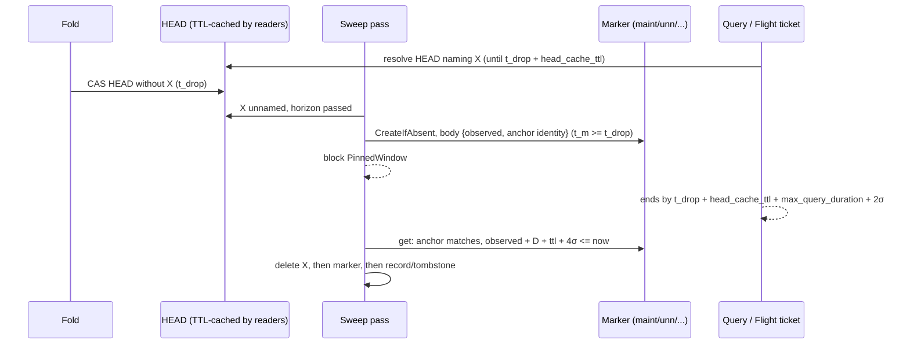

# ADR-1133: an unnamed-since marker gates sweep deletes on the pinned-query window

Status: Accepted (2026-10-01; revised 2026-10-02 after review; amended 2026-10-02)

## Context

Two sweeps physically delete objects a catalog HEAD once named:

- the retention sweep deletes a tombstoned bucket (ADR-0019);
- the superseded-input sweep deletes a compaction or rewrite record's inputs (ADR-0018).

Both gate each delete on two conditions (docs/deletion-and-gc.md):

- the protection horizon, anchored on a durable timestamp of the record that made the object deletable;
- the ADR-0020 delete blocker: the live HEAD names nothing the delete would remove (`SnapshotReachability::bucket_gate` and `object_gate` in `crates/ravel-maintain/src/reachability.rs`).

Neither condition says when HEAD *stopped* naming the object. A query resolves one HEAD and reads what it names for up to `max_query_duration`. When the fold lags, the horizon passes while HEAD still names the object, so only the blocker holds the delete back. A query then pins that HEAD, the next fold drops the object, and the next sweep pass deletes it while the query is still reading. The query fails with `SnapshotInvalidated` (503), which docs/consistency-model.md promises cannot happen.

The lifecycle model confirms this: formal/tla/lifecycle/results.md, "Candidate #1133: CONFIRMED unsafe", has a six-state trace violating `NoDeleteInsideProtectionWindow`, and its pinned-query clause (`HorizonGuardsPinnedQueries`) is load-bearing. The Rust gates do not implement that clause.

What the clause needs is a durable time that is **never earlier than the moment HEAD stopped naming the object**, bound to the delete it gates, plus the longest time a query can keep reading after that moment. Every timestamp that exists today fails that test or stalls the sweeps (see Rejected alternatives).

## Decision

### 1. The sweep records when it first saw a candidate unnamed

The first time a sweep pass finds a delete candidate past its horizon and not named by the live HEAD, it writes an **unnamed-since marker** with `PutMode::CreateIfAbsent`. `AlreadyExists` counts as success: the existing marker stands, and its body is read back.

The markers live under the per-signal maintenance prefix:

- **Retention:** one marker per tombstoned bucket, `t/<tenant_hash>/<signal>/maint/unn/<shard>/<ingest_hour>/retire.unn`.
- **Superseded inputs:** one marker per chain group, keyed by the record the group is entered from (the record whose `created_unix_ns` anchors the horizon), `t/<tenant_hash>/<signal>/maint/unn/<shard>/<ingest_hour>/<record file stem>.unn`.

This placement avoids two problems:
- **Commit-path classification.** The commit prefix `c/<shard>/<ingest_hour>/` holds only shapes that `partition_bucket_entry` (crates/ravel-commit/src/keys.rs) classifies. Any other key there is a fail-loud error, in this build and in older ones.
- **IAM.** The maintain role's read and write grants already cover `t/*/*/maint/*` (deploy/iam/maintain.json), as they do for the scan cursor. A new sibling prefix would have neither, so under per-role credentials every marker write would fail and, by decision 6, every delete would stall. The delete and list grants do not cover it yet; the Consequences IAM bullet adds both.

The marker is immutable, small and versioned, and holds no tenant data. Its body carries:

- `format_version`;
- `observed_unix_ns`: the writing sweeper's own clock reading when it found the candidate unnamed (see the clock-reading amendment below: the reading is taken after that HEAD GET returns);
- **anchor identity**: the kind (retention or superseded), the anchor's key (`retire.tmb` or the record), its anchoring timestamp (`retired_at_ns` or `created_unix_ns`) and its store version;
- for forensics only, the HEAD version observed.

The anchor time is `observed_unix_ns`. The store's `last_modified` is not used: docs/object-store-contract.md reserves it for advisory age decisions and rules it out as a correctness input. This keeps the gate on the same footing as the existing horizon rules, which compare durable timestamps with the sweeper's own clock.

### 2. A marker counts only for the anchor it was written for

A marker whose anchor identity does not match the current tombstone or record is treated as absent: it is deleted, a fresh one is written, and the window restarts.

The mismatch case is real. An older sweeper running beside a newer one can delete a tombstone or record by the old rule and leave the newer sweeper's marker behind. A later tombstone or record for the same bucket or group would then find an already-aged marker and clear at once.

### 3. A delete waits until the marker is older than the pinned-query window

A candidate the HEAD does not name is deleted only when

```
marker.observed_unix_ns + max_query_duration + head_cache_ttl + 4 * clock_skew_allowance <= now_ns
```

Until then the gate answers a new block reason, `SnapshotBlock::PinnedWindow`. Each existing block counter, report field and `/metrics` `reason` label gains its own `pinned_window` value.

The erasure-request sweep's observing pass (`SweepMode::GateOnly`) evaluates the same gate but reads markers only: it never writes or deletes one. A candidate it finds with no marker, or with one still inside its window, counts as held. An observing pass processes a record from its own entry, which a deleting pass only ever gates as a member of a rewrite's group, so a marker it wrote would be keyed by a record no delete pass uses.

**Why this is safe**, for every query the consistency model covers. Write `t_drop` for the true time a HEAD that names X is first replaced by one that does not, and `σ` for `clock_skew_allowance`.

This ADR rests on a stronger deployment assumption than docs/deletion-and-gc.md states. That document uses `σ` to bound the deleting sweeper's lead over true time. Here `σ` must bound every clock the argument uses, each within `σ` of true time in either direction:
- the sweeper that writes a marker and the sweeper that deletes;
- every query process that resolves HEAD;
- every process that mints or redeems a Flight SQL ticket.

No startup check enforces a clock offset. It is a declared property of the deployment, like `σ` itself today, and the condition below has no margin beyond it: a clock outside its bound can open the gate early.

- **The cache delays the pin.** A resolve can be served a cached HEAD (`head_cache_ttl`, crates/ravel-catalog/src/snapshot_resolve.rs). A query can still be handed a HEAD that names X until `t_drop + head_cache_ttl`, measured on the resolving process's clock. Within one process the TTL check and the query deadline share that clock, so its offset cancels (superseded by the clock-reading amendment below: the TTL moves to a monotonic clock).
- **A query ends within `max_query_duration`.** Its engine deadline is validated `<= max_query_duration` at startup (docs/deletion-and-gc.md).
- **A Flight SQL ticket can extend that by `2σ`.** The ticket is minted on process A with A's deadline and redeemed on process B against B's clock (crates/ravel-sql/src/flight/mod.rs, `clamp_ticket_deadline_ns`). Its reads can end up to `2σ` later in true time than A's own deadline.
- **So every covered reader of X has ended by** `t_drop + head_cache_ttl + max_query_duration + 2σ` (see the clock-reading amendment below for what "ended" requires of a request in flight at the deadline).
- **The marker cannot be early.** A sweep can only observe X unnamed after `t_drop`, so the marker's true observation time `t_m >= t_drop`. Its `observed_unix_ns` is the writer's clock, at most `σ` behind true time. The deleting sweeper's `now` is its own clock, at most `σ` ahead. Comparing the two costs up to `2σ` (see the clock-reading amendment below: the observation must be read after the HEAD GET returns for `t_m >= t_drop` to hold).
- Altogether the gate needs `max_query_duration + head_cache_ttl + 4σ` past `observed_unix_ns`, and that is the condition.

A resolve that falls back to listing when the HEAD GET fails (crates/ravel-catalog/src/snapshot_resolve.rs) pins no HEAD. It stays bounded by `protection_horizon` as it is today, and this argument does not cover it.

Readers outside the consistency model carry no validated deadline, so this ADR does not bound them: the fold, scrub, compaction, erasure rewrite, `ravel-cli export` (which resolves once and has no deadline) and the bench harness. docs/consistency-model.md says so.

**Why it cannot stall.** Nothing rewrites the marker. Folds, compactions and HEAD rewrites do not touch it, so a candidate that stays unnamed is deleted once its window passes, whatever the fold cadence.

### 4. The window's terms are validated, deployment-wide values in `sys/gc`

- **`sys/gc` gains `head_cache_ttl_ns`.** `max_query_duration_ns` is already there (ADR-0050 §4), and `GC_FORMAT_VERSION` goes from 1 to 2. `GcConfig` in proto/ravel/sys.proto is a frozen schema, so the new field follows the frozen-format procedure: a new field number, the version bump, and an amendment to ADR-0050 §4, which lists the object's fields.
- **Query processes must match it.** Today `head_cache_ttl` is a public `CatalogConfig` field that tests and tools set freely, and no flag sets it in the server. A query-mode process now refuses to start if its effective head-cache TTL exceeds the recorded value. On a version 1 `sys/gc` it compares against the compiled `DEFAULT_HEAD_CACHE_TTL_NS`, the same value the sweeper's gate uses. The field's doc comment says it is a correctness input, not only a cost knob.
- **The version bump is the rollout ratchet.** A build refuses a `sys/gc` `format_version` it does not understand (crates/ravel-maintain/src/gc_config.rs). New builds read versions 1 and 2:
  - on version 1 they use the compiled `DEFAULT_HEAD_CACHE_TTL_NS` and still enforce the marker gate;
  - bootstrap of a fresh bucket keeps writing version 1, so a new process cannot lock older ones out by touching a bucket first;
  - only `ravel-cli gc-config set` writes version 2, once every process runs a build that understands it;
  - from then on no older process can start, so no older sweeper can delete by the old rule beside the new ones.

  docs/guides/operations/maintenance.md gives this as the upgrade procedure, and the guarantee is complete only after the flip.
- **The CLI uses the same values.** `ravel-cli maintain sweep` reads `sys/gc` and runs the same skew validation the server's maintain mode runs (`validate_maintain_skew`). Today it builds `CompactorConfig::default()`, reads neither, and so can run with a weaker configuration than the server.

### 5. A re-named candidate restarts its window

If a pass finds a candidate that has a marker named by HEAD again, it deletes the marker, and a later unnamed observation writes a fresh one.

This is defence in depth. A dropped object is not expected to be named again: tombstones and supersession are one-way, and ADR-1693's HEAD compare-and-swap serializes concurrent folders so that a losing folder re-reads rather than republishing a HEAD that names X. The implementation confirms this against crates/ravel-catalog/src/fold.rs and catalog.rs, including the "largest input set wins" selection. If a dropped object can be re-named between two passes, the implementation stops and this ADR is revisited before any gate ships.

### 6. Fail-closed, ordering, scope and cleanup

- **Any doubt blocks.** A `get`, `put` or `delete` error on a marker, a body that does not decode, or an anchor that cannot be read blocks the delete (`Unreadable`) and never permits it. A HEAD that is absent or unreadable keeps its existing ADR-0020 answer, except that a Clear verdict still requires an aged, matching marker: no Clear path skips decision 3.
- **Retention:** the bucket's objects are deleted, then the marker, then `retire.tmb` last, after the existing LIST-verified-empty check. The marker sits outside the bucket's commit prefix, so that check is unaffected.
- **Superseded:** the group's objects are deleted, then the marker, then the record it is keyed by.
- **Scope.** Markers are written only by the retention and superseded-input sweeps, never for the alerts signal: its tombstone-free retention rule is separate (crates/ravel-maintain/src/alert_retention.rs). An observing pass writes none (decision 3), and neither does a dry run.
- **Orphan markers.** A chain group can be re-rooted when a later rewrite record pulls the group's entering record into its own group (crates/ravel-maintain/src/sweep.rs), so the key a marker was named by is not stable for the candidate's lifetime. That is the main source of orphans, with crashes between the deletes and the mixed-version case from decision 2. A new rule in docs/deletion-and-gc.md's rule table reaps them:
  - once per `protection_horizon` per `(tenant, signal)`, or on any pass that gated a candidate, one signal-wide LIST of `maint/unn/`, which spans every shard, including after a reshard;
  - it deletes each marker whose anchor no longer exists and whose `observed_unix_ns` is older than `protection_horizon` on the sweeper's clock;
  - a key under `maint/unn/` that does not parse is counted and skipped, never deleted and never fatal.

  A tenant with leftover markers stays in tenant discovery until they are reaped.

### 7. The lifecycle model proves the gate, not only the need for one

formal/tla/lifecycle/LifecycleGC.tla gains:
- a per-candidate observation time;
- a head-cache delay on the pin;
- the window gate.

`NoDeleteInsideProtectionWindow` is checked with `HorizonGuardsPinnedQueries` FALSE and the window gate on, which must pass. Each of these must fail as its own negative control:
- `candidate-1133.cfg` promoted to `negative/pinned-query-ungated.cfg`, the gate off;
- the gate with a single skew term;
- the gate with no cache delay;
- a marker accepted for the wrong anchor.

traceability.md maps the new actions to the Rust gate.

### 8. Cost

Per candidate:
- one `put`, once in its lifetime;
- one `get` of the small body per pass while its window runs, cached per pass in `SnapshotReachability`;
- one `delete` when it goes.

Per tenant and signal, one LIST of `maint/unn/` per `protection_horizon` or gating pass. The superseded sweep's markers are per chain group, not per object. All of it is counted under the sweep's existing request accounting.



## Rejected alternatives

1. **The covering snapshot part's store `last_modified`.** An implementation was built on it (task 1adcccde) and an adversarial review blocked it. Parts are content-addressed and written with `CreateIfAbsent`, where `AlreadyExists` adopts the existing object without refreshing `last_modified`. That leaves three failures:
   - A fold PUTs its parts well before its HEAD compare-and-swap (fold.rs ~2047-2067 against ~2241), and its CAS retries re-adopt the first write. A fold longer than the skew allowance therefore opens the gate early.
   - A fold that dies between the part PUT and the CAS leaves bytes a later fold adopts in the first HEAD that drops X, with a timestamp up to about a day old.
   - A single-part HEAD embeds the watermark and is rewritten every hour, so a window of more than an hour never elapses and both sweeps stall for every small tenant.
2. **A drop time written by the fold** (a new `SnapshotPartHeader` field, a per-hour "dropped at", or a HEAD-version log). It is stamped before the HEAD CAS that publishes it, so it has the same write-ahead flaw as alternative 1. It is a frozen-format change, and a log grows without bound.
3. **HEAD's own timestamp** (`SnapshotHead.created_unix_ns` or HEAD's `last_modified`). It is safe, since it is never earlier than the drop, but every fold rewrites HEAD. On a fold cadence shorter than the window the gate never opens, and both sweeps stall permanently.
4. **An in-process "first seen unnamed" time**, optionally carried in the ADR-0065 memo snapshot. It has the same safety argument with no new keys. But a restart or an ownership handoff restarts the window, and the one-shot `ravel-cli maintain sweep` has no memory, so it could never clear the gate.
5. **The tombstone or record time plus a fixed bound.** Fold lag is unbounded, so no constant bound exists.
6. **A per-query pin registry or reader leases.** Exact, but it needs every query process to write durable state on its read path, which ADR-0020 rejected for cost. The `LeaseCheck` hook exists and always answers "unprotected".
7. **Extending the protection horizon.** A longer horizon does not help: the race starts when HEAD drops the object, which can be any time after the horizon.

## Consequences

- **Key layout.** `maint/unn/<shard>/<ingest_hour>/retire.unn` and `maint/unn/<shard>/<ingest_hour>/<record file stem>.unn` are additive keys under the existing per-signal `maint/` prefix. The closest precedent is `maint/migrate/<family>/cursor` (crates/ravel-maintain/src/migrate.rs), a second level under `maint/` as `maint/unn/` is.
  - docs/catalog-and-mvcc.md "Key layout" gains both, and the key-layout contract test pins them.
  - The implementation confirms that no existing listing of `t/<tenant_hash>/<signal>/` or of `maint/` classifies an unknown key fail-loud. The scan cursor `maint/<shard>/cursor` shares the prefix. If anything does, the implementation stops before writing a marker.
- **IAM.** deploy/iam/maintain.json gains two grants on `t/*/*/maint/*`:
  - `s3:DeleteObject` in `MaintainDelete`, for every marker delete in decisions 2, 5 and 6. The scan cursor, the prefix's only occupant today, is overwritten and never deleted, so the template has never needed it. Without it every marker delete returns AccessDenied, and by decision 6 the candidate blocks for good.
  - the prefix in the ListBucket `s3:prefix` condition, for the orphan LIST.

  crates/ravel-commit/tests/iam_templates.rs gains a witness for all three marker actions: write, delete and list.
- **Rollout.** Decision 4's `sys/gc` version 2 is the ratchet. Until it is written, an older maintain process can still delete by the old rule. After it is written, every older process refuses to start, so every process, not only maintain, must be upgraded first. Bootstrap keeps writing version 1, so a fresh bucket follows the same procedure.
- **Until the implementation ships,** docs/consistency-model.md's statement that the horizon interlock and the delete blocker together keep a pinned reader's snapshot safe from the sweeper is false, as the Context section shows. This ADR records that gap. The implementation corrects both documents below.
- **Normative docs this makes false, all updated in the same change:**
  - **ADR-0050 §4** gains an amendment section, with its marker, for the new `sys/gc` field, and its row in docs/adrs/README.md gains "Amended by 1133".
  - **proto/ravel/sys.proto:** `GcConfig` gains `head_cache_ttl_ns` under the frozen-format procedure.
  - **docs/deletion-and-gc.md:**
    - the retention and superseded-input rows of the rule table;
    - the "HEAD-referenced snapshot delete blocker" section;
    - the new orphan-marker rule;
    - the description of what `sys/gc` records, and the reason given for keeping `clock_skew_allowance` out of it, which cites the object's frozen format that this change versions;
    - the residual-risk paragraph, which must say that the marker gate also rests on `σ` bounding the marker writer and the query and Flight processes (decision 3);
    - the claim that no reachable sweeper configuration can delete a pinned object, which becomes true only once the CLI reads `sys/gc` and validates skew.
  - **docs/consistency-model.md:**
    - the delete guarantee resting on the horizon plus the blocker;
    - the physical-erasure bound `.done + protection_horizon + one sweep interval`, which grows by the window;
    - the list of readers the guarantee does not cover.
  - **Code comments:** the `LeaseCheck` doc comment in crates/ravel-maintain/src/sweep.rs, and `head_cache_ttl`'s doc comment in crates/ravel-catalog/src/config.rs.
- **Latency.** A delete candidate's physical delete moves later by at most `max_query_duration + head_cache_ttl + 4 * clock_skew_allowance` after a sweep first sees it unnamed, plus one pass interval. An erasure request's `.dreq` lives longer by the same amount: it is deleted only once the observing pass holds nothing the request's rewrites superseded, and every `PinnedWindow` block is a hold. The `.dreq` carries the subject identifier, so this delays the end of its retention, not only the physical delete.
- **Reuse.** From the preserved branch `task/1adcccde-8eaa-42d2-ab7d-a45949fdbbc6/result`, these carry over: the `PinnedWindow` block reason, its `/metrics` label and CLI line, the repaired negative control and its `.expect`, and the pinned-reader and stall-test scaffolding. Its anchor code does not carry over.
- **Tests the implementation owes:**
  - each term of the condition pinned one nanosecond each side: `max_query_duration`, `head_cache_ttl` and `4 * clock_skew_allowance`;
  - a stall test with folds that rewrite HEAD and its single part every hour;
  - the fold-dies-after-part-PUT interleaving from rejected alternative 1, shown to stay blocked;
  - a query served a cached pre-drop HEAD just before `t_drop + head_cache_ttl`, shown to stay protected;
  - a Flight ticket minted on one clock and redeemed on another;
  - a stale marker surviving a replacement tombstone or record, treated as absent;
  - a re-named candidate restarting its window;
  - a marker `get`, `put` or `delete` error, an undecodable body and an unreadable anchor, each blocking, with FaultStore counters asserted;
  - a dry run and an observing pass each writing no marker, and an observing pass counting an unaged marker as a hold;
  - bootstrap writing version 1, and the query-side TTL check on a version 1 `sys/gc` comparing against the compiled default;
  - no marker for the alerts signal;
  - an orphan marker reaped only after its anchor is gone and its horizon has passed, with the LIST paginated under `MemoryStore::with_page_size(2)`, and an unparseable key under `maint/unn/` counted and skipped;
  - a `c/` listing unaffected by the markers;
  - the CLI reading `max_query_duration` and `head_cache_ttl` from `sys/gc` and running the skew validation;
  - a build that understands only version 1 refusing a version 2 `sys/gc`;
  - the IAM witness;
  - the TLA+ checks in decision 7.

## Amendment (2026-10-02): when each clock in the window is read

<!-- amendment-applies: sections="1. The sweep records when it first saw a candidate unnamed|3. A delete waits until the marker is older than the pinned-query window" pointer="clock-reading amendment" -->
<!-- amendment-supersedes: phrase="share that clock, so its offset cancels" pointer="clock-reading amendment" -->

A review of the lifecycle model (issue #2339) found that decision 3's safety argument rested on three readings the decision did not pin down. The condition itself stands as written, `<=` with `4 * clock_skew_allowance`. What changes is what the implementation must guarantee for that condition to be exact.

**The head cache measures its TTL on a monotonic clock.** Decision 3 said the TTL check and the query deadline share the resolving process's clock, so its offset cancels. They do not. The cache compares wall-clock nanoseconds (crates/ravel-catalog/src/cache.rs, `HeadCache::get`), while the engine deadline is a monotonic `Instant`. If each wall clock is only bounded within `σ` of true time, a cached HEAD can be served for up to `head_cache_ttl + 2σ` of true time, and the gate would be `2σ` short. The cache therefore measures an entry's age on a monotonic clock, injected so tests stay deterministic. The monotonic stamp is read inside the resolve, at or before the HEAD GET is issued. Today's `now_ns` cannot be reused: it is a wall-clock value read at request entry (crates/ravel-query/src/http/handlers.rs) and threaded through unchanged, so the new reading is taken later than it, but still before the GET. An earlier stamp is the safe direction: a HEAD read before the drop is then never served past `t_drop + head_cache_ttl`. The age comparison reads the monotonic clock at the comparison itself, inside `HeadCache::get`, and does not reuse a reading taken earlier in the resolve: a reused earlier reading under-measures the entry's age and serves it past the TTL, which is the unsafe direction, while a later reading only expires the entry sooner.

**The marker's observation time is read after the HEAD GET returns.** The sweep passes take `now` when the pass starts, before they list or read HEAD (crates/ravel-maintain/src/sweep.rs). A marker stamped with that reading can predate the drop it records, which breaks "the marker cannot be early". `observed_unix_ns` is read from the sweeper's clock after the HEAD GET that found the candidate unnamed has returned, not taken from the pass's start time.

**Reader deadlines are exclusive; the cache bound is inclusive.** A query reads only while its clock is strictly before its deadline: the log fetch treats `now >= deadline` as exceeded (crates/ravel-query/src/log_series.rs), a Flight redemption is refused when `now_ns >= deadline_ns` (crates/ravel-sql/src/flight/stream.rs), and the engine's timeout fires at or after the deadline. Each of those checks is exclusive against the query's own deadline only if every reader's deadline is derived from it. Today one is not: the log selector prefetch builds its request with `Instant::now() + deadline`, read partway through the query (crates/ravel-query/src/engine.rs, `prefetch`), so the log reader's deadline is later than the query's by the entry-to-prefetch latency, and it can issue a range GET after the query's deadline. The implementation derives every reader deadline from the query's `eval_deadline` instead of re-reading the clock. The head cache serves while `age <= head_cache_ttl`. With those bounds the gate's `<=` leaves no margin beyond the deadline: under the worst-case clocks the arithmetic allows, the gate opens at the true instant the last covered reader's deadline passes. A model that let a query read through its deadline tick needed `<` instead, and that model was wrong about the code, not the gate.

That makes one more property load-bearing: a request a reader issued before its deadline must not produce a result the query uses after the deadline. Some paths check the deadline between requests and then issue a read (crates/ravel-query/src/log_series.rs checks `deadline_exceeded` and then fetches the next block), so a range GET sent just before the deadline can be served after the delete. Where the query runs under the engine's `tokio::time::timeout` at the same deadline (crates/ravel-query/src/engine.rs), the timeout cancels the query at the deadline, so no query that continues past it uses an in-flight result. The error class inside that cancellation window is not fixed: the timer fires at or after the deadline, and an in-flight GET that returns `NotFound` first takes the engine's re-resolve path, so the query can end with either `DeadlineExceeded` or `SnapshotInvalidated`. Neither serves wrong data, and both are failures of a query that has reached its deadline. The consistency model's promise is about reads before the deadline, and that promise holds. The marker task confirms that every covered read path, including the Flight SQL stream, is bounded this way, and adds the bound where one is missing, before the gate ships.

Consequences for the implementation:
- crates/ravel-catalog gains the monotonic TTL clock in `HeadCache` and its callers, with a test that steps the injected wall clock backwards while an entry is live and shows the entry still expires at `head_cache_ttl` on the monotonic clock, and one that separates the resolve's entry reading from the cache check and shows the check uses its own, later reading. This is a change to the resolve path, not to any persistent format. `HeadCache`'s doc comment, which says the cache never reads a clock and that `now_ns` is always caller-supplied (crates/ravel-catalog/src/cache.rs), changes in the same commit.
- crates/ravel-query's `prefetch` derives the log selector's deadline from the query's `eval_deadline`, with a test that a log fetch started late in a query stops at the query's deadline, not at its own start plus the deadline duration.
- The marker task reads `observed_unix_ns` after the HEAD GET, and a test pins a marker written in a pass whose start time predates the drop.
- The lifecycle model makes reader deadlines exclusive and keeps the gate at `<=`.
