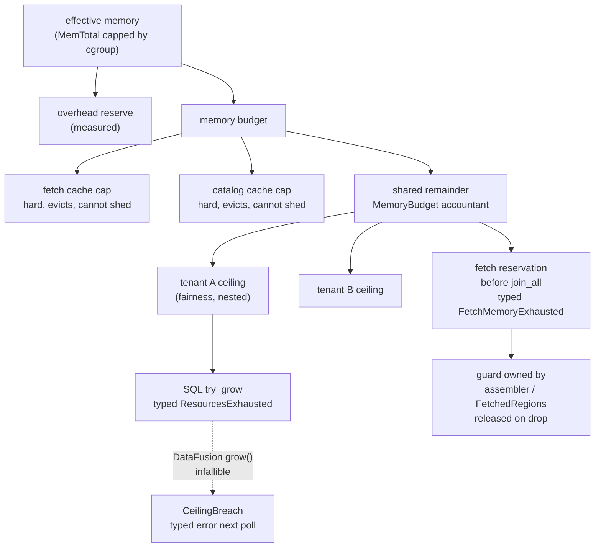

# ADR-1170: One process-wide memory budget for ravel-server

Status: Proposed

## Context

Issue #1170, the design gate that epic #1191 names as its last item.

`ravel-server` derives its memory ceilings from the host (#1141, PR #1166) and
enforces each in a different component that knows nothing of the others. The
kernel has killed the server three times on the reference box for it, and a
10-connection diagnostic window on that box reproduces the kill on demand.

### What was measured

Reference box: c6a.4xlarge, 16 cores, 30 GiB, ClickBench tenant of 2,617
objects and 11.24 GB, `a0eedfbf` with the allocator and cache residency gauges
from `Refs: #1170`, 10 concurrent connections for 600 s.

The read cache fills to the whole corpus in 41 s and never evicts, because its
cap (then 80% of MemTotal, 26.3 GB) is larger than the corpus. On top of that
floor the query and fetch working set oscillates between 3.9 and 15.0 GB, then
recedes. It is concurrent demand, not a leak. The kill lands when a spike meets
the floor.

A sweep over the cache cap, same window:

| cache cap | error ratio | peak RSS | peak non-cache |
| --- | --- | --- | --- |
| 4 GiB | 3.5% | 20.0 GB | 18.1 GB |
| 6 GiB | 3.9% | 24.6 GB | 20.8 GB |
| 8 GiB | 4.4% | 23.7 GB | 18.3 GB |
| 12 GiB | 99.7% | 24.8 GB | 17.2 GB |
| unbounded | 99.8% | killed | 15.0 GB |

The load-bearing column is `peak non-cache`: 17 to 21 GB **regardless of the
cache cap**. The query and fetch working set for ten connections is about
20 GB and is independent of cache sizing, so the constraint is a subtraction,
`cache <= usable - query demand - overhead`, and 80% could never satisfy it.
That first fix has landed: `CACHE_MEMORY_PERCENT` is 25
(`services/ravel-server/src/config.rs:1578`, commit `0964b01d`, with the sweep
table in its doc comment).

Two things the sweep does NOT establish, and this ADR takes both seriously.
Capping the cache does not make the server stable: every arm was dead by the
end of its window, the 6 GiB arm surviving 600 s and dying eight minutes later
while idle. And the residual 3 to 4% of errors are not one known-bad statement;
they spread across q15-q19 and q31-q35.

A separate A/B with the fetch policy as the only variable, at concurrency 256:
whole-object fetches complete 43 of 43 at 19.4 GB peak; ranged fetches are
killed at statement 31 with the kernel reporting 31.1 GB. The ranged path is
the one that cuts cold query time by 46% (#1185). It is unusable as a default
because nothing bounds its memory.

### What the code does today

Verified against the tree at `4e5c0ea8`.

- **Derivation** is one pure function, `resolve_performance_defaults`
  (`config.rs:1762-1865`), over `HostProfile { cores, mem_total_bytes }`, where
  `mem_total_bytes` is already capped by cgroup v2 `memory.max` or v1
  `memory.limit_in_bytes` (`config.rs:1467-1513`). Shares: fetch cache 25%,
  catalog cache 5%, SQL per-query 25%, SQL per-tenant 50%, with exact-integer
  tests (`config.rs:4896-4904`). The per-query share nests inside the
  per-tenant share (`crates/ravel-sql/src/memory.rs:321-336` charges the same
  bytes to both), so the sum for one tenant is 80%, not 135%. The per-tenant
  share is per `TenantHash` (`crates/ravel-sql/src/executor.rs:459-470`), so N
  active tenants can reserve N x 50%.
- **Two of the four ceilings are eviction caps, not reservations.** The fetch
  cache and the catalog byte cache are the same `ravel_cache::Cache` type;
  `S3Fifo::insert` evicts to bounds (`crates/ravel-cache/src/s3fifo.rs:144-192,
  251-273`) and never fails. Neither cache can be asked to shed to a target: the
  public surface is `get`, `insert`, `get_or_fetch`, `len`, `total_bytes`, and
  `evict_to_bounds` is private with one caller. A hit is a `Bytes` refcount
  bump (`cache.rs:43-46`), so evicting an entry frees nothing until every
  reader drops it.
- **The SQL pool has one fallible seam.** `TenantDelegatingPool::try_grow`
  (`memory.rs:321-348`) charges query then tenant and returns
  `ResourcesExhausted` on refusal; `grow` (`memory.rs:264-310`) cannot decline,
  because DataFusion's `MemoryReservation::resize` and its join operators call
  it with unchecked deltas, so it records a `CeilingBreach` that the query
  stream turns into a typed error on its next poll (`executor.rs:1805-1815`).
  Every reservation ravel-sql itself makes uses `try_grow` (`scan.rs:598,
  736`, `logs_scan.rs:3118, 3156, 3181`, `late_materialization.rs:769, 782`,
  `spans_scan.rs:776`, `alerts_scan.rs:350`, `audit_scan.rs:281`), including
  the scan reservation #837 and ADR-0954 found non-spillable. The pool can
  consult only its tenant accountant, its breach cell and its accounting; the
  accountant's own doc (`memory.rs:68-75`) reserves the seam: "When a
  process-wide accountant lands, this becomes a thin adapter over it."
- **In-flight fetch bytes are charged to nothing.** The `GetLimiter`
  (`crates/ravel-query/src/limiter.rs:29-31`) bounds GETs in flight, a count.
  Permits are released before decode (`fetcher.rs:731-754`,
  `log_fetcher.rs:1017-1019`); the bytes outlive the permit. RSEG's
  `ensure_ranges` (`fetcher.rs:995-1073`) issues every coalesced run in one
  `join_all` and retains every response in `FetchedRegions`; RLOG's block-range
  path assembles the whole object (`ObjectAssembler`, `log_fetcher.rs:3041-3047`,
  `covering_read` 3432-3499) and `fetch_blocks` / `fetch_chunk_ranges` join
  every range at once (5322, 4971). The `AssemblyBufferPool`
  (`log_fetcher.rs:2893-2905`) is a free-list bounding idle buffers, not live
  ones. ADR-0996 states the bound as "formally unbounded `permits x
  object_size`" until #1007, and #1007 has not landed.
- **The startup log names each ceiling and no aggregate**
  (`ResolvedPerformanceDefaults::emit`, `config.rs:1876-1953`). There is no
  gauge for SQL or fetch reservations; `TenantMemoryAccountant::reserved`
  has no caller in the server. The allocator gauge
  `ravel_process_allocator_bytes{stat="resident"}` and
  `ravel_cache_resident_bytes` exist (`services/ravel-server/src/metrics.rs:
  2427-2568`).

### Constraints a governor has to satisfy

Found by review of a draft that did not, recorded on the ticket, and confirmed
by the code above:

1. Reservations must follow allocation ownership, not request lifetime. A GET
   completing frees nothing; the assembler and the retained `Bytes` own the
   memory through decode and scan.
2. The minimum-progress unit is not knowable at admission. Object sizes and
   selected ranges come from resolve and planning.
3. `join_all` cannot degrade. Both fetch paths launch every range and retain
   every result; "reserve less and lower concurrency" is not available without
   a scheduler rewrite, and for RSEG a lower concurrency retains the same total.
4. The ceiling cannot be RSS. MemTotal and `memory.max` are kill boundaries;
   DataFusion's `grow` allocates before a breach is detectable. The honest
   claim is "tracked allocations are bounded, with a measured overhead
   reserve".

And the standing rule from ADR-0954: exact result via bounded spill, or a typed
failure, never a partial answer.

## Decision

One process-wide accountant that the existing per-tenant accountants adapt to,
a byte reservation at the fetch layer where the unit is known, a static carve so
the startup sum is under the budget by construction, and the aggregate made
visible. Four parts; the first two are the substance.

### 1. `MemoryBudget`, a process-wide accountant

A new leaf crate, `ravel-memory`, with no store I/O and no dependency beyond
std: `MemoryBudget { limit, reserved: AtomicU64 }` with fallible `try_reserve(n)
-> Result<Reservation, MemoryExhausted>`, and `Reservation` an RAII guard that
releases on drop. Ownership follows the guard, which follows the allocation:
whoever holds the buffer holds the guard. That is constraint 1 by construction.

`TenantMemoryAccountant` becomes the adapter its doc already reserves: its
`try_grow` charges the tenant counter, then `MemoryBudget::try_reserve`; a
refusal at either level rolls the other back and surfaces as the existing
`ResourcesExhausted`. The per-tenant ceiling stays as a fairness limit nested
inside the process limit, so N tenants can no longer reserve N x 50%. The
infallible `grow` path is unchanged: it records overshoot into the process
counter and trips `CeilingBreach` exactly as today, so a DataFusion-internal
overshoot still ends in a typed error one batch later, not in a kernel kill
nobody can attribute.

### 2. A fetch byte reservation at the points where the unit is known

The fetch layer reserves from the same budget before it issues, at the sites
where the byte count is known before the GET:

- RSEG: the sum of coalesced run lengths in `ensure_ranges`, reserved once
  before the `join_all`, guard stored alongside `FetchedRegions`.
- RLOG block-range: the object size at `ObjectAssembler` construction, guard
  owned by the assembler; and the summed range lengths before the `join_all`
  in `fetch_blocks` and `fetch_chunk_ranges`.
- RLOG whole-object: the object size at the `GetRange::Full` sites in
  `fetch_accounted` and `whole_object_bytes`.

A refusal is a typed `FetchMemoryExhausted`, mapped to the query's existing
error path, never a smaller fetch and never a partial result. This is
constraint 3 taken at its word: a `join_all` path that cannot degrade must
refuse before it issues, and it refuses with the unit it actually needs, which
is constraint 2 answered by reserving at fetch time rather than at admission.
Reservations are released when the buffer is dropped, not when the GET
completes.

Concurrency knobs stop being the only thing bounding fetch memory. Raising
`--store-get-concurrency` to 256 with a ranged policy becomes a throughput
choice whose memory cost is charged and refused, instead of the kernel's
problem. That is the precondition ADR-1196 needs before a latency-first policy
can be a default.

### 3. A static carve under one number

`resolve_performance_defaults` derives one `memory_budget_bytes` from the
cgroup-capped effective memory minus an overhead reserve. The two caches keep
hard eviction caps carved from it (they cannot shed, so they cannot share);
SQL and fetch draw from the remainder through the accountant, with the
per-tenant ceiling as the fairness bound within it. The sum of hard caps plus
the shared remainder equals the budget by construction, and startup refuses a
flag combination whose hard caps alone exceed it.

The overhead reserve is a measured number, not a guess: the gap between
`ravel_process_allocator_bytes{stat="resident"}` and the sum of tracked
reservations under the 10-connection window, plus margin. The ADR does not fix
it; the first measurement under decision 4 does, and the constant's doc comment
carries the figure the way `CACHE_MEMORY_PERCENT`'s does.

### 4. The aggregate, visible and asserted

- `emit` logs one more line: the budget, the sum of hard caps, the shared
  remainder, and the overhead reserve, with `source=`.
- Gauges: `ravel_memory_budget_bytes`, `ravel_memory_reserved_bytes{component=
  "sql"|"fetch"}`, beside the existing cache residency and allocator gauges.
- Pre-registered acceptance, same box, same tenant, same 600 s window at 10
  connections, three consecutive runs: zero kernel kills; every over-budget
  query ends in `ResourcesExhausted` or `FetchMemoryExhausted`; error ratio at
  or below the 6 GiB arm's 3.9%; peak `ravel_process_allocator_bytes{resident}`
  at or below budget plus overhead reserve. A run that survives with resident
  above that band has an untracked allocation and fails the gate.

### What lands where

| Part | Crates |
| --- | --- |
| `MemoryBudget`, `Reservation`, `MemoryExhausted` | new `ravel-memory` |
| Accountant adapter, process counter in `grow` overshoot | ravel-sql |
| Fetch reservations, `FetchMemoryExhausted` | ravel-query |
| Carve, startup refusal, `emit` aggregate, gauges | ravel-server |
| Docs: query-engine memory section, operations guide, flag reference | docs |

The PromQL path has no memory pool at all today (`memory.rs:167-169`); its
fetch buffers are covered by part 2 through the shared fetcher, and a PromQL
pool is out of scope here.

## Rejected alternatives

**Cache eviction under SQL pressure (the ticket's shape 1).** Wrong trigger,
wrong lever. The bytes that spike are fetch buffers, which no SQL pool sees, so
SQL pressure is not the signal that precedes the kill. The caches have no shed
API, the pool has no handle to them, and evicting an entry frees nothing while
a reader holds the `Bytes`. It could act only on `try_grow`, leaving the
infallible `grow` overshoot untouched.

**Static caps only, SQL share derived from memory minus cache ceilings (shape
3).** Pure arithmetic in the existing derivation, exactly testable, and it
brings one tenant's startup sum under 100%. It bounds nothing that was
measured: fetch bytes stay uncharged, N tenants still multiply, `grow`
overshoot is untouched. Part 3 of the decision keeps its arithmetic and adds
the accountant it lacks.

**Reserve at admission.** The unit is unknown there (constraint 2). A
worst-case reservation at admission serialises every query behind the largest
possible object; a small one arrives too late to prevent the hold-and-wait it
was meant to prevent.

**Reserve per request and release on GET completion.** Undercounts exactly at
the peak: the assembler and the retained regions own the bytes through decode
and scan (constraint 1).

**Lower concurrency under pressure instead of refusing.** Not an available
behaviour on either fetch path; `join_all` launches everything and retains
everything, and for RSEG a lower width retains the same total (constraint 3).

**Use RSS or `memory.max` as the ceiling.** Kill boundaries, not budgets;
`grow` has already allocated by the time a breach is visible (constraint 4).
The budget bounds tracked allocations and the acceptance test measures the
residual against a stated reserve.

**Land #1007 first.** It bounds the whole-object path's resident size by
decoding per sub-range. The configuration that was killed at 31.1 GB routes
ranged and never reaches that path, so #1007 is worth doing and is not the
unblocker; the ticket's own correction says so.

**A PromQL memory pool in the same change.** Real gap, separate ADR.

## Consequences

Over-budget work fails with a typed error naming the component instead of the
kernel killing the process, and the process survives to answer the next query.
The startup log states one number that the operator can compare with the box.

The ranged fetch policy becomes admissible as a default candidate, because its
memory is now a charged, refused quantity rather than an unbounded one; that is
the gate ADR-1196 waits behind.

Costs, named: a new leaf crate; an atomic add and subtract on every fetch
issue and drop and on every SQL reservation; refusals on queries that used to
succeed by overshooting into headroom another component was not using. The
last is the point, and the acceptance band says how many refusals are
acceptable.

Report only, found while verifying: ADR-0107's 2026-09-05 amendment
(`docs/adrs/0107-pruning-proportional-logs-fetch.md:322-324`) still says the
RLOG whole-object funnel issues GETs without a permit; `fad582c7` closed that
and `docs/query-engine.md:703-707` is current.
