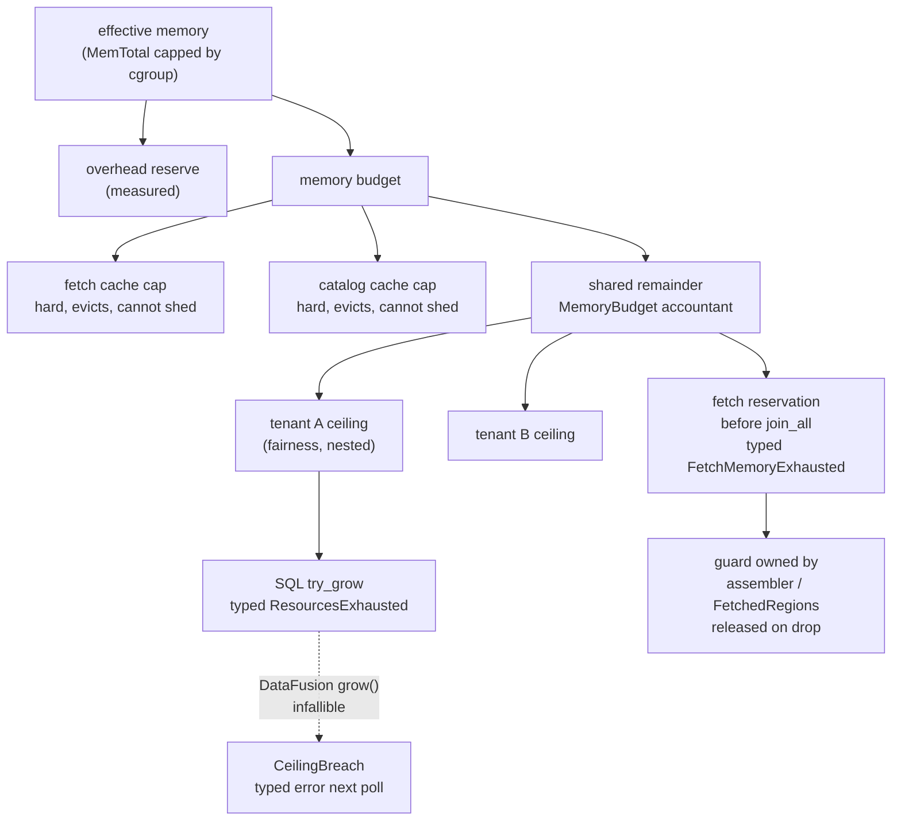

# ADR-1170: One process-wide memory budget for ravel-server

Status: Proposed

## Context

Issue #1170, the design gate that epic #1191 names as its last item.

`ravel-server` derives its memory ceilings from the host (#1141, PR #1166) and
enforces each in a different component that knows nothing of the others. The
kernel has killed the server three times on the reference box for it, and a
10-connection diagnostic window on that box reproduces the kill on demand.

### What was measured

Reference box: c6a.4xlarge, 16 cores, 30 GiB, ClickBench tenant of 2,617
objects and 11.24 GB, `a0eedfbf` with the allocator and cache residency gauges
from `Refs: #1170`, 10 concurrent connections for 600 s.

The read cache fills to the whole corpus in 41 s and never evicts, because its
cap (then 80% of MemTotal, 26.3 GB) is larger than the corpus. On top of that
floor the query and fetch working set oscillates between 3.9 and 15.0 GB, then
recedes. It is concurrent demand, not a leak. The kill lands when a spike meets
the floor.

A sweep over the cache cap, same window:

| cache cap | error ratio | peak RSS | peak non-cache |
| --- | --- | --- | --- |
| 4 GiB | 3.5% | 20.0 GB | 18.1 GB |
| 6 GiB | 3.9% | 24.6 GB | 20.8 GB |
| 8 GiB | 4.4% | 23.7 GB | 18.3 GB |
| 12 GiB | 99.7% | 24.8 GB | 17.2 GB |
| unbounded | 99.8% | killed | 15.0 GB |

The load-bearing column is `peak non-cache`: 17 to 21 GB **regardless of the
cache cap**. The query and fetch working set for ten connections is about
20 GB and is independent of cache sizing, so the constraint is a subtraction,
`cache <= usable - query demand - overhead`, and 80% could never satisfy it.
That first fix has landed: `CACHE_MEMORY_PERCENT` is 25
(`services/ravel-server/src/config.rs:1578`, commit `0964b01d`, with the sweep
table in its doc comment).

Two things the sweep does NOT establish, and this ADR takes both seriously.
Capping the cache does not make the server stable: every arm was dead by the
end of its window, the 6 GiB arm surviving 600 s and dying eight minutes later
while idle. And the residual 3 to 4% of errors are not one known-bad statement;
they spread across q15-q19 and q31-q35.

A separate A/B with the fetch policy as the only variable, at concurrency 256:
whole-object fetches complete 43 of 43 at 19.4 GB peak; ranged fetches are
killed at statement 31 with the kernel reporting 31.1 GB. The ranged path is
the one that cuts cold query time by 46% (#1185). It is unusable as a default
because nothing bounds its memory.

### What the code does today

Verified against the tree at `4e5c0ea8`.

- **Derivation** is one pure function, `resolve_performance_defaults`
  (`config.rs:1762-1865`), over `HostProfile { cores, mem_total_bytes }`, where
  `mem_total_bytes` is already capped by cgroup v2 `memory.max` or v1
  `memory.limit_in_bytes` (`config.rs:1467-1513`). Shares: fetch cache 25%,
  catalog cache 5%, SQL per-query 25% (now 50%, see the per-query SQL share
  amendment below), SQL per-tenant 50%, with exact-integer
  tests (`config.rs:4896-4904`). The per-query share nests inside the
  per-tenant share (`crates/ravel-sql/src/memory.rs:321-336` charges the same
  bytes to both), so the sum for one tenant is 80%, not 130%. The per-tenant
  share is per `TenantHash` (`crates/ravel-sql/src/executor.rs:459-470`), so N
  active tenants can reserve N x 50%.
- **Two of the four ceilings are eviction caps, not reservations.** The fetch
  cache and the catalog byte cache are the same `ravel_cache::Cache` type;
  `S3Fifo::insert` evicts to bounds (`crates/ravel-cache/src/s3fifo.rs:144-192,
  251-273`) and never fails. Neither cache can be asked to shed to a target: the
  public surface is `get`, `insert`, `get_or_fetch`, `len`, `total_bytes`, and
  `evict_to_bounds` is private with one caller. A hit is a `Bytes` refcount
  bump (`cache.rs:43-46`), so evicting an entry frees nothing until every
  reader drops it.
- **The SQL pool has one fallible seam.** `TenantDelegatingPool::try_grow`
  (`memory.rs:321-348`) charges query then tenant and returns
  `ResourcesExhausted` on refusal; `grow` (`memory.rs:264-310`) cannot decline,
  because DataFusion's `MemoryReservation::resize` and its join operators call
  it with unchecked deltas, so it records a `CeilingBreach` that the query
  stream turns into a typed error on its next poll (`executor.rs:1805-1815`).
  Every reservation ravel-sql itself makes uses `try_grow` (`scan.rs:598,
  736`, `logs_scan.rs:3118, 3156, 3181`, `late_materialization.rs:769, 782`,
  `spans_scan.rs:776`, `alerts_scan.rs:350`, `audit_scan.rs:281`), including
  the scan reservation #837 and ADR-0954 found non-spillable. The pool can
  consult only its tenant accountant, its breach cell and its accounting; the
  accountant's own doc (`memory.rs:68-75`) reserves the seam: "When a
  process-wide accountant lands, this becomes a thin adapter over it."
- **In-flight fetch bytes are charged to nothing.** The `GetLimiter`
  (`crates/ravel-query/src/limiter.rs:29-31`) bounds GETs in flight, a count.
  Permits are released before decode (`fetcher.rs:731-754`,
  `log_fetcher.rs:1017-1019`); the bytes outlive the permit. RSEG's
  `ensure_ranges` (`fetcher.rs:995-1073`) issues every coalesced run in one
  `join_all` and retains every response in `FetchedRegions`; RLOG's block-range
  path assembles the whole object (`ObjectAssembler`, `log_fetcher.rs:3041-3047`,
  `covering_read` 3432-3499) and `fetch_blocks` / `fetch_chunk_ranges` join
  every range at once (5322, 4971). The `AssemblyBufferPool`
  (`log_fetcher.rs:2893-2905`) is a free-list bounding idle buffers, not live
  ones. ADR-0996 states the bound as "formally unbounded `permits x
  object_size`" until #1007, and #1007 has not landed.
- **The startup log names each ceiling and no aggregate**
  (`ResolvedPerformanceDefaults::emit`, `config.rs:1876-1953`). There is no
  gauge for SQL or fetch reservations; `TenantMemoryAccountant::reserved`
  has no caller in the server. The allocator gauge
  `ravel_process_allocator_bytes{stat="resident"}` and
  `ravel_cache_resident_bytes` exist (`services/ravel-server/src/metrics.rs:
  2427-2568`).

### Constraints a governor has to satisfy

Found by review of a draft that did not, recorded on the ticket, and confirmed
by the code above:

1. Reservations must follow allocation ownership, not request lifetime. A GET
   completing frees nothing; the assembler and the retained `Bytes` own the
   memory through decode and scan.
2. The minimum-progress unit is not knowable at admission. Object sizes and
   selected ranges come from resolve and planning.
3. `join_all` cannot degrade. Both fetch paths launch every range and retain
   every result; "reserve less and lower concurrency" is not available without
   a scheduler rewrite, and for RSEG a lower concurrency retains the same total.
4. The ceiling cannot be RSS. MemTotal and `memory.max` are kill boundaries;
   DataFusion's `grow` allocates before a breach is detectable. The honest
   claim is "tracked allocations are bounded, with a measured overhead
   reserve".

And the standing rule from ADR-0954: exact result via bounded spill, or a typed
failure, never a partial answer.

## Decision

One process-wide accountant that the existing per-tenant accountants adapt to,
a byte reservation at the fetch layer where the unit is known, a static carve so
the startup sum is under the budget by construction, and the aggregate made
visible. Four parts; the first two are the substance.

### 1. `MemoryBudget`, a process-wide accountant

A new leaf crate, `ravel-memory`, with no store I/O and no dependency beyond
std. `MemoryBudget { limit, reserved: AtomicU64 }` exposes two shapes over one
counter, because its two consumers account differently:

- Counter operations for the SQL adapter: `try_reserve(n) -> Result<(),
  MemoryExhausted>` (a CAS against `limit`), `reserve_unchecked(n)` (the
  infallible path, may overshoot), and `release(n)`. `TenantMemoryAccountant`
  already keeps grow and shrink as separate counter operations
  (`memory.rs:105-130`) and `TenantDelegatingPool` already forwards every
  DataFusion `grow`, `try_grow` and `shrink` to it 1:1 with rollback on
  refusal (`memory.rs:264-348`; a held aggregate's shrink is the one
  exception, see the aggregate hold amendment below, until the
  hold-removal amendment below removes it); the adapter forwards
  each of those to the
  process counter with the same delta, in the same order, so process-level
  bytes track SQL bytes exactly: tenant then process on the way up, process
  then tenant on the way down, and a refusal at either level rolls the other
  back before surfacing as `ResourcesExhausted`. No guard is held across a
  query; the counters are the ledger, as they are today.
- An RAII `Reservation` guard for the fetch layer, a thin wrapper that calls
  `try_reserve` on construction and `release` on drop. Ownership follows the
  guard, which follows the allocation: whoever holds the buffer holds the
  guard. That is constraint 1 by construction for buffers, and the SQL
  adapter's explicit shrink is constraint 1 for reservations DataFusion
  resizes.

The per-tenant ceiling stays as a fairness limit nested inside the process
limit, so N tenants can no longer reserve N x 50%.

The infallible `grow` path keeps its shape: `reserve_unchecked` records the
overshoot into the process counter and `CeilingBreach` trips exactly as today,
so a DataFusion-internal overshoot ends in a typed error on the stream's next
poll (`executor.rs:1805-1815`). What that path cannot promise is stated, not
hidden: the bytes are allocated before the breach is visible, and a delta larger
than the headroom between the budget and the kill boundary kills the process
before the next poll runs. The overshoot per poll is bounded by what DataFusion
allocates between two polls of the query stream, one batch per partition, so
the exposure is `partitions x max batch bytes` per query, and it ADDS across
statements that reach `grow` in the same interval. The bound that matters is
therefore the aggregate, `max_concurrent_queries x partitions x max batch
bytes`, where `max_concurrent_queries` is the server's existing admission cap
(`--max-concurrent-queries`, `services/ravel-server/src/config.rs:483`,
enforced by `QueryAdmissionController`). The overhead reserve in decision 3
must exceed that aggregate; a deployment that leaves the cap unset has an
unbounded exposure, and the startup aggregate line in decision 4 says so in
words rather than printing a number that is not a bound. The acceptance in
decision 4 says what a kill that slips through counts as.

### 2. A fetch byte reservation at the points where the unit is known

The fetch layer reserves from the same budget before it issues, at the sites
where the byte count is known before the GET:

- RSEG: the sum of coalesced run lengths in `ensure_ranges`, reserved once
  before the `join_all`, guard stored alongside `FetchedRegions`.
- RLOG block-range, as first decided (the 2026-09-28 ranged-read amendment
  below retires it): the object size at `ObjectAssembler` construction, guard
  owned by the assembler; and the summed range lengths before the `join_all`
  in `fetch_blocks` and `fetch_chunk_ranges`.
- RLOG whole-object: the object size at the `GetRange::Full` sites in
  `fetch_accounted` and `whole_object_bytes`.

A refusal is a typed `FetchMemoryExhausted`, mapped to the query's existing
error path, never a smaller fetch and never a partial result. This is
constraint 3 taken at its word: a `join_all` path that cannot degrade must
refuse before it issues, and it refuses with the unit it actually needs, which
is constraint 2 answered by reserving at fetch time rather than at admission.
Reservations are released when the buffer is dropped, not when the GET
completes.

Buffers outlive the fetch layer, so the guard needs a handoff rule, and the
rule is: **every LIVE byte is under at least one of three ledgers at every
instant, the cache cap, a fetch guard, or an SQL reservation; a handoff may
put a byte under two, and that overlap is accounted rather than tolerated, but
no byte may ever be under none.** Coverage is the invariant and a gap is the
violation; the overlap is measured by `handoff_overlap` so `unique` can
subtract it. "Exactly one" was the original wording and it contradicted the
handoff cases immediately below it. Concretely:

- A fetched buffer handed to an SQL scan is charged by that scan's own
  `try_grow` (the `LogScanStream` reservation over pending and emitted buffers,
  `crates/ravel-sql/src/logs_scan.rs:2992-3068`, and `scan.rs:598` for RSEG),
  which now reaches the same process budget through the adapter. The fetch
  guard is released only after that `try_grow` has succeeded, so the bytes are
  double-counted from the handoff until the buffer drops (see the 2026-09-06
  amendment below, which corrects an earlier "width of one call" reading) and
  never uncounted. A `try_grow`
  refusal at handoff drops the buffer and surfaces the SQL error; the fetch
  guard's release follows the drop.
- A buffer inserted into a cache is covered by the cache's hard cap from the
  insert onward; the fetch guard is released after the insert. A `Bytes` that a
  reader retains after the cache evicts it is covered by that reader's ledger:
  the SQL reservation for a scan, the fetch guard for a consumer without a
  pool (PromQL today), which is why the guard rides with the `Bytes` in
  `FetchedRegions` rather than with the request.
- A buffer that reaches no consumer (an error between fetch and handoff) is
  released by the guard's drop, as any RAII value is.

The static cache carve bounds residency, not references; the handoff rule is
what bounds the references, and it is what a review of a draft without it
found missing.

Concurrency knobs stop being the only thing bounding fetch memory. Raising
`--store-get-concurrency` to 256 with a ranged policy becomes a throughput
choice whose memory cost is charged and refused, instead of the kernel's
problem. That is the precondition ADR-1196 needs before a latency-first policy
can be a default.

#### Amendment (2026-09-06, Refs: #1254)

<!-- amendment-applies: sections="2. A fetch byte reservation at the points where the unit is known|3. A static carve under one number" pointer="2026-09-06 amendment" -->

Reviewing the implemented fetch reservations against the text above found two
claims that describe an intended design the code does not implement. The
decision stands; these correct its accounting description and record the sites
that are not yet reserved or tracked.

1. **The SQL cross-boundary overlap lasts the buffer's life, not "the width of
   one call."** The bullet above says a fetched buffer handed to an SQL scan has
   its fetch guard "released only after that `try_grow` has succeeded, so the
   bytes are double-counted for the width of one call." The fetch layer cannot
   do this: it returns the `Bytes` before the SQL layer calls `try_grow`, and
   the guard rides inside those `Bytes` (`attach_reservation` /
   `Bytes::from_owner`, `log_fetcher.rs`, `span_fetcher.rs`). So on the SQL
   path the fetch reservation and the scan's `try_grow` reservation coexist for
   the whole life of the buffer in the scan, releasing only when the consumer
   drops the `Bytes`, not for one call. This is the same lifetime
   `docs/query-engine.md` already describes.

2. **`unique` is not exact by construction.** Decision 3 defines
   `unique = cache_resident + sql_reserved + fetch_reserved - handoff_overlap`
   and calls it exact. `handoff_overlap` counts only overlaps that call
   `Reservation::mark_handed_off`, and the only site that does is a cache
   *insert* (`Source::Upstream`, `log_fetcher.rs`/`span_fetcher.rs`). Two real
   overlaps are therefore not in the gauge, so `unique` overstates the tracked
   total by their size:
   - the SQL cross-boundary overlap from correction 1 (fetch guard riding in the
     returned `Bytes` while the scan also holds its `try_grow`), never marked;
   - a cache **hit** (`Source::Cache`), where the returned buffer is the resident
     cache entry and the fetch guard reserves the same bytes the cache cap
     already holds. This one is now marked in both fetchers, so the residual `d`
     below was believed to be the SQL boundary alone -- the first 2026-09-13
     amendment below found a third untracked site (`covering_read`'s insert
     branch), and the second found a fourth class (RSEG's `ensure_ranges` plus
     every `ObjectAssembler`-based multi-GET path), so that is no longer the
     case; the reasoning is kept because it is the same shape and because a hit
     was as real an overlap as an insert all along.

   The direction is an overcount of `unique` by the untracked overlap `d`, and
   that overcount does not stop at the decision-4 acceptance assertion: decision
   3's frozen reserve is `max_t(resident_t - unique_t) x 1.25` (plus margin),
   calibrated from the SAME overstated `unique_t`. Subtracting a too-large
   `unique_t` understates `resident_t - unique_t` by `d` at calibration time, so
   the frozen reserve is itself undersized by about `1.25 x d`, not merely
   `unique`'s term in the assertion. At acceptance time the same overcount raises
   `unique_t` by `d` again, so the assertion's RHS, `unique_t + reserve`, nets to
   about `0.25 x d` BELOW what it would be with an exact `unique`: the assertion
   is tighter than intended, not looser, because the reserve lost more to the
   overcount than the `unique_t` term gained back. A tighter assertion is not
   free slack: the frozen reserve is also required to exceed the `partitions x
   max batch bytes` exposure from decision 1 (the infallible-`grow` overshoot
   bound), and an `1.25 x d`-undersized reserve can fail to clear that bound
   even where it looks like it clears the acceptance band, which is a safety
   property, not headroom to spend. The calibration run must therefore do one
   of two things, not silently ship the 1.25 constant unchanged: either mark
   the handoff at the remaining untracked site first (the SQL boundary) so
   calibration measures an exact `unique` and the reserve is derived from the
   true `resident_t - unique_t`, or, if calibration still runs against the
   overstated `unique`, measure and record the residual `d` (now the SQL
   cross-boundary overlap alone, sampled the same way as
   `ravel_memory_handoff_overlap_bytes` would if it covered it) and widen the
   multiplier to cover `1.25 x d` on top of the existing margin, with that
   arithmetic in the constant's doc comment. Making `unique` exact means
   marking the handoff at these two sites too (or subtracting them another
   way), which is follow-up work; until it lands, the reserve derivation must
   account for `d` explicitly rather than assume the overcount is harmless.

**Known-unreserved / not-yet-enforcing sites** (the budget observes nothing at
these until a finite budget is wired and, for the last two, the overlap is
marked):

- RSPAN fetchers and every fetcher `build_sql_state` constructs
  (`services/ravel-server/src/query.rs`) reserve against their default
  `MemoryBudget::unlimited()`: `QueryEngine::with_memory_budget` reaches only its
  `fetcher` and `log_fetcher`, and no server task installs a finite budget yet.
  (See the decision 2 server amendment below: `ravel-server` now installs the
  process budget on its PromQL, fragment and cache-warm fetchers.
  The SQL fetcher amendment below records that `build_sql_state`'s fetchers,
  the server's only RSPAN fetcher among them, now reserve against it too.)
- The SQL cross-boundary overlap is untracked by `handoff_overlap`. The
  cache-hit overlap was too, and is now marked at every cache-hit call site,
  and `covering_read`'s own cache-insert branch and RSEG's `ensure_ranges`
  reservation are now marked too (2026-09-13 second amendment below). The
  residual is the SQL boundary plus a materially larger, previously
  unenumerated class: every `ObjectAssembler`-based multi-GET reservation in
  `log_fetcher.rs` (see the second amendment), not the SQL boundary alone.
- **Idle assembly buffers.** The invariant above is stated over LIVE bytes for
  a reason: `AssemblyBuffer::drop` returns its allocation to
  `AssemblyBufferPool`'s free list, not to the allocator, so those bytes stay
  resident under none of the three ledgers. This is structural to every RLOG
  path, not to any one of them, and it is bounded separately by
  `MAX_IDLE_ASSEMBLY_BUFFERS` and `MAX_IDLE_ASSEMBLY_BYTES` per fetcher, which
  is why it is a known gap rather than an unbounded one. It matters most at the
  coverage crossover, which drops its assembler before the covering read
  reserves fresh: the reservation figure is then one object while residency is
  briefly two, until the pool hands that buffer to the next read or evicts it.
  Anything comparing `resident_t` against reserved totals, decision 4's
  acceptance assertion included, must count the pool's idle bytes on the
  resident side or it will read the difference as an accounting error. (The
  pool is gone since the 2026-09-28 ranged-read amendment below, and this gap
  with it.)

#### Amendment (2026-09-13, Refs: #1170)

<!-- amendment-applies: sections="Amendment (2026-09-06, Refs: #1254)" pointer="first 2026-09-13 amendment" -->

The 2026-09-06 amendment above marked cache hits in the whole-object funnel
(`log_fetcher.rs`/`span_fetcher.rs`, `Source::Cache`) and concluded that doing
so left the SQL boundary as the only untracked overlap. That conclusion
undercounted by one call site: `BlockRangeFetcher::covering_read`'s
single-GET branch (`log_fetcher.rs`, used both directly and by
`whole_object_bytes`'s above-threshold segmented funnel) also returns a
cache-resident buffer on a hit, and left it unmarked. That branch is now
marked too.

Marking it exposed a second, distinct gap the whole-object funnel does not
have: `covering_read`'s single-GET branch also leaves a cache **insert**
(`cached_extent` returning `live == true`, the `Source::Upstream` equivalent)
unmarked. The whole-object funnel and both `span_fetcher` call sites mark
their insert arm (the original decision-2 behavior); `covering_read` never
did. Reproduced directly: a fetch of an object above the suffix-probe window
(so the probe and the covering read land on different cache keys) and below
`max_fetch_run_bytes` (so it takes the single-GET branch) leaves
`handoff_overlap()` at `0` while the covering read's buffer is held, though
the same bytes just went to cache with the store's own eviction cap covering
them.

So after this amendment the untracked residual `d` in decision 2's `unique`
expression is the SQL cross-boundary overlap (still unmarked) **plus**
`covering_read`'s cache-insert overlap (also still unmarked), not the SQL
boundary alone. Both are the same shape as an already-marked site elsewhere
in the same file, so closing either is a mirror of existing code, not new
design; neither is done in this amendment; the reserve derivation must
account for both terms of `d`, or mark both sites, before decision 3's
`1.25 x d` sizing can be measured against a value smaller than what the
calibration run linked from decision 2 already computes. (Both were marked
by the second amendment below, which also found a fourth and larger
untracked class, so this paragraph's residual is no longer current.)

#### Amendment (2026-09-13, second pass, Refs: #1170)

<!-- amendment-applies: sections="Amendment (2026-09-06, Refs: #1254)|Amendment (2026-09-13, Refs: #1170)|3. A static carve under one number" pointer="second amendment" -->

Both sites the amendment above left open are now marked:
`covering_read`'s single-GET cache-insert branch (`log_fetcher.rs`), and a
site this ADR never enumerated at all -- RSEG's
`SegmentFetcher::ensure_ranges` (`fetcher.rs`), whose reservation covers a
`join_all`-coalesced batch of ranges that `guarded_get` routes through
`cached_get` whenever a cache is configured, on a hit or a miss alike. This
ADR's residual discussion has only ever tracked the RLOG (`log_fetcher.rs`)
and RSPAN (`span_fetcher.rs`) paths; RSEG had the identical shape of gap and
was simply never audited for it. Both fixes decide handoff from
`self.cache.is_some()` at the batch level rather than from any individual
sub-fetch's `Source`/`live` result, since `mark_handed_off` is idempotent and
whole-reservation-granularity, and every cache-eligible sub-range in such a
batch becomes cache-resident (hit or insert) whenever a cache exists at all.

Closing those two was the prompt for a full sweep of every `reserve_fetch`
call site in `ravel-query` (fetcher.rs, log_fetcher.rs, span_fetcher.rs),
grepping `reserve_fetch`, `mark_handed_off`, and the cache-`Source`/`live`
discriminant together. The result is that the residual does **not** shrink
to the SQL boundary alone: it shrinks by two sites and grows by a fourth,
previously undocumented class, which is materially larger than either fixed
site. Every `ObjectAssembler`-based multi-GET reservation in `log_fetcher.rs`
leaves `mark_handed_off` uncalled on every branch, hit or miss:

- `covering_read`'s own segmented branch (`log_fetcher.rs`, the
  `ObjectAssembler` loop past the single-GET early return): the reservation
  moves into the assembler and neither the hit nor the miss arm of its
  per-range `cached_extent` call marks it.
- `fetch_object_with_footer`'s asm-owned reservation.
- `fetch_object_v4` and the helpers it feeds (`fetch_blocks`,
  `fetch_chunk_ranges`): `fetch_chunk_ranges` and `fetch_blocks` each also
  hold their own *transient* pre-`join_all` reservation, the same shape
  `ensure_ranges` had, also unmarked.
- Inside `fetch_blocks`, a raw `cache.get`/`cache.insert` pair (the
  already-resident-from-probe branch) that never goes through
  `reserve_fetch` or a reservation at all: verified bytes are inserted into
  the cache with no ledger overlap recorded on either side, because there is
  no reservation live at that point to mark.

`ObjectAssembler` exposes no method to mark handoff on the `Reservation` it
owns, so none of these close with a one-line mirror of this round's fix; each
needs either a handoff-marking method added to `ObjectAssembler` or a
restructure of the call site. None of this is fixed in this pass -- it is
scope beyond the two sites this round closed -- and it is reported rather
than silently patched, per this repo's contradiction/bug-outside-scope rule.

So after this second amendment the untracked residual `d` in decision 2's
`unique` expression is the SQL cross-boundary overlap (still unmarked, and
outside `ravel-query`) **plus** the `ObjectAssembler`-based multi-GET class
above (also still unmarked, and larger in call-site count than either of the
two sites this round closed), not the SQL boundary alone. The reserve
derivation must account for both terms, or close the `ObjectAssembler` class,
before decision 3's `1.25 x d` sizing can be measured against a value smaller
than what the calibration run linked from decision 2 already computes. (The
2026-09-28 ranged-read amendment below closes the `ObjectAssembler` class.)

### 3. A static carve under one number

`resolve_performance_defaults` derives one `memory_budget_bytes` from the
cgroup-capped effective memory minus an overhead reserve. The two caches keep
hard eviction caps carved from it (they cannot shed, so they cannot share);
SQL and fetch draw from the remainder through the accountant, with the
per-tenant ceiling as the fairness bound within it. The sum of hard caps plus
the shared remainder equals the budget by construction, and startup refuses a
flag combination whose hard caps alone exceed it (the 2026-09-07 amendment
below exempts `--disable-cache` from this refusal). On a loopback store the
fetch cache takes a larger share, and `--cache-max-bytes` no longer sizes the
catalog cache: see the loopback amendment below. A gateway derives no budget
and is not refused: see the gateway amendment below. The budget no longer
starts from all of `MemTotal` on a host without a cgroup limit: see the
available-memory amendment below.

The overhead reserve is a measured number, not a guess, and it is measured in
a calibration run that is separate from, and frozen before, the acceptance
runs, so the acceptance assertion is not circular. Calibration: parts 1, 2 and
4 landed, the budget set to unlimited so nothing is refused, the same
10-connection window; the reserve is the maximum over the window of
`ravel_process_allocator_bytes{stat="resident"}` minus the UNIQUE tracked
total, plus a 25% margin, rounded up to the next 256 MiB, and it must exceed
the `partitions x max batch bytes` exposure in decision 1. The 2026-09-07
amendment below records that the value landed as a round placeholder, not
yet this measured figure.

The unique total is not the sum of the ledgers, because the handoff rule
deliberately lets a buffer sit in two ledgers for the width of one call, and a
sum that counts those bytes twice overstates what is tracked and undersizes
the reserve. The fetch layer therefore keeps one more gauge,
`ravel_memory_handoff_overlap_bytes`: a fetch guard adds its size to it the
moment the receiving `try_grow` or cache insert succeeds and subtracts it on
its own drop, so the gauge is exactly the bytes currently in two ledgers.
`unique = cache_resident + sql_reserved + fetch_reserved - handoff_overlap`,
and the same expression is what the acceptance assertion in decision 4
subtracts.

This paragraph originally said that expression was exact by construction. It is
exact only if every overlap is marked, which the first implementation did not
achieve: see the 2026-09-06 amendment and the two 2026-09-13 amendments under
decision 2. Cache hits are now marked at
every call site, and so are `covering_read`'s cache-insert branch and RSEG's
`ensure_ranges` reservation (2026-09-13, second amendment), but two classes of
overlap remain unmarked: the SQL cross-boundary one, where the fetch guard and
the scan's `try_grow` both cover the buffer, and every `ObjectAssembler`-based
multi-GET reservation in `log_fetcher.rs` (also the second amendment), a
larger class than either site just closed. (The 2026-09-28 ranged-read
amendment below marks that class.) Until both are marked, `unique` is
an upper bound, the reserve derived from it is undersized by roughly 1.25
times their combined residual, and the calibration run must either mark them
first or measure the residual and widen the multiplier. The margin covers
allocator slack and sampling, not accounting
overlap, so it cannot be leaned on to absorb this. That value lands as a
constant in the derivation with the calibration figures in its doc comment, the
way `CACHE_MEMORY_PERCENT` carries the sweep, in a commit that precedes the
first acceptance run. The acceptance runs then use the frozen value and can
fail against it: resident above `budget + reserve` in acceptance means an
allocation that calibration did not see, which is a finding, not a recalibration.

### 4. The aggregate, visible and asserted

- `emit` logs one more line: the budget, the sum of hard caps, the shared
  remainder, and the overhead reserve, with `source=`.
- Gauges: `ravel_memory_budget_bytes`, `ravel_memory_reserved_bytes{component=
  "sql"|"fetch"}`, and `ravel_memory_handoff_overlap_bytes` (the bytes
  currently in two ledgers, so the unique tracked total is computable), beside
  the existing cache residency and allocator gauges.
- Pre-registered acceptance, same box, same tenant, same 600 s window at 10
  connections, three consecutive runs after the reserve is frozen: every
  over-budget query ends in a typed error, `ResourcesExhausted` (which is also
  what a `CeilingBreach` surfaces as: the breach is the mechanism that records
  an infallible-`grow` overshoot, and the query stream maps it to the same
  `SqlError::ResourcesExhausted` on its next poll, `executor.rs:1805-1815,
  1961-1980`) or `FetchMemoryExhausted`;
  error ratio at or below the 6 GiB arm's 3.9%; and, pointwise over every
  sample `t` of the window, `resident_t <= unique_t + frozen reserve`, which is
  `max_t(resident_t - unique_t) <= frozen reserve` with both figures from the
  SAME scrape, never a peak of one against a peak of the other, where unique
  subtracts the handoff overlap gauge; the runs set `--max-concurrent-queries`
  to the window's connection count (10) so the exposure bound is finite and
  the reserve is checked against it; and zero kernel kills attributable to a tracked ledger. A kill is
  attributable to the infallible `grow` path only if the SUM of the unchecked
  deltas in the breach records of every statement in flight at the kill (each
  statement's stream records its own `CeilingBreach`) exceeds the reserve;
  several deltas each below the reserve that add past it are exactly the
  aggregate case, and are attributed the same way. Such a kill is itself a
  finding against the reserve's sizing, recorded and re-run, not accepted. A run that survives with resident above the band has an untracked
  allocation and fails the gate.

```mermaid
flowchart TD
    M["effective memory<br/>(MemTotal capped by cgroup)"] --> R["overhead reserve<br/>(measured)"]
    M --> B["memory budget"]
    B --> C1["fetch cache cap<br/>hard, evicts, cannot shed"]
    B --> C2["catalog cache cap<br/>hard, evicts, cannot shed"]
    B --> P["shared remainder<br/>MemoryBudget accountant"]
    P --> T1["tenant A ceiling<br/>(fairness, nested)"]
    P --> T2["tenant B ceiling"]
    T1 --> S["SQL try_grow<br/>typed ResourcesExhausted"]
    P --> F["fetch reservation<br/>before join_all<br/>typed FetchMemoryExhausted"]
    S -.->|"DataFusion grow()<br/>infallible"| X["CeilingBreach<br/>typed error next poll"]
    F --> G["guard owned by<br/>assembler / FetchedRegions<br/>released on drop"]
```

### What lands where

| Part | Crates |
| --- | --- |
| `MemoryBudget`, `Reservation`, `MemoryExhausted` | new `ravel-memory` |
| Accountant adapter, process counter in `grow` overshoot | ravel-sql |
| Fetch reservations, `FetchMemoryExhausted` | ravel-query |
| Carve, startup refusal, `emit` aggregate, gauges | ravel-server |
| Docs: query-engine memory section, operations guide, flag reference | docs |

The PromQL path has no memory pool at all today (`memory.rs:167-169`); its
fetch buffers are covered by part 2 through the shared fetcher, and a PromQL
pool is out of scope here.

## Rejected alternatives

**Cache eviction under SQL pressure (the ticket's shape 1).** Wrong trigger,
wrong lever. The bytes that spike are fetch buffers, which no SQL pool sees, so
SQL pressure is not the signal that precedes the kill. The caches have no shed
API, the pool has no handle to them, and evicting an entry frees nothing while
a reader holds the `Bytes`. It could act only on `try_grow`, leaving the
infallible `grow` overshoot untouched.

**Static caps only, SQL share derived from memory minus cache ceilings (shape
3).** Pure arithmetic in the existing derivation, exactly testable, and it
brings one tenant's startup sum under 100%. It bounds nothing that was
measured: fetch bytes stay uncharged, N tenants still multiply, `grow`
overshoot is untouched. Part 3 of the decision keeps its arithmetic and adds
the accountant it lacks.

**Reserve at admission.** The unit is unknown there (constraint 2). A
worst-case reservation at admission serialises every query behind the largest
possible object; a small one arrives too late to prevent the hold-and-wait it
was meant to prevent.

**Reserve per request and release on GET completion.** Undercounts exactly at
the peak: the assembler and the retained regions own the bytes through decode
and scan (constraint 1).

**Lower concurrency under pressure instead of refusing.** Not an available
behaviour on either fetch path; `join_all` launches everything and retains
everything, and for RSEG a lower width retains the same total (constraint 3).

**Use RSS or `memory.max` as the ceiling.** Kill boundaries, not budgets;
`grow` has already allocated by the time a breach is visible (constraint 4).
The budget bounds tracked allocations and the acceptance test measures the
residual against a stated reserve.

**Land #1007 first.** It bounds the whole-object path's resident size by
decoding per sub-range. The configuration that was killed at 31.1 GB routes
ranged and never reaches that path, so #1007 is worth doing and is not the
unblocker; the ticket's own correction says so.

**A PromQL memory pool in the same change.** Real gap, separate ADR.

## Consequences

Over-budget work fails with a typed error naming the component instead of the
kernel killing the process, and the process survives to answer the next query.
The startup log states one number that the operator can compare with the box.

The ranged fetch policy becomes admissible as a default candidate, because its
memory is now a charged, refused quantity rather than an unbounded one; that is
the gate ADR-1196 waits behind.

Costs, named: a new leaf crate; an atomic add and subtract on every fetch
issue and drop and on every SQL reservation; refusals on queries that used to
succeed by overshooting into headroom another component was not using. The
last is the point, and the acceptance band says how many refusals are
acceptable.

A residual the design does not remove: DataFusion's infallible `grow` can
allocate past the budget before the next poll detects it, so process survival
is guaranteed for tracked allocations and bounded, not guaranteed, for that
path, by the overhead reserve exceeding `partitions x max batch bytes`. A
budget that made that path fallible would need a DataFusion change or a
pool that lies to `resize`, which desynchronises the reservation; neither is
taken here.

Report only, found while verifying: ADR-0107's 2026-09-05 amendment said the
RLOG whole-object funnel issues GETs without a permit; `fad582c7` closed
that, `docs/query-engine.md`'s "GET concurrency (ADR-1195)" section is
current, and the amendment has since been corrected to match.

## Amendment 2026-09-07 (issue #1255): decisions 3 and 4 landed

<!-- amendment-applies: sections="3. A static carve under one number" pointer="2026-09-07 amendment" -->

Decisions 3 and 4 landed in `ravel-server`. `resolve_performance_defaults`
derives `memory_budget_bytes` from cgroup-capped effective memory minus
`MEMORY_OVERHEAD_RESERVE_BYTES` (both in
`services/ravel-server/src/config.rs`); both cache carves rebase
onto it; startup refuses with a typed `MemoryBudgetExceeded` rather than
clamping when an explicit `--cache-max-bytes` pushes the two hard caps above
the budget; `emit` logs the derivation one line per figure; and `/metrics`
exposes `ravel_memory_budget_bytes`, `ravel_memory_reserved_bytes{component=
"sql"|"fetch"}`, and `ravel_memory_handoff_overlap_bytes` in every mode.

`--disable-cache` is outside the carve and outside the refusal. The process
then builds neither cache (`store::build_cache` returns `None`,
`query::build_catalog` forces the byte cache's `0` sentinel), so both hard
caps are `0`, the remainder is the whole budget, and `check_memory_budget`
returns `Ok`. Decision 3's "hard caps plus remainder equals the budget"
identity still holds; what changes is that the caps are not the two resolved
cache ceilings on that path. The refusal cannot fire on a process that holds
no cache memory, which is what keeps `--disable-cache` usable as the remedy
the caching guide names it as, and what keeps a container whose effective
memory is at or below the overhead reserve (budget `0`, caps `0`, refused by
the `>=` comparison with no flag able to satisfy it) starting as it did
before this decision landed. That is the one path allowed to run with a `0`
remainder, and `emit` WARNs on it. (Since the small-host reserve amendment
below, a derived budget under 256 MiB, including the `0` of a container at
or below its reserve, refuses with its own message unless `--disable-cache`
is set.)

Decision 1's accountant adapter is also already in place in `ravel-sql`
(`TenantMemoryAccountant::with_process_budget`, `crates/ravel-sql/src/
memory.rs`), forwarding each tenant `grow`/`try_grow`/`shrink` to the same
process-wide counter this amendment's gauges read; `SqlExecutor` and
`MetricsState` now share one `Arc<ravel_memory::MemoryBudget>` instance built
from `memory_remainder_bytes` (`ServerConfig::process_memory_budget_bytes` is
filled from it in `services/ravel-server/src/main.rs`, and `start` builds the
single `Arc` in `services/ravel-server/src/lib.rs`), so `component="sql"`
reads real reservations, not a placeholder.

One process-wide counter for every tenant means a cross-tenant cascade,
which the accountant wiring above does not state on its own: once any one
tenant's infallible `grow` (`reserve_unchecked`'s saturating add) pushes the
shared counter above `limit`, every OTHER tenant's next `try_reserve(n > 0)`
-- including a 1-byte one -- also fails, until the first tenant's `shrink`
releases enough for the counter to fall back under `limit`. This follows
directly from `reserve_unchecked` and `try_reserve`'s `reserved + n <= limit`
comparison (`crates/ravel-memory/src/lib.rs`), and it is faithful to decision
1 as designed, not a new defect introduced by landing it: decision 1
deliberately made `grow` infallible and shared the counter process-wide, and
a cascade is the necessary consequence of both choices together. A later
acceptance run (M5) must count cascade-caused `try_grow` refusals separately
from the breaching tenant's own `grow` overshoot: pooling the two into one
error-rate figure hides whether a band was blown by one tenant's breach or
by the cascade it triggered against every other tenant sharing the counter.

(See the decision 2 server amendment below: this paragraph no longer holds.)
Decision 2 has not landed in the server: `ravel-query`'s fetchers do reserve
fetch bytes and mark their cache handoffs, but each one carries a private
`MemoryBudget::unlimited` unless a caller installs a shared instance, and
`ravel-server` installs it on none of them. So nothing reserves against the
budget these gauges read, and both `component="fetch"` and
`ravel_memory_handoff_overlap_bytes` always read `0`. That is the one
piece decisions 3 and 4 depend on without providing: the fetch-side kill this
ADR opened with is not yet charged or refused by anything landed here, only
observed through the existing allocator and cache-residency gauges as before.

`MEMORY_OVERHEAD_RESERVE_BYTES` is, as landed, the round provisional 2 GiB
that its own doc comment in `services/ravel-server/src/config.rs` names a
placeholder (that comment also states the calibration rule that will
replace it), not the measured
figure decision 3 specifies and a frozen calibration run would produce.
Decision 1's aggregate
exposure bound for the infallible `grow` path, `max_concurrent_queries x
partitions x max batch bytes`, must stay under whatever reserve is in force
for that path's blast radius to stay bounded; that inequality has not been
checked, because the calibration run decision 3 specifies has not been made,
and a deployment that leaves `--max-concurrent-queries` unset carries an
unbounded left-hand side against this constant right-hand side today. Landing
decisions 3 and 4 narrows the regression this ADR opened with (the
25%-of-MemTotal cache carve, `#1395`) without yet closing the kill this ADR
analyzes: an infallible-`grow` overshoot is still bounded only by a
provisional constant, and fetch-layer memory is still uncharged until
decision 2 lands and a calibration run freezes the reserve against it. The
small-host reserve amendment below takes a quarter of effective memory capped
at the 2 GiB, so less below 8 GiB, or the memory the mode holds outside the
budget when that is more, which is above 2 GiB at an ingest ceiling above
1.75 GiB; the 2 GiB value itself is still this uncalibrated placeholder.

## Amendment 2026-09-26 (issue #1255): decision 2 reaches the server

<!-- amendment-applies: sections="Amendment (2026-09-06, Refs: #1254)|Amendment 2026-09-07 (issue #1255): decisions 3 and 4 landed" pointer="decision 2 server amendment" -->

`ravel-server` now installs the process `MemoryBudget` on the PromQL
`QueryEngine`, on the distributed `FragmentService` (both the remote-worker
path and the coordinator's local path) and on the cache warm pass, the same
`Arc` the SQL executor receives. PromQL-path RSEG and RLOG fetches therefore
reserve against it: `component="fetch"` and
`ravel_memory_handoff_overlap_bytes` read real values while a fetch is held,
and a fetch that needs more than the remaining budget fails with
`FetchMemoryExhausted`, returned as 503. A refused warm fetch is skipped and
logged, not a startup failure.

Still unreserved against this budget: the RSPAN fetcher and every fetcher
`build_sql_state` constructs, which keep their private
`MemoryBudget::unlimited()` (no longer true: see the SQL fetcher amendment
below). The M5 reserve calibration (#1256) remains open.

## Amendment (2026-09-26, ADR-2023): a loopback fetch-cache share and a catalog cache sized on its own

<!-- amendment-applies: sections="3. A static carve under one number" pointer="loopback amendment" -->

Decision 3's 25% fetch-cache share stays for every deployment except one whose
store is on loopback. There the fetch cache derives at a larger share, measured
against the concurrent phase before it ships (ADR-2023, #2014).
`--cache-max-bytes` bounds the fetch cache only; the catalog byte cache derives
at its own share unless `--catalog-cache-max-bytes` sets it. The refusal of a
combination whose caps exceed `memory_budget_bytes` is unchanged.

## Amendment (2026-09-28): a ranged read reserves what it holds

<!-- amendment-applies: sections="2. A fetch byte reservation at the points where the unit is known|Amendment (2026-09-06, Refs: #1254)|Amendment (2026-09-13, second pass, Refs: #1170)|3. A static carve under one number" pointer="2026-09-28 ranged-read amendment" -->
<!-- amendment-supersedes: phrase="the object size at `ObjectAssembler` construction" pointer="2026-09-28 ranged-read amendment" -->

Issue #2066 measured what decision 2's object-sized reservation stood for. As
measured in that issue's heap profile, on a tenant of roughly 16 MB log objects
read byte-minimal on S3, 2,948 MiB of the 4,011 MiB live at q29's peak sat in
the assembly buffers of about 180 ranged reads in flight across 32 partitions,
each buffer the length of the whole object however few bytes the read placed in
it. None of it was cache, and ten concurrent queries pushed the server into
swap. That profile is not in this repository: the figures above are its report,
not something a checked-in fixture reproduces.

A ranged RLOG read now holds only the regions it placed. `ObjectAssembler`
keeps each placed region as the `Bytes` it was given, at its absolute offset,
with no copy (the version-4 runs and sections are the fetched buffers
themselves; version 3's per-block split still copies each verified block out
of its run), and hands the reader a source over exactly those regions
(`ravel_logseg::SparseObject`); a read of any other range inside the object
fails typed with `LogSegError::Unplaced`. There is no object-sized buffer and no buffer pool,
so the idle-buffer gap recorded under the 2026-09-06 amendment is gone with
them. The RLOG block-range bullet of decision 2 becomes:

- Each GET that places bytes reserves its own length before it is issued: the
  suffix probe, a footer chase, each directory section or section span, and
  the tail placed for a carried footer. The version-4 chunk runs reserve their
  summed length once before the `join_all` in `fetch_chunk_ranges`, as
  before; that guard is now the durable one, because the run buffers are the
  placed regions. The version-3 `fetch_blocks` reserves the summed length of
  the blocks it places and, transiently, the summed run length, both before
  its `join_all`. A cache hit placed with no GET reserves its length before it
  is placed.
- The guards travel with the placed regions, in the assembler and then in the
  bytes it hands the reader, and release when the last clone of those bytes
  drops. A refusal is a typed `FetchMemoryExhausted` and the refused GET is
  never issued; the regions the read had already placed release as the
  assembler drops.
- The coverage crossover still drops the assembler before the covering read
  reserves the object. `covering_read`'s segmented branch keeps its
  whole-object reservation, since a covering read holds every byte, but keeps
  each sub-range as fetched instead of copying it into an object-sized buffer.

With a cache configured every placed region is offered to the cache, so every
assembler guard is marked handed off whether or not the cache admitted it,
the same convention the whole-object funnel already follows. A hit and an
admitted miss really are the cache's own entry held under both ledgers; a
value the cache refused (over its single-entry cap) and a disk-tier hit that
allocated afresh are not, so `handoff_overlap` bounds the overlap from above
rather than counting it exactly. That closes the `ObjectAssembler`-based class
the 2026-09-13 second amendment left unmarked; the SQL cross-boundary overlap
is the residual that remains.

`BlockRangeFetcher::assembly_buffer_stats` keeps its gauge with the new
meaning: `live_bytes` is the placed bytes assembled reads hold, and
`peak_live_bytes` its high-water mark. The pool counters (`allocated`,
`reused`, `zeroed_bytes`) are retired.

## Amendment (2026-09-29, issue #2086): the SQL path's fetchers reserve against the budget

<!-- amendment-applies: sections="Amendment (2026-09-06, Refs: #1254)|Amendment 2026-09-26 (issue #1255): decision 2 reaches the server" pointer="SQL fetcher amendment" -->

`build_sql_state` (`services/ravel-server/src/query.rs`) now installs the
process `MemoryBudget` on the three fetchers it builds, the RSEG metrics, RLOG
logs and RSPAN spans fetchers, the same `Arc` the SQL executor already held.
That RSPAN fetcher is the only one `ravel-server` builds, so no server fetcher
outside tests still reserves against a private unlimited budget. A SQL fetch
the budget cannot admit fails with `FetchMemoryExhausted` and answers 503
(`unavailable`) over HTTP, distinct from the SQL memory pool's own refusal,
which answers 422. The tests
`a_sql_{metrics,logs,spans}_fetch_over_the_process_budget_is_refused_and_the_process_keeps_serving`
and `sql_logs_query_reserves_a_nonzero_fetch_gauge_while_the_get_is_held` in
`services/ravel-server/src/tests.rs` pin each fetcher's wiring through the
real HTTP router.

The SQL cross-boundary overlap named under decision 2 is now charged in
production. A SQL scan charges the batches it decodes to the SQL pool, which
draws on this same budget, while the fetch guard for the bytes they were
decoded from may still be live, so the two ledgers can count overlapping
bytes and `handoff_overlap` does not see it. `unique` overcounts by that
overlap; the M5 reserve calibration (#1256) has to account for it as the
decision 2 text above already requires.

## Amendment (2026-09-30): a gateway uses no memory budget

<!-- amendment-applies: sections="3. A static carve under one number" pointer="gateway amendment" -->

Decision 3 derived the budget, and refused startup against it, in every mode.
Only three modes use it. `all` and `query` build the query surface: the fetcher
cache, the SQL executor and the fetchers that reserve against the shared
accountant. `maintain` folds through the catalog, so its catalog byte cache
holds memory. `gateway` builds no query surface and runs no fold, so nothing in
it reads through either cache or reserves against the accountant, and it was
refused anyway: under a cgroup memory limit of 2 GiB or less the budget
derives to `0`, the two carves to `0`, and the `>=` comparison refused a
process that claimed none of that memory. (Under the small-host reserve
amendment below, the other modes derive a positive budget under such a limit
and start once it is a little over 341 MiB; a gateway still derives none.)

`--mode gateway` now derives no budget. `memory_budget_bytes` and the shared
remainder resolve to `u64::MAX`, the hard caps to `0`, and each cache ceiling
to its explicit flag (source `flag`) or else `0` (source `not-applicable`).
No
overhead reserve is subtracted, `check_memory_budget` does not refuse, and the
startup log prints one line saying the budget is not applicable in gateway mode
in place of the four budget figures. `ravel_memory_budget_bytes` on a gateway's
`/metrics` reads `u64::MAX`, the unlimited value, since nothing reserves there.
Every other mode derives, carves and refuses exactly as decision 3 and the
amendments above describe, with the same message.

## Amendment (2026-10-03, ADR-2414 decision B1): the per-query SQL share is the tenant's share

<!-- amendment-applies: sections="What the code does today" pointer="per-query SQL share amendment" -->
<!-- amendment-supersedes: phrase="SQL per-query 25%" pointer="per-query SQL share amendment" -->

The derived per-query SQL pool is now 50% of `MemTotal`, equal to the
per-tenant share, so a lone statement may use the tenant's whole SQL share
(`SQL_QUERY_MEMORY_PERCENT` in `services/ravel-server/src/config.rs`; 16,106,127,360
bytes each on the 30 GiB reference host). The per-query pool still nests
inside the per-tenant pool, so the per-tenant total and the 80% sum for one
tenant are unchanged. A second concurrent statement no longer has a guaranteed
quarter of memory; it gets what the first left. An explicit
`--sql-max-query-bytes` still wins: over an explicit `--sql-tenant-max-bytes`
it is clamped to that ceiling, and over a derived or fallback tenant ceiling it
raises the ceiling to match, as before. An operator who wants the earlier
split sets the flag to half the tenant ceiling, 25% of `MemTotal`. The reasoning and the measured statement that motivated it
are in ADR-2414. The derived SQL pools are now also capped by the budget's
shared remainder: see the available-memory amendment below.

## Amendment (2026-10-03, issue #2367): the budget starts from available memory

<!-- amendment-applies: sections="3. A static carve under one number|Amendment (2026-10-03, ADR-2414 decision B1): the per-query SQL share is the tenant's share" pointer="available-memory amendment" -->

**What was measured.** On the 32 GB reference host, at `v0.21.0`, ten
concurrent connections running ClickBench's statement mix got the server
OOM-killed three times in 600 s, each time at 28.86 to 28.96 GB anonymous RSS.
The full result is on issue #2367. The derived budget there was 30,756,311,040
bytes: `MemTotal` (32,903,794,688) minus the 2 GiB overhead reserve. The same
host ran two object stores (minio and the ClickBench entry's RustFS) holding
2.0 to 2.4 GB between them. The upstream ClickBench entry runs RustFS on the
host it benchmarks, so a store on the same box is a shipping configuration,
not a test artefact. Budget plus co-resident memory came to 32.8 to 33.2 GB on
a 32.9 GB host, before the kernel. Decision 3 derives the budget as if the
server were alone on the host, and on that host it was not.

**Decision.**

1. On a host with no cgroup memory limit, `memory_budget_bytes` is derived
   from what is free when the server starts:
   `min(MemTotal - RESERVE, max(floor, MemAvailable + own_rss - RESERVE))`,
   every subtraction saturating, where `RESERVE` is
   `MEMORY_OVERHEAD_RESERVE_BYTES` and `own_rss` is the server's resident set
   at the moment of derivation. The `min` is a stated rule, not a consequence
   of the arithmetic. `MemAvailable` is a kernel estimate that counts
   reclaimable page cache, and `own_rss` includes file-backed pages that the
   page cache already counts, so `MemAvailable + own_rss` can exceed
   `MemTotal`; the `min` keeps the budget at or below the old figure.
   `MemAvailable` counting page cache also means a host whose page cache is
   merely warm does not shrink the budget. Under a cgroup limit nothing
   changes: the limit is already the server's share, and memory outside the
   cgroup does not count against it.

   The host profile must carry what this branch needs. Today it holds one
   figure, `MemTotal` already capped by the cgroup limit, with no record of
   which won. It gains the uncapped `MemTotal`, the cgroup limit when one is
   set, and `MemAvailable`. The derivation applies item 1 only when no
   cgroup limit is set, and logs which branch it took. `/proc/meminfo` is
   not cgroup-aware, so applying the `MemAvailable` term inside a container
   would size the budget from the host's free memory, which this item
   forbids.

   The floor is 1 GiB. The 2026-09-07 amendment refuses startup only when
   the hard caps reach the budget, and the derived caps are fixed shares of
   the budget (30%, or 45% on loopback), so that refusal fires only at a
   budget of exactly 0. That happens when `MemAvailable + own_rss` is at or
   below the reserve, for example when a co-resident process holds nearly
   all of the host. Any budget above 0 starts, so the floor exists to keep
   that case from being a refusal. 1 GiB rather than the smallest value
   that starts is a usability choice: a budget that can serve a small
   statement. In the case it covers, free memory is at or below the
   reserve, so it accepts up to 1 GiB of overcommit, bounded and logged,
   where a 25% floor would have accepted gigabytes. The floor sits under
   the `min`, so it never lifts the budget above `MemTotal - RESERVE`. A
   host too small to fit the reserve still derives 0 and is still refused,
   as before this amendment. (The small-host reserve amendment below scales
   the reserve under 8 GiB and lifts it to the memory held outside the
   budget; a derived budget under 256 MiB, 0 included, now
   refuses with its own message instead.) When the floor binds, the derivation logs a
   warning naming the `MemAvailable` reading and `--memory-budget-bytes` as
   the remedy.
2. `--memory-budget-bytes` sets the budget explicitly and wins over both
   derivations. It is the escape hatch for a co-resident process that starts
   after the server, which a startup reading cannot see. Its resolved value is
   logged with `source="flag"`, like every other performance flag.
3. The derived SQL pools (`sql_tenant_max_bytes` and `sql_max_query_bytes`,
   50% of `MemTotal` each since the B1 amendment) are capped at 90% of the
   budget's shared remainder after the cache carve. The fetch ledger draws
   from the same remainder, including the SQL path's own fetchers, and a
   fetch the remainder cannot admit answers 503 (the SQL fetcher amendment
   above). A cap at the whole remainder would let one tenant at its ceiling
   leave the fetch side nothing, so 10% stays outside the SQL ceiling. The
   10% is a minimum headroom, not a figure sized to peak fetch demand. In
   the #2367 run, fetch reservations reached 16.98 GB on their own, and SQL
   reservations 14.19 GB, and no 5 s sample showed both high at once. A fetch that arrives while
   a tenant sits at its ceiling and the remaining 10% is already reserved
   still answers 503. The cap removes the case where the fetch side has no
   headroom at all; it does not size fetch concurrency. An explicit flag is
   not capped. The derivation logs whether the cap applied,
   as `clamped` does today.

On the reference host, with `MemAvailable` at 29,922,488,320 bytes read with no
Ravel process running, the budget is about 27,775,004,672 bytes. How it carves
depends on the store, because ADR-2023 gives a loopback store a larger fetcher
cache:

| store | fetcher cache | catalog cache | shared remainder | derived SQL pools |
|---|---|---|---|---|
| real S3 (the #1248 reference passes) | 25%, about 6.94 GB | about 1.39 GB | 19,442,503,271 | 16,451,897,344, not capped (90% of the remainder is 17,498,252,943) |
| loopback (the ClickBench entry's local RustFS) | 40%, 11,110,001,868 | 1,388,750,233 | 15,276,252,571 | **13,748,627,313, capped by item 3** |

The loopback row is the case item 3 exists for: 90% of the remainder after the
larger cache carve is below 50% of `MemTotal`. Both pool values are above q33's
measured peak reservation of 10,855,811,936 bytes, so the claim of 43 of 43
statements in the stock configuration still holds by derivation on both stores.
It is re-measured stock on that host before this lands.

The loopback fetcher cache falls from 12.3 GB to 11.11 GB. ADR-2023 sized its
40% share to hold the corpus, then 11.24 GB, and 11.11 GB would not. The corpus
the entry loads is now smaller, 9,844,635,064 bytes on v0.21.0 (#1248, the
v0.21.0 fresh-box result), so the reduced share still holds it. That is a
property of the current corpus and not of the share: a corpus above about
11.1 GB, or a host with less free memory, would leave warm runs reading part of
the store again. The figures that move with this amendment are in
`docs/internal/clickbench.md`, the configuration guide, the reference runbook
and ADR-2023's sizing paragraph, which gains a pointer here.

The derived figures now depend on a `MemAvailable` reading, so two stock passes
on the same host can resolve different ceilings. A published stock result
records the `MemAvailable` reading next to the resolved `performance default
resolved` lines. Two passes compared against each other (an A/B, a regression
check) pin `--memory-budget-bytes` to one value, so the budget is not the
variable that differs between them.

**What this does not fix.** The same run measured live jemalloc allocations
at least 9.25 GB above everything the ledgers reserved, even with both cache
ceilings counted as full. No memory refusal was logged, so the accounted total
never reached its ceiling before the kernel acted. A budget that fits the host
is a floor: it removes the case where perfect accounting would still overcommit
the host. It does not bound memory the ledgers never see. That remains issue
#2367, which stays open on attributing those allocation sites and charging them
to a ledger.

**Rejected.** Measuring co-resident processes by name (rustfs, minio) was
rejected: it is a list that is wrong on the next host. Re-deriving the budget
periodically while the server runs was also rejected: a budget that shrinks
under reservations already granted would have to revoke them, and this
decision keeps the budget fixed for the life of the process, as decision 3
does.

## Amendment (2026-10-05): the overhead reserve scales on small hosts (issue #2607)

<!-- amendment-applies: sections="Amendment 2026-09-07 (issue #1255): decisions 3 and 4 landed|Amendment (2026-09-30): a gateway uses no memory budget|Amendment (2026-10-03, issue #2367): the budget starts from available memory" pointer="small-host reserve amendment" -->

**What was found.** With default flags, `ravel-server` refused to start on
any host or container with 2 GiB of memory or less. On a t3a.small (`MemTotal`
1,912 MiB) the fixed 2 GiB reserve is more than the host has, so `MemTotal -
RESERVE` saturates to 0, the `min` of the available-memory amendment holds the
budget at 0 whatever the 1 GiB floor says, and startup refused with the
`cache_max_bytes` message, which names a flag that cannot help.

**Decision.**

1. The reserve is `max(min(MEMORY_OVERHEAD_RESERVE_BYTES, memory / 4),
   floor)`, where `memory` is what the derivation starts from: the cgroup
   limit under a cgroup memory limit, otherwise `MemTotal`. `floor` is the
   memory the process holds outside the budget, which the reserve must cover
   whatever the host's size: `NON_BUDGET_BASELINE_BYTES` (256 MiB), plus the
   resolved `--max-ingest-buffer-bytes` ceiling in a mode that holds the
   ingest buffer (`all`; a gateway holds it too but derives no budget). The
   ingest buffer is bounded by that flag and sits outside the budget, so
   without this term a quarter of a small host (478 MiB on a t3a.small) is
   less than the 512 MiB default ceiling alone. The floor wins over the
   2 GiB constant: an ingest ceiling above 1.75 GiB puts the floor above
   2 GiB, and the reserve is then the floor at every host size, so the
   budget, the ingest ceiling and the baseline fit in memory for every
   bounded ceiling. Under `0`, which leaves the buffer unbounded, the memory
   it holds cannot be accounted, and `floor` is the 2 GiB constant, so the
   reserve is 2 GiB at every host size. The 256 MiB baseline is
   uncalibrated, like the 2 GiB constant: it is a provisional allowance for
   the allocator, thread stacks and the runtime, not a measured figure.
   Every site that subtracts the reserve uses this rule: the three derived
   branches of `resolve_performance_defaults` (`derived-cgroup`,
   `derived-available` in both of its terms, and `derived`), and
   `ravel_maintain::host_memory_budget_bytes`, which `ravel-cli maintain`
   derives its merge budget from at the baseline floor alone, since it holds
   no ingest buffer. The rule is `effective_memory_overhead_reserve_bytes` in
   `crates/ravel-maintain/src/config.rs`, and the floor is
   `non_budget_floor_bytes` in `services/ravel-server/src/config.rs`; the
   2 GiB constant stays and now caps the quarter-of-memory term. The
   resolved reserve is logged as `memory_overhead_reserve_bytes` on a
   derived budget; a `--memory-budget-bytes` or fallback budget subtracts no
   reserve and does not log one.
2. At an ingest ceiling of 1.75 GiB or less (the default is 512 MiB), a
   host or container with a `MemTotal` (or cgroup memory limit) of 8 GiB or
   more is unchanged byte for byte: a quarter of 8 GiB is the 2 GiB
   constant, at or above the floor. So are the merge-target derivations at
   the default 20 GiB merge cursor budget, since below 8 GiB the host less
   its reserve is under 20 GiB either way and the merge budget is 0 in both.
   A larger ingest ceiling in `all` makes the reserve the floor at every
   size, so the budget is smaller than the fixed 2 GiB gave by the floor's
   excess over 2 GiB: a 3 GiB ceiling takes a 3.25 GiB reserve and derives a
   4,864 MiB budget on an 8 GiB host where the fixed reserve derived 6 GiB.
   That is the intended correction, not a regression: the old figure plus
   the ingest ceiling and the baseline came to 9.25 GiB. A nominal 8 GiB instance
   usually reports less: cloud providers commonly show a `MemTotal` of about
   7.6-7.8 GiB after firmware and kernel reservations, which is below the
   8 GiB line and falls on the scaled side, with its reserve about 50-100 MiB
   lower than the fixed 2 GiB.
3. A derived budget below 256 MiB (`MIN_DERIVED_MEMORY_BUDGET_BYTES`)
   refuses to start, before the hard-cap check, with its own message. It
   names `MemTotal` or the cgroup limit, the reserve taken from it, the
   resulting budget, and `--memory-budget-bytes` as the remedy, and not the
   cache caps. When the ingest term set the reserve, it also names
   `--max-ingest-buffer-bytes`, since lowering it is what leaves a larger
   budget. The smallest memory that starts is 512 MiB in `query` and
   `maintain` (the 256 MiB baseline reserve plus the 256 MiB minimum) and
   1 GiB in `all` at the default ingest ceiling (a 768 MiB reserve plus the
   minimum); in `all` it is the floor plus the minimum at any bounded
   ceiling, 3,584 MiB at a 3 GiB ceiling. An explicit
   `--memory-budget-bytes` is not held to this minimum, and neither is
   `--disable-cache`, which keeps the 2026-09-07 amendment's path for a
   container too small to cache: such a process starts and `emit` WARNs that
   the shared budget is below the minimum. A gateway derives no budget and is
   not checked.
4. The 1 GiB floor stays under the `min`, as the available-memory amendment
   states, so it still never lifts the budget above `MemTotal - RESERVE`; a
   600 MiB host in `query` derives 344 MiB (a 256 MiB reserve), not 1 GiB.

On the t3a.small (`MemTotal` 1,912 MiB), per mode, with default flags:

- `all`: the floor is 256 MiB plus the 512 MiB ingest ceiling, 768 MiB
  (805,306,368 bytes), above a quarter, so the reserve is 768 MiB and
  `MemTotal - RESERVE` is 1,144 MiB. With no cgroup limit the budget is
  `min(1,144 MiB, max(1 GiB, MemAvailable + own_rss - 768 MiB))`, between
  1 GiB and 1,144 MiB depending on what is free at startup; under a cgroup
  limit of the same size it is 1,144 MiB. At `--max-ingest-buffer-bytes
  134217728` the floor is 384 MiB and a quarter sets the reserve, as in
  `query`; at `0` the reserve is 2 GiB and the server refuses.
- `query` and `maintain`: no ingest buffer, so a quarter, 478 MiB
  (501,219,328 bytes), is above the 256 MiB baseline and sets the reserve.
  `MemTotal - RESERVE` is 1,434 MiB, and with no cgroup limit the budget is
  between 1 GiB and 1,434 MiB.
- `gateway`: no budget is derived and nothing is reserved.

At the 1 GiB floor the fetcher cache is 256 MiB, the catalog cache
53,687,091 bytes, and the shared remainder 751,619,277 bytes, in every mode
that derives a budget.

The zero-budget arm of the `cache_max_bytes` refusal is now reached only by
an explicit `--memory-budget-bytes 0`, and its message says so.

The 2 GiB constant is still the uncalibrated placeholder the 2026-09-07
amendment describes, and neither a quarter of memory nor the 256 MiB baseline
is more measured than it is. Decision 3's calibration run replaces all three;
until then, a small host's reserve is a proportion chosen so the budget is
positive, held at or above the memory it must cover outside the budget, not a figure
shown to cover the allocator and stacks on that host.

## Amendment (2026-10-09, #2633): an aggregate's shrink can be held

<!-- amendment-applies: sections="1. `MemoryBudget`, a process-wide accountant" pointer="aggregate hold amendment" -->

The decision says `TenantDelegatingPool` forwards every DataFusion `grow`,
`try_grow` and `shrink` to the counters 1:1. One shrink is no longer
forwarded at once: a `GroupedHashAggregateStream[..]` consumer that cannot
spill keeps its shrunk bytes charged until it unregisters, and its next
grow draws on them before charging anything new. The bytes stay counted in
every query, tenant and process figure the whole time, so the budgets never
read lower than what is live; they can read higher, by at most the
aggregate's own peak reservation, from its first shrink until its stream is
dropped. ADR-0102's aggregate hold amendment records why `can_spill`
selects it. The hold-removal amendment below removes this hold.

## Amendment (2026-10-10, #2720): the aggregate hold is removed

<!-- amendment-applies: sections="1. `MemoryBudget`, a process-wide accountant|Amendment (2026-10-09, #2633): an aggregate's shrink can be held" pointer="hold-removal amendment" -->

`TenantDelegatingPool` forwards every DataFusion `grow`, `try_grow` and
`shrink` to the counters 1:1 again, as decision 1 states. DataFusion 55's
grouped aggregation keeps an emitted batch reserved until the last
`batch_size` slice is cut from it, so the shrink the hold existed for no
longer arrives while the output is live, and the budgets no longer read
above what is reserved. ADR-0102's hold-removal amendment records the one
exception that remains: a shape DataFusion 55 still runs on its legacy
`GroupedHashAggregateStream` releases its output's bytes before handing the
output out.
