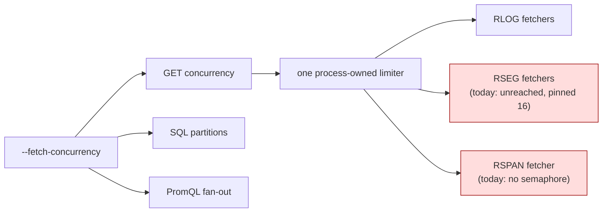

# ADR-1195: Unbundle `--fetch-concurrency`, and make GET concurrency a process-wide limit

- Status: Proposed
- Date: 2026-09-03
- Refs: #1195, #1191, #1170, #1185, ADR-0087, ADR-0088, ADR-0107

## Context

`--fetch-concurrency` is one flag driving four consumers:

```
crates/ravel-query/src/engine.rs:358, :369        with_max_concurrent_gets()  RLOG GET semaphore
services/ravel-server/src/query.rs:333            with_max_concurrent_gets()  RLOG GET semaphore
crates/ravel-sql/src/session.rs:540               with_target_partitions()    DataFusion partitions
crates/ravel-query/src/engine.rs:1366,1784,2092   buffer_unordered()          PromQL fan-out
```

This coupling is documented, not accidental: `docs/reference/ravel-server-flags.md:39`
names all three effects, and ADR-0088's amendment records the derived default
`max(8, 2 x cores)` while noting "it also sets the SQL scan partition count".
This ADR supersedes that part of ADR-0088's decision.

Two defects sit behind the one name.

**The GET-concurrency half never reaches two of the three fetchers.** The RSEG
`SegmentFetcher` is constructed bare at every site, so it keeps the compiled
`DEFAULT_MAX_CONCURRENT_GETS = 16` (`crates/ravel-query/src/fetcher.rs:127`)
whatever the operator sets: `crates/ravel-query/src/engine.rs:374`,
`services/ravel-server/src/query.rs:306`,
`services/ravel-server/src/distrib.rs:796`,
`services/ravel-server/src/cache_warm.rs:99`. `SpanSegmentFetcher` has no
semaphore at all (`crates/ravel-query/src/span_fetcher.rs:169-193`). PromQL and
the SQL metrics path therefore ignore the knob that documents itself as governing
their GET concurrency.

**A permit count is not a node limit.** `get_semaphore` is a field on each
fetcher instance (`crates/ravel-query/src/fetcher.rs:579`), and fetchers are
constructed independently per query engine, per SQL executor, and — in the
distributed path — per fragment request (`distrib.rs:796`). Giving each one N
permits admits a multiple of N concurrent GETs against the store, with no
process-level ceiling anywhere.

The performance case for raising GET concurrency on the whole-object path does
not survive scrutiny and is deliberately not claimed here. Stock at concurrency
32 against 256 measured 525.0 s against 486.0 s, but the implied per-statement
fixed cost differs by 1.1 s between those runs and the byte volume differs by
3.2%, so the 7.4% is not attributable to concurrency (#1185). This ADR is a
correctness and reachability fix. The configuration where concurrency
demonstrably matters is the ranged path (596.3 s of transfer at 32 against
171.0 s at 256), and selecting that path is ADR-1196's decision, not this one.



## Decision

**Three named knobs**, each with its own flag and its own derived default:

| Knob | Governs | Derived default |
|---|---|---|
| store GET concurrency | permits against the object store | `max(8, 2 x cores)`, unchanged from today's derived value |
| SQL partition count | DataFusion `target_partitions` | today's derived value, unchanged |
| PromQL fan-out | `buffer_unordered` width | today's derived value, unchanged |

No default moves. The SQL partition default in particular stays where it is:
`crates/ravel-sql/src/session.rs:540-544` sets `target_partitions` immediately
above `with_repartition_aggregations`, which ADR-0094 and ADR-0954 depend on, and
moving it silently would put those in scope.

**GET concurrency becomes one process-owned limiter**, an `Arc` constructed once
and shared by every query-side fetcher, replacing the per-fetcher semaphore. The
RSEG `SegmentFetcher` and `SpanSegmentFetcher` are wired to it at every
construction site. The flag then means what it says: a node-wide ceiling on
concurrent store GETs.

**Legacy precedence is explicit.** `--fetch-concurrency` remains, setting all
three. Supplying it together with any of the new flags is a **startup error**
naming both, not a silent precedence rule.

**Compatibility changes are named, not denied.** Two behaviours change for
existing deployments:

- RSEG and RSPAN fetchers begin honouring the GET limit. On a 16-core host that
  raises their effective concurrency from the compiled 16 to 32, and it makes
  them subject to a shared ceiling they previously escaped.
- The distributed fragment path stops being able to exceed the node limit by
  constructing a fetcher per fragment.

Both are the point of the change. Neither is invisible, so the release notes say
so rather than claiming no deployment is affected.

## Rejected alternatives

**Leave the flag bundled and document it better.** It is already documented
(`ravel-server-flags.md:39`); documentation is not the defect. The defects are
that two fetchers ignore the knob and that no ceiling is process-wide.

**Keep the per-fetcher semaphore and just wire it everywhere.** Simpler, and it
fixes reachability. Rejected because it leaves the multiplication: the
distributed path constructs a fetcher per fragment, so per-fetcher permits give
no node-level bound at all, which is the property an operator setting this flag
believes they are buying.

**Move the SQL partition default at the same time.** Tempting, since 256
partitions cost roughly 19 GB of process peak in measurement. Rejected: that
number is a whole-process peak that also contains the read cache and up to
11.24 GB of cached corpus, so it does not isolate the partition cost, and
changing that default pulls ADR-0094's aggregation gate into scope.

## Consequences

- The knob an operator sets for GET concurrency starts governing every fetcher
  and the process as a whole.
- ADR-0088's amendment is superseded in the part that records `fetch_concurrency`
  as the single knob for both scan fan-out and GET concurrency. ADR-0107 ties the
  RLOG pool sizing to the same flag and needs re-reading against the split before
  this lands.
- Three flags where there was one, plus a deprecated alias. The reference doc and
  the derived-defaults table both change.
- No performance claim. If a benchmark moves on this change alone, that is a
  finding to investigate, not the expected outcome.
