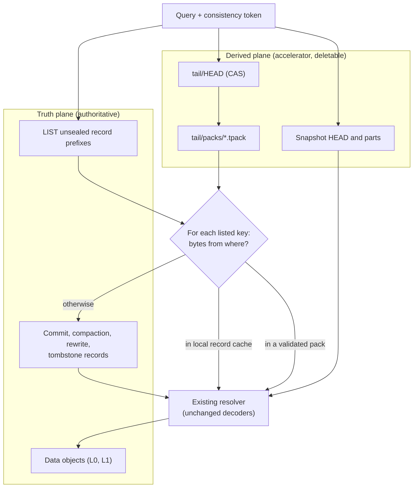

# ADR-1199: Bounded query I/O accounting, and a measured gate on tail checkpoints

Status: Proposed

## Context

Issue #1199.

A query over recent data resolves its snapshot in two halves. Hours at or below
the folded watermark come from snapshot parts. Hours above it come from the
authoritative listing: `Catalog::resolve_pruned_with_generations` LISTs every
recent commit prefix through `guarded_list_all`, then GETs and decodes every
listed record through `guarded_get`. Only after that can the planner open data
objects and let their per-object skip structures reject blocks.

### The measured cost

Measured on 2026-09-03 with `catalog_resolve_bench --store s3 --scenario
resolve --resolve-commits 10000 --resolve-shards 4 --resolve-hours 25`, built
from `0f2f875c`, run on a 16 vCPU box against real S3 in the same region.
10,000 commit records, one cold process:

| | requests | wall time | segments |
| --- | --- | --- | --- |
| Resolve, unfolded tail | 10,001 GET, 13 LIST | 16.157 s | 10,000 |
| Resolve, after fold | 2 GET, 13 LIST | 0.377 s | 10,000 |

Same answer, 667x the requests and 43x the wall time. The unit cost is one GET
and about 1.6 ms per unfolded record, paid by every cold process.

Three things about that table need stating precisely.

**The measured hours are sealed and unfolded, not open.** The benchmark drives
`now_ns` three hours past the last hour it wrote, which clears the seal margins,
so what it measures is the cost of resolving records above the fold watermark,
not the cost of an open hour specifically. The generalisation is exact in the
direction that matters: resolve cost is linear in unfolded record count at one
GET per record, and the open hour is the region where the fold is structurally
forbidden from removing that cost.

**The pre-registered LIST figure missed, and the reason is not yet established.**
The prediction was ~100 LISTs, assuming one per (shard, hour). The measurement
is 13, before the fold and after it. There are two listing paths
(`Catalog::resolve_impl`): a per-(shard, hour) loop, and a per-shard recursive
prefix scan taken when the estimated bucket count reaches
`prefix_list_crossover_requests` (720 by default). At 4 shards over roughly 30
hours, neither path's arithmetic reproduces 13 on its own, so this ADR asserts
no explanation for the number. Establishing it is a deliverable of decision 1: a
figure nobody can derive from first principles is the argument for measuring it
rather than predicting it.

**What the LIST figure does establish** is that listing did not scale with
record count in this run: 13 requests against 10,001, unchanged by a fold that
removed 99.98% of the GETs. The per-record GET is the term worth attacking.

### The multiplier nobody has measured

Unit cost times tail size is what a user feels, and only the unit cost is in
evidence. Tail size is set by configuration, not by physics:

- A record leaves the listing path when its hour seals and folds:
  `max_flush_lifetime` (1h) + `clock_skew_allowance` (5m) +
  `fold_safety_margin` (15m), and the fold task wakes every
  `fold_interval_secs` (300). A record therefore sits in the listing path for
  roughly 1h25m to 3h25m after it lands.
- Records per hour is ingest bytes divided by `target_bytes`, 8 MiB by default,
  times the number of independently flushing shards.

At defaults that puts a 1 GB/h tenant at a few hundred tail records (half a
second of resolve, invisible) and a 100 GB/h tenant at tens of thousands (tens
of seconds, dominant). Both are plausible. Which one Ravel's real tenants are is
not recorded anywhere, and this ADR will not pretend otherwise.

### What already exists, and what does not

Verified against the tree at `0f2f875c`:

- `crates/ravel-query/src/phase_accounting.rs` splits request and byte cost
  across `QueryPhase::{Resolve, Plan, Probe, Scan}`. It answers which phase
  spent a request. It does not answer how many dependent network waits were on
  the critical path, and it cannot: four independent GETs and four chained ones
  produce the same counter.
- The decoded-record cache (ADR-0046, `Catalog::guarded_get`'s cache path)
  already removes this cost on a warm process, and records its own hits and
  misses. It removes none of it on a cold one.
- `sweep_unreferenced_catalog_objects` (`crates/ravel-maintain/src/sweep.rs`)
  LISTs exactly `catalog/<signal>/snap/` and `catalog/<signal>/idx/`, and keeps
  only what the current HEAD names. Any new key prefix is invisible to it: safe
  from accidental deletion, and reclaimed by nothing.
- The three-dimensional index coverage ADR-0849 specifies after its review is
  design text. The tree has `snapshot_format/postings.rs` and
  `covering_postings.rs`; #849 item 1 is blocked on an ADR-0850 amendment.
  There is no coverage algebra to extract.

### The lower bound any tail accelerator accepts

For an exact query over an open bucket with independent writers, a reader can
establish whether a new commit exists in exactly three ways: enumerate the
commit namespace with LIST, make every acknowledged write update a bounded
publication structure readers consult, or introduce an externally coordinated
catalog. An asynchronous checkpoint proves nothing about completeness: it may
have been built one nanosecond before another writer published a record.

Any design in this area keeps the LIST, and any promise of a constant number of
object-store operations for the open hour that does not change the write path is
false.

## Decision

### 1. Build the query-wide I/O contract now

Unconditional, and independently useful: it is also the instrument the rest of
this ADR is gated on.

Keep `QueryPhase` for cost attribution. Add an orthogonal execution model that
records, per query:

- `dependency_depth`: the longest chain of object-store stages where each stage
  needs a previous stage's bytes to know its own keys.
- `list_page_depth`: serial LIST pages, reported separately because page `n+1`
  needs page `n`'s continuation token and no parallelism removes that.
- `service_batches`: batches forced by a concurrency permit, so that 64 GETs
  under 16 permits reads as four waves rather than as depth 1.
- `unfolded_records_resolved`: how many records this resolve took from the
  listing path rather than from a snapshot part. This is the multiplier above,
  measured per query instead of estimated.
- `plan_class`: one of `metadata_only`, `selective_indexed`, `exhaustive_scan`,
  decided before execution.

These are planner and regression figures, not admission control. The existing
request, byte, memory and deadline budgets remain the only things that fail a
query, and nothing may be omitted from a result to meet a depth target.

Surfaces: an `io` block in query stats, additive beside the existing `phases`
block (`crates/ravel-query/src/http/json.rs`), carried through the stats path
the HTTP and Flight endpoints already use; and a `ravel-bench` plan-shape report
that reconciles per-phase requests against the total ledger and asserts each
figure appears exactly once inside its band.

Not a SQL statement. `EXPLAIN`, in both the ANSI and the DataFusion extension
form, is rejected before planning by `crates/ravel-sql/src/validate.rs` under
security invariant 1 (read-only single-statement SQL). An `EXPLAIN IO`
statement would breach that invariant, and reversing it is a separate decision.

The instrumented resolve must also answer the 13-LIST question above: which
listing path ran, and how the page count arises.

### 2. Exhaust the configuration knobs before building anything durable

The knobs that set tail size already exist and cost nothing to turn:

| Knob | Default | Effect on tail |
| --- | --- | --- |
| `target_bytes` (ingest) | 8 MiB | records per hour, inversely |
| `max_flush_lifetime` | 1h | flush cadence, and 1h of the seal delay |
| `fold_safety_margin` | 15m | seal delay |
| `clock_skew_allowance` | 5m | seal delay |
| `fold_interval_secs` | 300 | fold latency after seal |
| shard count | per tenant | independently flushing writers |

One interaction has to be measured rather than reasoned about, because the
obvious knob turn can backfire: `max_flush_lifetime` is both the flush timer and
a term in the seal delay. Lowering it shortens the delay (fewer records in the
listing path) and raises the flush rate for streams that never reach
`target_bytes` (more records in the listing path). Which term wins depends on
whether a tenant's shards are byte-driven or timer-driven, so the experiment
varies it against both.

Deliverable: a measured table of tail record count and cold resolve cost across
that knob space on a real corpus, and a defaults recommendation. Raising
`target_bytes` alone is worth roughly 8x on record count at 64 MiB, which is the
same order the checkpoint promises, with no new durable object.

### 3. The tail checkpoint is specified here and NOT built

The design below is settled so that the gate below has something concrete to
approve, and so the measurement knows what it is measuring for. No task builds
it under this ADR.

An immutable, content-addressed pack holding the original encoded bytes of
catalog records a builder observed in the unsealed tail, published under a new
key family through a CAS'd root:

```text
t/<tenant_hash>/catalog/<signal>/tail/HEAD                 mutable, CAS
t/<tenant_hash>/catalog/<signal>/tail/packs/<hash16>.tpack immutable
```

A pack holds a record directory (`record_object_key -> offset, length,
crc32c`), the record bytes verbatim, and validated segment descriptors derived
from them. No telemetry payload: the data fetch still reads the original L0 or
L1 object the existing resolver selects. Storing encoded record bytes rather
than a second semantic representation means the query runs the same decoders and
the same tenant, signal, shard, key-shape and reconstructed-data-key checks it
runs after a direct GET, so a checkpoint can never become a validation bypass.

Per `(tenant, signal, shard, ingest_hour)` the head advertises a base pack and
bounded delta packs, deduplicated by exact record key and consolidated by a
maintenance pass, because rewriting the whole open hour on every publication
costs `tail_size x frequency` in write amplification.



Read rules: the authoritative LIST always runs; for every key it returns, bytes
come from the local record cache, then a validated loaded pack, then a direct
GET; a record in a pack that the current LIST does not return is ignored, so a
stale pack cannot resurrect a record retention or erasure removed; token-resolved
records are fetched directly, independent of head, packs and listing. Resolution
output is unchanged.

Build and lifecycle rules: the builder runs in the maintenance role with no
lease, converging by output determinism and CAS; a dedicated tail sweeper ships
before any builder writes a pack, because the existing catalog sweeper does not
see the prefix; sealed hours defer to the fold, and their tail references are
dropped and reclaimed after the protection horizon.

Invariants, each needing a direct test if this is ever built: tail objects are
never required to recover acknowledged data; the LIST is never suppressed; only
listed keys are served from a pack; served bytes pass every check direct bytes
pass; snapshot-covered hours resolve from the snapshot; a commit token adds
visibility independently of all tail state; erasure predicates are discovered and
applied independently; missing, corrupt, stale or over-budget tail state affects
latency only, while foreign-tenant state is a hard isolation error (ADR-0050
section 2); strict acknowledgement stays two durable PUTs; packs hold metadata
only.

Format class, if built: Class B under ADR-0066 decision 4, derived catalog
objects, rebuildable, so no migration tool and no N-1 reader window. An
unsupported version is declined, not dual-read. New proto messages land
additively in `proto/ravel/catalog.proto`, and docs/catalog-and-mvcc.md's key
table is amended in the same change.

Erasure, if built: version 1 packs copy commit, compaction, rewrite and
tombstone record bytes only, and those carry no subject attribute values
(ADR-0873 decision 2 excludes `str_utf8`/`bytes_val` from declared stamps;
ADR-0064 records `catalog/*` as holding no subject attribute values). The prefix
still joins the erasure storage inventory as a reachable derived object. A
version that adds postings over subject-derived terms changes this and needs its
own ADR.

### 4. The gate that decides whether decision 3 gets built

Build the tail checkpoint only if, after decision 2's knob defaults are applied,
both hold over a 24-hour window on a real workload:

- `unfolded_records_resolved` at p99 is at least **2,000** per resolve. At the
  measured 1.6 ms per record that is about 3.2 seconds of resolve before a
  predicate rejects anything, which is the point where resolve stops being a
  rounding error against a query budget.
- At least **10%** of resolves over recent data are cold, measured by the
  existing record-cache hit and miss counters on the resolve path rather than
  by inference about pod lifetimes.

Both thresholds are pre-registered here, before the measurement, so the result
can miss. If either fails, the checkpoint is not built: the epic closes with the
knob defaults, the instrumentation, and this ADR as the record of why, and the
design above stays available for the day the thresholds are crossed.

The economics the gate encodes: the builder re-reads the same records the fold
already reads and adds PUTs, so it only pays for itself when many cold queries
share each checkpoint. In dollars the whole problem is small (10,000 GETs is
about $0.004); the case for building is latency on busy tenants, not S3 spend,
and the ADR should not be read as a cost-reduction measure.

### 5. What this ADR does not decide

Tail search postings, candidate pruning, block locators, distributed block
selections, and any rollout: all out of scope, and all downstream of decision 3
even being built. Record substitution is a transport change with a
byte-equivalence proof; candidate exclusion is the only part that can return a
wrong answer, and it does not get designed until the substitution path exists.

One forward requirement, stated here because splitting it later is the expensive
mistake: whichever plane first implements index coverage, snapshot (ADR-0849) or
tail, owns one shared implementation of the coverage algebra, and the other calls
it. Two definitions of "uncovered" is a wrong-result bug waiting for the second
one to be written.

## Rejected alternatives

**Build the checkpoint now, on the strength of the 667x figure.** That figure is
a unit cost on a synthetic 10,000-record tail. The multiplier it must be
multiplied by is a configuration output, and the configuration has never been
tuned for it. Building a durable object family, a builder, a sweeper, an erasure
inventory entry and a degraded read mode before turning `target_bytes` is
expensive in exactly the way that is hard to reverse.

**Turn the knobs and skip the instrumentation.** The knob experiment needs a
number the tree does not currently produce (`unfolded_records_resolved`), and
the 13-LIST anomaly shows that reasoning about this path from the code alone
already produced one wrong prediction in this ADR.

**Add an `L05` storage level that copies recent rows into larger objects.** A
second copy of telemetry means a second erasure target, a second provenance
surface, and a stale read that can resurrect erased rows. Compaction stays the
only operation that creates a new data representation.

**Put tail objects under the existing `catalog/<signal>/idx/` prefix.** That
prefix is swept against the snapshot HEAD's reference set, so a pack there is
deleted at the protection horizon by a process that has never heard of it. This
is the failure #855 records for index packs.

**Reference tail packs from the snapshot `HEAD`.** The snapshot HEAD is CAS'd by
the fold on a fold cadence; tail publication needs a faster one, so the two
contend, and a fold process predating the field strips the reference.

**One monolithic pack per hour, rewritten on each publication.** Write
amplification is `tail_size x checkpoint_frequency`.

**A lease so only one builder builds a target.** Builds are deterministic and
content-addressed, so duplicate builders converge and CAS decides which set the
head advertises. A lease adds a liveness dependency to a purely derived object.

**Let the checkpoint replace the LIST for buckets it claims are complete.** The
one option that would deliver a constant-round-trip open hour, and unsound: no
asynchronous observer can prove an open bucket has no newer commit, so a query
would silently miss an acknowledged write.

**Writer-owned live manifests, batched commit records, or an external
coordination service.** Each can bound the open tail properly, and each changes
the acknowledgement path, the failure atomicity, or the single-durable-backend
property. None is justified while a knob turn is untried.

**Expose the I/O shape as an `EXPLAIN IO` SQL statement.** `validate` rejects
every `EXPLAIN` form before planning as security invariant 1. Adding one
statement-shaped exception to a gate whose value is having no exceptions costs
more than it buys when the stats block carries the same figures.

**Fold dependency depth into the existing `PhaseAccounting` counters.** A phase
counter cannot distinguish four parallel GETs from four chained ones, which is
exactly the confusion that lets a change improve request count while latency
stays flat.

## Consequences

Every query gains an explainable object-store dependency graph: depth, serial
LIST pages, service batches, per-phase requests and bytes, and how many records
came from the listing path. That last figure is what turns "the tail is
expensive" from an argument into a measurement, and it is what the gate reads.

The knob experiment may end this line of work, and that is a success, not a
retreat: a defaults change that removes 8x of the tail is worth more than a
checkpoint that removes 20x of a tail nobody has, and it carries no new
durability surface.

If the gate is crossed, the design in decision 3 is ready to dispatch, with its
format class, erasure analysis, sweeper requirement and invariants already
settled, and the follow-up epic starts at decomposition rather than at design.

This ADR makes no claim about scan-bound queries. Ravel's published cold
ClickBench gap is byte-bound in the scan phase, where resolve costs two GETs.
Nothing here moves it.
