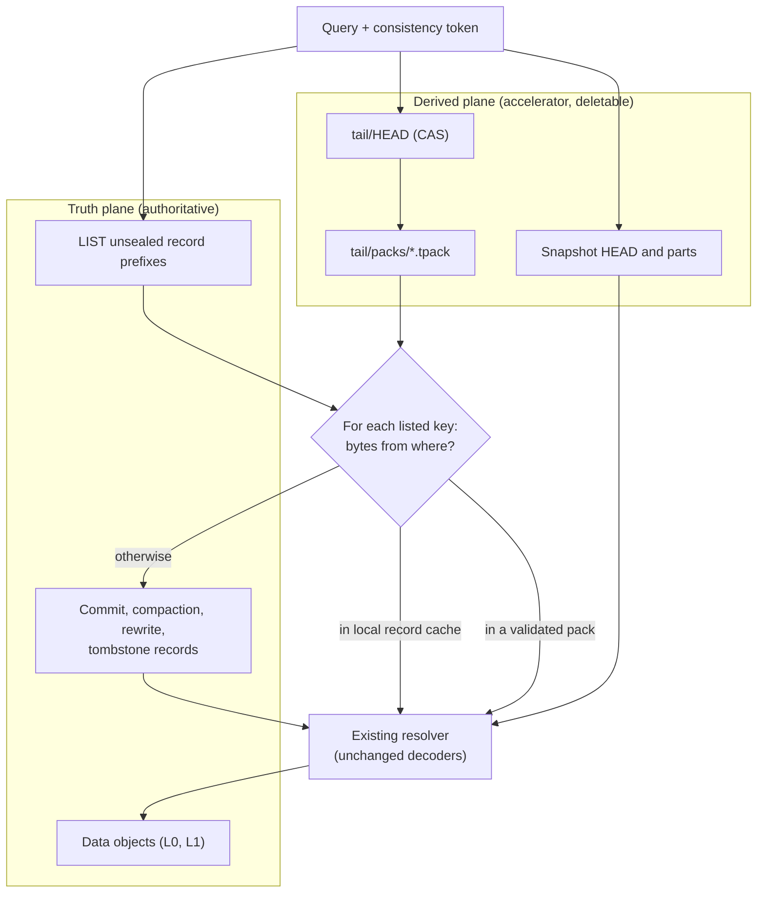

# ADR-1199: Bounded query I/O accounting, and a measured gate on tail checkpoints

Status: Proposed

## Context

Issue #1199.

A query over recent data resolves its snapshot in two halves. Hours at or below
the folded watermark come from snapshot parts. Hours above it come from the
authoritative listing: `Catalog::resolve_pruned_with_generations` LISTs every
recent commit prefix through `guarded_list_all`, then GETs and decodes every
listed record through `guarded_get`. Only after that can the planner open data
objects and let their per-object skip structures reject blocks.

### The measured cost

Measured on 2026-09-03 with `catalog_resolve_bench --store s3 --scenario
resolve --resolve-commits 10000 --resolve-shards 4 --resolve-hours 25`, built
from `0f2f875c`, run on a 16 vCPU box against real S3 in the same region.
10,000 commit records, one cold process:

| | requests | wall time | segments |
| --- | --- | --- | --- |
| Resolve, unfolded tail | 10,001 GET, 13 LIST | 16.157 s | 10,000 |
| Resolve, after fold | 2 GET, 13 LIST | 0.377 s | 10,000 |

Same answer, 667x the requests and 43x the wall time. The unit cost is one GET
per unfolded record, paid by every cold process; what that GET costs in time is
set by concurrency, not by the record, as the sweep below shows.

A sweep over record count (issue #1215, same box, bucket and binary, tenant
prefix wiped before each point) makes the shape exact:

| records | GETs | LISTs | resolve wall | per record | after fold |
| --- | --- | --- | --- | --- | --- |
| 1,000 | 1,001 | 5 | 1.689 s | 1.69 ms | 2 GET, 0.102 s |
| 5,000 | 5,001 | 9 | 8.331 s | 1.67 ms | 2 GET, 0.193 s |
| 10,000 | 10,001 | 13 | 16.157 s | 1.62 ms | 2 GET, 0.377 s |
| 25,000 | 25,001 | 29 | 53.055 s | 2.12 ms | 2 GET, 0.707 s |

GETs are exactly `records + 1` at every point. Resolve after a fold is flat at
2 GETs across a 25x range: the fold collapses this problem completely, which is
why decision 2 comes before decision 3.

The "per record" column is not a per-record cost. Every resolve GET passes
through `MAX_CONCURRENT_REQUESTS = 16` (`crates/ravel-catalog/src/catalog.rs:45`,
hardcoded, and not reached by ADR-1195's process-wide `GetLimiter`), so the
wall time is rounds times round-trip:

| records | rounds at 16 permits | wall | ms per round |
| --- | --- | --- | --- |
| 1,000 | 63 | 1.689 s | 27.0 |
| 5,000 | 313 | 8.331 s | 26.7 |
| 10,000 | 625 | 16.157 s | 25.9 |

That is S3 GET round-trip time, flat across 10x. **Cold resolve is
concurrency-bound, not request-bound**: 1.6 ms per record is 26 ms per round
divided by 16. Measured directly (issue #1215), with the constant patched in a
measurement clone and the same 10,000-record tail resolved cold at each level:

| permits | rounds | resolve wall | ms per round | GETs | LISTs |
| --- | --- | --- | --- | --- | --- |
| 16 | 625 | 23.157 s | 37.0 | 10,001 | 13 |
| 64 | 157 | 4.374 s | 27.9 | 10,001 | 13 |
| 128 | 79 | 2.341 s | 29.6 | 10,001 | 13 |

Requests did not move; rounds did. 9.9x from 16 to 128, no flattening. The
16-permit baseline ran in a slow S3 window (37 ms against 28-30 ms for the
other two), which is why it was re-measured in-session rather than reused from
the first run. The 25,000-record point (34 ms per round) remains an open
residual.

Three things about these numbers need stating precisely.

**The measured hours are sealed and unfolded, not open.** The benchmark drives
`now_ns` three hours past the last hour it wrote, which clears the seal margins,
so what it measures is the cost of resolving records above the fold watermark,
not the cost of an open hour specifically. The generalisation is exact in the
direction that matters: resolve cost is linear in unfolded record count at one
GET per record, and the open hour is the region where the fold is structurally
forbidden from removing that cost.

**The LIST figure scales with record count, and the pre-registered prediction
that it was constant is falsified.** The Stage 0 point alone (13, before and
after the fold) suggested a constant. The sweep gives 5, 9, 13, 29, and the
per-shard page count reproduces all four exactly:

```text
LISTs = sum over shards of max(1, ceil(records_in_shard / 1000)) + 1
```

`LIST_PAGE_SIZE` is 1000 (`crates/ravel-object-store/src/s3.rs:114`), each shard
paginates its own records, the `max(1, ..)` is there because an empty shard
still issues one LIST that returns one empty page, and the `+ 1` is the
pending-erasure LIST that runs alongside. The benchmark spreads records evenly, so at 4 shards this collapses
to `4 * ceil(records / 4 / 1000) + 1`: 5, 9, 13, 29. Production distribution is
not even, and the sum is the form that holds either way.

Which path produces it was investigated under #1214 and is not the one the shape
suggests. `use_prefix` (`crates/ravel-catalog/src/catalog.rs:1631-1636`) requires
`listing_suffix_buckets` to reach `prefix_list_crossover_requests` (720,
`config.rs:155`), and this window is roughly 120 buckets, so the crossover never
fires and the DEFAULT bounded path runs (`list_window_bounded` ->
`list_shard_hours`, `catalog.rs:1897,1995`). Since issue #730 that path also
issues one recursive paginated LIST per shard rather than one per (shard, hour),
so both paths yield the same per-shard page count and a request count alone
cannot distinguish them.

They are not otherwise interchangeable, and the difference matters for what
decision 1 records. The bounded path issues its per-shard LISTs concurrently
under the resolve-wide semaphore (`catalog.rs:1917-1921`); the prefix path
drains them sequentially so the runtime request cap is checked page by page
(`catalog.rs:2379-2382`). Equal request counts, different latency, and
different serial depth: on the bounded path the serial LIST depth is the
maximum page count over shards, while on the prefix path it is their sum. A
`list_page_depth` figure that does not say which path produced it is not
comparable across queries. The remaining difference is an early break once a
key's hour passes the window end (`catalog.rs:2050-2051`), which never triggers
in this benchmark because it resolves before any fold and writes nothing past
that hour.

The per-shard denominator matters for more than arithmetic, and it runs the
opposite way to intuition. Every shard rounds its own partial page up, so page
count is **non-decreasing in shard count** for a fixed record total: 10,000
records cost 11 pages at 2 shards, 13 at 4, and 17 at 8, with a floor of
`shards + 1` once each shard holds under 1000 records. A wide tenant pays more
listings than a narrow one for the same data, while its GET term is unchanged.
Any claim about LIST depth has to name the shard count it was measured at.

One code question survives the measurement and belongs to decision 1's
investigation: the prefix path is selected when the estimated bucket count
reaches `prefix_list_crossover_requests` (720 by default), and this window's
estimate is around 120. Either that estimate spans more than the window
suggests, or the selection is not the branch it appears to be.

**What the LIST figure establishes** is a ratio at a stated shard count, not a
constant: 29 LISTs against 25,001 GETs at 4 shards. Listing is real, paginated,
and here roughly a thousandth of the GET term, but it grows with shard count
while the GET term does not, so the ratio narrows on a wide tenant. The
per-record GET is still what is worth attacking, and the shard-count sensitivity
of the LIST term is a figure decision 1 must report rather than an assumption
this ADR carries.

### The multiplier, now measured

Unit cost times tail size is what a user feels. Both are now in evidence.
Tail size is set by configuration, not by data volume:

- A record leaves the listing path when its hour seals and folds:
  `max_flush_lifetime` (1h) + `clock_skew_allowance` (5m) +
  `fold_safety_margin` (15m), and the fold task wakes every
  `fold_interval_secs` (300). A record therefore sits in the listing path for
  roughly 1h25m to 2h25m after it lands, depending on where in the hour it
  landed.
- Records per hour is ingest bytes divided by `target_bytes`, 8 MiB by default,
  times the number of independently flushing shards.

Measured on the same box against real S3 (issue #1215): a tenant ingesting
8,474 points per second and one ingesting 178 points per second produce
**1,413.6 and 1,435.7 commit records per hour per shard** respectively. A 47x
difference in ingest rate makes a 1.6% difference in record rate, the router's
flush counters and the store's object counts agree exactly in both runs, and the
`target_bytes` size trigger fired **zero** times in either.

Record count is set by the flush clock, not by volume, because a strict write's
buffer always has a waiter. `ShardActor::age_threshold_ns`
(`crates/ravel-ingest/src/shard.rs:1114`) selects the slow
`max_flush_delay_idle` ceiling only for a buffer with no strict-mode waiter and
less than `min_flush_bytes`; on the acknowledged path the first disjunct is
always true, so every buffer takes the 2 s `max_flush_delay`. The idle ceiling
serves buffered writes nobody is waiting on.

The tail is therefore `shards x flush cadence x residence window`, with volume
absent from it:

| shards | records/hour | tail records | cold resolve at 16 permits | at 128 (measured 30 ms/round) |
| --- | --- | --- | --- | --- |
| 4 | 5,655 | 8,010 - 13,670 | 13 - 22 s | 1.9 - 3.2 s |
| 16 | 22,620 | 32,040 - 54,670 | 51 - 88 s | 7.5 - 13 s |
| 64 | 90,480 | 128,180 - 218,660 | 3.4 - 5.8 min | 30 - 51 s |

A tenant sending 200 points per second carries the same catalog tail as one
sending 8,500.

### What already exists, and what does not

Verified against the tree at `0f2f875c`:

- `crates/ravel-query/src/phase_accounting.rs` splits request and byte cost
  across `QueryPhase::{Resolve, Plan, Probe, Scan}`. It answers which phase
  spent a request. It does not answer how many dependent network waits were on
  the critical path, and it cannot: four independent GETs and four chained ones
  produce the same counter.
- The decoded-record cache (ADR-0046, `Catalog::guarded_get`'s cache path)
  already removes this cost on a warm process, and records its own hits and
  misses. It removes none of it on a cold one.
- `sweep_unreferenced_catalog_objects` (`crates/ravel-maintain/src/sweep.rs`)
  LISTs exactly `catalog/<signal>/snap/` and `catalog/<signal>/idx/`, and keeps
  only what the current HEAD names. Any new key prefix is invisible to it: safe
  from accidental deletion, and reclaimed by nothing.
- The three-dimensional index coverage ADR-0849 specifies after its review is
  design text. The tree has `snapshot_format/postings.rs` and
  `covering_postings.rs`; #849 item 1 is blocked on an ADR-0850 amendment.
  There is no coverage algebra to extract.

### The lower bound any tail accelerator accepts

For an exact query over an open bucket with independent writers, a reader can
establish whether a new commit exists in exactly three ways: enumerate the
commit namespace with LIST, make every acknowledged write update a bounded
publication structure readers consult, or introduce an externally coordinated
catalog. An asynchronous checkpoint proves nothing about completeness: it may
have been built one nanosecond before another writer published a record.

Any design in this area keeps the LIST, and any promise of a constant number of
object-store operations for the open hour that does not change the write path is
false.

## Decision

### 1. Build the query-wide I/O contract now

Unconditional, and independently useful: it is also the instrument the rest of
this ADR is gated on.

Keep `QueryPhase` for cost attribution. Add an orthogonal execution model that
records, per query:

- `dependency_depth`: the longest chain of object-store stages where each stage
  needs a previous stage's bytes to know its own keys.
- `list_page_depth`: serial LIST pages, reported separately because page `n+1`
  needs page `n`'s continuation token and no parallelism removes that.
- `service_batches`: the capacity quotient `ceil(stage requests / permit limit)`
  summed over stages, so 64 GETs under 16 permits reads as four batches rather
  than as depth 1. Defined as a quotient, deliberately, not as observed
  overlapping waves: a permit frees as each request completes, so an
  observation-based figure varies run to run for identical work, and a figure
  the same execution reports differently twice cannot gate anything. It is a
  LOWER bound on serial service rounds under a wave-synchronous model of the
  nested fan-out (outer plan admission, inner segment admission, shared
  permits). Within ONE stage that model is a lower bound on the rounds a
  sliding-window scheduler takes: it cannot beat peak capacity and does worse
  whenever the window is not full. Across stages it is not a bound in either
  direction, because the per-stage ceilings are summed as if each stage were a
  full barrier, and a sliding window lets a child request start before its
  parent stage's last wave completes (16 permits, 17 parent requests and one
  child released by the first parent finish in two waves where the sum says
  three). So the figure is stated as a deterministic model figure, comparable
  across queries and identical for identical work, with the single-stage
  lower-bound property named and the cross-stage sum named as a model, never
  as a bound the real scheduler can only exceed. This ADR's first draft called
  it an upper bound, and its second called the cross-stage sum a lower bound;
  both were wrong, and the landed docs are corrected to this wording.
- `unfolded_segments_resolved`: how many SEGMENTS this resolve took from the
  listing path rather than from a snapshot part. Segments, not records:
  `SegmentOrigins.origins` is parallel to `Snapshot::segments`, so an L1
  compaction record naming several parts contributes several entries, and
  ravel-query cannot recover a record count from an origin tag alone. For the
  L0 commit records that make up the unsealed tail the two coincide one to one,
  which is why this is the figure the gate in section 4 reads; a tail carrying
  resolved compaction records reads high against a record-denominated
  threshold, and the gate states its own denominator accordingly.
- `plan_class`: one of `metadata_only`, `selective_indexed`, `exhaustive_scan`,
  decided before execution.

These are planner and regression figures, not admission control. The existing
request, byte, memory and deadline budgets remain the only things that fail a
query, and nothing may be omitted from a result to meet a depth target.

Surfaces: an `io` block in query stats, additive beside the existing `phases`
block (`crates/ravel-query/src/http/json.rs`), carried through the stats path
the HTTP and Flight endpoints already use; and a `ravel-bench` plan-shape report
that reconciles per-phase requests against the total ledger and asserts each
figure appears exactly once inside its band.

Not a SQL statement. `EXPLAIN`, in both the ANSI and the DataFusion extension
form, is rejected before planning by `crates/ravel-sql/src/validate.rs` under
security invariant 1 (read-only single-statement SQL). An `EXPLAIN IO`
statement would breach that invariant, and reversing it is a separate decision.

The instrumented resolve must also answer the 13-LIST question above: which
listing path ran, and how the page count arises.

### 2. Exhaust the configuration knobs before building anything durable

The knob that moves cold resolve is not on the ingest side at all. It is
`MAX_CONCURRENT_REQUESTS` (`crates/ravel-catalog/src/catalog.rs:45`), the
hardcoded bound on record GETs in flight during a resolve, and the measurement
above shows it is worth 9.9x at 128. This ADR therefore decides, first: make it
a `CatalogConfig` knob plumbed from the server, default 128, with the
per-prefix arithmetic in its doc (128 in flight at 30 ms is about 4,300 GET/s
against S3's ~5,500 per-prefix guidance, spread over one `m/c/<shard>/<hour>/`
prefix per shard-hour). The semaphore is per `Catalog` instance, and
`ravel-server` builds exactly one and clones its `Arc` into every consumer, so
for the server this bound is already process-wide: 128 record GETs in flight
in total, however many cold queries run. It multiplies only where several
`Catalog` instances are constructed, which is the CLI and tests. Issue #1238.

The ingest-side knobs below were measured next, and the result is recorded
because it closes off the path the source plan recommended.

The knobs that set tail size already exist and cost nothing to turn:

| Knob | Default | Effect on tail |
| --- | --- | --- |
| `target_bytes` (ingest) | 8 MiB | records per hour, inversely |
| `max_flush_lifetime` | 1h | flush cadence, and 1h of the seal delay |
| `fold_safety_margin` | 15m | seal delay |
| `clock_skew_allowance` | 5m | seal delay |
| `fold_interval_secs` | 300 | fold latency after seal |
| shard count | per tenant | independently flushing writers |

One interaction has to be measured rather than reasoned about, because the
obvious knob turn can backfire: `max_flush_lifetime` is both the flush timer and
a term in the seal delay. Lowering it shortens the delay (fewer records in the
listing path) and raises the flush rate for streams that never reach
`target_bytes` (more records in the listing path). Which term wins depends on
whether a tenant's shards are byte-driven or timer-driven, so the experiment
varies it against both.

This was measured (issue #1215), and the result changes the decision rather than
informing it. `target_bytes` is not the lever: it fired zero times across two
runs spanning 47x in ingest rate, because the 2 s age trigger always wins first
on the acknowledged path. The 8x this ADR originally attributed to it applies to
nobody on strict ingest.

The lever is `max_flush_delay`, and it is not free the way a default usually is:
a strict acknowledgement waits for its flush, so raising the delay raises
acknowledged write latency one for one. That is a change to the acknowledgement
contract and belongs to whoever owns that contract, not to a tuning pass.
`min_flush_bytes` and `max_flush_delay_idle` cannot substitute, because the idle
ceiling is unreachable whenever a waiter exists.

What remains for issue #1217 is therefore documentation rather than a defaults
change: state the mechanism, the measured rate, and the latency cost of the only
knob that moves it, so that an operator raising `max_flush_delay` for a tenant
is making that trade knowingly.

One knob does move the tail without touching acknowledgement latency:
`max_flush_lifetime`, the writer's abandon deadline, is the largest term in the
residence window `[X + 20m, X + 1h25m]`. Lowering it on writer, fold and
compactor together is sound (the seal lemma needs only the writer's per-attempt
deadline, which `bound_to_deadline` enforces) and worth 35-45% of tail records
at X = 15 min, not the 2x a first reading suggests, because the hour granularity
and the 20 m of margin do not move with X. It is not a default to retune here:
the three crates carry three untied copies of the value, the server fold reads
no flag for it, and the documented deployment ordering reverses for lowering.
Issue #1236 carries the analysis and the ADR it would need.

### 3. The tail checkpoint is specified here and NOT built

The design below is settled so that the gate below has something concrete to
approve, and so the measurement knows what it is measuring for. No task builds
it under this ADR.

An immutable, content-addressed pack holding the original encoded bytes of
catalog records a builder observed in the unsealed tail, published under a new
key family through a CAS'd root:

```text
t/<tenant_hash>/catalog/<signal>/tail/HEAD                 mutable, CAS
t/<tenant_hash>/catalog/<signal>/tail/packs/<hash16>.tpack immutable
```

A pack holds a record directory (`record_object_key -> offset, length,
crc32c`), the record bytes verbatim, and validated segment descriptors derived
from them. No telemetry payload: the data fetch still reads the original L0 or
L1 object the existing resolver selects. Storing encoded record bytes rather
than a second semantic representation means the query runs the same decoders and
the same tenant, signal, shard, key-shape and reconstructed-data-key checks it
runs after a direct GET, so a checkpoint can never become a validation bypass.

Per `(tenant, signal, shard, ingest_hour)` the head advertises one base pack
and at most `K` delta packs, deduplicated by exact record key, because
rewriting the whole open hour on every publication costs `tail_size x
frequency` in write amplification. The bound is a number, not an adjective:

- `K = 4` by default, with a codec hard maximum of 8 that a head cannot
  exceed and remain decodable. A head naming more than 8 packs for one
  shard-hour is unusable, and the resolver takes the direct-GET path for that
  shard-hour, exactly as for a corrupt head.
- A query loads at most `tail_checkpoint_max_packs_per_query` packs in total
  across every shard-hour in its window (default 16), chosen
  deterministically in a canonical order: shard-hours by ingest hour
  DESCENDING, then shard ASCENDING, so the freshest hour (the one a query over
  recent data needs most) is served first; freshness is the only property the
  order claims, since how many uncheckpointed records an hour holds depends on
  ingest volume and maintenance lag and is not something the order can
  guarantee and two nodes resolving the same window load the same packs;
  within a shard-hour, the base first, then deltas newest first; stop when the
  budget is spent. Records in packs the budget did not reach resolve through
  direct GETs. Two figures report that, in their own units and never mixed:
  `unfolded_segments_served_from_pack` (segments, the same unit as
  `unfolded_segments_resolved`, so their difference is the segments that came
  from direct GETs) and `record_gets_direct` (requests, the direct commit and
  compaction record GETs the resolve phase issued, which is the cost figure and
  which a compaction record naming several segments keeps distinct from the
  segment count).
- Publication never waits and never adds a `K+1`th delta. A builder that finds
  the head at `K` deltas for its target consolidates instead: it merges the
  base and all deltas by exact record key, re-LISTs so the new base is not
  knowingly older than the namespace, publishes the new base with zero deltas
  through the same CAS, and leaves the old packs for the sweeper after the
  protection horizon. Consolidation also triggers when delta bytes exceed base
  bytes, whichever comes first.
- When maintenance lags, nothing grows on the read side: the head stays at its
  last published pack set within the bound, and every record published since
  then is simply uncheckpointed and resolves through direct GETs. The cost of
  lag is the per-record GET term this ADR measured, on exactly the records the
  lag covers, and the `io` block makes it visible per query. Correctness does
  not depend on the builder running at all (invariant 1).



Read rules: the authoritative LIST always runs; for every key it returns, bytes
come from the local record cache, then a validated loaded pack, then a direct
GET; a record in a pack that the current LIST does not return is ignored, so a
stale pack cannot resurrect a record retention or erasure removed; token-resolved
records are fetched directly, independent of head, packs and listing. Resolution
output is unchanged.

Build and lifecycle rules: the builder runs in the maintenance role with no
lease, converging by output determinism and CAS; a dedicated tail sweeper ships
before any builder writes a pack, because the existing catalog sweeper does not
see the prefix; sealed hours defer to the fold, and their tail references are
dropped and reclaimed after the protection horizon.

Invariants, each needing a direct test if this is ever built: tail objects are
never required to recover acknowledged data; the LIST is never suppressed; only
listed keys are served from a pack; served bytes pass every check direct bytes
pass; snapshot-covered hours resolve from the snapshot; a commit token adds
visibility independently of all tail state; erasure predicates are discovered and
applied independently; missing, corrupt, stale or over-budget tail state affects
latency only, while foreign-tenant state is a hard isolation error (ADR-0050
section 2); strict acknowledgement stays two durable PUTs; packs hold metadata
only.

Format class, if built: Class B under ADR-0066 decision 4, derived catalog
objects, rebuildable, so no migration tool and no N-1 reader window. An
unsupported version is declined, not dual-read. New proto messages land
additively in `proto/ravel/catalog.proto`, and docs/catalog-and-mvcc.md's key
table is amended in the same change.

Erasure, if built: version 1 packs copy commit, compaction, rewrite and
tombstone record bytes only, and those carry no subject attribute values
(ADR-0873 decision 2 excludes `str_utf8`/`bytes_val` from declared stamps;
ADR-0064 records `catalog/*` as holding no subject attribute values). The prefix
still joins the erasure storage inventory as a reachable derived object. A
version that adds postings over subject-derived terms changes this and needs its
own ADR.

### 4. The gate that decides whether decision 3 gets built

Build the tail checkpoint only if, after decision 2's resolve concurrency
default is applied, both hold over a 24-hour window on a real workload, with
the population and the arithmetic fixed in advance: the population is every
resolve whose query window includes at least one hour above the folded
watermark (a resolve that touched no unfolded hour is not evidence about the
tail); the window must contain at least 1,000 such resolves across at least
three tenants, and a window with fewer is inconclusive rather than a pass; p99
is the nearest-rank quantile over that population (the value at position
`ceil(0.99 x N)` of the ascending sort), computed from the per-query `io`
figures as logged, not from a sampled subset. The
baseline the checkpoint has to beat is the 128-permit column above, about 2.3 s
for a 10,000-record tail, not the 16 s the first measurement showed:

- `unfolded_segments_resolved` at p99 is at least **2,000** per resolve. On the
  measured figures this is crossed by any strict-ingest tenant with two or more
  shards, independently of how much data it sends, so this condition is expected
  to hold rather than to discriminate, and the cold-resolve condition below is
  the one that decides. The threshold is denominated in segments because that is
  what the read path can count. For an all-L0 tail, which is what the unsealed region is, one segment
  is one commit record and 2,000 of them is 125 rounds at 16 permits, about
  3.2 seconds of resolve before a predicate rejects anything: the point where
  resolve stops being a rounding error against a query budget. That time figure
  moves with the permit count; the threshold is stated in segments so that it
  does not. That time
  conversion holds ONLY for an all-L0 tail. A resolved compaction record
  contributes several segments against one GET, so a tail carrying them reads
  high against this threshold and its 2,000 segments cost less than 3.2
  seconds. If such tails turn out to be common, the gate needs a
  record-denominated figure rather than a rescaled segment one.
- At least **10%** of resolves over recent data are cold. This needs a
  per-resolve indicator that does not exist yet: the record-cache counters are
  record-level, and a single resolve mixes hits and misses, so a pooled hit
  ratio cannot say how many resolves were cold. Issue #1219 adds
  `unfolded_segments_served_from_cache` per resolve, and a resolve counts as cold
  when fewer than half its unfolded segments came from the cache. Until that
  figure exists the gate cannot be evaluated, and no substitute inference about
  pod lifetimes is admissible.

Both thresholds are pre-registered here, before the measurement, so the result
can miss. If either fails, the checkpoint is not built: the epic closes with the
knob defaults, the instrumentation, and this ADR as the record of why, and the
design above stays available for the day the thresholds are crossed.

The economics the gate encodes: the builder re-reads the same records the fold
already reads and adds PUTs, so it only pays for itself when many cold queries
share each checkpoint. In dollars the whole problem is small (10,000 GETs is
about $0.004); the case for building is latency on busy tenants, not S3 spend,
and the ADR should not be read as a cost-reduction measure.

### 5. What this ADR does not decide

Tail search postings, candidate pruning, block locators, distributed block
selections, and any rollout: all out of scope, and all downstream of decision 3
even being built. Record substitution is a transport change with a
byte-equivalence proof; candidate exclusion is the only part that can return a
wrong answer, and it does not get designed until the substitution path exists.

One forward requirement, stated here because splitting it later is the expensive
mistake: whichever plane first implements index coverage, snapshot (ADR-0849) or
tail, owns one shared implementation of the coverage algebra, and the other calls
it. Two definitions of "uncovered" is a wrong-result bug waiting for the second
one to be written.

## Rejected alternatives

**Build the checkpoint now, on the strength of the 667x figure.** That figure is
a unit cost on a synthetic 10,000-record tail. The multiplier it must be
multiplied by is a configuration output, and the configuration has never been
tuned for it. Building a durable object family, a builder, a sweeper, an erasure
inventory entry and a degraded read mode before turning `target_bytes` is
expensive in exactly the way that is hard to reverse.

**Turn the knobs and skip the instrumentation.** The knob experiment needs a
number the tree does not currently produce (`unfolded_segments_resolved`), and
the 13-LIST anomaly shows that reasoning about this path from the code alone
already produced one wrong prediction in this ADR.

**Add an `L05` storage level that copies recent rows into larger objects.** A
second copy of telemetry means a second erasure target, a second provenance
surface, and a stale read that can resurrect erased rows. Compaction stays the
only operation that creates a new data representation.

**Put tail objects under the existing `catalog/<signal>/idx/` prefix.** That
prefix is swept against the snapshot HEAD's reference set, so a pack there is
deleted at the protection horizon by a process that has never heard of it. This
is the failure #855 records for index packs.

**Reference tail packs from the snapshot `HEAD`.** The snapshot HEAD is CAS'd by
the fold on a fold cadence; tail publication needs a faster one, so the two
contend, and a fold process predating the field strips the reference.

**One monolithic pack per hour, rewritten on each publication.** Write
amplification is `tail_size x checkpoint_frequency`.

**A lease so only one builder builds a target.** Builds are deterministic and
content-addressed, so duplicate builders converge and CAS decides which set the
head advertises. A lease adds a liveness dependency to a purely derived object.

**Let the checkpoint replace the LIST for buckets it claims are complete.** The
one option that would deliver a constant-round-trip open hour, and unsound: no
asynchronous observer can prove an open bucket has no newer commit, so a query
would silently miss an acknowledged write.

**Writer-owned live manifests, batched commit records, or an external
coordination service.** Each can bound the open tail properly, and each changes
the acknowledgement path, the failure atomicity, or the single-durable-backend
property. None is justified while a knob turn is untried.

**Expose the I/O shape as an `EXPLAIN IO` SQL statement.** `validate` rejects
every `EXPLAIN` form before planning as security invariant 1. Adding one
statement-shaped exception to a gate whose value is having no exceptions costs
more than it buys when the stats block carries the same figures.

**Fold dependency depth into the existing `PhaseAccounting` counters.** A phase
counter cannot distinguish four parallel GETs from four chained ones, which is
exactly the confusion that lets a change improve request count while latency
stays flat.

## Consequences

Every query gains an explainable object-store dependency graph: depth, serial
LIST pages, service batches, per-phase requests and bytes, and how many records
came from the listing path. That last figure is what turns "the tail is
expensive" from an argument into a measurement, and it is what the gate reads.

The knob experiment may end this line of work, and that is a success, not a
retreat: a defaults change that removes 8x of the tail is worth more than a
checkpoint that removes 20x of a tail nobody has, and it carries no new
durability surface.

If the gate is crossed, the design in decision 3 is ready to dispatch, with its
format class, erasure analysis, sweeper requirement and invariants already
settled, and the follow-up epic starts at decomposition rather than at design.

This ADR makes no claim about scan-bound queries. Ravel's published cold
ClickBench gap is byte-bound in the scan phase, where resolve costs two GETs.
Nothing here moves it.
