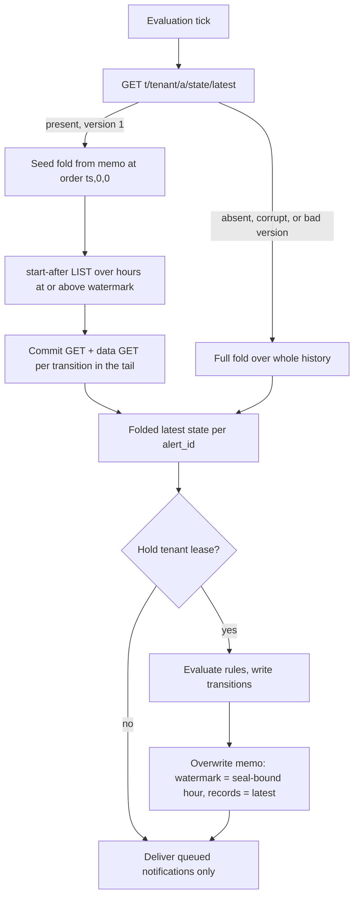

# ADR-1294: A derived alert-state memo bounding evaluation tick cost

Status: Proposed

## Context

The alert evaluator (`services/ravel-server/src/alerting.rs`) runs one tick
per tenant on an interval. Each tick must know the current state of every
alert, which ADR-0040 decision 3 defines as a fold: the record with the
greatest order among all records sharing an `alert_id`. State is derived, never
mutated in place; every transition (fires, resolves, suppresses) is a new
immutable RLOG record under the tenant's `Signal::Alerts` commit prefix.

Before this ADR the fold ran cold every tick: a `list_all` over the whole
alerts commit prefix, then a commit GET plus a data GET per commit record, then
an RLOG scan of each object. `Signal::Alerts` is absent from
`maintain::MAINTAINED_SIGNALS`, so nothing folds or compacts that history in the
background and it only grows. The cost per tick is therefore
`ceil(N / page)` LISTs plus `2N` GETs, where `N` is the cumulative count of
transitions ever written, and it is independent of the rule count `R`.

The waste is structural. `alert_id = compute_alert_id(rule_id, rule.labels)` is
computed from a rule's static labels, so a rule maps to exactly one `alert_id`
for its lifetime. The fold's output therefore holds at most `R` entries, one
per rule, yet reading it costs `2N` GETs over a history that never stops
growing. A tenant with 10 rules and a year of flap history pays for the year on
every tick to learn 10 current states.

The object key layout (docs/catalog-and-mvcc.md) and the RLOG record format
(ADR-0040, docs/log-segment-format.md) are frozen contracts. The alert history
is also read by the `alerts` SQL table (ADR-1101), so it cannot be trimmed or
rewritten to make the fold cheaper. The fix has to leave every existing record
and every existing key untouched and add only a derived cache.

## Decision

Fold the latest-state-per-`alert_id` into one durable, tenant-wide memo object
and read it at the start of each tick, so a steady-state tick folds only the
transitions written since the memo rather than the whole history.

1. **Key.** The memo lives at `t/<tenant_hash>/a/state/latest`, one object per
   tenant. It sits deliberately outside the `t/<tenant_hash>/a/c/` commit prefix
   so that neither the evaluator's own fold nor the `alerts` SQL table's listing
   of commit records ever sees it. It is a new key prefix under an existing
   signal, additive: no existing key changes shape or meaning.

2. **Body.** A small JSON object carrying its own `format_version` (1 on day
   one), a `watermark_hour` (the ingest hour the memo was stamped in), and the
   folded records: one `AlertRecord` per `alert_id`. The reader accepts exactly
   `format_version == 1` and refuses 0 and any future version, treating a
   refused or undecodable body the same as an absent one. A body that repeats an
   `alert_id` is a decode error, not a last-wins insert: the fold's output is
   keyed by `alert_id`, so a duplicate is ambiguous, and silently keeping one
   copy could seed stale state for an hour below the watermark that the tail never
   re-reads. Refusing it routes the tick through the same full-fold-and-rewrite
   recovery an absent or corrupt memo takes.

3. **Read path (every tick, before the lease).** GET the memo. Then, whatever
   the memo says, issue one `start-after` LIST over the commit prefix that skips
   every ingest hour strictly below `watermark_hour` server-side, and fold the
   commit records it returns (a commit GET plus a data GET per transition in
   that window) on top of the memoized state. Each memoized record is seeded
   into the fold at order `(ts_ns, 0, 0)`, below any real commit the tail
   re-reads (order `(ts_ns, epoch, seq)` with a nonzero `seq`), so a re-read
   transition always wins the tie against its own memoized copy; the two are
   byte-identical, so the tie only decides which clone survives, never the
   folded state. A missing, corrupt, or unsupported-version memo falls back to a
   full fold over the whole history.

4. **The tail LIST is not optional.** It is what makes a stale memo detectable:
   a transition written after the memo was stamped lands at an hour at or above
   the watermark and is folded in by the tail. Skipping the tail when the memo
   is present would return stale state. The watermark hour itself is always
   re-folded (its keys sort after the bare `prefix + hour_string` cursor), so
   the hour a memo was stamped in is never skipped.

5. **Write path (lease holder only, end of tick).** After rule evaluation, the
   lease holder rewrites the memo with the just-folded latest state, stamping the
   **seal-bound hour** as the new `watermark_hour`, using `PutMode::Overwrite`.
   Only the lease holder writes, so there is a single writer per key and no CAS
   is needed. The write is debounced: a tick that changed neither the watermark
   hour nor any record writes nothing. A failed write is logged and the memo is
   left as it was: `write_alert_state_memo` never clears or deletes the prior
   object, so if the `Overwrite` fails before it replaces the object, the
   previous memo stays readable and the next tick reads it and folds only the
   tail over it, exactly as it would over any successful memo. A full fold
   happens only when no readable memo exists at all: a cold start, or an absent,
   undecodable, unsupported-version, or duplicate-`alert_id` memo. A write that
   merely failed does not produce that state, so it does not force a full fold.
   Correctness holds either way, because the tail LIST re-reads every hour at or
   above the surviving memo's watermark.

   The seal-bound hour, not `hour_bucket(now_ns)`, is what the watermark may
   advance to. The alert lease permits a two-holder overlap (`acquire_lease`):
   a prior holder whose lease has expired can still finish one in-flight tick and
   publish a transition after this holder's tail LIST, stamped at the prior
   holder's own clock. If that stamp lands in an hour below the watermark, the
   tail excludes it from every future tick and the memo omits it permanently,
   breaking the staleness invariant below by a legal interleaving. The seal bound
   is the newest ingest hour no overlapping holder can still write into: the
   ingest hour of `now_ns - (lease_ttl + query_deadline)`. `lease_ttl` is
   `LEASE_TTL_TICKS` (3) times the evaluation interval; a prior holder held the
   lease at its own tick start, so its lease had to expire before this holder
   took over, which puts its transition stamp at least `lease_ttl` behind this
   holder's reading. `query_deadline` (`DEFAULT_QUERY_DEADLINE`, 30s) is added as
   the only wall-clock tolerance the alerting path defines, covering the in-flight
   tick's own duration and modest inter-node clock skew; the alerting path
   defines no dedicated cross-node skew constant, and a deployment whose skew
   exceeds the query deadline would need to widen this margin. Holding the
   watermark back never loses correctness, only re-reads a bounded tail; the tail
   is still a single LIST over a `start-after` marker range.

6. **The memo is a derived cache, never a source of truth.** ADR-0040
   decision 3 stands unchanged: current state is still defined as the fold over
   immutable records. The memo only pre-computes that fold up to a watermark.
   Losing, staling, or corrupting it costs a rescan, never a wrong answer. No
   record format changes and the `alerts` SQL table is untouched.

### Migration class

Under ADR-0066 this is a **Class B** object: derived, reconstructible, rebuilt
continuously from the immutable commit records it folds. It introduces a new
derived-object key prefix, not a new version of any frozen format, so it needs
no version bump to any existing format and no dual-reader window on the record
side. Its own `format_version` field carries the memo's version independently;
a future memo-body change bumps that field, and because the object is
single-key `Overwrite` and advisory, an old-version body is simply ignored and
overwritten rather than migrated. Adding a new self-owned key prefix without a
version bump follows the `sys/maintain/memo/<process_id>` precedent (ADR-0065
decision 3): a self-owned, `Overwrite`, versioned-tag, advisory,
reconstructible snapshot beside the data it summarises, where losing or staling
the snapshot costs at most a rescan. This memo is the same pattern, scoped
per tenant rather than per maintenance worker.

### Memo growth and the retention contract (issue #1438)

`fold_latest` seeds the memo from the fold's output with no active-rule filter,
so every `alert_id` that has ever appeared in the tenant's transition history is
carried forward, including alert_ids for rules that were later deleted and for
label sets that a rule has since changed away from (a label change moves the rule
to a new `alert_id`, leaving the old one folded from history). This is required
for correctness, not an oversight: the seed-plus-tail invariant holds only if the
seed contains *every* below-watermark folded record. Dropping an old record here
(say an old `Resolved`) would make the memo fold differ from a full fold, and on
a later refire `evaluate_transition` would see no prior record and
`write_alert_record` could lose the lifecycle generation.

The true growth bound is therefore: the memo holds one entry per distinct alert
identity ever configured for the tenant (one per rule, and one more per historical
label set of a rule), never one per tick and never one per transition. A tenant
with a fixed rule set has a memo whose size is fixed at the rule count regardless
of how long it runs or how often its alerts flap; only churning the rule set or a
rule's labels grows it, and only by the count of distinct identities that churn
produces.

Pruning that growth is deliberately out of scope here and is tracked as
issue #1438. When it lands it is a versioned change, not an in-place edit, and it
must keep these invariants:

- **Prune only into a compact form, never by deletion.** An identity outside the
  configured rule set may be replaced by a compact record that preserves at least
  its lifecycle `generation` and its last `state`, so a refire still finds a prior
  record and `write_alert_record` still advances the generation. A pruned identity
  may not simply vanish from the memo.
- **Below-watermark completeness still holds.** After a prune the seed must still
  represent every below-watermark identity (in full or compact form), so the
  seed-plus-tail fold still equals a full fold for every identity the tail does
  not re-read.
- **Reader before writer, ADR-0066 Class A discipline.** The compact form is a new
  memo body shape, so it bumps the memo's `format_version` to 2. A reader that
  accepts the read set exactly `{1, 2}` must be deployed across the fleet before
  any process writes a version-2 memo; only once every reader accepts 2 may the
  writer flip to emitting it. This is the readers-before-writers rollout ADR-0066
  Class A defines, applied to the memo's own version tag. Until then the reader's
  supported set stays `{1}` and an unrecognized future body falls back to a full
  fold exactly as any unsupported version does.

Issue #1438 is the tracked implementation of that pruning; this ADR only states
the bound and freezes the contract the implementation must meet.

### Data flow

### Formal model note

ADR-1113's verification suite covers the maintenance and catalog fold
protocols; this memo introduces one invariant in the same style, stated here so
that suite can adopt it. Let the **memo staleness invariant** be: if
`memo.watermark_hour` is at or below every ingest hour that the tail LIST
covers, then the state produced by seeding from the memo and folding the tail
equals the state produced by a full fold over the whole history.

The argument rests on one consistency fact: a record's ingest hour is derived
from its own `ts_ns` (`publish` stamps `ingest_hour_bucket = hour_bucket(record.
ts_ns)`), and a record's fold order is keyed on the same `ts_ns`, so a record's
hour and its order are consistent. Partition the records by hour. Every record
at an hour strictly below the watermark contributed to the memo when it was
stamped and is present in the seed. Every record at an hour at or above the
watermark is re-read by the tail LIST, which covers exactly those hours
inclusive. So every record reaches the fold through one path or the other, and
the seed-plus-tail fold sees the same record set as a full fold. The tie-break
(memoized copy at `seq == 0` versus re-read copy at `seq > 0`) never changes the
folded value because a re-read record is byte-identical to its memoized copy.

The invariant's precondition (`watermark_hour` at or below every hour the tail
covers) is not automatic: a `watermark_hour` at `hour_bucket(now_ns)` is broken
by the alert lease's documented two-holder overlap. A prior holder whose lease
has expired can still finish an in-flight tick and publish a transition after
this holder's tail LIST, stamped at the prior holder's own clock. That stamp can
fall in an hour strictly below `hour_bucket(now_ns)` (the prior holder's clock
reads behind, and its transition is stamped at a tick-start reading at least one
`lease_ttl` behind this holder's), so a watermark at `hour_bucket(now_ns)` would
exclude that hour from every future tail and drop the record permanently: a
below-watermark record written *after* the memo, which the "no such record is
written after the memo" step above assumed away. The seal-bound watermark
(decision 5) restores the precondition: it is the ingest hour of
`now_ns - (lease_ttl + query_deadline)`, older than any hour an overlapping
holder can still stamp into, so every late transition lands at an hour at or
above the watermark and is re-read by the tail.

The watermark may also move backward across ticks (a backward clock step widens
the tail to cover more hours), which only ever re-reads more, never fewer, so the
invariant is preserved; the resulting duplicate reads stay within ADR-0043
decision 6's documented at-least-once tolerance.

An alternative to the seal bound is a **lease-generation fence** (design (b)):
carry the lease generation on every transition and in the memo, refuse a memo
write (by CAS) when the generation has moved, and fold any tail transition from
an older generation regardless of hour. It removes the hour-skew reasoning
entirely but costs a new field on the frozen `AlertRecord` write path (a format
change under ravel-alerting, out of this change's scope), a durable generation
counter, and a CAS on the memo write that the single-writer-per-key model
otherwise does not need. The seal bound needs no new durable field and stays
within `alerting.rs`, so it is preferred here.

## Rejected alternatives

- **(a) Trim or compact the alert history behind a retention path so the full
  fold stays cheap.** Rejected on cost and on correctness. Trimming to keep only
  the latest record per `alert_id` is a rewrite whose cost is `R x W` (it must
  read and re-emit state on every write), not the `R` this ADR targets, and it
  deletes exactly the transition history the `alerts` SQL table (ADR-1101) reads.
  A derived cache beside the immutable history gets the read speedup without
  touching the history at all.

- **(b) Add `Signal::Alerts` to the fold's maintained signal set so background
  maintenance compacts it.** Rejected: compaction reduces the number of objects
  but the tick still folds the whole compacted history, so per-tick GETs stay
  `O(N)` rather than dropping to the transitions since a watermark. Worse, no
  producer reads L1 alert parts today, so turning maintenance on for this signal
  activates the unfinished-compaction defects tracked in issue #1137. This ADR
  needs neither: the memo bounds the tick without compacting anything.

- **(c) One memo object per `alert_id` instead of one per tenant.** Rejected:
  the tick would then GET `R` memo objects and perform `R` per-alert staleness
  comparisons every tick, trading one tenant-wide GET for `R` GETs and turning a
  single tail LIST into a per-alert reconciliation. The fold's output is already
  tenant-wide and at most `R` entries, so one object holds it with one GET.

- **(d) A bounded newest-first walk over recent hours with an early stop, and no
  memo.** Rejected on correctness. An alert that entered `Firing` at the start of
  a multi-day incident has its latest transition sitting many hours in the past;
  a bounded lookback that stops after the most recent `k` hours would miss that
  record entirely and read the alert as not firing. Current state has no bounded
  time horizon, so no bounded hour walk can derive it. The memo carries the
  below-watermark state forward explicitly instead of hoping it falls inside a
  window.

## Consequences

- A steady-state tick costs a memo GET, a lease GET, one tail LIST (a single
  `start-after` call over a marker range), and `2T` GETs where `T` is the number
  of transitions in the hours the tail covers, down from `ceil(N / page)` LISTs
  and `2N` GETs. The cost stops growing with history. Because the seal-bound
  watermark holds back by `lease_ttl + query_deadline` (a few minutes at the
  defaults), the tail covers not just the current hour but every hour within that
  seal margin, so `T` counts transitions in that trailing window rather than only
  the current hour. For a quiet tenant whose last transition is older than the
  seal margin, `T` is 0 and the tick is exactly 2 GETs and 1 LIST. The watermark
  advances only at hour granularity (it is `seal_bound_hour(now_ns)`, an ingest
  hour), so a transition written near the start of an hour H stays in the tail
  until the watermark passes H entirely, not merely for a few ticks: the re-read
  duration approaches a whole hour plus the seal margin (three evaluation
  intervals plus thirty seconds at the defaults). So `T` can cover nearly the
  whole current hour, not just the last few ticks' worth of transitions. The
  per-tick bound is unchanged regardless: each such tick still costs one memo
  GET, one lease GET, one tail LIST, and `2T` GETs for the `T` transitions the
  tail covers. This is the honest bound after the seal-bound watermark; the
  earlier "current hour only" figure did not account for the lease overlap and
  could lose a late transition.
- A cold, absent, corrupt, or unsupported-version memo pays a one-time full fold
  and then rewrites a valid memo, so the expensive path is self-healing and
  bounded to the tick that hit it.
- Every replica reads the memo; only the lease holder writes it, so the memo has
  a single writer per key and needs no CAS.
- The `alerts` SQL table, the RLOG record format, and every existing key are
  unchanged. The alert history is neither trimmed nor compacted.
- docs/catalog-and-mvcc.md gains one key-layout row for the memo prefix.
- A new derived-object key prefix now exists under the alerts signal; a future
  memo-body change bumps the memo's own `format_version` and relies on the
  ignore-and-overwrite path rather than a record migration.
