# ADR-1306: the query request budget covers the unsealed tail and the fold-stall alert window

Status: Accepted (2026-09-26). Issue #1306. Amends ADR-0075 decision 1 (the
one-hour span the per-shard allowance is sized from). No frozen format
changes; no migration class applies.

## Context

ADR-0075 made the default per-query object-store request budget a derived
figure. `derive_max_s3_requests` (`crates/ravel-query/src/config.rs:67-80`)
computes

```
budget = ceil(3600 s / max_flush_delay) x 3/2 x shard_count + 5,000
```

At the shipped 4 shards and the 2 s flush cadence (`IngestConfig::default`,
`crates/ravel-ingest/src/config.rs:470`) that is 1,800 x 3/2 x 4 + 5,000 =
15,800 requests. The span it is sized from is one open hour.

The span a recent-window query actually resolves is the unsealed tail, and it
is longer than an hour. `sealed_watermark_hour`
(`crates/ravel-catalog/src/fold.rs:369-382`) seals ingest hour `H` only when
`now >= end(H) + max_flush_lifetime + clock_skew_allowance +
fold_safety_margin`. Call that sum the seal margin. At the defaults it is
1 h + 5 m + 15 m = 4,800 s (`crates/ravel-catalog/src/config.rs:10,292,296`).
The unsealed tail is `now - end(watermark hour)`. With a fold running on
schedule it swings between the seal margin and the seal margin plus one hour.
That is 1 h 20 m just after a seal and 2 h 20 m just before the next one. The
`HOT_REGION_HOURS` comment (`crates/ravel-catalog/src/config.rs:194-217`)
states the same 2 h 20 m bound.

A narrow query does not escape the tail. Resolve lists every ingest-hour
bucket overlapping `[range.start - max_ingest_lag, now + clock_skew_allowance]`
(`docs/catalog-and-mvcc.md:1058-1061`), with `max_ingest_lag` at 2 h. Every
unsealed commit record in that window is listed and GET-decoded
(`docs/catalog-and-mvcc.md:1096-1103`). So a last-5-minutes query touches up to
3 h 10 m of tail, and a wider query touches all of it. The per-process record
cache would absorb repeated resolves, but at the defaults it is clamped to
25,000 entries against an uncapped estimate of 129,600
(`crates/ravel-catalog/src/config.rs:27`). A busy tenant's tail does not
fit, so "cold" is the normal case, not the rare one.

The budget counts every pooled request, resolve included. It is checked after
resolve and at each fetch boundary (`crates/ravel-query/src/engine.rs:2192-2197`
and the sites after it). A refusal is `QueryError::RequestBudgetExceeded`,
served as HTTP 422 (`crates/ravel-query/src/http/error.rs:120`).

Take the issue's own cost model: one request per unsealed flush per shard. At
4 shards and 2 s that is 7,200 requests per hour of tail. This model is not
yet measured (follow-up task 1), so the figures below are conditional on it.

The 5,000 fixed overhead is never available to the tail (decision 2), so
the tail's share of 15,800 is 10,800.

| Tail | Tail requests | Against the tail's 10,800 |
|---|---|---|
| 1 h 20 m (just after a seal) | 9,600 | fits, 1,200 spare |
| 1 h 30 m | 10,800 | the budget is exhausted |
| 2 h 20 m (just before a seal) | 16,800 | refused by 6,000 |

The issue computed 52 minutes of headroom from the first row. That is the best
point in the hour. At the worst point in the hour the headroom is negative,
with no fold lag at all.

PR #1636 landed the fold-liveness metrics for this issue: per-signal
`ravel_catalog_fold_cycles_total`, `ravel_catalog_fold_failures_total` and
`ravel_catalog_fold_last_success_timestamp_seconds`
(`services/ravel-server/src/metrics.rs:1847-1889`). It also shipped the
`RavelCatalogFoldStalled` alert (`deploy/prometheus/ravel.rules.yaml:39-48`).
The alert fires when the gauge's age exceeds 4,800 s and has done so for 10
minutes. That is 5,400 s after the last successful fold.

The issue asks for the metric to move, and the alert to fire, before the first
422. Under the current budget the order is the reverse. A fold that stalls at
the best point in the hour exhausts the budget about 52 minutes later. The
alert fires 90 minutes later. A fold that stalls at the worst point exhausts it
at once. The closing comment on #1636 inferred a wide margin in the other
direction; the arithmetic above does not support it. No test states or checks
the ordering.

Two related facts bound what any fix here can promise:

- The fold-liveness gauge is per signal and aggregated fleet-wide. One tenant
  whose fold is stuck leaves the gauge fresh, so `RavelCatalogFoldStalled`
  never fires for it. Only `RavelCatalogFoldFailing` covers that case, and
  only while the fold is actually failing
  (`docs/guides/observability.md`, "Two limits to know").
- A query with both a metrics and a log selector spends one shared budget
  across both lanes (`crates/ravel-query/src/engine.rs:1455-1473`). It can
  touch two tails.

## Decision

1. **The per-shard allowance covers the worst healthy tail plus the fold-stall
   alert's detection window.** The span the budget is sized from becomes

   ```
   seal_margin      = max_flush_lifetime + clock_skew_allowance + fold_safety_margin
   healthy_tail_max = seal_margin + 1 h
   lag_allowance    = seal_margin + FOLD_STALL_ALERT_FOR + ALERT_DELIVERY_SLACK
   covered_span     = healthy_tail_max + lag_allowance

   per_shard_allowance = ceil(covered_span / max_flush_delay)
                         x REQUESTS_PER_UNSEALED_FLUSH x 3/2
   budget = per_shard_allowance x shard_count + 5,000
   ```

   `FOLD_STALL_ALERT_FOR` is 600 s, the shipped alert's `for:`. The alert's
   threshold is already the seal margin, so those two terms are the time from
   the last successful fold to the rule's condition holding for its `for:`.
   `ALERT_DELIVERY_SLACK` is 300 s. It covers what lies between that moment
   and a page: the scrape interval, the rule evaluation interval and
   Alertmanager's `group_wait`. At the defaults, `covered_span` is 8,400 s +
   5,700 s = 14,100 s, or 3 h 55 m.

2. **The ordering holds by construction.** Let the last successful fold run at
   `T`. Its watermark leaves at most `healthy_tail_max` unsealed at `T`. The
   tail then grows one second per second. The page arrives by
   `T + lag_allowance`, when the tail is at most `covered_span`. So a budget
   that covers `covered_span` cannot refuse a query for fold lag before the
   page, for a query that resolves one signal lane. Per signal lane, the
   proof needs two conditions and nothing else:
   - each unsealed flush costs at most `REQUESTS_PER_UNSEALED_FLUSH` requests
     per shard (decision 4), and
   - the query's requests that do not scale with flushes fit the fixed
     overhead of 5,000. Those are the per-shard LISTs, the `HEAD` read,
     snapshot part and postings GETs, and GETs for sealed segments in range,
     which `max_segments` (1,024) bounds.

   The proof does not use the 3/2 headroom. That stays the retry allowance
   ADR-0075 gave it. Whatever retries leave of it is the operator's reaction
   time after the page.

3. **The three durations come from the `CatalogConfig` the fold and resolve
   actually run with.** `derive_max_s3_requests` gains the seal margin as an
   input. `ravel-server` passes the values from the `CatalogConfig` that
   `build_catalog` constructs (`services/ravel-server/src/query.rs:193-198`).
   `start` builds one catalog through `build_catalog_for_server`
   (`services/ravel-server/src/lib.rs:2138`) and hands it to both resolve and
   `fold::spawn`, so this is the seal margin the fold runs with.
   `build_catalog` sets none of the three today, so they are the compiled-in
   1 h, 5 m and 15 m. Whatever later sets them, the budget follows with no
   hand recomputation, as ADR-0075 decision 2 already requires for the flush
   cadence.

4. **The cost per unsealed flush is a named, measured constant.**
   `REQUESTS_PER_UNSEALED_FLUSH` starts at 1, the model the current code and
   the issue both assume. Follow-up task 1 measures it cold, by phase, before
   the constant is fixed. If the measurement says 2 (one commit-record GET
   plus one data-object GET for a flush inside the query's event range), the
   constant becomes 2. The 3/2 headroom is not the lever for that; it stays the
   retry allowance ADR-0075 gave it.

5. **An explicit `--max-s3-requests` is still used verbatim.** Only the
   derived default changes, exactly as in ADR-0075 decision 1. The startup log
   that reports the resolved budget also reports `covered_span`, so an
   operator can see which span their explicit value undercuts.

6. **The refusal names fold lag when fold lag is the cause.** When a query is
   refused for its request budget and the resolved tail exceeds
   `healthy_tail_max`, the error text says so. It gives the tail's length and
   names `ravel_catalog_fold_last_success_timestamp_seconds`. The status stays
   422 and the result stays refused. This changes what the operator reads, not
   what the query returns.

The figures at the defaults, with `REQUESTS_PER_UNSEALED_FLUSH = 1`:

| Shards | `max_flush_delay` | Today | This decision |
|---|---|---|---|
| 1 | 2 s | 7,700 | 15,575 |
| 4 | 2 s | 15,800 | 47,300 |
| 8 | 2 s | 26,600 | 89,600 |
| 4 | 500 ms (the `EngineConfig::default` reference) | 48,200 | 174,200 |

At the 4-shard, 2 s default the worst single query now costs at most 47,300
GETs. At the repository's own $0.40 per million GET-class price
(`crates/ravel-types/src/cost_profile.rs:152`) that is $0.0189, against
$0.0063 today.

What a query can now rely on, at the modelled per-flush cost:

- At the default `max_ingest_lag` of 2 h, a query whose range covers the last
  50 minutes or less is never refused for fold lag, however long the fold
  stalls. Its resolve window is at most `W + max_ingest_lag + 1 h +
  clock_skew_allowance`, which is 3 h 55 m at `W` = 50 m. A larger
  `--max-ingest-lag` shrinks that window one for one.
- A wider query can still be refused once the stall runs long enough. That
  refusal comes after the page. At 4 shards and 2 s, with the 5,000 fixed
  overhead reserved for requests outside the tail, it comes when the tail
  reaches 42,300 / 7,200 = 5 h 52 m. That is about 2 h 03 m after the alert
  fires.

```mermaid
gantt
    title Worst case for the ordering, 4 shards, 2 s cadence, 1 request per flush
    dateFormat HH:mm
    axisFormat %H:%M
    section Seal of hour H
    Ingest hour H                         :h, 08:00, 60m
    max_flush_lifetime                    :fl, 09:00, 60m
    clock_skew_allowance                  :sk, 10:00, 5m
    fold_safety_margin                    :mg, 10:05, 15m
    H sealed, tail drops to 1h20m         :milestone, m0, 10:20, 0m
    section Fold stalls
    Last successful fold, H+1 not yet sealable :milestone, m1, 11:19, 0m
    Gauge age passes 4800 s               :milestone, m2, 12:39, 0m
    RavelCatalogFoldStalled fires         :milestone, m3, 12:49, 0m
    Page delivered, 5m slack              :milestone, m4, 12:54, 0m
    section Unsealed tail a wide query resolves
    Tail at the last fold, 2h19m          :t1, 09:00, 139m
    covered_span, 3h55m                   :t2, 09:00, 235m
    Today's budget exhausted              :milestone, q0, 10:30, 0m
    New budget exhausted                  :milestone, q1, 14:52, 0m
```



Today's budget runs out at 10:30, ten minutes after a seal and before the
fold has even stalled. The new budget runs out at 14:52, about 2 h 03 m after
the alert fires. Both times reserve the 5,000 fixed overhead for requests
outside the tail.

## Rejected alternatives

- **Keep the budget and rely on the alert (option 3).** Lost because the alert
  is not first. Under today's budget a cold wide query is refused 52 minutes
  into a stall at best and at once at worst. The alert needs 90 minutes. A
  documented "422s during fold lag are expected" would describe an outage that
  pages after the users notice it. It would also leave the refusals at the top
  of every healthy hour unexplained.

- **Serve a partial result with a visible flag, or fall back to a slower path
  (option 2).** A partial result by default breaks the rule that approximation
  is opt-in and visible, never silent. A flag in the response body is not
  opt-in: a dashboard that never reads it shows a short answer as a complete
  one. An opt-in partial mode would not help the callers that hit this, since
  none of them ask for it. A slower path does not help either. The capped
  quantity is the request count, and a slower path that reads the same
  unsealed records issues the same requests. The issue's "wider listing" has
  the same problem: the LIST is cheap, and the per-record GETs are the cost. A
  query-triggered fold is a write from a read path, and the fold is stalled
  because it is failing, so the query cannot fix it.

- **Scale the budget with the measured unsealed tail at query time
  (option 4).** Resolve does know the watermark before it lists, so this is
  buildable. It lost on cost predictability. The cap would grow without bound
  in exactly the failure where queries get more expensive. A day-long stall
  would silently multiply the allowed cost of every wide query by ten or more.
  That is the "exempt the open hour" alternative ADR-0075 already rejected,
  arriving through a different door. A capped variant needs a ceiling. The
  only principled ceiling is `covered_span`, which is this decision with more
  moving parts.

- **Widen by a flat multiple, for example 3x today's figure.** Lost for the
  reason ADR-0075 rejected a flat 40,000. The number would carry no
  explanation of when it stops being enough. It would also silently decouple
  from the alert: raising the alert threshold would break the ordering and no
  test would notice.

- **Cover the healthy tail only (`healthy_tail_max`, 2 h 20 m).** This fixes
  the refusals at the top of every healthy hour, and gives a 4-shard, 2 s
  budget of 30,200. At zero headroom the first refusal would come between a
  few seconds and an hour into a stall, before the 90-minute alert. With the
  3/2 headroom and the fixed overhead counted it would come at a 4 h 11 m
  tail, after the alert. So the ordering would hold only by spending the
  retry headroom as lag slack, and nothing would tie that slack to the alert.
  It lost because the property the issue asks for would rest on a
  coincidence of constants. Decision 2 proves the ordering without touching
  the headroom.

- **Tighten the alert instead of widening the budget.** A 20-minute threshold
  would page before today's budget runs out at the best point in the hour. It
  would not help at the worst point, where the budget is already exceeded with
  no stall. It also cuts the alert's margin from about 14 missed fold ticks
  to about 3 (`docs/guides/observability.md`, threshold section). A restart
  or one slow cycle would then page.

## Consequences

- A cold recent-window query no longer fails at the top of a healthy hour. A
  stalled fold pages before it refuses any query, for any query range, at the
  modelled per-flush cost.
- The worst-case per-query spend rises about 3x at the shipped defaults,
  from 15,800 to 47,300 requests. It is still a fixed number computed from
  configuration, which is what ADR-0073 decision 3 asks for. A runaway query
  is still bounded.
- The budget and the alert are now coupled. Raising the alert's threshold or
  its `for:` without raising `lag_allowance` breaks the ordering. Follow-up
  task 4 makes that a failing test rather than a review comment. A
  deployment that routes this alert through a slower pipeline than
  `ALERT_DELIVERY_SLACK` allows loses the guarantee by the difference.
- The guarantee is per signal lane and per fleet-wide fold. It does not cover
  a single tenant whose fold is stuck while its signal's gauge stays fresh.
  It does not cover a query with both a metrics and a log selector, which
  spends one budget across two tails. Both are stated in the observability
  guide, not hidden.
- The per-flush term counts the age trigger only. A tenant that also flushes
  on the 8 MiB size trigger produces more records per shard-hour than
  `ceil(3600 / max_flush_delay)`. That under-count exists in ADR-0075 already
  and this decision does not change it.
- Operators with an explicit `--max-s3-requests` are unaffected. The startup
  log now tells them the `covered_span` their value is measured against.
- If task 1 measures `REQUESTS_PER_UNSEALED_FLUSH` at 2, every figure above
  doubles in its per-shard term. The 4-shard, 2 s budget would be 89,600.
  That is the honest cost, not headroom.

### Follow-up tasks

Each task names the test that accepts it.

1. **Measure the cold cost per unsealed flush, and the cost outside the
   tail, by phase.** `ravel-query`, on `MemoryStore`. Pre-register the
   expected figures on #1306 first: 1 request per flush for a narrow query,
   2 for a wide one. Acceptance test:
   `cold_recent_query_requests_per_unsealed_flush_by_phase`.
   - It writes N flushes on each of S shards, all unsealed, plus a sealed
     region with a known segment count.
   - It runs a last-5-minutes query and a query over the whole tail. Each
     runs against a fresh `Catalog` with an empty record cache.
   - It asserts the exact `resolve` and `scan` phase request counts for both,
     split into the per-flush part and the rest (LIST pages, `HEAD`, parts,
     sealed segments).
   - The per-flush part sets `REQUESTS_PER_UNSEALED_FLUSH`. The rest is
     checked against the 5,000 fixed overhead at `max_segments`.

2. **Derive the budget from `covered_span`.** `ravel-query` `config.rs`: the
   seal-margin input, `FOLD_STALL_ALERT_FOR`, `ALERT_DELIVERY_SLACK`,
   `REQUESTS_PER_UNSEALED_FLUSH`, and a parts function that takes the
   headroom and the fixed overhead as fields, for task 3. Acceptance test:
   `derived_budget_covers_healthy_tail_plus_stall_alert_window`.
   - It pins `covered_span` at 14,100 s and the four budgets in the table
     above exactly.
   - It asserts today's 15,800 refuses the 16,800-request tail at 2 h 20 m,
     and the new 47,300 admits it.
   - It asserts a runaway cost of three times the `covered_span` cost is still
     refused.
   - The existing `open_hour_at_default_shards_fits_the_derived_budget`,
     `budget_follows_flush_cadence` and `budget_scales_with_shard_count` keep
     passing unchanged.

3. **Prove the ordering end to end.** `services/ravel-server/tests`, new file
   `fold_lag_budget_ordering.rs`. Acceptance test:
   `fold_stall_alert_fires_before_first_request_budget_refusal`.
   - `run_tenant_tick` reads `SystemClock` directly
     (`services/ravel-server/src/fold.rs:265`), so the test drives
     `Catalog::fold` with an explicit `now_ns` rather than the loop.
   - It uses a scaled cadence (60 s, 2 shards) so the tail is hundreds of
     records. The budget comes from task 2's parts function with the headroom
     at 1, the case decision 2's proof covers.
   - The fixed overhead is not zero. A cold query always spends LISTs, a
     `HEAD` read and sealed-segment GETs outside the tail. The test measures
     that non-per-flush count from the query's phase accounting at the first
     step, and uses it as the overhead. At zero overhead the scaled budget
     would refuse before the alert on those requests alone, and the test would
     fail against the fix.
   - It writes flushes at that cadence and folds every 5 minutes until the
     worst point in the hour. From then on a `FaultStore` fault fails the
     fold's `HEAD` PUT, so the fold is still called and fails.
   - Each simulated minute it renders the catalog metric family and evaluates
     the shipped alert condition: gauge age over 4,800 s, held for 600 s. It
     also runs a cold query over the last 6 hours.
   - It asserts that the alert condition becomes true at some step, and that
     a refusal happens at a step at least `ALERT_DELIVERY_SLACK` later. It
     asserts the refusal is `RequestBudgetExceeded`, so a refusal is known to
     happen (non-vacuity). It asserts `ravel_catalog_fold_failures_total`
     moved and the `FaultStore` counter shows the fault fired.
   - It replays the same timeline against today's one-hour span and asserts
     the refusal comes first there. That is the mutation proof: the test fails
     on the tree this ADR fixes.
   - "The metric moves first" is not asserted on its own. The gauge's age
     grows from the first second of any stall, so that claim is true under
     both budgets and proves nothing.

4. **Couple the shipped alert to the budget.** `services/ravel-server/tests`,
   next to `shipped_rules_name_emitted_metrics.rs`. Acceptance test:
   `shipped_fold_stall_alert_fits_the_budget_lag_allowance`. It parses
   `RavelCatalogFoldStalled` from `deploy/prometheus/ravel.rules.yaml`. It
   asserts the threshold equals the default `CatalogConfig` seal margin in
   seconds. It asserts threshold plus `for:` plus `ALERT_DELIVERY_SLACK` is
   at most the `lag_allowance` that `ravel-query` derives.

5. **Wire the seal margin through the server and prove it is the running
   one.** `ravel-server` `config.rs` and `query.rs`. Acceptance test:
   `derived_request_budget_uses_the_catalogs_seal_margin`, modelled on the
   existing `max_s3_requests_budget_is_reachable_from_cli` (`config.rs:7524`).
   It asserts the budget the server enforces equals the derivation called
   with the `CatalogConfig` that `build_catalog` returns, not with the
   `ravel_query` reference constants. The existing
   `consistency_model_defaults.rs` budget check is updated to the new inputs.

6. **Name fold lag in the refusal.** `ravel-query`, with the `ravel-sql`
   error mapping (`crates/ravel-sql/src/error.rs:242`) that wraps
   `RequestBudgetExceeded`. Acceptance test:
   `budget_refusal_during_fold_lag_names_the_unsealed_tail`. A refusal with a
   tail over `healthy_tail_max` carries the tail length and the gauge name. A
   refusal with a healthy tail does not. Both still map to 422. The gate
   includes the `sql` and `flight-sql` lanes.

7. **Documentation, in the same change as tasks 2 to 5.**
   `docs/query-engine.md` "Budgets", the `--max-s3-requests` flag help text,
   and `docs/guides/observability.md`. The threshold section states the
   ordering, the 50-minute window, the delivery slack, and the two uncovered
   cases above. The ADR-0075 amendment lands with this ADR's acceptance, and
   the `docs/adrs/README.md` index gains the ADR-1306 row.
