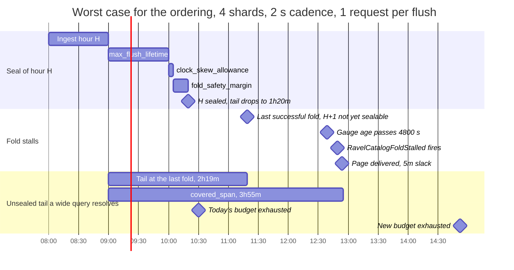

# ADR-1306: the query request budget covers the unsealed tail and the fold-stall alert window

Status: Accepted (2026-09-26). Issue #1306. Amends ADR-0075 decision 1 (the
one-hour span the per-shard allowance is sized from). No frozen format
changes; no migration class applies.

## Context

ADR-0075 made the default per-query object-store request budget a derived
figure. `derive_max_s3_requests` (`crates/ravel-query/src/config.rs:67-80`)
computes

```
budget = ceil(3600 s / max_flush_delay) x 3/2 x shard_count + 5,000
```

At the shipped 4 shards and the 2 s flush cadence (`IngestConfig::default`,
`crates/ravel-ingest/src/config.rs:470`) that is 1,800 x 3/2 x 4 + 5,000 =
15,800 requests. The span it is sized from is one open hour.

The span a recent-window query actually resolves is the unsealed tail, and it
is longer than an hour. `sealed_watermark_hour`
(`crates/ravel-catalog/src/fold.rs:369-382`) seals ingest hour `H` only when
`now >= end(H) + max_flush_lifetime + clock_skew_allowance +
fold_safety_margin`. Call that sum the seal margin. At the defaults it is
1 h + 5 m + 15 m = 4,800 s (`crates/ravel-catalog/src/config.rs:10,292,296`).
The unsealed tail is `now - end(watermark hour)`. With a fold running on
schedule it swings between the seal margin and the seal margin plus one hour.
That is 1 h 20 m just after a seal and 2 h 20 m just before the next one. The
`HOT_REGION_HOURS` comment (`crates/ravel-catalog/src/config.rs:194-217`)
states the same 2 h 20 m bound.

A narrow query does not escape the tail. Resolve lists every ingest-hour
bucket overlapping `[range.start - max_ingest_lag, now + clock_skew_allowance]`
(`docs/catalog-and-mvcc.md:1058-1061`), with `max_ingest_lag` at 2 h. Every
unsealed commit record in that window is listed and GET-decoded
(`docs/catalog-and-mvcc.md:1096-1103`). So a last-5-minutes query touches up to
3 h 10 m of tail, and a wider query touches all of it. The per-process record
cache would absorb repeated resolves, but at the defaults it is clamped to
25,000 entries against an uncapped estimate of 129,600
(`crates/ravel-catalog/src/config.rs:27`). A busy tenant's tail does not
fit, so "cold" is the normal case, not the rare one.

The budget counts every pooled request, resolve included. It is checked after
resolve and at each fetch boundary (`crates/ravel-query/src/engine.rs:2192-2197`
and the sites after it). A refusal is `QueryError::RequestBudgetExceeded`,
served as HTTP 422 (`crates/ravel-query/src/http/error.rs:120`).

Take the issue's own cost model: one request per unsealed flush per shard. At
4 shards and 2 s that is 7,200 requests per hour of tail. This model is not
yet measured (follow-up task 1), so the figures below are conditional on it.

The 5,000 fixed overhead is never available to the tail (decision 2), so
the tail's share of 15,800 is 10,800.

| Tail | Tail requests | Against the tail's 10,800 |
|---|---|---|
| 1 h 20 m (just after a seal) | 9,600 | fits, 1,200 spare |
| 1 h 30 m | 10,800 | the budget is exhausted |
| 2 h 20 m (just before a seal) | 16,800 | refused by 6,000 |

The issue computed 52 minutes of headroom from the first row. That is the best
point in the hour. At the worst point in the hour the headroom is negative,
with no fold lag at all.

(The 2026-09-26 amendment below records the measured cost: 2 requests per
flush inside the query's range, 14,400 per hour of tail at 4 shards and 2 s,
so a cold wide query exhausts the tail's 10,800 at a 45-minute tail and is
refused at every point in a healthy hour.)

PR #1636 landed the fold-liveness metrics for this issue: per-signal
`ravel_catalog_fold_cycles_total`, `ravel_catalog_fold_failures_total` and
`ravel_catalog_fold_last_success_timestamp_seconds`
(`services/ravel-server/src/metrics.rs:1847-1889`). It also shipped the
`RavelCatalogFoldStalled` alert (`deploy/prometheus/ravel.rules.yaml:39-48`).
The alert fires when the gauge's age exceeds 4,800 s and has done so for 10
minutes. That is 5,400 s after the last successful fold.

The issue asks for the metric to move, and the alert to fire, before the first
422. Under the current budget the order is the reverse. A fold that stalls at
the best point in the hour exhausts the budget about 10 minutes later. The
alert fires 90 minutes later. A fold that stalls at the worst point exhausts it
at once. The closing comment on #1636 inferred a wide margin in the other
direction; the arithmetic above does not support it. No test states or checks
the ordering.

Two related facts bound what any fix here can promise:

- The fold-liveness gauge is per signal and aggregated fleet-wide. One tenant
  whose fold is stuck leaves the gauge fresh, so `RavelCatalogFoldStalled`
  never fires for it. Only `RavelCatalogFoldFailing` covers that case, and
  only while the fold is actually failing
  (`docs/guides/observability.md`, "Two limits to know").
- A query with both a metrics and a log selector spends one shared budget
  across both lanes (`crates/ravel-query/src/engine.rs:1455-1473`). It can
  touch two tails.

## Decision

1. **The per-shard allowance covers the worst healthy tail plus the fold-stall
   alert's detection window.** The span the budget is sized from becomes

   ```
   seal_margin      = max_flush_lifetime + clock_skew_allowance + fold_safety_margin
   healthy_tail_max = seal_margin + 1 h
   lag_allowance    = seal_margin + FOLD_STALL_ALERT_FOR + ALERT_DELIVERY_SLACK
   covered_span     = healthy_tail_max + lag_allowance

   per_shard_allowance = ceil(covered_span / max_flush_delay)
                         x REQUESTS_PER_UNSEALED_FLUSH x 3/2
   budget = per_shard_allowance x shard_count + 5,000
   ```

   `FOLD_STALL_ALERT_FOR` is 600 s, the shipped alert's `for:`. The alert's
   threshold is already the seal margin, so those two terms are the time from
   the last successful fold to the rule's condition holding for its `for:`.
   `ALERT_DELIVERY_SLACK` is 300 s. It covers what lies between that moment
   and a page: the scrape interval, the rule evaluation interval and
   Alertmanager's `group_wait`. At the defaults, `covered_span` is 8,400 s +
   5,700 s = 14,100 s, or 3 h 55 m.

2. **The ordering holds by construction.** Let the last successful fold run at
   `T`. Its watermark leaves at most `healthy_tail_max` unsealed at `T`. The
   tail then grows one second per second. The page arrives by
   `T + lag_allowance`, when the tail is at most `covered_span`. So a budget
   that covers `covered_span` cannot refuse a query for fold lag before the
   page, for a query that resolves one signal lane. Per signal lane, the
   proof needs two conditions and nothing else:
   - each unsealed flush costs at most `REQUESTS_PER_UNSEALED_FLUSH` requests
     per shard (decision 4), and
   - the query's requests that do not scale with flushes fit the fixed
     overhead of 5,000. Those are the per-shard LISTs, the `HEAD` read,
     snapshot part and postings GETs, and GETs for sealed segments in range,
     which `max_segments` (1,024) bounds.

   The proof does not use the 3/2 headroom. That stays the retry allowance
   ADR-0075 gave it. Whatever retries leave of it is the operator's reaction
   time after the page.

3. **The three durations come from the `CatalogConfig` the fold and resolve
   actually run with.** `derive_max_s3_requests` gains the seal margin as an
   input. `ravel-server` passes the values from the `CatalogConfig` that
   `build_catalog` constructs (`services/ravel-server/src/query.rs:193-198`).
   `start` builds one catalog through `build_catalog_for_server`
   (`services/ravel-server/src/lib.rs:2138`) and hands it to both resolve and
   `fold::spawn`, so this is the seal margin the fold runs with.
   `build_catalog` sets none of the three today, so they are the compiled-in
   1 h, 5 m and 15 m. Whatever later sets them, the budget follows with no
   hand recomputation, as ADR-0075 decision 2 already requires for the flush
   cadence.

4. **The cost per unsealed flush is a named, measured constant.**
   `REQUESTS_PER_UNSEALED_FLUSH` starts at 1, the model the current code and
   the issue both assume. Follow-up task 1 measures it cold, by phase, before
   the constant is fixed. If the measurement says 2 (one commit-record GET
   plus one data-object GET for a flush inside the query's event range), the
   constant becomes 2. The 3/2 headroom is not the lever for that; it stays the
   retry allowance ADR-0075 gave it.
   (The 2026-09-26 amendment below records the measurement and sets the
   constant at 2, for segments at or under the whole-object threshold.)

5. **An explicit `--max-s3-requests` is still used verbatim.** Only the
   derived default changes, exactly as in ADR-0075 decision 1. The startup log
   that reports the resolved budget also reports `covered_span`, so an
   operator can see which span their explicit value undercuts.

6. **The refusal names fold lag when fold lag is the cause.** When a query is
   refused for its request budget and the resolved tail exceeds
   `healthy_tail_max`, the error text says so. It gives the tail's length and
   names `ravel_catalog_fold_last_success_timestamp_seconds`. The status stays
   422 and the result stays refused. This changes what the operator reads, not
   what the query returns.

The figures at the defaults, with `REQUESTS_PER_UNSEALED_FLUSH = 1`:

| Shards | `max_flush_delay` | Today | This decision |
|---|---|---|---|
| 1 | 2 s | 7,700 | 15,575 |
| 4 | 2 s | 15,800 | 47,300 |
| 8 | 2 s | 26,600 | 89,600 |
| 4 | 500 ms (the `EngineConfig::default` reference) | 48,200 | 174,200 |

At the 4-shard, 2 s default the worst single query now costs at most 47,300
GETs. At the repository's own $0.40 per million GET-class price
(`crates/ravel-types/src/cost_profile.rs:152`) that is $0.0189, against
$0.0063 today.

(The table and the cost above assume 1 request per flush. The 2026-09-26
amendment below gives them at the measured 2: 26,150, 89,600, 174,200 and
343,400, and $0.0358 for the 4-shard, 2 s query. The 2026-09-27 amendment
below supersedes those with the figures at 8 requests per flush: 89,600,
343,400, 681,800 and 1,358,600, and $0.1374 for the 4-shard, 2 s query.)

What a query can now rely on, at the modelled per-flush cost:

- At the default `max_ingest_lag` of 2 h, a query whose range covers the last
  50 minutes or less is never refused for fold lag, however long the fold
  stalls. Its resolve window is at most `W + max_ingest_lag + 1 h +
  clock_skew_allowance`, which is 3 h 55 m at `W` = 50 m. A larger
  `--max-ingest-lag` shrinks that window one for one.
- A wider query can still be refused once the stall runs long enough. That
  refusal comes after the page. At 4 shards and 2 s, with the 5,000 fixed
  overhead reserved for requests outside the tail, it comes when the tail
  reaches 42,300 / 7,200 = 5 h 52 m. That is about 2 h 03 m after the alert
  fires.
  (At the measured 2 requests per flush the 2026-09-26 amendment below gets
  84,600 / 14,400, the same 5 h 52 m.)


```mermaid
gantt
    title Worst case for the ordering, 4 shards, 2 s cadence, 1 request per flush
    %% At the measured 2 per flush see the 2026-09-26 amendment below: the new budget still runs out at 14:52, today's never admits a wide query
    dateFormat HH:mm
    axisFormat %H:%M
    section Seal of hour H
    Ingest hour H                         :h, 08:00, 60m
    max_flush_lifetime                    :fl, 09:00, 60m
    clock_skew_allowance                  :sk, 10:00, 5m
    fold_safety_margin                    :mg, 10:05, 15m
    H sealed, tail drops to 1h20m         :milestone, m0, 10:20, 0m
    section Fold stalls
    Last successful fold, H+1 not yet sealable :milestone, m1, 11:19, 0m
    Gauge age passes 4800 s               :milestone, m2, 12:39, 0m
    RavelCatalogFoldStalled fires         :milestone, m3, 12:49, 0m
    Page delivered, 5m slack              :milestone, m4, 12:54, 0m
    section Unsealed tail a wide query resolves
    Tail at the last fold, 2h19m          :t1, 09:00, 139m
    covered_span, 3h55m                   :t2, 09:00, 235m
    Today's budget exhausted              :milestone, q0, 10:30, 0m
    New budget exhausted                  :milestone, q1, 14:52, 0m
```

Today's budget runs out at 10:30, ten minutes after a seal and before the
fold has even stalled. The new budget runs out at 14:52, about 2 h 03 m after
the alert fires. Both times reserve the 5,000 fixed overhead for requests
outside the tail.

(The 2026-09-26 amendment below recomputes these times at the measured 2
requests per flush: the new budget still runs out at 14:52, and today's budget
refuses a cold wide query throughout the healthy hour, not from 10:30.)

## Rejected alternatives

- **Keep the budget and rely on the alert (option 3).** Lost because the alert
  is not first. Under today's budget a cold wide query is refused about 10
  minutes into a stall at best and at once at worst. The alert needs 90 minutes. A
  documented "422s during fold lag are expected" would describe an outage that
  pages after the users notice it. It would also leave the refusals at the top
  of every healthy hour unexplained.
  (At the measured 2 requests per flush, the 2026-09-26 amendment below finds
  today's budget refuses a cold wide query before any stall, at every point in
  the hour.)

- **Serve a partial result with a visible flag, or fall back to a slower path
  (option 2).** A partial result by default breaks the rule that approximation
  is opt-in and visible, never silent. A flag in the response body is not
  opt-in: a dashboard that never reads it shows a short answer as a complete
  one. An opt-in partial mode would not help the callers that hit this, since
  none of them ask for it. A slower path does not help either. The capped
  quantity is the request count, and a slower path that reads the same
  unsealed records issues the same requests. The issue's "wider listing" has
  the same problem: the LIST is cheap, and the per-record GETs are the cost. A
  query-triggered fold is a write from a read path, and the fold is stalled
  because it is failing, so the query cannot fix it.

- **Scale the budget with the measured unsealed tail at query time
  (option 4).** Resolve does know the watermark before it lists, so this is
  buildable. It lost on cost predictability. The cap would grow without bound
  in exactly the failure where queries get more expensive. A day-long stall
  would silently multiply the allowed cost of every wide query by ten or more.
  That is the "exempt the open hour" alternative ADR-0075 already rejected,
  arriving through a different door. A capped variant needs a ceiling. The
  only principled ceiling is `covered_span`, which is this decision with more
  moving parts.

- **Widen by a flat multiple, for example 3x today's figure.** Lost for the
  reason ADR-0075 rejected a flat 40,000. The number would carry no
  explanation of when it stops being enough. It would also silently decouple
  from the alert: raising the alert threshold would break the ordering and no
  test would notice.

- **Cover the healthy tail only (`healthy_tail_max`, 2 h 20 m).** This fixes
  the refusals at the top of every healthy hour, and gives a 4-shard, 2 s
  budget of 30,200. At zero headroom the first refusal would come between a
  few seconds and an hour into a stall, before the 90-minute alert. With the
  3/2 headroom and the fixed overhead counted it would come at a 4 h 11 m
  tail, after the alert. So the ordering would hold only by spending the
  retry headroom as lag slack, and nothing would tie that slack to the alert.
  It lost because the property the issue asks for would rest on a
  coincidence of constants. Decision 2 proves the ordering without touching
  the headroom.
  (The 2026-09-26 amendment below corrects the 4 h 11 m: with the fixed
  overhead reserved, as decision 2 does, this alternative refuses at a
  3 h 30 m tail, before the page, at either per-flush cost.)

- **Tighten the alert instead of widening the budget.** A 20-minute threshold
  would page before today's budget runs out at the best point in the hour. It
  would not help at the worst point, where the budget is already exceeded with
  no stall. It also cuts the alert's margin from about 14 missed fold ticks
  to about 3 (`docs/guides/observability.md`, threshold section). A restart
  or one slow cycle would then page.

## Consequences

- A cold recent-window query no longer fails at the top of a healthy hour. A
  stalled fold pages before it refuses any query, for any query range, at the
  modelled per-flush cost.
- The worst-case per-query spend rises about 3x at the shipped defaults,
  from 15,800 to 47,300 requests. It is still a fixed number computed from
  configuration, which is what ADR-0073 decision 3 asks for. A runaway query
  is still bounded.
  (At the measured cost the 2026-09-26 amendment below gives 89,600, about
  5.7x today's figure. The 2026-09-27 amendment below sizes each flush at 8
  and gives 343,400, about 21.7x.)
- The budget and the alert are now coupled. Raising the alert's threshold or
  its `for:` without raising `lag_allowance` breaks the ordering. Follow-up
  task 4 makes that a failing test rather than a review comment. A
  deployment that routes this alert through a slower pipeline than
  `ALERT_DELIVERY_SLACK` allows loses the guarantee by the difference.
- The guarantee is per signal lane and per fleet-wide fold. It does not cover
  a single tenant whose fold is stuck while its signal's gauge stays fresh.
  It does not cover a query with both a metrics and a log selector, which
  spends one budget across two tails. The observability guide states the
  per-tenant case today (`docs/guides/observability.md:517-525`); task 7
  adds the two-lane case.
- The per-flush term counts the age trigger only. A tenant that also flushes
  on the 8 MiB size trigger produces more records per shard-hour than
  `ceil(3600 / max_flush_delay)`. That under-count exists in ADR-0075 already
  and this decision does not change it.
- Operators with an explicit `--max-s3-requests` are unaffected. The startup
  log now tells them the `covered_span` their value is measured against.
- If task 1 measures `REQUESTS_PER_UNSEALED_FLUSH` at 2, every figure above
  doubles in its per-shard term. The 4-shard, 2 s budget would be 89,600.
  That is the honest cost, not headroom.
  (Task 1 did measure 2; the 2026-09-26 amendment below records it, and that
  the per-flush bound holds only under the whole-object threshold. The
  2026-09-27 amendment below keeps flush size uncapped and budgets 8 per
  flush, 343,400 at 4 shards and 2 s, and names the per-selector gap.)

### Follow-up tasks

Each task names the test that accepts it.

1. **Measure the cold cost per unsealed flush, and the cost outside the
   tail, by phase.** `ravel-query`, on `MemoryStore`. Pre-register the
   expected figures on #1306 first: 1 request per flush for a narrow query,
   2 for a wide one. Acceptance test:
   `cold_recent_query_requests_per_unsealed_flush_by_phase`.
   - It writes N flushes on each of S shards, all unsealed, plus a sealed
     region with a known segment count.
   - It runs a last-5-minutes query and a query over the whole tail. Each
     runs against a fresh `Catalog` with an empty record cache.
   - It asserts the exact `resolve` and `scan` phase request counts for both,
     split into the per-flush part and the rest (LIST pages, `HEAD`, parts,
     sealed segments).
   - The per-flush part sets `REQUESTS_PER_UNSEALED_FLUSH`. The rest is
     checked against the 5,000 fixed overhead at `max_segments`.

2. **Derive the budget from `covered_span`.** `ravel-query` `config.rs`: the
   seal-margin input, `FOLD_STALL_ALERT_FOR`, `ALERT_DELIVERY_SLACK`,
   `REQUESTS_PER_UNSEALED_FLUSH`, and a parts function that takes the
   headroom and the fixed overhead as fields, for task 3. Acceptance test:
   `derived_budget_covers_healthy_tail_plus_stall_alert_window`.
   - It pins `covered_span` at 14,100 s and the four budgets in the table
     above exactly.
   - It asserts today's 15,800 refuses the 16,800-request tail at 2 h 20 m,
     and the new 47,300 admits it.
   - It asserts a runaway cost of three times the `covered_span` cost is still
     refused.
   - (The 2026-09-26 amendment below gives the corrected acceptance figures
     for `REQUESTS_PER_UNSEALED_FLUSH` = 2, and the flush-size decision this
     task must also make. The 2026-09-27 amendment below records that
     decision and replaces those figures, and corrects task 3's budget.)
   - The existing `open_hour_at_default_shards_fits_the_derived_budget`,
     `budget_follows_flush_cadence` and `budget_scales_with_shard_count` keep
     passing unchanged.

3. **Prove the ordering end to end.** `services/ravel-server/tests`, new file
   `fold_lag_budget_ordering.rs`. Acceptance test:
   `fold_stall_alert_fires_before_first_request_budget_refusal`.
   - `run_tenant_tick` reads `SystemClock` directly
     (`services/ravel-server/src/fold.rs:265`), so the test drives
     `Catalog::fold` with an explicit `now_ns` rather than the loop.
   - It uses a scaled cadence (60 s, 2 shards) so the tail is hundreds of
     records. The budget comes from task 2's parts function with the headroom
     at 1, the case decision 2's proof covers.
   - The fixed overhead is not zero. A cold query always spends LISTs, a
     `HEAD` read and sealed-segment GETs outside the tail. The test measures
     that non-per-flush count from the query's phase accounting at the first
     step, and uses it as the overhead. At zero overhead the scaled budget
     would refuse before the alert on those requests alone, and the test would
     fail against the fix.
   - It writes flushes at that cadence and folds every 5 minutes until the
     worst point in the hour. From then on a `FaultStore` fault fails the
     fold's `HEAD` PUT, so the fold is still called and fails.
   - Each simulated minute it renders the catalog metric family and evaluates
     the shipped alert condition: gauge age over 4,800 s, held for 600 s. It
     also runs a cold query over the last 6 hours.
   - It asserts that the alert condition becomes true at some step, and that
     a refusal happens at a step at least `ALERT_DELIVERY_SLACK` later. It
     asserts the refusal is `RequestBudgetExceeded`, so a refusal is known to
     happen (non-vacuity). It asserts `ravel_catalog_fold_failures_total`
     moved and the `FaultStore` counter shows the fault fired.
   - It replays the same timeline against today's one-hour span and asserts
     the refusal comes first there. That is the mutation proof: the test fails
     on the tree this ADR fixes.
   - "The metric moves first" is not asserted on its own. The gauge's age
     grows from the first second of any stall, so that claim is true under
     both budgets and proves nothing.

4. **Couple the shipped alert to the budget.** `services/ravel-server/tests`,
   next to `shipped_rules_name_emitted_metrics.rs`. Acceptance test:
   `shipped_fold_stall_alert_fits_the_budget_lag_allowance`. It parses
   `RavelCatalogFoldStalled` from `deploy/prometheus/ravel.rules.yaml`. It
   asserts the threshold equals the default `CatalogConfig` seal margin in
   seconds. It asserts threshold plus `for:` plus `ALERT_DELIVERY_SLACK` is
   at most the `lag_allowance` that `ravel-query` derives.

5. **Wire the seal margin through the server and prove it is the running
   one.** `ravel-server` `config.rs` and `query.rs`. Acceptance test:
   `derived_request_budget_uses_the_catalogs_seal_margin`, modelled on the
   existing `max_s3_requests_budget_is_reachable_from_cli` (`config.rs:7524`).
   It asserts the budget the server enforces equals the derivation called
   with the `CatalogConfig` that `build_catalog` returns, not with the
   `ravel_query` reference constants. The existing
   `consistency_model_defaults.rs` budget check is updated to the new inputs.

6. **Name fold lag in the refusal.** `ravel-query`, with the `ravel-sql`
   error mapping (`crates/ravel-sql/src/error.rs:242`) that wraps
   `RequestBudgetExceeded`. Acceptance test:
   `budget_refusal_during_fold_lag_names_the_unsealed_tail`. A refusal with a
   tail over `healthy_tail_max` carries the tail length and the gauge name. A
   refusal with a healthy tail does not. Both still map to 422. The gate
   includes the `sql` and `flight-sql` lanes.

7. **Documentation, in the same change as tasks 2 to 5.**
   `docs/query-engine.md` "Budgets", the `--max-s3-requests` flag help text,
   and `docs/guides/observability.md`. The threshold section states the
   ordering, the 50-minute window, the delivery slack, and the two uncovered
   cases above. The ADR-0075 amendment lands with this ADR's acceptance, and
   the `docs/adrs/README.md` index gains the ADR-1306 row.

## Amendment (2026-09-26): REQUESTS_PER_UNSEALED_FLUSH is measured at 2

<!-- amendment-applies: sections="Context|Decision|Rejected alternatives|Consequences|Follow-up tasks" pointer="2026-09-26 amendment" -->

### The measurement

Follow-up task 1 landed as
`cold_recent_query_requests_per_unsealed_flush_by_phase`
(`crates/ravel-query/tests/unsealed_flush_request_cost.rs`, PR #2019). On
`MemoryStore`, with a fresh `Catalog` and engine per query, it reads each
figure off the difference between two fixtures rather than assuming it:

- A flush outside the query's event range costs 1 request: its commit-record
  GET in resolve.
- A flush inside the range costs 2: the commit-record GET and one
  whole-object data GET in plan. Probe and scan issue nothing more for a
  segment at or under the fetcher's 512 KiB whole-object threshold
  (`DEFAULT_WHOLE_OBJECT_THRESHOLD`, `crates/ravel-query/src/fetcher.rs`).
- Outside the tail a query costs 6 fixed requests (the `HEAD`, snapshot part
  and postings GETs, one commit LIST per shard at 2 shards, one tombstone
  LIST) plus 1 per sealed segment in range. Scaled to the 4-shard reference
  deployment and 1,024 sealed segments that is 3 + 4 + 1 + 1,024 = 1,032,
  inside the 5,000 fixed overhead. It is a floor for a small catalog (one
  part, one postings object, one LIST page per shard), not a proof of decision
  2's second condition.

`REQUESTS_PER_UNSEALED_FLUSH` is 2, the in-range cost, as decision 4 said it
would become. The formulas of decisions 1 and 2 stand unchanged.

### Recomputed figures

`covered_span` is still 14,100 s. With the constant at 2,
`per_shard_allowance = ceil(14,100 s / max_flush_delay) x 2 x 3/2`:

| Shards | `max_flush_delay` | Today | This decision, at 2 per flush |
|---|---|---|---|
| 1 | 2 s | 7,700 | 7,050 x 2 x 3/2 x 1 + 5,000 = 26,150 |
| 4 | 2 s | 15,800 | 7,050 x 2 x 3/2 x 4 + 5,000 = 89,600 |
| 8 | 2 s | 26,600 | 7,050 x 2 x 3/2 x 8 + 5,000 = 174,200 |
| 4 | 500 ms | 48,200 | 28,200 x 2 x 3/2 x 4 + 5,000 = 343,400 |

At 4 shards and 2 s a cold wide query spends 1,800 x 2 x 4 = 14,400 requests
per hour of tail.

- Today's budget leaves 10,800 for the tail, which a wide query exhausts at
  10,800 / 14,400 = 45 minutes of tail. A healthy tail is never shorter than
  1 h 20 m, where the query needs 19,200 and is refused by 8,400; at 2 h 20 m
  it needs 33,600 and is refused by 22,800. Today's budget refuses a cold wide
  query at every point in a healthy hour, not from 10:30 as the gantt chart
  shows.
- The new budget leaves 84,600 for the tail, exhausted at
  84,600 / 14,400 = 5.875 h, or 5 h 52 m 30 s. Both sides of that division
  doubled, so the refusal point is unchanged: 14:52 on the chart, 2 h 03 m
  after the alert fires at 12:49 and 1 h 58 m after the page at 12:54.
- A narrow query pays 1 per flush outside its range, so its figures only
  improve. The 50-minute window depends on spans alone and is unchanged.
- The "cover the healthy tail only" alternative gives
  4,200 x 2 x 3/2 x 4 + 5,000 = 55,400 at 2 per flush. Its tail share is
  50,400 / 14,400 = 3 h 30 m, the same as 25,200 / 7,200 at 1 per flush.
  The 4 h 11 m in that entry divided the whole 30,200 by 7,200, counting the
  fixed overhead as tail share. With the overhead reserved it refuses 25
  minutes before the 3 h 55 m page at either cost, which strengthens its
  rejection.

At $0.40 per million GET-class requests the worst 4-shard, 2 s query now
costs 89,600 x $0.40 / 1,000,000 = $0.0358, against $0.0063 today, about
5.7x (89,600 / 15,800).
(The 2026-09-27 amendment below budgets 8 per flush instead of 2: the table
becomes 89,600, 343,400, 681,800 and 1,358,600, and the worst query $0.1374.)

### The proof holds only under the whole-object threshold

The constant is a measured cost, not an upper bound. Decision 2's proof needs
each unsealed flush to cost at most `REQUESTS_PER_UNSEALED_FLUSH` per shard,
and it spends none of the 3/2 headroom on that. So the proof holds only while
every unsealed flush stays at or under the 512 KiB whole-object threshold.
Ingest does not guarantee that: `min_flush_bytes` is 256 KiB, and nothing
caps a flush below the 8 MiB `target_bytes` size trigger.

A segment just over the threshold, read for a matcher on the dense catalog
path with one page range outside the footer tail, costs 4 cold requests
(`open_segment` and `decode_selected` in `fetcher.rs`):

1. the commit-record GET in resolve;
2. the footer-tail GET, an absolute 64 KiB range at the end of the object;
3. one catalog GET: LABEL_DICT, SERIES_IDS and SERIES_META sit contiguously
   at the front of the object and coalesce into one range;
4. one page-range GET.

That is a lower bound for larger segments. Every further coalesced page run
(runs more than 64 KiB apart) adds one GET, and a footer longer than 64 KiB
adds a chase GET. No path costs fewer than 3: a page range inside the tail
buffer, or a sparse object read whole after its footer, drops one GET but
never the commit record or the footer read.

Follow-up task 2 must therefore do one of two things: bound unsealed flush
size at the whole-object threshold, or size the per-flush term for the
above-threshold case. It should bound the flush size. (Superseded: the
2026-09-27 amendment below keeps flush size uncapped and sizes the term.)
The above-threshold cost grows with the page runs a query selects and has no
ceiling of its own, so a sized term would be a guess or would need a bound of
its own anyway. A size bound keeps the measured 2 exact and pinned by task 1's test. It makes a
busy tenant flush more often, which is the size-trigger under-count the
Consequences already name; task 2 should size the record count per
shard-hour for that case in the same change.

### Corrected task 2 acceptance figures

`derived_budget_covers_healthy_tail_plus_stall_alert_window`:

- pins `covered_span` at 14,100 s and the four budgets at 26,150, 89,600,
  174,200 and 343,400 exactly;
- asserts today's 15,800 refuses the tail at 2 h 20 m, which costs
  4,200 x 2 x 4 = 33,600 requests at 4 shards and 2 s, and the new 89,600
  admits it;
- asserts a runaway cost of three times the `covered_span` cost,
  3 x 7,050 x 2 x 4 = 169,200, is still refused by 89,600.

(The 2026-09-27 amendment below replaces these acceptance figures with the
ones at 8 requests per unsealed flush: 89,600, 343,400, 681,800 and 1,358,600.)

## Amendment (2026-09-27): unsealed flush size stays uncapped; the budget covers flushes above the whole-object threshold

<!-- amendment-applies: sections="Decision|Consequences|Follow-up tasks|Amendment (2026-09-26): REQUESTS_PER_UNSEALED_FLUSH is measured at 2" pointer="2026-09-27 amendment" -->
<!-- amendment-supersedes: phrase="It should bound the flush size." pointer="2026-09-27 amendment" -->

### The decision

On 2026-09-26/27 the project owner decided, on issue #1306, not to cap
unsealed flush size at the whole-object threshold. A cap would make a busy
tenant flush several times more often, multiplying commit records and the
resolve cost of every recent-window query, to protect a per-flush figure that
only matters for the request budget. Follow-up task 2 instead sizes the
per-flush term for flushes above the 512 KiB threshold, and gives that term a
ceiling in the fetcher. This retires the 2026-09-26 amendment's
recommendation that task 2 bound the flush size, and with it that amendment's
suggestion to size the size-trigger record count in the same change; the
size-trigger under-count stays the pre-existing one the Consequences name.

### The measurement

`cold_requests_per_unsealed_flush_above_whole_object_threshold`
(`crates/ravel-query/tests/unsealed_flush_request_cost.rs`) repeats task 1's
difference measurement at flushes of 7,700,472 bytes, about 7.7 MB, far above
the threshold and just under the 8 MiB `target_bytes`. Cold, per unsealed flush
per shard, split as resolve, plan, probe and scan:

- a narrow query, the flush outside its range: 1 (the commit-record GET);
- a wide query selecting every series: 4 (commit record, footer tail, one
  catalog GET, one page run);
- a query selecting every other series, 48 page runs that coalescing cannot
  join: 1 + 1 + 1 + 48 = 51 without a bound.

The third figure is the one the 2026-09-26 amendment predicted: the page-range
cost grows with the runs a query selects and has no ceiling of its own.

### The per-L0-segment page-range bound

`SegmentFetcher::fetch_pages` now bridges the smallest gaps between coalesced
page runs until at most `MAX_PAGE_RANGE_GETS_PER_L0_SEGMENT` = 4 remain, on an
L0 segment only (`bound_runs`, `crates/ravel-query/src/fetcher.rs`). Scalar
and histogram pages are fetched in one batch, so the bound holds whichever
page kinds a query selects. The ceilings that follow:

- one L0 segment fetch issues at most `MAX_GETS_PER_L0_SEGMENT_FETCH` =
  1 + 1 + 1 + 4 = 7 GETs: the first GET (whole object, footer tail or suffix),
  at most one footer chase, one catalog GET and 4 page-range GETs;
- one unsealed flush costs at most `MAX_REQUESTS_PER_UNSEALED_FLUSH` =
  1 + 7 = 8 requests per selector fetch: its commit-record GET plus that fetch.

With the bound, the 48-run query measures 1 + 1 + 1 + 4 = 7 per flush, one
under the ceiling (its footer fits the 64 KiB tail, so it needs no chase). An
L1 segment keeps unbounded page runs, since a compacted segment can be far
larger than one flush; `l1_fetch_issues_one_page_range_get_per_run` pins that
exemption.

The derived budget sizes each flush at `BUDGETED_REQUESTS_PER_UNSEALED_FLUSH`,
the larger of the measured small-flush 2 and the ceiling 8, so 8. The formulas
of decisions 1 and 2 stand, with 8 in place of `REQUESTS_PER_UNSEALED_FLUSH`.

### Recomputed figures at 8 per flush

`covered_span` is still 14,100 s, so 7,050 flushes per shard at 2 s and 28,200
at 500 ms:

| Shards | `max_flush_delay` | Today | This decision, at 8 per flush |
|---|---|---|---|
| 1 | 2 s | 7,700 | 7,050 x 8 x 3/2 x 1 + 5,000 = 89,600 |
| 4 | 2 s | 15,800 | 7,050 x 8 x 3/2 x 4 + 5,000 = 343,400 |
| 8 | 2 s | 26,600 | 7,050 x 8 x 3/2 x 8 + 5,000 = 681,800 |
| 4 | 500 ms | 48,200 | 28,200 x 8 x 3/2 x 4 + 5,000 = 1,358,600 |

At $0.40 per million GET-class requests the worst 4-shard, 2 s query costs
343,400 x $0.40 / 1,000,000 = $0.1374, against $0.0063 today, about 21.7x
(343,400 / 15,800), and about 3.8x the 2026-09-26 amendment's $0.0358
(343,400 / 89,600).

The tail at 2 h 20 m, at 4 shards and 2 s, at the ceiling cost:

- it holds 8,400 s / 2 s = 4,200 flushes per shard, costing
  4,200 x 8 x 4 = 134,400 requests, or 139,400 with the 5,000 fixed overhead;
- today's 15,800 refuses it;
- the new 343,400 admits it, and the same tail at the small-flush 2,
  4,200 x 2 x 4 = 33,600, fits too.

A runaway at three times the `covered_span` cost,
3 x 7,050 x 8 x 4 = 676,800, is still refused by 343,400.

The refusal point relative to the stall alert is unchanged. The tail's share
of the budget is 343,400 - 5,000 = 338,400, and a cold wide query at the
ceiling spends 1,800 x 8 x 4 = 57,600 per hour of tail, so the budget runs out
at 338,400 / 57,600 = 5.875 h, or 5 h 52 m 30 s, the same as
84,600 / 14,400 at 2 per flush and 42,300 / 7,200 at 1. Both sides of the
division scale with the per-flush term. On the gantt chart it is still 14:52,
2 h 03 m after the alert fires and 1 h 58 m after the page. A query whose
flushes cost less than the ceiling is refused later still.

### What the bound costs in bytes

Bridging a gap fetches bytes the query did not select. They are fetched like
any other page bytes: reserved against the process fetch memory budget before
the GETs are issued (ADR-1170 decision 2), and charged to `max_bytes_scanned`
and to the scan phase. A selective query over large L0 flushes can therefore
read up to about the object size per segment. That is the same order as the
existing whole-object fallback, which reads a segment at or under the threshold,
or a sparse object that does not qualify for the catalog-probe path, whole. The
request budget gains a ceiling; the byte budget keeps the one it had.

### The per-flush term is per selector fetch

`prefetch` fetches each segment once per selector (the `estimate_cost` comment
in `crates/ravel-query/src/engine.rs`), while resolve reads each commit record
once. So an N-selector query pays up to 1 + 7N requests per unsealed flush
above the threshold, and up to 1 + N at or under it. The derived budget does
not account for this: it sizes every flush at 8, which covers one selector at
any size and up to seven at or under the threshold. This is a known gap, the
same shape as the two-lane case the Consequences already name. A two-selector
query over large flushes at the ceiling spends 1 + 14 = 15 per flush, 1,800 x
15 x 4 = 108,000 per hour of tail at 4 shards and 2 s, and exhausts the tail
share at 338,400 / 108,000 = 3.13 h, about 3 h 08 m, before the 3 h 55 m page.
Decision 2's guarantee holds for a query with one selector per signal lane.
Closing the gap needs either a per-query budget scaled by selector count, which
would repeat the "scale with the query" alternative's cost-predictability
problem, or a fetch shared across selectors; neither is decided here.

### Acceptance figures for tasks 3 to 7

- Task 2, `derived_budget_covers_healthy_tail_plus_stall_alert_window`: pins
  `covered_span` at 14,100 s and the four budgets at 89,600, 343,400, 681,800
  and 1,358,600; asserts today's 15,800 refuses the 134,400-request tail at
  2 h 20 m and 343,400 admits it; asserts the 676,800 runaway is refused.
- Task 3, `fold_stall_alert_fires_before_first_request_budget_refusal`: its
  fixture's flushes are small, so each costs at most 2, a quarter of the
  budgeted 8. With the shipped term at the task's scaled cadence (60 s,
  2 shards, headroom 1) the bare allowance is 235 x 8 x 2 = 3,760 plus the
  measured overhead, while a last-6-hours query resolves at most about
  8 h 05 m of flushes, 485 per shard, 360 x 2 + 125 x 1 = 845 per shard or
  1,690 in all. It would never be refused and the test would fail its own
  non-vacuity assertion. The test builds its budget from task 2's parts
  function with the per-shard allowance recomputed at the fixture's measured
  per-flush cost, `ceil(covered_span / 60 s) x REQUESTS_PER_UNSEALED_FLUSH` =
  235 x 2 = 470, since decision 2's proof is parametric in that cost. The
  replay against today's one-hour span uses the same per-flush cost,
  60 x 2 = 120 per shard.
- Task 4 quotes no budget figure and is unchanged.
- Task 5's `consistency_model_defaults.rs` check computes the figure from the
  derivation, so it follows 343,400 with no restated number.
- Task 6 quotes no budget figure and is unchanged.
- Task 7 states 343,400 at 4 shards and 2 s, and 1,358,600 for the
  `EngineConfig::default` reference pair, in `docs/query-engine.md` and the
  `--max-s3-requests` help text. The observability guide names the
  multi-selector gap above as a third case the ordering does not cover.
