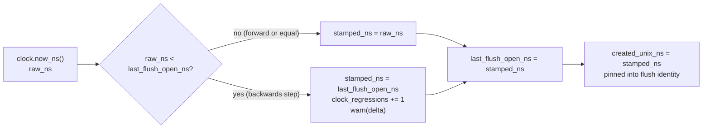

# ADR-1307: Per-writer monotonic flush clock for duplicate resolution

Status: Proposed

## Context

A flush pins its identity at flush open (ADR-0067): a shard actor reads the
injected `Clock` once, stamps that reading as the commit record's
`created_unix_ns`, and carries it verbatim into the spawned flush task. That
same `created_unix_ns` is the primary key of the query-time duplicate-resolution
order (docs/catalog-and-mvcc.md, "Cross-segment duplicate samples"): among
duplicates of one `(series_id, ts)`, the greatest
`(created_unix_ns, writer_epoch, writer_seq, in-page index)` wins.

The reading has a range check but no order check. The receiver's admission
clock and the flush-open path reject a reading below a compiled floor
(2020-01-01) or one that yields no representable ingest-hour bucket (ADR-0051
amendment, docs/consistency-model.md). That floor bounds how far off a single
reading may be; it says nothing about how two readings from the same writer
order against each other.

So a backwards wall-clock step small enough to stay above the floor inverts
duplicate resolution. Concretely: a writer flushes `(S, ts=100) = 1.0` at clock
`T0`, stamping `created_unix_ns = T0`. NTP then steps the host back ten minutes.
The correction `(S, ts=100) = 2.0` flushes and stamps `created_unix_ns =
T0 - 600s`, which is less than `T0`. At query time the stale `1.0` now outranks
its own correction and wins every read, silently and permanently.

This is not a durability defect. Both writes are durably committed and both
acknowledgements are honest. It is broken last-write-wins for duplicates: the
key that is supposed to order a correction after the value it replaces can run
backwards.

The RSEG layout, the object key layout, and the commit-record schema are frozen
contracts; none of them changes here. Only the value stamped into the existing
`created_unix_ns` field changes, and only in the direction of never decreasing.

## Decision

Each shard actor keeps a per-writer monotonic floor, `last_flush_open_ns`, in
memory. At the single flush-open read site, the stamp becomes the raw reading
raised to that floor, and the floor advances to the result:

```
stamped_ns   = raw_ns.max(last_flush_open_ns)
last_flush_open_ns = stamped_ns
```

When the floor holds the stamp above the raw reading (a backwards step), the
actor increments a counter, `clock_regressions`, once and logs the absorbed
delta at `warn`. The counter is carried per signal on each ingest metrics
snapshot (`IngestMetrics`, `LogIngestMetrics`, `SpanIngestMetrics`) and is
intended for Prometheus export as `ravel_ingest_clock_regressions_total`.

The change is mirrored identically at all three shard actors
(`crates/ravel-ingest/src/shard.rs`, `log_shard.rs`, `span_shard.rs`), because
each carries its own copy of the flush-open read and hour-bucket computation.

The floor is in-process state only. It is never persisted and never read back
after a restart. A restart mints a fresh `writer_id` (IngestRouter's
per-generation writer factory), and because `writer_id` is a component of the
dedup key, a restarted process's records order against a prior process's by
identity, not by the floor. The floor resets to 0 on restart by construction,
which is correct: the guarantee it provides is per-writer within one process
lifetime, and cross-process order already rests on the identity rule that a
crash retires its identity (commit/README.md, ADR-0002).

The floor's default of 0 preserves the fail-loud behaviour for a non-positive
flush clock: `max(0, 0) = 0` introduces no spurious regression, and the
hour-bucket range check still rejects the flush.



## Rejected alternatives

- **A single monotonic anchor per process (stamp = anchor + elapsed, read
  once).** Rejected: it drifts the stamp away from wall time without bound, and
  the same reading is also range-checked into an ingest-hour bucket that is
  wall-clock-derived. A stamp that has drifted arbitrarily from wall time would
  bucket into the wrong hour or fail the range check on an otherwise healthy
  clock. The floor instead tracks wall time exactly except across the rare
  backwards step it absorbs.

- **Refuse the flush on a backwards step.** Rejected: it turns a transient
  clock correction into an ingest outage. A backwards NTP step is a normal
  operational event; the correct response is to absorb it and count it, not to
  fail acknowledged writes. The floor keeps ingest available and makes the
  event observable through the counter and the log.

- **Persist the floor and read it back on restart.** Rejected as both
  unnecessary and contrary to the durability model: no durability may depend on
  local disk (repository invariant), and cross-process order is already
  established by the fresh `writer_id`. Persisting the floor would add a
  local-disk read to the recovery path for a guarantee the identity rule
  already provides.

## Consequences

- Within a process lifetime, a writer's `created_unix_ns` stamps are
  non-decreasing, so a later flush of the same writer never loses duplicate
  resolution to an earlier one on account of a backwards clock. The correction
  in the scenario above is stamped at the floor (equal to the original), and its
  strictly greater `writer_seq` carries the tiebreak, so its full dedup key
  outranks the stale sample.
- Every absorbed backwards step is counted (`clock_regressions`) and logged, so
  a misbehaving clock is visible rather than silent. Prometheus export of the
  new counter as `ravel_ingest_clock_regressions_total` from `ravel-server` is a
  follow-up; the counter is present in the ingest metrics snapshot now.
- No format, schema, or key layout changes. The stamp still lands in the
  existing `created_unix_ns` field; only its monotonicity within a process
  changes.
- A forward clock step is unaffected: the raw reading exceeds the floor, is
  stamped verbatim, and the counter does not move.

## Formal classification

FORMAL_RELEVANT; no model change.

The relevant model is `formal/tla/commit/CommitProtocol.tla`. It has a `clock`
variable and stamps `openedAt[f] = clock` at flush open, which is structurally
the `created_unix_ns` stamp. But the model cannot express this defect without
new machinery, and adding that machinery is outside its frozen abstraction
boundary:

- `clock` is monotone by construction. The only action that changes it is
  `Tick`, which sets `clock' = clock + 1`; there is no backwards-step action, so
  the model cannot reach the state this ADR fixes.
- `openedAt[f]` is a deadline input (it feeds `Expired`, the flush-lifetime
  check), not a duplicate-resolution key. The model's read path (`RunQuery`)
  answers commit *visibility* only.
- The model's own abstraction boundary places duplicate-resolution ordering out
  of scope: "Segment contents, series identity, query evaluation. A query asks
  only whether a commit is visible," and commit-record `created_unix_ns`
  reconstruction is listed under "Out of scope."

Modelling this defect would require adding a backwards-clock action, a
`created_unix_ns`-ordered duplicate resolution among same-series records, and a
query that resolves duplicates by that order: a new sub-model of query-time
dedup, not a guard on an existing variable. The invariant the fix establishes,
stated in prose, is: within one writer's process lifetime the sequence of
`created_unix_ns` stamps it issues is non-decreasing, and cross-process order
rests on the distinct `writer_id` component of the dedup key.

Refs: #1307
