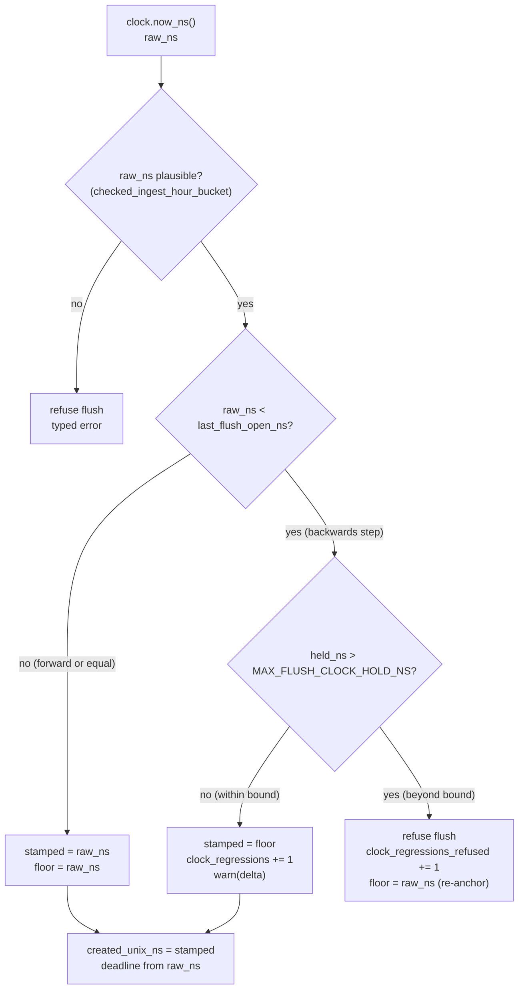

# ADR-1307: Per-writer monotonic flush clock for duplicate resolution

Status: Proposed

## Context

A flush pins its identity at flush open (ADR-0067): a shard actor reads the
injected `Clock` once, stamps that reading as the commit record's
`created_unix_ns`, and carries it verbatim into the spawned flush task. That
same `created_unix_ns` is the primary key of the query-time duplicate-resolution
order (docs/catalog-and-mvcc.md, "Cross-segment duplicate samples"): among
duplicates of one `(series_id, ts)`, the greatest
`(created_unix_ns, writer_epoch, writer_seq, in-page index)` wins.

The reading has a range check but no order check. The receiver's admission
clock and the flush-open path reject a reading below a compiled floor
(2020-01-01) or one that yields no representable ingest-hour bucket (ADR-0051
amendment, docs/consistency-model.md). That floor bounds how far off a single
reading may be; it says nothing about how two readings from the same writer
order against each other.

So a backwards wall-clock step small enough to stay above the floor inverts
duplicate resolution. Concretely: a writer flushes `(S, ts=100) = 1.0` at clock
`T0`, stamping `created_unix_ns = T0`. NTP then steps the host back ten minutes.
The correction `(S, ts=100) = 2.0` flushes and stamps `created_unix_ns =
T0 - 600s`, which is less than `T0`. At query time the stale `1.0` now outranks
its own correction and wins every read, silently and permanently.

This is not a durability defect. Both writes are durably committed and both
acknowledgements are honest. It is broken last-write-wins for duplicates: the
key that is supposed to order a correction after the value it replaces can run
backwards.

The RSEG layout, the object key layout, and the commit-record schema are frozen
contracts; none of them changes here. Only the value stamped into the existing
`created_unix_ns` field changes, and only in the direction of never decreasing.

## Decision

Each shard actor keeps a per-writer monotonic floor, `last_flush_open_ns`, in
memory. At the single flush-open read site the raw reading is first
plausibility-checked, then raised to that floor, in these steps:

1. Read the raw clock once (`raw_ns`).
2. Validate `raw_ns` with `checked_ingest_hour_bucket` **before** the floor is
   consulted. A sub-floor, non-positive, or non-representable reading fails the
   flush with a typed error. This ordering matters: raising a garbage reading
   to an already-armed floor would produce a valid-looking `created_unix_ns`
   and defeat the existing fail-loud sub-floor check.
3. If `raw_ns >= last_flush_open_ns` (forward or equal), stamp `raw_ns` and
   advance the floor to it.
4. Otherwise the clock stepped backwards by `held_ns = last_flush_open_ns -
   raw_ns`:
   - If `held_ns <= MAX_FLUSH_CLOCK_HOLD_NS`, absorb it: stamp the floor
     (unchanged), increment `clock_regressions`, and log the delta at `warn`.
   - If `held_ns > MAX_FLUSH_CLOCK_HOLD_NS`, refuse the flush with a typed
     error, increment `clock_regressions_refused`, log at `warn`, and
     re-anchor the floor to `raw_ns`.

`MAX_FLUSH_CLOCK_HOLD_NS` is the catalog clock-skew allowance (5 min) plus the
fold safety margin (15 min), 20 minutes total. A stamp held at most that far
above wall time still lands within the unsealed recent-hours tail every query
already scans, so an absorbed step stays discoverable. A hold larger than the
bound can only be a genuine multi-minute backwards step (which the floor cannot
absorb without drifting the stamp arbitrarily far from wall time) or the tail
of a spurious forward glitch that already ratcheted the floor ahead of wall
time. Both must fail loud rather than be papered over: absorbing the latter
would stamp every later flush into a future ingest hour that LIST-discovered
resolve never scans (`window_hour_bounds` caps listing at `now +
clock_skew_allowance`), silently stranding all subsequent writes. Re-anchoring
the floor to `raw_ns` on refusal means exactly the one flush that crosses the
bound fails, and the next normal reading proceeds; one glitch cannot pin the
writer forever.

The flush's abandonment deadline (`max_flush_lifetime`) derives from `raw_ns`,
not from the floor-raised stamp. The deadline bounds real elapsed time before a
slow store call is abandoned; absorbing a backwards step must not extend that
budget. The floor-raised value is used only for `created_unix_ns` and the
ingest-hour bucket.

Both counters are carried per signal on each ingest metrics snapshot
(`IngestMetrics`, `LogIngestMetrics`, `SpanIngestMetrics`) and are intended for
Prometheus export under the names `ravel_ingest_clock_regressions_total` and
`ravel_ingest_clock_regressions_refused_total` (a follow-up wires the export,
#1473).

The change is mirrored identically at all three shard actors
(`crates/ravel-ingest/src/shard.rs`, `log_shard.rs`, `span_shard.rs`), because
each carries its own copy of the flush-open read and hour-bucket computation.

The floor is in-process state only. It is never persisted and never read back
after a restart; a fresh actor starts it at 0 by construction. The floor's
default of 0 needs no special case for a non-positive clock: the raw
plausibility check in step 2 rejects such a reading before the floor is
consulted.

## Rejected alternatives

- **A single monotonic anchor per process (stamp = anchor + elapsed, read
  once).** Rejected: it drifts the stamp away from wall time without bound, and
  the same reading is also range-checked into an ingest-hour bucket that is
  wall-clock-derived. A stamp that has drifted arbitrarily from wall time would
  bucket into the wrong hour or fail the range check on an otherwise healthy
  clock. The floor instead tracks wall time exactly except across the rare
  backwards step it absorbs.

- **Refuse every backwards step.** Rejected: it turns a transient clock
  correction into an ingest outage. A small backwards NTP step is a normal
  operational event; the correct response is to absorb it and count it, not to
  fail acknowledged writes. The floor keeps ingest available for the common
  case and makes the event observable through the counter and the log. Only a
  step beyond `MAX_FLUSH_CLOCK_HOLD_NS` is refused, because absorbing one that
  large would either drift the stamp arbitrarily far from wall time or leave a
  forward glitch ratcheted into the floor forever (see the Decision).

- **Bound forward jumps instead of backward holds.** Rejected: a forward-jump
  bound has no correct value at the first flush (floor 0) or after an idle
  shard, where a large legitimate gap between the previous stamp and a healthy
  current reading is indistinguishable from a glitch. The defect this ADR
  guards is a stamp that runs *backwards*; the bound therefore constrains how
  far the floor may hold a stamp *above* the raw reading, which is well-defined
  at every flush.

- **Persist the floor and read it back on restart.** Rejected as contrary to
  the durability model: no durability may depend on local disk (repository
  invariant), and no recovery path may read state another process wrote
  locally. Persisting the floor would add a local-disk read to the recovery
  path. A persisted floor is the only mechanism that could extend the guarantee
  across a restart (see Known limitation); it is deliberately out of scope here
  and would need its own ADR against the durability invariant.

## Consequences

- Within a process lifetime, a writer's `created_unix_ns` stamps are
  non-decreasing, so a later flush of the same writer never loses duplicate
  resolution to an earlier one on account of a backwards clock. The correction
  in the scenario above is stamped at the floor (equal to the original), and its
  strictly greater `writer_seq` carries the tiebreak, so its full dedup key
  outranks the stale sample.
- Every absorbed backwards step is counted (`clock_regressions`) and every
  refused one (`clock_regressions_refused`), and both are logged, so a
  misbehaving clock is visible rather than silent. Prometheus export of the two
  counters as `ravel_ingest_clock_regressions_total` and
  `ravel_ingest_clock_regressions_refused_total` from `ravel-server` is a
  follow-up (#1473); the counters are present in the ingest metrics snapshot
  now.
- A backwards step larger than `MAX_FLUSH_CLOCK_HOLD_NS` fails that one flush
  with a typed error (strict-mode waiters see it; buffered-mode data is not
  lost, since the flush is retried on the next trigger once the floor has
  re-anchored). This is a deliberate, bounded availability cost paid only for a
  clock that moved more than 20 minutes, in exchange for never stranding a
  writer in a future ingest hour.
- No format, schema, or key layout changes. The stamp still lands in the
  existing `created_unix_ns` field; only its monotonicity within a process
  changes.
- A forward clock step is unaffected: the raw reading exceeds the floor, is
  stamped verbatim, and neither counter moves.

## Known limitation

The floor is per-process. It resets to 0 on restart, so it does not order a
restarted process's stamps against those of the process that preceded it. If
the host clock steps backwards across a restart, the new process's first flush
stamps the (lower) raw reading, and a duplicate written after the restart can
be stamped below the value it supersedes, inverting query-time resolution
exactly as the in-process defect would.

This is not closed by writer identity. `writer_id` is **not** a component of the
query-time duplicate-resolution comparator: that comparator is
`(created_unix_ns, writer_epoch, writer_seq, in-page index)`
(docs/catalog-and-mvcc.md "Cross-segment duplicate samples"). `writer_id`
appears only as a final tiebreak in the catalog's segment sort, to make the
resolved segment order a deterministic total order; it does not decide which of
two duplicate samples wins. So a fresh `writer_id` after a restart does not
rescue a stamp that ran backwards across that restart.

Closing this limitation requires either persisting the floor (rejected here
against the local-disk durability invariant; see Rejected alternatives) or
changing the duplicate-resolution comparator so a restarted writer's newer data
is preferred by something other than the wall-clock stamp. Both are larger
decisions than this ADR and are out of scope; this ADR bounds the far more
common in-process case and names the cross-restart case explicitly rather than
claiming a guarantee it does not provide.

## Formal classification

FORMAL_RELEVANT; no model change.

The relevant model is `formal/tla/commit/CommitProtocol.tla`. It has a `clock`
variable and stamps `openedAt[f] = clock` at flush open, which is structurally
the `created_unix_ns` stamp. But the model cannot express this defect without
new machinery, and adding that machinery is outside its frozen abstraction
boundary:

- `clock` is monotone by construction. The only action that changes it is
  `Tick`, which sets `clock' = clock + 1`; there is no backwards-step action, so
  the model cannot reach the state this ADR fixes.
- `openedAt[f]` is a deadline input (it feeds `Expired`, the flush-lifetime
  check), not a duplicate-resolution key. The model's read path (`RunQuery`)
  answers commit *visibility* only.
- The model's own abstraction boundary places duplicate-resolution ordering out
  of scope: "Segment contents, series identity, query evaluation. A query asks
  only whether a commit is visible," and commit-record `created_unix_ns`
  reconstruction is listed under "Out of scope."

Modelling this defect would require adding a backwards-clock action, a
`created_unix_ns`-ordered duplicate resolution among same-series records, and a
query that resolves duplicates by that order: a new sub-model of query-time
dedup, not a guard on an existing variable. The invariant the fix establishes,
stated in prose, is: within one writer's process lifetime the sequence of
`created_unix_ns` stamps it issues is non-decreasing. It says nothing about
order across a restart (see Known limitation).

Refs: #1307
