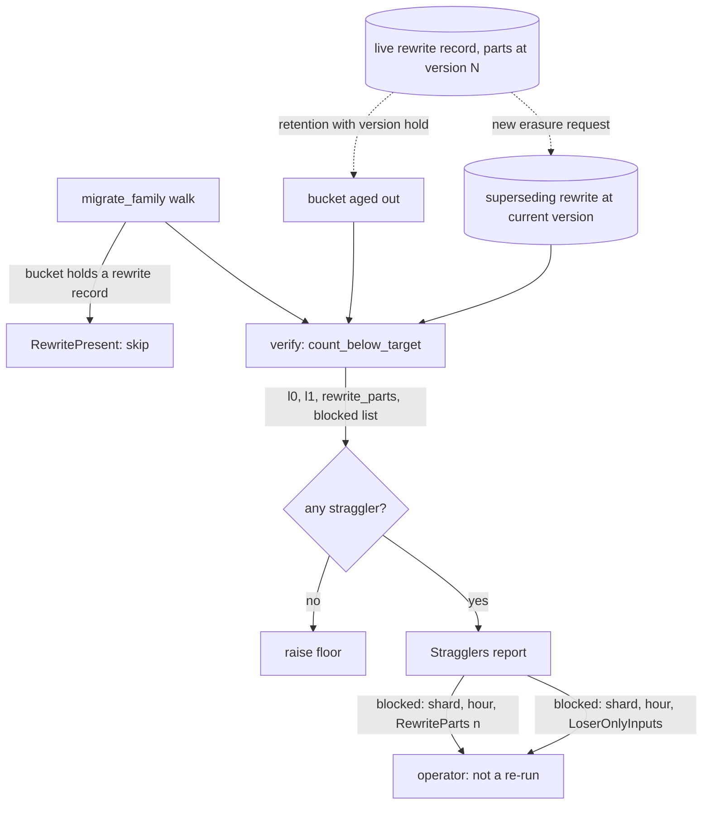

# ADR-1331: rewrite-record parts below the migration target are reported as the blocking bucket, not migrated

Status: Accepted (2026-09-16). Amends ADR-0066 decision 4 (Class A, force 2)
and decision 5. Issue #1331.

## Context

A `RewriteRecord` is the durable steady state of a bucket that selective
subject erasure (ADR-0064) has touched: it names its inputs or the record it
supersedes, carries the surviving output `parts`, and lists the `drops` it
applied (`proto/ravel/commit.proto:250-296`). Its parts are `CompactionPart`
values with their own `segment_format_version` (`commit.proto:97-117`), stamped
at `OUTPUT_FORMAT_VERSION` when the rewrite was produced
(`crates/ravel-maintain/src/erasure_rewrite.rs:1276`). A bucket erased under
version N keeps parts at N for as long as the rewrite record is live.

The migration job's re-audit counts those parts. `count_below_target`
decodes every rewrite record and adds each part below the target to
`l1_below` (`crates/ravel-maintain/src/migrate.rs:441-470`), with the stated
reason that "its surviving parts can sit below the target version and must
count toward the re-audit exactly like L1 parts, or a 'migration complete'
claim could pass over unmigrated rewritten objects". That is correct: raising
the floor over them would be a false assertion.

Nothing then migrates them. The rewrite primitive refuses a bucket that holds
a rewrite record: "One bucket serves one record set. A live rewrite record
already covers these inputs with records deliberately removed from its
outputs, and a migration record over the same inputs is not overlap-harmless
against it: a snapshot including both resurrects the erased records"
(`crates/ravel-maintain/src/rewrite.rs:374-381`, `MigrateOutcome::RewritePresent`).
The walk in `migrate_family` collects only superseded inputs from a rewrite
record and never touches its parts (`migrate.rs:580-667`). The only code that
ever re-encodes a live rewrite record's parts is a later erasure rewrite for a
new request, which supersedes the record by key
(`erasure_rewrite.rs:2032-2036`) and short-circuits when every overlapping
request is already applied (`erasure_rewrite.rs:2004-2010`).

So the verify step returns `Verification::Stragglers` on every invocation
(`migrate.rs:855-866`) and the floor for that tenant and family never rises.
The report cannot say why. `Stragglers { l0, l1 }` folds rewrite parts into
`l1` (`migrate.rs:141-153`), and `buckets_blocked` counts only the loser-only
compaction-input case (`migrate.rs:164-198`, `:786-800`). The maintenance
guide tells the operator that a permanent refusal is one where "re-running is
not the remedy" and that "`buckets_blocked` in the report counts the buckets
in that state" (`docs/guides/operations/maintenance.md:329-361`); a rewrite
holding the floor is not in that count, so the operator re-runs forever.

Issue #1331 leaves two options open: migrate the parts into a superseding
rewrite, or exclude them with a recorded reason and report the blocked bucket.
The owner chose the second. Migrating them is a superseding record set over an
erased bucket, the shape ADR-0064 decision 3 point 5 and its amendment name as
the hazard the rewrite primitive exists to avoid. It is not that the migration
would be wrong; it is that a migration output that does not re-apply the
exact `drops` resurrects erased records, and a path that does re-apply them is
an erasure rewrite by another name, with all of ADR-0064's request-binding
obligations. That path is not built here.

## Decision

1. **Rewrite-record parts below the target are counted, named, and never
   migrated by the migration job.** `count_below_target` keeps refusing the
   floor over them. Its return grows from `(l0, l1)` to a report that
   separates the three sources: `l0` (raw-served commit records), `l1`
   (compaction parts), and `rewrite_parts`, plus a list of blocked buckets.
   `Verification::Stragglers` carries the same three counts and the list.

2. **A blocked bucket is reported with its reason.** Each entry names
   `(shard, ingest_hour)` and one of two reasons: `RewriteParts { below_target }`
   (this ADR) or `LoserOnlyInputs` (the existing permanent case that
   `buckets_blocked` counts today). `FamilyMigrateReport.buckets_blocked`
   becomes the length of that list, so its documented meaning, "re-running is
   not the remedy", now covers both permanent cases. `ravel-cli maintain
   migrate` prints one line per blocked bucket with the reason; the migration
   job under server maintain-mode logs the same.

3. **How a rewrite block clears is stated, and none of the ways is the
   migration job.** A bucket leaves the list when: retention ages it out,
   subject to the ADR-0066 #530 version hold, which keeps an object this build
   cannot read; or a later erasure request against the bucket produces a
   superseding rewrite at the current `OUTPUT_FORMAT_VERSION`, which the
   erasure driver does on its own schedule. Neither is a command the operator
   runs to clear the block, and the guide says so.

4. **ADR-0066 is narrowed accordingly.** Decision 4 Class A force 2,
   rewrite-on-touch over "live L1 part with `segment_format_version` <
   current", applies to compaction parts only. Decision 5's walk migrates raw
   L0 records only, as it already does. A rewrite record's parts are outside
   both, reported through decision 2, and converge through decision 3.

## Rejected alternatives

- **Migrate rewrite parts into a superseding rewrite in the current format
  (the ticket's option 1).** A second record set over inputs a rewrite
  already covers, which is the two-record-set hazard ADR-0064 decision 3
  point 5 describes and `MigrateOutcome::RewritePresent` refuses. Doing it
  correctly means re-applying the record's `drops` to its own parts and
  naming it as the predecessor, which is an erasure rewrite with no request
  behind it: it needs ADR-0064's request binding, its key derivation from the
  applied request set, and the `.dreq` lifecycle, none of which the migration
  job has. That is its own ADR if a deployment ever needs it, and this one
  records that it is not the bounded path.

- **Exclude rewrite parts from the count so the floor can rise.** The floor
  would then assert that no live object below the version exists while the
  rewrite's parts are exactly such objects, served to every query. Deleting
  the old reader on that floor makes an erased bucket unreadable. The count
  is the part of today's behaviour that is correct.

- **Keep counting them into `l1` and improve the guide.** The operator still
  cannot tell a rewrite block from a compaction straggler that a later run
  will clear, and `buckets_blocked` still says zero. The reason has to be in
  the report, where the count is.

## Consequences

- For an operator: a `migrate` run that refuses the floor now lists each
  blocked bucket with `RewriteParts` or `LoserOnlyInputs`. `buckets_blocked`
  is nonzero in both cases and means the same thing in both: re-running does
  not help. The maintenance guide's stragglers section
  (`docs/guides/operations/maintenance.md:329-352`) gains the rewrite reason
  and the two ways it clears.
- A tenant with a long-retention erased bucket keeps its floor pinned at the
  erasure-time version until that bucket ages out. Under the pre-release
  regime (ADR-0531) that is moot, since a bump deletes the old reader anyway;
  once the N/N-1 window is in force, such a bucket delays the N-1 reader's
  deletion for that family, and the report names it.
- ADR-1746's floor evidence classification never reports `Current` above the
  rewrite parts' version for that bucket, which is consistent: the floor is
  blocked, not stale.
- No format changes. `RewriteRecord`, `CompactionPart`, the migrate cursor,
  and the provisioning record are untouched.
- Follow-up tasks:
  1. `crates/ravel-maintain/src/migrate.rs`: the three-way count, the blocked
     list with reasons, `buckets_blocked` as its length. The acceptance test
     seeds a bucket whose only record is a below-target rewrite record, runs
     `migrate_family` and the re-audit, and asserts the floor refuses with
     that bucket named and `RewriteParts` as the reason; shown failing on the
     current tree, where `Stragglers { l1: n }` names nothing.
  2. `services/ravel-cli/src/maintain.rs`: print the list; the server
     maintain-mode driver logs it.
  3. Docs: the maintenance guide section above and the ADR-0066 pointer.
