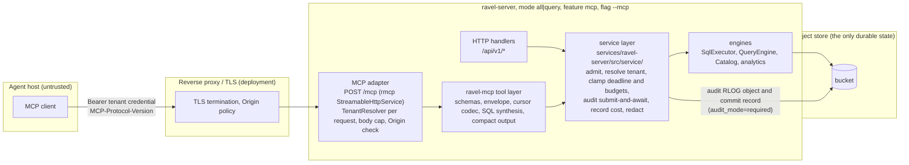

# ADR-1374: A first-party MCP server, a shared query service layer, and an agent result contract

Status: Proposed
Date: 2026-09-07
Epic: #1374
Reviewed revision: `2b8c2a51ddcd844e3362ad4513d314c01fa35b6f`

**Amendment (2026-09-08, #1468).** Three changes. D4 adds the
`missing_argument` failure class, already used in the Time paragraph. D4 and
D5 state that a cursor or evidence reference for the wrong tenant fails with
`cursor_invalid`, the same class as a forged token. D2 and D4 add the
optional `plan` envelope block: `ravel_explain_query` returns the plan shape
there, and the effective schema goes in `data.columns` with zero rows.

## Context

An AI agent that investigates an incident or a security event needs four
things from a telemetry database. It needs to find what data exists without a
guess. It needs to run bounded queries with a known cost. It needs to move
between metrics, logs, and traces on exact identifiers. It needs to hand back
a finding that a person can check again. Ravel has the query engines for this
work. It does not have an agent-facing surface, and several controls that an
agent would depend on are not in place for human callers either.

The facts below were checked by symbol at the reviewed revision. Each row
names the path and symbol, never a line number.

### What exists

| Capability | State | Evidence |
|---|---|---|
| Tenant authentication: static bearer, OIDC JWT, durable `sys/auth`, mTLS proxy header | shipped | `crates/ravel-tenant-resolve/src/lib.rs::TenantResolver::resolve` |
| SQL statement gate: one `SELECT`, no DDL, no DML, no `COPY`, no `CREATE EXTERNAL TABLE`, no `EXPLAIN`, no `SET` | shipped, structural | `crates/ravel-sql/src/validate.rs::validate`, `::reject_writes_in_query` |
| Empty table-function registry, empty object-store registry, `information_schema` off | shipped | `crates/ravel-sql/src/session.rs::build_session`, `::EmptyObjectStoreRegistry` |
| Five SQL tables, one table per statement | gated (`sql`) | `crates/ravel-sql/src/session.rs::SessionTable`, `executor.rs::SqlExecutor::target_signal` |
| Declared typed attribute columns, 60 s refresh horizon | shipped, CLI-declared | `services/ravel-server/src/declared_columns.rs::TenantConfigDeclaredColumns` |
| Metric metadata (type, unit, help), one object per tenant | shipped | `crates/ravel-query/src/http/metadata_cache.rs::MetadataCache::get` |
| Metric name postings under `__name__` equality | shipped | `crates/ravel-catalog/src/catalog.rs::resolve_fanout` |
| Exemplars, window applied to rows | shipped | `services/ravel-server/src/exemplars.rs::run` |
| Trace by id through the `spans` table, skip index per block | shipped | `crates/ravel-sql/src/spans_pushdown.rs::extract_spans`, `crates/ravel-rspan/src/skip_index.rs::SkipIndex::candidate_blocks` |
| Analytics `change_point` and `summary` over PromQL range results | shipped | `services/ravel-server/src/analytics.rs::run`, `crates/ravel-analytics/src/lib.rs` |
| Per-query budgets: segments, store requests, series, samples, deadline, SQL memory. Each one is a typed error, never a truncation | shipped | `crates/ravel-query/src/segment_admission.rs::admit`, `::request_budget_exceeded` |
| Cost estimate as an upper envelope, reported after the query | shipped | `crates/ravel-sql/src/cost.rs`, `ravel_types::accounting::CostEstimate` |
| Fleet-global query concurrency ceiling | shipped | `crates/ravel-query/src/query_admission.rs::QueryAdmissionController::try_admit` |
| Cancellation by future drop, no spawn between transport and engine | shipped | `services/ravel-server/src/sql.rs::CostGuard` |
| Read-your-write lower bound (`min_commit_token`) | shipped, except exemplars | `crates/ravel-query/src/http/params.rs::decode_commit_tokens` |
| Snapshot pinned across two requests | Flight ticket only, MAC, deadline-bound, process-local key | `crates/ravel-sql/src/flight_ticket.rs::FlightTicket`, `::TicketKey` |
| Partial-coverage flag with a consent gate | PromQL and analytics only | `crates/ravel-query/src/http/handlers.rs::gate_partial` |
| Per-phase cost split | PromQL only. SQL reports pooled counters | `crates/ravel-query/src/http/json.rs::phase_costs` |

### What is missing

| Gap | Evidence |
|---|---|
| Authorization below the tenant. `resolve` returns a bare `TenantId`. `AuthError` cannot say "authenticated, not permitted" | `crates/ravel-tenant-resolve/src/lib.rs::TenantResolver` |
| Operator identity. Any tenant token can trigger a fold | `services/ravel-server/src/fold_on_demand.rs::run` |
| SQL `start`/`end` as a row filter. The window reaches only `Catalog::resolve`. No provider constructor receives it. An absent window means the last hour | `crates/ravel-sql/src/executor.rs::SqlRequest::window`, `services/ravel-server/src/sql.rs::build_request` |
| A cost estimate before the query runs. `EXPLAIN` is refused. The plan text exists only in the bench | `crates/ravel-sql/src/executor.rs::PinnedQuery::create_physical_plan` |
| A budget that a caller can lower, other than the deadline | `services/ravel-server/src/sql.rs::SqlBody` |
| Per-tenant query budgets. The `--limits-file` entries are parsed and inert | `services/ravel-server/src/config.rs::LimitsConfig` |
| Effective schema over HTTP. Only a Flight statement returns the declared columns | `crates/ravel-sql/src/flight/service.rs::get_flight_info_statement` |
| Enumeration of log attribute keys or values | no map-key function in `crates/ravel-sql/src/session.rs::ADMITTED_SCALARS` |
| Query audit records. Every sink is `NoopQueryAuditSink`. `AuditPipeline::spawn` has no non-test caller. No `--audit-mode` flag (#1187) | `services/ravel-server/src/query.rs::build_sql_state`, `crates/ravel-maintain/src/audit_pipeline.rs` |
| Row ordering, row identity, pagination, row cap. The scan declares no order. `logs` has no unique key. HTTP buffers the whole result | `crates/ravel-sql/src/output.rs::QueryOutput`, `crates/ravel-sql/src/logs_schema.rs::logs_fields` |
| Missing-parent disclosure on traces | `docs/guides/traces.md`, "Incomplete traces" |
| Pruning on `logs.trace_id`. It is a fixed column with a residual filter only | `crates/ravel-sql/src/logs_pushdown.rs::FIXED_LOG_COLUMNS` |
| A service layer. Handlers call the engines. Analytics, exemplars, and the fold route take no admission permit. Two PromQL routes have no audit seam. Exemplars record no cost | `services/ravel-server/src/lib.rs::start`, no `.layer` on either `axum::serve` |
| Any MCP server. The only MCP in the tree is the `graft` development tool configuration | `gh issue list --search MCP` returns nothing related |

### The protocol and the SDK

The current MCP specification is `2026-07-28`. It has no `initialize`
handshake, no protocol session, no GET stream, and no SSE resumption. Each
request carries its protocol version in `_meta` and in the
`MCP-Protocol-Version` header. A server must validate the `Origin` header.
On Streamable HTTP, a closed stream is a cancellation. Stateful tools mint an
explicit handle and bind that handle to the authenticated user. The legacy
revision `2025-11-25` still uses `initialize` and `Mcp-Session-Id`, and most
deployed clients speak that revision. Authorization is optional in the
specification. When a server uses OAuth 2.1, it must publish protected
resource metadata (RFC 9728) and must bind tokens to its own audience.

The Rust SDK `rmcp` 3.2.0 serves both revisions. It mounts on axum 0.8 as a
tower service. It delivers cancellation through `on_cancelled`. Its `auth`
feature is an OAuth client, not a token validator. Its versions of tokio,
serde, and schemars match the workspace.

Reference servers give three lessons. The Grafana server lists 110 tools at
about 44,000 tokens and tracks that as a defect. The ClickHouse server
enforces read-only at the engine (`readonly=1`) and marks its regex gate as
advisory. The Elastic Agent Builder binds the tenant scope at authoring time,
never through an agent argument.

## Decision

### D1. One service layer, one tool layer, one native adapter

Ravel gets a transport-independent tool layer in a new crate, `ravel-mcp`. It
gets a shared application-service layer in `services/ravel-server/src/service/`.
The MCP adapter mounts `rmcp::StreamableHttpService` on the query router at
`POST /mcp`, behind the cargo feature `mcp` and the flag `--mcp`. Both are off
by default. The HTTP handlers keep their parsing and encoding. They call the
service layer for admission, tenant resolution, deadline and budget clamps,
audit submit-and-await, cost recording, partial-coverage consent, and error
redaction. The MCP tools call the same service layer.

The service layer comes first because the handlers already differ. A new
transport that calls the engines directly makes one more copy of the policy.

The adapter is native, not a standalone binary. Every missing capability that
an agent needs lives below the HTTP surface. These capabilities are the
explain path, the effective schema, the row cap, cost on cancel, budget
lowering, and audit. A standalone server needs those server changes too. It also adds a second credential hop.
In-process, the MCP endpoint is the resource server and the tenant credential
is the token.



Trust boundaries. The agent host is untrusted. Every argument, cursor, and
evidence reference is data until the server checks it against the credential.
The tenant credential is the only authority. A cursor is a name, not a
capability. The server compares the tenant hash inside a cursor with the
resolved tenant on every call. The tool layer never touches the store. Only
the engines touch the store, through the budgets of the service layer.
Telemetry content is untrusted text. The server returns it inside typed
fields and never interprets it.

### D2. Nine tools, three resources, two prompts

The default profile is read-only. Tool names carry the `ravel_` prefix. Each
tool declares an input schema and an output schema. The `structuredContent`
of each result is the envelope of D4. The text block is a compact rendering
of the same data, not a second copy of the rows. Every tool carries the
annotations `readOnlyHint: true`, `destructiveHint: false`, and
`openWorldHint: false`. Annotations are hints and carry no authority.

| Tool | Purpose | Prerequisite |
|---|---|---|
| `ravel_capabilities` | Protocol and server version, enabled tools, effective budget ceilings, dialect summaries, tenant hash, enabled signals. Zero store reads | none |
| `ravel_describe_data` | Per signal: effective schema (fixed and declared columns), indexed keys, metric families with type and unit (one bounded page), freshness watermark, coverage window, exact catalog row counts where they exist | D3 explain path, `MetadataCache`, one resolve per signal |
| `ravel_find_labels` | Metric names for a selector, label names, or label values for one label under a selector. The result says if the list is declared, observed, or exact. An unfiltered tenant-wide list is refused, and the refusal names the bounded form | label machinery through the service layer |
| `ravel_explain_query` | Validate SQL or PromQL, resolve the snapshot, return the target table, the effective schema in `data.columns` with zero rows, the admitted segment count, the estimate against the effective budget, and the plan shape in `plan`. No scan | D3 `SqlExecutor::explain` |
| `ravel_query_sql` | One `SELECT` over one table, with a required `time_range` applied as a row filter, `max_rows`, budgets that can only be lowered, and a keyset cursor | D3 |
| `ravel_query_promql` | Instant or range evaluation, partial-coverage consent, step alignment, the two log pseudo-metrics | `QueryEngine` through the service layer |
| `ravel_search_logs` | Typed log search compiled to SQL. Uses indexed and declared predicates, `has_word`, severity, and trace id. Orders by `ts`. Groups rows by attribute set and hoists shared attributes once | D3 |
| `ravel_get_trace` | Spans of one trace id inside a required window, the span tree, the missing parents, and the orphans. An optional logs leg, reported as an unindexed scan with its own cost | `spans_pushdown` fast path |
| `ravel_analyze_timeseries` | `change_point` or `summary` over a PromQL range result. The output says "heuristic", the minimum point count, and if it was downsampled | `analytics.rs::run` through the service layer, which adds admission |

Phase 2 tools: `ravel_compare_windows` and `ravel_correlate_signals`
(exemplar to trace to logs, exact ids only).

Rejected tool candidates: `ravel_find_metrics` and `ravel_find_label_values`
(merged into `ravel_find_labels`), `ravel_read_result` (a cursor lives on the
tool that made it), and the three operator tools (they need an operator
principal, and they show process-wide state).

Resources: `ravel://dialect/sql`, `ravel://dialect/promql`, and the template
`ravel://schema/{signal}`. Prompts: `incident_triage` and `entity_timeline`.
Each prompt names its version and its tools. No resource or prompt carries
data that a tool cannot return.

The `tools/list` result for the nine tools must serialize in less than
24 KiB. A test pins the exact byte band. Tools are listed in a fixed order.

### D3. Engine and server prerequisites

1. `RequestBudgets` in `ravel-query`: `max_bytes_scanned`,
   `max_store_requests`, and `max_segments`, each optional. The name
   `max_store_requests` is the one canonical name on the wire, in the tool
   schemas, and in the envelope. It maps to the existing
   `EngineConfig::max_s3_requests` ceiling, which keeps its name. A schema
   test asserts the serialized field name. `clamp` can only lower a ceiling.
   The admission and scan checks read the clamped value. PromQL entry points
   take `Option<RequestBudgets>`. `None` keeps the current behavior.
2. `SqlRequest::row_window`, default `false`. When `true`, each table
   provider applies `ts_col >= start AND ts_col < end` above the scan. The
   column is `ts` for `samples` and `logs`, `start_ts` for `spans`, and
   `ts_ns` for `alerts` and `audit`. The outcome reports the applied
   predicate. The HTTP body keeps `false` until a client opts in.
3. `SqlExecutor::explain`: validate, resolve, admit, compute the effective
   schema, run the estimator with `unknown` components, and render the plan
   text. No data GET. A test asserts the data GET count.
4. `SqlRequest::max_rows`. The stream stops after `max_rows + 1` rows. The
   outcome reports `row_cap_hit`.
5. A query service layer in `services/ravel-server/src/service/`. Analytics
   and exemplars gain an admission permit. PromQL gains cost on cancel.
   `labels` and `label_values` gain the audit seam. The service layer
   finalizes usage before it maps an outcome to an error. The outcomes that
   map to an error are an audit failure, a partial-result refusal, an
   evaluation failure, and a deadline. A cancellation is transport-level:
   the tool future is dropped, no envelope is produced, and the usage
   record is its only result. A drop guard in the pattern of
   `sql.rs::CostGuard` records the spend on every path, including the
   dropped one. As a result, the D6 usage figures and the D7
   cancelled-spend figure are never omitted. One test per path asserts the
   recorded figures.
6. `AuditPipeline::spawn` in `lib.rs::start` for query modes. Flags
   `--audit-mode required|best-effort` (default `required`) and
   `--audit-text`. This closes #1187. MCP tool calls submit
   `query.language = mcp:<tool>`.

### D4. The result envelope

Every tool returns one envelope:

```json
{
  "status": "ok | ok_bounded | ok_page | error",
  "failure": null,
  "data": {"columns": [], "rows": [], "row_count": 0},
  "plan": null,
  "scope": {"signal": "", "table": "", "time_range": {}, "predicates_applied": [], "order_by": []},
  "ids": {"query_id": "", "audit_ref": ""},
  "visibility": {"snapshot_id": "", "watermark_hour": "", "pinned": false, "min_commit_tokens_applied": []},
  "coverage": {"complete": true, "partial": false, "fragments": [], "unindexed_predicates": []},
  "accuracy": {"exact": true, "approximation": null, "lower_bound_count": false},
  "presentation": {"max_rows": 200, "row_cap_hit": false, "bytes_cap_hit": false, "rows_omitted": 0, "cells_truncated": 0, "metadata_elided": 0, "effective_max_response_bytes": 524288, "floor_applied": false, "cursor": null},
  "budget": {"effective": {}, "actual": {}, "estimate": {}, "estimate_is_upper_envelope": true},
  "evidence": [{"ref": "", "covers": "data.rows", "sha256": ""}],
  "warnings": [],
  "next_steps": [{"action": "", "detail": ""}]
}
```

`plan` carries the plan text that `ravel_explain_query` returns and stays
`null` on every other tool.

The four status values are different facts. `ok` is a complete query. A
query with zero matches is `ok`. A query whose `LIMIT` the data did not fill
is `ok`. `ok_bounded` means that the row cap stopped the result, more rows
exist, and no cursor exists because the statement has no total order.
`ok_page` means that a cap stopped the result and a cursor exists. The cap
is the row cap, the byte cap, or both, and `presentation` says which.

`max_response_bytes` bounds the serialized `structuredContent`, that is, the
whole envelope as JSON. When the envelope exceeds the cap, the server drops
rows from the end of `data.rows` until the envelope fits. `data.row_count`
keeps the count of rows that the query produced. `presentation.bytes_cap_hit`
becomes `true` and `presentation.rows_omitted` carries the number of dropped
rows. The text block is rendered from the truncated `data`, so the two
representations never differ. When the statement has a total order, the
cursor points at the last kept row and the status is `ok_page`. The omitted
rows are then reachable on the next page. When it has no total order, the
status is `ok_bounded`.

A page always keeps its first row when the query produced one. When the
first row alone does not fit under the cap, the server keeps the row and
shortens its cells. The cell budget is `max(256 B, (cap - fixed_part) /
column_count)`, where `fixed_part` is the serialized size of the envelope
without `data.rows`. The rule applies to every cell type. A number, a
timestamp, a boolean, or a hex binary id never exceeds 64 B and is never
shortened. A string cell longer than the budget is cut to the budget,
including the trailing marker. A map cell or another structured cell that
exceeds the budget is serialized to its JSON text first. That text is cut
the same way and returned as a string. `presentation.cells_truncated` carries the count
of shortened cells. The evidence hash covers the full canonical row, not
the shortened one. So `data.rows` is never empty while `rows_omitted` is
positive, a retained row always fits, and a cursor always has a last kept
row. Two tests cover this rule: a row with a 1 MiB body and a row with a
1 MiB map, each under the floor cap. Each asserts one row, one truncated
cell, zero omitted rows, and the exact serialized size under the cap.

The fixed part of the envelope is bounded so that it always fits. The server
floors `max_response_bytes` at 256 KiB, and the default is 512 KiB. A caller
value below the floor is raised to the floor.
`presentation.effective_max_response_bytes` carries the cap in force and
`presentation.floor_applied` says if the floor raised it. This floor is a
minimum on the presentation cap and is not a raise of any query budget.
Every variable-length field outside `data.rows` has a count bound and a
per-entry serialized-size bound:

- `data.columns`: at most 256 entries of 160 B each (name, type, and JSON
  overhead), 40 KiB in total
- `scope.predicates_applied` and `scope.order_by`: at most 16 entries of
  512 B each, 16 KiB in total
- `visibility.min_commit_tokens_applied`: at most 64 entries of 128 B each,
  8 KiB in total
- `coverage.fragments`: at most 64 entries of 160 B each, 10 KiB in total
- `coverage.unindexed_predicates`: at most 16 entries of 256 B each, 4 KiB
  in total
- `warnings`: at most 16 entries, `next_steps`: at most 8 entries,
  `evidence`: at most 16 entries, each entry at most 512 B, 20 KiB in total
- the scalar fields together: at most 4 KiB

The sum of these bounds is 102 KiB. That is less than half of the 256 KiB
floor, so a retained row always has at least 154 KiB. A projection wider
than 256 columns is an `invalid_argument` failure whose `next_steps` says to
name the columns. When a list exceeds its bound, the server keeps the first
entries and sets `presentation.metadata_elided` to the number of dropped
entries. A test serializes an envelope with zero rows and every field at its
bound. The test asserts the exact size, which must be less than 106,496
bytes.
The byte cap, the row cap, and analytic
downsampling are three separate facts in the envelope. A downsampled
analytic sets `exact: false` and names the method.
Missing coverage sets `complete: false` and names the reason. A budget
failure or a deadline is an `error`. The server never returns a partial exact
aggregate as `ok`. A `COUNT` over `logs` or `spans` sets
`lower_bound_count: true`, because ingest is at-least-once.

Time. Every data tool requires a time input. There is no default window.
Inputs are RFC 3339 strings or integer nanoseconds as strings. Range tools
take `time_range`, a half-open interval. `ravel_query_promql` has two modes.
Range mode takes `time_range` and `step`. Instant mode takes
`evaluation_time`, one instant, and no `time_range`. A request with both
fields, or with neither, is an `invalid_argument` failure. A test covers
both modes. An absent time input on any other data tool is a
`missing_argument` failure. Outputs carry timestamps as nanosecond strings.
The `scope` block reports the 5 m metric lookback and the step alignment.

Precision. Integers and timestamps are JSON strings, because nanosecond epochs
exceed 2^53. Floats keep `NaN`, `+Inf`, and `-Inf` as strings. Finite floats
are numbers with the sign of zero preserved (the rule of
`output.rs::float_to_json`). Binary is hex. Maps are objects.

Failure classes: `unauthorized`, `invalid_argument`, `missing_argument` (a
required argument is absent), `validation` (the engine text, safe to echo),
`unsupported`, `budget_estimate_exceeds_ceiling`, `budget_exceeded` (with the
counter that tripped), `deadline`, `unavailable` (retryable),
`snapshot_invalidated` (retryable once), `cursor_expired`, `cursor_invalid`,
and `internal` (fixed message). A failure is a tool result with
`isError: true`, so the model can correct itself. Protocol errors are for
malformed JSON-RPC and unknown tools only. Every failure carries
`next_steps`.

A cursor or evidence reference presented for the wrong tenant fails with
`cursor_invalid`. The class matches a forged token, so the failure leaks no
tenant-mismatch signal.

### D5. Consistency, cursors, and evidence references

Each call resolves its own snapshot. Two calls share a snapshot only when the
second call carries a cursor from the first. The cursor pin is valid until
`min(remaining query deadline, protection_horizon - grace)`. This is the
Flight ticket rule. The envelope reports `snapshot_id` (a hash of the pinned
segment set), the watermark hour, the applied commit tokens, and `pinned`. A
commit token is a read-your-write lower bound. It is not a snapshot identity.

A cursor is a token with a keyed MAC, minted with a process-local key in the
`TicketKey` pattern. It carries the tenant hash, the tool, the argument hash,
the keyset position, and the deadline. It also carries the pinned segment
set, with the pending erasure predicates and the declared columns. The server
stores nothing. A page
re-executes the statement against the pin with a keyset predicate. A cursor
from a dead process fails with `cursor_expired`. Only the process that minted
a cursor can redeem it. The documentation says this, and it names sticky
routing as the option for a load balancer. The server also compares the
tenant hash inside the token with the resolved tenant on every redemption. A
cursor or evidence reference from another tenant fails with
`cursor_invalid`, the same class a forged token gets, so the failure leaks no
tenant-mismatch signal.

`ravel_query_sql` mints a cursor only when the `ORDER BY`, plus a
deterministic tiebreak that the tool appends, is a total order over the
projection. `ravel_search_logs` orders by
`(ts, observed_ts, trace_id, span_id, body_hash)`. That tuple is not unique,
because `logs` has no row identity and ingest is at-least-once. A strict
keyset predicate would skip an equal row on the next page. So a page never
ends inside a group of equal tuples. The tool fetches `k + 1` rows. When
the last kept tuple equals the first omitted tuple, the tool drops that
whole equal group from the page. The cursor then points at the last
complete group.
If no complete group fits in the page, the status is `ok_bounded` with no
cursor and a `next_steps` entry that says to narrow `time_range`. The same
rule applies to `ravel_query_sql` when its appended tiebreak is not unique.
`ravel_get_trace` orders by `(start_ts, span_id)`. A test paginates a
fixture with equal tuples across a page boundary and asserts that every row
appears exactly once.

An evidence reference is a token of the same family. It adds the sha256 of
the canonical row bytes. Redemption re-executes against the pin while the pin
is valid and compares hashes. After the deadline, redemption re-executes
fresh, reports `pinned: false`, and reports if the hash matched. A matching
hash proves identical bytes and nothing more. No reference carries an object
key, a tenant name, or a credential.

### D6. Budgets

The effective budget is the minimum of the server ceiling, the enforced
tenant ceiling, and the caller value. A caller can lower `deadline`,
`max_rows`, `max_bytes_scanned`, `max_store_requests`, and
`max_response_bytes`. A caller cannot raise a ceiling.
`ravel_explain_query` returns the estimate beside the effective budget. When
the estimate exceeds the budget, the tool returns
`budget_estimate_exceeds_ceiling` and the factor to narrow by. An `unknown`
estimate component is not zero and does not pass. Retries and snapshot
re-resolution run inside the same deadline and their cost is added.
Enforcement is process-local. The fleet concurrency ceiling is the only
cross-replica control, and the envelope says so. Usage is reported as
requests and bytes by kind: wire, cache-served, decompressed. Usage is never
reported as money.

Defaults: `max_rows` 200 with a ceiling of 5,000. `max_response_bytes`
512 KiB with a floor of 256 KiB (D4). 100 metric families per describe
page. 2,000 segments for label resolution. The evaluation can change these
values.

An investigation-wide budget across calls is Phase 2. A caller-supplied
bundle id is not trustworthy.

### D7. Security

- The `TenantResolver` chain of the deployment authenticates every MCP
  request on the headers of that request. No session, cursor, or reference
  replaces this step. No tool argument names a tenant.
- Authorization is at the tenant level, because that is what exists. The
  default profile has read tools only. The fold route, ingest, erasure,
  legal holds, retention, alert rules, and maintenance are not reachable
  through MCP. An operator profile needs a principal model and its own ADR.
- Transport: `POST /mcp` only. The server validates `Origin` against
  `--mcp-allowed-origins` and answers 403 on a mismatch. The body cap is
  1 MiB. Each tool call takes one admission permit. The deadline is clamped.
  Header validation is per revision. For a `2026-07-28` request, the server
  requires `MCP-Protocol-Version`, `Mcp-Method`, and `Mcp-Name`, and answers
  400 on a mismatch with the body. For a `2025-11-25` request, the server
  requires neither `Mcp-Method` nor `Mcp-Name`, accepts `initialize`, and
  handles `Mcp-Session-Id` with the in-memory session manager of `rmcp`.
  Each legacy request re-authenticates. An `initialize` without a
  credential is refused. One test sends a `2025-11-25` `initialize` and one
  test sends a `2026-07-28` `tools/call`, and each asserts its own header
  rule.
- Phase 1 uses the bearer chain. Phase 2 serves the RFC 9728 document when
  an OIDC resolver is configured, after a check that `OidcResolver` validates
  the audience claim.
- SQL text passes through `validate.rs` unchanged. The MCP layer adds no
  second gate. A test tries each escape route through the tool.
- Telemetry text is returned inside typed fields only. The server never puts
  it into a tool description, a prompt, or `next_steps`. The documentation
  says that no server-side sanitization makes a model immune to injection.
- No tool fetches a URL, runs a shell, reads a file, or connects to a
  caller-supplied address.
- The only writes are audit records and cost metrics. With
  `audit_mode=required`, a failed audit write fails the call.
- The adapter must not `tokio::spawn` between the transport and the engine.
  A dropped tool future is the cancellation. `CostGuard` records the spend
  of a cancelled call. Progress notifications go out at phase boundaries
  when the client supplied a `progressToken`.

### D8. Validation

Protocol tests use an `rmcp` client against the real router for both
revisions. Every output schema validates every fixture result. A build
without the `mcp` feature serves no `/mcp`. Before the epic closes, the MCP
Inspector and one production client are run by hand, and the versions go
into the ledger.

Adversarial tests cover these cases:

- parity with `/api/v1/sql`, the row window, and schema drift between two
  pages
- tenant isolation with two hashes on every path, and cursor replay across
  tenants
- expired and revoked credentials during pagination, and malformed arguments
- budget enforcement, where `unknown` is not equal to zero
- cancellation, and audit write faults with the `FaultStore` counter asserted
- redaction, and precision at 2^53, `-0.0`, and NaN payloads
- pagination under fold and compaction, late data, missing spans, and partial
  federation
- hostile telemetry content

Each regression test is shown to fail first. The executor report names the
flipped line.

The agent evaluation is a set of hypotheses, not results. A corpus of at
least 24 investigations over a known fixture includes cases whose correct
answer is "no data in scope" and "not visible yet". Two profiles run on the
same engine, budgets, model, and tasks: a baseline with the two raw query
tools and `ravel_capabilities`, and the full profile. The runner records
correctness, evidence completeness, completion, tool calls, and invalid
queries. It also records wall time, store requests and bytes, and response
bytes. Each record names the model and version, 5 runs, and cold and warm
conditions. Targets: half the invalid
queries and one third fewer store requests per completed task, with equal or
better correctness. No result goes into this ADR before it is measured.

No new TLA+ model. Cursors and evidence references are process-local tokens
with no durable state and no cross-process protocol. The suite models
durable protocols. A pinned snapshot can outlive its deadline while GC
advances. That case is the in-flight reader case that `LifecycleGC` already
covers. The cursor deadline uses the same protection-horizon rule as Flight
tickets.
A `ravel-sim` scenario paginates through fold, compaction, and sweep and
asserts snapshot identity per page.

### D9. Packaging and rollout

The cargo feature `mcp` implies `sql`. The cursor codec of D5 reuses the
Flight pin codec (`flight_ticket.rs`, `TicketKey`), which `ravel-sql` gates
behind `flight-sql` today. `ravel-sql` gains a smaller feature, `pin-codec`,
that carries only that module and no `arrow-flight` dependency. Both
`flight-sql` and `mcp` enable `pin-codec`. A CI build check compiles
`ravel-server` with `sql,mcp` and without `flight-sql`, so an `mcp` build
never depends on Flight. The published image builds
`sql,flight-sql,otap,mcp`. The operator needs no new Service port. The flag
`--mcp` is off by default. `--mcp-allowed-origins` is required when `--mcp`
is set on a non-loopback listener, or startup fails. The server serves
protocol revisions `2026-07-28` and `2025-11-25`. The new external
dependency is `rmcp` 3.2 with `rmcp-macros`. No persistent format changes.
The HTTP `/api/v1/sql` behavior is unchanged unless a client sends the new
optional body fields.

Documentation: `docs/guides/agents.md`, `docs/reference/mcp.md` rendered from
the catalog by a drift test, a README section, the `/mcp` row in
`docs/reference/http-api.md`, and one transport line in
`docs/architecture.md`.

## Rejected alternatives

| Alternative | Reason it lost |
|---|---|
| Native MCP without a service layer | The handlers already differ on admission, audit, and cost recording. A third copy of the policy repeats the defect that the inventory found. |
| A standalone Rust MCP server over `/api/v1/*` | It needs every engine and server prerequisite of D3. It adds a credential hop that the MCP authorization rules treat as token passthrough, unless the server keeps its own user-to-tenant map, which is new durable state. It stays a Phase 2 option for a Ravel that cannot be rebuilt. |
| Flight SQL as the execution path | Flight is gRPC only. The operator's query Service exposes HTTP only. Issue #1293 leaves its resolver chain without the loopback guard. Flight stays the source of the pin codec. |
| One `ravel_query` tool with a `language` field | Reference servers that merged query languages report worse tool selection. SQL and PromQL have different time contracts. |
| One tool per endpoint | The Grafana server tracks 110 tools at about 44,000 tokens as a defect. |
| The MCP Tasks extension | Every Phase 1 call ends inside the query deadline or fails typed. The extension is optional and most clients do not support it. |
| Durable result handles in the bucket | A new object family, a sweeper, an erasure inventory entry, and a GC interaction for every call. Inline results and MAC'd re-execution cursors cover Phase 1. |
| A text-level SQL allowlist in the MCP layer | `validate.rs` is a structural gate. A second regex gate is the advisory check that ClickHouse marks as "not a security boundary". |
| stdio as a Phase 1 transport | An in-process stdio server runs with object-store credentials, which is the cross-tenant trust model of the CLI. A stdio bridge to the HTTP endpoint is a client and is Phase 2. |
| A separate listener for MCP | A listener is a trust boundary only when it terminates TLS. The mTLS listener does not. A listener becomes useful with a separate credential class. |

## Consequences

- HTTP callers get the row-window fix, the explain path, lowerable budgets,
  and audit records, because the service layer serves both transports.
- `ravel-server` gains one crate dependency (`rmcp`) behind a feature, and
  one new workspace crate (`ravel-mcp`).
- Analytics, exemplars, and the two label routes change behavior: they take
  an admission permit and submit an audit event. This is a fix of a gap, not
  a regression, and the ADR names it here.
- The decomposition has nine waves. High-risk tasks (T1, T2a, T4) ride
  alone. The task table and the wave plan are in the epic issue.
- Open decisions, each with a default:
  - the endpoint is on the public listener
  - Phase 1 uses bearer credentials only
  - legacy session mode is on by default
  - the numeric defaults of D6 apply
  - `time_range` is required and has no default
  - resources and prompts stay minimal
  - audit records carry `query.language = mcp:<tool>`
- Recorded uncertainties:
  - if `OidcResolver` checks the `aud` claim
  - the `rmcp` attribute syntax for output schemas
  - the exact `tools/list` byte figure. The first serialization sets it and
    a test then pins it
- Pre-existing defects to work around: #1293, #1296, #362, #1187, #1306,
  #1304.
- Documentation drift found during the review is reported in the epic
  issue and is not fixed here. The three items that mislead an agent are:
  - the SQL `start`/`end` marked required in `docs/reference/http-api.md`
  - the `audit` table described as "including the query-audit trail"
  - the global "one snapshot per query" statement in
    `docs/consistency-model.md`

**Amendment (2026-09-09, #1379).** Three changes, each matching what
shipped. D4's `presentation` block carries three elision counters, not one:
`metadata_elided` for dropped list entries, `entries_truncated` for entries
kept but cut, and `scalars_truncated` for scalar fields cut or dropped under
their 4 KiB allowance. D4 and D5 name the evidence digest field
`blake3_256`, because the digest is BLAKE3-256 and a field called `sha256`
cannot be verified by a reader who trusts the name. D5 states that an
evidence reference presented after its pin has passed redeems as unpinned,
re-executing fresh, rather than failing as expired.

**Amendment (2026-09-09, #1501).** D4 bounds the scalar fields, including
`presentation.cursor`, to 4 KiB together. D5 requires the cursor to carry
the pinned segment set, and one `SegmentPin` costs about 250 B plus
base64: the 2,000-segment admission figure in D6 yields a token of several
hundred KiB, over the whole 256 KiB response floor. This amendment
replaces the segment-enumeration cursor with a resolve-input cursor and
gives it its own bound.

1. A cursor pins its snapshot by resolve inputs, not by segment
   enumeration: the tenant hash, the signal, the half-open time range, the
   minimum commit-token watermark the page was resolved against, the
   pending erasure predicates in force, the declared column set, and the
   keyset position (the last tuple of the page and the `ORDER BY` it was
   taken under). Redemption re-resolves the snapshot against that
   watermark deterministically. When the re-resolve cannot reproduce the
   pinned watermark (a compaction past the protection horizon, a newer
   erasure), redemption fails with `cursor_expired` and the caller re-runs
   the query. A tampered or wrong-tenant token stays `cursor_invalid`. The
   dead-process rule, the tenant binding, the tool and argument-hash
   binding, and the deadline clamp are unchanged.
2. The cursor leaves the 4 KiB scalar allowance of D4 and gets its own
   4 KiB bound, accounted for in the fixed part of the envelope. The
   maximal fixed part is now the D4 list bounds plus the 4 KiB scalar
   allowance (102 KiB, unchanged) plus the new 4 KiB cursor bound, 106 KiB,
   which stays under the 256 KiB floor. A cursor over its bound is a
   server defect, not a client-visible degradation: the envelope reports
   it as an `internal` failure rather than silently paging without a
   cursor.
3. Evidence references are unchanged: each pins one row's segment with a
   `SegmentPin`, and the pin-codec reuse of D9 stays for them.
4. The shipped cursor codec (segment enumeration) is replaced by the
   resolve-input form before the first paging tool ships (#1380); until
   then no tool mints a cursor.

**Amendment (2026-09-10, #1501, #1529).** Corrects the amendment above. Its
item 1 said redemption "re-resolves the snapshot against that watermark
deterministically" and fails `cursor_expired` when it "cannot reproduce the
pinned watermark", without saying what reproducible means. There is no
reading of it that a redemption can test. ADR-0010 gives no ordering over
commit tokens to test one with: `seq` is monotonic only per (writer_id,
epoch, shard) and gaps in it carry no meaning, and `epoch` is informational
only, so two tokens from different writers have no relative position at
all. The pinned watermark is a resolve input and only that: it is what page
2 resolves against, in place of a fresh resolution, which is what makes the
re-resolve deterministic. Whether a pinned token can still be satisfied is
the catalog's answer at resolve time, given by resolving the token's own
identity, and its failure is `UnsatisfiableToken`, not a cursor outcome.

A redemption refuses a structurally valid, correctly bound cursor as
`cursor_expired` in exactly two cases, which are the two the amendment above
meant by a compaction and a newer erasure:

1. Its effective deadline, already clamped to `protection_horizon - grace`
   by the rule D5 states, has passed. Past that instant a sweep is free to
   compact away what the pin resolves to, so the clamp already is the
   compaction check and no second mechanism is added for it.
2. An erasure predicate is in force at redemption that the cursor did not
   pin, over the cursor's own signal, whose half-open event-time window
   overlaps the cursor's half-open time range. A windowless predicate has no
   event-time restriction and so overlaps every range. Intersection is
   defined on the signal and the range only: a predicate's matchers are
   tested against a record's labels or attributes, and a cursor holds no
   records, so no matcher-level analysis is attempted. An erasure that does
   not intersect that scope leaves the cursor redeemable, and a predicate
   the cursor pinned that is no longer in force is not a mismatch.

A tampered or wrong-tenant token stays `cursor_invalid`, unchanged. So do
the dead-process rule, the tenant binding, and the tool and argument-hash
binding.

Two corrections to the same amendment's own text. Its item 3 said "Evidence
references are unchanged: each pins one row's segment with a `SegmentPin`".
That was never true. `EvidenceRef` carries the tenant hash, the tool, the
argument hash, a `blake3_256` digest of the referenced row, and its mint and
deadline timestamps; it has never held a `SegmentPin`, and it needs none,
because redemption re-executes the reference's own call and compares
digests. Its item 2 gave the maximal fixed part as 106 KiB, which counts
only the bounds D4 documents: the metadata list bounds (100,824 B) plus the
4 KiB scalar allowance come to 102 KiB, and the new 4 KiB cursor bound takes
that to 106 KiB. The implementation reserves 110,600 B, because on top of
those documented bounds it also counts the empty-envelope skeleton (852 B),
a bounded skeleton slack for counters and status words widening (512 B), and
the identity-warning allowance `finish` may still spend (220 B).
`MAXIMAL_FIXED_PART` in `crates/ravel-mcp/src/envelope.rs` is the constant
carrying that real total, and it is the figure the floor guard compares
against the 256 KiB `max_response_bytes` floor.

**Amendment (2026-09-11).** Three corrections.

1. The 2026-09-09 amendment reports an over-bound cursor as an `internal`
   failure. That holds only when the envelope carries no other failure. An
   envelope that already failed keeps its class, message, and counter, which
   say why the call failed. The cursor is dropped on both paths. On the
   second, the drop increments `presentation.metadata_elided` and pushes a
   warning naming the bound. So a dropped cursor is never silent.
2. D9 says the cursor codec reuses the Flight pin codec, and that
   `flight-sql` and `mcp` both enable `pin-codec`. Neither is true. The
   cursor codec follows the Flight ticket pattern but shares no code with
   it. `ravel-mcp` enables no `ravel-sql` feature and reads nothing from
   `flight_ticket`. An `mcp` build needs no pin codec. The 2026-09-09
   amendment kept that reuse for evidence references. They never used it: a
   reference carries a digest, and redemption re-executes its own call.
3. The erasure check above sees only predicates in force at redemption. An
   erasure that arrives after a mint and completes before the redemption is
   in neither set. The check is sound only while the maximum cursor lifetime
   is shorter than the minimum time an erasure takes to complete. The
   maximum cursor lifetime is a deployment's protection horizon minus a 24 h
   grace. The horizon is operator-set and defaults to 25 h 05 m, so the
   lifetime is 1 h 05 m. The grace is a constant in
   `crates/ravel-mcp/src/cursor.rs` that no configuration moves. The minimum
   erasure completion is the seal wait in
   `crates/ravel-maintain/src/erasure_rewrite.rs`. It is the ingest lag plus
   one bucket span plus the seal margin, 4 h 05 m with defaults. Nothing
   asserts the relationship. `ravel-mcp` cannot assert it either: the horizon
   reaches the crate per call as an absolute instant. Raising the horizon to
   30 h leaves a 6 h cursor lifetime and opens the window. The 2026-09-10
   amendment says a redemption refuses a cursor in exactly two cases. Those
   are the two a redemption can detect, not every case that breaks a page.

**Amendment (2026-09-12).** Six changes.

1. D6's rule that an unknown estimate component is not zero and does not
   pass is scoped, not weakened. An unknown component is never read as zero.
   Where the component has a budget ceiling, unknown fails the comparison and
   the tool returns `budget_estimate_exceeds_ceiling`. Where it has no
   ceiling, the estimate names the component unbounded and reports
   `estimate_is_upper_envelope: false` rather than refusing the call. The
   reason is structural. `estimated_decompressed_bytes` is unbounded for
   logs, spans, alerts and audit: those estimators pass a literal zero,
   because their scan paths never record decompressed bytes. `EffectiveBudgets`
   holds `max_bytes_scanned`, `max_store_requests` and `max_segments` and
   nothing else, so that component has no ceiling to fail against. A literal
   reading of the rule refuses every logs explain, on the signal an agent
   most needs. The shipped adapter already reports each unbounded component
   as a warning and performs no comparison at all, so this corrects a rule
   that has never had an implementation.
2. D2: `ravel_explain_query` is SQL-only in its first shipped phase. A
   statement that fails SQL validation returns the `validation` class with
   the engine's own text, and a `next_steps` entry naming
   `ravel_query_promql`. A statement that is not a `SELECT` returns
   `unsupported`. A PromQL explain path is a prerequisite for a later phase.
   No such path exists anywhere in the tree today: the only explain is
   `SqlExecutor::explain`.
3. D5: the 2026-09-10 amendment's list of redemption refusals is exhaustive
   in exactly two cases. It gains a third. A declared column set observed at
   redemption that differs from the set the cursor pinned is
   `cursor_expired`.
4. D5: `min_commit_watermark` is empty for every tool in this phase. No MCP
   input struct declares `min_tokens`, so read-your-write is not reachable
   from this surface. A redemption passes the cursor's own mint instant as
   the resolve's `now_ns`. That instant bounds which ingest-hour buckets are
   listed, not which records those buckets hold. So the pagination guarantee
   is three-part. A row is never repeated. A row may appear on a later page.
   A late-arriving row that sorts before the cursor position is silently
   omitted from every page. The third part is the one a caller must know.
5. D2: `ravel_find_labels` states whether its list is complete for the
   requested window, and that the list is observed from data over that
   window. The declared, observed and exact trichotomy is narrowed to what
   the metadata outcomes support. `LabelsOutcome` and `LabelValuesOutcome`
   carry the names, a partial flag and warnings, and no basis. A basis field
   on the metadata path is named here as a follow-up, not promised by this
   phase.
6. D1 bookkeeping: the tool layer owns envelope finishing. Finishing is the
   row cap, the byte fit, status resolution, cursor minting and `next_steps`.
   The module doc of `crates/ravel-mcp/src/service.rs` gives a reason for the
   port returning finished envelopes. That reason is superseded for the
   envelope frame. It still holds for the `data` block, which the adapter
   keeps building.

**Amendment (2026-09-13).** Five contract decisions and one correction.

1. `FindLabelsInput.filter` is a case-sensitive substring match over the
   strings the tool is about to return. It applies after the list is
   produced and before the page cap. So a returned page is complete for that
   filter, and a truncation report means more matches genuinely exist. The
   filter is reported in `scope.predicates_applied`. It is case-sensitive
   because label names and values are exact byte strings and canonical series
   identity is exact. A case-insensitive match would need a Unicode
   case-folding rule that nothing else in the system defines. An empty filter
   string is `invalid_argument`, not a match of everything. A filter does not
   satisfy the rule that refuses an unfiltered tenant-wide list. That rule
   keys on a selector or a label name, each of which bounds the resolution. A
   filter bounds only the output, so a request carrying a filter and neither
   of the other two is still refused.
2. `ravel_find_labels` takes no `evidence_ref` in this phase. The input is
   removed from the tool rather than accepted and ignored, and the tool emits
   no `evidence` block. Nothing defines what a label list attests to, and the
   port between the tool layer and the engine does not carry what minting a
   reference would need.
3. A paged `ravel_describe_data` pins page one's freshness watermark into the
   cursor, and every later page reports that same value. A page sequence that
   re-measures per page describes a moving state, with nothing telling the
   agent that two pages disagree because time passed rather than because the
   data differs.
4. That freshness watermark is the maximum `ingest_hour_bucket` across the
   segments in the resolved snapshot. It is not the catalog fold watermark.
   Four reasons, each a live constraint:
   - The fold watermark is a cost boundary, not a freshness one. A resolve
     serves hours at or below it from snapshot parts and lists everything
     above it live, so a query already sees data the watermark does not
     cover, and docs/consistency-model.md states that the fold never changes
     which commits a query sees.
   - Its lag is large. An hour seals only once `now >= end(hour) +
     max_flush_lifetime + clock_skew_allowance + fold_safety_margin`, which
     at the defaults of 1 h, 5 m and 15 m puts the worst case between an
     acknowledged write and a covering watermark at about 2 h 25 m, once the
     fold's 5 m interval and the 30 s HEAD cache are counted. Reporting that
     as freshness would tell an agent its data may be hours stale while it
     holds an answer resolved a minute ago.
   - It is the costlier of the two. The value is not on the returned
     `Snapshot`; it lives in a crate-private struct, so a query-path caller
     needs a ravel-catalog signature change or an extra HEAD GET outside the
     catalog's 30 s cache. The maximum `ingest_hour_bucket` over
     `Snapshot::segments` is an in-memory fold over a vector the caller
     already owns.
   - It is ingest time, not event time, so a client's clock cannot move it.

   Event-time bounds are a different quantity. `min_event_ts_ns` and
   `max_event_ts_ns` across the resolved set describe what the data covers
   and belong in the `coverage` block, not in `visibility`.

   The pinned value is page one's measurement. A later page may have resolved
   over a superset, because the live listing above the fold watermark picks
   up whatever committed since. The cursor has always pinned resolve inputs
   and a lower bound rather than an enumeration, and this field is the same
   kind of thing.

   The pinned watermark is a new cursor field, so `CURSOR_VERSION` goes from
   4 to 5, with a test that a version 4 token decodes as invalid, matching
   the three that already exist for earlier versions.
5. A redeeming resolve runs at the cursor's `mint_ns`, not at the redeeming
   call's clock. A page sequence that re-lists at the current instant walks a
   moving snapshot, and pinning a watermark while resolving against a later
   one makes the pin decorative. Nothing in the code states this today and
   there is no production caller, so this ADR is where it is settled.
6. Correction. D5 defines `visibility.snapshot_id` as a hash of the pinned
   segment set. The amendment that replaced the segment-enumeration cursor
   with the resolve-input cursor deleted that set, and the code followed it
   at `CURSOR_VERSION` 4, so the set exists nowhere in the system. No later
   amendment respecifies the derivation. `snapshot_id` is a hash over the
   same resolve inputs the cursor pins: the signal, the half-open time range,
   the minimum commit-token watermark, the pending erasure predicates, and
   the declared column set. Two calls resolving the same inputs report the
   same `snapshot_id`. It identifies those inputs, not the segments they
   resolved to.
