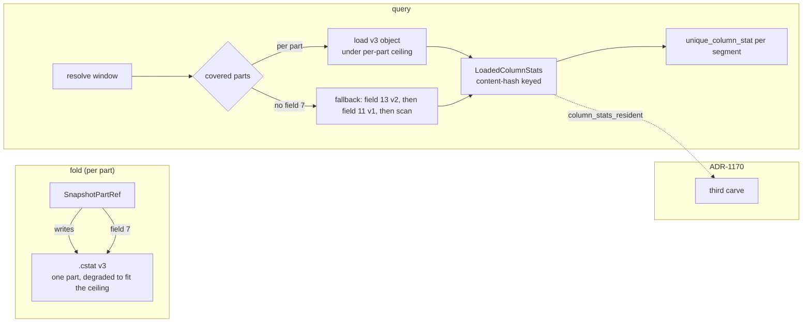

# ADR-1413: split `.cstat` column statistics per part

Status: Accepted (2026-09-08). Epic: #1413. Supersedes nothing; extends
ADR-0850 and ADR-0942.

Amended (2026-09-08): decisions 3 and 4 below are revised. The original
per-part bound (`entry_count x declared_column_count x 54,712`) refused
entirely legal parts, such as a tenant with one or two high-cardinality
declared columns near the 10,000-entry dictionary ceiling, and a refused
fold permanently stalls that tenant's catalog: no fold, no HEAD update, no
progress until an operator intervenes. The per-part ceiling is now the same
fixed `DEFAULT_MAX_COLUMN_STATS_BYTES` the reader already enforces, and the
fold degrades an over-ceiling part instead of refusing it.

## Context

ADR-0850 shipped exact per-segment column statistics as one `.cstat` object
per (tenant, signal): an `RCST` envelope whose body is every
`ColumnStatsSegment` record, concatenated length-delimited and compressed as
one zstd frame. ADR-0942 re-keyed each record to its data object's content
hash and bound the whole object to the snapshot's part set, but kept the
object monolithic: `SnapshotColumnStatsRef` and `SnapshotColumnStatsPartRef`
each carry one `string key` (`proto/ravel/catalog.proto:186,202`).

The reader consumes it per segment. `logs_scan.rs:903` calls
`unique_column_stat(seg_stats, key)` for each resolved segment in the
query's window; it never needs the whole map. But the body is one frame, so
`decode_column_stats` must inflate all of it to serve any of it, and it
refuses to inflate anything whose declared `body_uncompressed_len` exceeds
`DEFAULT_MAX_COLUMN_STATS_BYTES = 256 MiB` (`snapshot_format/mod.rs:132`).
ADR-0850 states that ceiling's purpose: "so a corrupt or hostile
`size`/header field cannot force an unbounded allocation". It is a safety
guard, sized without a wide-table case, and the writer applies no matching
guard.

### What was measured

The ClickBench `hits` tenant on the reference `c6a.4xlarge`: 104 declared
typed columns over 703 statistics segments (covering 2,617 data segments).
A 256-byte range GET of the live object's header
(`catalog/l/idx/20260903T11.cd1258e93b7e05c7.cstat`, 500,526,582 bytes on
the wire) decodes to `body_uncompressed_len = 2,000,102,795`. That is
2,000,102,795 / 703 / 104 = 27,356 bytes per (segment, column): a dictionary
of a few hundred `DictEntry` messages, well inside ADR-0850 decision 3's
10,000-entry ceiling. The size is what the design produces on a wide table.
It is 7.5x the reader's guard.

So `decode_column_stats` rejects it, `column_stats_resolve.rs` surfaces
the refusal as `FetchOutcome::DecodeRefused`, `Catalog::load_column_stats`
degrades that to `Ok(None)`, and the tenant has run with no column
statistics since it was loaded, silently. Every query still pays HEAD plus
the 500 MB download and then discards the bytes. A single-`CounterID` `COUNT(*)` issues 7,645 GETs
over the full 2,617-segment estimate: a full scan where statistics would
prune.

### Why the two obvious fixes are wrong

Two fixes were tried on #1400 and rejected:

- **Raise the cache budget** (`ColumnStatsCache`, 64 MiB). Unreachable: the
  object never reaches the cache, because decode rejects it first.
- **Raise the decode ceiling** to admit 2 GB. The decoded object is not a
  term in ADR-1170's process memory budget (its terms are the fetcher cache,
  the catalog byte cache, the SQL pools and the fetch reservations). A
  raised ceiling admits a multi-GB `HashMap` into unaccounted memory on a
  host whose non-cache demand ADR-1170's sweep measured at 17-21 GB
  regardless of cache sizing. ADR-1170 (proposed) decision 3 leaves no
  budget term for it. `ColumnStatsCache` is a byte-budgeted LRU that does
  evict, but eviction is whole-entry: today an entry over the budget is
  refused rather than admitted, and under a raised budget a single 2 GB
  entry, once admitted, could not be shed.

The object's shape is the defect: a monolithic blob consumed piecewise,
whose size grows with the tenant's whole history rather than with what any
one query touches.

## Decision

### 1. One `.cstat` object per snapshot part

The fold emits column statistics per part, alongside the part itself, and
references each from the part's own `SnapshotPartRef` through one new
additive field:

```proto
message SnapshotPartRef {
  // ... existing fields 1-6 unchanged ...
  // Additive, ADR-1413. The per-part column-statistics object covering
  // exactly this part's segments. Absent (proto3 default) means this part
  // has no per-part statistics; the reader falls back to the whole-object
  // ref at SnapshotHead field 13 (ADR-0942), then field 11 (ADR-0850), then
  // to scan. Absence is never an error.
  SnapshotColumnStatsPartRef column_stats = 7;
}
```

`SnapshotColumnStatsPartRef` is reused unchanged: its `part_blake3` list
holds exactly one entry, the owning part's hash, which is the binding
ADR-0942 already defines. The envelope stays `RCST`; the version byte
becomes 3, meaning "keyed by content hash (v2 semantics) and covering one
part". A v3 object's `ColumnStatsHeader.segment_count` is that part's
segment count, and its `part_blake3` list has length one. Existing v1 and
v2 objects keep their meaning.

Hanging the ref off the part rather than adding a repeated list to
`SnapshotHead` means the part list and the statistics list cannot drift:
a part is added, split, or superseded together with its statistics, by the
same fold step that writes the part.

### 2. The reader loads only the parts a query covers

`Catalog::load_column_stats` gains the resolved snapshot's part set as an
input. For each covered part with a `column_stats` ref it loads that
object; parts outside the query's window are not read. The decoded result
keeps the `LoadedColumnStats` shape (a map keyed by content hash), assembled
from the covered parts, so `unique_column_stat` and every caller in
`ravel-sql` are unchanged.

Fallback order per part: v3 per-part object, else the whole-object v2 (field
13), else v1 (field 11), else scan, each under ADR-0942's reader rule that a
version mismatch, a `blake3` mismatch or a decode failure subtracts that
object's coverage and scans, never errors. This ADR adds one thing to that
rule: a decode failure of an object HEAD references is logged once per
(tenant, signal, key) at WARN with the declared size and the ceiling
(landed separately as the observability half of #1400). Absence stays
silent; a referenced object the reader cannot open does not.

### 3. A per-part ceiling: the reader's existing fixed ceiling

The per-part ceiling is `DEFAULT_MAX_COLUMN_STATS_BYTES` (256 MiB), the same
constant and the same `ColumnStatsLimits` guard the v1/v2 whole-object path
already enforces. It is not derived from the part's entry count or the
tenant's declared column count: a proportional bound looked like the
tighter guard, but a legal part can carry declared columns near the
10,000-entry dictionary ceiling and cross a proportional bound while still
being well inside what the reader can safely inflate. One fixed ceiling,
shared by the v1/v2 whole-object path and the v3 per-part path, is simpler
and cannot itself be the reason a legal part is refused.

The whole-object v1/v2 ceiling stays at 256 MiB, the same value. Objects
over it remain unreadable, which is the state today; the per-part path is
how they become readable, by being re-folded.

### 4. The writer degrades before it refuses

`encode_column_stats_v3` still takes a ceiling and returns a typed
`SnapshotFormatError` when the body would exceed it, before compressing, but
the fold no longer calls it against an as-built part. Before encoding, the
fold measures the part's segments the same way the encoder measures its own
uncompressed body (length-delimited concatenation), and while that exceeds
the ceiling, drops the largest remaining dictionary by its own encoded size:
that (segment, column) pair gets `dictionary_present = false` and an empty
`dictionary`, the same omitted-dictionary shape ADR-0850 decision 3 already
uses for a column over the cardinality ceiling. min, max, count, and sum are
never touched; only the dictionary is dropped, never truncated. The fold
measures each dictionary's contribution once, drops from a max-heap while
adjusting a running total, measures the body once more at the end and
refuses on any disagreement, or when no dictionary is left and the body is
still over the ceiling.

Only once no dictionary is left to drop, and the dictionary-free body (the
fixed fields: name, declared_type, non_null_count, null_count, min, max,
sum, plus the segment and header framing) is still over the ceiling, does
`encode_column_stats_v3` refuse. The fold surfaces that as a failure for
that (tenant, signal, part) with the size and the ceiling in the message,
and writes no object. That case is a signal to raise the ceiling
deliberately, in a reviewed change; it is never silently skipped, and never
written for a reader to silently drop.

### 5. Decoded statistics are a term in the memory budget

The decoded per-part statistics live in `ColumnStatsCache` as today, now
holding per-part entries rather than one entry per tenant, so eviction has
a unit smaller than "everything". The cache's budget is the third hard
carve in ADR-1170's derivation and its resident bytes are the
`column_stats_resident` term in `unique`, which PR #1436 (the carve
rework) adds; this ADR names that home and does not create a second one. A tenant whose
per-part entries exceed the carve is evicted per part, in LRU order, exactly
as the fetcher and catalog caches evict.

This is consistent with ADR-1170 decision 3's "cannot shed" because that
property is about the carve's size, fixed at startup and never grown or
shrunk to relieve pressure elsewhere, which is what makes it a hard cap
rather than a reservation. It says nothing about entries rotating within the
fixed ceiling; LRU rotation inside a fixed byte budget is the mechanism the
fetcher and catalog caches already use under decision 3. Per-part entries do
not introduce a new shape; they give column statistics the granularity the
other two caches already have. Today's whole-tenant entry is what makes
"cannot shed" bite hardest, since a single 2 GB entry is atomic under
eviction; per-part entries return it to ordinary LRU granularity.

## Rejected alternatives

- **Raise `DEFAULT_MAX_COLUMN_STATS_BYTES` to fit the largest tenant.**
  Rejected above: it admits unaccounted memory in exactly the amount
  ADR-1170's sweep showed a query spike needs, and it grows with tenant
  history, so no single value is right for long.
- **Seek inside the existing object with an index.** The body is one zstd
  frame; a per-segment offset index would need per-segment frames, which
  is a format change of the same size as this one with a worse result: one
  object still grows without bound and one GET still fetches all of it.
- **A repeated `SnapshotColumnStatsPartRef` list on `SnapshotHead`.** Keeps
  the head self-describing but lets the part list and the statistics list
  drift apart across fold steps; the per-part field cannot.
- **Shrink the statistics** (lower the 10,000-entry dictionary ceiling).
  Changes what the statistics can answer, which ADR-0850 chose
  deliberately, to fix a layout problem.
- **Lazy per-segment decode from the cache.** Solves memory but not the
  500 MB-per-query download or the reader's guard; the object is still
  fetched whole.
- **A per-part bound proportional to the part** (`entry_count x
  declared_column_count x per_segment_stats_bound`, this ADR's original
  decision 3). Rejected on amendment (2026-09-08): the formula refuses
  entirely legal parts, such as a tenant with one or two high-cardinality
  declared columns near the 10,000-entry dictionary ceiling, and a refused
  fold permanently stalls that tenant's catalog rather than degrading it.
  A fixed ceiling shared with the existing whole-object guard admits every
  part the reader can safely inflate and needs no per-tenant tuning.

## Migration class and convergence plan

`.cstat` is a **Class B derived catalog object** (ADR-0066 decision 4;
ADR-0942's declaration stands): rebuildable from commit records,
supersession-swept, no migration tool. The convergence plan is ADR-0942's,
extended by one version:

- **Dual-publish.** The upgraded fold emits v3 per-part objects under
  `SnapshotPartRef.column_stats` and keeps publishing the field-13 v2
  whole-object until every reader understands the per-part field. Retiring
  field 13 at the first v3 publish would be the writers-before-readers
  change ADR-0066 decision 1 forbids: an older reader ignores field 7 on
  the part, finds field 13, and reads it as today. For a tenant whose v2
  object is over the ceiling that reader keeps scanning, which is the
  current state, not a regression.
- **Field 13 is retired on the format floor, as its own change** citing the
  recorded floors (ADR-0066 decision 3), after which the old objects become
  unreferenced and the existing `sweep_unreferenced_catalog_objects`
  lifecycle GCs them. No new sweep rule.
- **Dual-read spans the same window**, per decision 2's fallback order.
  The accepted read set becomes {1, 2, 3} for that window. ADR-0942's
  pending retirement of v1 (field 11) is independent of this change and
  its own reviewed change citing the recorded floors, whether it lands
  before or after this one; the three-version set is what Class B's
  rolling-upgrade window costs (a reader is cheap to keep, and the objects
  are rebuilt by the fold), and it shrinks to {2, 3} and then {3} by those
  two retirements in turn.
- **This tenant's 2.0 GB object stays unreadable until its next fold**,
  which is what makes the per-part path reachable for it. The WARN from the
  observability half names it until then.

## Consequences

- A wide table's statistics fit the reader and the budget because both are
  now bounded per part, and a query loads only what its window covers. The
  reference tenant's selective statements go from a full scan to a pruned
  one; the exact figure is pre-registered on #1185 before it is measured.
- The 500 MB-per-query download stops for the same reason.
- `ColumnStatsCache` gains a useful eviction unit. Its metrics, WARN-once
  set, idle-tenant sweep and the `build_catalog_with_column_stats_budget`
  start path from the two rejected #1400 fixes (their branches are named
  on that issue) are reviewed plumbing this implementation reuses.
- One more version byte to keep readable (v1, v2, v3) for the dual-read
  window, and one more field on `SnapshotPartRef`. Additive only; no
  renumbering.
- The per-part ceiling is the existing `DEFAULT_MAX_COLUMN_STATS_BYTES`
  constant, not a new one; the writer now shares the exact bound the reader
  already enforced, instead of deriving its own from the part.

## Data flow



## Verification obligations for the implementing tasks

- A part whose statistics exceed the ceiling degrades: the fold drops the
  largest remaining dictionary, by encoded size, until the part fits,
  leaving min/max/count/sum exact and the dropped columns'
  `dictionary_present` false; the fold report counts how many were dropped.
- A part whose dictionary-free statistics alone exceed the ceiling is
  refused at fold time with the size and ceiling in the error, and no
  object is written (assert the store's key set).
- A v3 object at exactly the ceiling decodes; the same object one byte over
  a reader's ceiling is rejected.
- A query over a window covering k of n parts issues exactly k per-part
  GETs and zero whole-object GETs; pinned to the count, not `< n`.
- An old reader (v2-only) against a dual-published snapshot reads field 13
  and gets the current behaviour; a new reader against an old snapshot
  (no field 7) falls back to field 13. Both pinned.
- Resident bytes after loading k parts equal the sum of those k decoded
  sizes exactly, and eviction under the carve removes whole parts in LRU
  order.
