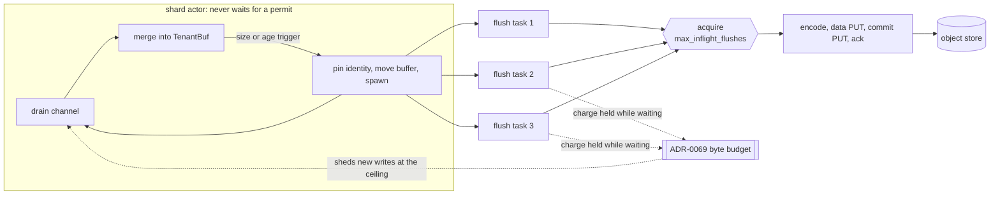

# ADR-1642: acquire the flush permit inside the flush task

Status: Accepted (2026-09-12). Supersedes ADR-0067 decision 2. Issues #1292
and #1641.

## Context

ADR-0067 decision 2 bounds in-flight flushes per shard with a
`max_inflight_flushes` semaphore and states where the wait for it happens:
"When the bound is reached the actor's flush trigger blocks, and backpressure
propagates through the bounded channel exactly as today."

Blocking the flush trigger blocks the actor, and the actor is the shard's only
task. Its loop has three arms: receive from the shard channel, the age-flush
tick, and reaping finished flush tasks. A wait taken inside the flush trigger
suspends all three at once. So at the bound a shard stopped draining its
channel, stopped firing age triggers, and stopped reaping, for as long as the
oldest in-flight flush took.

That couples tenants that share a shard. Object keys are tenant-prefixed and
S3 throttles per key prefix, so a `503 SlowDown` is normally confined to the
one tenant whose prefix is hot. Under decision 2 as written it was not: the
throttled tenant's flush held the permit, the next flush trigger parked the
actor, and every co-resident tenant's buffered data stopped moving, including
tenants whose own prefixes were healthy and whose age triggers were due. The
effect is not bounded by `max_flush_delay`: the age tick that would enforce it
is one of the arms that stopped.

All three ingest pipelines (metrics, logs, spans) are built on the same actor
shape and all three had the same wait in the same place.

## Decision

1. **The `max_inflight_flushes` permit is acquired inside the spawned flush
   task, not on the actor.** At a flush trigger the actor still does what
   ADR-0067 decision 1 says it does: it pins the flush identity, moves the
   tenant buffer and its waiters into a flush task, and spawns it. It does not
   wait for a permit. The spawned task's first action is to acquire, so at the
   bound the task parks and the actor returns to its loop. Ordering is
   unaffected: identity and `seq` are still pinned on the actor, in
   submission order, before the spawn. This applies to all three pipelines.

2. **Backpressure at the bound propagates through the ADR-0069 ingest byte
   budget, not through the bounded channel.** A flush holds its byte charge
   from the moment its buffer leaves the actor until the flush completes,
   waiting for a permit included. A shard wedged on a throttled prefix
   therefore accumulates charges, and `try_charge` sheds new writes with
   `BufferBudgetExceeded` once they reach the ceiling. That is the memory
   bound at the bound. The bounded channel remains backpressure for its own
   case, an actor busy in on-actor work, which after this change is merge,
   pin, and the drains that await in-flight flushes.

3. **The in-flight gauge counts a flush from the moment its buffer leaves the
   actor.** The increment happens on the actor, paired with its decrement in
   one RAII value, so a flush still waiting for a permit is counted. It holds
   a whole flush window of memory and an ADR-0069 charge exactly as an
   executing flush does, and that memory is what this ADR's consequence below
   is about. The consequence is that the gauge can exceed
   `max_inflight_flushes` for a shard, which under ADR-0067 it could not.

## Consequences

- ADR-0067's consequence "Memory per (shard, tenant) rises by up to
  (`max_inflight_flushes` - 1) flush windows" no longer holds and is replaced
  by: memory per shard rises by one flush window per spawned flush, and the
  number of spawned flushes is not bounded by `max_inflight_flushes`, because
  a flush is spawned whenever a trigger fires rather than whenever a permit is
  free. The real bound is the ADR-0069 process-wide byte budget, which holds
  every in-flight flush's charge and sheds at the ceiling. `max_inflight_flushes`
  keeps its other meaning unchanged: it is the concurrency of flushes actually
  executing against the object store, and so the bound on concurrent PUTs and
  on encode memory in flight.
- The in-flight gauge can read above `max_inflight_flushes` for a shard. An
  alert or dashboard that treated the bound as the gauge's ceiling reads the
  queue depth of waiting flushes as if it were oversubscription. The gauge
  minus `max_inflight_flushes`, floored at zero, is that queue depth.
- A stalled flush no longer fills the shard channel, so a full channel is no
  longer a symptom of a stalled object store. It stays a symptom of an actor
  busy merging, or of one awaiting in-flight flushes in a drain.
- The actor does still park awaiting in-flight flushes, in the drains that
  must complete before they answer: an explicit flush-all, shutdown, and
  channel close. Those are bounded by `max_flush_lifetime` and are requested
  work, not a side effect of the bound being reached.
- The per-shard skew accounting changes meaning for one of its three spans.
  The permit wait is no longer time the actor spent, so it is no longer
  subtracted from the on-actor span, and it is now a sum over concurrently
  waiting tasks: at one permit with three flushes queued it accrues the whole
  queue, not one refusal, and it can exceed wall time. The on-actor span
  becomes pure merge-and-pin work.
- ADR-0067 decisions 1, 3, and 4 are unaffected. Decision 3's specific delay
  figures were already superseded by ADR-0076 and are not revisited here.

## Rejected alternatives

- **Keep the acquire on the actor and use `try_acquire`, skipping the flush
  when no permit is free.** The trigger that fired is a size or age trigger,
  so skipping it either loses the trigger (the buffer keeps growing past
  `target_bytes`, and an age-triggered tenant misses its visibility deadline
  with nothing to retry it until the next tick) or needs a re-trigger
  mechanism that is the queue this ADR already has, written less explicitly.
- **Drop the semaphore and let every trigger flush immediately.** The bound
  is what keeps concurrent PUTs and encode memory explicit per shard. Moving
  the wait off the actor keeps it; removing it makes object-store concurrency
  a function of arrival rate.
- **A permit per tenant instead of per shard.** It removes the cross-tenant
  coupling by making the bound unenforceable in aggregate: the shard's
  concurrent PUT count would then scale with its tenant count, which is the
  thing `max_inflight_flushes` exists to bound.
- **Bound the spawned-but-waiting queue with its own limit.** A second bound
  would need its own policy for what happens when it is reached, which is
  either the on-actor wait this ADR removes or a shed. Shedding is already
  what the ADR-0069 byte budget does, against the quantity that actually
  matters (bytes held), rather than against a count of flushes whose sizes
  differ.
