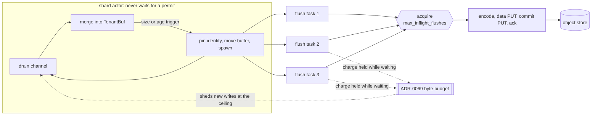

# ADR-1642: acquire the flush permit inside the flush task

Status: Accepted (2026-09-12). Amended 2026-09-20 (issue #1740, see
"Amendment: the queued-flush cap" below). Supersedes ADR-0067 decision 2.
Issues #1292, #1641, and #1740.

## Context

ADR-0067 decision 2 bounds in-flight flushes per shard with a
`max_inflight_flushes` semaphore and states where the wait for it happens:
"When the bound is reached the actor's flush trigger blocks, and backpressure
propagates through the bounded channel exactly as today."

Blocking the flush trigger blocks the actor, and the actor is the shard's only
task. Its loop has three arms: receive from the shard channel, the age-flush
tick, and reaping finished flush tasks. A wait taken inside the flush trigger
suspends all three at once. So at the bound a shard stopped draining its
channel, stopped firing age triggers, and stopped reaping, for as long as the
oldest in-flight flush took.

That couples tenants that share a shard. Object keys are tenant-prefixed and
S3 throttles per key prefix, so a `503 SlowDown` is normally confined to the
one tenant whose prefix is hot. Under decision 2 as written it was not: the
throttled tenant's flush held the permit, the next flush trigger parked the
actor, and every co-resident tenant's buffered data stopped moving, including
tenants whose own prefixes were healthy and whose age triggers were due. The
effect is not bounded by `max_flush_delay`: the age tick that would enforce it
is one of the arms that stopped.

All three ingest pipelines (metrics, logs, spans) are built on the same actor
shape and all three had the same wait in the same place.

## Decision

1. **The `max_inflight_flushes` permit is acquired inside the spawned flush
   task, not on the actor.** At a flush trigger the actor still does what
   ADR-0067 decision 1 says it does: it pins the flush identity, moves the
   tenant buffer and its waiters into a flush task, and spawns it. It does not
   wait for a permit. The spawned task's first action is to acquire, so at the
   bound the task parks and the actor returns to its loop. `seq` allocation
   order is unaffected: identity and `seq` are pinned on the actor, in
   submission order, before the spawn, so the `seq` a flush carries still
   reflects arrival order. Publication order is not preserved. The permit is
   now acquired inside the spawned tasks, which race to reach the acquire, so
   even at `max_inflight_flushes = 1` two flushes of one shard can publish
   their commit records in an order other than `seq` order, where the on-actor
   acquire published them strictly in `seq` order (at one permit it granted the
   permit to the next flush only after the previous one had committed). This is
   an accuracy correction, not a durability or read defect: `seq` is monotonic
   per `(writer_id, epoch, shard)` with gaps permitted, and completeness is
   never inferred from `seq` continuity (docs/catalog-and-mvcc.md), so an
   out-of-`seq` publication is a reordering of independently visible commits,
   not a gap. This applies to all three pipelines.

2. **Backpressure at the bound propagates through the ADR-0069 ingest byte
   budget, not through the bounded channel.** A flush holds its byte charge
   from the moment its buffer leaves the actor until the flush completes,
   waiting for a permit included. A shard wedged on a throttled prefix
   therefore accumulates charges, and `try_charge` sheds new writes with
   `BufferBudgetExceeded` once they reach the ceiling. When the budget is
   configured (`--max-ingest-buffer-bytes`, default `Bounded(512 MiB)`) that
   shed is the memory bound at the bound. It is not unconditional: the flag's
   `0` value maps to `Unlimited`, under which `try_charge` never sheds
   (`crates/ravel-ingest/src/budget.rs`), so an operator who disables the
   budget also disables this bound and nothing but host memory limits the
   spawned-but-waiting flush queue under a sustained stall. The consequence
   below states what holds in each configuration. The bounded channel remains
   backpressure for its own
   case, an actor busy in on-actor work, which after this change is merge,
   pin, and the drains that await in-flight flushes.

3. **The in-flight gauge counts a flush from the moment its buffer leaves the
   actor.** The increment happens on the actor, paired with its decrement in
   one RAII value, so a flush still waiting for a permit is counted. It holds
   a whole flush window of memory and an ADR-0069 charge exactly as an
   executing flush does, and that memory is what this ADR's consequence below
   is about. The consequence is that the gauge can exceed
   `max_inflight_flushes` for a shard, which under ADR-0067 it could not.

## Consequences

- ADR-0067's consequence "Memory per (shard, tenant) rises by up to
  (`max_inflight_flushes` - 1) flush windows" no longer holds and is replaced
  by: memory per shard rises by one flush window per spawned flush, and the
  number of spawned flushes is not bounded by `max_inflight_flushes`, because
  a flush is spawned whenever a trigger fires rather than whenever a permit is
  free. What bounds that count depends on the byte-budget configuration, and
  the change removed the one bound that held regardless of it:
  - Under the default `Bounded(512 MiB)` budget the bound is the ADR-0069
    process-wide byte budget, which holds every in-flight flush's charge and
    sheds new writes at the ceiling, so a sustained stall stops admitting new
    bytes before the queue can grow without limit.
  - Under `Unlimited` (`--max-ingest-buffer-bytes 0`) `try_charge` never sheds,
    so nothing bounds the spawned-but-waiting flush queue except host memory. A
    sustained stall on a throttled prefix can queue flush tasks until the
    process runs out of memory. Before this change the on-actor acquire plus
    the 256-deep bounded channel bounded that memory whatever the budget was
    set to, at the cost of the cross-tenant coupling this ADR removes; the two
    cannot both hold, because a bound that fired without parking the actor or
    shedding would have to be one of those two, and shedding under `Unlimited`
    contradicts what `0` means everywhere else in this crate. Disabling the
    budget is therefore an explicit opt-out of this memory bound, consistent
    with every other `0`-means-no-limit ceiling in ingest; operators who set it
    accept unbounded buffered flush memory under a long stall.

    Amended by issue #1740: ORDINARY triggers (neither `Manual` nor fired on
    a buffer over its memory backstop) are now bounded by
    `max_queued_flushes` under every budget setting. The queue as a whole is
    NOT bounded by any count. Every trigger on a buffer over its backstop is
    exempt from the cap, each exempt spawn consumes that buffer so the tenant
    can cross again and spawn again, and nothing caps how many buffers are
    over the backstop at once or how many times each crosses. Under a
    `Bounded` byte budget an exempt window stays charged until its PUTs
    complete, so the accumulation drives the gauge to the ceiling and
    admission sheds: the byte ceiling, not a count, is what bounds it. Under
    `Unlimited` (`--max-ingest-buffer-bytes 0`) nothing sheds behind the
    backstop, so with the store stalled the exempt path is bounded only by
    how long the stall lasts, and "nothing bounds the spawned-but-waiting
    flush queue except host memory" still holds for it. What `Unlimited`
    opts out of is the process-wide bound on the sum of buffered rows
    waiting in the tenant maps; each individual buffer is still bounded by
    that backstop, which is why the exemption exists. See the amendment
    below.

  `max_inflight_flushes` keeps its other meaning unchanged: it is the
  concurrency of flushes actually executing against the object store, and so
  the bound on concurrent PUTs and on encode memory in flight.
- The in-flight gauge can read above `max_inflight_flushes` for a shard. An
  alert or dashboard that treated the bound as the gauge's ceiling reads the
  queue depth of waiting flushes as if it were oversubscription. The gauge
  minus `max_inflight_flushes`, floored at zero, is that queue depth.
- A stalled flush no longer fills the shard channel, so a full channel is no
  longer a symptom of a stalled object store. It stays a symptom of an actor
  busy merging, or of one awaiting in-flight flushes in a drain.
- The actor does still park awaiting in-flight flushes, in the drains that
  must complete before they answer: an explicit flush-all, shutdown, and
  channel close. Those are bounded by `max_flush_lifetime` and are requested
  work, not a side effect of the bound being reached.
- The per-shard skew accounting changes meaning for one of its three spans.
  The permit wait is no longer time the actor spent, so it is no longer
  subtracted from the on-actor span, and it is now a sum over concurrently
  waiting tasks: at one permit with three flushes queued it accrues the whole
  queue, not one refusal, and it can exceed wall time. The on-actor span
  becomes pure merge-and-pin work.
- ADR-0067 decisions 1, 3, and 4 are unaffected. Decision 3's specific delay
  figures were already superseded by ADR-0076 and are not revisited here.

## Rejected alternatives

- **Keep the acquire on the actor and use `try_acquire`, skipping the flush
  when no permit is free.** The trigger that fired is a size or age trigger,
  so skipping it either loses the trigger (the buffer keeps growing past
  `target_bytes`, and an age-triggered tenant misses its visibility deadline
  with nothing to retry it until the next tick) or needs a re-trigger
  mechanism that is the queue this ADR already has, written less explicitly.
- **Drop the semaphore and let every trigger flush immediately.** The bound
  is what keeps concurrent PUTs and encode memory explicit per shard. Moving
  the wait off the actor keeps it; removing it makes object-store concurrency
  a function of arrival rate.
- **A permit per tenant instead of per shard.** It removes the cross-tenant
  coupling by making the bound unenforceable in aggregate: the shard's
  concurrent PUT count would then scale with its tenant count, which is the
  thing `max_inflight_flushes` exists to bound.
- **Bound the spawned-but-waiting queue with its own limit.** A second bound
  would need its own policy for what happens when it is reached, which is
  either the on-actor wait this ADR removes or a shed. Shedding is already
  what the ADR-0069 byte budget does, against the quantity that actually
  matters (bytes held), rather than against a count of flushes whose sizes
  differ. This is why the `Unlimited` exposure in the consequences is
  documented rather than fixed with a count bound: a count bound that also
  sheds under `Unlimited` would make `0` shed, which contradicts its meaning,
  and one disabled under `Unlimited` alongside the byte budget would leave the
  same exposure. The only bound that fires without the on-actor wait is a shed,
  and shedding is what an operator turns off by setting `0`.

  Amended by issue #1740. That last sentence is wrong: it enumerates two
  policies for a reached bound and there is a third, refusing the trigger
  and leaving the rows buffered. See "Amendment: the queued-flush cap"
  below, which adopts the count bound this bullet rejected.

## Amendment: the queued-flush cap (issue #1740)

The `Unlimited` exposure in the consequences above is now bounded by a count,
`IngestConfig::max_queued_flushes` (default 8, per shard). Before spawning a
flush the actor compares its spawned-but-unreaped flush count against the cap,
and at the cap it refuses the trigger instead of spawning. The refused buffer
goes back into the tenant map exactly as it arrived: rows, waiters, byte
charges, and the trigger bookkeeping including `oldest_arrival_ns`, so the age
clock is not reset and the next tick re-fires the same trigger once a flush has
been reaped. Nothing is acked and nothing is dropped.

This is the policy the "bound the spawned-but-waiting queue with its own limit"
bullet above ruled out, and that bullet's reasoning was incomplete. It held that
a second bound must resolve to either the on-actor wait this ADR removes or a
shed. Refusing a trigger is neither. The actor does not wait: the comparison is
a `JoinSet::len()` read and the refusal returns to the select loop immediately,
so the channel arm, the age-tick arm, and the reap arm all keep running, which
is the whole property this ADR bought. The write is not shed either: the rows
are still buffered, still charged, and their waiters are still pending, so a
write that would have been acked is still acked, one tick later. So `0` does not
come to mean "shed", and the exposure is bounded regardless of the byte budget's
setting.

What the cap does change is the deadline. A deferred age trigger misses
`max_flush_delay` by however long the shard stays at the cap, which is the cost
the first rejected alternative names for a `try_acquire` skip. The difference is
that this skip has the re-trigger mechanism that alternative said it would need:
the age tick fires every `flush_tick` against an unreset `oldest_arrival_ns`, so
a refused trigger is retried on the next tick with no new write required. The
trade is a bounded visibility delay under a sustained stall against an unbounded
queue under the same stall, and a stall long enough to fill the queue has
already missed the deadline on the flushes ahead of it.

`FlushTrigger::Manual` is exempt. Manual is what every drain path uses
(`flush_all` for an explicit flush, shutdown, and channel close), and those
loop until the tenant map empties. A refused Manual trigger would therefore
either spin or leave residue, and residue on the shutdown path is acknowledged
data that never reaches the object store. Drains are also the one place the
actor is permitted to park on in-flight flushes, so the queue they add is
bounded by the drain itself.

A trigger on a buffer that has crossed its per-(shard, tenant) memory backstop
(`buffer_memory_backstop_bytes`: `max(target_bytes, min(64 MiB, ceiling / 8))`)
is exempt too, whatever the trigger kind. The first cut of this cap refused
every non-Manual trigger, including the backstop crossing, which was wrong in
the direction that matters. That backstop is the only bound on ONE buffer's
resident memory: `target_bytes` is an object-size estimate, not a memory one,
and on a label-heavy series the two differ by more than an order of magnitude,
which is why the backstop exists. Under `Unlimited` nothing sheds behind it.
So with the store stalled and a shard at its cap, refusing the crossing left
one tenant's buffer growing past 64 MiB with nothing to stop it: the cap
turned a bounded queue of flush tasks into an unbounded buffer, which is a
worse failure than the one it was added to fix. A flush window is bounded and
drains itself; a buffer under a sustained stall is neither.

The exemption is therefore deliberate, and it means the queue CAN exceed
`max_queued_flushes`. Each exempt spawn consumes the whole buffer it fires on,
and the only re-insert path is the ordinary one, so a tenant crosses its
backstop again only after buffering another backstop's worth: the exempt
windows ACCUMULATE, one per crossing, rather than standing at one per buffer
currently over its backstop. The queue therefore grows as fast as memory
fills rather than with the flush cadence, which is slower, not bounded. What
bounds the accumulation depends on the byte budget. Under a `Bounded`
`--max-ingest-buffer-bytes` a queued flush stays charged until its PUTs
complete, so the exempt windows drive the gauge to the ceiling, admission
sheds, and the refill that would spawn the next one stops: the ceiling is the
bound. Under `Unlimited` (`--max-ingest-buffer-bytes 0`) nothing sheds behind
the backstop, and with the store parked the exempt windows are bounded only by
how long the stall lasts. One buffer's own resident memory stays bounded by
the backstop on either arm, and the ordinary queue stays bounded by
`max_queued_flushes` on either arm.

Operators size the steady state from `max_queued_flushes`. Under a `Bounded`
budget the headroom for the overshoot comes from the byte ceiling; under
`Unlimited` there is no figure to size it from, which is the reason to run a
ceiling on any host where the store can stall. Read the two metrics together
to tell the cases apart: a `flushes_queued` above the cap with
`flush_trigger_deferred` flat is the exemption (memory pressure), while
`flush_trigger_deferred` rising is the cap (a stalled store).

Two per-shard metrics make the cap observable: `flushes_queued`, a gauge of the
spawned-but-unreaped count the cap tests, and `flush_trigger_deferred`, a
counter of refused triggers. Both are on `ShardSkewStats`, for all three
pipelines, and both are EXPORTED on `ravel-server`'s `/metrics` as
`ravel_ingest_queued_flushes` and `ravel_ingest_flush_trigger_deferred_total`,
labelled by `{mode, signal}`, so the alarm below is a scrape rule and not a
library reading. A nonzero `flush_trigger_deferred` rate means a shard is at
its cap and its tenants' visibility deadlines are slipping; it is the signal
that the object store, not ingest, is the thing to look at.

The consequence bullets above are unchanged except in their bound. Memory per
shard still rises by one flush window per spawned flush, and the in-flight gauge
can still read above `max_inflight_flushes`; what is new is that the ORDINARY
triggers are bounded, under any byte-budget setting, by `max_queued_flushes`.
The gauge as a whole is `max_queued_flushes` plus the accumulated exempt
windows, which a `Bounded` byte budget bounds through its shed and which
`Unlimited` does not bound at all while the store is stalled. Buffered memory
is not bounded by this cap either: a shard at its cap keeps merging new writes
into tenant buffers. Per buffer that is what the memory backstop bounds, which
is why the backstop is exempt from the cap; in sum across tenants it is what
the byte budget bounds and what `Unlimited` still opts out of.

The cap is `--max-queued-flushes` (`RAVEL_MAX_QUEUED_FLUSHES`) on
`ravel-server`. `Cli::validate` rejects `0`. A `--max-inflight-flushes` above
the cap is NOT rejected: `Cli::resolve_flush_concurrency` raises the effective
cap to the permit count and logs a warning naming both numbers. Effective
per-shard flush concurrency is the lower of the two, because a refused trigger
never spawns a task to take a permit, so the raise is what keeps the permits
the operator configured reachable. A refusal was the first cut and was wrong
for a deployed cluster: `spec.gateway.maxInflightFlushes` is settable on the
`RavelCluster` CRD and renders onto the gateway Deployment verbatim, while the
CRD has no field for the queue cap, so any cluster running more than eight
permits would have crash-looped every gateway pod on upgrade with no
custom-resource edit able to recover it. Lowering the permit count instead
would have discarded configured concurrency silently.
