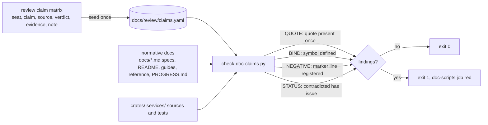

# ADR-1658: documentation claims registry

Status: Accepted (2026-09-16). Issue #1658. Amends ADR-1040 (decision 3's
documentation gate gains a claims rule).

## Context

The documentation gate checks form, not truth. `scripts/check_docs.py`
holds a page to ADR-1040's rules for links, provenance, terminology,
reachability and the ADR index (`scripts/check_docs.py:446-480`); nothing
in it asks whether a sentence describing the system is still true. The
2026-09-12 due-diligence review answered that question by hand for 191
claims taken from the normative docs, each row carrying the reviewing seat,
the claim, its source sentence, a verdict, the evidence and a note, and
found contradictions the docs still carry.

Three survive on `main`. `README.md:331-334` and
`docs/guides/agents.md:3-5` say the `mcp` cargo feature, the `--mcp` flag and
`POST /mcp` do not exist in a build; the feature is defined
(`services/ravel-server/Cargo.toml:230-239`), `crates/ravel-mcp` exists, and
`docs/reference/mcp.md:3-9` describes the route as shipped. `PROGRESS.md:70-77`
says nothing constructs the real audit pipeline so `audit_mode=required`
cannot fail closed; `services/ravel-server/src/lib.rs:2314-2318` spawns
`AuditPipeline` for every query mode. `docs/query-engine.md:260-263` says
the stamp writers' only callers are tests; `crates/ravel-ingest/src/log_shard.rs:766`
calls `stamp_commit_record` from the flush path. Each is a negative
claim, "X does not exist", the kind that goes stale the moment X lands and
that no code change touches.

The repository already binds prose to code in three places, each with a
different mechanism. The TLA traceability lane resolves `path.rs::Sym::Sym`
references from five-column tables (`formal/tla/TRACEABILITY.md:5-6`,
`formal/tla/lifecycle/traceability.md:18`) with `resolve_rust_ref`
(`scripts/check-tla.sh:624-647`): the file must exist and each symbol must
appear in it by `grep -F`, so a name that survives in a comment or inside a
longer identifier still passes. `consistency_model_defaults.rs` parses the
figure out of the sentence that makes the claim and compares it to the
constant (`services/ravel-server/tests/consistency_model_defaults.rs:1-6`).
`iam_templates.rs` keeps a table of `(file, required phrases, retired
phrases)` per doc (`crates/ravel-commit/tests/iam_templates.rs:6020-6024`).
None of them covers a claim outside its own crate, and none can say that a
negative sentence was ever decided.

The gate's scopes constrain where a registry can live: any `docs/**/*.md`
is spec or user scope, where a `crates/...rs:NN` reference fails PROVENANCE
(`scripts/check_docs.py:276-278`) and an unlinked page fails ORPHAN. Python
tooling under `scripts/` is stdlib `unittest`, discovered by
`make test-python` (`Makefile:14-23`), and the doc-scripts job runs
`check_docs.py` unpiped (`.github/workflows/ci.yml:245-247`). A marker
scan over the normative docs shows the marker choice decides the noise:
"cannot" and "there is no" match over 400 lines, while "does not exist",
"not implemented", "not yet implemented", "will land", "is not supported"
and "not available" match 53, about half of them claims about a
capability.

## Decision

1. **The registry is `docs/review/claims.yaml`, one entry per claim.** Each
   entry has `id`, `doc` (repo-relative path), `quote` (a verbatim fragment
   of one sentence), `kind` (`positive`, `negative` or `not-a-claim`),
   `binds` (a list of `path.rs::Symbol[::Symbol]` references to the code or
   test that makes the sentence true), `status` (`verified`,
   `contradicted`, `not-implemented`) and `note`. A `contradicted` entry
   must carry `issue`. YAML is outside every check_docs scope, and no line
   numbers or hashes appear in it, so the provenance rules are not in
   tension with it.

2. **Normative docs are the doc map's specs, the user pages and
   PROGRESS.md.** That is every `docs/*.md` the doc map names,
   `README.md`, `docs/guides/**`, hand-written `docs/reference/**` and
   `PROGRESS.md`. Decision records are history (ADR-1040 decision 7) and
   `docs/internal/` is exempt; a claim in either is never registered.

3. **`scripts/check-doc-claims.py` is the gate, with four rules.**
   - QUOTE: every `quote` occurs verbatim in its `doc`, exactly once. A
     sentence that changes voids its entry, and the author updates the
     entry with the edit.
   - BIND: every reference in `binds` resolves. The reference syntax is
     the traceability lane's, so a row can be copied between the two
     tables; the resolver is stricter: the file must exist and each
     symbol must match a definition (`fn`, `struct`, `enum`, `trait`,
     `type`, `const`, `static`, `mod`, or a `#[test]` function name) at a
     word boundary, not any substring.
   - NEGATIVE: every prose line of a normative doc that matches the
     marker list must be covered by an entry whose `quote` lies on that
     line. The marker list is fixed in the script: "does not exist",
     "do not exist", "not implemented", "not yet implemented", "will
     land", "is not supported", "are not supported", "not available". A
     match that is not a capability claim ("not yet acked", "does not
     exist yet" about a directory) is registered as `not-a-claim` with a
     note, so each match is decided once and the decision is reviewable.
   - STATUS: a `contradicted` entry without `issue` fails; a
     `not-implemented` entry whose `binds` resolve fails, because the
     capability now exists and the sentence needs rewriting.
   The script is stdlib only, exits 0 clean, 1 on findings, 2 when it
   cannot run (missing registry, unreadable doc, empty marker match set
   across all normative docs, which would mean the scan is broken).

4. **Seed from the review's claim matrix.** Each matrix row whose source
   sentence still exists on `main` becomes an entry: the claim's source
   becomes `quote`, the verdict maps to `status` (VERIFIED and STRONGLY
   SUPPORTED to `verified`, CONTRADICTED to `contradicted`, NOT
   IMPLEMENTED to `not-implemented`), and the evidence's symbols become
   `binds`. Rows whose sentence no longer exists are dropped. The three
   contradictions above are the first `contradicted` entries; the MCP and
   PROGRESS.md corrections land in their own change and flip those entries
   to `verified`.

5. **Wiring: the doc-scripts job beside `check_docs.py`, `make
   check-docs`, and `scripts/test_check_doc_claims.py` under `make
   test-python`.** The tests build a temporary repo per rule, as
   `test_check_docs.py` does, and pin the two cases the ticket names:
   deleting a bound test fails BIND, and an unregistered negative sentence
   in a normative doc fails NEGATIVE.

## Rejected alternatives

- **Reuse the traceability lane's `grep -F` resolver unchanged.** A
  deleted function whose name survives in a doc comment passes it, which
  is the exact failure a deleted-symbol gate exists to catch. The
  reference syntax is reused; the match is tightened to definitions.
- **A Markdown registry under `docs/`.** Spec scope bans the source
  references the entries need, ORPHAN needs a link from a user page to a
  file no reader wants, and a table is harder to validate than YAML.
- **A broad marker list including "cannot" and "there is no".** Over 400
  matches, most of them constraints ("a request cannot exceed") rather than
  absence claims; the registry would be mostly `not-a-claim` rows and the
  signal would drown.
- **Bind every claim to a test rather than a symbol.** Many true sentences
  describe a constant, a key shape or a type, and the test that pins them
  is often a doc-drift test in another crate. A binding to the symbol is
  the floor; an entry may bind both.
- **Line-number or commit-hash citations in the registry.** They go stale
  on every edit above them and ADR-1040 bans them from the pages the
  registry serves; a quote plus a symbol is stable across reflows.
- **Fail the gate on every `contradicted` entry.** The registry is also
  the ledger of known-false sentences awaiting a fix; forcing every one to
  be fixed before it can be recorded makes the registry unmergeable on
  the day it is seeded. An issue reference is the price of recording one.

## Consequences

- What changes for an author: editing a registered sentence means editing
  its entry; adding a sentence with a marker phrase to a normative doc
  means adding an entry, positive, negative or `not-a-claim`; deleting a
  bound symbol or test fails the doc-scripts job with the entry id and the
  sentence it was holding up.
- The three contradictions become tracked entries with issues on the day
  the registry lands, and the gate refuses their sentences from going
  stale a second time without a record.
- The traceability lane keeps its own resolver; adopting the definition
  match there is a separate change to `scripts/check-tla.sh`.
- The docs/README.md index gains no new page; `docs/review/` holds data,
  not documentation.
- Follow-up tasks:
  1. The MCP wording in README.md and docs/guides/agents.md, and the
     PROGRESS.md audit paragraph, corrected against the shipped code.
  2. `scripts/check-doc-claims.py`, its unittest module, the registry
     seeded from the matrix, and the CI and Makefile wiring, in one
     change, cases first.
  3. The query-engine.md stamp-writer sentence corrected, with its entry.
