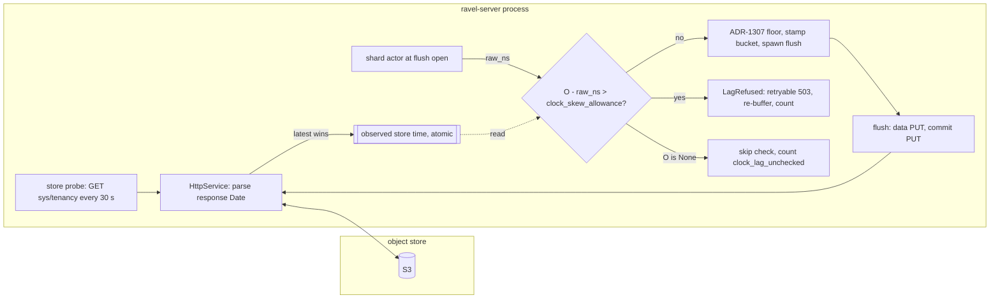

# ADR-1685: Writer clock skew refusal against a store-observed time source

Status: Accepted (2026-09-16). Issue #1685. Amends ADR-1307 (the flush-open
check gains a lag bound beside the monotonic floor).

## Context

A fold seals an ingest hour from the folder's own clock.
`sealed_watermark_hour` (crates/ravel-catalog/src/fold.rs:335-347) takes the
caller's `now_ns` and subtracts `max_flush_lifetime + clock_skew_allowance +
fold_safety_margin`. With the defaults in crates/ravel-catalog/src/config.rs
(:8 five minutes, :32 sixty minutes, :36 fifteen minutes) that margin is one
hour and twenty minutes. Once an hour is sealed, a token-less resolve reads it
from the snapshot alone (crates/ravel-catalog/src/catalog.rs:1963-1985), and
an incremental fold never re-lists a bucket that holds only L0 commit records
(crates/ravel-catalog/src/fold.rs:731-739).

A writer stamps its ingest-hour bucket from its own clock. The shard actor
reads the clock once at flush open and derives the bucket with
`checked_ingest_hour_bucket` (crates/ravel-ingest/src/config.rs:107-129).
That function refuses three readings: non-positive, below the 2020
plausibility floor, and not representable as a `u32` hour. ADR-1307 added the
per-writer monotonic floor at the same site
(crates/ravel-ingest/src/shard.rs:1393-1424), which bounds a backwards step
against the writer's own earlier readings. Nothing bounds how far the writer's
clock lags the folder's. The floor starts at zero for each shard
(crates/ravel-ingest/src/router.rs:252), so a process that starts with a slow
clock stamps that reading verbatim and then tracks it.

The fold protocol states its clock assumption plainly: every writer's clock is
within `clock_skew_allowance` of true time, and the folder's own error is
smaller than `fold_safety_margin` (docs/catalog-and-mvcc.md:705-712). Nothing
enforces the writer half. docs/consistency-model.md:316-322 documents only the
folder-runs-fast direction. A writer more than the seal margin behind the
folder publishes an acknowledged commit record into a sealed hour. The
`ravel_scrub_seal_divergence_total` counter detects it
(docs/guides/operations/troubleshooting.md:263) and the repair is a manual
snapshot rebuild.

The ticket's proposed fix, a window around the node's own clock reading, is
self-referential: `flush_open_ns` is that reading. The writer needs a second
time source, and it has none today. Three candidates were considered:

- The object store's response `Date` header. Every S3 response carries one.
  The `object_store` crate's `PutResult` exposes no response headers
  (crates/ravel-object-store/src/s3.rs:61), but the S3 backend already
  installs a custom `HttpService` below the crate's retry loop
  (crates/ravel-object-store/src/s3/attempts.rs:70-116), and that service
  sees every `HttpResponse`. The production server builds its store through
  that path (`S3Store::with_metrics`, services/ravel-server/src/store.rs:409).
  Every process also GETs `sys/tenancy` every `--store-probe-interval`
  (thirty seconds by default) in every mode
  (services/ravel-server/src/store_probe.rs:1-9, :129-133), so the
  observation is refreshed whether or not the process is flushing.
- The cached catalog HEAD watermark. It is per tenant, it costs a GET or a
  TTL cache on the write path, and it is derived from the folder's clock, so
  it measures the folder rather than true time.
- A fleet heartbeat clock set. Gateway processes write no `sys/` heartbeat
  today, so it adds a key namespace, and a fleet whose writers are all slow
  agrees with itself.

The ingest `Clock` trait exposes wall time only (crates/ravel-ingest/src/clock.rs:23-25).
There is no injected monotonic source, so a stale observation cannot be
advanced by elapsed time in a way a test can drive.

## Decision

1. **The S3 backend observes the store's clock from response `Date` headers.**
   The `HttpService` that already counts attempts parses the `Date` header of
   every response it receives and stores the result, as unix nanoseconds, in
   a process-shared atomic. The latest response wins; the value is never a
   running maximum, so one bad header from a proxy affects at most the
   flushes before the next response. A response without a parseable `Date`
   changes nothing. `ObjectStoreBackend` gains a default method,
   `observed_store_time_ns(&self) -> Option<i64>`, returning `None`. `S3Store`
   returns the latest observation, or `None` before the first response. The
   instrumentation, fault, and KMS-routing decorators delegate to their inner
   store. `MemoryStore` returns `None` unless a test sets a value through a
   test-only setter. No new object, no new request, no change to any
   persistent format.

2. **A flush whose raw clock reading lags the observed store time by more
   than `clock_skew_allowance` is refused.** At flush open, after the
   plausibility check and before the ADR-1307 floor is consulted, the actor
   reads the observation `O`. If `O` is `Some` and
   `O - raw_ns > DEFAULT_CLOCK_SKEW_ALLOWANCE_NS`, the flush fails with a new
   `FlushClockError::LagRefused`, surfaced as the retryable
   `WriteError::Abandoned` exactly as `RegressionRefused` is
   (crates/ravel-ingest/src/config.rs:222-229). The buffer re-enters the
   tenant map so the next tick retries it, and strict waiters get the
   retryable error (crates/ravel-ingest/src/shard.rs:1477-1510). The
   comparison uses the raw reading, never the floor-raised stamp: a floor can
   only hide lag. The bound is the same constant `MAX_FLUSH_CLOCK_HOLD_NS`
   already derives from (crates/ravel-ingest/src/config.rs:163), so the writer
   now enforces the assumption docs/catalog-and-mvcc.md:705 states about it.
   All three shard actors apply the check at their single flush-open site.

3. **The observation is a lower bound, and the check is one-sided.** The
   store stamped `O` before the response arrived, and the actor reads
   `raw_ns` later, so `O` never exceeds the true time at flush open. A
   measured lag therefore never exceeds the true lag, and a correct writer
   is never refused. Staleness only under-detects: a lag between the
   allowance and the allowance plus the age of the observation passes. That
   age is bounded by the store-probe interval in a live process, and the
   seal margin is sixteen times the allowance, so an undetected lag cannot
   reach a sealed hour. The fast direction is not checked here: a fresh
   reading against a stale observation is normal, and the future edge is
   already bounded by the ADR-1307 hold and the listing window's
   `now + clock_skew_allowance` end.

4. **No observation means no check, counted, never a refusal.** When
   `observed_store_time_ns` is `None` the flush proceeds as today and
   `clock_lag_unchecked` increments. Refusing would deadlock: the flush is
   itself a source of responses. In production the startup `sys/gc`
   bootstrap (services/ravel-server/src/lib.rs:492-495) and the store probe
   seed the observation before ingest traffic arrives; a nonzero counter in
   steady state is a defect signal. Two new
   counters, `clock_lag_refused` and `clock_lag_unchecked`, join
   `IngestMetrics` and its log and span siblings, and `/metrics` renders
   them in the ingest family.

5. **The fold side does not change.** The ticket's third ask, a fold-side
   count of commit records published at or below the watermark, is not
   adopted. An incremental fold lists only hours above the watermark, so it
   cannot see such a record without a full re-list. The scrub
   seal-divergence counter already detects the outcome, and after this
   decision the slow-writer path to it is closed except for the two cases
   in the consequences.

## Rejected alternatives

- **A window around the node's own clock reading** (the ticket's fix). The
  reading being checked is the only clock the node has; a window around it
  measures nothing.
- **Compare the bucket against a cached catalog HEAD watermark before
  publishing.** It puts a per-tenant GET, or a thirty-second TTL cache per
  tenant and signal, on every flush. A tenant with no HEAD yet has no
  watermark. The watermark is computed from the folder's clock, so the
  check would compare one skewed clock with another and never learn which
  is wrong.
- **A fleet heartbeat clock set under `sys/`.** Gateway and query processes
  write no heartbeat today, so this adds a control-plane key namespace to
  the frozen key layout and a PUT plus LIST per process per interval. It
  also measures the fleet's own clocks: a fleet where every host is slow
  passes.
- **A HEAD request after each PUT to read `last_modified`.** One extra billed
  request per flush for a value the PUT response already carried in its
  `Date` header.
- **Estimate the current store time as the observation plus elapsed
  time.** The elapsed time would come from the same wall clock under
  suspicion, or from a monotonic source the injected `Clock` does not have.
  A lower bound is enough for a one-sided check and needs neither.
- **Refuse every flush until an observation exists.** The flush is a
  response source, so a process that started without one could never seed
  it, and every `MemoryStore` deployment and test would refuse forever.
- **Bound the fast direction symmetrically.** The observation is a lower
  bound, so `raw_ns - O` grows legitimately between responses. A symmetric
  bound would refuse correct writers after any quiet interval.
- **Count sealed-bucket publications on the fold side.** The fold lists
  only above the watermark, so the count would need a full re-list per tick.
  The scrub counter already answers the question at scrub cadence.

## Consequences

- The slow-writer direction becomes a refusal instead of a silent loss of
  visibility. A writer more than five minutes behind the store's clock
  answers every write with a retryable error until its clock converges. In
  buffered mode the rows stay buffered and retry each tick under the
  ADR-0069 byte budget, so a host whose clock never converges eventually
  sheds at the ceiling. That is the same operator surface as
  `clock_regressions_refused`: fix the host clock.
- Two cases remain outside the check and are stated here rather than
  claimed closed. A process with no observation yet flushes unchecked and
  counts it. A store whose own `Date` header is wrong misleads the check in
  the direction of its error; a proxy that rewrites `Date` is in the same
  class. docs/consistency-model.md keeps the slow-writer paragraph that
  T7f adds, with these two residuals named next to the fast-folder
  exception once the code lands.
- The bound is fixed at the default catalog allowance, the same known
  limitation ADR-1307 records for `MAX_FLUSH_CLOCK_HOLD_NS`
  (crates/ravel-ingest/src/config.rs:159-163). An operator who raises the
  catalog's allowance does not loosen this check; one who lowers it does
  not tighten it. The runtime cross-check remains the follow-up it already
  was.
- `ObjectStoreBackend` gains a default method. Adding a defaulted method is
  not a contract change for third-party implementations, but the contract
  document must describe what the S3 adapter returns and that every
  decorator delegates.
- Operators see two new counters and one new refusal reason. An alert on
  `increase(ravel_ingest_clock_lag_refused_total[10m]) > 0` belongs beside
  the existing clock-regression alert; `clock_lag_unchecked` nonzero after
  the first minute of a process's life is a wiring defect, not an
  operational one.
- Follow-up work, as tasks:
  1. ravel-object-store: parse `Date` in the attempt-counting service, add
     the atomic and the default trait method, delegate in the three
     decorators, add the `MemoryStore` test setter, and update
     docs/object-store-contract.md under "Implementations".
  2. ravel-ingest: add `FlushClockError::LagRefused`, the two counters, and
     the check in all three shard actors; land the two-clock acceptance test
     named in the ticket, asserting the typed error, that no commit record
     was published, and that a token-less resolve after NTP convergence sees
     the retried data.
  3. ravel-server: render the two counters in the ingest family; add the
     alert rule to docs/guides/observability.md and the row to the
     troubleshooting table.
  4. docs: docs/ingest.md flush-open section and the consistency-model
     paragraph update described above.
