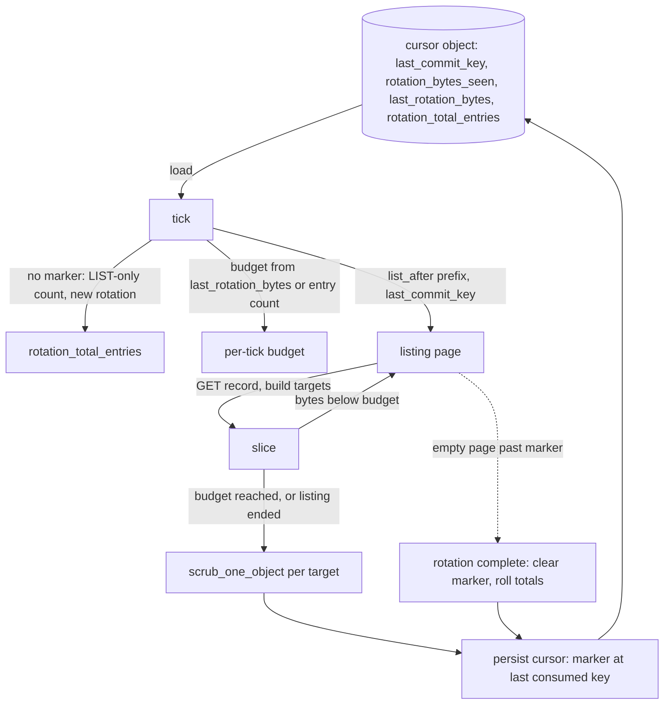

# ADR-1686: scrub resumes from a start-after marker, with no persisted corpus

Status: Accepted (2026-09-16). Amends ADR-0059 decision 1. Issue #1686.

## Context

ADR-0059 decision 1 sizes the content-tier scrubber by a rotation period `P`:
a persistent cursor "advances through the full object corpus over a
configured scrub period" and each tick reads "one bounded slice" sized to
`total corpus bytes / P`. The bound was written for the content reads. The
metadata work that finds the slice was never bounded, and today it costs a
full corpus enumeration on every tick.

`run_shard_tick` (`services/ravel-server/src/scrub.rs:528-709`) builds the
corpus from scratch each tick. It lists the whole commit shard prefix with
`list_all` and no start marker (`scrub.rs:544-554`), then issues one
`GetRange::Full` GET per surviving commit record to learn the data-object key,
size, and content hash (`scrub.rs:588-620`). Only after that does it sort the
corpus by data-object key (`scrub.rs:629`), load the cursor, size the byte
budget from the corpus total, and take the slice
(`scrub.rs:631-634`). `per_tick_byte_budget`
(`crates/ravel-maintain/src/scrub.rs:552-563`) and `advance_cursor`
(`crates/ravel-maintain/src/scrub.rs:473-545`) are pure functions over a
corpus that already exists in memory; neither can bound how it was built.

The tick is a fixed hour (`DEFAULT_SCRUB_TICK`, `scrub.rs:112`) and the
period defaults to 7 days (`scrub.rs:105`). So `--scrub-period` bounds the
content reads and nothing else: a shard with 507,000 live commit records pays
507 LIST pages and 507,000 GETs per hour before it scrubs one byte. ADR-0059's
own rejected alternative names this cost class, "`O(corpus bytes) per tick`",
as "unbounded and unreviewable at any real corpus size". The rebuild is
`O(corpus records) per tick`, which is the same shape on the metadata side.

The persisted cursor (`PersistedCursor`, `scrub.rs:726-732`) holds only
`last_object_key` and `rotation_started_unix_ns`, written with
`PutOptions::default()` under `t/<hash>/<sig>/maint/scrub/<shard>.cursor`
(`scrub.rs:717-724`). The resume point is a data-object key. Data-object keys
are not the order the store lists commit records in, which is why the corpus
must exist in full before the cursor can be applied to it.

The commit prefix is already hour-ordered and already supports a server-side
resume. `keys::commit_key` lays out
`t/<tenant_hash_hex>/<signal>/c/<shard>/<ingest_hour>/<writer_id>.<epoch>.<seq>.cmt`
(`crates/ravel-commit/src/keys.rs:233-248`) with a fixed-width
`YYYYMMDDTHH` hour string (`keys.rs:167-173`) that sorts chronologically.
`ObjectStoreBackend::list_after` (`crates/ravel-object-store/src/lib.rs:473-505`)
begins a listing strictly after a caller-supplied key, with S3 `start-after`
semantics, and `MemoryStore` implements it natively over its key range
(`crates/ravel-object-store/src/memory.rs:314-353`).
`Catalog::list_shard_hours` (`crates/ravel-catalog/src/catalog.rs:2621-2684`)
uses exactly this: it passes `commit_shard_hour_prefix(.., listing_start_hour)`
as the start-after key so the store skips the shard's earlier history
server-side (`catalog.rs:2631-2646`). The scrubber never uses it.

Issue #1686 asked for a persisted corpus beside the cursor. That is a new
control object with a decided shape and a new key, and it duplicates in
object storage what the commit prefix already holds in listing order. The
approved decision is the cheaper form: resume the listing itself.

## Decision

1. **The scrub cursor is a start-after marker over the commit shard prefix,
   and the tick lists from the marker, not from the start.** The persisted
   cursor's position becomes the last commit-record key the rotation visited
   (`last_commit_key`), in place of `last_object_key`. A tick resumes with
   `list_after(commit_shard_prefix, Some(last_commit_key))` and walks pages in
   key order, which is hour order. This is `Catalog::list_shard_hours`'s
   marker, resolved to a record inside the hour instead of the hour boundary:
   the fixed-width hour string makes any commit key a valid start-after
   position, so nothing coarser is needed. The corpus is never materialised;
   the store's listing order is the rotation order.

2. **The tick stops listing when its budget is spent.** The per-tick budget
   still comes from `per_tick_byte_budget`. The tick drains listing pages and
   GETs records in order, adding each record's targets to the slice until the
   slice's bytes reach the budget, then persists the key of the last record it
   consumed and stops. It never lists a page it will not consume. Both halves
   of the tick are therefore bounded by `--scrub-period`: the content reads by
   the byte budget, the metadata reads by the number of records whose sizes
   fill it, plus at most one partial page. A record whose GET or decode fails
   is skipped and logged exactly as today (`scrub.rs:599-604`), and the marker
   still advances past it, so one bad record cannot pin the rotation.

3. **The budget's corpus total comes from the previous rotation, and a
   rotation starts with one LIST-only count.** `per_tick_byte_budget` needs
   `total_corpus_bytes`, which the tick no longer knows up front. The cursor
   gains `rotation_bytes_seen` (sum of `object_size` over the targets this
   rotation has consumed so far) and `last_rotation_bytes` (the final sum of
   the previous completed rotation). A tick's budget is
   `per_tick_byte_budget(last_rotation_bytes, period, tick)`. When no
   completed rotation exists (a fresh bucket, or the first tick after this
   change), the rotation start performs one LIST-only pass over the shard
   prefix to count entries, stores the count as `rotation_total_entries`, and
   the first rotation runs on `ScrubBudget::MaxObjects(ceil(count * tick /
   period))` instead. That count pass is `ceil(N / page_size)` LISTs and no
   GETs, once per rotation, which is what the position gauge needs anyway
   (point 5). Every later rotation has a byte total and uses the byte budget
   ADR-0059 specifies.

4. **A rotation ends when the listing ends, and the next one starts from the
   beginning.** `list_after` returning an empty final page past the marker
   completes the rotation: the cursor clears `last_commit_key`, moves
   `rotation_bytes_seen` into `last_rotation_bytes`, and stamps
   `rotation_started_unix_ns`. Records added to hours the marker has already
   passed (a late commit into an old hour, a compaction record landing behind
   the marker) are visited on the next rotation, which is the same guarantee
   the corpus rebuild gave them: eventual coverage within one further period.
   Records deleted ahead of the marker (a swept L0 input) simply do not appear,
   exactly as `advance_cursor`'s key-comparison resume tolerates today
   (`crates/ravel-maintain/src/scrub.rs:470-472`).

5. **The position gauge counts entries.** `ravel_scrub_cursor_position`
   (ADR-0059 decision 3) becomes `entries_visited_this_rotation /
   rotation_total_entries`, where the denominator is the LIST-only count from
   point 3 and the numerator advances per commit-family record consumed. The
   gauge's meaning, "fraction of the corpus covered this rotation", is
   unchanged; its unit moves from data objects to bucket entries because
   entries are what the marker walk counts without a GET. After the corpus is
   widened to compaction and rewrite parts (issue #1686's other half, landing
   separately), one entry can cover several parts; the gauge stays a coverage
   fraction, not an object count.

6. **The walk visits every bucket-entry kind the listing returns.** The
   marker walk classifies each key with `keys::partition_bucket_entry` exactly
   as today (`scrub.rs:574-586`) and hands each kind to whatever target
   builder the corpus-widening change installs. This ADR does not decide which
   kinds produce targets; it decides that the walk is the only enumeration and
   that widening it needs no second pass.

7. **No new object, no key-layout change, no format change.** The cursor
   stays at `t/<hash>/<sig>/maint/scrub/<shard>.cursor`, still JSON, still
   `Overwrite`. The new fields are additive with serde defaults. A cursor
   written by an older build carries `last_object_key`, which the new reader
   ignores, so the first tick after an upgrade starts a fresh rotation from the
   beginning of the prefix. That is one lost partial rotation, not lost
   coverage. The ADR-0065 multi-replica clobber analysis in the module docs
   (`scrub.rs:45-67`) holds unchanged: a backward clobber re-scrubs a slice, a
   forward clobber delays one slice by at most one period.

## Rejected alternatives

- **Persist the corpus beside the cursor and rebuild it from the last known
  position (the ticket's fix).** A new object under a new key with a decided
  shape, holding one entry per live record. At 507,000 records per shard that
  is tens of megabytes written per rotation per shard, and it goes stale the
  moment compaction retires an L0 record. The commit prefix is that corpus
  already, in the order the rotation needs, and `list_after` reads it from
  any position. Persisting a copy adds a control object whose only content is
  a listing the store performs on demand.

- **Rebuild the corpus once per rotation and keep it in process memory.**
  Cuts the rebuild from once per tick to once per period, but the memory is
  one entry per live record per shard per process, held for the whole period,
  and a restart loses it and pays the rebuild again. The rebuild itself stays
  `O(corpus records)` and still runs outside the byte budget.

- **Resume at the hour boundary only (a bare `commit_shard_hour_prefix`
  marker).** Strictly coarser than the chosen form for no saving: a rotation
  that stops mid-hour would re-GET every record of that hour on the next
  tick. Since the fixed-width hour string makes a full commit key a valid
  start-after position, the exact key costs nothing extra and re-reads
  nothing.

- **Derive the corpus from the folded catalog snapshot.** The snapshot is a
  derived object rebuilt on the fold cadence; it lags sealing by
  `max_flush_lifetime + clock_skew_allowance + fold_safety_margin` and never
  names an unsealed hour. The scrubber's job is to verify what the commit
  records assert, so reading a derived summary of those records to decide
  what to verify puts the checked object between the checker and the truth.

- **Expose the tick interval as a flag.** A longer tick does not change the
  per-tick rebuild, it only runs it less often and scrubs a larger slice; a
  shorter tick multiplies the rebuild. The cost is in what a tick enumerates,
  not in how often it runs.

## Consequences

- `--scrub-period` now bounds the whole tick. Sustained metadata cost per
  shard is `records / P` GETs plus `records / (P * page_size)` LIST pages,
  plus one LIST-only count pass per rotation. The 7-day rotation completes in
  7 days on the corpus size it was sized for, which is what ADR-0059 promised
  and what the operator guide's sizing formula
  (`docs/guides/operations/maintenance.md:279-297`) already states.
- The rotation order changes from data-object key order to commit key order,
  which is ingest-hour order. Corruption is still found within one period;
  which slice finds it changes.
- The first rotation after upgrade starts from the beginning of every shard's
  prefix and runs on an entry-count budget until it completes, then switches
  to the byte budget. An operator sees `ravel_scrub_cursor_position` drop to
  zero once at upgrade. The troubleshooting row for a cursor "stuck near 0"
  (`docs/guides/operations/troubleshooting.md:281`) stays valid: a position
  that does not climb across ticks still means the budget is too small for the
  corpus.
- `ravel_scrub_cursor_position` is a fraction of entries, not of data objects.
  The observability guide's description of the gauge
  (`docs/guides/observability.md:906-927`) is updated in the implementing
  change.
- The cursor object gains fields. No new key, no new IAM grant: it stays under
  the `maint/` prefix the Maintain role already writes.
- ADR-0059 decision 1's phrase "advances through the full object corpus" now
  means "walks the commit shard prefix from a persisted marker"; ADR-0059 is
  not otherwise changed. Its statement that the cursor is kept
  "per-(tenant, signal)" was already inexact, since the shipped cursor is per
  shard (`scrub.rs:717-724`); this ADR keeps the per-shard cursor.
- Follow-up tasks:
  1. Replace the corpus rebuild in `run_shard_tick` with the marker walk,
     move the budget cut-off into the walk, and add the cursor fields
     (`services/ravel-server/src/scrub.rs`, `crates/ravel-maintain/src/scrub.rs`).
     The acceptance test runs N ticks over an unchanged corpus on a counting
     `FaultStore` and asserts ticks 2..N issue a constant number of GETs and
     LISTs, shown failing on the current tree first.
  2. Update the scrubber sections of `docs/guides/operations/maintenance.md`
     and `docs/guides/observability.md` in the same change.
  3. The corpus widening to compaction and rewrite parts, with level labels
     on the scrub counters, lands as its own task and plugs into point 6.
