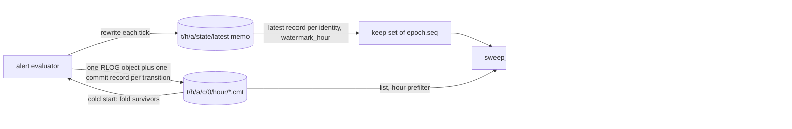

# ADR-1688: alert signal retention as a hard-scoped sweep that keeps each identity's current-state record

Status: Accepted (2026-09-16). Issue #1688. Consumes the retention contract
ADR-1294 froze for issue #1438.

## Context

`Signal::Alerts` is written like any other signal and maintained like none.
Every alert transition is one RLOG object plus one L0 commit record under
`t/<tenant_hash>/a/c/0/<hour>/`, published by the evaluator through
`ravel_commit::publish` directly (`services/ravel-server/src/alerting.rs:1256-1282`,
`ALERT_SHARD` at `:124`). `MAINTAINED_SIGNALS` holds metrics, logs and spans
only (`services/ravel-server/src/maintain.rs:122-129`), `signal_index` treats
any other signal as a caller bug (`maintain.rs:136-145`), and the alerting
module states the result: the signal "is never maintained ... so that
transition history only grows" (`alerting.rs:52-66`). The user guide says the
same to operators: "No retention rule covers the alerts signal today ... plan
for the records to stay" (`docs/guides/alerting.md:330-333`). Nothing under
`crates/` or `services/` names an alert retention path.

The alert state memo (ADR-1294, `services/ravel-server/src/alert_state_memo.rs`)
bounded the evaluator's read cost, not the corpus. It holds the latest record
per `alert_id` as of a watermark hour (`alert_state_memo.rs:86-103`) and is
rewritten each tick (`alerting.rs:831`). With a memo, a tick lists only the
hours at or after the watermark (`fold_tail`, `alerting.rs:1383-1388`). Without
one, on a cold start or any unreadable memo, the fold lists the whole prefix
and reads every record (`full_fold`, `alerting.rs:1368-1374`), at a cost that
grows with the age of the deployment. ADR-1294 was explicit that the history
"cannot be trimmed" because two readers depend on all of it: the cold-start
fold, and the `alerts` SQL table (ADR-1101), which reads the raw records.

Three facts about the existing code shape the retention design:

- The evaluator's fold refuses a retention tombstone under the alerts commit
  prefix: any `BucketEntry` other than a commit or compaction record makes it
  bail (`alerting.rs:1422-1428`). A tombstone-first retention flow, the
  ADR-0019 shape the data signals use, would stop every evaluation tick the
  moment its first tombstone landed. Deletion here must be tombstone-free.
- The query-audit shard already has a tombstone-free, hard-scoped age sweep:
  `sweep_audit_retention` (`crates/ravel-maintain/src/audit_retention.rs:112-118`)
  lists one shard's commit prefix, skips a record whose hour cannot be expired
  without a GET (`:139-143`), and deletes the commit record before its data
  object with no tombstone (`:167-173`). It runs after the data-signal loop,
  gated on unit ownership, logged rather than folded into `MaintainReport`
  (`maintain.rs:1747-1781`). Its window is
  `CompactorConfig::audit_retention_window_ns`, default 90 days
  (`crates/ravel-maintain/src/config.rs:689-696`, `:1015-1022`).
- The memo's seed-plus-tail invariant is the retention contract ADR-1294
  froze for issue #1438: "Prune only into a compact form, never by deletion",
  because an identity that vanishes makes a refire start a new lifecycle
  `generation` from nothing, and "below-watermark completeness still holds"
  (ADR-1294, "Memo growth and the retention contract"). The memo carries, per
  identity, the record's `state`, `generation`, `ts_ns` and labels
  (`alert_state_memo.rs:126-136`); the fold picks the latest record per
  identity by `(ts_ns, epoch, seq)` (`alerting.rs:1436-1443`), and the commit
  key carries that `epoch` and `seq` (`crates/ravel-commit/src/keys.rs:233-248`).

The triage recommendation the owner accepted is "the `audit_retention.rs`
shape; retention window at least the memo's cold-start fold horizon". The
cold-start fold has no horizon today, it is the whole prefix. The decision
below gives it one: the sweep deletes only what a cold-start fold does not
need, so the fold's horizon is the retention window plus one record per
identity, and the window bounds both the corpus and the cold start.

## Decision

1. **Alert retention is a hard-scoped, tombstone-free age sweep, shaped like
   `sweep_audit_retention`.** A new `sweep_alert_retention` in
   `crates/ravel-maintain` lists `commit_shard_prefix(tenant, Signal::Alerts,
   ALERT_SHARD)`, applies the same hour prefilter and the same
   expired-and-past-horizon test on the record's `max_event_ts_ns` and
   `created_unix_ns`, honours the same `LeaseCheck`, and deletes an expired
   commit record before its data object. It writes no tombstone, so the
   evaluator's fold never meets an entry kind it refuses. `Signal::Alerts`
   stays out of `MAINTAINED_SIGNALS`, `compact_bucket` is never called on it,
   and no alert record is ever compacted.

2. **The sweep keeps every identity's current-state record, whatever its
   age.** Before deleting, the sweep holds a keep set of `(epoch, seq)` pairs,
   one per identity, naming the record the memo holds as that identity's
   latest. An expired commit record whose key parses to a pair in the keep set
   is kept, and counted as kept. Everything else older than the window is
   deleted. So a firing alert that has been firing for a year keeps the one
   record that says so, and a rule deleted a year ago keeps the one
   `resolved` record that carries its last `generation`. This is ADR-1294's
   "compact form" applied at the storage layer: the compact form of an
   identity's history is its last transition.

3. **The keep set is derived from the memo, and the sweep refuses without
   one.** The driver in `services/ravel-server/src/maintain.rs` reads the
   memo with `read_alert_state_memo`, builds the keep set from its records,
   and passes it to the sweep. The memo names each identity's latest record
   only up to its `watermark_hour`; records at or after the watermark are
   inside the window by construction, because the sweep additionally requires
   `watermark_hour >= expiry floor hour`. When the memo is absent,
   undecodable, of an unsupported version, or its watermark sits below the
   expiry floor, the driver skips the sweep for that tenant this tick, logs
   it, and counts it under a new `ravel_alert_retention_skipped_total{reason}`
   family. The evaluator rewrites the memo every tick, so a live tenant's
   memo is at most one tick old; a tenant with no evaluator has no new
   transitions and loses nothing by waiting. The memo stays derived and
   advisory: a stale memo can only make the sweep keep more, never delete an
   identity's latest record, because a record the memo points at but that is
   no longer the latest is simply kept one more round.

4. **The retention window is the cold-start fold horizon.** After a sweep,
   the surviving prefix is every transition inside the window plus one
   current-state record per identity. A cold-start `full_fold` over that set
   yields the same latest-record-per-identity map as a fold over the unswept
   history, because the sweep removed only records that were not any
   identity's latest as of a watermark inside the window. The seed-plus-tail
   invariant and the `generation` continuity ADR-1294 requires both hold. The
   evaluator's fold code does not change; it reads less.

5. **Window and knob.** `CompactorConfig` gains `alert_retention_window_ns`,
   default 90 days, the same value as the audit window, exposed as
   `--alert-retention DURATION` on `ravel-server`. `0` disables the sweep and
   keeps today's behaviour. The window is an age on the transition's own
   timestamp, not on the alert's first firing.

6. **Placement and ownership.** The sweep runs in `run_tick_with_clock` after
   the query-audit block, gated on `worker.owns_unit(live_set, tenant,
   Signal::Alerts, ALERT_SHARD)` under the ADR-0065 live set, and reports the
   way the audit sweep does: a `tracing::info!` with records, data and kept
   counts, outside `MaintainReport` and outside `MaintenanceSafetyMetrics`.

## Rejected alternatives

- **Add `Signal::Alerts` to `MAINTAINED_SIGNALS` and give `compact_bucket` an
  alerts arm.** ADR-1294 already rejected this (its alternative (b)): it
  activates the compaction defects issue #1137 tracks for a signal whose read
  path, `fold_commit_entries`, skips compaction records entirely
  (`alerting.rs:1404-1421`), so compacted transitions would vanish from
  evaluation. It also enlarges every `[_; MAINTAINED_SIGNALS.len()]` array and
  runs the ADR-0019 tombstone flow, whose first tombstone the fold refuses.

- **The ADR-0019 tombstone-then-delete retention flow.** The fold bails on a
  tombstone under the alerts prefix (`alerting.rs:1422-1428`). Teaching it to
  skip tombstones is possible, but tombstones exist to make bucket-wide
  exclusion visible to the catalog resolver, and alerts are not folded into
  the catalog (ADR-1101). A tombstone would be a marker for a reader that
  does not exist.

- **Delete every expired record, with no keep set, and bound the cold-start
  fold to the window.** Simpler, and it breaks ADR-1294's frozen contract:
  an identity whose last transition is older than the window disappears, a
  refire starts at `generation` 1, and a long-firing alert reads as inactive
  after a cold start and re-fires with a fresh `since`. ADR-1294 rejected a
  bounded lookback for exactly this reason (its alternative (d): "current
  state has no bounded time horizon").

- **Have the sweep fold the expired range itself to find each identity's
  latest record.** Correct without a memo, and it is the `R x W` read the
  memo exists to avoid: one data GET per expired record, on every sweep,
  until the record is gone. Reading the memo is one GET and it is already
  correct for this question by ADR-1294's invariant.

- **A retention default of "never", with the sweep opt-in.** The ticket is
  that the corpus grows without bound; an opt-in sweep leaves every existing
  deployment growing. The default matches the audit window an operator already
  runs with, and `0` is the opt-out for anyone who relied on the guide's
  "plan for the records to stay".

## Consequences

- For an operator: after upgrade the first sweep deletes every alert
  transition older than 90 days except each identity's current-state record.
  The `alerts` SQL table then answers for the window plus current states, not
  for all history. An operator who needs longer history sets
  `--alert-retention` before upgrading, or `0` to keep today's behaviour. The
  guide's "plan for the records to stay" paragraph is replaced in the
  implementing change, and the CHANGELOG entry names the default.
- The alert corpus is bounded by transitions per window plus identities, the
  same bound ADR-1294 states for the memo. A cold-start fold reads that bound,
  not the deployment's age.
- A tenant whose memo is missing or stale is not swept, and
  `ravel_alert_retention_skipped_total{reason}` says so. A sustained nonzero
  rate for one tenant means its evaluator is not running or cannot write its
  memo; the remedy is on the evaluator, not the sweep.
- The sweep depends on the memo's completeness invariant. ADR-1294 already
  makes the evaluator correct only under that invariant; this ADR adds a
  deleter to its consumers, which raises the cost of breaking it from a wrong
  evaluation to a lost current-state record. Issue #1438's pruning must keep
  the pruned identity's `(epoch, seq)` in the compact form, or release its
  kept record deliberately, so the keep set stays derivable from the memo.
- The audit window still has no flag (ADR-0062 promised one; the server
  builds `CompactorConfig` with `..Default::default()` at
  `services/ravel-server/src/main.rs:314-320`). This ADR adds the alert flag
  only and reports the audit gap rather than fixing it here.
- Follow-up tasks:
  1. `sweep_alert_retention` in `crates/ravel-maintain` taking a keep set,
     with `alert_retention_window_ns` on `CompactorConfig`; the acceptance
     test seeds records across expired hours on a `MemoryStore`, including an
     expired current-state record, runs the tick, and asserts the expired
     non-current records and their data objects are gone, the current-state
     record and the live hour survive, and the same run on the current tree
     deletes nothing.
  2. The driver in `services/ravel-server/src/maintain.rs`: memo read, keep
     set, watermark check, skip counter, ownership gate, and the
     `--alert-retention` flag.
  3. A cold-start test: sweep, drop the memo, fold, and assert the folded
     map equals the pre-sweep fold for every identity.
  4. `docs/guides/alerting.md` "Cost and retention", `docs/deletion-and-gc.md`,
     and the flags reference, in the same change.
