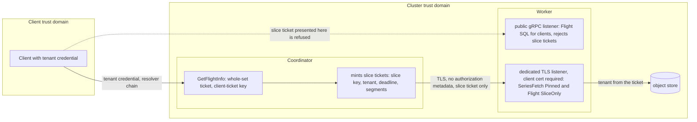

# ADR-1689: Flight SQL slice capability and fragment listener consolidation

Status: Accepted (2026-09-16). Amends ADR-0071 (the "dedicated fragment
listener and per-tenant fragment capabilities" amendment, decisions 1 to 3).
Issues #1689 and #1690.

## Context

ADR-0071 has two distributed lanes. The PromQL lane dials a worker's
`SeriesFetch` surface; the SQL lane dials a worker's Flight `DoGet`. The
amendment moved the PromQL lane onto a dedicated TLS listener with a
per-tenant, per-query, expiring capability. The SQL lane did not move, and
it still authenticates each slice with the client's own credential.

What the code does today:

- The coordinator's `FlightWorkerSliceClient` holds the inbound request's
  gRPC metadata, which carries the tenant bearer token
  (`crates/ravel-sql/src/distributed.rs:458-464`), and installs it verbatim
  on every worker `DoGet` (`crates/ravel-sql/src/distributed.rs:529`). The
  service constructs the client with `request.metadata().clone()`
  (`crates/ravel-sql/src/flight/service.rs:563`).
- The worker resolves the tenant from that metadata through `FlightAuth`
  and only then compares it with the ticket's tenant
  (`crates/ravel-sql/src/flight/service.rs:436-452`). A slice ticket is
  recognized by `slice_count > 1`
  (`crates/ravel-sql/src/flight/service.rs:487`).
- The SQL lane dials `http://{flight_sql_endpoint}`, the public gRPC
  listener, in plaintext (`services/ravel-server/src/sql_distrib.rs:85-90`).
  The fix for #1296 chose that route because the dedicated fragment
  listener serves no Flight service, so dialing it failed on scheme and on
  service. `QueryWorkerRecord` gained `flight_sql_endpoint` for this
  (`crates/ravel-fleet/src/query_workers.rs:138-143`).
- The SQL ticket key is derived from the first fragment key
  (`services/ravel-server/src/config.rs:3137-3142`,
  `services/ravel-server/src/sql_distrib.rs:150-155`). One key file covers
  both lanes.
- Without `--fragment-listener`, the public gRPC listener mounts the
  fragment service in the `Combined` role
  (`services/ravel-server/src/lib.rs:3030-3038`,
  `services/ravel-server/src/distrib.rs:445-460`). In that layout the
  coordinator dials plaintext (`services/ravel-server/src/distrib.rs:1101`),
  so the fragment capability travels in the clear.
- The dedicated listener presents a server identity and asks for no client
  certificate (`services/ravel-server/src/lib.rs:3088`). The coordinator
  pins the CA and the fixed server name `ravel-fragment`
  (`services/ravel-server/src/distrib.rs:438`, `:1114-1121`).

The slice ticket already has most of a capability's shape. It is a
keyed-BLAKE3 MAC over a fixed layout that carries the tenant, an absolute
`deadline_ns`, the slice index and count, and the exact segment set
(`crates/ravel-sql/src/flight_ticket.rs:63-100`). The worker refuses an
expired ticket (`crates/ravel-sql/src/flight_ticket.rs:674-676`). What it
lacks is a key of its own, a listener of its own, and a worker that trusts
the ticket's tenant instead of a forwarded credential.

Two pieces of #1690 are already dispatched and are not decided again here.
Task T8a requires client certificates on the dedicated listener and makes
the coordinator present its own identity. Task T10c renders the
NetworkPolicy that restricts the fragment port to cluster pods. This ADR
builds on both.

## Decision

1. **SQL slice `DoGet` moves to the dedicated fragment listener.** The
   dedicated listener mounts the Flight service beside `SeriesFetch`, in a
   `SliceOnly` role: it accepts `DoGet` carrying a slice ticket
   (`slice_count > 1`) and answers every other Flight and Flight SQL method
   with `permission_denied`. The public gRPC listener keeps the client
   Flight SQL surface and, once a dedicated listener is configured,
   rejects a slice ticket outright, the mirror of `PublicFederation`
   rejecting `Pinned` (`services/ravel-server/src/distrib.rs:878-896`).
   The SQL lane dials `fragment_endpoint` over the same pinned-CA TLS
   channel configuration the PromQL lane builds. `FlightWorkerSliceClient`
   takes an optional `tonic::transport::ClientTlsConfig` built by the
   server, so ravel-sql states what it needs and the server supplies it,
   the same seam `WorkerEndpoints` already uses. `flight_sql_endpoint`
   leaves `QueryWorkerRecord`; the field existed only because the dedicated
   listener served no Flight service.

2. **The slice ticket is the capability, under its own key.** No client
   credential is forwarded. The claims are the ticket's existing fields:
   tenant, `deadline_ns` as the expiry, slice index and count, and the
   segment set. The key comes from a new `--sql-ticket-key-file`, with the
   same file shape and rotation rule as `--fragment-key-file`: the first
   key mints, all keys verify (`parse_fragment_keys`,
   `services/ravel-server/src/config.rs:5137`, is reused). Two MAC keys are
   derived from each file key with distinct `blake3::derive_key` contexts,
   the pattern `derive_ticket_key` already uses
   (`crates/ravel-sql/src/flight_ticket.rs:284-300`): one for client
   whole-set tickets, one for slice capabilities. A ticket minted for one
   surface fails the MAC on the other by construction. The derivation of
   the SQL secret from the first fragment key is deleted. The ticket layout
   is unchanged, so `RFT1` keeps its version.

   Worker-side verification is stateless: MAC under any configured SQL key,
   `is_expired` against the injected clock, `slice_count > 1`, and the
   listener role. The tenant the slice executes under is the ticket's
   tenant. `FlightAuth::tenant` is not called on this path; there is no
   metadata to resolve. Rejects are typed and counted with a closed reason
   label (missing, bad MAC, expired, wrong surface), matching the fragment
   capability counter.

3. **`PROTOCOL_VERSION` moves 4 to 5**
   (`crates/ravel-query/src/distrib/codec.rs:67`). A v5 worker's public
   listener rejects slice tickets and its record carries no
   `flight_sql_endpoint`; a v4 coordinator must never dial it. The routing
   rule from the ADR-0071 amendment handles both directions at zero round
   trips: a version-skewed worker is dropped at routing time and its slices
   run coordinator-local. No frozen persistent format changes. The ticket
   is an ephemeral MAC'd blob (`crates/ravel-sql/src/flight_ticket.rs:45`),
   `QueryWorkerRecord` is transient heartbeat state, and no proto under
   `proto/` changes. The format-change procedure does not apply and no
   migration class is assigned.

4. **`FragmentListenerRole::Combined` is removed one release after the
   operator renders the dedicated listener.** Release A ships this ADR's
   implementation: a process on `--distributed-query` without
   `--fragment-listener` still selects `Combined`, and startup logs one
   warning naming release B and the flags it will require. In the same
   release the operator renders, for every `RavelCluster` with distributed
   query on, the dedicated listener, the certificate Secret mounts, the SQL
   ticket key mount, and the T10c NetworkPolicy. Release B, the next release
   after that operator rendering ships, deletes `Combined`: `Cli::validate`
   refuses `--distributed-query` without `--fragment-listener` and
   `--sql-ticket-key-file`, beside the existing pairing checks
   (`services/ravel-server/src/config.rs:4556-4570`); the public gRPC
   listener's fragment role is always `PublicFederation`; and the plaintext
   dial (`client_tls: None`) is deleted, so every fragment and slice dial is
   TLS with a client certificate.

## Rejected alternatives

- **Keep slice `DoGet` on the public listener and only replace the
  credential.** This is where the #1296 fix left the lane. The capability
  would still travel in plaintext, a public-surface incident would still
  reach intra-cluster reads, and the port could not get a NetworkPolicy
  stricter than the public one. ADR-0071 amendment rejected alternative 6
  lost on the same grounds.
- **Reuse the fragment key and `FragmentClaims` as the SQL capability, sent
  as metadata beside the ticket.** The fragment claims bind `query_id` and
  `signal`; the slice ticket already binds tenant, expiry, and the exact
  segment set under a MAC. Two credentials on one request doubles the
  verification surface, and #1690 asks that one key file stop covering
  both lanes.
- **A fifth listener for SQL slices.** Another port, certificate, and
  policy for the same trust boundary. Both lanes carry a cluster-internal,
  per-tenant, expiring capability from a coordinator to a worker under one
  CA; one listener is the boundary.
- **Forward the client credential, but over TLS.** The long-lived token
  would still land on every worker that serves a slice, and a worker would
  hold a credential far wider than the one slice it serves. The #1689
  effect stands with the wire encrypted.
- **Keep `Combined` for zero-configuration deployments.** It is the
  plaintext path #1690 describes, and a default that silently downgrades
  the posture contradicts ADR-0050's by-construction stance. One warning
  release and then a startup refusal is the bounded cost.
- **Add `sql_slice_endpoint` to the record without a version bump.** A v4
  coordinator would dial the field it knows on a v5 worker whose public
  listener now refuses slice tickets. The query would still fall back
  locally, but only after one failed round trip per slice. The version
  filter costs zero round trips.

## Consequences

- The credential on a slice `DoGet` names one tenant, one segment set, and
  one deadline, and the long-lived client token never leaves the
  coordinator. The mint key for slices is the SQL ticket key, held under
  the same custody posture as the fragment key (ADR-0072).
- For an operator: `--sql-ticket-key-file` is a new flag, required with
  `--distributed-query` from release B, optional before it. It also enables
  cross-node redemption of client whole-set tickets behind a balancer,
  which the per-process random key never allowed. From release B,
  `--distributed-query` requires the dedicated listener and its
  certificates. The flags reference, the distributed-query guide, and the
  operations guide change in the same commit as each release's code.
- The client-visible Flight SQL surface is unchanged: one endpoint, one
  whole-set ticket, redeemed with the client's credential on the public
  listener.
- A mixed v4/v5 fleet loses parallelism for one rolling deploy, never
  correctness or availability, exactly as the ADR-0071 amendment's skew
  rule already provides.
- ADR-0071's statement that the dedicated listener "serves `Pinned` only"
  now reads "serves `Pinned` fragment fetches and SQL slice `DoGet` only".
  The amendment's decisions on TLS, CA pinning, capability shape for the
  PromQL lane, and the skew rule are unchanged.
- Follow-up work, as tasks:
  1. ravel-sql: drop `credentials` from `FlightWorkerSliceClient`, accept a
     client TLS configuration, derive the two keys per file key, gate the
     worker path on listener role and `slice_count`, and add the
     acceptance test
     `flight_distributed::worker_do_get_carries_no_authorization_and_resolves_ticket_tenant`
     plus a sibling that refuses a bad or expired slice ticket.
  2. ravel-server: mount the Flight service on the dedicated listener in
     the `SliceOnly` role, dial `fragment_endpoint` over TLS from the SQL
     lane, remove `flight_sql_endpoint`, bump `PROTOCOL_VERSION`, add
     `--sql-ticket-key-file`, log the release A warning, and update the
     docs named above.
  3. ravel-operator: render the dedicated listener, its Secret mounts, and
     the SQL ticket key for every distributed-query `RavelCluster`, after
     T10c lands.
  4. Release B: delete `Combined`, add the `Cli::validate` refusals, and
     delete the plaintext dial path, with the guide's "without the flag"
     paragraph removed in the same commit.
