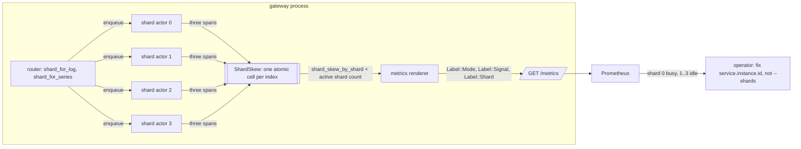

# ADR-1692: Per-shard ingest skew metrics without a tenant label

Status: Accepted (2026-09-16). Issue #1692. Amends ADR-0044 rejected
alternative 6 and the permitted-label list in ADR-0044 section 4.

## Context

ADR-0044 rejected per-shard metrics (rejected alternative 6): "shard count
times tenant count times operation count is unbounded in the dimension Ravel
controls least." Section 4 of the same ADR fixes the label allowlist and says
"`shard` is not a label." The renderer repeats that rule in its module
documentation (services/ravel-server/src/metrics.rs:33-36) and enforces the
allowlist through the closed `Label` enum (metrics.rs:241-283, :394-412).

The per-shard accounting the rule keeps off the scrape already exists. Issue
#865 added `ShardSkew`, one lock-free cell per shard index
(crates/ravel-ingest/src/metrics.rs:364-398), with three spans per shard:
on-actor merge time, flush-permit wait, and off-actor flush time
(metrics.rs:529-572). The metrics and log pipelines record all three and
expose `shard_skew_by_shard` (metrics.rs:769, log_metrics.rs:396). The span
pipeline carries the same accumulator and accessor
(crates/ravel-ingest/src/span_metrics.rs:141-146, :250) but records only the
permit-wait span; the ticket's claim that spans are uncovered is stale in
that respect and correct about the other two spans. Nothing under `services/`
reads any of it, and docs/ingest.md:1193-1197 names the scrape wire-up as a
follow-up.

The condition the dimension exists to show is shard pinning. A log stream id
is the hash of the resource attributes plus scope
(crates/ravel-types/src/logstream.rs:3-5), and `shard_for_log` takes its
leading eight bytes modulo the shard count
(crates/ravel-types/src/lib.rs:512-517). A tenant whose collector sets one
resource occupies one shard actor per replica, and that actor flushes one
object at a time under `max_inflight_flushes = 1` (docs/ingest.md:979).
Raising `--shards` moves the stream to a different single shard. Without a
per-shard series the operator sees a full channel and a shed request gate
and has no figure that says three of four shards are idle.

The cardinality objection was about the product. Shard count alone is a
number the operator chooses: `shard_count` defaults to 4
(crates/ravel-ingest/src/config.rs:415), `--shards` sets it
(services/ravel-server/src/config.rs:349), and `MAX_SHARD_COUNT` caps it at
10,000 (crates/ravel-catalog/src/provisioning.rs:416). The
`ShardSkew` slice is already sized to that cap
(crates/ravel-ingest/src/metrics.rs:59-71).

## Decision

1. **ADR-0044 rejected alternative 6 is narrowed, not reversed.** A
   per-shard family is permitted when it carries no tenant label and no
   operation label. Its cardinality per process is shard count times signal
   count times the family's sample count, and shard count is set by the
   operator with `--shards`. The rejected product, shard times tenant times
   operation, stays rejected. `shard` is never combined with `tenant_hash`
   on any sample, whatever `--metrics-tenant-labels` is set to.

2. **`Label::Shard(u32)` joins the closed `Label` enum**, rendering the key
   `shard` with the decimal shard index as its value. The payload is a
   `u32` bounded by `MAX_SHARD_COUNT`, so the closed-payload rule holds: no
   `String` or `&str` reaches the exposition through it, and adding the
   variant is a compile error at every exhaustive match, as ADR-0044
   section 4 requires. The permitted-label list in that section gains
   `shard` as its ninth key, after the `reason` the ADR-0051 amendment
   added, and the renderer's module documentation
   replaces "`shard` is deliberately absent" with the narrowed rule.

3. **One family, six samples per shard, labelled `mode`, `signal`,
   `shard`.** From `ShardSkewStats` on each pipeline:
   `ravel_ingest_shard_messages_enqueued_total` and
   `ravel_ingest_shard_messages_processed_total` (counters),
   `ravel_ingest_shard_queue_depth` (gauge), and
   `ravel_ingest_shard_on_actor_seconds_total`,
   `ravel_ingest_shard_flush_permit_wait_seconds_total`, and
   `ravel_ingest_shard_off_actor_seconds_total` (counters, nanoseconds
   rendered as seconds). `flush_permit_wait` keeps the meaning ADR-1642 gave
   it: a sum over concurrently waiting tasks that can exceed wall time.

4. **Every configured shard renders, including idle ones.** The renderer
   emits a sample for each index below the router's current active shard
   count, plus any index above it that has recorded activity (a retiring
   generation under ADR-0052). `shard_skew_by_shard` omits shards with no
   activity; the renderer fills them with zeros. An idle shard is the
   finding this family exists to show, and a series that appears only once
   a shard has worked cannot show it.
   (See the shard-count amendment below: the count used is the configured
   default, not a per-tenant active count.)

5. **The span pipeline records the two missing spans.** `span_shard.rs`
   gains the on-actor and off-actor recording the other two actors already
   have, so all three pipelines render the same six samples.
   (See the shard-count amendment below: the span router also lacked the
   enqueue count.)

6. **No cap on the rendered shard count.** The exposition grows linearly
   with `--shards`, and the ADR-0075 request budget already scales with the
   same number. A truncated family would hide exactly the shard an operator
   is looking for, so none is offered; the observability guide states the
   per-scrape size as `6 * signals * shards` series.

## Rejected alternatives

- **A shard times tenant family.** This is what alternative 6 rejected, and
  it stays rejected: the tenant dimension is the one Ravel does not control,
  and a per-tenant series on an unauthenticated scrape is separately gated.
- **A debug endpoint instead of the scrape**, as alternative 6 suggested.
  The pinning condition is sustained and fleet-wide; diagnosing it needs
  history across replicas and an alert, which a point-in-time debug page
  has neither of. No such endpoint exists today either.
- **Aggregate figures only, such as a max-over-min skew ratio per
  signal.** A ratio says the shards are uneven and not which one is hot,
  and a hot shard plus three idle ones reads the same as two moderate ones.
  Any ratio an operator wants is one PromQL expression over the per-shard
  family.
- **Top-K shards.** K is a second policy on a dimension the operator already
  bounds with one flag, and the idle shards it would drop are the signal.
- **Render only shards with recorded activity.** It hides idle shards,
  which is the finding.
- **A `String` label value.** It breaks the closed-payload rule that makes
  the allowlist a type-system property rather than a convention.

## Consequences

- ADR-0044's permitted-label list, rejected alternative 6, and the
  renderer's module documentation change together, so the code and the ADR
  never disagree about whether `shard` is a label. The rule that survives
  is narrower and exact: a per-shard family carries no tenant and no
  operation dimension.
- Each gateway or `all` process adds `6 * signals * shards` series to its
  scrape, 72 at the defaults. The count is stated in the observability
  guide next to the flag that sets it.
- The operator diagnosis changes from raising `--shards` to fixing the
  collector: the per-shard series shows the pinned shard, and the
  precondition paragraph T7f adds to docs/guides/ingest.md names the
  resource attribute that must vary per pod, such as `service.instance.id`.
- The family adds no per-tenant information to an unauthenticated route.
  The tenant-label gate and its allowlist are untouched.
- Follow-up work, as tasks:
  1. ravel-server: `Label::Shard`, the family in `render_ingest_family`
     fed from all three routers' `shard_skew_by_shard` and active shard
     count, the module-documentation update, and the acceptance test the
     ticket names: a four-shard log router, one batch written, and exactly
     four `shard="0"` to `shard="3"` samples per metric name rendered.
  2. ravel-ingest: on-actor and off-actor recording in `span_shard.rs`,
     with the span-pipeline test mirroring the existing metrics-pipeline
     exact-nanosecond assertion.
  3. docs: the ADR-0044 amendment paragraph, docs/ingest.md:1183-1197,
     docs/guides/observability.md (family, size, and a pinned-shard alert
     example), and the docs/guides/ingest.md precondition paragraph on top
     of T7f's text.

## Amendment (2026-09-26): the rendered shard count is the configured default

<!-- amendment-applies: sections="Decision" pointer="shard-count amendment" -->

Decision 4 said the renderer zero-fills every index below "the router's
current active shard count". Each router's `shard_count()` returns the
configured default (`--shards`), not a per-tenant live count: the live count
differs per tenant and sits in each tenant's cached generation view, and
reading it at scrape time would mean walking every tenant's view under new
locking on the render path. So the family zero-fills shards 0 to
`shard_count - 1` of the configured default. A tenant resharded above the
default renders its extra shard indices only once they have recorded
activity, and one shard index sums every generation's actor at that index.
Decision 6's per-scrape size of `6 * signals * shards` series therefore holds
only while no tenant's shard count differs from the configured one.

Decision 5 said the span pipeline lacked only the on-actor and off-actor
spans. It also lacked the enqueue count, so for spans
`ravel_ingest_shard_messages_enqueued_total` and `ravel_ingest_shard_queue_depth`
always read 0. `span_router.rs` now records an enqueue after each successful
send into a shard channel, at the same point the metrics and log routers do,
and all three pipelines render the same six samples.
