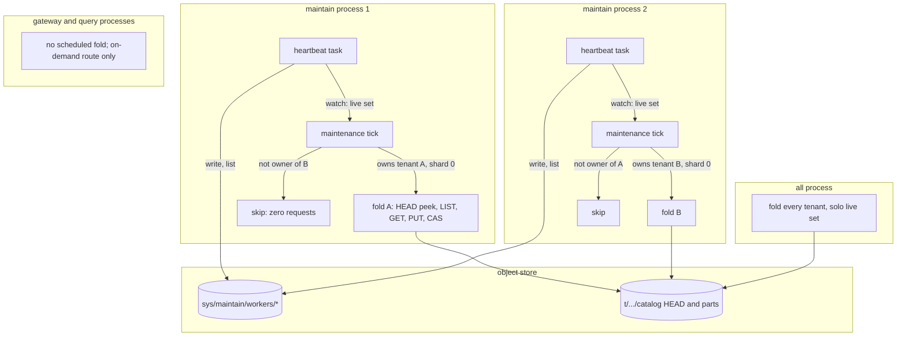

# ADR-1693: Partitioned catalog fold ownership

Status: Accepted (2026-09-16). Issue #1693. Amends ADR-0065 decision 2 (the
ownership rule now also gates the ADR-0020 catalog fold) and changes which
modes run the scheduled fold.

## Context

Maintenance work is partitioned across processes. Each maintain-role process
writes a heartbeat under `sys/maintain/workers/<process_id>`
(crates/ravel-fleet/src/worker_set.rs:105-112), lists its siblings on the
same cadence, and owns a `(tenant, signal, shard)` unit when it wins the
rendezvous hash over the live set (worker_set.rs:152-164; ADR-0065 decisions
1 and 2). The maintenance tick gates every per-unit step on
`WorkerSet::owns_unit` (services/ravel-server/src/maintain.rs:1303), and the
per-signal sweeps are gated on ownership of shard 0 of the pair
(maintain.rs:1647-1648, :1691).

The catalog fold is not partitioned. `fold::spawn` starts one loop per
signal in every mode except maintain (services/ravel-server/src/lib.rs:2796,
:2837-2843; docs/guides/operations/maintenance.md:12-13). Each tick
re-discovers every tenant and calls `run_tenant_tick` for each one
(services/ravel-server/src/fold.rs:233-244). The tick peeks at HEAD first
and skips a fresh one, which keeps a routine tick at two GETs per tenant and
signal. At every hourly seal boundary every process performs the whole fold:
the bucket LISTs, the commit-record GETs, and the part PUTs, and then all but
one lose the HEAD CAS (crates/ravel-catalog/src/fold.rs:1929-1931), which
comes after the work. Results stay correct, because parts are
content-addressed and a duplicate PUT is an idempotent `AlreadyExists`
(docs/catalog-and-mvcc.md:492-493). Cost scales with process count instead
of tenant count: 30 processes over 1,000 tenants and 3 signals cost 180,000
GETs per five minutes at rest and 29 discarded folds per pair per hour.

`WorkerSet::new` takes no key prefix and `heartbeat_key` is fixed
(worker_set.rs:110-112, :274-288), so "a fold-role heartbeat prefix" is a
new `sys/` namespace, and the object key layout is a frozen contract. The
only live set that exists is the maintain one. The maintain process already
carries a `WorkerSet` built at startup in every mode
(services/ravel-server/src/lib.rs:2789-2794) and a heartbeat task that
publishes each fresh live set over a `watch` channel
(services/ravel-server/src/maintain.rs:893-950).

Two other facts shape the choice. The quickstart runs one `--mode all`
process and no maintain process (deploy/docker-compose/ravel.yml:80-82;
maintenance.md:3-10), and `all` is defined as gateway plus query in one
process (docs/architecture.md:29-33). The fold-liveness alert aggregates
`max by (signal)` across the fleet precisely because a replica whose peers
fold on schedule does no folding of its own
(docs/guides/observability.md:303-349). T11e hands hours the sweep held on a
named snapshot to the next fold through an in-process channel, which assumes
the sweep and the fold for a unit run in the same process.

## Decision

1. **The scheduled fold runs in the maintain role, partitioned by the
   existing maintain live set.** `fold::spawn` runs in `Mode::Maintain`. In
   each tick, after discovery, a `(tenant, signal)` pair is folded only when
   `worker.owns_unit(live_set, tenant, signal, 0)` holds, using the process's
   one `WorkerSet` and the live set the maintenance heartbeat task publishes.
   Shard 0 is the unit key, the same convention the per-signal sweeps use,
   so the process that sweeps a pair's catalog objects is the process that
   folds it. The ownership check comes before the HEAD freshness peek, so an
   unowned pair costs zero requests. No new heartbeat prefix and no second
   membership identity exist.

2. **Gateway and query processes stop running the scheduled fold.** They
   keep the on-demand `POST /api/v1/admin/fold` route where it is mounted
   today (services/ravel-server/src/lib.rs:2562-2570), because that route is
   an operator trigger behind the query credential, not scheduled traffic.
   `ravel-cli catalog fold` is unchanged.

3. **`Mode::All` keeps folding, unpartitioned.** `all` is the single-process
   shape, and it runs no maintenance loop and writes no heartbeat. It folds
   every discovered tenant under its solo live set, which is today's
   behavior exactly. A deployment that runs several `all` replicas keeps
   today's duplicated fold cost, and the maintenance guide says so.

4. **A deployment with no maintain process and no `all` process never
   folds.** That is stated, not softened. Correctness is unaffected: resolve
   falls back to listing (maintenance.md:64-73). Query cost grows with the
   unsealed span, and the fold-liveness alert fires, which is the correct
   signal for a fleet that was told to fold and has nobody to do it.

5. **The fold liveness family renders only where the scheduled fold runs.**
   `ravel_catalog_fold_last_success_timestamp_seconds` is rendered in
   `maintain` and `all`. A gateway or query process no longer renders a
   permanently-zero series. The alert rule's `max by (signal)` aggregation
   already tolerates replicas that do not fold, so it needs no change (this
   sentence is corrected by the 2026-09-26 supervision amendment below); its
   comment about "an intentionally maintain-only fleet" that never folds
   becomes stale and is corrected.

6. **The fold in the maintain process reads the maintain context's injected
   clock**, not a fresh `SystemClock` (fold.rs:265 today), so a test that
   drives membership and folding advances one clock.

## Rejected alternatives

- **A new fold-role heartbeat prefix that every gateway and query process
  writes.** It adds a `sys/` namespace to the frozen key layout, a PUT and a
  LIST per process per heartbeat interval across the whole fleet, and a
  second membership identity per process. The maintain live set already
  exists and already partitions per-tenant catalog work.
- **Gateway and query processes join the maintain live set.** Rendezvous
  ownership would then assign compaction and retention units to processes
  that run no maintenance loop. Those units would starve permanently, which
  is ADR-0065's stuck-owner hazard made structural.
- **Keep every process folding and let jitter pick a winner.** The CAS comes
  after the LISTs, GETs, and PUTs, so every loser still pays the whole fold.
  Jitter changes who wins, not what it costs.
- **Leader election for the fold.** ADR-0065 rejected a leader for
  maintenance (its rejected alternative 2) because a leader lease is a
  single point of stall and a second protocol beside membership. The fold
  is smaller than maintenance, not different in kind.
- **Static partitioning by replica ordinal without a membership view.** A
  dead ordinal's tenants are folded by nobody until a human notices. The
  live set exists so that takeover is automatic.
- **Stop folding in `all` too, and require a maintain process everywhere.**
  It breaks the quickstart and every single-process deployment for no cost
  saving: one process cannot duplicate its own work.

## Consequences

- Fold cost scales with tenant count. At rest each pair costs two GETs per
  tick on one process; at a seal boundary each pair is folded once. The
  worked example drops from 180,000 GETs per five minutes to 6,000, and
  from 30 folds per pair per hour to 1.
- Fold latency is bounded by maintain capacity. The fold now shares the
  maintain process's discovery cadence and its `unit_concurrency`
  (services/ravel-server/src/lib.rs:2793), so a fleet with one maintain
  replica folds all tenants from that one process. Scaling folding means
  scaling the maintain Deployment, whose replica count the operator already
  exposes (deploy/k8s/operator/crd.yaml:348).
- During a membership transition, at most `3 * H` plus one heartbeat, two
  maintain processes may both fold one pair. The HEAD CAS serializes them
  and the duplicate parts are content-addressed, so the overlap costs bounded
  duplicate reads, the same bound ADR-0065 states for every other unit.
- Operator-visible changes: the operator's fold tuning moves from the
  gateway tier to the maintain tier (`--disable-fold`,
  `--fold-interval-secs`; services/ravel-operator/src/crd.rs:174, :530;
  reconcile.rs:823). Setting either on a gateway or query process becomes a
  startup error, not a silent no-op. The maintenance guide's opening
  paragraph and the troubleshooting table gain the rule: a fleet with no
  maintain process and no `all` process does not fold, and queries pay
  listing cost for the whole unsealed span.
- T11e's refold channel holds by construction: the sweep that finds a
  named-snapshot block and the fold that reconciles it run in the same
  maintain process for the same unit key.
- ADR-0065 decision 2's list of ownership-gated work gains the fold, keyed
  on shard 0 of the pair. docs/catalog-and-mvcc.md records the ownership
  rule in its fold section.
- Partitioning makes a dead fold loop invisible to the fold-liveness alert,
  which it was not before. The 2026-09-26 supervision amendment below adds
  the loop supervision and the restart alert that close that gap.
- Follow-up work, as tasks:
  1. ravel-server: pass the maintain `WorkerSet`, the live-set `watch`
     receiver, and the injected clock into `fold::spawn`; gate
     `run_tenant_tick` on `owns_unit(.., 0)` before the HEAD peek; spawn
     the fold in `Mode::Maintain` and `Mode::All` only; refuse the fold flags
     in other modes. Land the acceptance test the ticket names: two
     `Catalog` instances with distinct process ids over one `MemoryStore`
     behind a `FaultStore`, a live set of two, one tick each, exactly one
     fold, and zero LIST calls from the non-owner.
  2. ravel-server metrics: render the fold family in `maintain` and `all`
     only; update the render tests that pin `mode="all"`.
  3. ravel-operator: move the `fold` field to the maintain tier with a CRD
     description update; reject it on the gateway tier.
  4. docs: maintenance.md (lines 3-13 and the fold section),
     docs/catalog-and-mvcc.md fold section, docs/architecture.md:29-33,
     docs/guides/observability.md:297-301 and the ADR-0065 decision 2
     amendment paragraph.

## Amendment (2026-09-26): a partitioned fold needs loop supervision and a restart alert

<!-- amendment-applies: sections="Decision|Consequences" pointer="2026-09-26 supervision amendment" -->
<!-- amendment-supersedes: phrase="The alert rule's `max by (signal)` aggregation already tolerates replicas that do not fold, so it needs no change" pointer="2026-09-26 supervision amendment" -->

Decision 5 states that the fold-stalled alert needs no change. That is false
under decision 1, and the reason is the partition itself.

Before the fold was partitioned, every folding process folded every tenant. A
panic in one signal's loop was a fleet-wide fault of that signal: the loop was
a plain spawned task with no supervisor, every copy of it died the same way,
every process's gauge for that signal went stale, and
`RavelCatalogFoldStalled` fired. The alert really did need no change, because
the failure it covered was fleet-wide by construction.

Under decision 1 it is not. A maintain replica whose loop for one signal
panics keeps heartbeating, because the heartbeat is the maintenance loop's,
not the fold's. It therefore stays in the live set, no peer wins the
rendezvous hash for its pairs, and those pairs are folded by nobody.
`ravel_catalog_fold_last_success_timestamp_seconds` moves only on a successful
`Catalog::fold`, so that replica's own gauge goes stale, but the alert
aggregates `max by (signal)` across the fleet precisely so that a replica
which folds nothing does not page. The peers' fresh gauges hold the maximum
under the threshold and nothing fires, for as long as the replica stays up.
Decision 4 stays correct: a fleet with no folding process at all still fires
through the `absent()` arm. What is uncovered is the mixed state, one replica
down for one signal inside an otherwise healthy fleet, which the partition
created.

Two changes, neither of which touches the ownership rule:

1. **Each signal's fold loop runs under a supervisor.** The tick body is
   guarded, a caught panic ends that attempt rather than the task, and a fresh
   attempt is spawned after a bounded backoff that doubles from 1 s to 60 s
   and resets once an attempt completes a tick. Each restart is logged at
   error level with the signal and counted on a new counter,
   `ravel_catalog_fold_loop_restarts_total{signal}`, rendered beside the
   existing fold families and under the same gate as the liveness gauge:
   `Mode::runs_scheduled_fold`, since a loop that was never scheduled cannot be
   restarted. Shutdown still stops the loop and never restarts it, and a drain
   arriving inside a backoff is observed at once rather than held behind it.
   This mirrors what ADR-0065's maintenance loop already does
   (`ravel_maintain_loop_panics_total`); the fold simply never got it.

2. **A crash loop is alerted on.** `RavelCatalogFoldLoopCrashLooping` fires on
   `increase(ravel_catalog_fold_loop_restarts_total[15m]) > 3` held for 15m,
   at `warning`. It is deliberately unaggregated: the condition is about one
   replica, and the whole defect above is a peer's health averaging that
   replica away.

A single transient panic is not the target of either change. It costs one
skipped tick and restarts promptly, which is what the backoff reset is for.
The target is the loop that cannot make progress, which the restart counter
reports and which no other figure in the family can.

Scope: the supervisor is in `ravel-server`'s fold task and the alert is in
`deploy/prometheus/ravel.rules.yaml`. No ownership rule, no key layout, no
mode gate and no metric already in the family changes.
