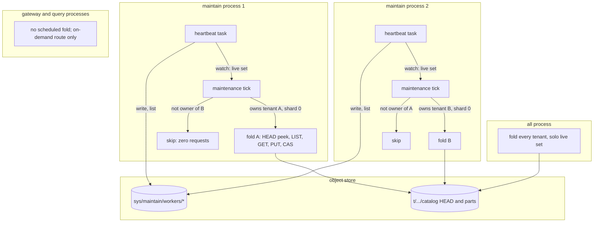

# ADR-1693: Partitioned catalog fold ownership

Status: Accepted (2026-09-16). Issue #1693. Amends ADR-0065 decision 2 (the
ownership rule now also gates the ADR-0020 catalog fold) and changes which
modes run the scheduled fold.

## Context

Maintenance work is partitioned across processes. Each maintain-role process
writes a heartbeat under `sys/maintain/workers/<process_id>`
(crates/ravel-fleet/src/worker_set.rs:105-112), lists its siblings on the
same cadence, and owns a `(tenant, signal, shard)` unit when it wins the
rendezvous hash over the live set (worker_set.rs:152-164; ADR-0065 decisions
1 and 2). The maintenance tick gates every per-unit step on
`WorkerSet::owns_unit` (services/ravel-server/src/maintain.rs:1303), and the
per-signal sweeps are gated on ownership of shard 0 of the pair
(maintain.rs:1647-1648, :1691).

The catalog fold is not partitioned. `fold::spawn` starts one loop per
signal in every mode except maintain (services/ravel-server/src/lib.rs:2796,
:2837-2843; docs/guides/operations/maintenance.md:12-13). Each tick
re-discovers every tenant and calls `run_tenant_tick` for each one
(services/ravel-server/src/fold.rs:233-244). The tick peeks at HEAD first
and skips a fresh one, which keeps a routine tick at two GETs per tenant and
signal. At every hourly seal boundary every process performs the whole fold:
the bucket LISTs, the commit-record GETs, and the part PUTs, and then all but
one lose the HEAD CAS (crates/ravel-catalog/src/fold.rs:1929-1931), which
comes after the work. Results stay correct, because parts are
content-addressed and a duplicate PUT is an idempotent `AlreadyExists`
(docs/catalog-and-mvcc.md:492-493). Cost scales with process count instead
of tenant count: 30 processes over 1,000 tenants and 3 signals cost 180,000
GETs per five minutes at rest and 29 discarded folds per pair per hour.

`WorkerSet::new` takes no key prefix and `heartbeat_key` is fixed
(worker_set.rs:110-112, :274-288), so "a fold-role heartbeat prefix" is a
new `sys/` namespace, and the object key layout is a frozen contract. The
only live set that exists is the maintain one. The maintain process already
carries a `WorkerSet` built at startup in every mode
(services/ravel-server/src/lib.rs:2789-2794) and a heartbeat task that
publishes each fresh live set over a `watch` channel
(services/ravel-server/src/maintain.rs:893-950).

Two other facts shape the choice. The quickstart runs one `--mode all`
process and no maintain process (deploy/docker-compose/ravel.yml:80-82;
maintenance.md:3-10), and `all` is defined as gateway plus query in one
process (docs/architecture.md:29-33). The fold-liveness alert aggregates
`max by (signal)` across the fleet precisely because a replica whose peers
fold on schedule does no folding of its own
(docs/guides/observability.md:303-349). T11e hands hours the sweep held on a
named snapshot to the next fold through an in-process channel, which assumes
the sweep and the fold for a unit run in the same process.

## Decision

1. **The scheduled fold runs in the maintain role, partitioned by the
   existing maintain live set.** `fold::spawn` runs in `Mode::Maintain`. In
   each tick, after discovery, a `(tenant, signal)` pair is folded only when
   `worker.owns_unit(live_set, tenant, signal, 0)` holds, using the process's
   one `WorkerSet` and the live set the maintenance heartbeat task publishes.
   Shard 0 is the unit key, the same convention the per-signal sweeps use,
   so the process that sweeps a pair's catalog objects is the process that
   folds it. The ownership check comes before the HEAD freshness peek, so an
   unowned pair costs zero requests. No new heartbeat prefix and no second
   membership identity exist.

2. **Gateway and query processes stop running the scheduled fold.** They
   keep the on-demand `POST /api/v1/admin/fold` route where it is mounted
   today (services/ravel-server/src/lib.rs:2562-2570), because that route is
   an operator trigger behind the query credential, not scheduled traffic.
   `ravel-cli catalog fold` is unchanged.

3. **`Mode::All` keeps folding, unpartitioned.** `all` is the single-process
   shape, and it runs no maintenance loop and writes no heartbeat. It folds
   every discovered tenant under its solo live set, which is today's
   behavior exactly. A deployment that runs several `all` replicas keeps
   today's duplicated fold cost, and the maintenance guide says so.

4. **A deployment with no maintain process and no `all` process never
   folds.** That is stated, not softened. Correctness is unaffected: resolve
   falls back to listing (maintenance.md:64-73). Query cost grows with the
   unsealed span, and the fold-liveness alert fires, which is the correct
   signal for a fleet that was told to fold and has nobody to do it.

5. **The fold liveness family renders only where the scheduled fold runs.**
   `ravel_catalog_fold_last_success_timestamp_seconds` is rendered in
   `maintain` and `all`. A gateway or query process no longer renders a
   permanently-zero series. The alert rule's `max by (signal)` aggregation
   already tolerates replicas that do not fold, so it needs no change (this
   sentence is corrected by the 2026-09-26 supervision amendment below); its
   comment about "an intentionally maintain-only fleet" that never folds
   becomes stale and is corrected.

6. **The fold in the maintain process reads the maintain context's injected
   clock**, not a fresh `SystemClock` (fold.rs:265 today), so a test that
   drives membership and folding advances one clock.

```mermaid
flowchart TB
    subgraph store [object store]
        HB[(sys/maintain/workers/*)]
        CAT[(t/.../catalog HEAD and parts)]
    end
    subgraph m1 [maintain process 1]
        H1[heartbeat task] -->|write, list| HB
        H1 -->|watch: live set| T1[maintenance tick]
        T1 -->|owns tenant A, shard 0| F1[fold A: HEAD peek, LIST, GET, PUT, CAS]
        T1 -->|not owner of B| X1[skip: zero requests]
    end
    subgraph m2 [maintain process 2]
        H2[heartbeat task] -->|write, list| HB
        H2 -->|watch: live set| T2[maintenance tick]
        T2 -->|owns tenant B, shard 0| F2[fold B]
        T2 -->|not owner of A| X2[skip]
    end
    F1 --> CAT
    F2 --> CAT
    subgraph gw [gateway and query processes]
        G[no scheduled fold; on-demand route only]
    end
    subgraph one [all process]
        A1[fold every tenant, solo live set]
    end
    A1 --> CAT
```

## Rejected alternatives

- **A new fold-role heartbeat prefix that every gateway and query process
  writes.** It adds a `sys/` namespace to the frozen key layout, a PUT and a
  LIST per process per heartbeat interval across the whole fleet, and a
  second membership identity per process. The maintain live set already
  exists and already partitions per-tenant catalog work.
- **Gateway and query processes join the maintain live set.** Rendezvous
  ownership would then assign compaction and retention units to processes
  that run no maintenance loop. Those units would starve permanently, which
  is ADR-0065's stuck-owner hazard made structural.
- **Keep every process folding and let jitter pick a winner.** The CAS comes
  after the LISTs, GETs, and PUTs, so every loser still pays the whole fold.
  Jitter changes who wins, not what it costs.
- **Leader election for the fold.** ADR-0065 rejected a leader for
  maintenance (its rejected alternative 2) because a leader lease is a
  single point of stall and a second protocol beside membership. The fold
  is smaller than maintenance, not different in kind.
- **Static partitioning by replica ordinal without a membership view.** A
  dead ordinal's tenants are folded by nobody until a human notices. The
  live set exists so that takeover is automatic.
- **Stop folding in `all` too, and require a maintain process everywhere.**
  It breaks the quickstart and every single-process deployment for no cost
  saving: one process cannot duplicate its own work.

## Consequences

- Fold cost scales with tenant count. At rest each pair costs two GETs per
  tick on one process; at a seal boundary each pair is folded once. The
  worked example drops from 180,000 GETs per five minutes to 6,000, and
  from 30 folds per pair per hour to 1.
- Fold latency is bounded by maintain capacity. The fold now shares the
  maintain process's discovery cadence and its `unit_concurrency`
  (services/ravel-server/src/lib.rs:2793), so a fleet with one maintain
  replica folds all tenants from that one process. Scaling folding means
  scaling the maintain Deployment, whose replica count the operator already
  exposes (deploy/k8s/operator/crd.yaml:348).
- During a membership transition, at most `3 * H` plus one heartbeat, two
  maintain processes may both fold one pair. The HEAD CAS serializes them
  and the duplicate parts are content-addressed, so the overlap costs bounded
  duplicate reads, the same bound ADR-0065 states for every other unit.
- Operator-visible changes: the operator's fold tuning moves from the
  gateway tier to the maintain tier (`--disable-fold`,
  `--fold-interval-secs`; services/ravel-operator/src/crd.rs:174, :530;
  reconcile.rs:823). Setting either on a gateway or query process becomes a
  startup error, not a silent no-op. The maintenance guide's opening
  paragraph and the troubleshooting table gain the rule: a fleet with no
  maintain process and no `all` process does not fold, and queries pay
  listing cost for the whole unsealed span.
- T11e's refold channel holds by construction only for holds the pair's
  folder finds itself (see the 2026-10-05 refold channel amendment below):
  the sweep that finds a named-snapshot block on shard 0 and the fold that
  reconciles it run in the same maintain process for the same unit key, but
  another shard of the pair may be swept by another process.
  The 2026-10-07 sweep ownership amendment below retires that last clause:
  the owner of shard 0 now sweeps every shard of the pair, so the premise
  holds for every shard.
- ADR-0065 decision 2's list of ownership-gated work gains the fold, keyed
  on shard 0 of the pair. docs/catalog-and-mvcc.md records the ownership
  rule in its fold section.
- Partitioning makes a dead fold loop invisible to the fold-liveness alert,
  which it was not before. The 2026-09-26 supervision amendment below adds
  the loop supervision and the restart alert that close that gap.
- Follow-up work, as tasks:
  1. ravel-server: pass the maintain `WorkerSet`, the live-set `watch`
     receiver, and the injected clock into `fold::spawn`; gate
     `run_tenant_tick` on `owns_unit(.., 0)` before the HEAD peek; spawn
     the fold in `Mode::Maintain` and `Mode::All` only; refuse the fold flags
     in other modes. Land the acceptance test the ticket names: two
     `Catalog` instances with distinct process ids over one `MemoryStore`
     behind a `FaultStore`, a live set of two, one tick each, exactly one
     fold, and zero LIST calls from the non-owner.
  2. ravel-server metrics: render the fold family in `maintain` and `all`
     only; update the render tests that pin `mode="all"`.
  3. ravel-operator: move the `fold` field to the maintain tier with a CRD
     description update; reject it on the gateway tier.
  4. docs: maintenance.md (lines 3-13 and the fold section),
     docs/catalog-and-mvcc.md fold section, docs/architecture.md:29-33,
     docs/guides/observability.md:297-301 and the ADR-0065 decision 2
     amendment paragraph.

## Amendment (2026-09-26): a partitioned fold needs loop supervision and a restart alert

<!-- amendment-applies: sections="Decision|Consequences" pointer="2026-09-26 supervision amendment" -->
<!-- amendment-supersedes: phrase="The alert rule's `max by (signal)` aggregation already tolerates replicas that do not fold, so it needs no change" pointer="2026-09-26 supervision amendment" -->

Decision 5 states that the fold-stalled alert needs no change. That is false
under decision 1, and the reason is the partition itself.

Before the fold was partitioned, every folding process folded every tenant. A
panic in one signal's loop was a fleet-wide fault of that signal: the loop was
a plain spawned task with no supervisor, every copy of it died the same way,
every process's gauge for that signal went stale, and
`RavelCatalogFoldStalled` fired. The alert really did need no change, because
the failure it covered was fleet-wide by construction.

Under decision 1 it is not. A maintain replica whose loop for one signal
panics keeps heartbeating, because the heartbeat is the maintenance loop's,
not the fold's. It therefore stays in the live set, no peer wins the
rendezvous hash for its pairs, and those pairs are folded by nobody.
`ravel_catalog_fold_last_success_timestamp_seconds` moves only on a successful
`Catalog::fold`, so that replica's own gauge goes stale, but the alert
aggregates `max by (signal)` across the fleet precisely so that a replica
which folds nothing does not page. The peers' fresh gauges hold the maximum
under the threshold and nothing fires, for as long as the replica stays up.
Decision 4 stays correct: a fleet with no folding process at all still fires
through the `absent()` arm. What is uncovered is the mixed state, one replica
down for one signal inside an otherwise healthy fleet, which the partition
created.

Two changes, neither of which touches the ownership rule:

1. **Each signal's fold loop runs under a supervisor.** The tick body is
   guarded, a caught panic ends that attempt rather than the task, and a fresh
   attempt is spawned after a bounded backoff that doubles from 1 s to 60 s
   and resets once an attempt completes a tick, and the fresh attempt ticks as
   soon as its backoff ends rather than after a further fold interval, so the
   restart rate of a crash loop is set by the backoff and not by the interval.
   Each restart is logged at
   error level with the signal and counted on a new counter,
   `ravel_catalog_fold_loop_restarts_total{signal}`, rendered beside the
   existing fold families and under the same gate as the liveness gauge:
   `Mode::runs_scheduled_fold`, since a loop that was never scheduled cannot be
   restarted. Shutdown still stops the loop and never restarts it, and a drain
   arriving inside a backoff is observed at once rather than held behind it.
   This mirrors what ADR-0065's maintenance loop already does
   (`ravel_maintain_loop_panics_total`); the fold simply never got it.

2. **A crash loop is alerted on.** `RavelCatalogFoldLoopCrashLooping` fires on
   `increase(ravel_catalog_fold_loop_restarts_total[15m]) > 5` held for 15m,
   at `warning`. It is deliberately unaggregated: the condition is about one
   replica, and the whole defect above is a peer's health averaging that
   replica away. The threshold comes from the restart rate at the defaults: a
   loop panicking on every tick restarts at 0, 1, 3, 7, 15, 31, 63 and 123 s
   after its first panic and every 60 s after that, 20 restarts in its first
   15 minutes and 15 in every 15 minutes after, and crosses more than 5 at the
   sixth, 31 s in. A single transient panic counts 1, and a loop panicking on
   every other tick about 3.

A single transient panic is not the target of either change. It costs one
skipped tick and restarts promptly, which is what the backoff reset is for.
The target is the loop that cannot make progress, which the restart counter
reports and which no other figure in the family can.

That target is a loop that keeps panicking; supervision covers panics only. A
tick that hangs, on a store call that never returns for example, neither
panics nor completes, so the restart counter does not move and the
crash-loop alert stays silent. What stops is that replica's own
`ravel_catalog_fold_last_success_timestamp_seconds` and
`ravel_catalog_fold_cycles_total` for the signal. No shipped alert catches a
hung loop on one replica of several: `RavelCatalogFoldStalled` aggregates
`max by (signal)`, so the peers hold it under its threshold, and it fires only
once every folding replica's loop for that signal is stalled. A per-replica
staleness rule is not shipped, because a gauge standing still is also the
healthy reading of a replica the hash gives no pairs.

Scope: the supervisor is in `ravel-server`'s fold task and the alert is in
`deploy/prometheus/ravel.rules.yaml`. No ownership rule, no key layout, no
mode gate and no metric already in the family changes.

## Amendment (2026-10-05): the refold channel holds for shard 0 only

<!-- amendment-supersedes: phrase="refold channel holds by construction" pointer="2026-10-05 refold channel amendment" -->

The Consequences section said the refold channel (ADR-0063 section 4, the
re-fold requests the superseded-input sweep hands to the fold) holds by
construction, because the sweep and the fold of a pair run in one process.
That is true of shard 0 of the pair only. Decision 1 assigns the fold to the
owner of shard 0, while every other shard of the pair is swept by its own
owner under the same rendezvous hash, which with more than one maintain
process is often a different process (until the 2026-10-07 sweep ownership amendment below).

The channel is an in-process queue (ADR-0063, the 2026-10-05 requester
amendment), so a hold found by a process that does not fold the pair has no
path to the process that does. A maintain tick therefore sends a pair's
held hours only when its process owns shard 0 of the pair under the live set
it is using for that tick; otherwise it sends nothing, so its queue does not
fill with entries no fold takes. The fold tick likewise removes, uncounted,
the entry of a pair whose shard 0 its process no longer owns, and of a
tenant the tick does not maintain; an eviction from a full queue is the one
removal counted. Holds found on shard 0, and every hold in a deployment with
one maintain process, are queued for the fold and stay queued until folds of
the pair that are not no-ops take them, at most
`frontier_reconcile_max_hours` of the oldest per fold, unless the process
restarts or the queue evicts them first. In `--mode all` no maintain loop
runs, and a maintain process whose scheduled fold is disabled hands its
sweeps no queue, so in neither is anything swept into the queue and no hold
reaches the fold this way. A hold on another shard swept by another
process reaches no fold and its inputs stay held until the fold's frontier
band reaches the hour. Closing that gap needs a cross-process channel and is tracked as issue
#2606 (the 2026-10-07 sweep ownership amendment below closes it in process instead). No ownership rule, key layout or mode gate changes.

## Amendment (2026-10-07): the fold owner sweeps every shard of the pair

<!-- amendment-applies: sections="Consequences|Amendment (2026-10-05): the refold channel holds for shard 0 only" pointer="2026-10-07 sweep ownership amendment" -->
<!-- amendment-supersedes: phrase="another shard of the pair may be swept by another process" pointer="2026-10-07 sweep ownership amendment" -->
<!-- amendment-supersedes: phrase="every other shard of the pair is swept by its own owner" pointer="2026-10-07 sweep ownership amendment" -->
<!-- amendment-supersedes: phrase="Closing that gap needs a cross-process channel" pointer="2026-10-07 sweep ownership amendment" -->

Issue #2606. The 2026-10-05 refold channel amendment left a gap: a
named-snapshot hold the superseded-input sweep found on shard N of a pair,
N not 0, was found by the owner of shard N, which with more than one
maintain process is often not the process that folds the pair, and the hold
reached no fold. This amendment closes the gap by moving the sweep rather
than adding a channel.

1. **The owner of shard 0 sweeps every shard of the pair.** The sweep pass
   of a `(tenant, signal)` pair runs only in the process that owns shard 0
   of it (`FOLD_UNIT_SHARD`) under the live set of the tick, and there it
   runs for every shard in the pair's scan range, the union of every shard
   generation's range, whether or not that process owns the shard. A process
   that owns shard N of the pair and not shard 0 runs no sweep pass for the
   pair. The sweep pass is the per-shard pass the maintain tick ran after
   each unit's retention and compaction: the superseded-input sweep (rule 2)
   together with the unreferenced-part sweep (rule 3) and orphan GC with its
   quarantine reaper (rule 1), which `ravel-maintain` runs as one pass per
   shard. They move together, so the cadence that pass already has is kept
   whole, and no rule runs in two processes.

2. **Retention and compaction stay per shard.** Each shard's retention and
   compaction still run on that shard's own rendezvous owner, with ADR-0065's
   memo slicing and bounded intra-process concurrency. The per-signal sweeps
   and the erasure pass were already keyed on shard 0 and are unchanged.

3. **The zone split is kept.** ADR-0065 decision 3's cadence runs on the
   sweeping process, tracked in its memo per `(tenant, signal, shard)`: a
   full pass on a shard's first tick there and every `interior_reverify_ns`
   after, and a pass scoped to the head and tail hours on the other ticks.
   For a shard it also scans, the head and tail hours come from its own scan,
   as before. For a shard it does not scan, it lists the shard's hours (one
   delimited LIST of the shard's commit prefix) and classifies them with the
   same zone rule against the tenant's retention window, read once per pair
   per tick. A failed read or listing takes a full pass, as a failed scan
   already did. That listing is the one request this amendment adds, per
   shard swept but not scanned per tick.

4. **The premise holds for every shard.** The sweep that finds a
   named-snapshot block and the fold that reconciles it run in the same
   maintain process for the same unit key, shard 0 of the pair, for a hold on
   any shard of the pair. Every hold the pair's sweep finds is queued in the
   process whose fold takes it, so the in-process queue reaches the fold for
   every shard, with no cross-process channel and no new object key. The
   queue's other limits are unchanged: it is bounded and lost with the
   process, and a lost entry is sent again by the next pass that finds the
   hold.

Exactly one process sweeps a pair's shards under one live set, because
rendezvous ownership gives the unit `(tenant, signal, 0)` exactly one owner,
and every member computes the same owner from the same live set. That owner
sweeps every shard in the scan range, so no shard is left unswept while the
live set is stable, and every other member skips the pair's sweep, so none is
swept twice. During a membership transition the overlap ADR-0065 bounds
applies unchanged: two processes may both sweep a pair for at most `3 * H`
plus one heartbeat, and every sweep rule is idempotent and gated per pass.

The sweep of shard N now runs, in the steady state, in a different process
from shard N's compaction, which before happened only inside a transition.
No delete rule depends on the two sharing a process. Rule 2 deletes only the
inputs of compaction and rewrite records past their protection horizon, and
only when no hold covers them (a HEAD that names them or cannot be read, the
pinned-query window, a legal hold); rule 3 deletes only an `l1/` object older
than the unreferenced-part age gate, which outlasts any compactor's
abandonment deadline, and re-lists before each delete; rule 1 deletes only a
record-less `l0/` object older than the orphan age gate, behind its breaker.
The erasure pass already runs this way, on the owner of shard 0 over every
shard while other processes compact theirs. No hold rule changes.

The superseded-sweep metrics are per signal, so the sweeping process's
counters sum every shard it sweeps, which is every shard of each pair it
folds. A sweep of a shard the process does not own that fails counts as a
failed tick of its shard 0 unit, the unit the pair's sweep is keyed on, so a
sweep that keeps failing still reaches the stalled-unit gauge. The cost is
placement: a pair's sweep work concentrates on its shard 0 owner, and stays
balanced across processes over many pairs because rendezvous hashing spreads
shard 0 of each pair. No key layout, mode gate or hold rule changes.
