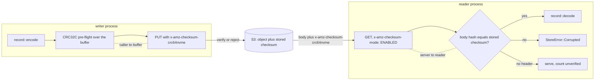

# ADR-1696: commit record integrity through store upload checksums verified on read

Status: Accepted (2026-09-16). Issue #1696. No frozen format changes; no
migration class applies.

## Context

A commit record is a bare protobuf. `record::encode` is `encode_to_vec`
(`crates/ravel-commit/src/record.rs:221-223`) and `record::decode` is a prost
decode followed by `validate` (`record.rs:226-230`), which checks lengths, the
`format_version`, timestamp order and hour consistency (`record.rs:180-218`)
and nothing about the bytes themselves. `CommitRecord` has no checksum field
(`proto/ravel/commit.proto:16-45`; its `content_hash` at field 10 digests the
data object, not the record). Compaction records, tombstones and rewrite
records are encoded the same way (`record.rs:266-268`, `:296-298`,
`crates/ravel-commit/src/erasure.rs:501-503`).

Every data object carries its own crc hierarchy: the RSEG trailer crc32c
covers every trailer byte but itself (`docs/segment-format.md:108-121`,
verified at `crates/ravel-segment/src/reader.rs:208-212`), and RLOG and RSPAN
do the same (`crates/ravel-logseg/src/footer.rs:253`,
`crates/ravel-rspan/src/footer.rs:231-240`). The idempotency marker, a Class C
metadata object like the commit record, frames itself with magic, version and
a crc32c (`docs/catalog-and-mvcc.md:648-665`). The commit family is the one
read path whose bytes reach the reader unchecked.

So a flipped bit inside a stored commit record decodes as a valid record. A
flip in `max_event_ts_ns` moves the segment out of a query's range and the
answer is short and error-free. A flip in the first eight bytes of
`content_hash` points `reconstruct_data_key` at nothing. On the write path the
same flip turns a benign `AlreadyExists` retry into `PublishError::SplitBrain`
(`crates/ravel-commit/src/publish.rs:137-146`), which the log flush task
documents as a panic (`crates/ravel-ingest/src/log_shard.rs:874-877`).

The store adapter already has both halves of a transport checksum and uses
neither on the wire by default:

- `publish` computes a CRC32C over the encoded record and passes it in
  `PutOptions` (`publish.rs:94-96`). `S3Store::put` verifies that CRC32C
  against the local buffer only (`preflight_checksum`,
  `crates/ravel-object-store/src/s3.rs:1089-1107`, applied at `:1618`); the
  doc says it "is never itself put on the wire".
- `UploadIntegrity` (`s3.rs:277-294`) can attach a server-verified
  `x-amz-checksum-crc64nvme` or `x-amz-checksum-sha256` through
  `AmazonS3Builder::with_checksum_algorithm` (`s3.rs:805-812`), in which case
  S3 verifies-or-rejects the PUT and stores the checksum with the object. It
  defaults to `Off` (`s3.rs:280-284`, `:536`), no server flag sets it, and
  production always builds the store with `S3HttpConfig::default()`
  (`services/ravel-server/src/store.rs:409` via `with_metrics`, `s3.rs:638-639`).
  With integrity on, multipart is excluded and a payload above the single-PUT
  ceiling is refused loudly (`s3.rs:1628-1646`).
- The GET path passes `range` and `if_match` only (`get_one`,
  `s3.rs:1453-1470`), asks for no checksum and verifies none. `GetOutcome`
  carries `data`, `etag`, `version`, `total_size` and no checksum
  (`crates/ravel-object-store/src/lib.rs:113-119`).
- `docs/object-store-contract.md:387-442` records why `Off` is the default
  (an endpoint that does not support the header fails every write) and the
  two limits of `object_store` 0.14: no per-request checksum hook, and no way
  to see whether a PUT's checksum was honoured, because `PutResult` exposes
  no response headers. `docs/catalog-and-mvcc.md:989-994` still says wire-level
  verification "is pending".

Issue #1696 proposed framing the record (magic, u16 version, crc32c over the
payload). The commit record is a frozen Class C format (ADR-0066 decision 4):
its evolution is additive protobuf fields, and "a genuinely incompatible
change requires a new record kind under a new key suffix, dual-listed
alongside the old kind until retention tombstones the old records' hour
buckets". A framed record is not an additive field. Every one of the dozens
of production decode sites in `ravel-catalog`, `ravel-maintain`,
`ravel-server` and `ravel-cli` would dual-list two suffixes for as long as any
bucket holds an unframed record, which for a long-retention tenant is years.
The owner's decision is to try the no-format-change path first, and this ADR
records it together with what it does not cover.

## Decision

1. **Every commit-family PUT carries a server-verified checksum.** The
   server, the CLI and the operator build the S3 store with
   `UploadIntegrity::Crc64Nvme` by default, exposed as
   `--s3-upload-integrity {off,crc64nvme,sha256}` on `ravel-server` and the
   matching `ravel-cli` store selection. S3 verifies the digest on receipt and
   rejects a body that does not match, so a record corrupted between the
   adapter's buffer and the store never becomes visible. The local CRC32C
   pre-flight stays as it is; together the two cover caller to buffer and
   buffer to server, as the contract already describes. The setting is
   whole-client, so data objects and control objects get the same coverage;
   commit records are the reason, not the scope.

2. **Every full-object GET asks for the stored checksum and verifies the
   body against it before the bytes reach the caller.** The adapter sends
   `x-amz-checksum-mode: ENABLED` on a full-object GET and, when the response
   carries `x-amz-checksum-crc64nvme` (or `-sha256`), hashes the body it
   received and compares. A mismatch is `StoreError::Corrupted`
   (`lib.rs:401`), the variant the contract already reserves for "checksum or
   range mismatch" (`docs/object-store-contract.md:60`), so no reader needs a
   new error arm. This is the read-time check the ticket asked the record to
   carry, moved from the record's bytes to the transport that stores them.
   `object_store` 0.14 exposes neither the request header nor the response
   header, but the adapter already installs its own HTTP connector below
   `object_store`'s retry loop (`AttemptCountingConnector`, `s3.rs:630-669`),
   which sees both; the verification lives there, as a body wrapper that
   hashes bytes as they stream and fails the stream on mismatch.

3. **A GET that comes back with no checksum is served and counted, not
   refused.** An endpoint that stores no checksum, or ignores checksum mode,
   returns a body with no `x-amz-checksum-*` header. The adapter returns the
   bytes and increments `ravel_store_get_unverified_total`. Read-time
   integrity for data objects is the crc hierarchy regardless, so serving is
   never a regression; the counter makes an endpoint that silently drops the
   header visible, which the contract says the PUT side cannot detect.
   `ravel-cli store qualify` gains a check that PUTs with a checksum, GETs with
   checksum mode, and reports whether the endpoint echoed it, so the operator
   learns this at qualification rather than from a counter in production.

4. **Ranged GETs are not verified.** S3 returns the whole-object checksum,
   which a range cannot be checked against. Suffix and range reads of data
   objects keep the format's own crc hierarchy as their check, which is what
   they have today. Commit-family records are always read whole
   (`GetRange::Full` at every decode site), so every record read is covered.

5. **The semantics oracle verifies on read too.** `MemoryStore` already
   verifies `PutOptions::checksum` on put (`crates/ravel-object-store/src/memory.rs:76-85`);
   it keeps the checksum beside the object and verifies it on a full-object
   get, returning `Corrupted` on mismatch. `FaultStore::CorruptRange`
   (`crates/ravel-object-store/src/fault.rs:125-127`) is the injected fault
   that proves it: the contract suite gains a case that corrupts a stored
   record and asserts the get is refused and the fault counter fired. The
   wrapper backends (`KmsRoutingStore`, `InstrumentedStore`,
   `ScheduledHandle`, `SharedKmsStore`) pass the outcome through. There is no
   filesystem backend to cover (`services/ravel-server/src/config.rs:44-50`
   lists `Memory` and `S3`).

6. **The record layout does not change.** `CommitRecord`, `CompactionRecord`,
   `RetentionTombstone` and `RewriteRecord` keep their bytes, field numbers,
   `format_version` values and key suffixes. No reader gains a second path.
   This is the checksum-coverage review the format-change skill's step 4
   asks for, applied to the commit family, and its answer is that the
   coverage comes from the transport.

## Rejected alternatives

- **Frame the record: magic, u16 version, crc32c over the payload (the
  ticket's fix).** Not additive under ADR-0066 Class C, so it is a new record
  kind under a new suffix with dual listing at every decode site until the
  last unframed record ages out. It also verifies less than it seems: a crc
  computed over an already-corrupt buffer passes, exactly as the transport
  checksum would, and it covers only the commit family where the transport
  check covers every full-object read. It remains the fallback if a deployment
  must run on an endpoint that stores no checksum and cannot accept unverified
  reads; that is a future ADR with the class C justification this one avoids.

- **Verify the S3 ETag as an MD5 of the body.** Free on every GET, and wrong
  under SSE-KMS (ADR-0062 routes tenants through KMS keys, and a KMS-encrypted
  object's ETag is not its MD5) and for any multipart object. A check that is
  silently void for exactly the deployments that care about integrity is not
  a check.

- **Keep `UploadIntegrity::Off` as the default and make the read-side check
  opt-in.** Leaves the ticket unfixed for every deployment that does not opt
  in, which today is all of them. The reason `Off` was chosen, an endpoint
  that rejects the header, fails the first PUT loudly; the operator sets
  `off` and is where they are today. The default should be the one that
  covers the record.

- **Refuse a GET whose response carries no checksum.** Fails closed against
  every endpoint that stores no checksum, including any object written before
  this change under `Off`, which is every existing object in every existing
  bucket. Serving and counting is the only default that does not make an
  upgrade an outage; a strict mode can follow once the counter shows it would
  be quiet.

- **Have each reader re-hash and compare instead of the adapter.** Puts the
  same loop at forty call sites and needs the response header they cannot
  see. The adapter's connector is the one place that sees the header and the
  body together.

## Consequences

- A flipped bit inside a stored commit record, or in transit either way, is a
  typed `StoreError::Corrupted` at the GET, before decode, at every reader:
  catalog fold and resolve, maintenance, scrub, the publish-time
  `AlreadyExists` comparison, and `ravel-cli` inspection. The `SplitBrain`
  path in `publish.rs:137-146` no longer fires on a corrupt stored record; the
  flush sees a store error and retries or sheds instead of panicking.
- What is still not covered: a corruption of the buffer before either
  checksum is computed (memory corruption in the writer, invisible to framing
  too); ranged reads, which keep the format crc hierarchy; an endpoint that
  recomputes a checksum on read instead of returning the one stored at
  upload, which verifies nothing and cannot be distinguished from an honest
  echo; and semantic errors, since a wrong value the writer meant to write is
  not corruption. Objects written under `Off` before this change carry no
  stored checksum unless the endpoint computed one on its own; their reads
  count as unverified until retention or a rewrite replaces them, and
  `ravel_store_get_unverified_total` shows that tail draining.
- For an operator: the S3 store now attaches a CRC64-NVME checksum on every
  PUT. An endpoint that rejects the header fails at the first startup write;
  the remedy is `--s3-upload-integrity off`, with the consequence that
  commit records are again unverified. Compose files, the operator's
  rendered flags, and the metricsbench and ClickBench launchers are updated
  in the same change where their endpoints need `off`. With integrity on, an
  `Overwrite` larger than the single-PUT ceiling is refused rather than sent
  as multipart (`s3.rs:1641-1646`); no Ravel object approaches that size.
- `docs/object-store-contract.md` "Upload checksums" and
  `docs/catalog-and-mvcc.md:989-994` are updated: the default is on, GETs
  verify, and the "wire-level verification is pending" sentence goes.
- `crates/ravel-query/src/cache_correctness.rs:1456-1458` notes that the RSPAN
  read path verifies no content hash on read; that is a data-object
  observation outside this ADR and is reported, not changed.
- Follow-up tasks:
  1. `ravel-object-store`: read-side verification in the S3 connector, the
     unverified counter, `MemoryStore` get-side verification, and the
     contract-suite case with `FaultStore::CorruptRange` asserting the fault
     counter. The `s3_http_faults` harness gains a case that flips a byte in
     the mocked GET body and asserts `Corrupted`.
  2. `ravel-server`, `ravel-cli`, `ravel-operator`: the
     `--s3-upload-integrity` flag with `crc64nvme` as the default, and the
     `store qualify` echo check.
  3. `ravel-commit`: the acceptance test from the ticket, restated for this
     mechanism: publish a record on a `MemoryStore`, flip one byte of the
     stored object, and assert the read is `Corrupted`; assert that the
     current tree returns a decoded record with the wrong `max_event_ts_ns`.
  4. Scrub: count a `Corrupted` commit-record GET as a checksum mismatch
     instead of "decode failed; skipping" (`services/ravel-server/src/scrub.rs:599-604`).
  5. Docs: the two contract documents above, the flags reference, and the
     operations guide's S3 endpoint section.
