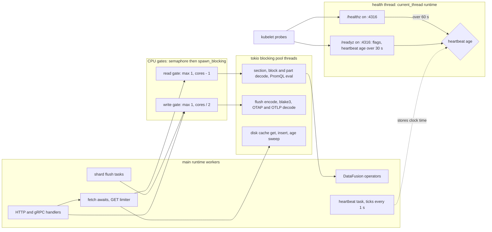

# ADR-1702: CPU-bound codec work runs behind a capped gate, and liveness gets its own listener

Status: Accepted (2026-09-26). Issue #1702, with #1891 split from it. No
frozen format changes; no migration class applies. Adds three server flags
(`--listen-health`, `--cpu-gate-read-permits`, `--cpu-gate-write-permits`)
and one operator CRD field.

## Context

`ravel-server` starts on a bare `#[tokio::main]`
(`services/ravel-server/src/main.rs:37`). There is no `worker_threads`, no
`max_blocking_threads` and no thread naming anywhere, so the runtime has one
worker per core and a blocking pool of up to 512 threads.

### Disk I/O is already off the workers

Commits d5d2dd1f8, 7e43fd384 and f430e891d (#1702) and 94753015f (#1891)
moved every tiered-cache disk call under `spawn_blocking`:
`crates/ravel-cache/src/tiered.rs:227,250,346,464,513` and the age sweep at
`crates/ravel-cache/src/disk.rs:630`. The tests pin placement by ordering,
not by elapsed time. A parked disk operation on a `current_thread` runtime
must not stop a concurrent task, and a watchdog turns a regression into a
deterministic panic. 106afd60e moved that scaffolding into one
`#[cfg(test)]` module, `crates/ravel-cache/src/test_support.rs`. Those
commits leave two questions to this ADR: where CPU-bound decode runs, and
whether health gets its own listener.

### Decode still runs on the workers

No production decode is wrapped in `spawn_blocking`, `block_in_place`, rayon
or a thread. The only production `spawn_blocking` calls outside the cache
are the S3 and IMDS store build (`crates/ravel-object-store/src/s3.rs:2572`,
`:2614`, `s3/instance_role.rs:700`, `services/ravel-server/src/store.rs:1422`,
`services/ravel-cli/src/store.rs:653`), the trace flush at shutdown
(`services/ravel-server/src/main.rs:599`,
`services/ravel-operator/src/main.rs:120`) and the CLI load tool
(`services/ravel-cli/src/load.rs:1756`).

The zstd calls on read paths, and the unit each one decodes:

| Decode site | Unit and cap | Nearest async caller |
|---|---|---|
| `ravel-segment/src/reader.rs:531` `decode_section_bytes` | one RSEG section, cap `max_section_uncompressed_bytes = 1 << 30` (`format.rs:363`) | `ravel-query/src/fetcher.rs:1451,1463,1501` in `decode_selected` (`:1384`); SQL via `ravel-sql/src/scan.rs:540` |
| `ravel-segment/src/sparse.rs:966` `decode_catalog_v5_chunked` | every meta-chunk frame of an object, in one loop | `ravel-query/src/fetcher.rs:1611` |
| `ravel-logseg/src/page.rs:95` `read_page` | one page, 64 MiB cap (`page.rs:17`), up to 4096 pages per block | inside DataFusion `poll_next`: `ravel-sql/src/logs_scan.rs:4054,4214,4251,4269`; LogQL via `ravel-query/src/log_fetcher.rs:1170,1236` |
| `ravel-logseg/src/postings.rs:595` `probe_accounted` | one postings block, 64 MiB cap | `log_fetcher.rs:1307,1362,1578,1963` |
| `ravel-logseg/src/reader.rs:1393` `decode_section` | one footer section, 1 GiB cap | `log_fetcher.rs:4498,4948,5572,5728` |
| `ravel-rspan/src/block.rs:1072`, `footer.rs:458` | one page (64 MiB) or one section (1 GiB) | `ravel-sql/src/spans_scan.rs:683`, polled from `poll_next` (`:793`) |
| `ravel-catalog/src/snapshot_format/part.rs:171`, `postings.rs:201`, `column_stats.rs:408` | a whole snapshot part, postings or stats object, 256 MiB caps (`snapshot_format/mod.rs:45,77,135`) | `ravel-catalog/src/snapshot_resolve.rs:809` under `.buffered(resolve_get_concurrency)` (`:752`, default 128), `:549`, `column_stats_resolve.rs:389` |
| `ravel-catalog/src/metrics_meta.rs:608` | a whole metrics-meta body, 32 MiB cap | `metrics_meta.rs:706,757` |

`ravel-segment/src/sparse.rs:430` has no production caller. About 46
production call sites reach these decoders: 16 in ravel-query, 6 in
ravel-sql, 12 in ravel-catalog, 3 in ravel-server, 8 in ravel-maintain and 1
in ravel-ingest. About 37 of them are on query or catalog paths.

The write side has the same shape. The metrics flush calls
`SegmentWriter::write_histograms_with_exemplars` inline
(`crates/ravel-ingest/src/shard.rs:539`). That call does zstd
(`ravel-segment/src/writer.rs:1709`) and blake3 (`writer.rs:783`). The log
and span flushes do the same (`log_shard.rs:643-658`,
`span_shard.rs:287-291`). OTAP decode (`ravel-otap/src/stream.rs:226`,
reached from `services/ravel-server/src/otap_grpc.rs:219`), OTLP-HTTP gzip
(`otlp_http.rs:280`) and remote-write snappy (`remote_write.rs:117`) run in
their async handlers. Compaction decodes, merges and re-encodes inline
(`ravel-maintain/src/build.rs:326`, `:1094`).

The existing concurrency limits bound I/O, not CPU.
`buffer_unordered(promql_fetch_fanout)` (default 8,
`ravel-query/src/config.rs:17`) polls every future in one task, so a
query's decodes run one after another on one worker. `GetLimiter`
(`ravel-query/src/limiter.rs:29`) covers the GET only. Four wide scans on a
4-worker node can hold every worker in zstd for hundreds of milliseconds.

### Memory accounting around decode

`SegmentFetcher::reserve_fetch` reserves fetched bytes against
`ravel_memory::MemoryBudget` before the GET (`ravel-query/src/fetcher.rs:840`,
`:1175-1190`), with the same pattern in `log_fetcher.rs:777` and
`span_fetcher.rs:248`. A `Reservation` travels with its buffer across
threads (`crates/ravel-memory/src/lib.rs:8-11`). Decoded bytes are charged
after decode through DataFusion `try_grow` (`ravel-sql/src/scan.rs:627`,
`spans_scan.rs:782`, `logs_scan.rs:3712`). The PromQL path and the catalog
decoders charge no budget for decoded bytes. They are bounded by the static
caps above.

### Health shares the application runtime

`/healthz`, `/readyz`, `/-/healthy` and `/-/ready` are routes on one
`Router` (`services/ravel-server/src/health.rs:215-224`). That router is the
first merge into the main HTTP router (`services/ravel-server/src/lib.rs:2048`),
which also carries OTLP, SQL, PromQL and `/metrics`. `/healthz` returns
`"ok"` with no check (`health.rs:229`). `/readyz` does no I/O: it ANDs four
atomics (`health.rs:13-24`, `:194-200`). The mTLS listener serves no health
routes by design (`lib.rs:2049-2054`).

The operator renders both probes as HTTP GET on port 4318
(`services/ravel-operator/src/reconcile.rs:142`, `:701-731`). Liveness is
`/healthz` with period 10 s, timeout 2 s and failure threshold 3. Readiness
is `/readyz` with the same numbers. No startup probe is rendered. So a node
whose workers stay busy for more than 2 s on three probes in a row is
killed, its load moves to peers, and the pattern can repeat. The
ingest-router pod runs a separate binary (`services/ravel-ingest-router`,
`reconcile.rs:1505-1513`) that does no decode.

### What can be observed today

No tokio runtime metric is exported. There is no decode-time metric. The
closest figures are `ravel_query_decompressed_bytes_total` (bytes, not time)
and encode timing behind the `stage-timing` feature
(`crates/ravel-ingest/src/stage_timing.rs`). `docs/architecture.md` has no
rule on thread placement.

## Decision

1. **The placement rule.** A kernel wait (a file operation) goes to the
   tokio blocking pool, as the cache does today. Codec work (decompress,
   decode, encode, hash) on a unit at or above the gate's inline floor
   goes through a CPU gate. Neither runs on a runtime worker. The floor
   defaults to 256 KiB of uncompressed bytes (decision 4). The rule also
   covers PromQL evaluation, which is synchronous and never yields: an
   evaluation whose sample count, which the engine knows before it
   evaluates (`crates/ravel-query/src/engine.rs:781-788`), is at or above an
   evaluation floor goes through the read gate, and a smaller one runs
   inline. The evaluation floor defaults to 100,000 samples, is a gate
   setting like the byte floor, and is measured in task 11 rather than
   trusted. Decision 12 lists the CPU work the rule leaves on the
   workers. The rule goes into `docs/architecture.md`.

2. **The CPU gate is a capped `spawn_blocking`.** A new workspace crate,
   `ravel-cpu-gate`, holds `CpuGate`: a `tokio::sync::Semaphore` with a fixed
   permit count, plus counters. `CpuGate::run(site, f).await` acquires an
   owned permit, then runs `f` under `spawn_blocking`. The permit moves into
   the closure and drops when `f` returns. So a dropped waiter can never free
   a permit while its thread still burns CPU. A `JoinError` maps to the
   caller's decode error, never a panic.

3. **Two gate instances.** The server builds a read gate for query, catalog
   and maintenance decode. It builds a separate write gate for flush encode
   and for ingest payload decode. A burst of wide scans then cannot delay
   the flushes that acknowledgements wait on. Default permits: read gate
   `max(1, cores - 1)`, write gate `max(1, cores / 2)`. Both are set with
   `--cpu-gate-read-permits` and `--cpu-gate-write-permits`.

4. **Offload the unit the caller awaits.** The gate wraps a whole section,
   a whole block with all its pages, or a whole part. It never wraps a
   single page, since 4096 dispatches per block cost more than they save.
   A unit whose uncompressed length is below the floor runs inline. The
   floor is a gate setting, 256 KiB by default, and tests set it to 0. An
   inline run still counts in `ravel_cpu_gate_inline_total{gate,site}`, not
   in `ravel_cpu_gate_jobs_total`, so a test can tell the two apart. The codec
   crates (`ravel-segment`, `ravel-logseg`, `ravel-rspan`,
   `ravel-catalog::snapshot_format`) stay synchronous and runtime-free. The
   gate is applied at the async caller.

5. **Cancellation.** A waiter dropped before it holds a permit never runs.
   A decode that has started runs to completion, because a `zstd::bulk`
   call cannot be interrupted. Its result is discarded and counted as
   abandoned. The wasted work is bounded by the permit count times the
   largest unit.

6. **Memory accounting does not move.** Permits count jobs, not bytes. The
   fetch `Reservation` moves into the closure with its buffer, so queued
   input stays charged. Decoded bytes are still charged after decode by
   `try_grow`. The catalog path holds as many fetched parts in flight as
   `.buffered(128)` holds today.

   Decoded output is a different matter. Today the decodes of one catalog
   stream or one PromQL query run one after another on one worker, and
   that serialization limits how many decoded outputs exist at once.
   Offloading removes that limit, and neither path charges its decoded
   bytes to any budget. So before the catalog and PromQL paths move (tasks
   6 and 7), their decoded output is charged to `MemoryBudget`: the
   uncompressed length is known from the descriptor before decode, so the
   caller reserves it and moves the `Reservation` into the gate closure.
   That is task 5 in the list below.

7. **The logs and spans scans get a decode state.** Their decode runs
   inside `poll_next`, so a wrap in place is not possible. Each scan's state
   machine gains a state that holds the pending gate future for one block.
   `poll_next` returns `Pending` while the block decodes.

8. **Liveness and readiness get their own listener on their own thread.**
   A new flag `--listen-health <addr>` binds a listener served by a
   `current_thread` runtime on a dedicated OS thread. It serves `/healthz`,
   `/readyz`, `/-/healthy` and `/-/ready`, and nothing else. The flag is
   unset by default, so no listener binds. That keeps every launcher that
   runs several servers in one network namespace working: the compose
   file, `scripts/demo.sh`, `scripts/dr/*.sh`, `scripts/chaos/*.sh` and the
   server integration tests. The operator passes
   `--listen-health 0.0.0.0:4316` when it renders probes on that port
   (decision 10). The same routes stay on the main HTTP router, so compose
   files, Grafana and existing docs keep working. The listener carries no
   tenant identity and serves no tenant route, so it takes no part in the
   loopback rule for `--dev-insecure-tenant-header`
   (`services/ravel-server/src/config.rs:403-406`).

9. **A runtime heartbeat keeps liveness honest.** A task on the main
   runtime stores the injected clock's time into an atomic once per second.
   The dedicated listener reads its age. `/healthz` there returns 503 when
   the age exceeds 60 s, so a deadlocked main runtime is still restarted.
   `/readyz` there returns 503 when one of today's four flags says not
   ready, or when the heartbeat age exceeds 30 s. That threshold sits far
   above the longest unit of work left on the workers (decision 12), so a
   busy node stays in the Service and overload is handled by admission
   control, not by the probe, while a deadlocked runtime still leaves the
   Service. The cost is stated in Consequences: a deadlocked pod keeps
   receiving traffic for about 60 s instead of today's 30 s. Liveness uses
   the same heartbeat at 60 s, because only a stall far past any single unit
   of on-worker work means the runtime is stuck. PromQL evaluation, which is
   synchronous and never yields, runs on the read gate (task 7) so it
   cannot hold a worker for that long. Whether 30 s and 60 s are safe
   against what remains on the workers is measured, not assumed: the
   saturation bench (task 11) must show the heartbeat age under load staying
   below 10 s, a third of the readiness threshold, before the operator
   default flips (task 12). The
   main-router copies of `/healthz` and `/readyz` keep today's behavior.

10. **The operator probes the health port behind a CRD field.** A new
    field `spec.probes.dedicatedHealthPort` (bool) makes the operator pass
    `--listen-health 0.0.0.0:4316` and render both probes and a container
    port on 4316. It defaults to `false` in the release that adds the
    listener, and to `true` one release later. The release notes for the
    flip require a server image from the earlier release or newer. An older
    image rejects the unknown flag, so an early flip would restart-loop the
    pod. The ingest-router Deployment keeps its probes on 8080.

11. **Metrics show queueing.** Per gate (`gate="read"|"write"`):
    `ravel_cpu_gate_permits`, `ravel_cpu_gate_running`,
    `ravel_cpu_gate_queued`, the sum and count pairs
    `ravel_cpu_gate_wait_seconds_sum` / `ravel_cpu_gate_wait_seconds_count`
    and `ravel_cpu_gate_run_seconds_sum` / `ravel_cpu_gate_run_seconds_count`
    (the `_seconds_sum` / `_seconds_count` shape the server already uses), and
    `ravel_cpu_gate_abandoned_total`. Per call site:
    `ravel_cpu_gate_jobs_total{gate,site}`, where `site` is a static string
    set at the call. The gate measures with an injected monotonic clock.
    From the stable tokio `RuntimeMetrics` set: `ravel_runtime_workers`,
    `ravel_runtime_alive_tasks`, `ravel_runtime_global_queue_depth` and, on
    64-bit targets, `ravel_runtime_worker_busy_seconds_total{worker}`.
    `ravel_health_heartbeat_age_seconds` comes from the health listener.
    No metric needs `tokio_unstable`.

12. **What the gate does not cover.** DataFusion operator CPU (sort,
    aggregate, join) and tonic's own gzip codec still run on workers.
    PromQL evaluation over the evaluation floor does not: its evaluator
    functions are synchronous with no yield points
    (`crates/ravel-promql/src/aggregate.rs`, `binop.rs`), so one evaluation
    over up to 10,000,000 samples could hold a worker, and it runs on the
    read gate instead (decision 1). A small evaluation stays inline, so the
    cheapest queries never queue behind a large part decode. The isolated health listener is the
    backstop for what remains.
    A later ADR can move them if the busy metrics show they matter.

## Rejected alternatives

- **Keep decode inline (status quo).** This is the restart cascade in the
  issue. Four 256 MiB part decodes on four workers stop every other task,
  including `/healthz`. Raising probe timeouts does not fix it, because a
  decode has no upper bound on the time it holds a worker.

- **Plain `spawn_blocking` with no cap.** It frees the workers but not the
  cores. The catalog resolve runs 128 fetches through `.buffered`, so up to
  128 CPU-bound threads could land on 4 cores. There is no queue to measure
  and no bound on wasted work after a cancel. The semaphore is what turns
  it into a decision.

- **`block_in_place`.** It panics on a `current_thread` runtime, which the
  cache placement tests and the default `#[tokio::test]` use. It also
  starts a replacement worker per call, so it has no cap either, and it
  gives no queue metric.

- **A dedicated fixed thread pool with a bounded channel.** It would add
  thread names and a hard queue length. The capped blocking pool already
  gives the same bound, and the semaphore wait is the queue. The pool would
  add thread lifecycle, shutdown and panic propagation code for Ravel to
  own. It stays the fallback if metrics show decode contending with disk
  I/O for blocking-pool threads.

- **A rayon pool.** rayon is only a dev dependency today, through criterion,
  so this adds a production dependency. Its global pool is shared with any
  library that uses it. `rayon::spawn` has no bound and no queue metric.
  Each decode is one bulk call, so work stealing buys nothing.

- **A second multi-thread tokio runtime for decode.** Decode has no await
  points, so a runtime adds a scheduler and nothing else. It still needs a
  cap on concurrent jobs, which is the semaphore again. Its own workers
  would starve its own tasks in the same way.

- **Byte-weighted permits.** A 1 GiB section needs more permits than a
  smaller cap holds, so it would wait forever. Byte accounting already
  belongs to `MemoryBudget` and `try_grow`. Mixing it into the gate gives
  two budgets that can disagree.

- **Readiness on the main runtime only.** A saturated node would drop out
  of the Service. When every replica saturates at once, the Service has no
  endpoints and clients get refused connections instead of slow answers.
  The dedicated listener keeps readiness answering while the workers are
  busy, and its heartbeat thresholds (30 s for readiness, 60 s for
  liveness) sit far above the longest on-worker unit, so a busy fleet stays
  in the Service while a stuck runtime still leaves it and is restarted.

- **A TCP socket probe.** The kernel completes the handshake from the
  listen backlog, so the probe passes even with a deadlocked runtime. It
  proves nothing about the process.

- **An exec probe or a sidecar.** An exec probe forks a process every
  period and needs a client binary in the image. A sidecar cannot see the
  runtime heartbeat. Both add moving parts for less information.

## Consequences

- A node under decode load keeps answering liveness and readiness. It is
  no longer restarted for being busy. A deadlocked main runtime leaves the
  Service about 30 s plus three probe periods after its last heartbeat,
  roughly 60 s, where today's main-router `/readyz` stops answering after
  about 30 s. It is restarted about 60 s plus three probe periods after its
  last heartbeat, roughly 90 s. That extra 30 s of traffic to a stuck pod
  is the price of keeping a merely busy node in the Service.
- A single query can now decode on more than one core, because its decodes
  no longer share one worker. The read gate caps the total across queries.
  Per-query latency on an idle node should drop, and CPU per node under
  load stays capped at the permit count plus the workers.
- Each offloaded unit pays one `spawn_blocking` dispatch and one semaphore
  acquire. The 256 KiB inline floor keeps that cost off small units.
- Runnable threads can reach the worker count plus both gates' permits,
  about 2.5 times the core count with the defaults. The OS time-slices
  them. Workers mostly wait on I/O once decode leaves them, so the health
  thread and the heartbeat still get scheduled.
- Peak decoded memory on the catalog and PromQL paths would rise without
  task 5, because offloading lets a query's decodes overlap. Task 5 lands
  first for that reason.
- A cancelled query can leave up to one running decode per permit it held.
  `ravel_cpu_gate_abandoned_total` shows how often that happens.
- For an operator:
  - With the CRD field on, the server listens on a new port, 4316, for
    health only. A network policy that restricts pod ports must allow the
    kubelet to reach it. Outside the operator nothing changes unless
    `--listen-health` is set.
  - `spec.probes.dedicatedHealthPort` controls where the operator probes.
    Leave it `false` until every server image in the cluster is from the
    release that adds the listener.
  - Two new flags size the gates. The defaults suit a node that only runs
    Ravel. Lower the read gate on a node shared with other CPU-heavy work.
  - New metrics: `ravel_cpu_gate_*`, `ravel_runtime_*` and
    `ravel_health_heartbeat_age_seconds`. A rising mean wait,
    `rate(ravel_cpu_gate_wait_seconds_sum[5m]) /
    rate(ravel_cpu_gate_wait_seconds_count[5m])`, with a full
    `ravel_cpu_gate_running`
    means the node is CPU-bound on decode and needs more replicas or
    permits.
- The placement tests in ravel-cache need their parking clock and watchdog
  from outside that crate. They move to a shared test-support crate, so the
  new tests do not become a third copy.

### Follow-up tasks, in order

Each is one change. Each acceptance test fails on the tree before the
change, shown by reverting the change under test.

1. **Shared test support.** Move `ParkOnFirstArmedCall` and
   `run_with_watchdog` from `crates/ravel-cache/src/test_support.rs` into a
   new dev-only crate, `ravel-test-support`. Acceptance: the ravel-cache
   placement tests pass unchanged through the new crate, and a grep finds
   one definition of each.
2. **Isolated health listener and heartbeat** (`ravel-server`). Adds
   `--listen-health` and the heartbeat task. Acceptance test
   `healthz_answers_while_every_worker_is_parked`: a 2-worker main runtime
   has both workers parked on a channel, `GET /healthz` on the health
   listener returns 200, and only then are the workers released. The
   discriminating mutation serves the health listener from a task on the
   main runtime instead of its own thread. Under it the request never
   completes and the watchdog panics. Second test
   `liveness_fails_after_heartbeat_stall`: with an injected clock and a
   parked main runtime, `/healthz` is 200 at 59 s of heartbeat age and 503
   at 61 s, and `/readyz` is 200 at 29 s and 503 at 31 s with all four flags
   saying ready. The mutation that drops the heartbeat check keeps both at
   200 and fails the test.
3. **Operator probe field** (`ravel-operator`). Adds
   `spec.probes.dedicatedHealthPort`. Acceptance test
   `probes_render_on_health_port_when_enabled`: with the field `true`, the
   rendered pod has the `--listen-health 0.0.0.0:4316` argument, both
   probes and a container port on 4316. With it `false`, the render equals
   today's, with 4318 probes and no new argument. The ingest-router render
   is unchanged.
4. **The gate crate, its metrics and runtime metrics**
   (`ravel-cpu-gate`, `ravel-server`). Acceptance tests:
   - `gate_job_does_not_block_a_concurrent_task`, on a `current_thread`
     runtime in the cache test shape.
   - `gate_caps_running_jobs`: `permits + 1` parked jobs give
     `running == permits` and `queued == 1`.
   - `dropped_waiter_keeps_its_permit_until_the_job_returns`: a dropped
     waiter leaves `running` unchanged, and a new job stays queued until
     release.
   - A render test pins every new metric name exactly once.
5. **Charge decoded output on the catalog and PromQL paths**
   (`ravel-catalog`, `ravel-query`). Before each decode the caller reserves
   the descriptor's uncompressed length against `MemoryBudget`, and the
   `Reservation` travels with the decoded buffer. No placement changes yet.
   Acceptance test `catalog_part_decode_reserves_its_output`: with a budget
   smaller than one fixture part's uncompressed length, resolve fails with
   the typed budget error. With the reservation removed it succeeds and the
   test fails.
6. **Catalog resolve on the read gate** (`ravel-catalog`): `decode_part`,
   `decode_postings`, `decode_column_stats` and `metrics_meta` at the sites
   in the Context table. Acceptance test
   `catalog_resolve_decodes_through_the_read_gate`: with the inline floor
   set to 0, resolving a fixture snapshot moves
   `ravel_cpu_gate_jobs_total` for each catalog site by the exact expected
   count, and `ravel_cpu_gate_inline_total` stays at 0. With any one wrap
   removed, that site's count reads 0.
7. **Query fetchers and PromQL evaluation on the read gate**
   (`ravel-query`, `ravel-promql`): `decode_selected` and
   `decode_sparse_catalog` in `fetcher.rs`, the LogQL and span fetcher
   paths, and PromQL evaluation at or above the evaluation floor.
   Acceptance tests: the same floor-0 per-site counter test over a fixture
   RSEG, RLOG and RSPAN object, and
   `promql_evaluation_over_the_floor_runs_through_the_read_gate`, which
   evaluates one query just over the evaluation floor and one just under
   it and asserts exactly one gate job and one inline count.
8. **Logs and spans scan decode state** (`ravel-sql`). Adds the decode
   state to `LogScan` and the spans scan. Acceptance test
   `log_scan_yields_while_a_block_decodes`: with the gate job parked, a
   concurrent task on a `current_thread` runtime completes, and the scan's
   output is unchanged against the inline baseline on the same fixture.
9. **Write path on the write gate** (`ravel-ingest`, `ravel-server`):
   metrics, log and span flush encode, OTAP `decompress_capped`, OTLP-HTTP
   gzip and remote-write snappy. `decompress_gzip_capped_charged`
   (`services/ravel-server/src/otlp_http.rs:280`) is synchronous and takes
   an `Arc` budget, so it moves into a closure unchanged. Acceptance test
   `flush_encode_runs_through_the_write_gate`: with the floor at 0, a
   flush moves the write gate's per-site counter by exactly one, and an
   ingest acknowledgement still waits for the flush it depends on.
10. **Maintenance on the read gate** (`ravel-maintain`,
    `services/ravel-server/src/fold_on_demand.rs`): compaction decode and
    re-encode, fold, scrub and reachability reads. Acceptance test: the
    floor-0 per-site counter test over one compaction of a fixture tenant,
    with output bytes identical to the inline baseline.
11. **Documentation and a saturation bench.** Adds the placement rule to
    `docs/architecture.md`, the flags and metrics to the operations guide,
    and a `ravel-bench` scenario. The scenario runs one 256 MiB part decode
    per core while probing the health listener every 100 ms. It asserts
    that every probe answered and that the probe count is exactly the
    expected count. It also asserts that the maximum probe latency sits
    inside a band written on #1702 before the first run. A second scenario
    runs concurrent PromQL and SQL queries, one per core, and asserts that
    `ravel_health_heartbeat_age_seconds` stays under a bound written on
    #1702 before the first run and well below the 60 s liveness threshold.
    Both are advisory, like the other bench lanes.
12. **Flip the operator default** to `dedicatedHealthPort: true` one
    release after task 3 ships, and only once task 11's second scenario has
    run inside its bound; if it has not, the 60 s liveness threshold is
    revisited first. Acceptance test: the default-render test
    from task 3 expects 4316 and the `--listen-health` argument, and the
    release notes carry the image requirement.
