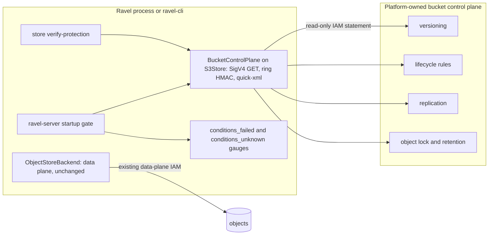

# ADR-1727: bucket protection verification

Status: Accepted (2026-09-16). Amends ADR-0042 decision 3 (the read side
only) and ADR-0072 decision 3. Issue #1727.

## Context

Ravel's deletion, retention, and erasure bounds rest on bucket
configuration that Ravel does not own: versioning paired with a
noncurrent-version expiration rule, an `AbortIncompleteMultipartUpload`
rule, no other expiration or transition rule on a Ravel prefix, Object Lock
on the protected prefixes, and, for a replicated deployment, delete-marker
replication (docs/object-store-contract.md, "Required bucket
configuration"). The disaster-recovery guide turns those into a checklist
of `aws s3api` calls that an operator runs by hand
(docs/guides/disaster-recovery.md, "Platform-CLI verification checklist").

Nothing in the tree runs that checklist. What exists:

- `ObjectLockProbeSource` and `BucketConfigProbeSource` are sibling traits
  beside `ObjectStoreBackend`, and their production impls on
  `dyn ObjectStoreBackend` answer `Unknown` for every field
  (`crates/ravel-object-store/src/conformance.rs:292-316`, `:461-484`).
  Both cite ADR-0042 decision 3 as the reason: a real probe "needs its own
  trait-extending ADR". This is that ADR.
- `bucket_config_alarms` assesses two conditions, versioning without
  expiration and the missing multipart-abort rule
  (`crates/ravel-object-store/src/conformance.rs:418-458`).
- `--require-bucket-protection` refuses startup on `ObjectLockStatus::
  Disabled` or an `ALARM:` entry, and turns `Unknown` into one warning and
  `ravel_bucket_protection_unknown = 1`
  (`services/ravel-server/src/bucket_protection.rs:61-69`, `:138-150`;
  `services/ravel-server/src/metrics.rs:2147-2163`). Every production
  backend answers `Unknown`, so the gate has never refused anything.
- The operator sets `--require-bucket-protection` on every `RavelCluster`
  it renders (`services/ravel-operator/src/reconcile.rs:518-535`).
- `ravel-cli store qualify` prints both probes
  (`services/ravel-cli/src/qualify.rs:63`, `:79`); no `verify-protection`
  command exists.

The `object_store` crate exposes no bucket-configuration API, and the
workspace has no S3 SDK: `Cargo.toml:68` pins `reqwest` and `Cargo.toml:98`
pins `object_store` with its `aws` feature. `ravel-object-store` already
depends on `reqwest` directly and issues plain HTTP from it for the IMDSv2
credential provider
(`crates/ravel-object-store/Cargo.toml:33`,
`crates/ravel-object-store/src/s3/instance_role.rs:345`). SigV4's
HMAC-SHA256 is available from `ring`, already in the graph under
`object_store`, and an XML reader is in the graph as `quick-xml` 0.41, the
release outside the two advisories `deny.toml` tracks.

ADR-0042 rejected a hand-rolled S3 path once, for a different thing: a
second *write* path that would set Object Lock retention on a PUT outside
`object_store`'s retry and error mapping. It reserved a read capability for
"its own ADR extending the `ObjectStoreBackend` trait itself". The
contract doc repeats the stance as "this crate never opens a second,
direct-SDK side channel" (docs/object-store-contract.md, "Required bucket
configuration", enforcement paragraph). Both sentences are about writes to
data; verification is reads of configuration.

## Decision

1. **Transport: hand-rolled SigV4 `GET`s over the existing `reqwest` pin,
   inside `ravel-object-store`.** A new module `s3/bucket_config.rs` signs
   and issues five read-only requests: `GET ?versioning`,
   `GET ?lifecycle`, `GET ?replication`, `GET ?object-lock`, and
   `GET ?retention&versionId=` on sampled keys. Signing uses `ring`'s
   HMAC-SHA256 and SHA-256, which become a direct dependency of the crate;
   responses are read with `quick-xml` 0.41, also a new direct dependency.
   No RustCrypto crate and no AWS SDK enters the tree. Credentials come
   from the same provider `S3Store` already holds (static, session, file,
   or instance role), so there is no second credential path and
   `S3Config`'s "no credential-chain magic" rule
   (`crates/ravel-object-store/src/s3.rs:313-315`) still holds. Every
   request is a `GET`; the module has no write and no way to add one
   without a further ADR. ADR-0042's rejection of a write side channel
   stands unchanged.

2. **`ObjectStoreBackend` is unchanged; a sibling trait carries the
   capability.** `BucketControlPlane` joins `ObjectLockProbeSource` and
   `BucketConfigProbeSource` in `conformance.rs`, with one method that
   returns a `BucketProtectionReport`. `S3Store` implements it
   affirmatively. `MemoryStore` and every other backend return a report
   whose every condition is `Unknown`. `S3Store` also gains concrete impls
   of the two existing probe traits, derived from the same report, so
   `store qualify` and the startup gate see real values on any
   S3-compatible backend while the `dyn ObjectStoreBackend` impls stay as
   they are. This amends ADR-0042 decision 3's wording: the extension is a
   sibling trait, not a method on the backend contract, because the
   `Capabilities` pattern describes data-plane behaviour that `MemoryStore`
   can be the oracle for, and bucket configuration has no in-memory
   semantics to test against. `ravel-cli`'s `build_store` gains a sibling
   that also returns the control-plane handle when the store is S3, and
   `ravel-server` takes the handle before it wraps the store.

3. **The report has one entry per checklist condition, and `Unknown` is
   never `Fail`.** The conditions, with stable identifiers an operator can
   grep for:

   | Id | Condition | Source call |
   |---|---|---|
   | `versioning` | versioning `Enabled` | `?versioning` |
   | `noncurrent-expiration` | an enabled rule with `NoncurrentDays` equal to the expected `E_v` | `?lifecycle` |
   | `expired-delete-marker` | an enabled rule with `ExpiredObjectDeleteMarker` true | `?lifecycle` |
   | `abort-multipart` | an enabled `AbortIncompleteMultipartUpload` rule of 7 days or less | `?lifecycle` |
   | `rule-scope` | the rules above cover every `t/` prefix (empty filter, or a union of prefixes that does) | `?lifecycle` |
   | `no-foreign-rule` | no other expiration or transition rule targets `t/` or `sys/` | `?lifecycle` |
   | `delete-marker-replication` | `DeleteMarkerReplication` `Enabled` | `?replication` |
   | `object-lock` | Object Lock enabled on the bucket | `?object-lock` |
   | `object-retention` | one recent current object per protected prefix family and one noncurrent version carry compliance-mode retention | `?retention` |

   Each entry is `Pass`, `Fail(detail)`, or `Unknown(detail)`. `Unknown`
   covers a backend with no API for the call, an access denial, and a
   response the reader cannot parse. The noncurrent sample reuses the
   listing `verify-custody` already has
   (`crates/ravel-object-store/src/conformance.rs:545-558`).

4. **`ravel-cli store verify-protection`.** The subcommand takes
   `--expected-noncurrent-days <E_v>`, `--expect-replication`, and
   `--expect-object-retention`, because the guide makes those three a
   deployment's choice rather than a constant. It prints one line per
   condition and exits `0` only when every expected condition is `Pass`.
   Any `Fail` exits `1` and names each failed condition. Any expected
   condition left `Unknown`, or a control plane that cannot be reached,
   exits `2` and names each, never `0`: "could not verify" is not "verified".
   The read-only IAM actions it needs (`GetBucketVersioning`,
   `GetLifecycleConfiguration`, `GetReplicationConfiguration`,
   `GetBucketObjectLockConfiguration`, `GetObjectRetention`,
   `ListBucketVersions`) ship as a separate statement in the IAM templates,
   so the ingest and query roles gain nothing.

5. **In-process gate and gauges.** Under `--require-bucket-protection` the
   startup check runs the same report. Fatal: `versioning` on without
   `noncurrent-expiration` (the existing `ALARM`), `abort-multipart` absent
   (the contract calls it required; today it is a `NOTE` only because it
   was unobservable), `no-foreign-rule` failed, and `object-lock` disabled
   (already fatal under ADR-0072 decision 3). The server has no expected
   `E_v` and no replication or retention expectation, so
   `noncurrent-expiration` checks presence in-process and the exact value
   only in the CLI; `delete-marker-replication` and `object-retention` are
   CLI-only. `Unknown` stays a warning plus gauge, as ADR-0072 decided.

   Two gauges carry the result: `ravel_bucket_protection_conditions_failed`
   is the count of conditions observed `Fail` at the last startup check,
   and `ravel_bucket_protection_conditions_unknown` is the count observed
   `Unknown`. Both read `0` when the flag is off, matching the existing
   gauge. `ravel_bucket_protection_unknown` keeps its name and its alert
   contract and becomes `1` whenever `conditions_unknown` is nonzero. The
   meaning while a backend answers `Unknown` is therefore explicit: a zero
   on `conditions_failed` is evidence only when `conditions_unknown` is
   also zero, and the guide's alert rule says so. The check runs at
   startup; a periodic recheck is a follow-up task, not part of this
   decision.

6. **The MinIO contract job proves the negative path.** The
   `object-store-contract` job already starts MinIO and creates the bucket
   with `mc` (`.github/workflows/ci.yml:1166-1230`). It gains one case per
   breakable condition, each breaking exactly one: `mc version suspend` for
   `versioning`, and `mc ilm rule rm` for the lifecycle conditions. Each
   asserts exit `1` and the named condition, and a control case asserts
   exit `0` on the compliant bucket. Replication and retention are
   exercised through the fixture source only: the job's MinIO has no
   replication target, and its bucket is created without lock.

## Rejected alternatives

- **Add `aws-sdk-s3`.** A second S3 client stack (smithy runtime, its own
  TLS and credential chain) beside `object_store`, dozens of crates, and a
  credential path that is not `S3Config`, for five `GET`s. The hand-rolled
  path is under two hundred lines and reuses the provider the store holds.
- **Shell out to `aws` or `mc`.** Neither is in the server image or
  guaranteed on an operator host, their output formats are unversioned,
  the credentials would have to be re-expressed for the external tool,
  and the in-process gauge could not use it.
- **A capability-gated method on `ObjectStoreBackend`.** The trait's
  contract is tested against `MemoryStore` as the oracle; bucket
  configuration has no in-memory semantics, so the method would be a
  no-op on every backend but one. The sibling trait is the shape the two
  existing probes already chose.
- **Presigned URLs from `object_store`'s `Signer`.** It signs an object
  path. Bucket subresource queries and `GetObjectRetention` with a version
  id are not expressible through it.
- **Keep the checklist manual and document a cron of `aws s3api`.** That is
  the status quo the ticket describes: nothing ties the outcome to a
  gauge, an exit code, or a startup gate.
- **Repair the configuration from Ravel (`PutBucketLifecycle`).** Writes to
  the control plane are exactly the side channel ADR-0042 rejected, and
  bucket policy belongs to the platform team. Verification names the
  failed condition; it does not fix it.

## Consequences

- The startup gate stops being vacuous on S3-compatible backends. A
  deployment on `--require-bucket-protection` whose bucket has versioning
  on without expiration, no multipart-abort rule, a foreign lifecycle
  rule, or Object Lock disabled refuses to start where it started with a
  warning before. The operator sets that flag on every `RavelCluster`, so
  every operator-managed MinIO bucket must be created with lock and carry
  the two sanctioned rules. The kind lane, the compose files, and
  `deploy/k8s/minio.yaml` create compliant buckets in the same commit as
  the gate change, and the kubernetes guide states the `mc` commands. This
  is the change a fail-closed default sweeps into every launcher, and it is
  listed rather than discovered.
- For an operator: a new subcommand to schedule (the guide states at least
  daily and after any bucket-policy change), one read-only IAM statement to
  attach to the identity that runs it, and two gauges to alert on. The
  contract doc's "never opens a second, direct-SDK side channel" sentence
  is narrowed to writes.
- Two new direct dependencies in `ravel-object-store`, `ring` and
  `quick-xml` 0.41, both already in the lock. `quick-xml` at 0.41 is
  outside the advisory range; `check-quick-xml-entry-points.sh` only
  counts parents of affected versions, so it stays green, and the
  supply-chain job's `cargo deny` sees no new advisory.
- `Unknown` remains distinct from `Fail` in every output, so a backend
  that cannot answer never reads as compliant and never reads as broken.
- Follow-up work, as tasks:
  1. ravel-object-store: `s3/bucket_config.rs`, `BucketControlPlane`,
     `BucketProtectionReport`, the `S3Store` impls, a fixture source for
     every condition state, and a fake-endpoint test that drives the
     signer and reader over HTTP.
  2. ravel-cli: `store verify-protection`, its flags, exit codes, and
     `store::tests::verify_protection_names_each_failed_condition`.
  3. ravel-server: extend the gate's fatal set, add the two gauges, render
     them in `metrics.rs`, and document them.
  4. Docs and launchers: the disaster-recovery guide's scheduled run, the
     contract doc narrowing, the IAM template statement, and compliant
     bucket creation in the kind lane, compose, and `deploy/k8s`.
  5. CI: the contract-job cases of decision 6.
  6. Follow-up: a `--bucket-protection-recheck-interval` that reruns the
     report in-process and moves the gauges without a restart.
