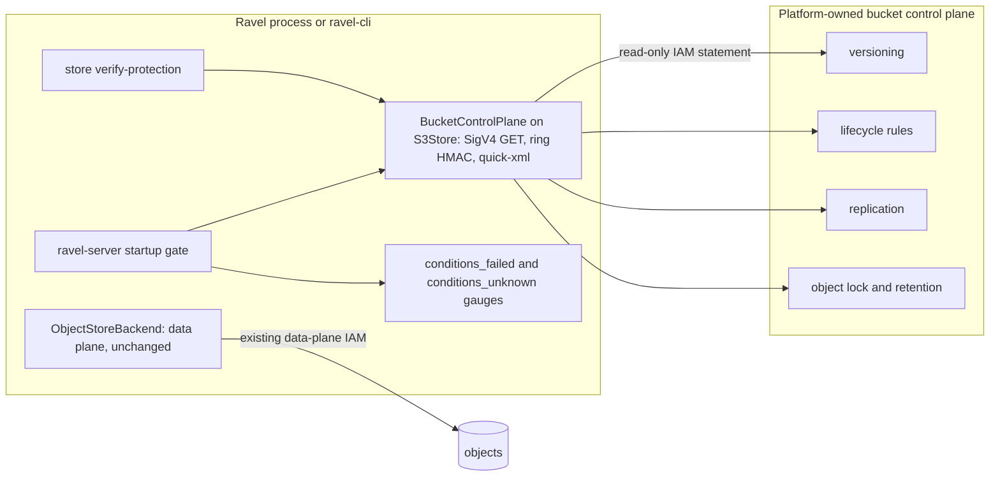

# ADR-1727: bucket protection verification

Status: Accepted (2026-09-16). Amends ADR-0042 decision 3 (the read side
only) and ADR-0072 decision 3. Issue #1727.

## Context

Ravel's deletion, retention, and erasure bounds rest on bucket
configuration that Ravel does not own: versioning paired with a
noncurrent-version expiration rule, an `AbortIncompleteMultipartUpload`
rule, no other expiration or transition rule on a Ravel prefix, Object Lock
on the protected prefixes, and, for a replicated deployment, delete-marker
replication (docs/object-store-contract.md, "Required bucket
configuration"). The disaster-recovery guide turns those into a checklist
of `aws s3api` calls that an operator runs by hand
(docs/guides/disaster-recovery.md, "Platform-CLI verification checklist").

Nothing in the tree runs that checklist. What exists:

- `ObjectLockProbeSource` and `BucketConfigProbeSource` are sibling traits
  beside `ObjectStoreBackend`, and their production impls on
  `dyn ObjectStoreBackend` answer `Unknown` for every field
  (`crates/ravel-object-store/src/conformance.rs:292-316`, `:461-484`).
  Both cite ADR-0042 decision 3 as the reason: a real probe "needs its own
  trait-extending ADR". This is that ADR.
- `bucket_config_alarms` assesses two conditions, versioning without
  expiration and the missing multipart-abort rule
  (`crates/ravel-object-store/src/conformance.rs:418-458`).
- `--require-bucket-protection` refuses startup on `ObjectLockStatus::
  Disabled` or an `ALARM:` entry, and turns `Unknown` into one warning and
  `ravel_bucket_protection_unknown = 1`
  (`services/ravel-server/src/bucket_protection.rs:61-69`, `:138-150`;
  `services/ravel-server/src/metrics.rs:2147-2163`). Every production
  backend answers `Unknown`, so the gate has never refused anything.
- The operator sets `--require-bucket-protection` on every `RavelCluster`
  it renders (`services/ravel-operator/src/reconcile.rs:518-535`).
- `ravel-cli store qualify` prints both probes
  (`services/ravel-cli/src/qualify.rs:63`, `:79`); no `verify-protection`
  command exists.

The `object_store` crate exposes no bucket-configuration API, and the
workspace has no S3 SDK: `Cargo.toml:68` pins `reqwest` and `Cargo.toml:98`
pins `object_store` with its `aws` feature. `ravel-object-store` already
depends on `reqwest` directly and issues plain HTTP from it for the IMDSv2
credential provider
(`crates/ravel-object-store/Cargo.toml:33`,
`crates/ravel-object-store/src/s3/instance_role.rs:345`). SigV4's
HMAC-SHA256 is available from `ring`, already in the graph under
`object_store`, and an XML reader is in the graph as `quick-xml` 0.41, the
release outside the two advisories `deny.toml` tracks.

ADR-0042 rejected a hand-rolled S3 path once, for a different thing: a
second *write* path that would set Object Lock retention on a PUT outside
`object_store`'s retry and error mapping. It reserved a read capability for
"its own ADR extending the `ObjectStoreBackend` trait itself". The
contract doc repeats the stance as "this crate never opens a second,
direct-SDK side channel" (docs/object-store-contract.md, "Required bucket
configuration", enforcement paragraph). Both sentences are about writes to
data; verification is reads of configuration.

## Decision

1. **Transport: hand-rolled SigV4 `GET`s over the existing `reqwest` pin,
   inside `ravel-object-store`.** A new module `s3/bucket_config.rs` signs
   and issues five read-only requests: `GET ?versioning`,
   `GET ?lifecycle`, `GET ?replication`, `GET ?object-lock`, and
   `GET ?retention&versionId=` on sampled keys. Signing uses `ring`'s
   HMAC-SHA256 and SHA-256, which become a direct dependency of the crate;
   responses are read with `quick-xml` 0.41, also a new direct dependency.
   No RustCrypto crate and no AWS SDK enters the tree. Credentials come
   from the same provider `S3Store` already holds (static, session, file,
   or instance role), so there is no second credential path and
   `S3Config`'s "no credential-chain magic" rule
   (`crates/ravel-object-store/src/s3.rs:313-315`) still holds. Every
   request is a `GET`; the module has no write and no way to add one
   without a further ADR. ADR-0042's rejection of a write side channel
   stands unchanged.

2. **`ObjectStoreBackend` is unchanged; a sibling trait carries the
   capability.** `BucketControlPlane` joins `ObjectLockProbeSource` and
   `BucketConfigProbeSource` in `conformance.rs`, with one method that
   returns a `BucketProtectionReport`. `S3Store` implements it
   affirmatively. `MemoryStore` and every other backend return a report
   whose every condition is `Unknown`. `S3Store` also gains concrete impls
   of the two existing probe traits, derived from the same report, so
   `store qualify` and the startup gate see real values on any
   S3-compatible backend while the `dyn ObjectStoreBackend` impls stay as
   they are. This amends ADR-0042 decision 3's wording: the extension is a
   sibling trait, not a method on the backend contract, because the
   `Capabilities` pattern describes data-plane behaviour that `MemoryStore`
   can be the oracle for, and bucket configuration has no in-memory
   semantics to test against. `ravel-cli`'s `build_store` gains a sibling
   that also returns the control-plane handle when the store is S3, and
   `ravel-server` takes the handle before it wraps the store.

3. **The report has one entry per checklist condition, and `Unknown` is
   never `Fail`.** The conditions, with stable identifiers an operator can
   grep for:

   | Id | Condition | Source call |
   |---|---|---|
   | `versioning` | versioning `Enabled` | `?versioning` |
   | `noncurrent-expiration` | an enabled rule with `NoncurrentDays` equal to the expected `E_v` | `?lifecycle` |
   | `expired-delete-marker` | an enabled rule with `ExpiredObjectDeleteMarker` true | `?lifecycle` |
   | `abort-multipart` | an enabled `AbortIncompleteMultipartUpload` rule of 7 days or less | `?lifecycle` |
   | `rule-scope` | the rules above cover every `t/` prefix (empty filter, or a union of prefixes that does) | `?lifecycle` |
   | `no-foreign-rule` | no other expiration or transition rule targets `t/` or `sys/` | `?lifecycle` |
   | `delete-marker-replication` | `DeleteMarkerReplication` `Enabled` | `?replication` |
   | `object-lock` | Object Lock enabled on the bucket | `?object-lock` |
   | `object-retention` | one recent current object per protected prefix family and one noncurrent version carry compliance-mode retention | `?retention` |

   Each entry is `Pass`, `Fail(detail)`, or `Unknown(detail)`. `Unknown`
   covers a backend with no API for the call, an access denial, and a
   response the reader cannot parse. The noncurrent sample reuses the
   listing `verify-custody` already has
   (`crates/ravel-object-store/src/conformance.rs:545-558`). `rule-scope`
   and `noncurrent-expiration` are evaluated more narrowly than the table
   states; see the rule-scope and noncurrent-expiration amendment below.

4. **`ravel-cli store verify-protection`.** The subcommand takes
   `--expected-noncurrent-days <E_v>`, `--expect-replication`, and
   `--expect-object-retention`, because the guide makes those three a
   deployment's choice rather than a constant. It prints one line per
   condition and exits `0` only when every expected condition is `Pass`.
   Any `Fail` exits `1` and names each failed condition. Any expected
   condition left `Unknown`, or a control plane that cannot be reached,
   exits `2` and names each, never `0`: "could not verify" is not "verified".
   The read-only IAM actions it needs (`GetBucketVersioning`,
   `GetLifecycleConfiguration`, `GetReplicationConfiguration`,
   `GetBucketObjectLockConfiguration`, `GetObjectRetention`,
   `ListBucketVersions`) ship as a separate statement in the IAM templates,
   so the ingest and query roles gain nothing. (Narrowed by the
   verify-protection retention amendment below: the command does not check
   `object-retention` yet, takes no option for it, and prints it as not
   checked without letting it affect the exit code, so of the actions above
   it needs only the four bucket-configuration ones.)

5. **In-process gate and gauges.** Under `--require-bucket-protection` the
   startup check runs the same report. Fatal: `versioning` on without
   `noncurrent-expiration` (the existing `ALARM`), `abort-multipart` absent
   (the contract calls it required; today it is a `NOTE` only because it
   was unobservable), `no-foreign-rule` failed, and `object-lock` disabled
   (already fatal under ADR-0072 decision 3). The server has no expected
   `E_v` and no replication or retention expectation, so
   `noncurrent-expiration` checks presence in-process (narrowed by the
   server gate amendment below: the gate also fails the condition on rules
   that keep noncurrent versions longer, covering rules that disagree on
   `NoncurrentDays`, or rules that expire noncurrent versions sooner) and
   the exact value only in the CLI; `delete-marker-replication` and
   `object-retention` are
   CLI-only (and `object-retention` is not checked by the CLI either yet: see
   the verify-protection retention amendment below). `Unknown` stays a
   warning plus gauge, as ADR-0072 decided.

   Two gauges carry the result: `ravel_bucket_protection_conditions_failed`
   is the count of conditions observed `Fail` at the last startup check,
   and `ravel_bucket_protection_conditions_unknown` is the count observed
   `Unknown`. Both read `0` when the flag is off, matching the existing
   gauge. `ravel_bucket_protection_unknown` keeps its name and its alert
   contract and becomes `1` whenever `conditions_unknown` is nonzero. The
   meaning while a backend answers `Unknown` is therefore explicit: a zero
   on `conditions_failed` is evidence only when `conditions_unknown` is
   also zero, and the guide's alert rule says so. The check runs at
   startup; a periodic recheck is a follow-up task, not part of this
   decision.

6. **The MinIO contract job proves the negative path.** The
   `object-store-contract` job already starts MinIO and creates the bucket
   with `mc` (`.github/workflows/ci.yml:1166-1230`). It gains one case per
   breakable condition, each breaking exactly one: `mc version suspend` for
   `versioning`, and `mc ilm rule rm` for the lifecycle conditions. Each
   asserts exit `1` and the named condition, and a control case asserts
   exit `0` on the compliant bucket. Replication and retention are
   exercised through the fixture source only: the job's MinIO has no
   replication target, and its bucket is created without lock. (See the
   launcher substitution amendment below: the job runs RustFS, not MinIO,
   and these cases are not in any workflow yet; they are now, see the
   verify-protection cases amendment below.)

```mermaid
flowchart LR
    subgraph ravel [Ravel process or ravel-cli]
        CLI[store verify-protection]
        SRV[ravel-server startup gate]
        CP[BucketControlPlane on S3Store: SigV4 GET, ring HMAC, quick-xml]
        DP[ObjectStoreBackend: data plane, unchanged]
        CLI --> CP
        SRV --> CP
        SRV --> G[conditions_failed and conditions_unknown gauges]
    end
    subgraph platform [Platform-owned bucket control plane]
        V[versioning]
        L[lifecycle rules]
        R[replication]
        O[object lock and retention]
    end
    CP -->|read-only IAM statement| V
    CP --> L
    CP --> R
    CP --> O
    DP -->|existing data-plane IAM| S3[(objects)]
```

## Rejected alternatives

- **Add `aws-sdk-s3`.** A second S3 client stack (smithy runtime, its own
  TLS and credential chain) beside `object_store`, dozens of crates, and a
  credential path that is not `S3Config`, for five `GET`s. The hand-rolled
  path is under two hundred lines and reuses the provider the store holds.
- **Shell out to `aws` or `mc`.** Neither is in the server image or
  guaranteed on an operator host, their output formats are unversioned,
  the credentials would have to be re-expressed for the external tool,
  and the in-process gauge could not use it.
- **A capability-gated method on `ObjectStoreBackend`.** The trait's
  contract is tested against `MemoryStore` as the oracle; bucket
  configuration has no in-memory semantics, so the method would be a
  no-op on every backend but one. The sibling trait is the shape the two
  existing probes already chose.
- **Presigned URLs from `object_store`'s `Signer`.** It signs an object
  path. Bucket subresource queries and `GetObjectRetention` with a version
  id are not expressible through it.
- **Keep the checklist manual and document a cron of `aws s3api`.** That is
  the status quo the ticket describes: nothing ties the outcome to a
  gauge, an exit code, or a startup gate.
- **Repair the configuration from Ravel (`PutBucketLifecycle`).** Writes to
  the control plane are exactly the side channel ADR-0042 rejected, and
  bucket policy belongs to the platform team. Verification names the
  failed condition; it does not fix it.

## Consequences

- The startup gate stops being vacuous on S3-compatible backends. A
  deployment on `--require-bucket-protection` whose bucket has versioning
  on without expiration, no multipart-abort rule, a foreign lifecycle
  rule, or Object Lock disabled refuses to start where it started with a
  warning before. The operator sets that flag on every `RavelCluster`, so
  every operator-managed MinIO bucket must be created with lock and carry
  the two sanctioned rules. The kind lane, the compose files, and
  `deploy/k8s/minio.yaml` create compliant buckets in the same commit as
  the gate change (see the launcher substitution amendment below), and the
  kubernetes guide states the `mc` commands (the guide states `aws s3api`
  commands instead; see the same amendment). This
  is the change a fail-closed default sweeps into every launcher, and it is
  listed rather than discovered.
- For an operator: a new subcommand to schedule (the guide states at least
  daily and after any bucket-policy change), one read-only IAM statement to
  attach to the identity that runs it, and two gauges to alert on. The
  contract doc's "never opens a second, direct-SDK side channel" sentence
  is narrowed to writes.
- Two new direct dependencies in `ravel-object-store`, `ring` and
  `quick-xml` 0.41, both already in the lock. `quick-xml` at 0.41 is
  outside the advisory range; `check-quick-xml-entry-points.sh` only
  counts parents of affected versions, so it stays green, and the
  supply-chain job's `cargo deny` sees no new advisory.
- `Unknown` remains distinct from `Fail` in every output, so a backend
  that cannot answer never reads as compliant and never reads as broken.
- Follow-up work, as tasks:
  1. ravel-object-store: `s3/bucket_config.rs`, `BucketControlPlane`,
     `BucketProtectionReport`, the `S3Store` impls, a fixture source for
     every condition state, and a fake-endpoint test that drives the
     signer and reader over HTTP.
  2. ravel-cli: `store verify-protection`, its flags, exit codes, and
     `store::tests::verify_protection_names_each_failed_condition`.
  3. ravel-server: extend the gate's fatal set, add the two gauges, render
     them in `metrics.rs`, and document them.
  4. Docs and launchers: the disaster-recovery guide's scheduled run, the
     contract doc narrowing, the IAM template statement, and compliant
     bucket creation in the kind lane, compose, and `deploy/k8s`.
  5. CI: the contract-job cases of decision 6.
  6. Follow-up: a `--bucket-protection-recheck-interval` that reruns the
     report in-process and moves the gauges without a restart.

## Amendment (2026-09-29): rule-scope and noncurrent-expiration are narrower than the decision 3 table

<!-- amendment-applies: sections="Decision" pointer="rule-scope and noncurrent-expiration amendment" -->

The control plane as built evaluates two decision 3 conditions more
narrowly than the table states. Neither narrowing can turn a non-compliant
bucket into `Pass`: each leaves a condition `Unknown` or `Fail` where the
table's wording alone would allow `Pass`.

1. **`rule-scope`: the only union of prefixes accepted is sixteen rules.**
   The table accepts "a union of prefixes that does" cover every `t/`
   prefix. The code accepts exactly one union: enabled rules whose whole
   scope is the plain prefix `t/<d>`, at least one for each of the sixteen
   lowercase hex digits `t/0` through `t/f`, each carrying the action with
   the value a covering rule needs. Every key Ravel writes under `t/`
   starts with a lowercase hex digit (the tenant hash), and over an
   arbitrary key alphabet no other finite set of narrower prefixes can be
   shown to cover `t/`. A union split further down (`t/f0` through `t/ff`
   in place of `t/f`), a digit spelled in upper case, or a digit with no
   rule proves nothing, and the narrower rules leave the lifecycle
   conditions `Unknown`. The same union is what the other lifecycle
   conditions and `delete-marker-replication` accept as coverage.

2. **`noncurrent-expiration` fails in cases the table does not name.** Besides
   a covering rule whose `NoncurrentDays` differs from the expected `E_v`,
   the condition fails when a covering rule also keeps
   `NewerNoncurrentVersions` (a version can then outlive `NoncurrentDays`),
   when covering rules disagree on `NoncurrentDays`, and when a rule over
   part of `t/` expires noncurrent versions earlier than the reference: the
   expected `E_v` when one is supplied, else the one value the covering
   rules agree on. With no reference to compare against, that narrower rule
   leaves the condition `Unknown`. Without an expected `E_v`, as on the
   server, a covering rule's value is not checked, as decision 5 states.

Under decision 4, an expected condition these readings leave `Unknown`
makes `store verify-protection` exit `2`, never `0`. A bucket whose rules
cover `t/` in a form the code does not prove reads as "could not verify":
the operator restates the rules as one rule over `t/` (or the whole
bucket) or as the sixteen-rule union, or confirms coverage out of band.

## Amendment (2026-09-30): verify-protection does not check object-retention yet

<!-- amendment-applies: sections="Decision" pointer="verify-protection retention amendment" -->

`store verify-protection` as built (follow-up task 2) does not check
`object-retention`. It takes no option for it, samples no object, and
prints the condition as not checked by this command; the condition never
affects the exit code, so exit `0` says nothing about per-object retention.

Every sampling rule tried misreported a correctly configured bucket. The
newest object in a family is not locked yet under a mechanism that applies
retention after the write, and the newest object older than a fixed window
still reads wrong under clock skew, under a retention period shorter than
the window, for catalog snapshot and index objects the sanctioned HEAD-only
posture never locks, and for create-if-absent keys that never have the
noncurrent version the control plane samples. Which objects a sample should
read is open, and is issue #2228's to decide. Until then an operator checks
object retention by hand, as the disaster recovery guide describes.

The control plane's reading of a sample is unchanged for any caller that
supplies one: a sampled object whose `RetainUntilDate` has passed reads
`Unknown`, not `Fail`, since a lapsed lock on an object older than the
retention period says nothing about the retention on new writes. A sampled
object with no retention at all, or with governance-mode retention, still
reads `Fail`.

## Amendment (2026-09-30): the server gate's noncurrent-expiration reading and its read deadline

<!-- amendment-applies: sections="Decision" pointer="server gate amendment" -->
<!-- amendment-supersedes: phrase="checks presence in-process" pointer="server gate amendment" -->

The startup gate as built (follow-up task 3) differs from decision 5 in two
ways.

1. **`noncurrent-expiration` is more than a presence check in-process.**
   Decision 5 says the condition checks presence in-process and the exact
   value only in the CLI. The server still supplies no expected `E_v`, so it
   never compares a covering rule's `NoncurrentDays` with one. The condition
   reads the rules as the rule-scope and noncurrent-expiration amendment
   above describes, though, so on a versioned bucket the gate also refuses
   to start when a covering rule keeps `NewerNoncurrentVersions`, when
   covering rules disagree on `NoncurrentDays`, and when a rule over part of
   `t/` expires noncurrent versions sooner than the value the covering rules
   agree on.

2. **The bucket-configuration read has a deadline.** The server bounds its
   whole read of the report (the three GETs `?versioning`, `?lifecycle` and
   `?object-lock`) with one 10 s deadline. A read that has not finished by
   then counts every checked condition `Unknown`, which logs a warning,
   sets the gauges and starts, as decision 5 and ADR-0072 decided for
   `Unknown`; it never refuses. The value comes from the operator's liveness
   probe (5 s initial delay, 10 s period, failure threshold 3), which
   restarts a pod on its third consecutive failure, between about 25 s and
   35 s after the pod starts depending on the probe's tick phase. The
   read-cache warm-up also runs before the main HTTP listener binds, which
   the probe targets unless `dedicated_health_port` is set, and is bounded
   by its own 10 s, so the two bounds together leave at least 5 s of the
   earliest restart for the rest of startup.
   The deadline covers the bucket-configuration read only. The
   `sys/qualification` read that runs before it (ADR-0050 section 6) goes
   through the retrying data-plane store and is bounded only by the store's
   own request timeout and retries, so an endpoint that stalls every request
   holds startup at that read first; the deadline helps when only the
   control-plane GETs stall.

## Amendment (2026-09-30): the launcher substitution, floci and RustFS in place of MinIO

<!-- amendment-applies: sections="Decision|Consequences" pointer="launcher substitution amendment" -->
<!-- amendment-supersedes: phrase="deploy/k8s/minio.yaml" pointer="launcher substitution amendment" -->
<!-- amendment-supersedes: phrase="states the `mc` commands" pointer="launcher substitution amendment" -->

The Consequences name a `deploy/k8s/minio.yaml` manifest and say the
kubernetes guide states `mc` commands. Neither is in the tree. The kind
environment runs floci as its default fake-S3 backend and RustFS as its
fallback (ADR-0034 decision 8), and every launcher that creates a bucket
for a `--require-bucket-protection` server does so with the AWS CLI or
with plain S3 requests:

- `deploy/k8s/floci.yaml`, whose create Job sends S3's own XML over curl.
- `deploy/k8s/rustfs.yaml`, and the `createbucket` step of
  `deploy/docker-compose/ravel.yml` and `deploy/docker-compose/rustfs.yml`,
  which use the AWS CLI.
- `scripts/ci-create-bucket.sh`, the helper CI jobs run against their
  RustFS endpoint, which uses the AWS CLI (issue #2257).

Each creates the bucket with Object Lock enabled, turns versioning on, puts
the one whole-bucket lifecycle rule (expired delete markers,
`NoncurrentDays` 1, multipart abort after 7 days), and reads all three
back. The `launcher_lifecycle_documents_pass_every_in_process_condition`
test in `ravel-object-store` reads the lifecycle document from each of them
and checks it against the startup gate's in-process conditions. The
kubernetes guide states the commands for a real bucket as `aws s3api`
calls. The consequence itself stands: every launcher creates a compliant
bucket.

Decision 6 has the same substitution. The `object-store-contract` job runs
RustFS and creates its bucket with `scripts/ci-create-bucket.sh`, so its
bucket is now versioned and Object Lock enabled. The negative cases the
decision describes (one per breakable condition, plus the compliant
control) are not in any workflow yet (they are now: see the
verify-protection cases amendment below). When they are added, they break a
condition with the AWS CLI (`put-bucket-versioning` with
`Status=Suspended`, `delete-bucket-lifecycle` or a narrowed rule) instead
of `mc`.

## Amendment (2026-10-09): the verify-protection cases run in the object-store-contract job

<!-- amendment-applies: sections="Decision|Amendment (2026-09-30): the launcher substitution, floci and RustFS in place of MinIO" pointer="verify-protection cases amendment" -->
<!-- amendment-supersedes: phrase="not in any workflow yet" pointer="verify-protection cases amendment" -->

Decision 6's cases now run in the `object-store-contract` job of
`.github/workflows/ci.yml` (issue #2672). After the contract suite, the job
builds `ravel-cli` and runs `scripts/ci-verify-protection-cases.sh` against
its RustFS bucket, the one `scripts/ci-create-bucket.sh` provisioned. The
helper runs `store verify-protection --expected-noncurrent-days 1` on the
compliant bucket and expects exit `0` (the control case). Each breaking case
then changes one setting with the AWS CLI, expects exit `1` with exactly the
listed conditions failed on the condition lines and in the summary and none
left could-not-verify, puts the setting back, and expects exit `0` again:

| Case | Change | Failed conditions |
|---|---|---|
| `versioning-suspended` | `put-bucket-versioning` with `Status=Suspended` | `versioning` |
| `no-noncurrent-expiration` | lifecycle re-put without `NoncurrentVersionExpiration` | `noncurrent-expiration`, `rule-scope` |
| `no-expired-delete-marker` | lifecycle re-put without `ExpiredObjectDeleteMarker` | `expired-delete-marker`, `rule-scope` |
| `no-abort-multipart` | lifecycle re-put without `AbortIncompleteMultipartUpload` | `abort-multipart`, `rule-scope` |
| `foreign-rule` | lifecycle re-put with a second rule expiring `sys/` after 30 days | `no-foreign-rule` |

Decision 6 says each case breaks exactly one condition. The three removal
cases cannot: when no enabled rule covering `t/` carries a sanctioned action,
the control plane fails `rule-scope` as well as the action's own condition,
so each of those cases asserts that exact pair. `rule-scope` is therefore
broken only together with an action condition.

A change the store rejects with a non-transient error, or a broken state the
subcommand reports as could-not-verify for the case's own condition, makes
that case `SKIPPED` with the reason, and the helper fails when every breaking
case is skipped. A restore that fails, or a bucket that does not read
compliant after one, fails the job and says the bucket was left broken. The
helper's own behaviour is pinned without a store by
`scripts/ci-verify-protection-cases.test.sh`, which runs in the `doc-scripts`
job.

Four conditions stay out of the job. `versioning` is not broken in practice:
the case is attempted, but RustFS refuses to suspend versioning on a bucket
that carries an Object Lock configuration (`InvalidBucketState`), as AWS S3
does, and the CI bucket carries one, so the case reports `SKIPPED` on every
run. Its `Fail` path stays covered by a fixture
(`versioning_passes_only_when_enabled` in `ravel-object-store`).
`object-lock` is not broken: the
bucket is created with Object Lock and S3 has no call that disables it, so
its `Fail` path stays covered by fixtures
(`store::tests::verify_protection_names_each_failed_condition` in
`ravel-cli`, `replication_and_object_lock_not_configured_codes_fail` in
`ravel-object-store`). `delete-marker-replication` is fixture-only, as
decision 6 states: the job's store has no replication target, and the
helper does not pass `--expect-replication`. `object-retention` is not
checked by the subcommand at all (see the verify-protection retention
amendment above).
