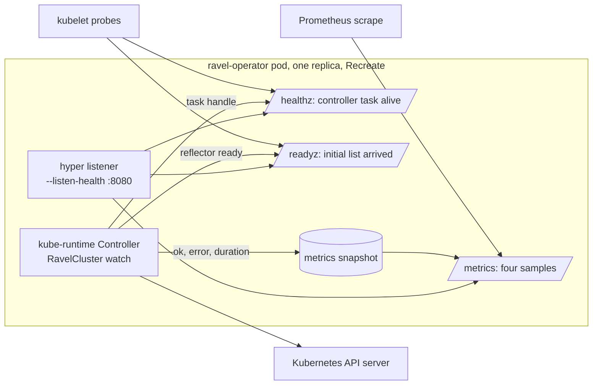

# ADR-1731: operator health, metrics and topology

Status: Accepted (2026-09-16). Issue #1731. Amends ADR-0034 (adds the
operator's own listener, probes and supported topology; ADR-0034 decision 4
covers the server's probes only).

## Context

The operator has no listener. `services/ravel-operator/src/main.rs` declares
two flags, `--print-crd` and `--otlp-trace-endpoint` (`main.rs:17-41`), and
starts `controller::run()` on a bare `#[tokio::main]` runtime
(`main.rs:62-63, 104-121`). Its own doc comment says it "renders no
`/metrics`" (`main.rs:44-50`). The Deployment declares one replica with a
`Recreate` strategy and the comment "The operator is not designed for
concurrent active instances" (`deploy/k8s/operator/operator.yaml:24-28`),
and no ports, probes or scrape annotation (`operator.yaml:39-51`). The
image stage says "No ports: the operator makes outbound calls to the
Kubernetes API server and serves nothing itself" (`Dockerfile:108-109`).
The ClusterRole grants no `coordination.k8s.io` leases
(`deploy/k8s/operator/rbac.yaml:76-135`).

The reconcile loop is a kube-runtime `Controller` over a reflected
`RavelCluster` watch (`services/ravel-operator/src/controller.rs:2805-2827`).
A success requeues after `RESYNC` = 300 s, a failure after `RETRY` = 30 s
(`controller.rs:70, 73, 2716-2720`). The only per-reconcile signal is a log
line (`controller.rs:2821-2826`). The code itself names the gap: a
`/version` read that hangs would leave the controller pending "with no
`RavelCluster` ever reconciled and no liveness probe to restart the pod"
(`controller.rs:86-88`). An operator that has stopped reconciling is
indistinguishable, from outside, from one with nothing to do.

The workspace already pins `hyper = "1.11"` and nothing uses it
(`Cargo.toml:62`); `tokio` carries the `net` and `signal` features
(`Cargo.toml:56`). `ravel-server` renders `/metrics` with a hand-written
Prometheus text encoder, chosen over the `prometheus` and `metrics` crates
by ADR-0044 rejected alternative 3 (`services/ravel-server/src/metrics.rs:1-9`);
its encoding helpers are private functions of that crate
(`metrics.rs:481-559`). Server metric names carry the `ravel_` prefix,
counters end in `_total`, gauges carry unit suffixes
(`metrics.rs:589, 1707`). The server's probes are `/healthz` and `/readyz`
(`services/ravel-server/src/health.rs:214-218`), and the operator renders
them for every server tier with period 10 s, timeout 2 s, failure threshold
3 (`services/ravel-operator/src/reconcile.rs:601-632`).

## Decision

1. **Single replica with `Recreate` is the supported operator topology, and
   the guide says so.** One CRD, stateless children, and server-side apply
   with one field manager make the reconcile load small and each apply
   idempotent. A second active replica is not supported: both would race
   the `sys/auth` compare-and-swap the guide already warns about
   (`docs/guides/kubernetes.md:302-307`) and could create duplicate
   qualification Jobs. The manifest keeps `replicas: 1` and `Recreate`, and
   the guide gains the sentence that raising the count is unsupported.
   Leader election is not added.

2. **The operator serves `/healthz`, `/readyz` and `/metrics` on one
   listener, `--listen-health` (default `0.0.0.0:8080`).** The stack is
   `hyper` 1 with `hyper-util` and `http-body-util`: three fixed paths need
   no router, and this is the workspace's first direct use of its existing
   `hyper` pin. The two helper crates are new direct dependencies already
   present in the lock file. The listener starts before the controller and
   answers 503 on `/readyz` until decision 4's condition holds.

3. **Four metrics, named by the server's conventions, rendered by a
   hand-written encoder in `services/ravel-operator/src/metrics.rs`.**
   - `ravel_operator_reconciles_total{result="ok"|"error"}`, counter.
   - `ravel_operator_reconcile_duration_seconds`, histogram with the
     server's bucket set.
   - `ravel_operator_last_successful_reconcile_timestamp_seconds`, gauge,
     zero until the first success.
   - `ravel_operator_watched_clusters`, gauge, the reflector store size.
   The encoder copies the server's pattern (a closed label set, `# HELP`
   and `# TYPE` lines, `text/plain; version=0.0.4`) for four samples; it
   does not share code with the server, whose helpers are private.

4. **Liveness is "the controller future is running"; readiness is "the
   initial watch list has arrived".** `/healthz` returns 200 while the
   spawned controller task has not terminated and 503 once it has, so a
   stream that ends or a startup that hangs gets the pod restarted.
   `/readyz` returns 200 once the `RavelCluster` reflector has delivered
   its initial list. The age of the last successful reconcile is not a
   liveness signal: a quiet cluster reconciles only every `RESYNC`, and an
   erroring reconcile is already visible as `result="error"`.

5. **The Deployment gains a named `health` container port, both probes and
   a scrape annotation.** Probe cadence matches what the operator renders
   for the server tiers: liveness `/healthz` with initial delay 5 s,
   readiness `/readyz` with initial delay 2 s, both period 10 s, timeout
   2 s, failure threshold 3. The image comment and the operator's own
   "serves nothing" statements are corrected in the same change.

## Rejected alternatives

- **Lease-based leader election with two or more replicas.** It adds
  `coordination.k8s.io` RBAC, a lease renewal loop and a failover mode to
  test, to protect a loop that reconciles one CRD every 300 s. Recreate
  already bounds the outage of a rollout to one pod start. Revisit if a
  RavelCluster count or a reconcile cost ever makes a single pod the
  bottleneck.
- **axum for the listener.** It brings `tower` and routing for three
  fixed paths; the server uses it because it has a real route table. The
  ingest router made the same choice for the same reason, and the
  operator does not.
- **The `prometheus` or `metrics` crate.** ADR-0044 rejected them for the
  server because a registry decides label sets in a second place; four
  samples do not change that trade.
- **A shared metrics-encoder crate.** Extracting the server's private
  helpers for one more consumer with four samples is churn on the server's
  hot path for no observed duplication cost; reconsider at a third
  consumer.
- **Liveness from the age of the last successful reconcile.** It restarts
  a healthy operator on a quiet cluster or needs a threshold tied to
  `RESYNC`, and a reconcile that fails every 30 s is not dead, it is
  reporting an error the counter already carries.
- **TCP-only probes.** ADR-0034 rejected them for the server; a TCP
  accept says nothing about whether the controller task still runs.

## Consequences

- What changes for an operator: the pod exposes port 8080; a hung or
  terminated controller is restarted by the kubelet instead of sitting
  idle; `ravel_operator_reconciles_total{result="error"}` and the
  last-success timestamp are the two figures to alert on; scaling the
  Deployment above one replica is documented as unsupported.
- The operator gains three direct dependencies (`hyper`, `hyper-util`,
  `http-body-util`); `hyper` is the workspace pin, the other two enter the
  workspace dependency table at the versions already in the lock file.
- The controller task must be spawned rather than awaited inline so that
  the listener can observe its termination; the process still exits
  non-zero when the task ends with an error, as today.
- Statements the change corrects: `main.rs:44-50` ("renders no
  `/metrics`"), `controller.rs:86-88` ("no liveness probe"),
  `Dockerfile:108-109` ("serves nothing itself"), and the Kubernetes guide,
  which gains an operator health and metrics section.
- Follow-up task, one unit of work sized M: listener, metrics module,
  probe wiring, manifest, image comment, guide section, and an integration
  test that boots the same listener `main` wires against a mock kube
  client, asserts `/healthz` returns 200, and asserts one reconcile raises
  `ravel_operator_reconciles_total{result="ok"}` by one.
