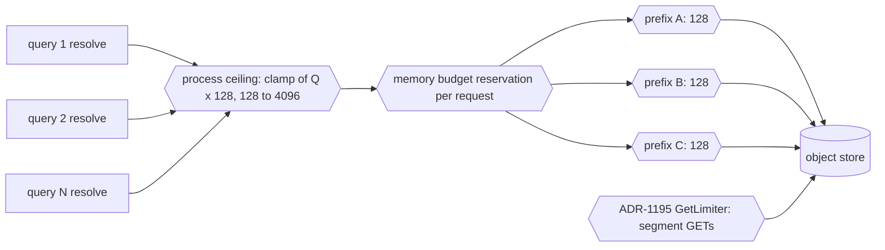

# ADR-1733: catalog resolve request concurrency derivation

Status: Accepted (2026-09-16). Issue #1733. Relates to ADR-1195, which it
leaves unchanged.

## Context

`Catalog` bounds its resolve-path object-store requests with one semaphore
sized from `resolve_get_concurrency`
(`crates/ravel-catalog/src/catalog.rs:644-646`). Every LIST page and every
record GET on the resolve path takes a permit from it
(`crates/ravel-catalog/src/catalog.rs:833`, `:978`, `:2423`, `:2641`,
`:3057`), and the same number sets the width of every shard and bucket
fan-out (`crates/ravel-catalog/src/catalog.rs:2349`, `:2557`, `:2595`,
`:3109`, `:3159`, `:3184`).

The default is `DEFAULT_RESOLVE_GET_CONCURRENCY = 128`
(`crates/ravel-catalog/src/config.rs:177`). Its doc comment justifies the
value with S3's per-prefix guidance: at a 30 ms round trip, 128 in flight
sustains about 4,300 GET/s, under the published 5,500 GET/s per prefix, and
every bounded request lands under one `m/c/<shard>/<hour>/` prefix per
shard-hour (`crates/ravel-catalog/src/config.rs:156-168`). The same comment
then states that the bound is per `Catalog` instance, that `ravel-server`
builds exactly one instance and shares it, so N concurrent queries hold 128
requests in flight in total, and that a process-wide cap is "not
implemented here" (`crates/ravel-catalog/src/config.rs:169-176`).

Those two paragraphs describe two different limits with one number. The
per-prefix arithmetic bounds what one shard-hour prefix should see. The
semaphore bounds what the whole process issues, across every tenant, shard,
and hour at once. A resolve of a cold tenant spans many prefixes, and two
concurrent resolves of two tenants share nothing at the store, yet both
queue on the same 128 permits. That is the throughput ceiling #1733 reports:
adding CPU to a process does not move it.

The ticket's "Effect" is partly wrong and is corrected here. An operator can
already raise the bound: `--catalog-resolve-concurrency`
(`services/ravel-server/src/config.rs:1333-1343`) reaches `build_catalog`
(`services/ravel-server/src/query.rs:107-143`) and is accepted up to
`MAX_RESOLVE_GET_CONCURRENCY = 4_096`
(`crates/ravel-catalog/src/config.rs:179-190`,
`services/ravel-server/src/config.rs:4341-4355`). What is missing is a
default that scales, and a per-prefix bound that stays put when the process
bound rises. Setting 4,096 today puts 4,096 requests on one hot prefix, about
twenty-five times the guidance the constant's own doc cites.

Two neighbours matter. ADR-1195 made segment GET concurrency one
process-owned `GetLimiter` (`crates/ravel-query/src/limiter.rs:29-32`) shared
by every fetcher (`services/ravel-server/src/query.rs:357-394`), with a
derived default `max(8, 2 x cores)` from `MIN_DERIVED_FETCH_CONCURRENCY` and
`FETCH_CONCURRENCY_PER_CORE`
(`services/ravel-server/src/config.rs:2212-2217`). And the process's query
concurrency is `--max-concurrent-queries`, a fleet-global cap reconciled to
a local threshold, `Unlimited` when unset
(`services/ravel-server/src/config.rs:781-794`,
`crates/ravel-query/src/query_admission.rs:103-107`, `:284`).

## Decision

1. **Two limits with two meanings.** The catalog resolve path gets a
   per-prefix bound and a per-process ceiling, and a request holds both
   before it is issued. The per-prefix bound is keyed by the shard-hour
   commit prefix `t/<tenant_hash>/<signal>/c/<shard>/<ingest_hour>/`
   (docs/catalog-and-mvcc.md, key layout), the unit the S3 guidance is
   stated against (superseded: see the parent-path keying amendment below).
   Its default is 128, the value
   `DEFAULT_RESOLVE_GET_CONCURRENCY` holds today, renamed to say what it
   bounds. It is a `CatalogConfig` field with no CLI flag: the guidance
   does not vary by deployment, and a flag is added only if a measurement
   shows a backend that needs one. Prefix semaphores are created lazily
   and dropped when idle, so the map is bounded by the prefixes a process
   has in flight, not by the bucket's history.

2. **The per-process ceiling is derived from query concurrency.** The
   derivation is `ceiling = clamp(Q x 128, 128, 4_096)`, where 128 is the
   per-prefix bound of decision 1 and 4,096 is
   `MAX_RESOLVE_GET_CONCURRENCY`. `Q` is the process's query concurrency:
   the configured `--max-concurrent-queries` value when it is `Bounded`
   (the effective threshold starts at the cap and only reconciles
   downward), and `max(8, 2 x cores)` when it is `Unlimited`, the same
   estimate of per-process query parallelism ADR-1195's derived defaults
   use. `--catalog-resolve-concurrency` keeps its name and keeps setting
   the process ceiling, which is what its semaphore has always bounded, so
   an operator who set a value keeps that value; only the unset default
   moves. Zero and values above 4,096 stay refused at startup.
   `build_catalog` takes the derived ceiling as its input rather than the
   constant, and `ravel-server` logs the resolved value beside the other
   derived performance defaults.

3. **In-flight memory is bounded by reservation, not by a second count.**
   A record GET on the resolve path reserves the object's listed size from
   the process memory budget (ADR-1170, `crates/ravel-memory`) before it is
   issued, and releases it when the record is decoded; a LIST page reserves
   a fixed page allowance. The size is known before the GET because the
   resolve path lists before it fetches. A request that cannot reserve
   waits the way one that cannot get a permit waits. The ceiling therefore
   never admits more bytes in flight than the budget's catalog share,
   whatever `Q` derives to. Until the reservation wiring lands, the
   implementation caps the derived ceiling at 1,024 and says so in the
   startup log line, so a large `Q` cannot outrun the budget on a host that
   has not been measured.

4. **The catalog limiter stays separate from ADR-1195's `GetLimiter`.**
   The two bound different phases with different request sizes. The
   catalog limiter covers resolve (LIST pages and kilobyte-scale commit
   records); `GetLimiter` covers scan (megabyte-scale segment GETs). Cost is
   reported per phase, and one pooled limiter would let a resolve storm
   starve segment fetches or the reverse. Both are process-owned `Arc`s
   with the same "process-wide, not node-wide" scope ADR-1195 states.

5. **The per-resolve request count is not changed here.** The ticket's
   third fix, fewer requests per cold resolve, belongs to the catalog
   snapshot and fold (ADR-0003), which already convert an unsealed tail's
   many records into a sealed snapshot's few objects. This ADR sizes the
   limiter for the requests a resolve does issue.

## Rejected alternatives

- **Derive the default from cores alone.** Cores measure decode capacity,
  not how many queries share the pool. The ticket's own observation is
  that concurrent queries share one pool, and query concurrency measures
  that directly. `Q` falls back to the core formula only when the operator
  has set no query ceiling at all.
- **Make the limiter purely per-prefix and drop the process ceiling.**
  Nothing then bounds the aggregate: N queries over M prefixes could hold
  N x M x 128 requests and their bytes in flight. The process ceiling is
  what makes the memory bound of decision 3 a bound.
- **Fold catalog requests into `GetLimiter`.** It loses per-phase cost
  attribution, mixes kilobyte records with megabyte segments under one
  permit count, and couples two phases that should not starve each other.
- **A semaphore per resolve.** N resolves would hold N x 128 permits with
  no ceiling, the per-instance multiplication ADR-1195 removed for
  fetchers.
- **Raise the constant to 4,096 and stop there.** On a single hot prefix
  that is twenty-five times the guidance the constant cites, and a
  `503 SlowDown` generator on a cold tail that lives under one shard-hour.
- **Bound in-flight memory with a second count instead of reservations.**
  A count assumes a record size; commit records vary and a count that is
  safe for the largest is wrong for the typical. The budget reserves the
  listed size, which is the quantity that matters.

## Consequences

- For an operator: `--catalog-resolve-concurrency` keeps its meaning (the
  process ceiling) and any explicit value is honoured unchanged. The unset
  default moves: a process with `--max-concurrent-queries 4` derives 512;
  an 8-core host with no query ceiling derives `Q = 16`, so 2,048, capped
  at 1,024 until the reservation wiring lands; a 16-core host derives the
  same 1,024 for the same reason. The startup log names the derived value
  and which input produced it. The flags reference and the operations
  guide state the derivation.
- A single cold resolve whose records sit under one shard-hour prefix runs
  at the same speed as today: 128 in flight on that prefix (the keying this
  sentence assumes is superseded by the parent-path keying amendment below,
  which does not change the figure for this case). What changes is
  that a second concurrent resolve on another prefix no longer waits for
  the first. Throughput scales across queries and prefixes, not within one
  prefix.
- The constant's doc comment stops describing two limits with one number:
  the per-prefix paragraph moves to the per-prefix constant, and the
  "process-wide cap not implemented" sentence is deleted, because it now
  is.
- CLI invocations and tests that build their own `Catalog` keep a
  per-instance ceiling, as they do today; the derivation lives in
  `ravel-server`'s `build_catalog`, the one place that knows `Q`.
- ADR-1195 is unchanged. Its `GetLimiter` gains a sibling, not a tenant.
- Follow-up work, as tasks:
  1. ravel-catalog: split the limiter into the per-prefix map and the
     process ceiling, take the ceiling as configuration, and add
     `resolve_bounded_listing::two_concurrent_resolves_share_the_derived_in_flight_ceiling`,
     which drives two resolves over a counting store and asserts the exact
     peak (128 for one prefix, the ceiling across two).
  2. ravel-server: derive the ceiling in `build_catalog` from
     `QueryConcurrencyLimit` and the core formula, log it, and add the test
     that `build_catalog` passes the derived value rather than the
     constant.
  3. Memory: wire the ADR-1170 reservation into `guarded_get` and the LIST
     page path, then remove the 1,024 interim cap in the same commit.
  4. Docs: `docs/reference/ravel-server-flags.md` and
     `docs/guides/operations.md` state the derivation; the constant's doc
     comment is rewritten as above.
  5. Measurement: pre-register two concurrent cold resolves on two tenants
     against the ADR's expected band (about 2x the single-resolve
     throughput) before the change lands, and record the result on the
     ticket.

## Amendment: the per-prefix bound is keyed by a request's parent path
<!-- amendment-applies: sections="Decision|Consequences" pointer="parent-path keying amendment" -->

Decision 1 keys the per-prefix bound by the shard-hour commit prefix
`t/<tenant_hash>/<signal>/c/<shard>/<ingest_hour>/`. The implementation keys
every resolve-path request by its own parent path instead: everything in the
key up to and including its last separator, whatever kind of object it names
(`request_key_prefix` in `crates/ravel-catalog/src/catalog.rs`).

The reason is that decision 1's key left most of the resolve path unbounded.
A commit record's parent path IS its shard-hour commit prefix, so commit
records keep exactly the keying decision 1 names. But a resolve of a folded
tenant reads a snapshot's parts, which all share
`t/<tenant_hash>/catalog/<signal>/snap/`, and its postings and column stats,
which share `.../idx/`. Those fan-outs run at the process ceiling's width,
so under decision 1's key they took no prefix permit at all: raising the
ceiling to 1,024 put 1,024 requests on one directory, which is the single
thing the per-prefix bound exists to prevent, and the arithmetic behind the
128 (S3's per-prefix guidance) applies to those prefixes exactly as it
applies to a shard-hour. A LIST prefix already ends at a separator and so is
keyed by itself.

Nothing else in the ADR moves. The bound's value, its lack of a CLI flag,
the lazy creation and idle removal of its semaphores, and the derivation of
the process ceiling in decision 2 are unchanged, and no case that decision 1
bounded is bounded more loosely now.
